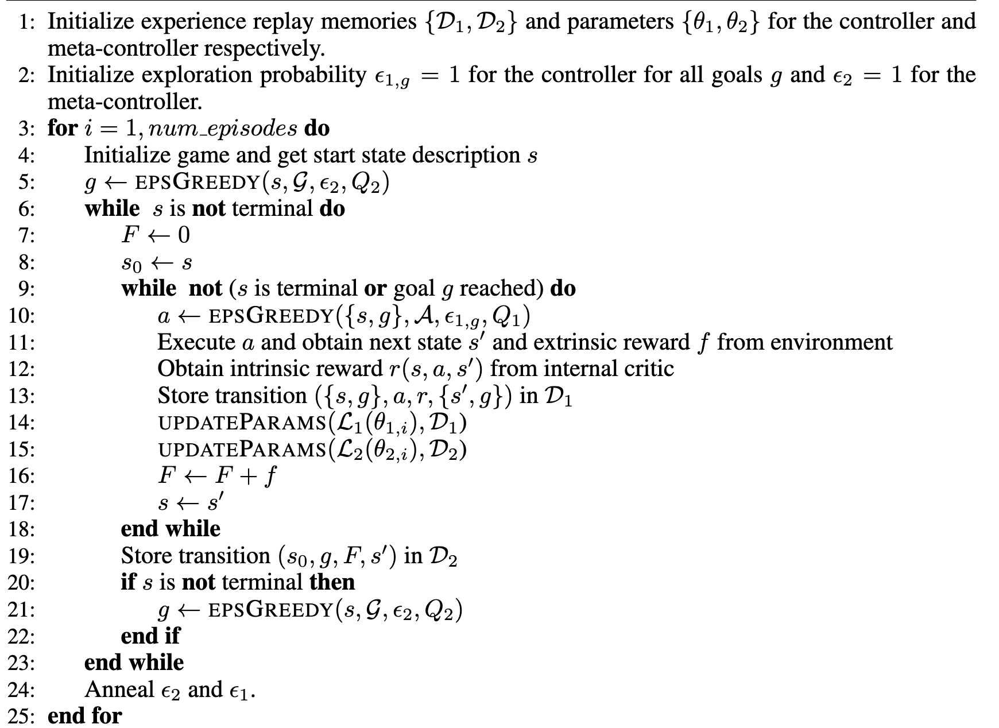

# Hierarchical DQN

## 原理简介

Hierarchical DQN是一种分层强化学习方法，与DQN相比增加了一个meta controller，

即学习时，meta controller每次会生成一个goal，然后controller或者说下面的actor就会达到这个goal，直到done为止。这就相当于给agent增加了一个队长，队长擅长制定局部目标，指导agent前行，这样应对一些每回合步数较长或者稀疏奖励的问题会有所帮助。

## 伪代码

