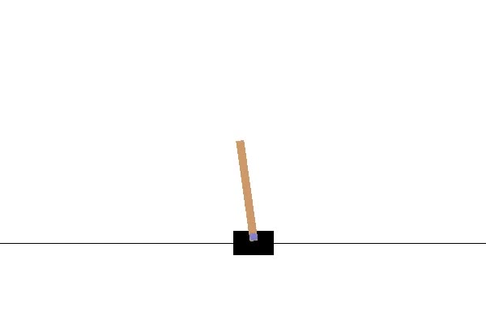

在练习本项目之前，可以先回顾一下之前的项目实战，即使用Q学习解决悬崖寻路问题。本项目将具体实现DQN算法来解决推车杆问题，对应的模拟环境为Open AI Gym中的[CartPole-v0](https://datawhalechina.github.io/easy-rl/#/chapter7/project2?id=cartpole-v0)，我们同样先对该环境做一个简要说明。

## CartPole-v0 简介

CartPole-v0是一个经典的入门环境，如下图，它通过向左(动作=0)或向右(动作=1)推动推车来实现竖直杆的平衡，每次实施一个动作后如果能够继续保持平衡就会得到一个+1的奖励，否则杆将无法保持平衡而导致游戏结束。



我们来看看这个环境的一些参数，执行以下代码：

```python
import gym
env = gym.make('CartPole-v0')  # 建立环境
env.seed(1) # 随机种子
state_dim = env.observation_space.shape[0] # 状态维度
action_dim = env.action_space.n # 动作维度
state = env.reset() # 初始化环境
print(f"状态维度：{state_dim}，动作维度：{action_dim}")
print(f"初始状态：{state}")
```

可以得到结果：

```bash
状态维度：4，动作维度：2
初始状态：[ 0.03073904  0.00145001 -0.03088818 -0.03131252]
```

该环境状态维度是四个，分别为车的位置、车的速度、杆的角度以及杆顶部的速度，动作维度为两个，并且是离散的向左或者向右。理论上达到最优化算法的情况下，推车杆是一直能保持平衡的，也就是每回合的步数是无限，但是这不方便训练，所以环境内部设置了每回合的最大步数为200，也就是说理想情况下，只需要我们每回合的奖励达到200就算训练完成。

## DQN基本接口

介绍完环境之后，我们沿用接口的概念，通过分析伪代码来实现DQN的基本训练模式，以及一些要素比如建立什么网络需要什么模块等等。我们现在常用的DQN伪代码如下：

> 初始化经验回放缓冲区(replay memory)$D$，容量(capacity)为$N$
>
> 初始化状态-动作函数，即带有初始随机权重$\theta$的$Q$网络
>
> 初始化目标状态-动作函数，即带有初始随机权重$\theta^-$的$\hat{Q}$网络，且$\theta^-=\theta$
>
> 执行$M$个回合循环，对于每个回合
>
> * 初始化环境，得到初始状态$s_1$
> * 循环$T$个时间步长，对于每个时步$t$
>   * 使用$\epsilon-greedy$策略选择动作$a_t$
>   * 环境根据$a_t$反馈当前的奖励$r_t$和下一个状态$s_{t+1}$
>   * 更新状态$s_{t+1}=s_t$
>   * 存储转移(transition)即$(s_t,a_t,r-t,s_{t+1})$到经验回放$D$中
>   * (更新策略)从$D$随机采样一个小批量的转移
>   * (更新策略)计算实际的Q值$y_{j}=\left\{\begin{array}{cc}r_{j} & \text { 如果回合在时步 j+1终止 }\\ r_{j}+\gamma \max _{a^{\prime}} \hat{Q}\left(\phi_{j+1}, a^{\prime} ; \theta^{-}\right) & \text {否则 }\end{array}\right.$
>   * (更新策略)对损失函数$\left(y_{j}-Q\left(\phi_{j}, a_{j} ; \theta\right)\right)^{2}$关于参数$\theta$做梯度下降
>   * (更新策略)每$C$步重置$\hat{Q}=Q$

用代码来实现的话如下：

```python
rewards = [] # 记录奖励
    ma_rewards = []  # 记录滑动平均奖励
    for i_ep in range(cfg.train_eps):
        state = env.reset()
        done = False
        ep_reward = 0
        while True:
            action = agent.choose_action(state)
            next_state, reward, done, _ = env.step(action)
            ep_reward += reward
            agent.memory.push(state, action, reward, next_state, done)
            state = next_state
            agent.update()
            if done:
                break
        if (i_ep+1) % cfg.target_update == 0:
            agent.target_net.load_state_dict(agent.policy_net.state_dict())
        if (i_ep+1)%10 == 0:
            print('回合：{}/{}, 奖励：{}'.format(i_ep+1, cfg.train_eps, ep_reward))
        rewards.append(ep_reward)
        # save ma_rewards
        if ma_rewards:
            ma_rewards.append(0.9*ma_rewards[-1]+0.1*ep_reward)
        else:
            ma_rewards.append(ep_reward)
```


可以看到，DQN的训练模式其实和大多强化学习算法是一样的套路，但与传统的Q学习算法相比，DQN使用神经网络来代替之前的Q表格从而存储更多的信息，且由于使用了神经网络所以我们一般需要利用随机梯度下降来优化Q值的预测。此外多了经验回放缓冲区(replay memory)，并且使用两个网络，即目标网络和当前网络。

## 经验回放缓冲区

从伪代码中可以看出来，经验回放缓冲区的功能有两个，一个是将每一步采集的转移(transition，包括状态，动作，奖励，下一时刻的状态)存储到缓冲区中，并且缓冲区具备一定的容量(capacity)，另一个是在更新策略的时候需要随机采样小批量的转移进行优化。因此我们可以定义一个ReplayBuffer类，包括push和sample两个函数，用于存储和采样。

```python
import random
class ReplayBuffer:
    def __init__(self, capacity):
        self.capacity = capacity # 经验回放的容量
        self.buffer = [] # 缓冲区
        self.position = 0 
    
    def push(self, state, action, reward, next_state, done):
        ''' 缓冲区是一个队列，容量超出时去掉开始存入的转移(transition)
        '''
        if len(self.buffer) < self.capacity:
            self.buffer.append(None)
        self.buffer[self.position] = (state, action, reward, next_state, done)
        self.position = (self.position + 1) % self.capacity 
    
    def sample(self, batch_size):
        batch = random.sample(self.buffer, batch_size) # 随机采出小批量转移
        state, action, reward, next_state, done =  zip(*batch) # 解压成状态，动作等
        return state, action, reward, next_state, done
    def __len__(self):
        ''' 返回当前存储的量
        '''
        return len(self.buffer)
```

## Q网络

在DQN中我们使用神经网络替代原有的Q表，从而能够存储更多的Q值，实现更为高级的策略以便用于复杂的环境，这里我们用的是一个三层的感知机或者说全连接网络：

```python
class MLP(nn.Module):
    def __init__(self, input_dim,output_dim,hidden_dim=128):
        """ 初始化q网络，为全连接网络
            input_dim: 输入的特征数即环境的状态维度
            output_dim: 输出的动作维度
        """
        super(MLP, self).__init__()
        self.fc1 = nn.Linear(input_dim, hidden_dim) # 输入层
        self.fc2 = nn.Linear(hidden_dim,hidden_dim) # 隐藏层
        self.fc3 = nn.Linear(hidden_dim, output_dim) # 输出层
        
    def forward(self, x):
        # 各层对应的激活函数
        x = F.relu(self.fc1(x)) 
        x = F.relu(self.fc2(x))
        return self.fc3(x)
```

学过深度学习的同学应该都对这个网络十分熟悉，在强化学习中，网络的输入一般是状态，输出则是一个动作，假如总共有两个动作，那么这里的动作维度就是2，可能的输出就是0或1，一般我们用ReLU作为激活函数。根据实际需要也可以改变神经网络的模型结构等等，比如若我们使用图像作为输入的话，这里可以使用卷积神经网络(CNN)。

## DQN算法

跟前面的项目实战一样，DQN算法一般也包括选择动作和更新策略两个函数，首先我们看选择动作：

```python
def choose_action(self, state):
        '''选择动作
        '''
        self.frame_idx += 1
        if random.random() > self.epsilon(self.frame_idx):
            with torch.no_grad():
                state = torch.tensor([state], device=self.device, dtype=torch.float32)
                q_values = self.policy_net(state)
                action = q_values.max(1)[1].item() # 选择Q值最大的动作
        else:
            action = random.randrange(self.action_dim)
```

可以看到跟Q学习算法其实是一样的，都是用的$\epsilon-greedy$策略，只是使用神经网络的话我们需要通过Torch或者Tensorflow工具来处理相应的数据。

而DQN更新策略的步骤稍微复杂一点，主要包括三个部分：随机采样，计算期望Q值和梯度下降，如下：

```python
def update(self):
        if len(self.memory) < self.batch_size: # 当memory中不满足一个批量时，不更新策略
            return
        # 从经验回放中(replay memory)中随机采样一个批量的转移(transition)
        state_batch, action_batch, reward_batch, next_state_batch, done_batch = self.memory.sample(
            self.batch_size)
        # 转为张量
        state_batch = torch.tensor(
            state_batch, device=self.device, dtype=torch.float)
        action_batch = torch.tensor(action_batch, device=self.device).unsqueeze(
            1)  
        reward_batch = torch.tensor(
            reward_batch, device=self.device, dtype=torch.float)  
        next_state_batch = torch.tensor(
            next_state_batch, device=self.device, dtype=torch.float)
        done_batch = torch.tensor(np.float32(
            done_batch), device=self.device)
        q_values = self.policy_net(state_batch).gather(dim=1, index=action_batch) # 计算当前状态(s_t,a)对应的Q(s_t, a)
        next_q_values = self.target_net(next_state_batch).max(1)[0].detach() # 计算下一时刻的状态(s_t_,a)对应的Q值
        # 计算期望的Q值，对于终止状态，此时done_batch[0]=1, 对应的expected_q_value等于reward
        expected_q_values = reward_batch + self.gamma * next_q_values * (1-done_batch)
        loss = nn.MSELoss()(q_values, expected_q_values.unsqueeze(1))  # 计算均方根损失
        # 优化更新模型
        self.optimizer.zero_grad()  
        loss.backward()
        for param in self.policy_net.parameters():  # clip防止梯度爆炸
            param.grad.data.clamp_(-1, 1)
        self.optimizer.step() 
```

## 结果分析

完成代码之后，我们先来看看DQN算法的训练效果，曲线如下：


从图中看出，算法其实已经在60回合左右达到收敛，最后一直维持在最佳奖励200左右，可能会有轻微的波动，这是因为我们在收敛的情况下依然保持了一定的探索率，即epsilon_end=0.01。现在我们可以载入模型看看测试的效果：


我们测试了30个回合，每回合都保持在200左右，说明我们的模型学习得不错了！