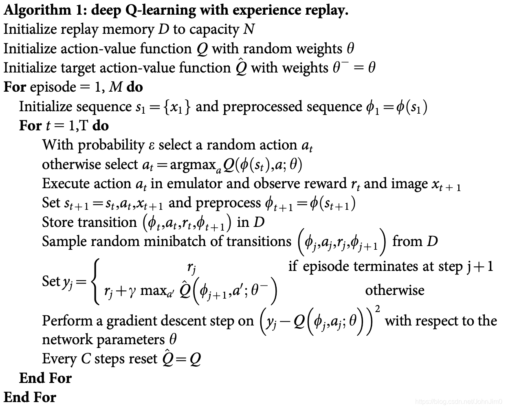

在练习本项目之前，可以先回顾一下之前的项目实战，即使用Q学习解决悬崖寻路问题。本项目将具体实现DQN算法来解决推车杆问题，对应的模拟环境为Open AI Gym中的[CartPole-v0](https://datawhalechina.github.io/easy-rl/#/chapter7/project2?id=cartpole-v0)，我们同样先对该环境做一个简要说明。

## CartPole-v0环境简介

CartPole-v0是一个经典的入门环境，如下图，它通过向左(动作=0)或向右(动作=1)推动推车来实现竖直杆的平衡，每次实施一个动作后如果能够继续保持平衡就会得到一个+1的奖励，否则杆将无法保持平衡而导致游戏结束。


我们来看看这个环境的一些参数，执行以下代码：

```python
import gym
env = gym.make('CartPole-v0')  # 建立环境
env.seed(1) # 随机种子
n_states = env.observation_space.shape[0] # 状态数
n_actions = env.action_space.n # 动作数
state = env.reset() # 初始化环境
print(f"状态数：{n_states}，动作数：{n_actions}")
print(f"初始状态：{state}")
```

可以得到结果：

```bash
状态数：4，动作数：2
初始状态：[ 0.03073904  0.00145001 -0.03088818 -0.03131252]
```

该环境状态数是四个，分别为车的位置、车的速度、杆的角度以及杆顶部的速度，动作数为两个，并且是离散的向左或者向右。

## DQN基本接口

介绍完环境之后，我们沿用接口的概念，通过分析伪代码来实现DQN的基本训练模式，以及一些要素比如建立什么网络需要什么模块等等。我们现在常用的DQN伪代码如下：



与传统的Q学习算法相比，DQN使用神经网络来代替之前的Q表格从而存储更多的信息，且由于使用了神经网络所以我们一般需要利用随机梯度下降来优化Q值的预测。此外多了经验回放缓冲区(replay memory)，并且使用两个网络，即目标网络和当前网络。

## 经验回放缓冲区

从伪代码中可以看出来，经验回放缓冲区的功能有两个，一个是将每一步采集的转移(transition，包括状态，动作，奖励，下一时刻的状态)存储到缓冲区中，并且缓冲区具备一定的容量(capacity)，另一个是在更新策略的时候需要随机采样小批量的转移进行优化。因此我们可以定义一个ReplayBuffer类，包括push和sample两个函数，用于存储和采样。

```python
import random
class ReplayBuffer:
    def __init__(self, capacity):
        self.capacity = capacity # 经验回放的容量
        self.buffer = [] # 缓冲区
        self.position = 0 
    
    def push(self, state, action, reward, next_state, done):
        ''' 缓冲区是一个队列，容量超出时去掉开始存入的转移(transition)
        '''
        if len(self.buffer) < self.capacity:
            self.buffer.append(None)
        self.buffer[self.position] = (state, action, reward, next_state, done)
        self.position = (self.position + 1) % self.capacity 
    
    def sample(self, batch_size):
        batch = random.sample(self.buffer, batch_size) # 随机采出小批量转移
        state, action, reward, next_state, done =  zip(*batch) # 解压成状态，动作等
        return state, action, reward, next_state, done
```

