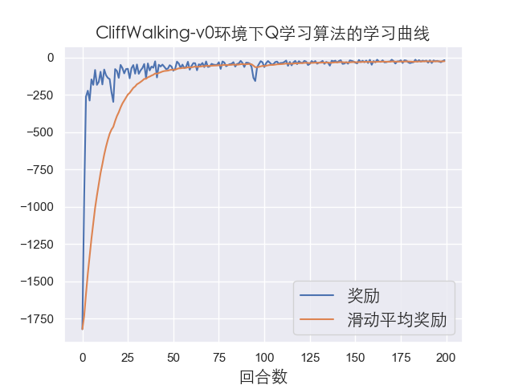

# 使用Q学习解决悬崖寻路问题

强化学习在运动规划方面也有很大的应用前景，已有很多适用于强化学习的相关仿真环境，小到迷宫，大到贴近真实的自动驾驶环境[CARLA](http://carla.org/)。本次使用[OpenAI Gym](https://gym.openai.com/)开发的CliffWalking-v0环境，带大家入门Q学习算法的代码实战。

## CliffWalking-v0环境简介

我们首先简单介绍一下这个环境，该环境中文名叫悬崖寻路（CliffWalking），是一个迷宫类问题。如下图，在一个4 x 12的网格中，智能体以网格的左下角位置为起点，以网格的下角位置为终点，目标是移动智能体到达终点位置，智能体每次可以在上、下、左、右这4个方向中移动一步，每移动一步会得到-1单位的奖励。

<div align=center>

</div>
起终点之间是一段悬崖，即编号为37～46的网格，智能体移动过程中会有如下的限制：

* 智能体不能移出网格边界，如果智能体想执行某个动作移出网格，那么这一步智能体不会移动，但是这个操作依然会得到-1单位的奖励
* 如果智能体“掉入悬崖” ，会立即回到起点位置，并得到-100单位的奖励
* 当智能体移动到终点时，该回合结束，该回合总奖励为各步奖励之和

我们的目标是以最少的步数到达终点，容易看出最少需要13步智能体才能从起点到终点，因此最佳算法收敛的情况下，每回合的总奖励应该是-13，这样人工分析出期望的奖励也便于我们判断算法的收敛情况作出相应调整。

现在我们可以在代码中定义环境，如下：

```python
import gym # 导入gym模块
from envs.gridworld_env import CliffWalkingWapper # 导入自定义装饰器

env = gym.make('CliffWalking-v0')  # 定义环境
env = CliffWalkingWapper(env) # 装饰环境
```

这里我们在程序中使用了一个装饰器重新定义环境，但不影响对环境的理解，感兴趣的同学具体看相关代码。可以由于gym环境封装得比较好，所以我们想要使用这个环境只需要使用gym.make命令输入函数名即可，然后我们可以查看环境的状态和动作维度目：

```python
state_dim = env.observation_space.n # 状态维度
action_dim = env.action_space.n # 动作维度
print(f"状态维度：{state_dim}，动作维度：{action_dim}")
```

打印出来的结果如下：

```bash
状态维度：48，动作维度：4
```

我们的状态维度是48个，这里我们设置的是智能体当前所在网格的编号，而动作维度是4，这表示有0，1，2，3对应着上下左右四个动作。另外我们也可以初始化环境并打印当前所在的状态：

```python
state = env.reset()
print(state)
```

结果显示为：

```bash
36
```

也就是说当前智能体的状态即当前所在的网格编号是36，正好对应我们前面讲到的起点。

## 强化学习基本接口

这里所说的接口就是一般强化学习的训练模式，也是大多数算法伪代码遵循的套路，步骤如下：

* 初始化环境和智能体
* 对于每个回合，智能体选择动作
* 环境接收动作反馈下一个状态和奖励
* 智能体进行策略更新(学习)
* 多个回合算法收敛之后保存模型以及做后续的分析画图等

代码如下：

```python
env = gym.make('CliffWalking-v0')  # 定义环境
env = CliffWalkingWapper(env) # 装饰环境
env.seed(1) # 设置随机种子
state_dim = env.observation_space.n # 状态维度
action_dim = env.action_space.n # 动作维度
agent = QLearning(state_dim,action_dim,cfg) # cfg存储算法相关参数
for i_ep in range(cfg.train_eps): # cfg.train_eps表示最大训练的回合数
    ep_reward = 0  # 记录每个回合的奖励
    state = env.reset()  # 重置环境
    while True: 
        action = agent.choose_action(state)  # 算法选择一个动作
        next_state, reward, done, _ = env.step(action)  # 环境根据动作反馈奖励和下一个状态
        agent.update(state, action, reward, next_state, done)  # 算法更新
        state = next_state  # 更新状态
        ep_reward += reward
        if done: # 终止状态提前停止
            break
```

通常我们会记录并分析奖励的变化，所以在接口基础上加一些变量记录每回合的奖励，此外由于强化学习学习过程得到的奖励可能会产生振荡，因此我们也适用一个滑动平均的量来反映奖励变化的趋势，如下：

```bash
rewards = []  
ma_rewards = [] # 滑动平均奖励
for i_ep in range(cfg.train_eps):
    ep_reward = 0  # 记录每个回合的奖励
    state = env.reset()  # 重置环境, 重新开一局（即开始新的一个回合）
    while True:
        action = agent.choose_action(state)  # 根据算法选择一个动作
        next_state, reward, done, _ = env.step(action)  # 与环境进行一次动作交互
        agent.update(state, action, reward, next_state, done)  # Q-learning算法更新
        state = next_state  # 存储上一个观察值
        ep_reward += reward
        if done:
            break
rewards.append(ep_reward)
if ma_rewards:
    ma_rewards.append(ma_rewards[-1]*0.9+ep_reward*0.1)
    else:
        ma_rewards.append(ep_reward)
```

## Q学习算法

了解了基本接口之后，现在我们看看Q学习算法具体是怎么实现的，前面讲到智能体其实在整个训练中就做两件事，一个是选择动作，一个是更新策略，所以我们可以定义一个Qlearning类，里面主要包含两个函数choose_action和update。

我们先看看choose_action函数是怎么定义的，如下：

```python
def choose_action(self, state):
      self.sample_count += 1
      self.epsilon = self.epsilon_end + (self.epsilon_start - self.epsilon_end) 
          math.exp(-1. * self.sample_count / self.epsilon_decay) # epsilon是会递减的，这里选择指数递减
      # e-greedy 策略
      if np.random.uniform(0, 1) > self.epsilon:
          action = np.argmax(self.Q_table[str(state)]) # 选择Q(s,a)最大对应的动作
      else:
          action = np.random.choice(self.action_dim) # 随机选择动作
      return action
```


一般我们使用$\varepsilon-greedy$策略选择动作，我们的输入就是当前的状态，随机选取一个值，当这个值大于我们设置的$\varepsilon$时，我们选取Q值最大对应的动作，否则随机选择动作，这样就能在训练中让智能体保持一定的探索率，这也是平衡探索与利用的技巧之一。

下面是我们要实现的策略更新函数：

```python
def update(self, state, action, reward, next_state, done):
        Q_predict = self.Q_table[str(state)][action] 
        if done: # 终止状态
            Q_target = reward  
        else:
            Q_target = reward + self.gamma * np.max(self.Q_table[str(next_state)]) 
        self.Q_table[str(state)][action] += self.lr * (Q_target - Q_predict)
```

这里面实现的逻辑就是伪代码中的更新公式：


注意终止状态下，我们是获取不到下一个动作的，我们直接将Q值（Q_target）更新为对应的奖励即可。

## 结果分析

到现在我们就基本完成了Q学习的代码实现，具体可以查看github上的源码，运行代码结果如下：



由于这个环境比较简单，可以看到算法很快达到收敛，然后我们再测试我们训练好的模型，一般测试模型只需要20到50左右的回合数即可：


这里我们测试的回合数为30，可以看到每个回合智能体都达到了最优的奖励，说明我们的算法训练的效果很不错！
