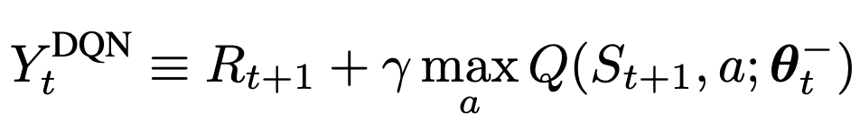
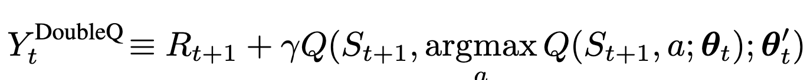
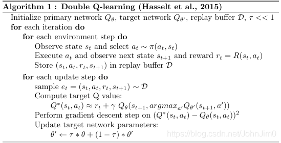
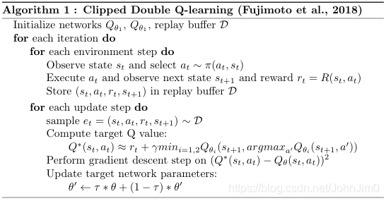
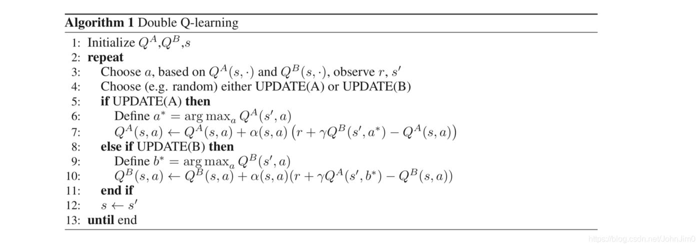

食用本篇之前，需要有DQN算法的基础，参考[DQN算法实战](../DQN)。

## 原理简介

Double-DQN是2016年提出的算法，灵感源自2010年的Double-Qlearning，可参考论文[Deep Reinforcement Learning with Double Q-learning](https://arxiv.org/abs/1509.06461)。
跟Nature DQN一样，Double-DQN也用了两个网络，一个当前网络(对应用$Q$表示)，一个目标网络(对应一般用$Q'$表示，为方便区分，以下用$Q_{tar}$代替)。我们先回忆一下，对于非终止状态，目标$Q_{tar}$值计算如下


而在Double-DQN中，不再是直接从目标$Q_{tar}$网络中选择各个动作中的最大$Q_{tar}$值，而是先从当前$Q$网络选择$Q$值最大对应的动作，然后代入到目标网络中计算对应的值：

Double-DQN的好处是Nature DQN中使用max虽然可以快速让Q值向可能的优化目标靠拢，但是很容易过犹不及，导致过度估计(Over Estimation)，所谓过度估计就是最终我们得到的算法模型有很大的偏差(bias)。为了解决这个问题， DDQN通过解耦目标Q值动作的选择和目标Q值的计算这两步，来达到消除过度估计的问题，感兴趣可以阅读原论文。

伪代码如下：

当然也可以两个网络可以同时为当前网络和目标网络，如下：

或者这样更好理解如何同时为当前网络和目标网络：


## 代码实战
完整程序见[github](https://github.com/JohnJim0816/reinforcement-learning-tutorials/tree/master/DoubleDQN)。结合上面的原理，其实Double DQN改进来很简单，基本只需要在```update```中修改几行代码，如下：
```python
'''以下是Nature DQN的q_target计算方式
next_q_state_value = self.target_net(
next_state_batch).max(1)[0].detach()  # # 计算所有next states的Q'(s_{t+1})的最大值，Q'为目标网络的q函数,比如tensor([ 0.0060, -0.0171,...,])
#计算 q_target
#对于终止状态，此时done_batch[0]=1, 对应的expected_q_value等于reward
q_target = reward_batch + self.gamma * next_q_state_value * (1-done_batch[0])
'''
'''以下是Double DQNq_target计算方式，与NatureDQN稍有不同'''
next_target_values = self.target_net(
next_state_batch)
#选出Q(s_t‘, a)对应的action，代入到next_target_values获得target net对应的next_q_value，即Q’(s_t|a=argmax Q(s_t‘, a))
next_target_q_value = next_target_values.gather(1, torch.max(next_q_values, 1)[1].unsqueeze(1)).squeeze(1)
q_target = reward_batch + self.gamma * next_target_q_value * (1-done_batch[0])
```
reward变化结果如下：

其中下边蓝色和红色分别表示Double DQN和Nature DQN在训练中的reward变化图，而上面蓝色和绿色则表示Double DQN和Nature DQN在测试中的reward变化图。