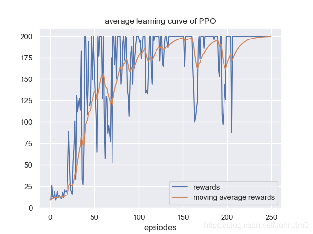

## 原理简介

PPO是一种on-policy算法，具有较好的性能，其前身是TRPO算法，也是policy gradient算法的一种，它是现在 OpenAI 默认的强化学习算法，具体原理可参考[PPO算法讲解](https://datawhalechina.github.io/easy-rl/#/chapter5/chapter5)。PPO算法主要有两个变种，一个是结合KL penalty的，一个是用了clip方法，本文实现的是后者即```PPO-clip```。
## 伪代码
要实现必先了解伪代码，伪代码如下：

这是谷歌找到的一张比较适合的图，本人比较懒就没有修改，上面的```k```就是第```k```个episode，第六步是用随机梯度下降的方法优化，这里的损失函数(即```argmax```后面的部分)可能有点难理解，可参考[PPO paper](https://arxiv.org/abs/1707.06347)，如下：

第七步就是一个平方损失函数，即实际回报与期望回报的差平方。
## 代码实战
[点击查看完整代码](https://github.com/JohnJim0816/rl-tutorials/tree/master/PPO)
### PPOmemory
首先第三步需要搜集一条轨迹信息，我们可以定义一个```PPOmemory```来存储相关信息：
```python
class PPOMemory:
    def __init__(self, batch_size):
        self.states = []
        self.probs = []
        self.vals = []
        self.actions = []
        self.rewards = []
        self.dones = []
        self.batch_size = batch_size
    def sample(self):
        batch_step = np.arange(0, len(self.states), self.batch_size)
        indices = np.arange(len(self.states), dtype=np.int64)
        np.random.shuffle(indices)
        batches = [indices[i:i+self.batch_size] for i in batch_step]
        return np.array(self.states),\
                np.array(self.actions),\
                np.array(self.probs),\
                np.array(self.vals),\
                np.array(self.rewards),\
                np.array(self.dones),\
                batches

    def push(self, state, action, probs, vals, reward, done):
        self.states.append(state)
        self.actions.append(action)
        self.probs.append(probs)
        self.vals.append(vals)
        self.rewards.append(reward)
        self.dones.append(done)

    def clear(self):
        self.states = []
        self.probs = []
        self.actions = []
        self.rewards = []
        self.dones = []
        self.vals = []
```
这里的push函数就是将得到的相关量放入memory中，sample就是随机采样出来，方便第六步的随机梯度下降。
### PPO model
model就是actor和critic两个网络了：
```python
import torch.nn as nn
from torch.distributions.categorical import Categorical
class Actor(nn.Module):
    def __init__(self,state_dim, action_dim,
            hidden_dim=256):
        super(Actor, self).__init__()

        self.actor = nn.Sequential(
                nn.Linear(state_dim, hidden_dim),
                nn.ReLU(),
                nn.Linear(hidden_dim, hidden_dim),
                nn.ReLU(),
                nn.Linear(hidden_dim, action_dim),
                nn.Softmax(dim=-1)
        )
    def forward(self, state):
        dist = self.actor(state)
        dist = Categorical(dist)
        return dist

class Critic(nn.Module):
    def __init__(self, state_dim,hidden_dim=256):
        super(Critic, self).__init__()
        self.critic = nn.Sequential(
                nn.Linear(state_dim, hidden_dim),
                nn.ReLU(),
                nn.Linear(hidden_dim, hidden_dim),
                nn.ReLU(),
                nn.Linear(hidden_dim, 1)
        )
    def forward(self, state):
        value = self.critic(state)
        return value
```
这里Actor就是得到一个概率分布(Categorica，也可以是别的分布，可以搜索torch distributionsl)，critc根据当前状态得到一个值，这里的输入维度可以是```state_dim+action_dim```，即将action信息也纳入critic网络中，这样会更好一些，感兴趣的小伙伴可以试试。

### PPO update
定义一个update函数主要实现伪代码中的第六步和第七步：
```python
def update(self):
    for _ in range(self.n_epochs):
        state_arr, action_arr, old_prob_arr, vals_arr,\
        reward_arr, dones_arr, batches = \
                self.memory.sample()
        values = vals_arr
        ### compute advantage ###
        advantage = np.zeros(len(reward_arr), dtype=np.float32)
        for t in range(len(reward_arr)-1):
            discount = 1
            a_t = 0
            for k in range(t, len(reward_arr)-1):
                a_t += discount*(reward_arr[k] + self.gamma*values[k+1]*\
                        (1-int(dones_arr[k])) - values[k])
                discount *= self.gamma*self.gae_lambda
            advantage[t] = a_t
        advantage = torch.tensor(advantage).to(self.device)
        ### SGD ###
        values = torch.tensor(values).to(self.device)
        for batch in batches:
            states = torch.tensor(state_arr[batch], dtype=torch.float).to(self.device)
            old_probs = torch.tensor(old_prob_arr[batch]).to(self.device)
            actions = torch.tensor(action_arr[batch]).to(self.device)
            dist = self.actor(states)
            critic_value = self.critic(states)
            critic_value = torch.squeeze(critic_value)
            new_probs = dist.log_prob(actions)
            prob_ratio = new_probs.exp() / old_probs.exp()
            weighted_probs = advantage[batch] * prob_ratio
            weighted_clipped_probs = torch.clamp(prob_ratio, 1-self.policy_clip,
                    1+self.policy_clip)*advantage[batch]
            actor_loss = -torch.min(weighted_probs, weighted_clipped_probs).mean()
            returns = advantage[batch] + values[batch]
            critic_loss = (returns-critic_value)**2
            critic_loss = critic_loss.mean()
            total_loss = actor_loss + 0.5*critic_loss
            self.actor_optimizer.zero_grad()
            self.critic_optimizer.zero_grad()
            total_loss.backward()
            self.actor_optimizer.step()
            self.critic_optimizer.step()
    self.memory.clear()
```
该部分首先从memory中提取搜集到的轨迹信息，然后计算gae，即advantage，接着使用随机梯度下降更新网络，最后清除memory以便搜集下一条轨迹信息。

最后实现效果如下：
