# Policy Gradient
##  Policy Gradient

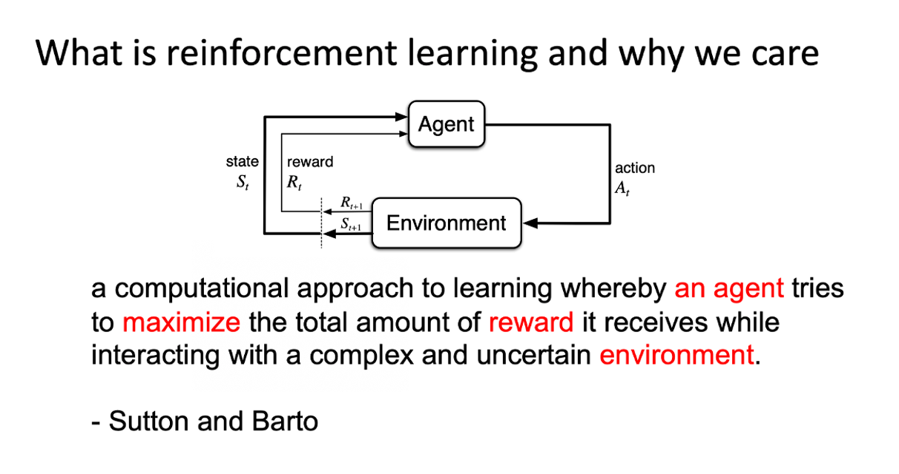

在 reinforcement learning 中有 3 个components，一个`actor`，一个`environment`，一个`reward function`。

让机器玩 video game 时，

* actor 做的事情就是去操控游戏的摇杆， 比如说向左、向右、开火等操作；
* environment 就是游戏的主机， 负责控制游戏的画面负责控制说，怪物要怎么移动， 你现在要看到什么画面等等；
* reward function 就是当你做什么事情，发生什么状况的时候，你可以得到多少分数， 比如说杀一只怪兽得到20分等等。

同样的概念用在围棋上也是一样的，

* actor 就是 alpha Go，它要决定下哪一个位置；
* environment 就是对手；
* reward function 就是按照围棋的规则， 赢就是得一分，输就是负一分等等。

在 reinforcement learning 里面，environment 跟 reward function 不是你可以控制的，environment 跟 reward function 是在开始学习之前，就已经事先给定的。你唯一能做的事情是调整 actor 里面的 policy，使得 actor 可以得到最大的 reward。Actor 里面会有一个 policy， 这个policy 决定了actor 的行为， policy 就是给一个外界的输入，然后它会输出 actor 现在应该要执行的行为。

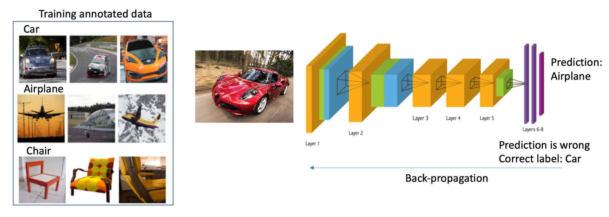
**Policy 一般写成 $\pi$**。假设你是用 deep learning 的技术来做 reinforcement learning 的话，**policy 就是一个 network**。Network 里面就有一堆参数， 我们用 $\theta$ 来代表 $\pi$ 的参数。Network 的 input 就是现在 machine 看到的东西，如果让 machine 打电玩的话， 那 machine 看到的东西就是游戏的画面。Machine 看到什么东西，会影响你现在 training 到底好不好 train。

举例来说，在玩游戏的时候， 也许你觉得游戏的画面，前后是相关的，也许你觉得说，你应该让你的 policy，看从游戏初始到现在这个时间点，所有画面的总和。你可能会觉得你要用到 RNN 来处理它，不过这样子，你会比较难处理。要让你的 machine，你的 policy 看到什么样的画面， 这个是你自己决定的。让你知道说给机器看到什么样的游戏画面，可能是比较有效的。Output 的就是今天机器要采取什么样的行为。

上图就是具体的例子，

* policy 就是一个 network；
* input 就是游戏的画面，它通常是由 pixels 所组成的；
* output 就是看看说有那些选项是你可以去执行的，output layer 就有几个 neurons。

假设你现在可以做的行为就是有 3 个，output layer 就是有 3 个 neurons。每个 neuron 对应到一个可以采取的行为。Input 一个东西后，network 就会给每一个可以采取的行为一个分数。接下来，你把这个分数当作是概率。 actor 就是看这个概率的分布，根据这个机率的分布，决定它要采取的行为。比如说 70% 会走 left，20% 走 right，10% 开火等等。概率分布不同，你的 actor 采取的行为，就会不一样。

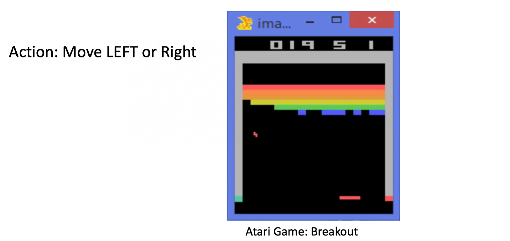
接下来用一个例子来说明 actor 是怎么样跟环境互动的。 首先 actor 会看到一个游戏画面，我们用 $s_1$ 来表示这个游戏画面，它代表游戏初始的画面。接下来 actor 看到这个游戏的初始画面以后，根据它内部的 network，根据它内部的 policy 来决定一个 action。假设它现在决定的 action 是向右，它决定完 action 以后，它就会得到一个 reward ，代表它采取这个 action 以后得到的分数。

我们把一开始的初始画面，写作 $s_1$， 把第一次执行的动作叫做 $a_1$，把第一次执行动作完以后得到的 reward 叫做 $r_1$。不同的书会有不同的定义，有人会觉得说这边应该要叫做 $r_2$，这个都可以，你自己看得懂就好。Actor 决定一个的行为以后， 就会看到一个新的游戏画面，这边是 $s_2$。然后把这个 $s_2$ 输入给 actor，这个 actor 决定要开火，然后它可能杀了一只怪，就得到五分。然后这个 process 就反复地持续下去，直到今天走到某一个 timestamp 执行某一个 action，得到 reward 之后， 这个 environment 决定这个游戏结束了。比如说，如果在这个游戏里面，你是控制绿色的船去杀怪，如果你被杀死的话，游戏就结束，或是你把所有的怪都清空，游戏就结束了。

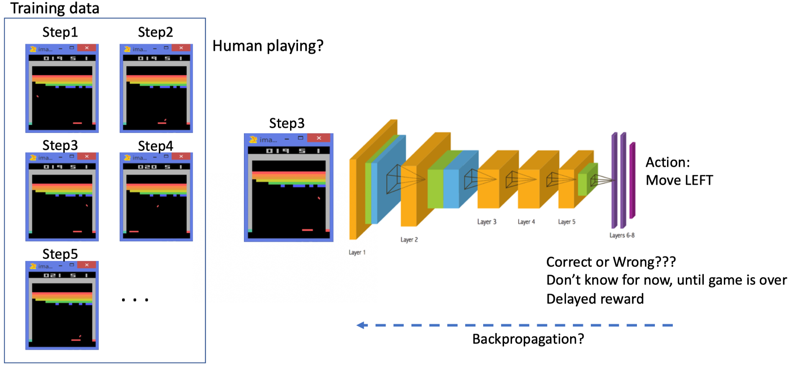
一场游戏，叫做一个 `Episode`。把这个游戏里面，所有得到的 reward 都总合起来，就是 `Total reward`，我们称其为`Return(回报)`，用 R 来表示它。Actor 存在的目的就是想办法去 maximize 它可以得到的 reward。

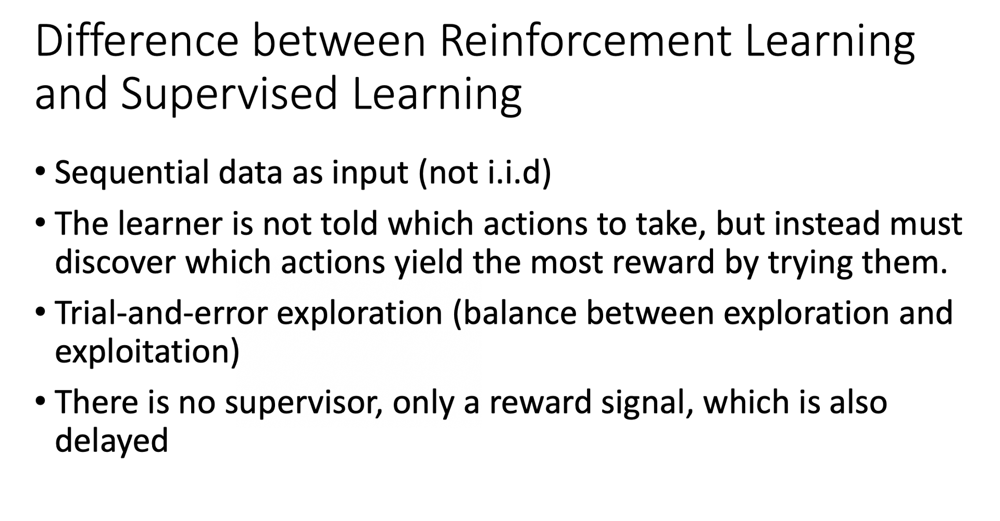
首先，`environment` 是一个`function`，游戏的主机也可以把它看作是一个 function，虽然它不一定是 neural network，可能是 rule-based 的规则，但你可以把它看作是一个 function。这个 function，一开始就先吐出一个 state，也就是游戏的画面，接下来你的 actor 看到这个游戏画面 $s_1$ 以后，它吐出 $a_1$，然后 environment 把 $a_1$ 当作它的输入，然后它再吐出 $s_2$，吐出新的游戏画面。Actor 看到新的游戏画面，再采取新的行为 $a_2$，然后 environment 再看到 $a_2$，再吐出 $s_3$。这个 process 会一直持续下去，直到 environment 觉得说应该要停止为止。

在一场游戏里面，我们把 environment 输出的 $s$ 跟 actor 输出的行为 $a$，把这个 $s$ 跟 $a$ 全部串起来， 叫做一个 `Trajectory`，如下式所示。
$$
\text { Trajectory } \tau=\left\{s_{1}, a_{1}, s_{2}, a_{2}, \cdots, s_{t}, a_{t}\right\}
$$

每一个 trajectory，你可以计算它发生的概率。假设现在 actor 的参数已经被给定了话，就是 $\theta$。根据 $\theta$，你其实可以计算某一个 trajectory 发生的概率，你可以计算某一个回合，某一个 episode 里面， 发生这样子状况的概率。

$$
\begin{aligned}
p_{\theta}(\tau)
&=p\left(s_{1}\right) p_{\theta}\left(a_{1} | s_{1}\right) p\left(s_{2} | s_{1}, a_{1}\right) p_{\theta}\left(a_{2} | s_{2}\right) p\left(s_{3} | s_{2}, a_{2}\right) \cdots \\
&=p\left(s_{1}\right) \prod_{t=1}^{T} p_{\theta}\left(a_{t} | s_{t}\right) p\left(s_{t+1} | s_{t}, a_{t}\right)
\end{aligned}
$$

怎么算呢，如上式所示。在假设你 actor 的参数就是 $\theta$ 的情况下，某一个 trajectory $\tau$ 的概率就是这样算的，你先算 environment 输出 $s_1$ 的概率，再计算根据 $s_1$ 执行 $a_1$ 的概率，这是由你 policy 里面的 network 参数 $\theta$ 所决定的， 它是一个概率，因为你的 policy 的 network 的 output 是一个 distribution，actor 是根据这个 distribution 去做 sample，决定现在实际上要采取的 action是哪一个。接下来 environment 根据 $a_1$ 跟 $s_1$ 产生 $s_2$，因为 $s_2$ 跟$s_1$  还是有关系的，下一个游戏画面，跟前一个游戏画面通常还是有关系的，至少要是连续的， 所以给定前一个游戏画面 $s_1$ 和现在 actor 采取的行为 $a_1$，就会产生 $s_2$。

这件事情可能是概率，也可能不是概率，这个取决于 environment，就是主机它内部设定是怎样。看今天这个主机在决定，要输出什么样的游戏画面的时候，有没有概率。因为如果没有概率的话，这个游戏的每次的行为都一样，你只要找到一条 path 就可以过关了，这样感觉是蛮无聊的 。所以游戏里面，通常是还是有一些概率的，你做同样的行为，给同样的前一个画面， 下次产生的画面不见得是一样的。Process 就反复继续下去，你就可以计算一个 trajectory $s_1$,$a_1$, $s_2$ , $a_2$ 出现的概率有多大。

**这个概率取决于两部分**， 

* 一部分是 `environment 的行为`， environment 的 function 它内部的参数或内部的规则长什么样子。 $p(s_{t+1}|s_t,a_t)$这一项代表的是 environment， environment 这一项通常你是无法控制它的，因为那个是人家写好的，你不能控制它。
* 另一部分是 `agent 的行为`。你能控制的是 $p_\theta(a_t|s_t)$。给定一个 $s_t$， actor 要采取什么样的 $a_t$ 会取决于你 actor 的参数 $\theta$， 所以这部分是 actor 可以自己控制的。随着 actor 的行为不同，每个同样的 trajectory， 它就会有不同的出现的概率。

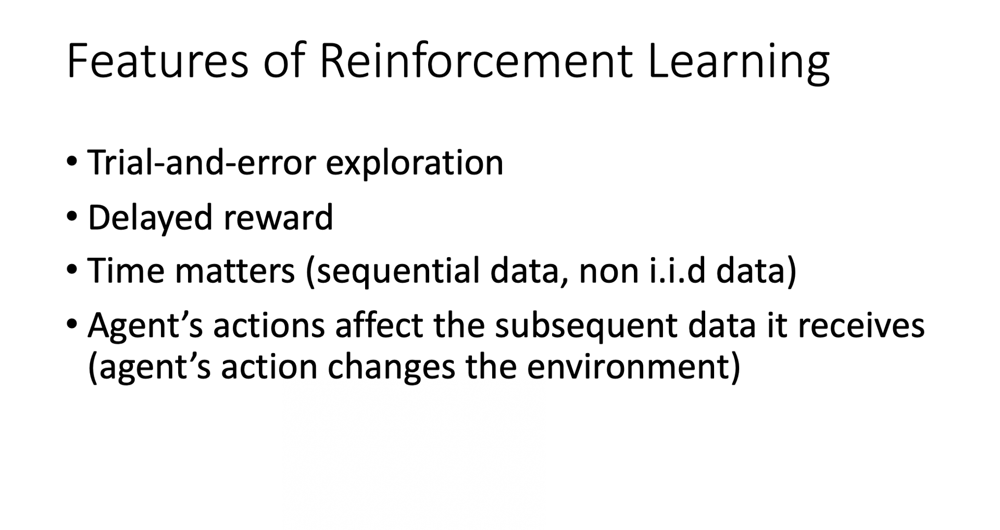

在 reinforcement learning 里面，除了 environment 跟 actor 以外， 还有`reward function`。Reward function 根据在某一个 state 采取的某一个 action 决定说现在这个行为可以得到多少的分数。 它是一个 function，给它 $s_1$，$a_1$，它告诉你得到 $r_1$。给它 $s_2$ ，$a_2$，它告诉你得到 $r_2$。 把所有的 $r$ 都加起来，我们就得到了 $R(\tau)$ ，代表某一个 trajectory $\tau$ 的 reward。在某一场游戏里面， 某一个 episode 里面，我们会得到 R。**我们要做的事情就是调整 actor 内部的参数 $\theta$， 使得 R 的值越大越好。** 但实际上 reward 并不只是一个 scalar，reward 其实是一个 random variable，R 其实是一个 random variable。 因为 actor 在给定同样的 state 会做什么样的行为，这件事情是有随机性的。environment 在给定同样的 observation 要采取什么样的 action，要产生什么样的 observation，本身也是有随机性的。所以 R 是一个 random variable，你能够计算的，是它的期望值。你能够计算的是说，在给定某一组参数 $\theta$ 的情况下，我们会得到的 R 的期望值是多少。

$$
\bar{R}_{\theta}=\sum_{\tau} R(\tau) p_{\theta}(\tau)
$$
这个期望值的算法如上式所示，穷举所有可能的 trajectory $\tau$， 每一个 trajectory $\tau$ 都有一个概率。比如 $\theta$ 是一个很强的 model， 那它都不会死。如果有一个 episode 很快就死掉了， 它的概率就很小；如果有一个 episode 都一直没有死， 那它的概率就很大。根据你的 $\theta$， 你可以算出某一个 trajectory $\tau$ 出现的概率，接下来你计算这个 $\tau$ 的 total reward 是多少。 Total reward weighted by 这个 $\tau$ 出现的概率，对所有的 $\tau$ 进行求和，就是期望值。给定一个参数，你会得到的期望值。
$$
\bar{R}_{\theta}=\sum_{\tau} R(\tau) p_{\theta}(\tau)=E_{\tau \sim p_{\theta}(\tau)}[R(\tau)]
$$
我们还可以写成上式那样，从 $p_{\theta}(\tau)$ 这个 distribution sample 一个 trajectory $\tau$，然后计算 $R(\tau)$ 的期望值，就是你的 expected reward。 我们要做的事情就是 maximize expected reward。

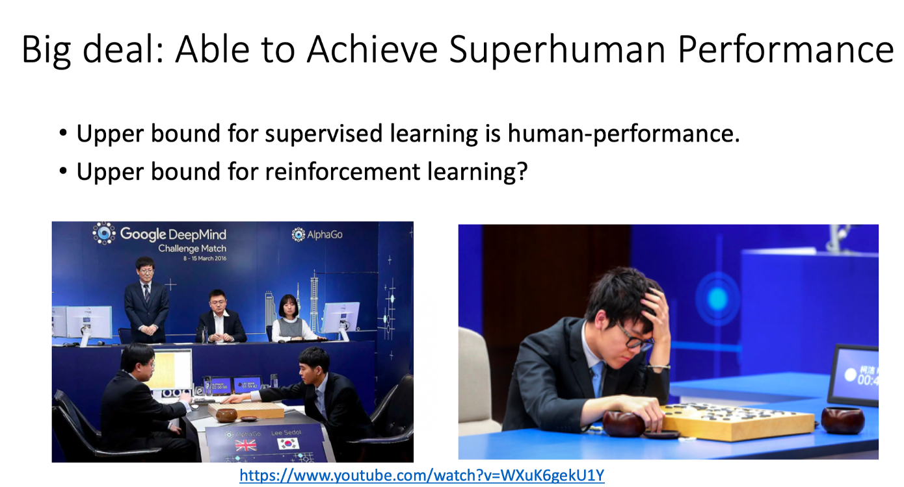
怎么 maximize expected reward 呢？我们用的是 `gradient ascent`，因为要让它越大越好，所以是 gradient ascent。Gradient ascent 在 update 参数的时候要加。要进行 gradient ascent，我们先要计算 expected reward $\bar{R}$ 的 gradient 。我们对 $\bar{R}$ 取一个 gradient，这里面只有 $p_{\theta}(\tau)$ 是跟 $\theta$ 有关，所以 gradient 就放在 $p_{\theta}(\tau)$ 这个地方。$R(\tau)$ 这个 reward function 不需要是 differentiable，我们也可以解接下来的问题。举例来说，如果是在 GAN 里面，$R(\tau)$ 其实是一个 discriminator，它就算是没有办法微分，也无所谓，你还是可以做接下来的运算。

取 gradient之后，我们背一个公式，
$$
\nabla f(x)=f(x)\nabla \log f(x)
$$
我们可以对 $\nabla p_{\theta}(\tau)$ 使用这个公式，然后会得到 $\nabla p_{\theta}(\tau)=p_{\theta}(\tau)  \nabla \log p_{\theta}(\tau)$。

接下来， 分子分母，上下同乘$p_{\theta}(\tau)$，然后我们可以得到下式：
$$
\frac{\nabla p_{\theta}(\tau)}{p_{\theta}(\tau)}=\log p_{\theta}(\tau)
$$

 然后如下式所示， 对 $\tau$ 进行求和，把 $R(\tau)$  和  $\log p_{\theta}(\tau)$ 这两项 weighted by $ p_{\theta}(\tau)$， 既然有 weighted by  $p_{\theta}(\tau)$，它们就可以被写成这个 expected 的形式。也就是你从 $p_{\theta}(\tau)$ 这个 distribution 里面 sample $\tau$ 出来， 去计算 $R(\tau)$ 乘上 $\nabla\log p_{\theta}(\tau)$，然后把它对所有可能的 $\tau$ 进行求和，就是这个 expected value 。

$$
\begin{aligned}
\nabla \bar{R}_{\theta}&=\sum_{\tau} R(\tau) \nabla p_{\theta}(\tau)\\&=\sum_{\tau} R(\tau) p_{\theta}(\tau) \frac{\nabla p_{\theta}(\tau)}{p_{\theta}(\tau)} \\&=
\sum_{\tau} R(\tau) p_{\theta}(\tau) \nabla \log p_{\theta}(\tau) \\
&=E_{\tau \sim p_{\theta}(\tau)}\left[R(\tau) \nabla \log p_{\theta}(\tau)\right]
\end{aligned}
$$

实际上这个 expected value 没有办法算，所以你是用 sample 的方式来 sample 一大堆的 $\tau$。你 sample $N$ 笔  $\tau$， 然后你去计算每一笔的这些 value，然后把它全部加起来，最后你就得到你的 gradient。你就可以去 update 你的参数，你就可以去 update 你的 agent，如下式所示。
$$
\begin{aligned}
E_{\tau \sim p_{\theta}(\tau)}\left[R(\tau) \nabla \log p_{\theta}(\tau)\right] &\approx \frac{1}{N} \sum_{n=1}^{N} R\left(\tau^{n}\right) \nabla \log p_{\theta}\left(\tau^{n}\right) \\
&=\frac{1}{N} \sum_{n=1}^{N} \sum_{t=1}^{T_{n}} R\left(\tau^{n}\right) \nabla \log p_{\theta}\left(a_{t}^{n} \mid s_{t}^{n}\right)
\end{aligned}
$$
注意 $p_{\theta}(\tau)$ 里面有两项，$p(s_{t+1}|s_t,a_t)$ 来自于 environment，$p_\theta(a_t|s_t)$ 是来自于 agent。 $p(s_{t+1}|s_t,a_t)$ 由环境决定从而与 $\theta$ 无关，因此 $\nabla \log p(s_{t+1}|s_t,a_t) =0 $。因此 $\nabla p_{\theta}(\tau)=
\nabla \log p_{\theta}\left(a_{t}^{n} | s_{t}^{n}\right)$。

你可以非常直观的来理解这个部分，也就是在你 sample 到的 data 里面， 你 sample 到，在某一个 state $s_t$ 要执行某一个 action $a_t$， 这个 $s_t$ 跟 $a_t$ 它是在整个 trajectory $\tau$ 的里面的某一个 state and action 的 pair。

*  假设你在 $s_t$ 执行 $a_t$，最后发现 $\tau$ 的 reward 是正的， 那你就要增加这一项的概率，你就要增加在 $s_t$ 执行 $a_t$ 的概率。
*  反之，在 $s_t$ 执行 $a_t$ 会导致$\tau$  的 reward 变成负的， 你就要减少这一项的概率。

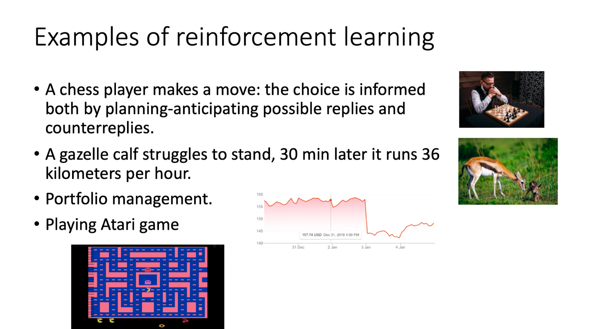
这个怎么实现呢？ 你用 gradient ascent 来 update 你的参数，你原来有一个参数 $\theta$ ，把你的 $\theta$  加上你的 gradient 这一项，那当然前面要有个 learning rate，learning rate 其实也是要调的，你可用 Adam、RMSProp 等方法对其进行调整。

我们可以套下面这个公式来把 gradient 计算出来: 

$$
\nabla \bar{R}_{\theta}=\frac{1}{N} \sum_{n=1}^{N} \sum_{t=1}^{T_{n}} R\left(\tau^{n}\right) \nabla \log p_{\theta}\left(a_{t}^{n} | s_{t}^{n}\right)
$$
实际上，要套上面这个公式， 首先你要先收集一大堆的 s 跟 a 的 pair，你还要知道这些 s 跟 a 在跟环境互动的时候，你会得到多少的 reward。 这些资料怎么收集呢？你要拿你的 agent，它的参数是 $\theta$，去跟环境做互动， 也就是拿你已经 train 好的 agent 先去跟环境玩一下，先去跟那个游戏互动一下， 互动完以后，你就会得到一大堆游戏的纪录，你会记录说，今天先玩了第一场，在第一场游戏里面，我们在 state $s_1$ 采取 action $a_1$，在 state $s_2$ 采取 action $a_2$ 。

玩游戏的时候是有随机性的，所以 agent 本身是有随机性的，在同样 state $s_1$，不是每次都会采取 $a_1$，所以你要记录下来。在 state $s_1^1$ 采取 $a_1^1$，在 state $s_2^1$ 采取 $a_2^1$。整场游戏结束以后，得到的分数是$R(\tau^1)$。你会 sample 到另外一笔 data，也就是另外一场游戏。在另外一场游戏里面，你在 state $s_1^2$ 采取 $a_1^2$，在 state $s_2^2$ 采取 $a_2^2$，然后你 sample 到的就是 $\tau^2$，得到的 reward 是 $R(\tau^2)$。

你就可以把 sample 到的东西代到这个 gradient 的式子里面，把 gradient 算出来。也就是把这边的每一个 s 跟 a 的 pair 拿进来，算一下它的 log probability 。你计算一下在某一个 state 采取某一个 action 的 log probability，然后对它取 gradient，然后这个 gradient 前面会乘一个 weight，weight 就是这场游戏的 reward。 有了这些以后，你就会去 update 你的 model。

Update 完你的 model 以后。你要重新去收集 data，再 update model。这边要注意一下，一般 policy gradient sample 的 data 就只会用一次。你把这些 data sample 起来，然后拿去 update 参数，这些 data 就丢掉了。接着再重新 sample data，才能够去 update 参数， 等一下我们会解决这个问题。

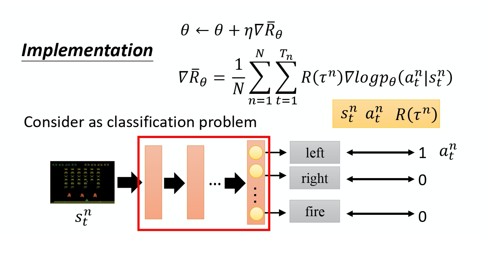

接下来讲一些实现细节。实现方法是这个样子，把它想成一个分类的问题，在 classification 里面就是 input 一个 image，然后 output 决定说是 10 个 class 里面的哪一个。在做 classification 时，我们要收集一堆 training data，要有 input 跟 output 的 pair。

在实现的时候，你就把 state 当作是 classifier 的 input。 你就当在做 image classification 的 problem，只是现在的 class 不是说 image 里面有什么 objects。 现在的 class 是说，看到这张 image 我们要采取什么样的行为，每一个行为就是一个 class。比如说第一个 class 叫做向左，第二个 class 叫做向右，第三个 class 叫做开火。

这些训练的数据从哪里来的呢？ 做分类的问题时，要有 input 和正确的 output。  这些训练数据是从 sampling 的 process 来的。假设在 sampling 的 process 里面，在某一个 state，你 sample 到你要采取 action a， 你就把这个 action a 当作是你的 ground truth。你在这个 state，你 sample 到要向左。 本来向左这件事概率不一定是最高， 因为你是 sample，它不一定概率最高。假设你 sample 到向左，在 training 的时候 你叫告诉 machine 说，调整 network 的参数， 如果看到这个 state，你就向左。在一般的 classification 的 problem 里面，其实你在 implement classification 的时候， 你的 objective function 都会写成 minimize cross entropy，其实 minimize cross entropy 就是 maximize log likelihood。

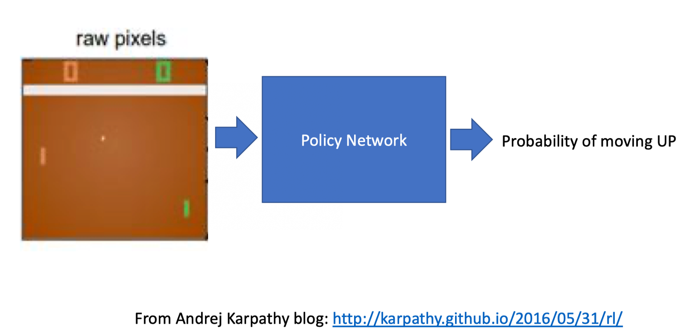

做 classification 的时候，objective function 就是 maximize 或 minimize 的对象， 因为我们现在是 maximize likelihood 所以其实是 maximize， 你要 maximize 的对象，如下式所示:
$$
\frac{1}{N} \sum_{n=1}^{N} \sum_{t=1}^{T_{n}} \log p_{\theta}\left(a_{t}^{n} \mid s_{t}^{n}\right)
$$

像这种 loss function。你可在 TensorFlow 里 call 现成的 function，它就会自动帮你算。
然后你就可以把 gradient 计算出来，这是一般的分类问题。RL 唯一不同的地方是 loss 前面乘上一个 weight，这个是整场游戏的时候得到的 total reward R， 它并不是在 state s 采取 action a 的时候得到的 reward。 你要把你的每一笔 training data，都 weighted by 这个 R。然后你用 TensorFlow 或 PyTorch 去帮你算 gradient 就结束了，跟一般 classification 差不多。

## Tips
这边有一些在实现的时候，你也许用得上的 tip。
### Tip 1: Add a Baseline

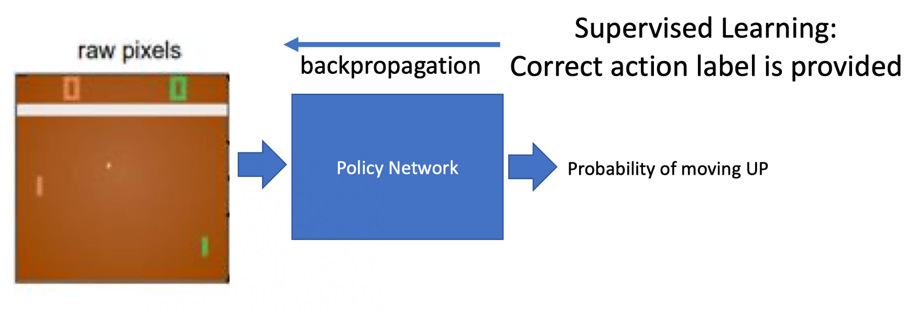

第一个 tip 是 add 一个 baseline。add baseline 是什么意思呢？如果 given state s 采取 action a 会给你整场游戏正面的 reward，就要增加它的概率。如果 state s 执行 action a，整场游戏得到负的 reward，就要减少这一项的概率。

但在很多游戏里面， reward 总是正的，就是说最低都是 0。比如说打乒乓球游戏， 你的分数就是介于 0 到 21 分之间，所以这个 R 总是正的。假设你直接套用这个式子， 在 training 的时候，告诉 model 说，不管是什么 action 你都应该要把它的概率提升。 在理想上，这么做并不一定会有问题。因为虽然说 R 总是正的，但它正的量总是有大有小，你在玩乒乓球那个游戏里面，得到的 reward 总是正的，但它是介于 0~21分之间，有时候你采取某些 action 可能是得到 0 分，采取某些 action 可能是得到 20 分。
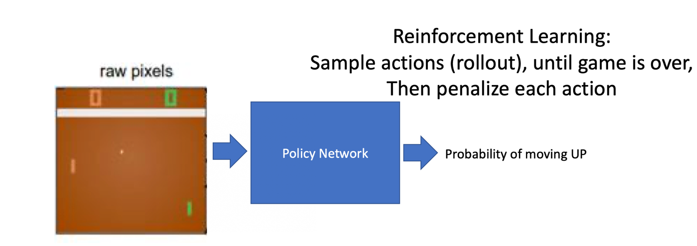

假设你有 3 个 action a/b/c 可以执行，在某一个 state 有 3 个 action a/b/c可以执行。根据这个式子，你要把这 3 项的概率， log probability 都拉高。 但是它们前面 weight 的这个 R 是不一样的。 R 是有大有小的，weight 小的，它上升的就少，weight 多的，它上升的就大一点。 因为这个 log probability，它是一个概率，所以action a、b、c 的和要是 0。 所以上升少的，在做完 normalize 以后， 它其实就是下降的，上升的多的，才会上升。

 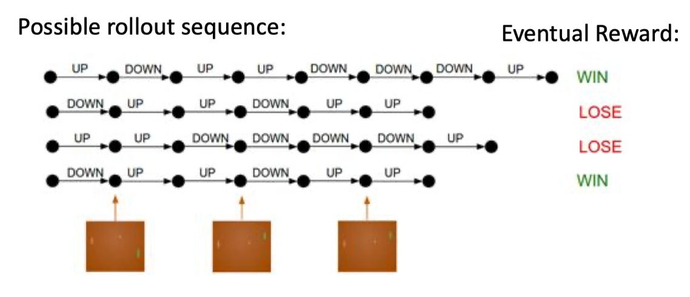

这个是一个理想上的状况，但是实际上，我们是在做 sampling 就本来这边应该是一个 expectation， summation over 所有可能的 s 跟 a 的 pair。 但你真正在学的时候，当然不可能是这么做的，你只是 sample 了少量的 s 跟 a 的 pair 而已。 因为我们做的是 sampling，有一些 action 可能从来都没有 sample 到。在某一个 state1，虽然可以执行的 action 有 a/b/c 3 个，但你可能只 sample 到 action b，你可能只 sample 到 action c，你没有 sample 到 action a。但现在所有 action 的 reward 都是正的，所以根据这个式子，它的每一项的概率都应该要上升。你会遇到的问题是，因为 a 没有被 sample 到，其它 action 的概率如果都要上升，a 的概率就下降。 所以 a 不一定是一个不好的 action， 它只是没被 sample 到。但只是因为它没被 sample 到， 它的概率就会下降，这个显然是有问题的，要怎么解决这个问题呢？你会希望你的 reward 不要总是正的。

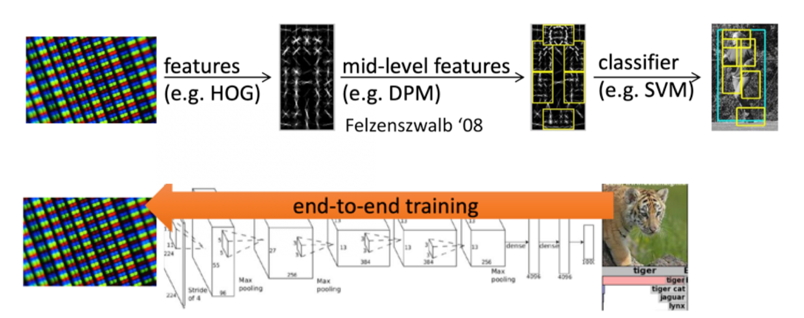

为了解决 reward 总是正的这个问题，你可以把 reward 减掉一项叫做 b，这项 b 叫做 baseline。你减掉这项 b 以后，就可以让 $R(\tau^n)-b$ 这一项， 有正有负。 所以如果得到的 total reward $R(\tau^n)$ 大于 b 的话，就让它的概率上升。如果这个 total reward 小于 b，就算它是正的，正的很小也是不好的，你就要让这一项的概率下降。 如果$R(\tau^n)<b$  ， 你就要让这个 state 采取这个 action 的分数下降 。这个 b 怎么设呢？一个最简单的做法就是， 你把 $\tau^n$ 的值取 expectation， 算一下 $\tau^n$的平均值。
$$
b \approx E[R(\tau)]
$$

这是其中一种做法， 你可以想想看有没有其它的做法。

 所以在 implement training 的时候，你会不断地把 $R(\tau)$ 的分数记录下来 然后你会不断地去计算 $R(\tau)$ 的平均值， 你会把这个平均值，当作你的 b 来用。 这样就可以让你在 training 的时候， $\nabla \log p_{\theta}\left(a_{t}^{n} | s_{t}^{n}\right)$ 乘上前面这一项， 是有正有负的，这个是第一个 tip。

### Tip 2: Assign Suitable Credit

第二个 tip：给每一个 action 合适的 credit。什么意思呢，如果我们看今天下面这个式子的话，
$$
\nabla \bar{R}_{\theta} \approx \frac{1}{N} \sum_{n=1}^{N} \sum_{t=1}^{T_{n}}\left(R\left(\tau^{n}\right)-b\right) \nabla \log p_{\theta}\left(a_{t}^{n} \mid s_{t}^{n}\right)
$$
我们原来会做的事情是，在某一个 state，假设你执行了某一个 action a，它得到的 reward ，它前面乘上的这一项 $R(\tau^n)-b$。

只要在同一个 Episode 里面，在同一场游戏里面， 所有的 state 跟 a 的 pair，它都会 weighted by 同样的 reward term，这件事情显然是不公平的，因为在同一场游戏里面 也许有些 action 是好的，有些 action 是不好的。 假设整场游戏的结果是好的， 并不代表这个游戏里面每一个行为都是对的。若是整场游戏结果不好， 但不代表游戏里面的所有行为都是错的。所以我们希望可以给每一个不同的 action 前面都乘上不同的 weight。每一个 action 的不同 weight， 它反映了每一个 action 到底是好还是不好。 

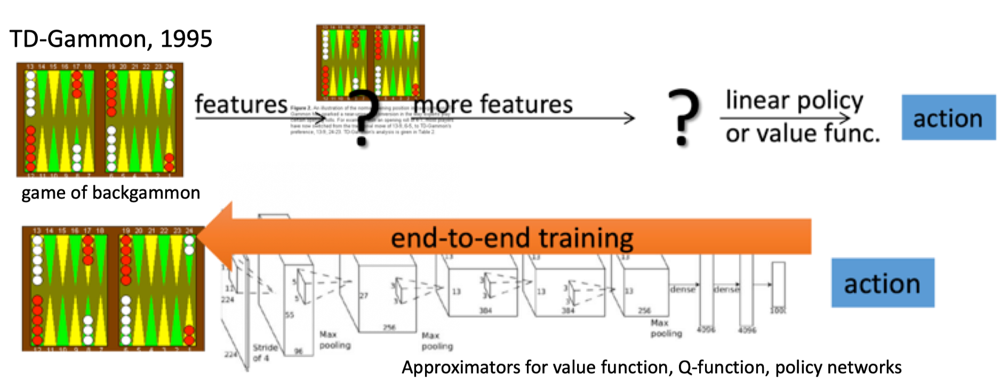

举个例子， 假设这个游戏都很短，只有 3~4 个互动， 在 $s_a$ 执行 $a_1$ 得到 5 分。在 $s_b$ 执行 $a_2$ 得到 0 分。在 $s_c$ 执行 $a_3$ 得到 -2 分。 整场游戏下来，你得到 +3 分，那你得到 +3 分 代表在 state $s_b$ 执行 action $a_2$ 是好的吗？并不见得代表 state $s_b$ 执行 $a_2$ 是好的。因为这个正的分数，主要来自于在 state $s_a$ 执行了 $a_1$，跟在 state $s_b$ 执行 $a_2$ 是没有关系的，也许在 state $s_b$ 执行 $a_2$ 反而是不好的， 因为它导致你接下来会进入 state $s_c$，执行 $a_3$ 被扣分，所以整场游戏得到的结果是好的， 并不代表每一个行为都是对的。

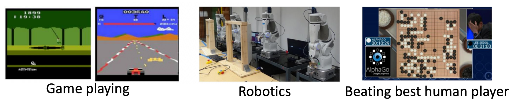

如果按照我们刚才的讲法，整场游戏得到的分数是 3 分，那到时候在 training 的时候， 每一个 state 跟 action 的 pair，都会被乘上 +3。 在理想的状况下，这个问题，如果你 sample 够多就可以被解决。因为假设你 sample 够多，在 state $s_b$ 执行 $a_2$ 的这件事情，被 sample 到很多。就某一场游戏，在 state $s_b$ 执行 $a_2$，你会得到 +3 分。 但在另外一场游戏，在 state $s_b$ 执行 $a_2$，你却得到了 -7 分，为什么会得到 -7 分呢？ 因为在 state $s_b$ 执行 $a_2$ 之前， 你在 state $s_a$ 执行 $a_2$ 得到 -5 分，-5 分这件事可能也不是在 $s_b$ 执行 $a_2$ 的错，这两件事情，可能是没有关系的，因为它先发生了，这件事才发生，所以它们是没有关系的。

在 state $s_b$ 执行 $a_2$ 可能造成的问题只有会在接下来 -2 分，而跟前面的 -5 分没有关系的。但是假设我们今天 sample 到这项的次数够多，把所有发生这件事情的情况的分数通通都集合起来， 那可能不是一个问题。但现在的问题就是，我们 sample 的次数是不够多的。在 sample 的次数不够多的情况下，你要给每一个 state 跟 action pair 合理的 credit，你要让大家知道它合理的 contribution。怎么给它一个合理的 contribution 呢？ 一个做法是计算这个 pair 的 reward 的时候，不把整场游戏得到的 reward 全部加起来，**只计算从这一个 action 执行以后所得到的 reward**。因为这场游戏在执行这个 action 之前发生的事情是跟执行这个 action 是没有关系的， 所以在执行这个 action 之前得到多少 reward 都不能算是这个 action 的功劳。跟这个 action 有关的东西， 只有在执行这个 action 以后发生的所有的 reward 把它加起来，才是这个 action 真正的 contribution。所以在这个例子里面，在 state $s_b$ 执行 $a_2$ 这件事情，也许它真正会导致你得到的分数应该是 -2 分而不是 +3 分，因为前面的 +5 分 并不是执行 $a_2$ 的功劳。实际上执行 $a_2$ 以后，到游戏结束前， 你只有被扣 2 分而已，所以它应该是 -2。那一样的道理，今天执行 $a_2$ 实际上不应该是扣 7 分，因为前面扣 5 分，跟在 $s_b$ 这个 state 执行 $a_2$ 是没有关系的。在 $s_b$ 这个 state 执行 $a_2$，只会让你被扣两分而已，所以也许在 $s_b$ 这个 state 执行 $a_2$， 你真正会导致的结果只有扣两分而已。如果要把它写成式子的话是什么样子呢？如下式所示。

本来的 weight 是整场游戏的 reward 的总和。那现在改成从某个时间 $t$ 开始，假设这个 action 是在 t 这个时间点所执行的，从 $t$ 这个时间点，一直到游戏结束所有 reward 的总和，才真的代表这个 action 是好的还是不好的。 

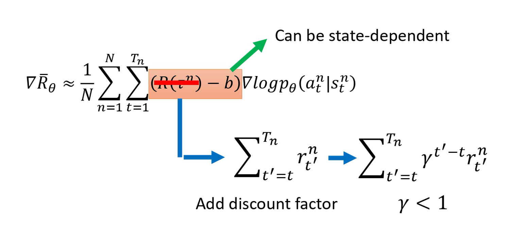
**接下来再更进一步，我们把未来的 reward 做一个 discount**，由此得到的回报被称为 `Discounted Return(折扣回报)`。为什么要把未来的 reward 做一个 discount 呢？因为虽然在某一个时间点，执行某一个 action，会影响接下来所有的结果，有可能在某一个时间点执行的 action，接下来得到的 reward 都是这个 action 的功劳。但在比较真实的情况下， 如果时间拖得越长，影响力就越小。 比如说在第二个时间点执行某一个 action， 那我在第三个时间点得到的 reward 可能是在第二个时间点执行某个 action 的功劳，但是在 100 个 timestamp 之后，又得到 reward，那可能就不是在第二个时间点执行某一个 action 得到的功劳。 所以我们实际上在做的时候，你会在 R 前面乘上一个 `discount factor`  $\gamma$， $\gamma \in [0,1] $ ，一般会设个 0.9 或 0.99，

* $\gamma = 0$ : Only care about the immediate reward；
* $\gamma = 1$ : Future reward is equal to the immediate reward。

 如果 time stamp $t'$ 越大，它前面就乘上越多次的 $\gamma$，就代表说现在在某一个 state $s_t$， 执行某一个 action $a_t$ 的时候，它真正的 credit 是在执行这个 action 之后所有 reward 的总和，而且你还要乘上 $\gamma$。

举一个例子， 你就想成说，这是游戏的第 1、2、3、4 回合，那你在游戏的第二回合的某一个  $s_t$ 你执行 $a_t$，它真正的 credit 得到的分数应该是，假设你这边得到 +1 分 这边得到 +3 分，这边得到 -5 分，它的真正的 credit，应该是 1 加上一个 discount 的 credit 叫做 $\gamma$ 乘上 3，再加上 $\gamma^2$ 乘上 -5。

如果大家可以接受这样子的话， 实际上就是这么 implement 的。这个 b 可以是 state-dependent 的，事实上 b 它通常是一个 network estimate 出来的，它是一个 network 的 output。

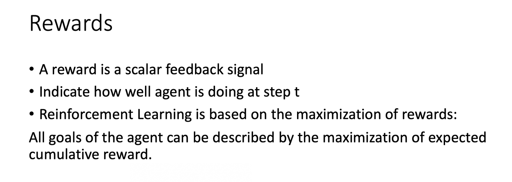

把 $R-b$ 这一项合起来，我们统称为` advantage function`， 用 `A` 来代表 advantage function。Advantage function 是 dependent on s and a，我们就是要计算的是在某一个 state s 采取某一个 action a 的时候，advantage function 有多大。

这个 advantage function 它的上标是 $\theta$， $\theta$ 是什么意思呢？ 因为在算 advantage function时，你要计算$\sum_{t^{\prime}=t}^{T_{n}} r_{t^{\prime}}^{n}$ ，你会需要有一个 interaction 的结果。你会需要有一个 model 去跟环境做 interaction，你才知道你接下来得到的 reward 会有多少。这个 $\theta$ 就是代表说是用 $\theta$ 这个 model 跟环境去做 interaction，然后你才计算出这一项。从时间 t 开始到游戏结束为止，所有 R 的 summation 把这一项减掉 b，然后这个就叫 advantage function。它的意义就是，假设我们在某一个 state $s_t$ 执行某一个 action $a_t$，相较于其他可能的 action，它有多好。它真正在意的不是一个绝对的好， 而是说在同样的 state 的时候 是采取某一个 action $a_t$ 相较于其它的 action 它有多好，它是相对的好。因为会减掉一个 b，减掉一个 baseline， 所以这个东西是相对的好，不是绝对的好。 $A^{\theta}\left(s_{t}, a_{t}\right)$ 通常可以是由一个 network estimate 出来的，这个 network 叫做 critic。 

## References

* [Intro to Reinforcement Learning (强化学习纲要）](https://github.com/zhoubolei/introRL)
* [神经网络与深度学习](https://nndl.github.io/)

