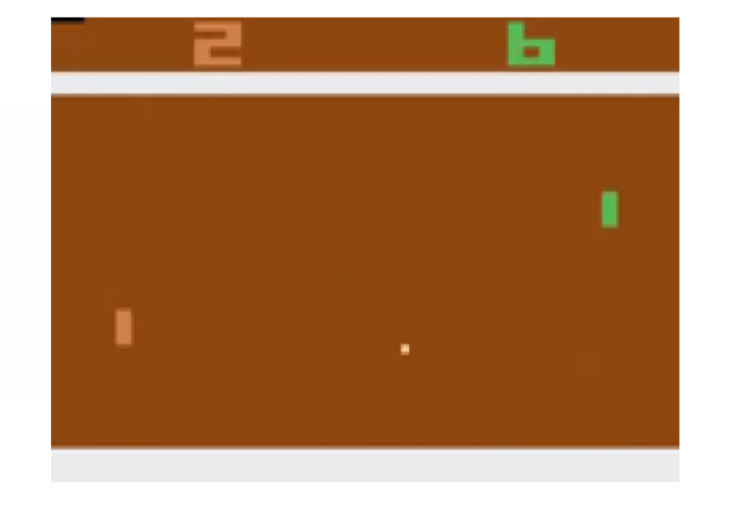
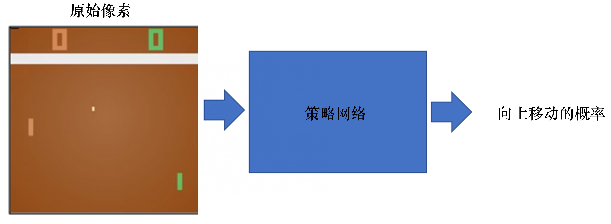
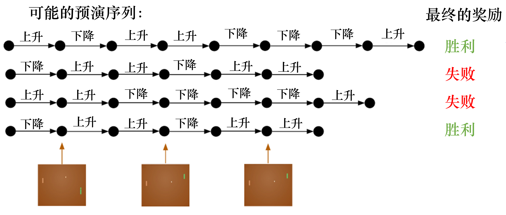
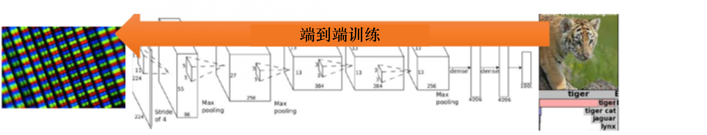
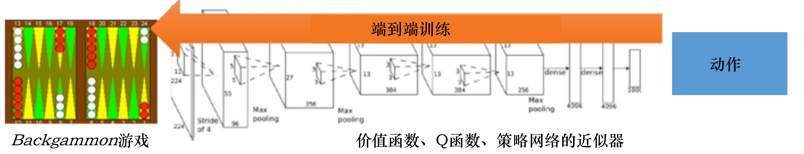
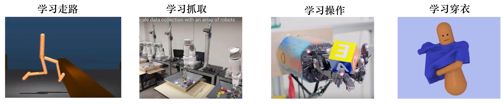
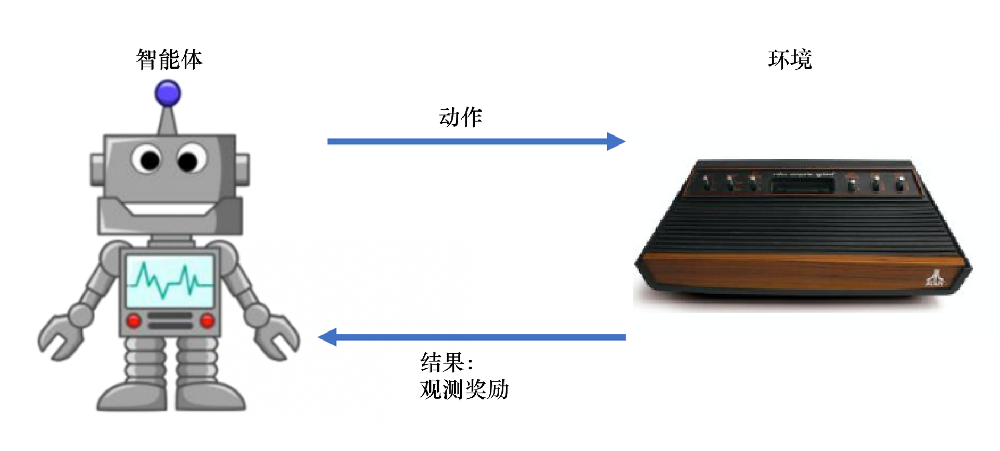
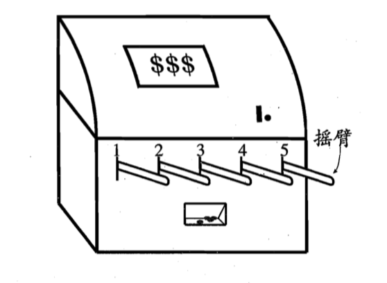

# 第1章 强化学习基础

## 1.1 强化学习概述
**强化学习（reinforcement learning，RL）**讨论的问题是智能体（agent）怎么在复杂、不确定的环境（environment）中最大化它能获得的奖励。如图 1.1 所示，强化学习由两部分组成：智能体和环境。在强化学习过程中，智能体与环境一直在交互。智能体在环境中获取某个状态后，它会利用该状态输出一个动作 （action），这个动作也称为决策（decision）。然后这个动作会在环境中被执行，环境会根据智能体采取的动作，输出下一个状态以及当前这个动作带来的奖励。智能体的目的就是尽可能多地从环境中获取奖励。

<div align=center>

</div>
<div align=center>图 1.1 强化学习示意</div>

### 1.1.1  强化学习与监督学习

我们可以把强化学习与监督学习做一个对比。以图片分类为例，如图 1.2 所示，**监督学习（supervised learning）**假设我们有大量被标注的数据，比如汽车、飞机、椅子这些被标注的图片，这些图片都要满足独立同分布，即它们之间是没有关联关系的。假设我们训练一个分类器，比如神经网络。为了分辨输入的 图片中是汽车还是飞机，在训练过程中，需要把正确的标签信息传递给神经网络。 当神经网络做出错误的预测时，比如输入汽车的图片，它预测出来是飞机，我们就会直接告诉它，该预测是错误的，正确的标签应该是汽车。最后我们根据类似错误写出一个损失函数（loss function），通过反向传播（back propagation）来训练神经网络。

<div align=center>

</div>
<div align=center>图 1.2 监督学习</div>

所以在监督学习过程中，有两个假设：
  * 输入的数据（标注的数据）都应是没有关联的。因为如果输入的数据有关联，学习器（learner）是不好学习的。
  * 需要告诉学习器正确的标签是什么，这样它可以通过正确的标签来修正自己的预测。

> 通常假设样本空间中全体样本服从一个未知分布，我们获得的每个样本都是独立地从这个分布上采样获得的，即独立同分布(independent and identically distributed，简称 i.i.d.)。

在强化学习中，监督学习的两个假设其实都不能得到满足。以雅达利（Atari） 游戏 Breakout 为例，如图 1.3 所示，这是一个打砖块的游戏，控制木板左右移动从而把球反弹到上面来消除砖块。在玩游戏的过程中，我们可以发现智能体得到的观测（observation）不是独立同分布的，上一帧与下一帧间其实有非常强的连续性。我们得到的数据是相关的时间序列数据，不满足独立同分布。另外，我们并没有立刻获得反馈，游戏没有告诉我们哪个动作是正确动作。比如现在把木板往右移，这只会使得球往上或者往左一点儿，我们并不会得到即时的反馈。因此，强化学习之所以困难，是因为智能体不能得到即时的反馈，然而我们依然希望智能体在这个环境中学习。

<div align=center>

</div>
<div align=center>图 1.3 雅达利游戏Breakout</div>

如图 1.4 所示，强化学习的训练数据就是一个玩游戏的过程。我们从第 1 步开始，采取一个动作，比如我们把木板往右移，接到球。第 2 步我们又做出动作，得到的训练数据是一个玩游戏的序列。比如现在是在第 3 步，我们把这个序列放进网络，希望网络可以输出一个动作，即在当前的状态应该输出往右移或 者往左移。这里有个问题，我们没有标签来说明现在这个动作是正确还是错误的，必须等到游戏结束才可能知道，这个游戏可能 10s 后才结束。现在这个动作到底对最后游戏是否能赢有无帮助，我们其实是不清楚的。这里我们就面临**延迟奖励（delayed reward）**的问题，延迟奖励使得训练网络非常困难。

<div align=center>

</div>
<div align=center>图 1.4 强化学习：玩Breakout</div>

强化学习和监督学习的区别如下。 

（1）强化学习输入的样本是序列数据，而不像监督学习里面样本都是独立的。

（2）学习器并没有告诉我们每一步正确的动作应该是什么，学习器需要自己去发现哪些动作可以带来 最多的奖励，只能通过不停地尝试来发现最有利的动作。

（3）智能体获得自己能力的过程，其实是不断地试错探索（trial-and-error exploration）的过程。探索 （exploration）和利用（exploitation）是强化学习里面非常核心的问题。其中，探索指尝试一些新的动作， 这些新的动作有可能会使我们得到更多的奖励，也有可能使我们“一无所有”；利用指采取已知的可以获得最多奖励的动作，重复执行这个动作，因为我们知道这样做可以获得一定的奖励。因此，我们需要在探索和利用之间进行权衡，这也是在监督学习里面没有的情况。

（4）在强化学习过程中，没有非常强的监督者（supervisor），只有**奖励信号（reward signal**），并且奖励信号是延迟的，即环境会在很久以后告诉我们之前我们采取的动作到底是不是有效的。因为我们没有得 到即时反馈，所以智能体使用强化学习来学习就非常困难。当我们采取一个动作后，如果我们使用监督学习，我们就可以立刻获得一个指导，比如，我们现在采取了一个错误的动作，正确的动作应该是什么。而在强化学习里面，环境可能会告诉我们这个动作是错误的，但是它并没有告诉我们正确的动作是什么。而且更困难的是，它可能是在一两分钟过后告诉我们这个动作是错误的。所以这也是强化学习和监督学习不同的地方。

通过与监督学习的比较，我们可以总结出强化学习的一些特征。

（1）强化学习会试错探索，它通过探索环境来获取对环境的理解。

（2）强化学习智能体会从环境里面获得延迟的奖励。

（3）在强化学习的训练过程中，时间非常重要。因为我们得到的是有时间关联的数据（sequential data）， 而不是独立同分布的数据。在机器学习中，如果观测数据有非常强的关联，会使得训练非常不稳定。这也是为什么在监督学习中，我们希望数据尽量满足独立同分布，这样就可以消除数据之间的相关性。

（4）智能体的动作会影响它随后得到的数据，这一点是非常重要的。在训练智能体的过程中，很多时 候我们也是通过正在学习的智能体与环境交互来得到数据的。所以如果在训练过程中，智能体不能保持稳定，就会使我们采集到的数据非常糟糕。我们通过数据来训练智能体，如果数据有问题，整个训练过程就会失败。所以在强化学习里面一个非常重要的问题就是，怎么让智能体的动作一直稳定地提升。

### 1.1.2 强化学习的例子

为什么我们关注强化学习，其中非常重要的一个原因就是强化学习得到的模型可以有超人类的表现。 监督学习获取的监督数据，其实是人来标注的，比如 ImageNet 的图片的标签都是人类标注的。因此我们 可以确定监督学习算法的上限（upper bound）就是人类的表现，标注结果决定了它的表现永远不可能超越人类。但是对于强化学习，它在环境里面自己探索，有非常大的潜力，它可以获得超越人类的能力的表现，比如 DeepMind 的 AlphaGo 这样一个强化学习的算法可以把人类顶尖的棋手打败。

这里给大家举一些在现实生活中强化学习的例子。

（1）在自然界中，羚羊其实也在做强化学习。它刚刚出生的时候，可能都不知道怎么站立，然后它通过试错，一段时间后就可以跑得很快，可以适应环境。

（2）我们也可以把股票交易看成强化学习的过程。我们可以不断地买卖股票，然后根据市场给出的反馈来学会怎么去买卖可以让我们的奖励最大化。

（3）玩雅达利游戏或者其他电脑游戏，也是一个强化学习的过程，我们可以通过不断试错来知道怎么 玩才可以通关。

图 1.5 所示为强化学习的一个经典例子，即雅达利的 Pong 游戏。游戏中右边的选手把球拍到左边， 然后左边的选手需要把球拍到右边。训练好的强化学习智能体和正常的选手有区别：强化学习的智能体会一直做无意义的振动，而正常的选手不会做出这样的动作。

<div align=center>

</div>
<div align=center>图 1.5 Pong游戏</div>

在 Pong 游戏里面，其实只有两个动作：往上或者往下。如图 1.6 所示，如果强化学习通过学习一个策略网络来进行分类，那么策略网络会输入当前帧的图片，输出所有决策的可能性，比如往上移动的概率。

<div align=center>

</div>
<div align=center>图 1.6 强化学习玩 Pong</div>

如图 1.7 所示，对于监督学习，我们可以直接告诉智能体正确动作的标签是什么。但在 Pong 游戏中， 我们并不知道它的正确动作的标签是什么。

<div align=center>

</div>
<div align=center>图 1.7 监督学习玩 Pong</div>

在强化学习里面，我们让智能体尝试玩 Pong 游戏，对动作进行采样，直到游戏结束，然后对每个动作进行惩罚。图 1.8 所示为预演（rollout）的一个过程。预演是指我们从当前帧对动作进行采样，生成很多局游戏。我们将当前的智能体与环境交互，会得到一系列观测。每一个观测可看成一个轨迹（trajectory）。 轨迹就是当前帧以及它采取的策略，即状态和动作的序列：
$$
\tau=\left(s_{0}, a_{0}, s_{1}, a_{1}, \ldots\right)
$$
最后结束时，我们会知道到底有没有把这个球拍到对方区域，对方有没有接住，我们是赢了还是输了。我们可以通过观测序列以及最终奖励（eventual reward）来训练智能体，使它尽可能地采取可以获得最终奖励的动作。一场游戏称为一个**回合（episode）**或者**试验（trial）**。

<div align=center>

</div>
<div align=center>图 1.8 可能的预演序列</div>

### 1.1.3 强化学习的历史

强化学习是有一定的历史的，早期的强化学习，我们称其为标准强化学习。最近业界把强化学习与深度学习结合起来，就形成了深度强化学习（deep reinforcement learning），因此，深度强化学习 = 深度学习 + 强化学习。我们可将标准强化学习和深度强化学习类比于传统的计算机视觉和深度计算机视觉。 

如图 1.9a 所示，传统的计算机视觉由两个过程组成。 

（1）给定一张图片，我们先要提取它的特征，使用一些设计好的特征，比如方向梯度直方图（histogram of oriental gradient，HOG）、可变现的组件模型（deformable part model，DPM）。

（2）提取这些特征后，我们再单独训练一个分类器。这个分类器可以是支持向量机（support vector machine，SVM）或 Boosting，然后就可以辨别这张图片是狗还是猫。


<div align=center>

</div>
<div align=center>（a）传统的计算机视觉 </div>
<div align=center>

</div>
<div align=center>（b）深度计算机视觉</div>

<div align=center>图 1.9 传统的计算机视觉与深度计算机视觉的区别</div>

2012年，Krizhevsky等人提出了AlexNet，AlexNet在ImageNet分类比赛中取得冠军，迅速引起了人们对于卷积神经网络的广泛关注。
大家就把特征提取以及分类两者合到一块儿去了，就是训练一个神经网络。这个神经网络既可以做特征提取，也可以做分类，它可以实现端到端训练，如图 1.9b 所示，它的参数可以在每一个阶段都得到极大的优化，这是一个非常重要的突破。

我们可以把神经网络放到强化学习里面。

* 标准强化学习：比如 TD-Gammon 玩 Backgammon 游戏的过程，其实就是设计特征，然后训练价值函数的过程，如图 1.10a 所示。标准强化学习先设计很多特征，这些特征可以描述现在整个状态。 得到这些特征后，我们就可以通过训练一个分类网络或者分别训练一个价值估计函数来采取动作。

* 深度强化学习：自从我们有了深度学习，有了神经网络，就可以把智能体玩游戏的过程改进成一个端到端训练（end-to-end training）的过程，如图 1.10b 所示。我们不需要设计特征，直接输入状态就可以输出动作。我们可以用一个神经网络来拟合价值函数或策略网络，省去特征工程（feature engineering）的过程。

<div align=center>

</div>
<div align=center>（a）标准强化学习</div>
<div align=center>

</div>
<div align=center>（b）深度强化学习</div>
<div align=center>图 1.10 标准强化学习与深度强化学习的区别</div>

### 	1.1.4 强化学习的应用

为什么强化学习在这几年有很多的应用，比如玩游戏以及机器人的一些应用，并且可以击败人类的顶尖棋手呢？这有如下几点原因。首先，我们有了更多的算力（computation power），有了更多的 GPU，可 以更快地做更多的试错尝试。其次，通过不同尝试，智能体在环境里面获得了很多信息，然后可以在环境里面取得很大的奖励。最后，我们通过端到端训练把特征提取和价值估计或者决策一起优化，这样就可以 得到一个更强的决策网络。

接下来介绍一些强化学习里面比较有意思的例子，如图 1.11 所示。

（1）[DeepMind 研发的走路的智能体](https://www.youtube.com/watch?v=gn4nRCC9TwQ)。这个智能体往前走一步，就会得到一个奖励。这个智能体有不同的形态，可以学到很多有意思的功能。比如，像人一样的智能体学习怎么在曲折的道路上往前走。结果 非常有意思，这个智能体会把手举得非常高，因为举手可以让它的身体保持平衡，它就可以更快地在环境里面往前走。而且我们也可以增加环境的难度，加入一些扰动，智能体就会变得更鲁棒。

（2）[机械臂抓取](https://ai.googleblog.com/2016/03/deep-learning-for-robots-learning-from.html)。因为我们把强化学习应用到机械臂自动抓取需要大量的预演，所以我们可以使用多个机械臂进行训练。分布式系统可以让机械臂尝试抓取不同的物体，盘子里面物体的形状是不同的，这样 就可以让机械臂学到一个统一的动作，然后针对不同的抓取物都可以使用最优的抓取算法。因为抓取的物 体形状的差别很大，所以使用一些传统的抓取算法不能把所有物体都抓起来。传统的抓取算法对每一个物 体都需要建模，这样是非常费时的。但通过强化学习，我们可以学到一个统一的抓取算法，其适用于不同 的物体。

（3）[OpenAI 的机械臂翻魔方](https://www.youtube.com/watch?v=jwSbzNHGflM)。OpenAI 在 2018 年的时候设计了一款带有“手指”的机械臂，它可以通过翻动手指使得手中的木块达到预期的设定。人的手指其实非常灵活，怎么使得机械臂的手指也具有这 样灵活的能力一直是个问题。OpenAI 先在一个虚拟环境里面使用强化学习对智能体进行训练，再把它应 用到真实的机械臂上。这在强化学习里面是一种比较常用的做法，即我们先在虚拟环境里面得到一个很好 的智能体，然后把它应用到真实的机器人中。这是因为真实的机械臂通常非常容易坏，而且非常贵，一般 情况下没办法大批量地购买。OpenAI 在 2019 年对其机械臂进行了进一步的改进，这个机械臂在改进后 可以玩魔方了。

（4）[穿衣服的智能体](https://www.youtube.com/watch?v=ixmE5nt2o88)。很多时候我们要在电影或者一些动画中实现人穿衣服的场景，通过手写执行命令让机器人穿衣服非常困难，穿衣服也是一种非常精细的操作。我们可以训练强化学习智能体来实现穿衣 服功能。我们还可以在里面加入一些扰动，智能体可以抵抗扰动。可能会有失败的情况（failure case）出 现，这样智能体就穿不进去衣服。

<div align=center>

</div>
<div align=center>图 1.11 强化学习例子</div>

## 1.2 序列决策

### 1.2.1 智能体与环境

接下来我们介绍**序列决策（sequential decision making）**过程。强化学习研究的问题是智能体与环境交互的问题，图 1.12 左边的智能体一直在与图 1.12 右边的环境进行交互。智能体把它的动作输出给环境，环境取得这个动作后会进行下一步，把下一步的观测与这个动作带来的奖励返还给智能体。这样的交互会产生很多观测，智能体的目的是从这些观测之中学到能最大化奖励的策略。

<div align=center>

</div>
<div align=center>图 1.12 智能体和环境</div>

### 1.2.2 奖励

奖励是由环境给的一种标量的反馈信号（scalar feedback signal），这种信号可显示智能体在某一步采取某个策略的表现如何。强化学习的目的就是最大化智能体可以获得的奖励，智能体在环境里面存在的目 的就是最大化它的期望的累积奖励（expected cumulative reward）。不同的环境中，奖励也是不同的。这里给大家举一些奖励的例子。 

（1）比如一个象棋选手，他的目的是赢棋，在最后棋局结束的时候，他就会得到一个正奖励（赢）或者负奖励（输）。 

（2）在股票管理里面，奖励由股票获取的奖励与损失决定。 

（3）在玩雅达利游戏的时候，奖励就是增加或减少的游戏的分数，奖励本身的稀疏程度决定了游戏的难度。

### 1.2.3 序列决策

在一个强化学习环境里面，智能体的目的就是选取一系列的动作来最大化奖励，所以这些选取的动作 必须有长期的影响。但在这个过程里面，智能体的奖励其实是被延迟了的，就是我们现在选取的某一步动作，可能要等到很久后才知道这一步到底产生了什么样的影响。如图 1.13 所示，在玩雅达利的 Pong 游戏时，我们可能只有到最后游戏结束时，才知道球到底有没有被击打过去。过程中我们采取的上升（up）或 下降（down）动作，并不会直接产生奖励。强化学习里面一个重要的课题就是近期奖励和远期奖励的权衡 （trade-off），研究怎么让智能体取得更多的远期奖励。

在与环境的交互过程中，智能体会获得很多观测。针对每一个观测，智能体会采取一个动作，也会得到一个奖励。所以历史是观测、动作、奖励的序列：
$$
H_{t}=o_{1},  a_{1}, r_{1}, \ldots, o_{t}, a_{t}, r_{t}
$$

智能体在采取当前动作的时候会依赖于它之前得到的历史，所以我们可以把整个游戏的状态看成关于这个历史的函数：

$$
S_{t}=f\left(H_{t}\right)
$$

<div align=center>

</div>
<div align=center>图 1.13 玩Pong游戏</div>


Q：状态和观测有什么关系?

A：**状态**是对世界的完整描述，不会隐藏世界的信息。**观测**是对状态的部分描述，可能会遗漏一些信息。在深度强化学习中，我们几乎总是用实值的向量、矩阵或者更高阶的张量来表示状态和观测。例如， 我们可以用 RGB 像素值的矩阵来表示一个视觉的观测，可以用机器人关节的角度和速度来表示一个机器 人的状态。

环境有自己的函数$s_{t}^{e}=f^{e}\left(H_{t}\right)$ 来更新状态，在智能体的内部也有一个函数$s_{t}^{a}=f^{a}\left(H_{t}\right)$来更新状 态。当智能体的状态与环境的状态等价的时候，即当智能体能够观察到环境的所有状态时，我们称这个环境是完全可观测的（fully observed）。在这种情况下面，强化学习通常被建模成一个马尔可夫决策过程 （Markov decision process，MDP）的问题。在马尔可夫决策过程中，$o_{t}=s_{t}^{e}=s_{t}^{a}$。

但是有一种情况是智能体得到的观测并不能包含环境运作的所有状态，因为在强化学习的设定里面， 环境的状态才是真正的所有状态。比如智能体在玩 black jack 游戏，它能看到的其实是牌面上的牌。或者在 玩雅达利游戏的时候，观测到的只是当前电视上面这一帧的信息，我们并没有得到游戏内部里面所有的运 作状态。也就是当智能体只能看到部分的观测，我们就称这个环境是部分可观测的（partially observed）。 在这种情况下，强化学习通常被建模成**部分可观测马尔可夫决策过程（partially observable Markov decision process, POMDP）**的问题。部分可观测马尔可夫决策过程是马尔可夫决策过程的一种泛化。 部分可观测马尔可夫决策过程依然具有马尔可夫性质，但是假设智能体无法感知环境的状态，只能知道 部分观测值。比如在自动驾驶中，智能体只能感知传感器采集的有限的环境信息。部分可观测马尔可夫决策过程可以用一个七元组描述：$(S,A,T,R,\Omega,O,\gamma)$。其中 $S$ 表示状态空间，为隐变量，$A$ 为动作空间，$T(s'|s,a)$ 为状态转移概率，$R$ 为奖励函数，$\Omega(o|s,a)$ 为观测概率，$O$ 为观测空间，$\gamma$ 为折扣系数。

## 1.3 动作空间

不同的环境允许不同种类的动作。在给定的环境中，有效动作的集合经常被称为动作空间（action space）。像雅达利游戏和围棋（Go）这样的环境有离散动作空间（discrete action space），在这个动作 空间里，智能体的动作数量是有限的。在其他环境，比如在物理世界中控制一个智能体，在这个环境中就有连续动作空间（continuous action space）。在连续动作空间中，动作是实值的向量。

例如，走迷宫机器人如果只有往东、往南、往西、往北这 4 种移动方式，则其动作空间为离散动作空 间；如果机器人可以向 360 度中的任意角度进行移动，则其动作空间为连续动作空间。

## 1.4 强化学习智能体的组成成分和类型

对于一个强化学习智能体，它可能有一个或多个如下的组成成分。

* **策略（policy）**。智能体会用策略来选取下一步的动作。

* **价值函数（value function）**。我们用价值函数来对当前状态进行评估。价值函数用于评估智能体进 入某个状态后，可以对后面的奖励带来多大的影响。价值函数值越大，说明智能体进入这个状态越有利。

* **模型（model）**。模型表示智能体对环境的状态进行理解，它决定了环境中世界的运行方式。 下面我们深入了解这 3 个组成部分的细节。

### 1.4.1 策略
策略是智能体的动作模型，它决定了智能体的动作。它其实是一个函数，用于把输入的状态变成动作。策略可分为两种：随机性策略和确定性策略。

**随机性策略（stochastic policy）**就是 $\pi$ 函数，即$\pi(a | s)=p\left(a_{t}=a | s_{t}=s\right)$。输入一个状态 $s$，输出一个概率。 
这个概率是智能体所有动作的概率，然后对这个概率分布进行采样，可得到智能体将采取的动作。比如可能是有 0.7 的概率往左，0.3 的概率往右，那么通过采样就可以得到智能体将采取的动作。

**确定性策略（deterministic policy）**就是智能体直接采取最有可能的动作，即 $a^{*}=\underset{a}{\arg \max} \pi(a \mid s)$。 


如图 1.14 所示，从雅达利游戏来看，策略函数的输入就是游戏的一帧，它的输出决定智能体向左移动或者向右移动。

<div align=center>

</div>
<div align=center>图 1.14 策略函数</div>

通常情况下，强化学习一般使用随机性策略，随机性策略有很多优点。比如，在学习时可以通过引入一定的随机性来更好地探索环境；
随机性策略的动作具有多样性，这一点在多个智能体博弈时非常重要。采用确定性策略的智能体总是对同样的状态采取相同的动作，这会导致它的策略很容易被对手预测。

###   1.4.2 价值函数
价值函数的值是对未来奖励的预测，我们用它来评估状态的好坏。
价值函数里面有一个**折扣因子（discount factor）**，我们希望在尽可能短的时间里面得到尽可能多的奖励。比如现在给我们两个选择：10天后给我们100块钱或者现在给我们100块钱。我们肯定更希望现在就给我们 100 块钱，因为我们可以把这 100 块钱存在银行里面，这样就会有一些利息。因此，我们可以把折扣因子放到价值函数的定义里面，价值函数的定义为

$$
V_{\pi}(s) \doteq \mathbb{E}_{\pi}\left[G_{t} \mid s_{t}=s\right]=\mathbb{E}_{\pi}\left[\sum_{k=0}^{\infty} \gamma^{k} r_{t+k+1} \mid s_{t}=s\right], \text{对于所有的} s \in S
$$

期望 $\mathbb{E}_{\pi}$ 的下标是 $\pi$ 函数，$\pi$ 函数的值可反映在我们使用策略 $\pi$ 的时候，到底可以得到多少奖励。

我们还有一种价值函数：Q 函数。Q 函数里面包含两个变量：状态和动作。其定义为
$$
Q_{\pi}(s, a) \doteq \mathbb{E}_{\pi}\left[G_{t} \mid s_{t}=s, a_{t}=a\right]=\mathbb{E}_{\pi}\left[\sum_{k=0}^{\infty} \gamma^{k} r_{t+k+1} \mid s_{t}=s, a_{t}=a\right]
$$
所以我们未来可以获得奖励的期望取决于当前的状态和当前的动作。Q 函数是强化学习算法里面要学习的一个函数。因为当我们得到 Q 函数后，进入某个状态要采取的最优动作可以通过 Q 函数得到。

###   1.4.3 模型 
第3个组成部分是模型，模型决定了下一步的状态。下一步的状态取决于当前的状态以及当前采取的动作。它由状态转移概率和奖励函数两个部分组成。状态转移概率即
$$
p_{s s^{\prime}}^{a}=p\left(s_{t+1}=s^{\prime} \mid s_{t}=s, a_{t}=a\right)
$$

奖励函数是指我们在当前状态采取了某个动作，可以得到多大的奖励，即
$$
R(s,a)=\mathbb{E}\left[r_{t+1} \mid s_{t}=s, a_{t}=a\right]
$$
当我们有了策略、价值函数和模型3个组成部分后，就形成了一个**马尔可夫决策过程（Markov decision process）**。如图 1.15 所示，这个决策过程可视化了状态之间的转移以及采取的动作。

<div align=center>

</div>
<div align=center>图 1.15 马尔可夫决策过程</div>

我们来看一个走迷宫的例子。如图 1.16 所示，要求智能体从起点（start）开始，然后到达终点（goal）的位置。每走一步，我们就会得到 $-$1 的奖励。我们可以采取的动作是往上、下、左、右走。我们用现在智能体所在的位置来描述当前状态。


<div align=center>

</div>
<div align=center>图 1.16 走迷宫的例子</div>


我们可以用不同的强化学习方法来解这个环境。
如果我们采取基于策略的强化学习（policy-based RL）方法，当学习好了这个环境后，在每一个状态，我们都会得到一个最佳的动作。如图 1.17 所示，比如我们现在在起点位置，我们知道最佳动作是往右走；在第二格的时候，得到的最佳动作是往上走；第三格是往右走......通过最佳的策略，我们可以最快地到达终点。


<div align=center>

</div>
<div align=center>图 1.17 使用基于策略的强化学习方法得到的结果</div>


如果换成基于价值的强化学习（value-based RL）方法，利用价值函数作为导向，我们就会得到另外一种表征，每一个状态会返回一个价值。如图 1.18 所示，比如我们在起点位置的时候，价值是 $-$16，因为我们最快可以 16 步到达终点。因为每走一步会减1，所以这里的价值是 $-$16。
当我们快接近终点的时候，这个数字变得越来越大。在拐角的时候，比如现在在第二格，价值是$-$15，智能体会看上、下两格，它看到上面格子的价值变大了，变成 $-$14 了，下面格子的价值是 $-$16，那么智能体就会采取一个往上走的动作。所以通过学习的价值的不同，我们可以抽取出现在最佳的策略。

<div align=center>

</div>
<div align=center>图 1.18 使用基于价值的强化学习方法得到的结果</div>


###   1.4.4 强化学习智能体的类型
#### 1.基于价值的智能体与基于策略的智能体

根据智能体学习的事物不同，我们可以把智能体进行归类。**基于价值的智能体（value-based agent）**显式地学习价值函数，隐式地学习它的策略。策略是其从学到的价值函数里面推算出来的。**基于策略的智能体（policy-based agent）**直接学习策略，我们给它一个状态，它就会输出对应动作的概率。基于策略的智能体并没有学习价值函数。把基于价值的智能体和基于策略的智能体结合起来就有了**演员-评论员智能体（actor-critic agent）**。这一类智能体把策略和价值函数都学习了，然后通过两者的交互得到最佳的动作。

Q: 基于策略和基于价值的强化学习方法有什么区别?

A: 对于一个状态转移概率已知的马尔可夫决策过程，我们可以使用动态规划算法来求解。从决策方式来看，强化学习又可以划分为基于策略的方法和基于价值的方法。决策方式是智能体在给定状态下从动作集合中选择一个动作的依据，它是静态的，不随状态变化而变化。
在基于策略的强化学习方法中，智能体会制定一套动作策略（确定在给定状态下需要采取何种动作），并根据这个策略进行操作。强化学习算法直接对策略进行优化，使制定的策略能够获得最大的奖励。
而在基于价值的强化学习方法中，智能体不需要制定显式的策略，它维护一个价值表格或价值函数，并通过这个价值表格或价值函数来选取价值最大的动作。基于价值迭代的方法只能应用在不连续的、离散的环境下（如围棋或某些游戏领域），对于动作集合规模庞大、动作连续的场景（如机器人控制领域），其很难学习到较好的结果（此时基于策略迭代的方法能够根据设定的策略来选择连续的动作）。
基于价值的强化学习算法有Q学习（Q-learning）、 Sarsa 等，而基于策略的强化学习算法有策略梯度（Policy Gradient，PG）算法等。此外，演员-评论员算法同时使用策略和价值评估来做出决策。其中，智能体会根据策略做出动作，而价值函数会对做出的动作给出价值，这样可以在原有的策略梯度算法的基础上加速学习过程，取得更好的效果。

#### 2.有模型强化学习智能体与免模型强化学习智能体


另外，我们可以通过智能体到底有没有学习环境模型来对智能体进行分类。
**有模型（model-based）**强化学习智能体通过学习状态的转移来采取动作。
**免模型（model-free）**强化学习智能体没有去直接估计状态的转移，也没有得到环境的具体转移变量，它通过学习价值函数和策略函数进行决策。免模型强化学习智能体的模型里面没有环境转移的模型。

我们可以用马尔可夫决策过程来定义强化学习任务，并将其表示为四元组 $<S,A,P,R>$，即状态集合、动作集合、状态转移函数和奖励函数。如果这个四元组中所有元素均已知，且状态集合和动作集合在有限步数内是有限集，则智能体可以对真实环境进行建模，构建一个虚拟世界来模拟真实环境中的状态和交互反应。
具体来说，当智能体知道状态转移函数 $P(s_{t+1}|s_t,a_t)$ 和奖励函数 $R(s_t,a_t)$ 后，它就能知道在某一状态下执行某一动作后能带来的奖励和环境的下一状态，这样智能体就不需要在真实环境中采取动作，直接在虚拟世界中学习和规划策略即可。这种学习方法称为**有模型强化学习**。
有模型强化学习的流程如图 1.19 所示。


<div align=center>

</div>
<div align=center>图 1.19 有模型强化学习流程</div>

然而在实际应用中，智能体并不是那么容易就能知晓马尔可夫决策过程中的所有元素的。通常情况下，状态转移函数和奖励函数很难估计，甚至连环境中的状态都可能是未知的，这时就需要采用免模型强化学习。免模型强化学习没有对真实环境进行建模，智能体只能在真实环境中通过一定的策略来执行动作，等待奖励和状态迁移，然后根据这些反馈信息来更新动作策略，这样反复迭代直到学习到最优策略。

Q：有模型强化学习和免模型强化学习有什么区别？

A：针对是否需要对真实环境建模，强化学习可以分为有模型强化学习和免模型强化学习。有模型强化学习是指根据环境中的经验，构建一个虚拟世界，同时在真实环境和虚拟世界中学习；免模型强化学习是指不对环境进行建模，直接与真实环境进行交互来学习到最优策略。

总之，有模型强化学习相比免模型强化学习仅仅多出一个步骤，即对真实环境进行建模。因此，一些有模型的强化学习方法，也可以在免模型的强化学习方法中使用。在实际应用中，如果不清楚该用有模型强化学习还是免模型强化学习，可以先思考在智能体执行动作前，是否能对下一步的状态和奖励进行预测，如果能，就能够对环境进行建模，从而采用有模型学习。

免模型强化学习通常属于数据驱动型方法，需要大量的采样来估计状态、动作及奖励函数，从而优化动作策略。例如，在雅达利平台上的《太空侵略者》游戏中，免模型的深度强化学习需要大约两亿帧游戏画面才能学到比较理想的效果。相比之下，有模型的深度强化学习可以在一定程度上缓解训练数据匮乏的问题，因为智能体可以在虚拟世界中进行训练。
免模型学习的泛化性要优于有模型强化学习，原因是有模型强化学习算需要对真实环境进行建模，并且虚拟世界与真实环境之间可能还有差异，这限制了有模型强化学习算法的泛化性。
有模型的强化学习方法可以对环境建模，使得该类方法具有独特魅力，即“想象能力”。在免模型强化学习中，智能体只能一步一步地采取策略，等待真实环境的反馈；有模型强化学习可以在虚拟世界中预测出将要发生的事，并采取对自己最有利的策略。

目前，大部分深度强化学习方法都采用了免模型强化学习，这是因为：免模型强化学习更为简单、直观且有丰富的开源资料，如 AlphaGo 系列都采用免模型强化学习；在目前的强化学习研究中，大部分情况下环境都是静态的、可描述的，智能体的状态是离散的、可观察的（如雅达利游戏平台），这种相对简单、确定的问题并不需要评估状态转移函数和奖励函数，可直接采用免模型强化学习，使用大量的样本进行训练就能获得较好的效果。

如图 1.20 所示，我们可以把几类模型放到同一个图里面。图 1.20 有3个组成成分：价值函数、策略和模型。按一个智能体具有三者中的三者、两者或一者的情况可以把它分成很多类。


<div align=center>

</div>
<div align=center>图 1.20 强化学习智能体的类型</div>

## 1.5 学习与规划

学习（learning）和规划（planning）是序列决策的两个基本问题。
如图 1.21 所示，在强化学习中，环境初始时是未知的，智能体不知道环境如何工作，它通过不断地与环境交互，逐渐改进策略。

<div align=center>

</div>
<div align=center>图 1.21 学习</div>


如图 1.22 所示，在规划中，环境是已知的，智能体被告知了整个环境的运作规则的详细信息。智能体能够计算出一个完美的模型，并且在不需要与环境进行任何交互的时候进行计算。智能体不需要实时地与环境交互就能知道未来环境，只需要知道当前的状态，就能够开始思考，来寻找最优解。

在图 1.22 所示的游戏中，规则是确定的，我们知道选择左之后环境将会产生什么变化。我们完全可以通过已知的规则，来在内部模拟整个决策过程，无需与环境交互。
一个常用的强化学习问题解决思路是，先学习环境如何工作，也就是了解环境工作的方式，即学习得到一个模型，然后利用这个模型进行规划。


<div align=center>

</div>
<div align=center>图 1.22 规划</div>

## 1.6 探索和利用

在强化学习里面，探索和利用是两个很核心的问题。
探索即我们去探索环境，通过尝试不同的动作来得到最佳的策略（带来最大奖励的策略）。
利用即我们不去尝试新的动作，而是采取已知的可以带来很大奖励的动作。
在刚开始的时候，强化学习智能体不知道它采取了某个动作后会发生什么，所以它只能通过试错去探索，所以探索就是通过试错来理解采取的动作到底可不可以带来好的奖励。利用是指我们直接采取已知的可以带来很好奖励的动作。所以这里就面临一个权衡问题，即怎么通过牺牲一些短期的奖励来理解动作，从而学习到更好的策略。

下面举一些探索和利用的例子。
以选择餐馆为例，利用是指我们直接去我们最喜欢的餐馆，因为我们去过这个餐馆很多次了，所以我们知道这里面的菜都非常可口。
探索是指我们用手机搜索一个新的餐馆，然后去尝试它的菜到底好不好吃。我们有可能对这个新的餐馆感到非常不满意，这样钱就浪费了。
以做广告为例，利用是指我们直接采取最优的广告策略。探索是指我们换一种广告策略，看看这个新的广告策略可不可以得到更好的效果。
以挖油为例，利用是指我们直接在已知的地方挖油，这样可以确保挖到油。
探索是指我们在一个新的地方挖油，这样就有很大的概率可能不能发现油田，但也可能有比较小的概率可以发现一个非常大的油田。
以玩游戏为例，利用是指我们总是采取某一种策略。比如，我们玩《街头霸王》游戏的时候，采取的策略可能是蹲在角落，然后一直出脚。这个策略很可能可以奏效，但可能遇到特定的对手就会失效。
探索是指我们可能尝试一些新的招式，有可能我们会放出“大招”来，这样就可能“一招毙命”。

与监督学习任务不同，强化学习任务的最终奖励在多步动作之后才能观察到，这里我们不妨先考虑比较简单的情形：最大化单步奖励，即仅考虑一步动作。需注意的是，即便在这样的简单情形下，强化学习仍与监督学习有显著不同，因为智能体需通过试错来发现各个动作产生的结果，而没有训练数据告诉智能体应当采取哪个动作。

想要最大化单步奖励需考虑两个方面：一是需知道每个动作带来的奖励，二是要执行奖励最大的动作。若每个动作对应的奖励是一个确定值，那么尝试遍所有的动作便能找出奖励最大的动作。然而，更一般的情形是，一个动作的奖励值是来自一个概率分布，仅通过一次尝试并不能确切地获得平均奖励值。

实际上，单步强化学习任务对应于一个理论模型，即**$K$-臂赌博机（$K$-armed bandit）**。  $K$-臂赌博机也被称为**多臂赌博机（multi-armed bandit）** 。如图 1.23 所示，$K$-臂赌博机有 $K$ 个摇臂，赌徒在投入一个硬币后可选择按下其中一个摇臂，每个摇臂以一定的概率吐出硬币，但这个概率赌徒并不知道。赌徒的目标是通过一定的策略最大化自己的奖励，即获得最多的硬币。
若仅为获知每个摇臂的期望奖励，则可采用**仅探索（exploration-only）法**：将所有的尝试机会平均分配给每个摇臂（即轮流按下每个摇臂），最后以每个摇臂各自的平均吐币概率作为其奖励期望的近似估计。若仅为执行奖励最大的动作，则可采用**仅利用（exploitation-only）法**：按下目前最优的（即到目前为止平均奖励最大的）摇臂，若有多个摇臂同为最优，则从中随机选取一个。

显然，仅探索法能很好地估计每个摇臂的奖励，却会失去很多选择最优摇臂的机会；仅利用法则相反，它没有很好地估计摇臂期望奖励，很可能经常选不到最优摇臂。因此，这两种方法都难以使最终的累积奖励最大化。

事实上，探索（估计摇臂的优劣）和利用（选择当前最优摇臂)这两者是矛盾的，因为尝试次数（总投币数）有限，加强了一方则自然会削弱另一方，这就是强化学习所面临的**探索-利用窘境（exploration-exploitation dilemma）**。显然，想要累积奖励最大，则必须在探索与利用之间达成较好的折中。

<div align=center>

</div>
<div align=center>图 1.23 <i>K</i>-臂赌博机图示</div>

## 1.7 强化学习实验
强化学习是一个理论与实践相结合的机器学习分支，我们不仅要理解它算法背后的一些数学原理，还要通过上机实践实现算法。在很多实验环境里面去探索算法能不能得到预期效果也是一个非常重要的过程。

我们可以使用 Python 和深度学习的一些包来实现强化学习算法。现在有很多深度学习的包可以使用，比如 PyTorch、TensorFlow、Keras，熟练使用其中的两三种，就可以实现非常多的功能。所以我们并不需要从头去“造轮子”。
###   1.7.1 Gym
OpenAI是一家非营利性的人工智能研究公司，其公布了非常多的学习资源以及算法资源。其之所以叫作 OpenAI，他们把所有开发的算法都进行了开源。
如图 1.24 所示，OpenAI 的 **Gym库**是一个环境仿真库，里面包含很多现有的环境。针对不同的场景，我们可以选择不同的环境。离散控制场景（输出的动作是可数的，比如Pong游戏中输出的向上或向下动作）一般使用雅达利环境评估；连续控制场景（输出的动作是不可数的，比如机器人走路时不仅有方向，还有角度，角度就是不可数的，是一个连续的量 ）一般使用 MuJoCo 环境评估。**Gym Retro**是对 Gym 环境的进一步扩展，包含更多的游戏。


<div align=center>

</div>
<div align=center>图 1.24 OpenAI 的 Gym 库</div>


我们可以通过 pip 来安装 Gym 库，由于 Gym 库 0.26.0 及其之后的版本对之前的代码不兼容，所以我们安装 0.26.0 之前的 Gym，比如 0.25.2。
```bash
pip install gym==0.25.2
```
此外，为了显示图形界面，我们还需要安装 pygame 库。
```bash
pip install pygame
```

在 Python 环境中导入Gym库，如果不报错，就可以认为 Gym 库安装成功。


```bash
$python
>>>import gym
```

比如我们现在安装了Gym库，就可以直接调入Taxi-v3的环境。初始化这个环境后，我们就可以进行交互了。智能体得到某个观测后，它就会输出一个动作。这个动作会被环境拿去执行某个步骤 ，然后环境就会往前走一步，返回新的观测、奖励以及一个 flag 变量 done，done 决定这个游戏是不是结束了。我们通过几行代码就可实现强化学习的框架：

```python
import gym 
env = gym.make("Taxi-v3") 
observation = env.reset() 
agent = load_agent() 
for step in range(100):
    action = agent(observation) 
    observation, reward, done, info = env.step(action)
```

>上面这段代码只是示例，其目的是让读者了解强化学习算法代码实现的框架，并非完整代码，load\_agent 函数并未定义，所以运行这段代码会报错。


如图 1.25 所示，Gym 库里面有很多经典的控制类游戏。比如 Acrobot需要让一个双连杆机器人立起来；CartPole需要通过控制一辆小车，让杆立起来；MountainCar需要通过前后移动车，让它到达旗帜的位置。在刚开始测试强化学习的时候，我们可以选择这些简单环境，因为强化学习在这些环境中可以在一两分钟之内见到效果。

<div align=center>

</div>
<div align=center>图1.25 经典控制问题</div>


大家可以点[这个链接](https://www.gymlibrary.dev/environments/classic_control/)看一看这些环境。在刚开始测试强化学习的时候，可以选择这些简单环境，因为这些环境可以在一两分钟之内见到一个效果。

如图 1.26 所示，CartPole-v0 环境有两个动作：将小车向左移动和将小车向右移动。我们还可以得到观测：小车当前的位置，小车当前往左、往右移的速度，杆的角度以及杆的最高点（顶端）的速度。
观测越详细，我们就可以更好地描述当前所有的状态。这里有奖励的定义，如果能多走一步，我们就会得到一个奖励（奖励值为1），所以我们需要存活尽可能多的时间来得到更多的奖励。当杆的角度大于某一个角度（没能保持平衡），或者小车的中心到达图形界面窗口的边缘，或者累积步数大于200，游戏就结束了。所以智能体的目的是控制杆，让它尽可能地保持平衡以及尽可能保持在环境的中央。


<div align=center>

</div>
<div align=center>图 1.26 CartPole-v0的例子</div>


```python
import gym  # 导入 Gym 的 Python 接口环境包
env = gym.make('CartPole-v0')  # 构建实验环境
env.reset()  # 重置一个回合
for _ in range(1000):
    env.render()  # 显示图形界面
    action = env.action_space.sample() # 从动作空间中随机选取一个动作
    env.step(action) # 用于提交动作，括号内是具体的动作
env.close() # 关闭环境
```

注意：如果绘制了实验的图形界面窗口，那么关闭该窗口的最佳方式是调用 env.close()。试图直接关闭图形界面窗口可能会导致内存不能释放，甚至会导致死机。

当我们执行这段代码时，机器人会驾驶着小车朝某个方向一直跑，直到我们看不见，这是因为我们还没开始训练机器人。

Gym 库中的大部分小游戏都可以用一个普通的实数或者向量来表示动作。输出env.action\_space.sample()的返回值，能看到输出为 1 或者 0。env.action\_space.sample()的含义是，在该游戏的所有动作空间里随机选择一个作为输出。在这个例子中，动作只有两个：0 和 1，一左一右。env.step()方法有4个返回值：observation、reward、done、info 。

observation 是状态信息，是在游戏中观测到的屏幕像素值或者盘面状态描述信息。reward 是奖励值，即动作提交以后能够获得的奖励值。这个奖励值因游戏的不同而不同，但总体原则是，对完成游戏有帮助的动作会获得比较高的奖励值。done 表示游戏是否已经完成，如果完成了，就需要重置游戏并开始一个新的回合。info 是一些比较原始的用于诊断和调试的信息，或许对训练有帮助。不过，OpenAI 在评价我们提交的机器人时，是不允许使用这些信息的。

在每个训练中都要使用的返回值有 observation、reward、done。但 observation 的结构会由于游戏的不同而发生变化。以 CartPole-v0 为例，我们对代码进行修改：

```python
import gym  
env = gym.make('CartPole-v0')  
env.reset()  
for _ in range(1000):
    env.render()  
    action = env.action_space.sample() 
    observation, reward, done, info = env.step(action)
    print(observation)
env.close()    
```

输出：
```
[ 0.01653398 0.19114579 0.02013859 -0.28050058]
[ 0.0203569 -0.00425755 0.01452858 0.01846535]
[ 0.02027175 -0.19958481 0.01489789 0.31569658] 
......
```

从输出可以看出这是一个四维的观测。在其他游戏中会有维度更多的情况出现。

env.step()完成了一个完整的 $S \to A \to R \to S'$ 过程。我们只要不断观测这样的过程，并让智能体在其中用相应的算法完成训练，就能得到一个高质量的强化学习模型。

Gym 库已注册的环境可以通过以下代码查看：
```python
from gym import envs
env_specs = envs.registry.all()
envs_ids = [env_spec.id for env_spec in env_specs]
print(envs_ids)
```
Gym 库中的每个环境都定义了观测空间和动作空间。观测空间和动作空间可以是离散的（取值为有限个离散的值），也可以是连续的（取值为连续的值）。

###   1.7.2 MountainCar-v0 例子

接下来，我们通过一个例子来学习如何与 Gym 库进行交互。我们选取**小车上山（MountainCar-v0）**作为例子。

首先我们来看看这个任务的观测空间和动作空间：
```python
import gym
env = gym.make('MountainCar-v0')
print('观测空间 = {}'.format(env.observation_space))
print('动作空间 = {}'.format(env.action_space))
print('观测范围 = {} ~ {}'.format(env.observation_space.low,
        env.observation_space.high))
print('动作数 = {}'.format(env.action_space.n))
```

输出：

```
观测空间 = Box([-1.2  -0.07], [0.6  0.07], (2,), float32)
动作空间 = Discrete(3)
观测范围 = [-1.2  -0.07] ~ [0.6  0.07]
动作数 = 3    
```

在 Gym 库中，环境的观测空间用 env.observation\_space 表示，动作空间用 env.action\_space 表示。离散空间 gym.spaces.Discrete 类表示，连续空间用 gym.spaces.Box 类表示。对于离散空间，Discrete (n) 表示可能取值的数量为 n；对于连续空间，Box类实例成员中的 low 和 high 表示每个浮点数的取值范围。MountainCar-v0 中的观测是长度为 2 的 numpy 数组，数组中值的类型为 float。MountainCar-v0 中的动作是整数，取值范围为 {0,1,2}。

接下来实现智能体来控制小车移动，对应代码如下。

```python
class SimpleAgent:
    def __init__(self, env):
        pass
    
    def decide(self, observation): # 决策
        position, velocity = observation
        lb = min(-0.09 * (position + 0.25) ** 2 + 0.03,
                0.3 * (position + 0.9) ** 4 - 0.008)
        ub = -0.07 * (position + 0.38) ** 2 + 0.07
        if lb < velocity < ub:
            action = 2
        else:
            action = 0
        return action # 返回动作

    def learn(self, *args): # 学习
        pass
    
agent = SimpleAgent(env)
```

SimpleAgent 类的 decide()方法用于决策，learn() 方法用于学习，该智能体不是强化学习智能体，不能学习，只能根据给定的数学表达式进行决策。

接下来我们试图让智能体与环境交互，代码如下。

```python
def play(env, agent, render=False, train=False):
    episode_reward = 0. # 记录回合总奖励，初始值为0
    observation = env.reset() # 重置游戏环境，开始新回合
    while True: # 不断循环，直到回合结束
        if render: # 判断是否显示
            env.render() # 显示图形界面
        action = agent.decide(observation)
        next_observation, reward, done, _ = env.step(action) # 执行动作
        episode_reward += reward # 收集回合奖励
        if train: # 判断是否训练智能体
            agent.learn(observation, action, reward, done) # 学习
        if done: # 回合结束，跳出循环
            break
        observation = next_observation
    return episode_reward # 返回回合总奖励
```

上面代码中的 play 函数可以让智能体和环境交互一个回合，该函数有 4 个参数。env 是环境类。agent 是智能体类。render 是 bool 型变量，其用于判断是否需要图形化显示。如果 render 为 True，则在交互过程中会调用 env.render() 以显示图形界面，通过调用 env.close() 可关闭图形界面。train 是 bool 型变量，其用于判断是否训练智能体，在训练过程中设置为 True，让智能体学习；在测试过程中设置为 False，让智能体保持不变。该函数的返回值 episode\_reward 是 float 型的数值，其表示智能体与环境交互一个回合的回合总奖励。

接下来，我们使用下面的代码让智能体和环境交互一个回合，并显示图形界面。

```python
env.seed(3) # 设置随机种子，让结果可复现
episode_reward = play(env, agent, render=True)
print('回合奖励 = {}'.format(episode_reward))
env.close() # 关闭图形界面
```

输出：
```
回合奖励 = -105.0    
```

为了评估智能体的性能，需要计算出连续交互 100 回合的平均回合奖励，代码如下。
```python
episode_rewards = [play(env, agent) for _ in range(100)]
print('平均回合奖励 = {}'.format(np.mean(episode_rewards)))
```

输出：
```
平均回合奖励 = -106.63
```

SimpleAgent 类对应策略的平均回合奖励在 $-$110 左右，而对于小车上山任务，只要连续 100 个回合的平均回合奖励大于 $-$110，就可以认为该任务被解决了。完整代码实现可参考[小车上山代码](https://github.com/datawhalechina/easy-rl/blob/master/docs/chapter1/RL_example.py)。

测试智能体在 Gym 库中某个任务的性能时，出于习惯使然，学术界一般最关心 100 个回合的平均回合奖励。对于有些任务，还会指定一个参考的回合奖励值，当连续 100 个回合的奖励大于指定的值时，则认为该任务被解决了。而对于没有指定值的任务，就无所谓任务被解决了或没有被解决。

我们对 Gym 库的用法进行总结：使用 env=gym.make(环境名)取出环境，使用 env.reset()初始化环境，使用 env.step(动作)执行一步环境，使用 env.render()显示环境，使用 env.close()关闭环境。Gym库 有对应的[官方文档](https://www.gymlibrary.dev/)，读者可以阅读文档来学习 Gym库 。

##  参考文献

* [百面深度学习](https://book.douban.com/subject/35043939/)
* [强化学习：原理与Python实现](https://book.douban.com/subject/34478302/)

* [强化学习基础 David Silver 笔记](https://zhuanlan.zhihu.com/c_135909947)
* [David Silver 强化学习公开课中文讲解及实践](https://zhuanlan.zhihu.com/reinforce)
* [UCL Course on RL(David Silver)](https://www.davidsilver.uk/teaching/)

* [白话强化学习与PyTorch](https://book.douban.com/subject/34809676/)

* [OpenAI Spinning Up ](https://spinningup.openai.com/en/latest/spinningup/rl_intro.html#)

* [神经网络与深度学习](https://nndl.github.io/)

* [机器学习](https://book.douban.com/subject/26708119//)

  


