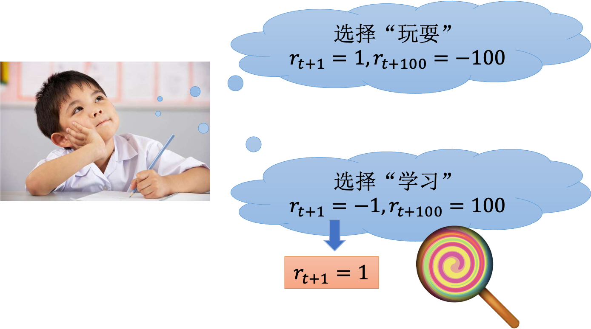
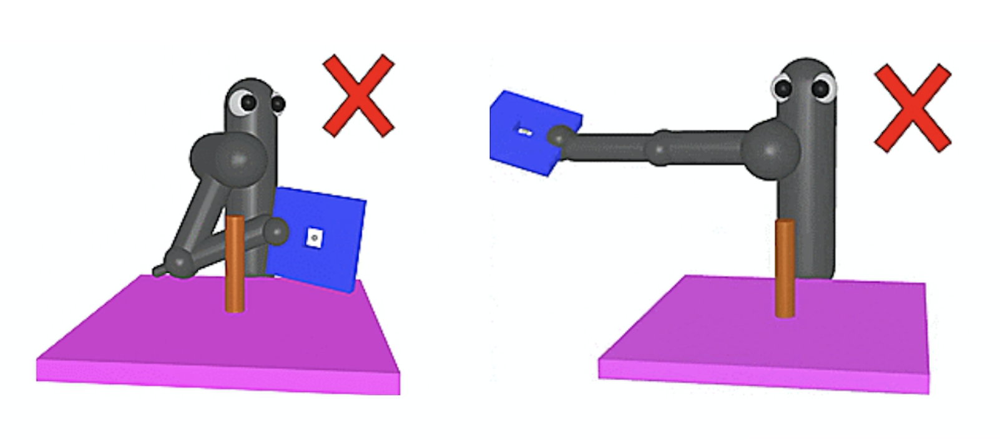
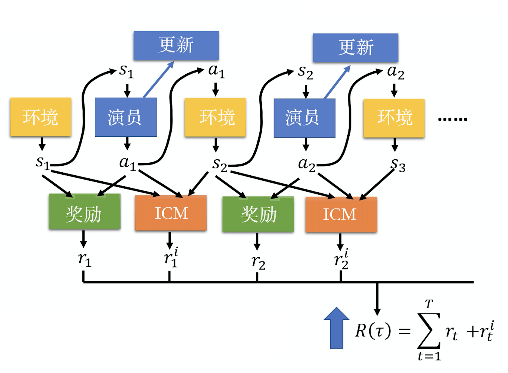
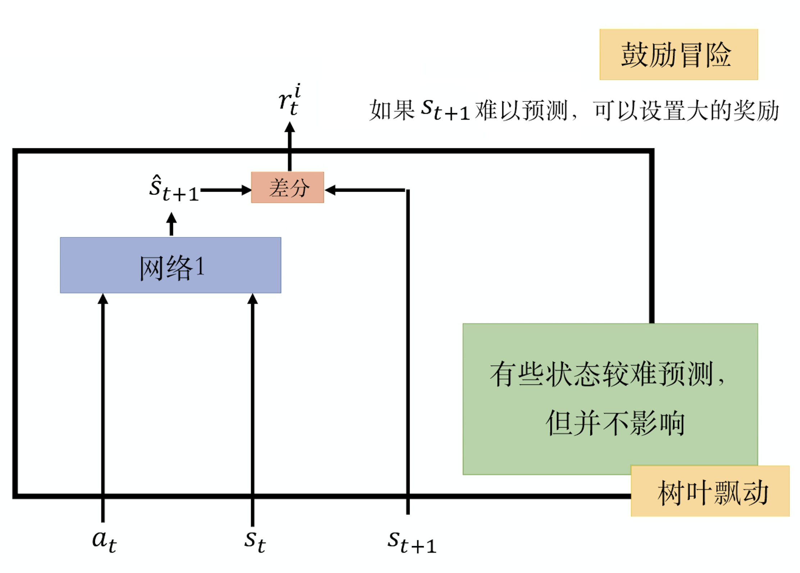
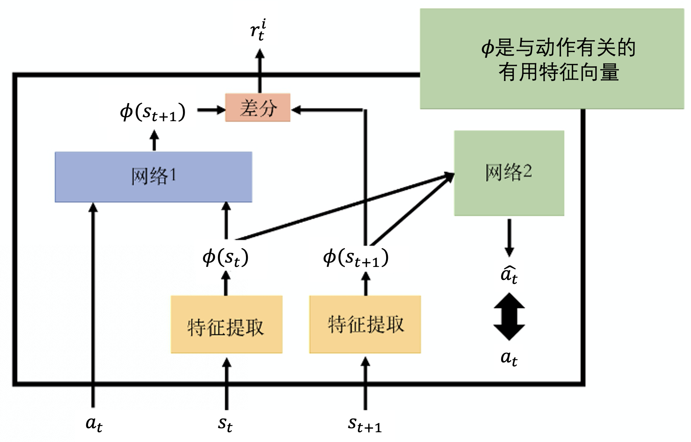
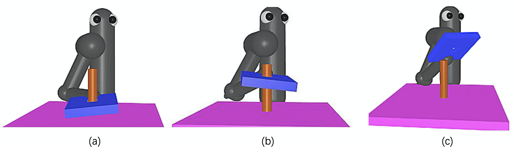
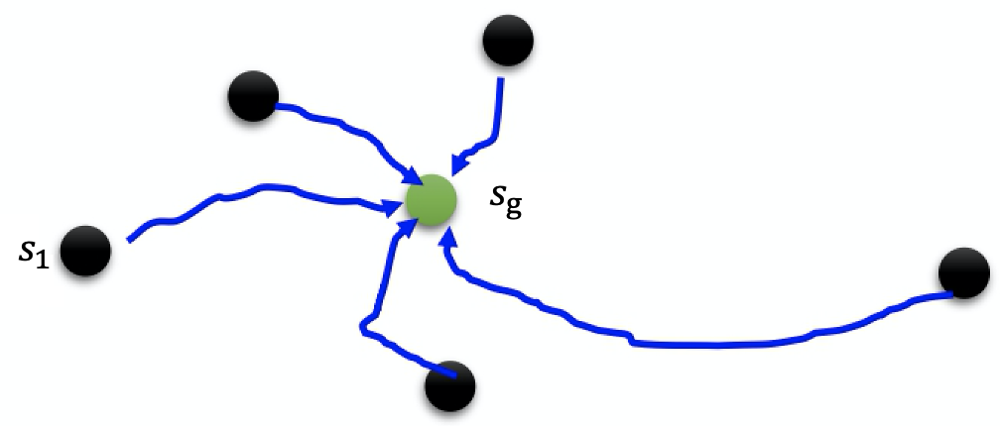
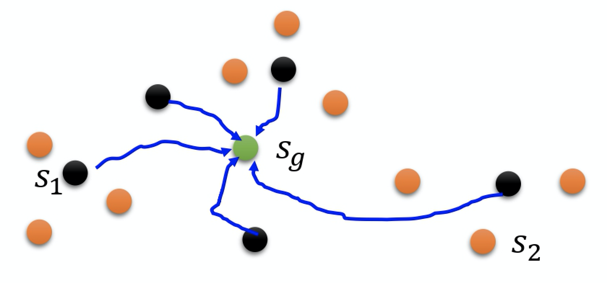
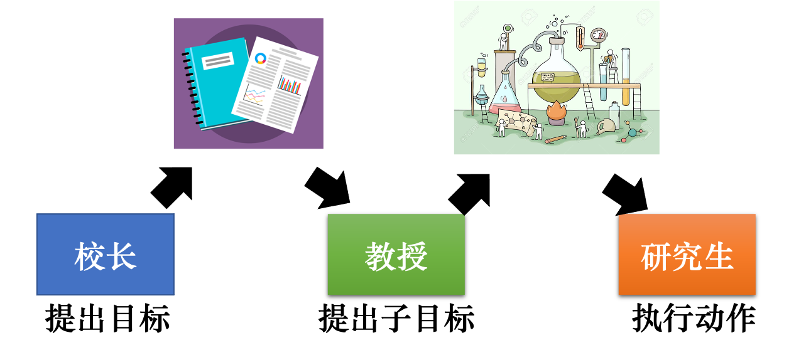
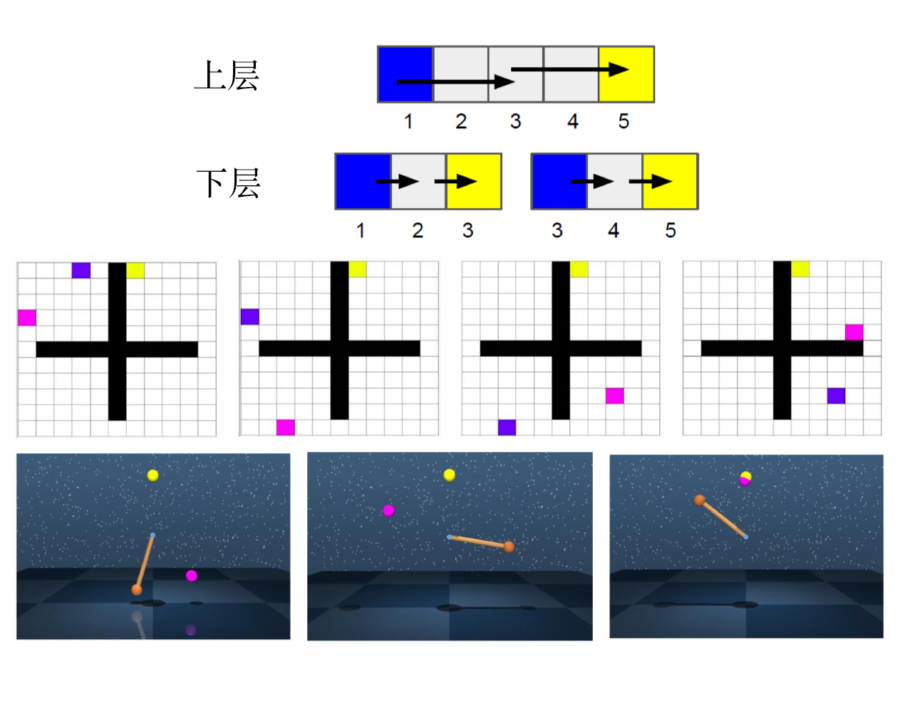

# 第10章 稀疏奖励
实际上用强化学习训练智能体的时候，多数时候智能体都不能得到奖励。在不能得到奖励的情况下，训练智能体是非常困难的。例如，假设我们要训练一个机器臂，桌上有一个螺丝钉与一个螺丝起子，要训练它用螺丝起子把螺丝钉栓进去很难，因为一开始智能体是什么都不知道，它唯一能够做不同的动作的原因是探索。例如，我们在做 Q学习 的时候会有一些随机性，让它去采取一些过去没有采取过的动作，要随机到，它把螺丝起子捡起来，再把螺丝栓进去，就会得到奖励1，这件事情是永远不可能发生的。所以，不管演员做了什么事情，它得到的奖励永远都是 0，对它来说不管采取什么样的动作都是一样糟或者是一样好。所以，它最后什么都不会学到。

如果环境中的奖励非常稀疏，强化学习的问题就会变得非常困难，但是人类可以在非常稀疏的奖励上去学习。人生通常多数的时候，就只是活在那里，都没有得到什么奖励或是惩罚。但是，人还是可以采取各种各样的行为。所以，一个真正厉害的人工智能应该能够在稀疏奖励的情况下也学到怎么与环境交互。

我们可以通过3个方向来解决稀疏奖励的问题，下面一一介绍。

## 10.1 设计奖励

第一个方向是**设计奖励（reward shaping）**。环境有一个固定的奖励，它是真正的奖励，但是为了让智能体学到的结果是我们想要的，所以我们刻意设计了一些奖励来引导智能体。

例如，如图 10.1 所示，如果我们把小孩当成一个智能体，他可以采取两个动作：玩耍或者学习。如果他玩耍，在下一个时间点就会得到奖励 1。但是他在月考的时候，成绩可能会很差，所以在 100 个小时之后，他会得到奖励 $-$100。他也可以决定要学习，在下一个时间点，因为他没有玩耍，所以觉得很不爽，所以得到奖励 $-$1。但是在 100 个小时后，他可以得到奖励 100。对于一个小孩来说，他可能就会想要采取玩耍的动作而不是学习的动作。我们计算的是累积奖励，但也许对小孩来说，折扣因子会很大，所以他就不太在意未来的奖励。而且因为他是一个小孩，还没有很多经验，所以他的Q函数估计是非常不精准的。所以要他去估计很远以后会得到的累积奖励，他是估计不出来的。这时候大人就要引导他，对他说：“如果你学习，我就给你一根棒棒糖。”对小孩来说，下一个时间点他得到的奖励就变成正的，他也许就会认为学习是比玩耍好的。虽然这并不是真正的奖励，而是其他人引导他的奖励。设计奖励的概念是一样的，简单来说，就是我们自己想办法设计一些奖励，这些奖励不是环境真正的奖励。在玩雅达利游戏时，真正的奖励是游戏主机给的奖励，但我们自己可以设计一些奖励引导智能体，让智能体做我们想要它做的事情。

    

图 10.1 设计奖励

    

举个 Meta（原Facebook）玩 *ViZDoom* 的智能体的例子。*ViZDoom* 是一个第一人称射击游戏，在这个射击游戏中，杀了敌人得到正奖励，被杀得到负奖励。研究人员设计了一些新的奖励，用新的奖励来引导智能体让它们做得更好，这不是游戏中真正的奖励。比如掉血就扣分，弹药减少就扣分，捡到补给包就加分，待在原地就扣分，移动就加分。活着会扣一个很小的分数，因为如果不这样做，智能体会只想活着，一直躲避敌人，这样会让智能体好战一些。

设计奖励是有问题的，因为我们需要领域知识（domain knowledge）。例如，如图 10.2 所示，机器人想要学会把蓝色的板子从柱子穿过。机器人很难学会，我们可以设计奖励。一个貌似合理的说法是，蓝色的板子离柱子越近，奖励越大。但是机器人靠近的方式会有问题，它会用蓝色的板子打柱子。而机器人要把蓝色板子放在柱子上面，才能让蓝色板子穿过柱子。因此，这种设计奖励的方式是有问题的。至于哪种设计奖励的方式有问题，哪种设计奖励的方式没问题，会变成一个领域知识，是我们要去调整的。
    

图 10.2 设计奖励的问题

    
## 10.2 好奇心  

接下来介绍各种我们可以自己加入并且一般看起来是有用的奖励。例如，一种技术是给智能体加上好奇心（curiosity），称为**好奇心驱动的奖励（curiosity driven reward）**。如图 10.3 所示，我们输入某个状态和某个动作到奖励函数中，奖励函数就会输出在这个状态采取这个动作会得到的奖励，总奖励越大越好。

在好奇心驱动的技术里面，我们会加上一个新的奖励函数------**内在好奇心模块（intrinsic curiosity module，ICM）**，它用于给智能体加上好奇心。内在好奇心模块需要 3 个输入：状态$s_1$、动作 $a_1$ 和状态$s_2$。根据输入，它会输出另外一个奖励$r_1^i$。对智能体来说，总奖励并不是只有 $r$，还有 $r^i$。它不是只把所有的 $r$ 都加起来，它还把所有 $r^i$ 加起来当作总奖励。所以在与环境交互的时候，它不是只希望 $r$ 越大越好，它还同时希望 $r^i$ 越大越好，它希望从内在好奇心模块里面得到的奖励越大越好。内在好奇心模块代表一种好奇心。

图 10.3 好奇心

怎么设计内在好奇心模块？最原始的设计如图 10.4 所示，内在好奇心模块的输入是现在的状态$s_t$、在这个状态采取的动作$a_t$以及下一个状态$s_{t+1}$，输出一个奖励$r^i_t$。那么 $r^i_t$  是怎么算出来的呢？在内在好奇心模块里面，我们有一个网络，这个网络会接收输入$a_t$ 与$s_t$，输出 $\hat{s}_{t+1}$，也就是这个网络根据 $a_t$ 和 $s_t$ 去预测  $\hat{s}_{t+1}$ 。然后再看这个网络的预测  $\hat{s}_{t+1}$ 与真实的情况 $s_{t+1}$ 的相似度，越不相似得到的奖励就越大。所以奖励$r_t^i$ 的意思是，未来的状态越难被预测，得到的奖励就越大。这就是鼓励智能体去冒险、去探索，现在采取这个动作，未来会发生什么越难被预测，这个动作的奖励就越大。所以如果有这样的内在好奇心模块，智能体就会倾向于采取一些风险比较大的动作，它想要去探索未知的世界。假设某一个状态是它没有办法预测的，它就会特别想要接近该状态，这可以提高智能体探索的能力。

网络 1 是另外训练出来的。训练的时候，我们会给网络 1 输入$a_t$、 $s_t$、 $s_{t+1}$，让网络 1 学习根据给定 $a_t$、$s_t$ 预测 $\hat{s}_{t+1}$。在智能体与环境交互的时候，我们要把内在好奇心模块固定住。这个想法有一个问题：某些状态很难被预测并不代表它就是好的、它就是应该要被尝试的。例如，俄罗斯轮盘的结果也是没有办法预测的，这并不代表人应该每天去玩俄罗斯轮盘。所以只鼓励智能体去冒险是不够的，因为如果仅仅只有这个网络的架构，智能体只知道什么东西它无法预测。如果在某一个状态采取某一个动作，智能体无法预测接下来结果，它就会采取那个动作，但这并不代表这样的结果一定是好的。例如，可能在某个游戏里面，背景会有风吹草动、会有树叶飘动这种无关紧要的事情。也许树叶飘动这件事，是很难被预测的，对智能体来说，它在某一个状态什么都不做，就看着树叶飘动，发现树叶飘动是没有办法预测的，接下来它就会一直看树叶飘动。所以智能体仅仅有好奇心是不够的，还要让它知道，什么事情是真正重要的。

图 10.4 内在好奇心模块设计

    
怎么让智能体知道什么事情是真正重要的呢？我们要加上另外一个模块，我们要学习一个**特征提取器（feature extractor）**。如图 10.5 所示，黄色的格子代表特征提取器，它输入一个状态，输出一个特征向量来代表这个状态，我们期待特征提取器可以把没有意义的画面，状态里面没有意义的东西过滤掉，比如风吹草动、白云的飘动以及树叶飘动。

假设特征提取器可以把无关紧要的信息过滤掉，网络 1 实际上做的事情是，给它一个演员和一个状态$s_t$ 的特征表示（feature representation），让它预测状态$s_{t+1}$ 的特征表示。接下来我们再来评价，这个预测的结果与真正的状态$s_{t+1}$ 的特征表示像不像，越不像，奖励就越大。怎么学习特征提取器呢？怎么让特征提取器把无关紧要的信息过滤掉呢？
我们可以学习另外一个网络，即网络 2。网络 2 把向量 $\pmb{\phi}(s_t)$和$\pmb{\phi}(s_{t+1})$ 作为输入，它要预测动作$a$ 是什么，它希望这个动作$a$ 与真正的动作$a$ 越接近越好。网络 2 会输出一个动作$a_t$，它会输出，从状态$s_t$ 到状态$s_{t+1}$，要采取的动作与真正的动作越接近越好。加上网络 2 是因为要用 $\pmb{\phi}(s_t)$、$\pmb{\phi}(s_{t+1})$  预测动作。所以，我们提取出来的特征与预测动作这件事情是有关的，风吹草动等与智能体要采取的动作无关的就会被过滤掉，就不会在被提取出来的向量中被表示。

    

图 10.5 好奇心模块

## 10.3 课程学习 

第二个方向是**课程学习（curriculum learning）** 。课程学习不是强化学习独有的概念，在机器学习尤其是深度学习中，我们都会用到课程学习的概念。具体来说，课程学习是指我们为智能体的学习做规划，给他“喂”的训练数据是有顺序的，通常都是由简单到难的。比如，假设我们要教一个小朋友学微积分，他做错题就惩罚他，这样他很难学会。我们应该先教他乘法，再教他微积分。所以课程学习就是指在训练智能体的时候，训练数据从简单到困难。就算不是强化学习，一般在训练深度网络的时候，我们有时候也会这么做。例如，在训练循环神经网络 的时候，已经有很多的文献都证明，给智能体先看短的序列，再慢慢给它看长的序列，通常它可以学得比较好。在强化学习里面，我们就是要帮智能体规划它的课程，课程难度从易到难。

例如，Meta玩 *ViZDoom* 的智能体表现非常好，它参加 *ViZDoom* 的比赛得了第一名。对于 Meta 玩 *ViZDoom* 的智能体，是有为智能体规划课程的，从课程 0 一直到课程 7。在不同的课程里面，怪物的速度与血量是不一样的。所以，在越进阶的课程里面，怪物的速度越快，血量越多。如果直接上课程 7，智能体是无法学习的。要从课程 0 开始，一点一点增加难度，这样智能体才学得起来。

再例如，对于把蓝色的板子穿过柱子的任务，怎么让机器人一直从简单学到难呢？如图 10.6（左）所示，也许一开始，板子就已经在柱子上了。这时候，机器人只要把蓝色的板子压下去就可以了。这种情况比较简单，机器人应该很快就能学会。因为机器人只有往上与往下这两个选择，往下就得到奖励，任务就结束了，所有它也不知道学的是什么。如图 10.6（中）所示，我们把板子放高一点儿，机器人有时候会笨拙地往上拉板子，然后把板子拿出来。如果机器人可以学会压板子，拿板子也有很大的可能可以学会。假设机器人现在已经学到，只要板子接近柱子，它就可以把板子压下去。接下来，我们再让它学更一般的情况。如图 10.6（右）所示，一开始，让板子离柱子远一点儿。然后，板子放到柱子上面的时候，机器人就知道把板子压下去，这就是课程学习的概念。当然课程学习有点儿特别，它需要人去为智能体设计课程。

图 10.6 课程学习

    

有一个比较通用的方法：**逆向课程生成（reverse curriculum generation）**。我们可以用一个比较通用的方法来帮智能体设计课程。如图 10.7 所示，假设我们一开始有一个状态$s_\mathrm{g}$，这是**黄金状态（gold state）**，也就是最后最理想的结果。如果以板子和柱子的实验为例，黄金状态就是把板子穿过柱子。如果我们以训练机械臂抓东西为例，抓到东西就称为黄金状态。接下来我们根据黄金状态去找其他的状态，这些其他的状态与黄金状态是比较接近的。例如，在让机械臂抓东西的例子里面，机械臂可能还没有抓到东西。假设与黄金状态很接近的状态称为 $s_1$。机械臂还没有抓到东西，但它与黄金状态很接近，这种状态可称为$s_1$。至于什么是接近，这取决于具体情况。我们要根据任务来设计怎么从 $s_\mathrm{g}$ 采样出 $s_1$。接下来，智能体再从 $s_1$ 开始与环境交互，看它能不能够达到黄金状态$s_\mathrm{g}$，在每一个状态下，智能体与环境交互的时候，都会得到一个奖励。

图 10.7 逆向课程生成

    

接下来，我们把奖励特别极端的情况去掉。奖励特别极端的情况的意思是这些情况太简单或是太难了。如果奖励很大，就代表这个情况太简单了，就不用学习了，因为智能体已经会了，它可以得到很大的奖励。如果奖励太小，就代表这个情况太难了，依照智能体现在的能力它学不会，所以就不学这个，只学一些奖励适中的情况。

接下来，再根据这些奖励适中的情况采样出更多的状态。假设一开始，机械臂在某个位置可以抓得到后。接下来，机械臂就再离远一点儿，看看能不能抓到；又能抓到后，再离远一点儿，看看能不能抓到。这是一个有用的方法，称为**逆课程学习（reverse curriculum learning）**。前面讲的是课程学习，就是我们要为智能体规划学习的顺序。而逆课程学习是从黄金状态反推，如图 10.8 所示，就是从目标反推，所以这称为逆课程学习。  

    

图 10.8 逆课程学习

    

## 10.4 分层强化学习 
第三个方向是**分层强化学习（hierarchical reinforcement learning，HRL）**。分层强化学习是指，我们有多个智能体，一些智能体负责比较高级的东西，它们负责定目标，定完目标以后，再将目标分配给其他的智能体，让其他智能体来执行目标。这样的想法也是很合理的。例如，假设我们想写一篇论文，首先我们要想创新点，想完创新点后，还要做实验。做实验以后，我们要写论文。写完论文以后还要投稿、发表。每一个动作下面又会再细分，比如怎么做实验呢？我们要先收集数据，收集完数据以后，要标注标签，还要设计一个网络，然后又训练不起来，要训练很多次。重新设计网络架构好几次，最后才把网络训练起来。所以，我们要完成一个很大的任务的时候，并不是从非常底层的动作开始做，其实是有一个计划的。我们会先想，如果要完成这个最大的任务，要将之拆解成哪些小任务，每一个小任务要怎么拆解成更小的任务。例如，我们直接写一本书可能很困难，但先把一本书拆成几章，每章拆成几节，每节又拆成几段，每段又拆成几个句，这样可能就比较好写，这就是分层强化学习。

如图 10.9 所示，例如，假设校长、教授和研究生都是智能体，并且我们所在的学校只要进入百大学校（QS排名前100的学校）就可以得到奖励。假设进入百大学校，校长就要提出愿景并告诉其他的智能体，现在我们要达到什么样的目标。校长的愿景可能是教授每年都要发3篇期刊。这些智能体都是分层的，所以上面的智能体，他的动作就是提出愿景。他把他的愿景传给下一层的智能体，下一层的智能体会接收这个愿景。如果他下面还有其他智能体，他就会提出新的愿景。比如，校长要教授发期刊论文，但教授自己没时间实验，他也只能够让下面的研究生做实验。所以教授就提出愿景，做出实验的规划，研究生才是执行这个实验的人。把实验做出来以后，大家就可以得到奖励。现在是这样的，在学习的时候，每一个智能体都会学习，他们的整体目标就是要得到最后的奖励。前面的智能体，他们提出来的动作就是愿景。但是，假设他们提出来的愿景是下面的智能体达不到的，就会被讨厌。例如，教授都一直让研究生做一些很困难的实验，研究生做不出来，教授就会得到一个惩罚。所以如果下层的智能体没有办法达到上层智能体所提出来的目标，上层的智能体就会被讨厌，它就会得到一个负奖励。所以他要避免提出的那些愿景是下层的智能体做不到的。每一个智能体都把上层的智能体所提出的愿景当作输入，决定他自己要产生什么输出。

但是就算看到上面的愿景让我们做某件事情，最后也不一定能做成这件事情。如图 10.10 所示，假设本来教授的目标是要发期刊论文，但他突然切换目标，要变成一个 YouTuber。这时，我们需要把原来的愿景改成变成 YouTuber。因为虽然本来的愿景是发期刊论文，但是后来变成 YouTuber，这些动作是没有被浪费的。我们就假设，本来的愿景就是要成为 YouTuber，我们就知道成为 YouTuber 要怎做了。这就是分层强化学习，是可以实现的技巧。

    

图 10.9 分层强化学习例子

    
    

图 10.10 改变愿景

    

图 10.11 是真实游戏的例子。第一个游戏是走迷宫，蓝色的是智能体，蓝色的智能体要走到黄色的目标。第二个游戏是单摆，单摆要碰到黄色的球。愿景是什么呢？在走迷宫游戏里面，只有两个智能体，下层的智能体负责决定要怎么走，上层的智能体负责提出愿景。虽然，实际上我们可以用很多层，但这只用了两层。走迷宫的游戏中粉红色的点代表的就是愿景。上层的智能体告诉蓝色的智能体，我们现在的第一个目标是先走到某个位置。蓝色的智能体到达以后，再说新的目标是走到另一个位置。蓝色的智能体再到达以后，新的目标会在其他位置。接下来蓝色的智能体又到达这个位置，最后希望蓝色的智能体可以到达黄色的位置。单摆的例子也一样，粉红色的点代表的是上层的智能体所提出的愿景，所以这个智能体先摆到这边，接下来，新的愿景又跑到某个位置，所以它又摆到对应的位置。然后，新的愿景又跑到上面。然后又摆到上面，最后就走到黄色的位置。这就是分层强化学习。

图 10.11 走迷宫和单摆的例子

    
最后，我们对分层强化学习进行总结。分层强化学习是指将一个复杂的强化学习问题分解成多个小的、简单的子问题，每个子问题都可以单独用马尔可夫决策过程来建模。这样，我们可以将智能体的策略分为高层次策略和低层次策略，高层次策略根据当前状态决定如何执行低层次策略。这样，智能体就可以解决一些非常复杂的任务。

## 参考文献

* [神经网络与深度学习](https://nndl.github.io/)

