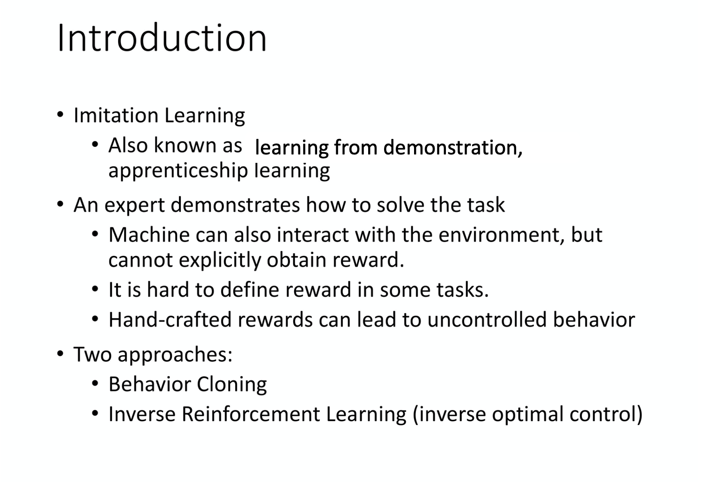
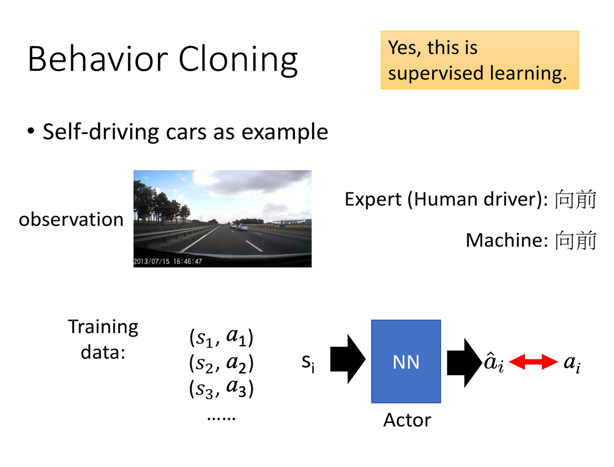
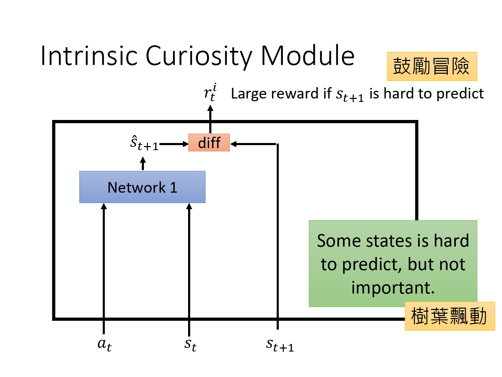
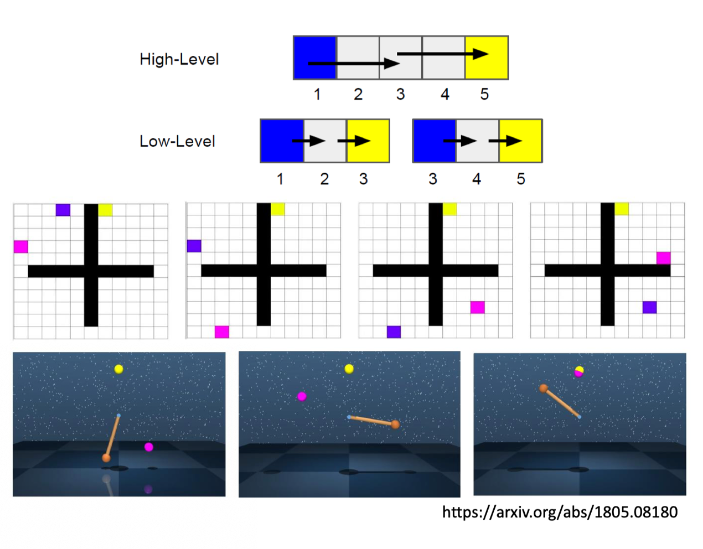

# Sparse Reward 
实际上用 reinforcement learning learn agent 的时候，多数的时候 agent 都是没有办法得到 reward 的。在没有办法得到 reward 的情况下，训练 agent 是非常困难的。举例来说，假设你要训练一个机器手臂，然后桌上有一个螺丝钉跟螺丝起子，那你要训练它用螺丝起子把螺丝钉栓进去，这个很难，为什么？因为一开始你的 agent 是什么都不知道的，它唯一能够做不同的 action 的原因是 exploration。举例来说，你在做 Q-learning 的时候，会有一些随机性，让它去采取一些过去没有采取过的 action，那你要随机到说，它把螺丝起子捡起来，再把螺丝栓进去，然后就会得到 reward 1，这件事情是永远不可能发生的。所以，不管你的 actor 做了什么事情，它得到 reward 永远都是 0，对它来说不管采取什么样的 action 都是一样糟或者是一样的好。所以，它最后什么都不会学到。

如果环境中的 reward 非常 sparse，reinforcement learning 的问题就会变得非常的困难，但是人类可以在非常 sparse 的 reward 上面去学习。我们的人生通常多数的时候，我们就只是活在那里，都没有得到什么 reward 或是 penalty。但是，人还是可以采取各种各式各样的行为。所以，一个真正厉害的 AI 应该能够在 sparse reward 的情况下也学到要怎么跟这个环境互动。

我们可以通过三个方向来解决 sparse reward 的问题。

## Reward Shaping

第一个方向是 `reward shaping`。**Reward shaping 的意思是说环境有一个固定的 reward，它是真正的 reward，但是为了让 agent 学出来的结果是我们要的样子，我们刻意地设计了一些 reward 来引导我们的 agent。**

举例来说，如果是把小孩当成一个 agent 的话。那一个小孩，他可以 take 两个 actions，一个 action 是他可以出去玩，那他出去玩的话，在下一秒钟它会得到 reward 1。但是他在月考的时候，成绩可能会很差。所以在100 个小时之后呢，他会得到 reward -100。然后，他也可以决定要念书，然后在下一个时间，因为他没有出去玩，所以他觉得很不爽，所以他得到 reward -1。但是在 100 个小时后，他可以得到 reward 100。但对一个小孩来说，他可能就会想要 take play 而不是 take study。我们计算的是 accumulated reward，但也许对小孩来说，他的 discount factor 会很大，所以他就不太在意未来的reward。而且因为他是一个小孩，他还没有很多 experience，所以他的 Q-function estimate 是非常不精准的。所以要他去 estimate 很远以后会得到的 accumulated reward，他其实是预测不出来的。所以这时候大人就要引导他，怎么引导呢？就骗他说，如果你坐下来念书我就给你吃一个棒棒糖。所以，对他来说，下一个时间点会得到的 reward 就变成是positive 的。所以他就觉得说，也许 take 这个 study 是比 play 好的。虽然这并不是真正的 reward，而是其他人骗他的reward，告诉他说你采取这个 action 是好的。Reward shaping 的概念是一样的，简单来说，就是你自己想办法 design 一些 reward，它不是环境真正的 reward。在玩 Atari 游戏里面，真的 reward 是游戏主机给你的 reward，但你自己去设计一些 reward 好引导你的 machine，做你想要它做的事情。

举例来说，这个例子是 Facebook 玩 VizDoom 的 agent。VizDoom 是一个第一人射击游戏，在这个射击游戏中，杀了敌人就得到 positive reward，被杀就得到 negative reward。他们设计了一些新的 reward，用新的 reward 来引导 agent 让他们做得更好，这不是游戏中真正的 reward。比如说掉血就扣 0.05 的分数，弹药减少就扣分，捡到补给包就加分，呆在原地就扣分，移动就加分。 活着会扣一个很小的分数，因为不这样做的话，machine 会只想活着，一直躲避敌人，这样会让 machine 好战一点。表格中的参数都是调出来的。

Reward shaping 是有问题的，因为我们需要 domain knowledge，举例来说，机器人想要学会的事情是把蓝色的板子从这个柱子穿过去。机器人很难学会，我们可以做 reward shaping。一个貌似合理的说法是，蓝色的板子离柱子越近，reward 越大。但是 machine 靠近的方式会有问题，它会用蓝色的板子打柱子。而我们要把蓝色板子放在柱子上面去，才能把蓝色板子穿过柱子。 这种 reward shaping 的方式是没有帮助的，那至于什么 reward shaping 有帮助，什么 reward shaping 没帮助，会变成一个 domain knowledge，你要去调的。

###  Curiosity

接下来就是介绍各种你可以自己加进去，in general 看起来是有用的 reward。举例来说，一个技术是给 machine 加上 curiosity，所以叫 `curiosity driven reward`。如上图所示，我们有一个 reward function，它给你某一个 state，给你某一个 action，它就会评断说在这个 state 采取这个 action 得到多少的 reward。那我们当然希望 total reward 越大越好。

在 curiosity driven 的这种技术里面，你会加上一个新的 reward function。这个新的 reward function 叫做 `ICM(intrinsic curiosity module)`，它就是要给机器加上好奇心。ICM 会吃 3 个东西，它会吃 state $s_1$、action $a_1$ 和 state $s_2$。根据 $s_1$ 、$a_1$、$s_2$，它会 output 另外一个 reward $r_1^i$。对 machine 来说，total reward 并不是只有 r 而已，还有 $r^i$。它不是只有把所有的 r 都加起来，它还把所有 $r^i$ 加起来当作 total reward。所以，它在跟环境互动的时候，它不是只希望 r 越大越好，它还同时希望 $r^i$ 越大越好，它希望从 ICM 的 module 里面得到的 reward 越大越好。ICM 就代表了一种 curiosity。

怎么设计这个 ICM ？这个是最原始的设计。这个设计是这样，curiosity module 就是 input 3 个东西，input 现在的 state，input 在这个 state 采取的 action，然后 input 下一个 state $s_{t+1}$。接下来会 output 一个 reward $r^i_t$。那这个 $r^i_t$  是怎么算出来的呢？在 ICM 里面，你有一个 network，这个 network 会 take $a_t$ 跟$s_t$，然后去 output $\hat{s}_{t+1}$，也就是这个 network 根据 $a_t$ 和 $s_t$ 去 predict  $\hat{s}_{t+1}$ 。接下来再看说，这个 network 的预测  $\hat{s}_{t+1}$ 跟真实的情况 $s_{t+1}$ 像不像，越不像那得到的 reward 就越大。所以这个 reward $r_t^i$ 的意思是说，如果未来的 state 越难被预测的话，那得到的 reward 就越大。这就是鼓励 machine 去冒险，现在采取这个 action，未来会发生什么事越没有办法预测的话，这个 action 的 reward 就大。所以如果有这样子的 ICM，machine 就会倾向于采取一些风险比较大的 action，它想要去探索未知的世界，它想要去看看说，假设某一个 state 是它没有办法预测，它会特别去想要采取那个 state，这可以增加 machine exploration 的能力。

这个 network 1 其实是另外 train 出来的。Training 的时候，这个 network 1，你会给它 $a_t$、 $s_t$、 $s_{t+1}$，然后让这个network 1 去学说 given $a_t, s_t$，怎么 predict $\hat{s}_{t+1}$。Apply 到 agent 互动的时候，其实要把 ICM module fix 住。其实，这一整个想法里面是有一个问题的。这个问题是某一些 state它很难被预测并不代表它就是好的，它就应该要去被尝试的。举例来说，俄罗斯轮盘的结果也是没有办法预测的，并不代表说，人应该每天去玩俄罗斯轮盘这样子。所以只是鼓励 machine 去冒险是不够的，因为如果光是只有这个 network 的架构，machine 只知道说什么东西它无法预测。如果在某一个 state 采取某一个 action，它无法预测接下来结果，它就会采取那个 action，但并不代表这样的结果一定是好的。举例来说，可能在某个游戏里面，背景会有风吹草动，会有树叶飘动。那也许树叶飘动这件事情，是很难被预测的，对 machine 来说它在某一个 state 什么都不做，看着树叶飘动，然后，发现这个树叶飘动是没有办法预测的，接下来它就会一直站在那边，看树叶飘动。所以说，光是有好奇心是不够的，还要让它知道说，什么事情是真正重要的。

怎么让 machine 知道说什么事情是真正重要的？你要加上另外一个 module，我们要 learn 一个`feature extractor`，黄色的格子代表 feature extractor，它是 input 一个 state，然后 output 一个 feature vector 来代表这个 state，那我们期待这个 feature extractor 可以把那种没有意义的画面，state 里面没有意义的东西把它过滤掉，比如说风吹草动、白云的飘动、树叶的飘动这种没有意义的东西直接把它过滤掉，

假设这个 feature extractor 真的可以把无关紧要的东西过滤掉以后，network 1 实际上做的事情是，给它一个 actor，给它一个 state $s_t$ 的 feature representation，让它预测 state $s_{t+1}$ 的 feature representation。接下来我们再看说，这个预测的结果跟真正的 state $s_{t+1}$ 的 feature representation 像不像，越不像，reward 就越大。怎么 learn 这个 feature extractor 呢？让这个 feature extractor 可以把无关紧要的事情滤掉呢？这边的 learn 法就是 learn 另外一个 network 2。这个 network 2 是吃 $\phi(s_t)$、$\phi(s_{t+1})$ 这两个 vector 当做 input，然后接下来它要 predict action a 是什么，然后它希望呢这个 action a 跟真正的 action a 越接近越好。这个 network 2 会 output 一个 action，它 output 说，从 state $s_t$ 跳到 state $s_{t+1}$，要采取哪一个 action 才能够做到，那希望这个 action 跟真正的 action 越接近越好。加上这个 network 2 的好处就是因为要用 $\phi(s_t)$、$\phi(s_{t+1})$  预测 action。所以，今天我们抽出来的 feature 跟预测 action 这件事情是有关的。所以风吹草动等与 machine 要采取的 action 无关的东西就会被滤掉，就不会被放在抽出来的 vector representation 里面。

## Curriculum Learning

第二个方向是 `curriculum learning` 。Curriculum learning 不是 reinforcement learning 所独有的概念，其实在 machine learning，尤其是 deep learning 里面，你都会用到 curriculum learning 的概念。举例来说，curriculum learning 的意思是说，你为机器的学习做规划，你给他喂 training data 的时候，是有顺序的，通常都是由简单到难。就好比说，假设你今天要交一个小朋友作微积分，他做错就打他一巴掌，这样他永远都不会做对，太难了。你要先教他九九乘法，然后才教他微积分。所以 curriculum learning 的意思就是在教机器的时候，从简单的题目教到难的题目。就算不是 reinforcement learning，一般在 train deep network 的时候，你有时候也会这么做。举例来说，在 train RNN 的时候，已经有很多的文献都 report 说，你给机器先看短的 sequence，再慢慢给它长的 sequence，通常可以学得比较好。那用在 reinforcement learning 里面，你就是要帮机器规划一下它的课程，从最简单的到最难的。

*  举例来说，在 Facebook 玩 VizDoom 的 agent 里面，Facebook 玩 VizDoom 的 agent 蛮强的。他们在参加这个 VizDoom 的比赛，机器的 VizDoom 比赛是得第一名的，他们是有为机器规划课程的。先从课程 0 一直上到课程 7。在这个课程里面，怪物的速度跟血量是不一样的。所以，在越进阶的课程里面，怪物的速度越快，然后他的血量越多。在 paper 里面也有讲说，如果直接上课程 7，machine 是学不起来的。你就是要从课程 0 一路玩上去，这样 machine 才学得起来。

* 再举个例子，把蓝色的板子穿过柱子，怎么让机器一直从简单学到难呢？
  * 如第一张图所示，也许一开始机器初始的时候，它的板子就已经在柱子上了。这个时候，机器要做的事情只有把蓝色的板子压下去，就结束了。这比较简单，它应该很快就学的会。它只有往上跟往下这两个选择嘛，往下就得到 reward，就结束了，他也不知道学的是什么。
  * 如第二张图所示，这边就是把板子挪高一点，挪高一点，所以它有时候会很笨的往上拉，然后把板子拿出来了。如果它压板子学得会的话，拿板子也比较有机会学得会。假设它现在学的到说，只要板子接近柱子，它就可以把这个板子压下去的话。接下来，你再让它学更 general 的 case。
  * 如第三张图所示，一开始，让板子离柱子远一点。然后，板子放到柱子上面的时候，它就会知道把板子压下去，这个就是 curriculum learning 的概念。当然 curriculum learning 有点 ad hoc(特别)，就是需要人去为机器设计它的课程。

### Reverse Curriculum Generation

有一个比较 general 的方法叫做 `Reverse Curriculum Generation`。你可以用一个比较通用的方法来帮机器设计课程，这个比较通用的方法是怎么样呢？假设你现在一开始有一个 state $s_g$，这是你的 gold state，也就是最后最理想的结果。如果拿刚才那个板子和柱子的实验作为例子的话，就把板子放到柱子里面，这样子叫做 gold state。你就已经完成了，或者你让机器去抓东西，你训练一个机器手臂抓东西，抓到东西以后叫做 gold state。接下来你根据你的 gold state 去找其他的 state，这些其他的 state 跟 gold state 是比较接近的。举例来说，如果是让机器抓东西的例子里面，你的机器手臂可能还没有抓到东西。假设这些跟 gold state 很近的 state 叫做 $s_1$。你的机械手臂还没有抓到东西，但它离 gold state 很近，那这个叫做$s_1$。至于什么叫做近，这是 case dependent，你要根据你的 task 来 design 说怎么从 $s_g$ sample 出 $s_1$。如果是机械手臂的例子，可能就比较好想。其他例子可能就比较难想。接下来呢，你再从这些 $s_1$ 开始做互动，看它能不能够达到 gold state $s_g$，那每一个 state，你跟环境做互动的时候，你都会得到一个 reward R。

接下来，我们把 reward 特别极端的 case 去掉。Reward 特别极端的 case 的意思就是说那些 case 太简单或是太难了。如果 reward 很大，代表说这个 case 太简单了，就不用学了，因为机器已经会了，它可以得到很大的 reward。如果 reward 太小，代表这个 case 太难了，依照机器现在的能力这个课程太难了，它学不会，所以就不要学这个，所以只找一些 reward 适中的 case。

什么叫做适中，这个就是你要调的参数，找一些 reward 适中的 case。接下来，再根据这些 reward 适中的 case 去 sample 出更多的 state。假设你一开始，你机械手臂在这边，可以抓的到以后。接下来，就再离远一点，看看能不能够抓得到，又抓的到以后，再离远一点，看看能不能抓得到。这是一个有用的方法，它叫做`Reverse Curriculum learning`。刚才讲的是 curriculum learning，就是你要为机器规划它学习的顺序。而 reverse curriculum learning 是从 gold state 去反推，就是说你原来的目标是长这个样子，我们从目标去反推，所以这个叫做 reverse。  

## Hierarchical RL

第三个方向是`分层强化学习(hierarchical reinforcement learning，HRL)`。分层强化学习是说，我们有好几个 agent。然后，有一些 agent 负责比较 high level 的东西，它负责订目标，然后它订完目标以后，再分配给其他的 agent，去把它执行完成。

这样的想法其实也是很合理的。因为人在一生之中，并不是时时刻刻都在做决定。举例来说，假设你想要写一篇 paper，你会说就我先想个梗这样子，然后想完梗以后，你还要跑个实验。跑完实验以后，你还要写。写完以后呢，你还要这个去发表。每一个动作下面又还会再细分，比如说怎么跑实验呢？你要先 collect data，collect 完 data 以后，你要再 label，你要弄一个 network，然后又 train 不起来，要 train 很多次。然后重新 design network 架构好几次，最后才把 network train 起来。

所以，我们要完成一个很大的 task 的时候，我们并不是从非常底层的那些 action 开始想起，我们其实是有个 plan。我们先想说，如果要完成这个最大的任务，那接下来要拆解成哪些小任务。每一个小任务要再怎么拆解成小小的任务。举例来说，叫你直接写一本书可能很困难，但叫你先把一本书拆成好几个章节，每个章节拆成好几段，每一段又拆成好几个句子，每一个句子又拆成好几个词汇，这样你可能就比较写得出来，这个就是分层的 reinforcement learning 的概念。

这边是举一个例子，就是假设校长、教授和研究生通通都是 agent。那今天假设我们只要进入百大就可以得到 reward。假设进入百大的话，校长就要提出愿景告诉其他的 agent 说，现在你要达到什么样的目标。那校长的愿景可能就是说教授每年都要发三篇期刊。然后接下来这些 agent 都是有分层的，所以上面的 agent，他的动作就是提出愿景这样。那他把他的愿景传给下一层的 agent，下一层的 agent 就把这个愿景吃下去。如果他下面还有其他人的话，它就会提出新的愿景。比如说，校长要教授发期刊，但其实教授自己也是不做实验的。所以，教授也只能够叫下面的研究生做实验。所以教授就提出愿景，就做出实验的规划，然后研究生才是真的去执行这个实验的人。然后，真的把实验做出来，最后大家就可以得到reward。那现在是这样子的，在 learn 的时候，其实每一个 agent 都会 learn。那他们的整体的目标就是要达到最后的reward。那前面的这些 agent，他提出来的 actions 就是愿景这样。你如果是玩游戏的话，他提出来的就是，我现在想要产生这样的游戏画面。但是，假设他提出来的愿景是下面的 agent 达不到的，那就会被讨厌。举例来说，教授对研究生都一直逼迫研究生做一些很困难的实验，研究生都做不出来的话，研究生就会跑掉，所以他就会得到一个 penalty。所以如果今天下层的 agent 没有办法达到上层 agent 所提出来的 goal 的话，上层的 agent 就会被讨厌，它就会得到一个 negative reward。所以他要避免提出那些愿景是底下的 agent 所做不到的。那每一个 agent 都是把上层的 agent 所提出来的愿景当作输入，然后决定他自己要产生什么输出。

但是你知道说，就算你看到上面的的愿景说，叫你做这一件事情。你最后也不一定能做成这一件事情。假设本来教授目标是要写期刊，但是不知道怎么回事，他就要变成一个 YouTuber。这个 paper 里面的 solution，我觉得非常有趣。给大家做一个参考，这其实本来的目标是要写期刊，但却变成 YouTuber，那怎么办呢? 把原来的愿景改成变成 YouTuber 就行了，在 paper 里面就是这么做的，为什么这么做呢? 因为虽然本来的愿景是要写期刊，但是后来变成 YouTuber，难道这些动作都浪费了吗? 不是，这些动作是没有被浪费的。我们就假设说，本来的愿景其实就是要成为 YouTuber，那你就知道成为 YouTuber 要怎做了。这个是分层 RL，是可以做得起来的 tip。

上图是真实的例子。实际上呢，这里面就做了一些比较简单的游戏，这个是走迷宫，蓝色是 agent，蓝色的 agent 要走到黄色的目标。这边也是，这个单摆要碰到黄色的球。那愿景是什么呢？

在这个 task 里面，它只有两个 agent ，下层的一个 agent 负责决定说要怎么走，上层的 agent 就负责提出愿景。虽然，实际上你可以用很多层，但 paper 就用了两层。

走迷宫的例子是说粉红色的这个点代表的就是愿景。上层这个 agent，它告诉蓝色的这个 agent 说，你现在的第一个目标是先走到这个地方，蓝色的 agent 走到以后，再说你的新的目标是走到这里。蓝色的 agent 再走到以后，新的目标在这里。接下来又跑到这边，最后希望蓝色的 agent 就可以走到黄色的这个位置。

单摆的例子也一样，就是粉红色的这个点代表的是上层的 agent 所提出来的愿景，所以这个 agent 先摆到这边，接下来，新的愿景又跑到这边，所以它又摆到这里。然后，新的愿景又跑到上面。然后又摆到上面，最后就走到黄色的位置了。这个就是 hierarchical 的 reinforcement learning。

最后总结下分层强化学习。分层强化学习是指将一个复杂的强化学习问题分解成多个小的、简单的子问题，每个子问题都可以单独用马尔可夫决策过程来建模。这样，我们可以将智能体的策略分为高层次策略和低层次策略，高层次策略根据当前状态决定如何执行低层次策略。这样，智能体就可以解决一些非常复杂的任务。

## References

* [神经网络与深度学习](https://nndl.github.io/)

