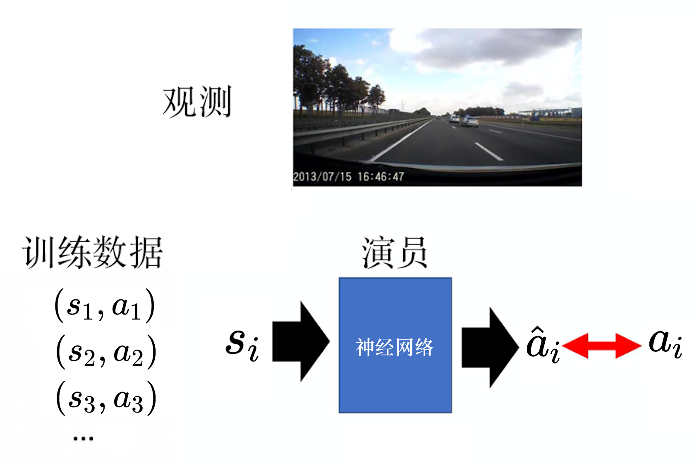
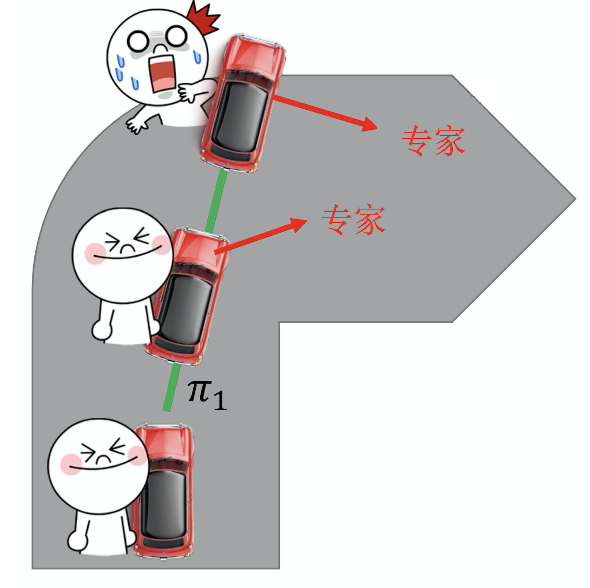
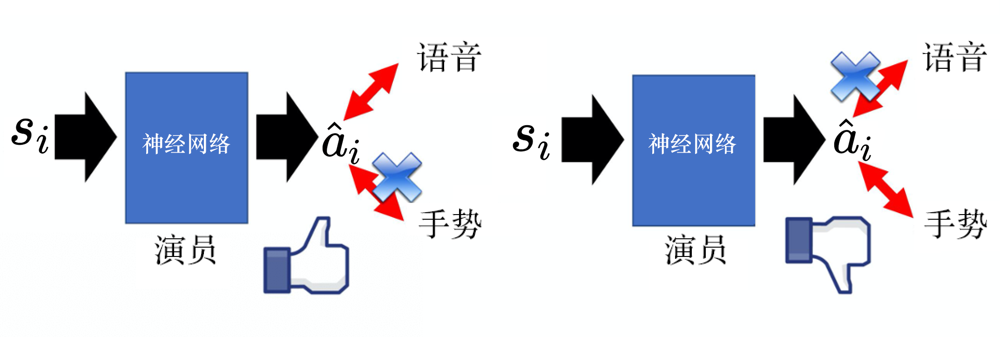
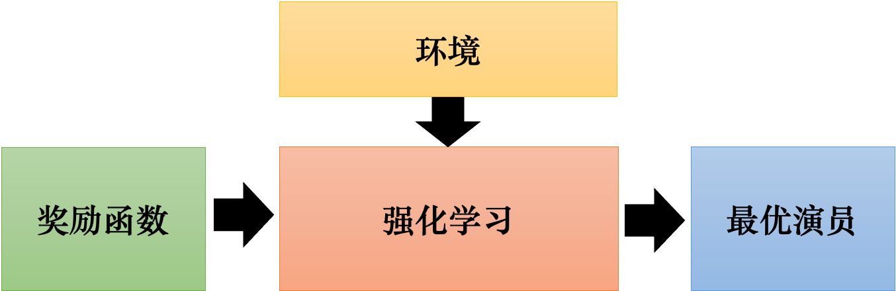
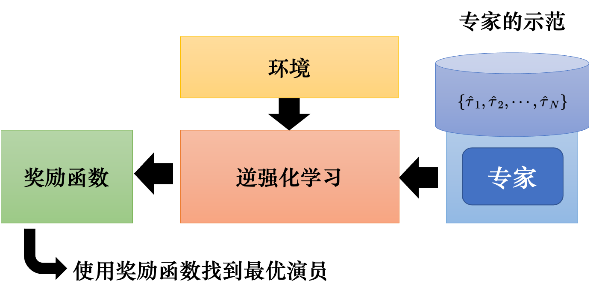
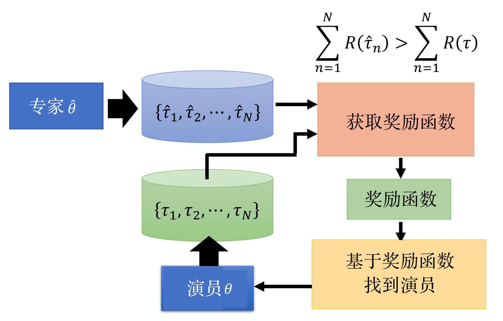
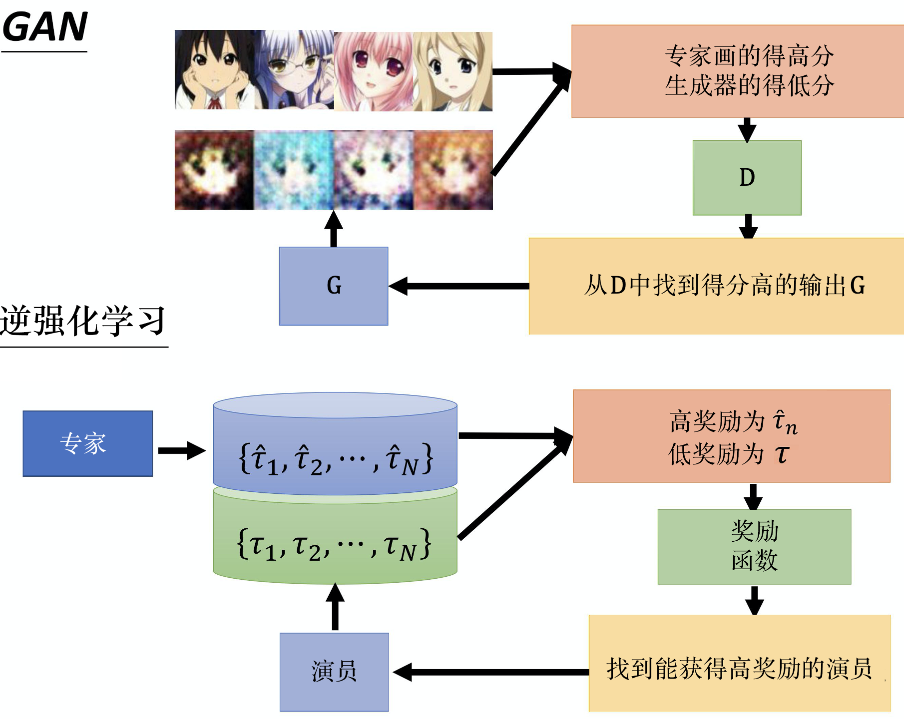

# 第11章 模仿学习

**模仿学习（imitation learning，IL）** 讨论的问题是，假设我们连奖励都没有，要怎么进行更新以及让智能体与环境交互呢？模仿学习又被称为**示范学习（learning from demonstration）**，**学徒学习（apprenticeship learning）**，**观察学习（learning by watching）**。在模仿学习中，有一些专家的示范，智能体也可以与环境交互，但它无法从环境里得到任何的奖励，它只能通过专家的示范来学习什么是好的，什么是不好的。其实，在多数情况下，我们都无法从环境里得到非常明确的奖励。例如，如果是棋类游戏或者是电玩，我们将会有非常明确的奖励。但是多数的情况都是没有奖励的，以聊天机器人为例，机器人与人聊天，聊得怎样算是好，聊得怎样算是不好，我们是无法给出明确的奖励的。

当然，虽然我们无法给出明确的奖励，但是我们可以收集专家的示范。例如，在自动驾驶汽车方面，虽然我们无法给出自动驾驶汽车的奖励，但我们可以收集很多人类开车的记录。在聊天机器人方面，我们可能无法定义什么是好的对话，什么是不好的对话，但我们可以收集很多人的对话当作范例。因此模仿学习的实用性非常高。假设我们不知道该怎么定义奖励，就可以收集专家的示范。如果我们可以收集到一些示范，可以收集到一些很厉害的智能体（比如人）与环境实际上的交互，就可以考虑采用模仿学习。在模仿学习里面，我们介绍两个方法：**行为克隆（behavior cloning，BC）**和**逆强化学习（inverse reinforcement learning，IRL）** 。逆强化学习也被称为**逆最优控制（inverse optimal control）**。

## 11.1 行为克隆  

其实行为克隆与监督学习较为相似。以自动驾驶汽车为例，如图 11.1 所示，我们可以收集到人开自动驾驶汽车的数据，比如可以通过行车记录器进行收集。看到图 11.1 所示的观测的时候，人会决定向前，智能体也采取与人一样的行为，即也向前。专家做什么，智能体就做一模一样的事，这就称为行为克隆。

怎么让智能体学会与专家一模一样的行为呢？我们可以把它当作一个监督学习的问题，先收集很多行车记录器的数据，再收集人在具体情境下会采取什么样的行为（训练数据）。我们知道人在状态$s_1$ 会采取动作$a_1$，人在状态$s_2$ 会采取动作$a_2$，人在状态 $s_3$ 会采取动作$a_3$.......接下来，我们就学习一个网络。这个网络就是演员，输入$s_i$ 的时候，我们希望它的输出 是$a_i$。

图 11.1 自动驾驶汽车例子

行为克隆虽然非常简单，但它的问题是，如果我们只收集专家的示范，可能我们看过的观测以及状态是非常有限的。例如，如图 11.2 所示，假设我们要学习自动驾驶一辆汽车通过图中的弯道。如果是专家，它将顺着红线通过弯道。但假设智能体很笨，它开车的时候撞墙了，它永远不知道撞墙这种状况要怎么处理。因为训练数据里面从来没有撞墙相关的数据，所以它根本就不知道撞墙这种情况要怎么处理。打电玩也是一样的，让专家去玩《超级马里奥》，专家可能非常强，它从来不会跳不上水管，所以智能体根本不知道跳不上水管时要怎么处理。所以仅仅使用行为克隆是不够的，只观察专家的示范是不够的，还需要结合另一个方法：**数据集聚合（dataset aggregation，DAgger）**。

图 11.2 行为克隆的问题

我们希望收集更多样的数据，而不是只收集专家所看到的观测。我们希望能够收集专家在各种极端的情况下所采取的行为。如图 11.3 所示，以自动驾驶汽车为例，一开始我们有演员 $\theta_1$，并且让其去驾驶这辆车，同时车上坐了一个专家。这个专家会不断地告诉智能体，如果在这个情境里面，我会怎么样开。所以 $\theta_1$ 自己开自己的，但是专家会不断地表达它的想法。比如，一开始的时候，专家可能说往前走。在拐弯的时候，专家可能就会说往右转。但 $\theta_1$ 是不管专家的指令的，所以它会继续撞墙。虽然专家说往右转，但是不管他怎么下指令都是没有用的，$\theta_1$ 会做自己的事情，因为我们要做的记录的是说，专家在 $\theta_1$ 看到这种观测的情况下，它会做什么样的反应。这个方法显然是有一些问题的，因为我们每开一次自动驾驶汽车就会牺牲一个专家。我们用这个方法，牺牲一个专家以后，就会知道，人类在快要撞墙的时候，会采取什么样的行为。再用这些数据训练新的演员 $\theta_2$，并反复进行这个过程，这个方法称为数据集聚合。

图 11.3 数据集聚合

   
行为克隆还有一个问题：智能体会完全模仿专家的行为，不管专家的行为是否有道理，就算没有道理，没有什么用，就算这是专家本身的习惯，智能体也会把它记下来。如果智能体确实可以记住所有专家的行为，也许还好。因为如果专家这么做，有些行为是多余的。但是没有问题，假设智能体的行为可以完全仿造专家行为，也就算了，它就是与专家一样得好，只是做一些多余的事。但问题是智能体是一个网络，网络的容量是有限的。就算给网络训练数据，它在训练数据上得到的正确率往往也不是 100\%，它有些事情是学不起来的。这个时候，什么该学，什么不该学就变得很重要。

例如，如图 11.4 所示，在学习中文的时候，老师有语音、行为和知识，但其实只有语音部分是重要的，知识部分是不重要的。也许智能体只能学一件事，如果它只学到了语音，没有问题。如果它只学到了手势，这样就有问题了。所以让智能体学习什么东西是需要模仿的、什么东西是不需要模仿的，这件事情是很重要的。而单纯的行为克隆没有学习这件事情，因为智能体只是复制专家所有的行为而已，它不知道哪些行为是重要的，是对接下来有影响的，哪些行为是不重要的、是对接下来没有影响的。

图 11.4 智能体学习中文

   

行为克隆的问题还在于：我们使用行为克隆的时候，训练数据与测试数据是不匹配的。我们可以用数据集聚合的方法来缓解这个问题。在训练与测试的时候，数据分布是不一样的。因为在强化学习中，动作会影响到接下来的状态。我们先有状态$s_1$，然后采取动作$a_1$，$a_1$ 会决定接下来的状态$s_2$。所以在强化学习里有一个很重要的特征，就是我们采取的动作会影响我们接下来的状态，也就是会影响状态的分布。如果有行为克隆，我们只能观察到专家$\hat{\theta}$的一些状态-动作对$(s,a)$。

我们希望可以学习一个 $\theta^*$，并且希望 $\theta^*$ 与 $\hat{\theta}$ 越接近越好。如果 $\theta^*$ 可以与 $\hat{\theta}$ 一模一样，训练的时候看到的状态与测试的时候看到的状态会是一样的。因为虽然动作会影响我们看到的状态，但假设两个策略一模一样，在同一个状态都会采取同样的动作，我们接下来看到的状态都会是一样的。但问题就是我们很难让学习出来的策略与专家的策略一模一样。专家是一个自然人，网络要与人一模一样，有点儿困难。

如果 $\theta^*$ 与 $\hat{\theta}$ 有一点儿误差，在一般监督学习问题里面，每一个样本（example）都是独立的，也许没什么问题。但对强化学习的问题来说，可能在某个地方就是失之毫厘，谬以千里。可能在某个地方，也许智能体无法完全复制专家的行为，它复制的差了一点儿，也许最后得到的结果就会差很多。所以行为克隆并不能够完全解决模仿学习的问题，我们还有另外一个比较好的方法，称为逆强化学习。

## 11.3 逆强化学习  

为什么叫逆强化学习？因为原来的强化学习里，有一个环境和一个奖励函数。如图 11.5 所示，根据环境和奖励函数，通过强化学习这一技术，我们会找到一个演员，并会学习出一个最优演员。

图 11.5 强化学习的学习过程

   

但逆强化学习刚好是相反的，如图 11.6 所示，它没有奖励函数，只有一些专家的示范，但还是有环境的。逆强化学习假设现在有一些专家的示范，用 $\hat{\tau}$ 来代表专家的示范。如果是在玩电玩，每一个 $\tau$ 就是一个很会玩电玩的人玩一场游戏的记录。如果是自动驾驶汽车，就是人开自动驾驶汽车的记录。这些就是专家的示范，每一个 $\tau$ 是一个轨迹。

图 11.6 逆强化学习的学习过程

   

把所有专家的示范收集起来，再使用逆强化学习这一技术。使用逆强化学习技术的时候，智能体是可以与环境交互的。但它得不到奖励，它的奖励必须从专家那里推出来。有了环境和专家的示范以后，可以反推出奖励函数。强化学习是由奖励函数反推出什么样的动作、演员是最好的。逆强化学习则反过来，我们有专家的示范，我们相信它是不错的，我就反推，专家是因为什么样的奖励函数才会采取这些行为。有了奖励函数以后，接下来，我们就可以使用一般的强化学习的方法去找出最优演员。所以逆强化学习是先找出奖励函数，找出奖励函数以后，再用强化学习找出最优演员。

把这个奖励函数找出来，相较于原来的强化学习有什么好处呢？一个可能的好处是也许奖励函数是比较简单的。即虽然专家的行为非常复杂，但也许简单的奖励函数就可以导致非常复杂的行为。一个例子就是人类本身的奖励函数就只有活着这样，每多活一秒，我们就加一分。但人类有非常复杂的行为，但是这些复杂的行为都只是围绕着要从这个奖励函数里面得到分数而已。有时候很简单的奖励函数也许可以推导出非常复杂的行为。

逆强化学习实际上是怎么做的呢？如 11.7 所示，首先，我们有一个专家$\hat{\theta}$，这个专家与环境交互，产生很多轨迹 $\{\hat{\tau}_1,\hat{\tau}_2,\cdots,\hat{\tau}_N\}$。如果我们玩游戏，就让某个电玩高手去玩 $N$ 场游戏，把 $N$ 场游戏的状态与动作的序列都记录下来。接下来，我们有一个演员$\theta$，一开始演员很烂，这个演员也与环境交互。它也去玩了 $N$ 场游戏，它也有 $N$ 场游戏的记录。接下来，我们要反推出奖励函数。怎么反推出奖励函数呢？原则就是专家永远是最棒的，是先射箭，再画靶的概念。专家去玩一玩游戏，得到这些游戏的记录，演员也去玩一玩游戏，得到这些游戏的记录。接下来，我们要定一个奖励函数，这个奖励函数的原则就是专家得到的分数要比演员得到的分数高（先射箭，再画靶），所以我们就学习出一个奖励函数，这个奖励函数会使专家得到的奖励大于演员得到的奖励。有了新的奖励函数以后，我们就可以使用一般强化学习的方法学习一个演员，这个演员会针对奖励函数最大化它的奖励。它也会采取一些的动作。但是这个演员虽然可以最大化奖励函数，采取大量的动作，得到大量游戏的记录。

但接下来，我们更改奖励函数。这个演员就会很生气，它已经可以在这个奖励函数得到高分。但是它得到高分以后，我们就改奖励函数，仍然让专家可以得到比演员更高的分数。这就是逆强化学习。有了新的奖励函数以后，根据这个新的奖励函数，我们就可以得到新的演员，新的演员再与环境交互。它与环境交互以后，我们又会重新定义奖励函数，让专家得到的奖励比演员的大。

怎么让专家得到的奖励大过演员呢？如图 11.7 所示，我们在学习的时候，奖励函数也许就是神经网络。神经网络的输入 为$\tau$，输出就是应该要给 $\tau$ 的分数。或者假设我们觉得输入整个 $\tau$ 太难了，因为 $\tau$ 是 $s$ 和 $a$ 的一个很长的序列。也许就向它输入一个 $s$ 和 $a$ 的对，它会输出一个实数。把整个 $\tau$ 会得到的实数加起来就得到 $R(\tau)$。在训练的时候，对于 $\left\{\hat{\tau}_{1}, \hat{\tau}_{2}, \cdots, \hat{\tau}_{N}\right\}$，我们希望它输出的 $R$ 值越大越好。对于 $\left\{\tau_{1}, \tau_{2}, \cdots, \tau_{N}\right\}$，我们就希望 $R$ 值越小越好。

什么可以被称为一个最好的奖励函数呢？最后我们学习出来的奖励函数应该是专家和演员在这个奖励函数上都会得到一样高的分数。最终的奖励函数无法分辨出谁应该会得到比较高的分数。通常在训练的时候，我们会迭代地去做。最早的逆强化学习对奖励函数有些限制，它是假设奖励函数是线性的（linear） 。如果奖励函数是线性，我们可以证明这个算法会收敛（converge）。但是如果奖励函数不是线性的，我们就无法证明它会收敛。
   
其实我们只要把逆强化学习中的演员看成生成器，把奖励函数看成判别器，它就是 生成对抗网络。所以逆强化学习会不会收敛就等于 生成对抗网络 会不会收敛。如果我们已经实现过，就会知道逆强化学习不一定会收敛。但除非我们对 $R$ 执行一个非常严格的限制，否则如果 $R$ 是一个一般的网络，我们就会有很大的麻烦。

图 11.7 逆强化学习的框架

   

我们可以把逆强化学习与 生成对抗网络 详细地比较一下。如图 11.8 所示，在生成对抗网络 里面，我们有一系列很好的图、一个生成器和一个判别器。一开始，生成器不知道要产生什么样的图，它就会乱画。判别器的工作就是给画的图打分，专家画的图得高分，生成器画的图得低分。生成器会想办法去骗过判别器，生成器希望判别器也给它画的图打高分。整个过程与逆强化学习是一模一样的。专家画的图就是专家的示范。生成器就是 演员，生成器画很多图，演员与环境交互，产生很多轨迹。演员与环境交互的记录其实就等价于 生成对抗网络 里面的这些图。然后我们学习一个奖励函数。奖励函数就是判别器。奖励函数要给专家的示范打高分，给演员交互的结果打低分。接下来，演员会想办法，从已经学习出的奖励函数中得到高分，然后迭代地循环。

图 11.8 生成对抗网络与逆强化学习的区别

   

逆强化学习有很多的应用，比如可以用于自动驾驶汽车，有人用这个技术来学开自动驾驶汽车的不同风格。每个人在开车的时候会有不同风格，例如，能不能压到线、能不能倒退、要不要遵守交通规则等。每个人的风格是不同的，用逆强化学习可以让自动驾驶汽车学会各种不同的开车风格。

逆强化学习有一个有趣的地方：通常我们不需要太多的训练数据，训练数据往往都是个位数。因为逆强化学习只是一种示范，实际上智能体可以与环境交互多次，所以我们往往会看到只用几笔数据就可以训练出一些有趣的结果。图 11.9 所示为让自动驾驶汽车学会在停车场中安全停车的例子。这个例子的示范是这样的：蓝色是终点，自动驾驶汽车要开到蓝色终点停车。给智能体只看一行的4个示范，让它学习怎么开车，最后它就可以学出，如果它要在红色的终点位置停车，应该这样开。给智能体看不同的示范，最后它学出来的开车的风格就会不太一样。例如，图 11.9 第二行所示为不守规矩的开车方式，因为它会开到道路之外，并且还会穿过其他的车。所以智能体就会学到一些不符合交通规范的行为，例如不一定要走在道路上、可以走非道路的地方等。图 11.9 第三行所示为倒退停车，智能体也会学会说，它可以倒退。

图 11.9 自动驾驶汽车停车例子

   

我们也可以用逆强化学习训练机器人，我们可以让机器人做一些我们人类想要它做的动作。过去，如果我们要训练机器人，让它做我们想要它做的动作，其实是比较麻烦的。例如，如果我们要操控机械臂，就需要花很多精力编写程序，这样才能让机械臂做一件很简单的事情。有了逆强化学习技术，我们自身可以做示范，机器人就通过示范来学习。比如，让机器人学会摆盘子，拉着机器人的手臂去摆盘子，机器自己动。再如，让机器人学会倒水，人只教它 20 次，杯子每次放的位置不太一样。

## 11.4 第三人称视角模仿学习 

其实还有很多与训练机器人相关的研究，如图 11.10 所示，例如，我们在教机器人做动作的时候，要注意的是也许机器人的视角与我们人类的视角是不太一样的。在上面的例子中，人与机器人的动作是一样的。但是在未来的世界里面，也许机器人是看着人的行为学习的。刚才是人拉着，假设我们要让机器人学会打高尔夫球，如果与上面的例子相似，就是人拉着机器人手臂去打高尔夫球，但是在未来有没有可能，机器人看着人打高尔夫球，它自己就学会打高尔夫球了呢？这个时候，要注意的是机器人的视角与它真正去采取这个行为的视角是不一样的。机器人必须了解到当它是第三人称视角的时候，看到另外一个人在打高尔夫球，与它实际上自己去打高尔夫球的视角显然是不一样的。但它怎么把它是第三人视角所观察到的经验泛化到它是第一人称视角的时候所采取的行为，这就需要用到**第三人称视角模仿学习（third person imitation learning）** 技术。

图 11.10 第三人称视角模仿学习例子

   

这怎么做呢？第三人称视角模仿学习技术其实不只用到了模仿学习，它还用到了**领域对抗训练（domain-adversarial training）**。领域对抗训练也是一种 生成对抗网络 的技术。如图 11.11 所示，我们希望有一个特征提取器，有两幅不同领域（domain）的图像，通过特征提取器以后，无法分辨出图像来自哪一个领域。第一人称视角和第三人称视角模仿学习用的技术是一样的，希望学习一个特征提取器，智能体在第三人称的时候与它在第一人称的时候的视角其实是一样的，就是把最重要的东西抽出来就好了。 

图 11.11 第三人称视角模仿学习框架

## 11.5 序列生成和聊天机器人 

我们其实可以把句子生成（sentence generation）或聊天机器人理解为模仿学习。如图 11.12  所示，机器在模仿人写句子，我们在写句子的时候，将写下的每一个字都想成一个动作，所有的字合起来就是一个回合。例如，句子生成里面，我们会给机器看很多人类写的字。如果要让机器学会写诗，就要给它看唐诗三百首。人类写的字其实就是专家的示范。每一个词汇其实就是一个动作。机器做句子生成的时候，其实就是在模仿专家的轨迹。聊天机器人也是一样的，在聊天机器人里面我们会收集到很多人交互对话的记录，这些就是专家的示范。

如果我们单纯用最大似然（maximum likelihood）这个技术来最大化会得到似然（likelihood），这其实就是行为克隆。行为克隆就是看到一个状态，接下来预测我们会得到什么样的动作，有一个标准答案（ground truth）告诉机器什么样的动作是最好的。在做似然的时候也是一样的，给定句子已经产生的部分，接下来机器要预测写哪一个字才是最好的。所以，其实最大似然在做序列生成（sequence generation）的时候，它对应到模仿学习里面就是行为克隆。只有最大似然是不够的，我们想要用序列生成对抗网络（sequence GAN）。其实序列生成对抗网络对应逆强化学习，逆强化学习就是一种 生成对抗网络 的技术。我们把逆强化学习的技术放在句子生成、聊天机器人里面，其实就是序列生成对抗网络与它的种种变形。

图 11.12 仿学习例子

## 参考文献

* [机器学习](https://book.douban.com/subject/26708119//)
* [模仿学习（Imitation Learning）介绍](https://zhuanlan.zhihu.com/p/25688750)

