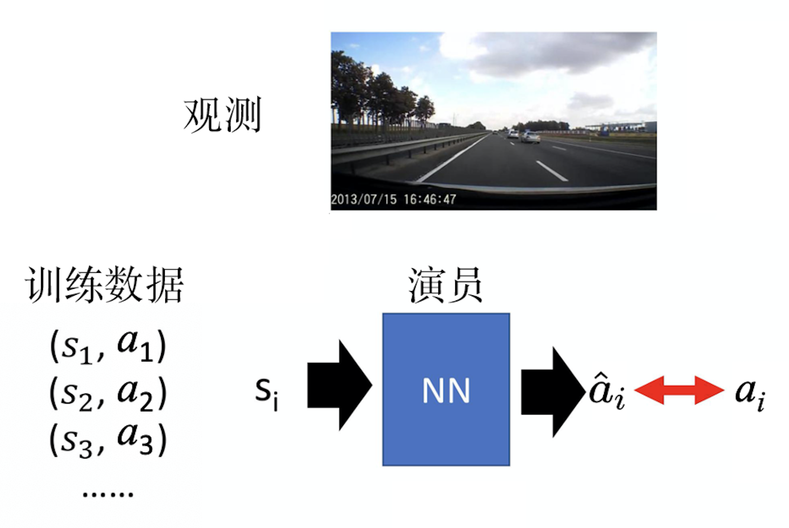
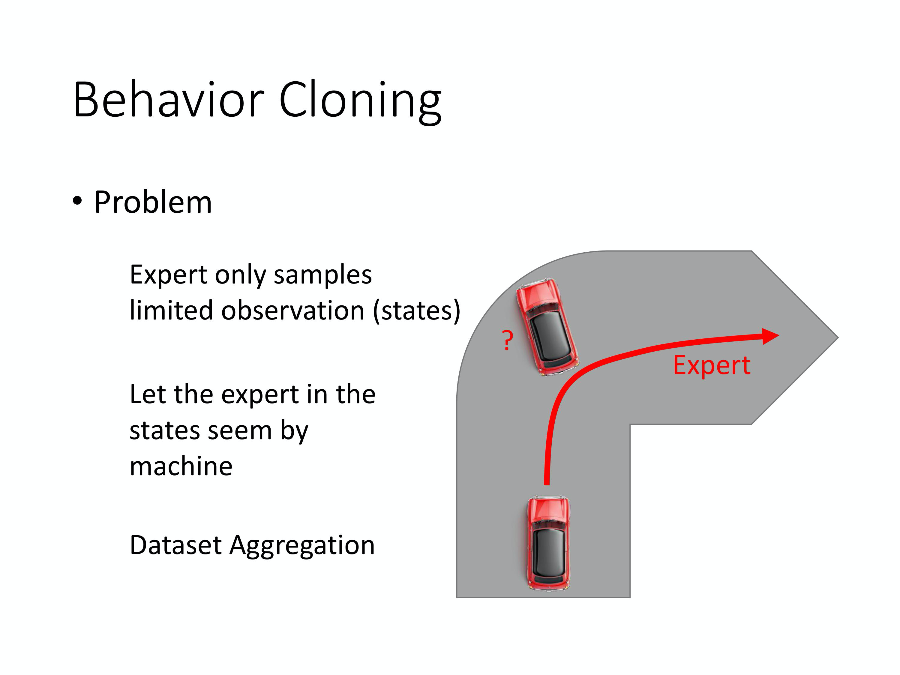
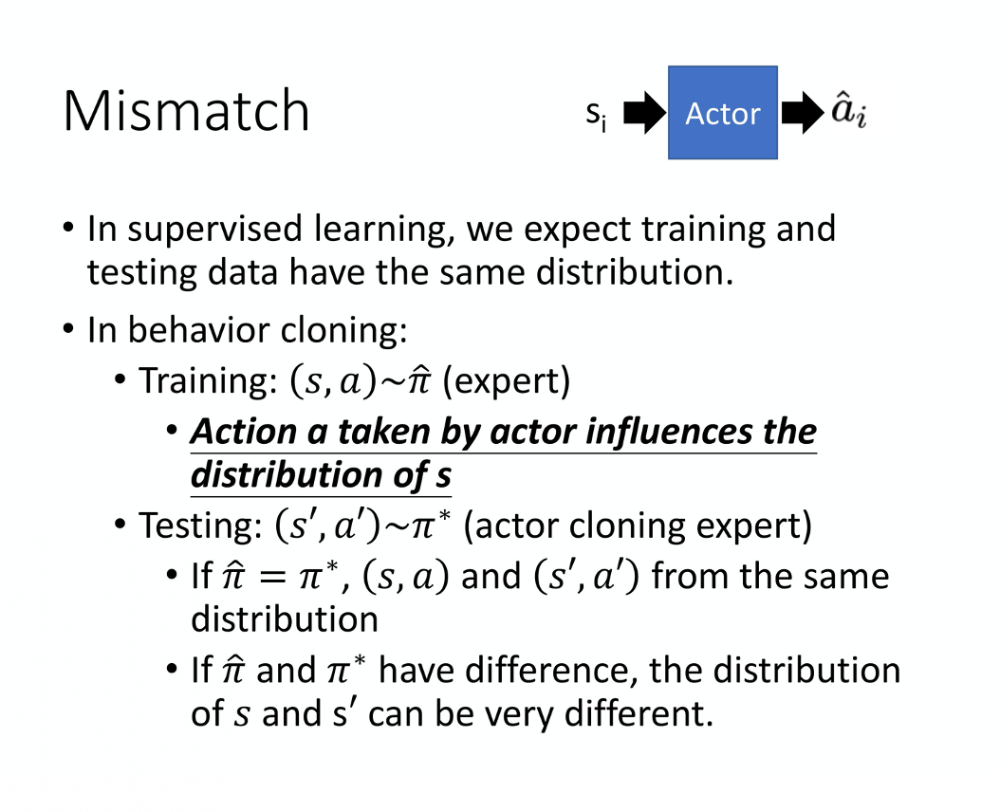
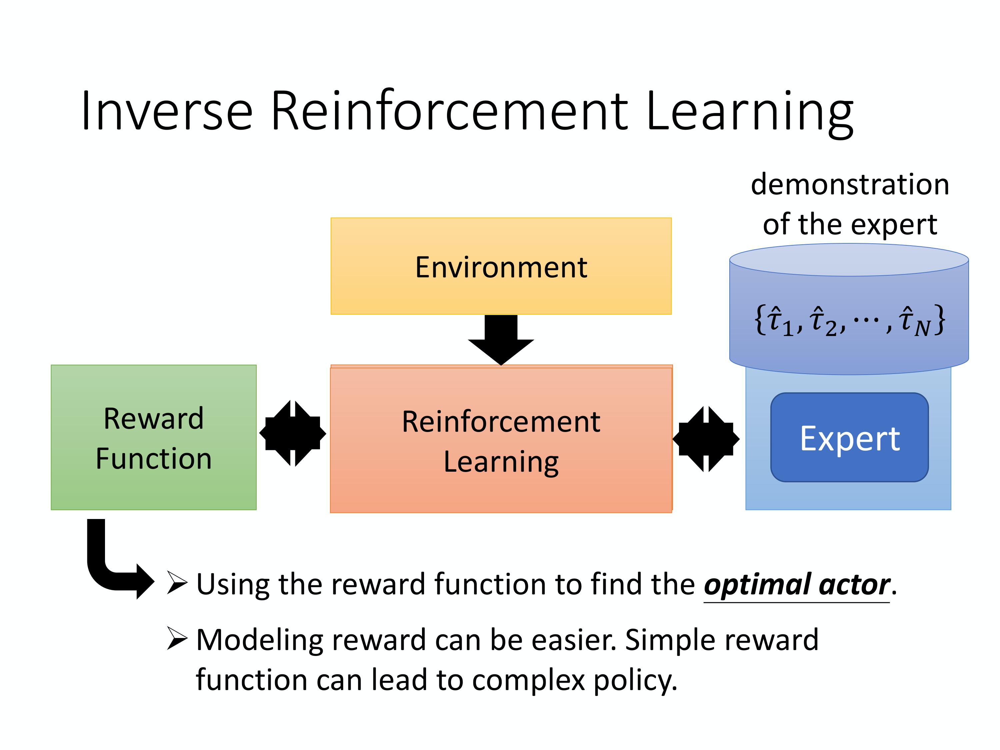
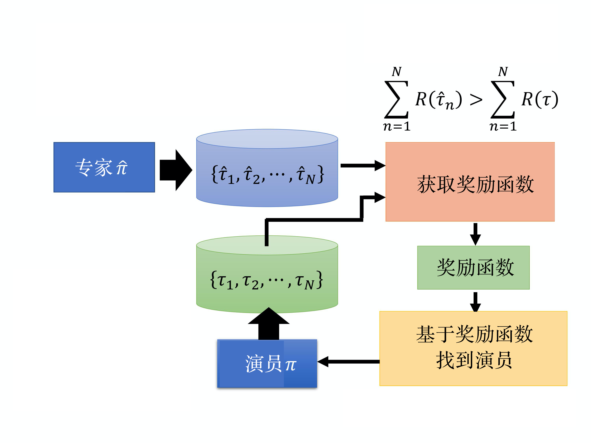
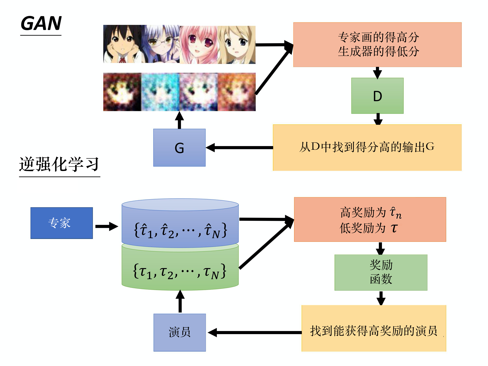
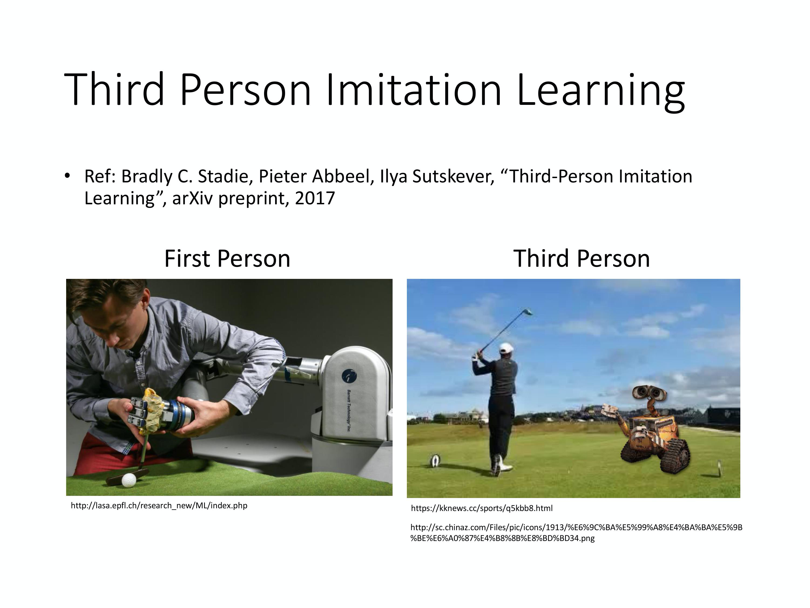
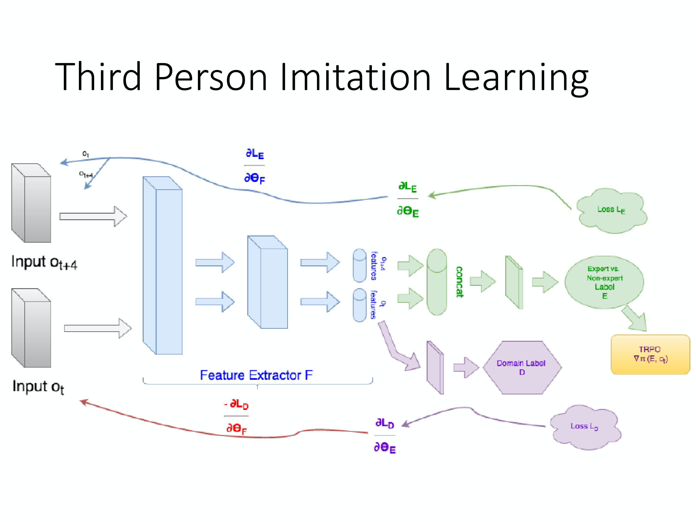
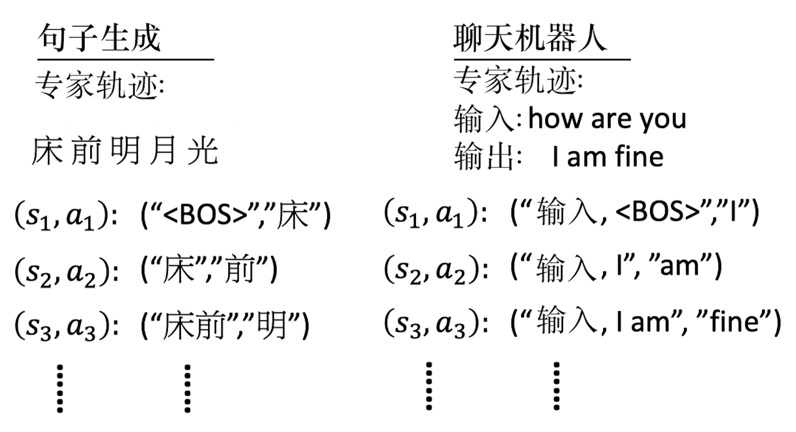

# Imitation Learning 

`Imitation learning` 讨论的问题是：假设我们连 reward 都没有，那要怎么办呢？Imitation learning 又叫做 `learning from demonstration(示范学习)` ，`apprenticeship learning(学徒学习)`，`learning by watching(观察学习)`。在 Imitation learning 里面，你有一些 expert 的 demonstration，那 machine 也可以跟环境互动，但它没有办法从环境里面得到任何的 reward，它只能看着 expert 的 demonstration 来学习什么是好，什么是不好。其实，多数的情况，我们都没有办法真的从环境里面得到非常明确的 reward。举例来说，如果是棋类游戏或者是电玩，你有非常明确的 reward。但是其实多数的任务，都是没有 reward 的。以 chat-bot 为例，机器跟人聊天，聊得怎么样算是好，聊得怎么样算是不好，你无法给出明确的 reward。所以很多 task 是根本就没有办法给出 reward 的。

虽然没有办法给出 reward，但是收集 expert 的 demonstration 是可以做到的。举例来说，

* 在自动驾驶汽车里面，虽然你没有办法给出自动驾驶汽车的 reward，但你可以收集很多人类开车的纪录。
* 在 chat-bot 里面，你可能没有办法定义什么叫做好的对话，什么叫做不好的对话。但是收集很多人的对话当作范例，这一件事情也是可行的。

所以 imitation learning 的使用性非常高。假设你不知道该怎么定义 reward，你就可以收集到 expert 的 demonstration。如果你可以收集到一些范例的话，你可以收集到一些很厉害的 agent(比如人)跟环境实际上的互动的话，那你就可以考虑 imitation learning 这个技术。在 imitation learning 里面，我们介绍两个方法。第一个叫做 `Behavior Cloning`，第二个叫做 `Inverse Reinforcement Learning` 或者叫做 `Inverse Optimal Control`。

##  Behavior Cloning

其实 `Behavior Cloning` 跟 supervised learning 是一模一样的。以自动驾驶汽车为例，你可以收集到人开自动驾驶汽车的所有资料，比如说可以通过行车记录器进行收集。看到这样子的 observation 的时候，人会决定向前。机器就采取跟人一样的行为，也向前，就结束了。**这个就叫做 Behavior Cloning，Expert 做什么，机器就做一模一样的事。**

怎么让机器学会跟 expert 一模一样的行为呢？就把它当作一个 supervised learning 的问题，你去收集很多行车记录器，然后再收集人在那个情境下会采取什么样的行为。你知道说人在 state $s_1$ 会采取 action $a_1$，人在 state $s_2$ 会采取 action $a_2$。人在 state, $s_3$ 会采取 action $a_3$。接下来，你就 learn 一个 network。这个 network 就是你的 actor，它 input $s_i$ 的时候，你就希望它的 output 是$a_i$，就这样结束了。它就是一个的 supervised learning 的 problem。

Behavior Cloning 虽然非常简单，但它的问题是如果你只收集 expert 的资料，你可能看过的 observation 会是非常有限的。

举例来说，

* 假设你要 learn 一部自动驾驶汽车，自动驾驶汽车就是要过这个弯道。如果是 expert 的话，它就是把车顺着这个红线就开过去了。但假设你的 agent 很笨，它今天开着开着，就开到撞墙了，它永远不知道撞墙这种状况要怎么处理，为什么？因为 training data 里面从来没有撞过墙，所以它根本就不知道撞墙这一种 case 要怎么处理。

* 打电玩也是一样，让人去玩 Mario，那 expert 可能非常强，它从来不会跳不上水管，所以机器根本不知道跳不上水管时要怎么处理。

所以光是做 Behavior Cloning 是不够的，只观察 expert 的行为是不够的，需要一个招数，这个招数叫作`Dataset Aggregation`。

我们会希望收集更多样性的 data，而不是只收集 expert 所看到的 observation。我们会希望能够收集 expert 在各种极端的情况下，它会采取什么样的行为。以自动驾驶汽车为例的话，假设一开始，你的 actor 叫作 $\pi_1$，你让 $\pi_1$去开这个车。但车上坐了一个 expert。这个 expert 会不断地告诉 machine 说，如果在这个情境里面，我会怎么样开。所以 $\pi_1$ 自己开自己的，但是 expert 会不断地表示它的想法。比如说，如上图所示，一开始的时候，expert 可能说往前走。在拐弯的时候，expert 可能就会说往右转。但 $\pi_1$ 是不管 expert 的指令的，所以它会继续去撞墙。虽然 expert 说往右转，但是不管它怎么下指令都是没有用的，$\pi_1$ 会自己做自己的事情，因为我们要做的记录的是说，今天 expert 在 $\pi_1$ 看到这种 observation 的情况下，它会做什么样的反应。这个方法显然是有一些问题的，因为你每开一次自动驾驶汽车就会牺牲一个人。那你用这个方法，你牺牲一个 expert 以后，你就会知道，人类在这样子的 state 下，在快要撞墙的时候，会采取什么样的行为。再把这个 data 拿去 train 新的 $\pi_2$。这个 process 就反复继续下去，这个方法就叫做`Dataset Aggregation`。

Behavior Cloning 还有一个问题：机器会完全 copy expert 的行为，不管 expert 的行为是否有道理，就算没有道理，没有什么用的，就算这是 expert 本身的习惯，机器也会硬把它记下来。如果机器确实可以记住所有 expert 的行为，那也许还好，为什么呢？因为如果 expert 这么做，有些行为是多余的。但是没有问题，假设机器的行为可以完全仿造 expert 行为，那也就算了，那它是跟 expert 一样得好，只是做一些多余的事。但问题就是它是一个 machine，它是一个 network，network 的 capacity 是有限的。就算给 network training data，它在 training data 上得到的正确率往往也不是 100%，它有些事情是学不起来的。这个时候，什么该学，什么不该学就变得很重要。

举例来说，在学习中文的时候，你的老师，它有语音，它也有行为，它也有知识，但其实只有语音部分是重要的，知识的部分是不重要的。也许 machine 只能够学一件事，也许它就只学到了语音，那没有问题。如果它只学到了手势，这样子就有问题了。所以让机器学习什么东西是需要 copy，什么东西是不需要 copy，这件事情是重要的。而单纯的 Behavior Cloning 就没有把这件事情学进来，因为机器只是复制 expert 所有的行为而已，它不知道哪些行为是重要，是对接下来有影响的，哪些行为是不重要的，是对接下来是没有影响的。

Behavior Cloning 还有什么样的问题呢？在做 Behavior Cloning 的时候，training data 跟 testing data 是 mismatch 的。我们可以用 Dataset Aggregation 的方法来缓解这个问题。这个问题是：在 training 跟 testing 的时候，data distribution 其实是不一样的。因为在 reinforcement learning 里面，action 会影响到接下来所看到的 state。我们是先有 state $s_1$，然后采取 action $a_1$，action $a_1$ 其实会决定接下来你看到什么样的 state $s_2$。所以在 reinforcement learning 里面有一个很重要的特征，就是你采取了 action 会影响你接下来所看到的 state。如果做了 Behavior Cloning 的话，我们只能观察到 expert 的一堆 state 跟 action 的 pair。然后我们希望可以 learn 一个 $\pi^*$，我们希望 $\pi^*$ 跟 $\hat{\pi}$ 越接近越好。如果 $\pi^*$ 可以跟 $\hat{\pi}$ 一模一样的话，training 的时候看到的 state 跟 testing 的时候所看到的 state 会是一样的。因为虽然 action 会影响我们看到的 state，但假设两个 policy 一模一样， 在同一个 state 都会采取同样的 action，那你接下来所看到的 state 都会是一样的。但问题就是你很难让你的 learn 出来的 policy 跟 expert 的 policy 一模一样。Expert 可是一个人，network 要跟人一模一样，感觉很难吧。

如果你的 $\pi^*$ 跟 $\hat{\pi}$ 有一点误差。这个误差在一般 supervised learning problem 里面，每一个 example 都是 independent 的，也许还好。但对 reinforcement learning 的 problem 来说，可能在某个地方就是失之毫厘，差之千里。可能在某个地方，也许 machine 没有办法完全复制 expert 的行为，它复制的差了一点点，也许最后得到的结果就会差很多这样。所以 Behavior Cloning 并不能够完全解决 imitation learning 这件事情。所以就有另外一个比较好的做法叫做 `Inverse Reinforcement Learning`。

##  Inverse RL

为什么叫 Inverse Reinforcement Learning，因为原来的 Reinforcement Learning 里面，有一个环境和一个 reward function。根据环境和 reward function，通过 Reinforcement Learning 这个技术，你会找到一个 actor，你会 learn 出一个optimal actor。**但 Inverse Reinforcement Learning 刚好是相反的，你没有 reward function，你只有一堆 expert 的 demonstration。**但你还是有环境的。IRL 的做法是说假设我们现在有一堆 expert 的demonstration，我们用 $\hat{\tau}$ 来代表expert 的demonstration。如果是在玩电玩的话，每一个 $\tau$ 就是一个很会玩电玩的人玩一场游戏的纪录，如果是自动驾驶汽车的话，就是人开自动驾驶汽车的纪录。这一边就是 expert 的 demonstration，每一个 $\tau$ 是一个 trajectory。

把所有 expert demonstration 收集起来，然后，使用 Inverse Reinforcement Learning 这个技术。使用 Inverse Reinforcement Learning 技术的时候，机器是可以跟环境互动的。但它得不到reward。它的 reward 必须要从 expert 那边推出来，有了环境和 expert demonstration 以后，去反推出 reward function 长什么样子。之前 reinforcement learning 是由 reward function 反推出什么样的 action、actor 是最好的。Inverse Reinforcement Learning 是反过来，我们有expert 的demonstration，我们相信它是不错的，我就反推说，expert 是因为什么样的 reward function 才会采取这些行为。你有了reward function 以后，接下来，你就可以套用一般的 reinforcement learning 的方法去找出 optimal actor。所以 Inverse Reinforcement Learning 是先找出 reward function，找出 reward function 以后，再去用 Reinforcement Learning 找出 optimal actor。

把这个 reward function learn 出来，相较于原来的 Reinforcement Learning 有什么样好处。一个可能的好处是也许 reward function 是比较简单的。也许，虽然这个 expert 的行为非常复杂，但也许简单的 reward function 就可以导致非常复杂的行为。一个例子就是也许人类本身的 reward function 就只有活着这样，每多活一秒，你就加一分。但人类有非常复杂的行为，但是这些复杂的行为，都只是围绕着要从这个 reward function 里面得到分数而已。有时候很简单的 reward function 也许可以推导出非常复杂的行为。

Inverse Reinforcement Learning 实际上是怎么做的呢？首先，我们有一个 expert $\hat{\pi}$，这个 expert 去跟环境互动，给我们很多 $\hat{\tau_1}$ 到 $\hat{\tau_n}$。如果是玩游戏的话，就让某一个电玩高手，去玩 n 场游戏。把 n 场游戏的 state 跟 action 的 sequence 都记录下来。接下来，你有一个actor $\pi$，一开始actor 很烂，这个 actor 也去跟环境互动。它也去玩了n 场游戏，它也有 n 场游戏的纪录。接下来，我们要反推出 reward function。**怎么推出 reward function 呢？原则就是 expert 永远是最棒的，是先射箭，再画靶的概念。**

Expert 去玩一玩游戏，得到这一些游戏的纪录，你的 actor 也去玩一玩游戏，得到这些游戏的纪录。接下来，你要定一个 reward function，这个 reward function 的原则就是 expert 得到的分数要比 actor 得到的分数高，先射箭，再画靶。所以我们就 learn 出一个 reward function。你就找出一个 reward function。这个 reward function 会使 expert 所得到的 reward 大过于 actor 所得到的reward。你有了新的 reward function 以后，就可以套用一般 Reinforcement Learning 的方法去learn 一个actor，这个actor 会针对 reward function 去 maximize 它的 reward。它也会采取一大堆的 action。但是，今天这个 actor 虽然可以 maximize 这个 reward function，采取一大堆的行为，得到一大堆游戏的纪录。

但接下来，我们就改 reward function。这个 actor 就会很生气，它已经可以在这个 reward function 得到高分。但是它得到高分以后，我们就改 reward function，仍然让 expert 可以得到比 actor 更高的分数。这个就是 `Inverse Reinforcement learning`。有了新的 reward function 以后，根据这个新的 reward function，你就可以得到新的 actor，新的 actor 再去跟环境做一下互动，它跟环境做互动以后， 你又会重新定义你的 reward function，让 expert 得到的 reward 比 actor 大。

怎么让 expert 得到的 reward 大过 actor 呢？其实你在 learning 的时候，你可以很简单地做一件事就是，reward function 也许就是 neural network。这个 neural network 就是吃一个 $\tau$，output 就是应该要给这个 $\tau$ 多少的分数。或者说，你假设觉得 input 整个 $\tau$ 太难了。因为 $\tau$ 是 s 和 a 的一个很强的 sequence。也许它就是 input 一个 s 和 a 的 pair，然后 output 一个 real number。把整个 sequence，整个 $\tau$ 会得到的 real number 都加起来就得到 $R(\tau)$。在 training 的时候，对于 $\left\{\hat{\tau}_{1}, \hat{\tau}_{2}, \cdots, \hat{\tau}_{N}\right\}$，我们希望它 output 的 R 越大越好。对于 $\left\{\tau_{1}, \tau_{2}, \cdots, \tau_{N}\right\}$，我们就希望它 R 的值越小越好。

什么叫做一个最好的 reward function。最后你 learn 出来的 reward function 应该就是 expert 和 actor 在这个 reward function 都会得到一样高的分数。最终你的 reward function 没有办法分辨出谁应该会得到比较高的分数。

通常在 train 的时候，你会 iterative 的去做。那今天的状况是这样，最早的 Inverse Reinforcement Learning 对 reward function 有些限制，它是假设 reward function 是 linear 的。如果 reward function 是 linear 的话，你可以 prove 这个algorithm 会 converge。但是如果不是 linear 的，你就没有办法 prove 说它会 converge。你有没有觉得这个东西，看起来还挺熟悉呢？其实你只要把它换个名字，说 actor 就是 generator，然后说 reward function 就是 discriminator，它就是 GAN。所以它会不会收敛这个问题就等于是问说 GAN 会不会收敛。如果你已经实现过，你会知道不一定会收敛。但除非你对 R 下一个非常严格的限制，如果你的 R 是一个 general 的 network 的话，你就会有很大的麻烦。

那怎么说它像是一个 GAN，我们来跟 GAN 比较一下。GAN 里面，你有一堆很好的图。然后你有一个 generator，一开始它根本不知道要产生什么样的图，它就乱画。然后你有一个 discriminator，discriminator 的工作就是给画的图打分，expert 画的图就是高分，generator 画的图就是低分。你有 discriminator 以后，generator 会想办法去骗过 discriminator。Generator 会希望 discriminator 也会给它画的图高分。整个 process 跟 Inverse Reinforcement Learning 是一模一样的。

* 画的图就是 expert 的 demonstration。generator 就是 actor，generator 画很多图，actor 会去跟环境互动，产生很多 trajectory。这些 trajectory 跟环境互动的记录，游戏的纪录其实就是等于 GAN 里面的这些图。
* 然后你 learn 一个reward function。Reward function 就是 discriminator。Rewards function 要给 expert 的 demonstration 高分，给 actor 互动的结果低分。
* 接下来，actor 会想办法，从这个已经 learn 出来的 reward function 里面得到高分，然后 iterative 地去循环。跟GAN 其实是一模一样的，我们只是换个说法来而已。

IRL 有很多的 application，比如可以用开来自动驾驶汽车，有人用这个技术来学开自动驾驶汽车的不同风格。每个人在开车的时候会有不同风格，举例来说，能不能够压到线，能不能够倒退，要不要遵守交通规则等等。每个人的风格是不同的，然后用 Inverse Reinforcement Learning 可以让自动驾驶汽车学会各种不同的开车风格。

上图是文献上真实的例子。在这个例子里面， Inverse Reinforcement Learning 有一个有趣的地方，通常你不需要太多的 training data，因为 training data 往往都是个位数。因为 Inverse Reinforcement Learning 只是一种 demonstration，只是一种范例，实际上机器可以去跟环境互动非常多次。所以在 Inverse Reinforcement Learning 的文献， 往往会看到说只用几笔 data 就训练出一些有趣的结果。

比如说，在这个例子里面是要让自动驾驶汽车学会在停车场里面停。这边的 demonstration 是这样，蓝色是终点，自动驾驶汽车要开到蓝色终点停车。给机器只看一行的四个 demonstration，然后让它去学怎么样开车，最后它就可以学出，在红色的终点位置，如果它要停车的话，它会这样开。今天给机器看不同的 demonstration，最后它学出来开车的风格就会不太一样。举例来说，上图第二行是不守规矩的开车方式，因为它会开到道路之外，这边，它会穿过其它的车，然后从这边开进去。所以机器就会学到说，不一定要走在道路上，它可以走非道路的地方。上图第三行是倒退来停车，机器也会学会说，它可以倒退，

这种技术也可以拿来训练机器人。你可以让机器人，做一些你想要它做的动作，过去如果你要训练机器人，做你想要它做的动作，其实是比较麻烦的。怎么麻烦呢？过去如果你要操控机器的手臂，你要花很多力气去写 program 才让机器做一件很简单的事看。假设你有 Imitation Learning 的技术，你可以让人做一下示范，然后机器就跟着人的示范来进行学习，比如学会摆盘子，拉着机器人的手去摆盘子，机器自己动。让机器学会倒水，人只教它20 次，杯子每次放的位置不太一样。用这种方法来教机械手臂。

## Third Person lmitation Learning

其实还有很多相关的研究，举例来说，你在教机械手臂的时候，要注意就是也许机器看到的视野跟人看到的视野是不太一样的。在刚才那个例子里面，人跟机器的动作是一样的。但是在未来的世界里面，也许机器是看着人的行为学的。刚才是人拉着，假设你要让机器学会打高尔夫球，在刚才的例子里面就是人拉着机器人手臂去打高尔夫球，但是在未来有没有可能机器就是看着人打高尔夫球，它自己就学会打高尔夫球了呢？但这个时候，要注意的事情是机器的视野跟它真正去采取这个行为的时候的视野是不一样的。机器必须了解到当它是第三人的视角的时候，看到另外一个人在打高尔夫球，跟它实际上自己去打高尔夫球的时候，看到的视野显然是不一样的。但它怎么把它是第三人的时间所观察到的经验把它 generalize 到它是第一人称视角的时候所采取的行为，这就需要用到`Third Person Imitation Learning`的技术。

这个怎么做呢？它的技术其实也是不只是用到 Imitation Learning，它用到了 `Domain-Adversarial Training`。我们在讲 Domain-Adversarial Training 的时候，我们有讲说这也是一个GAN 的技术。那我们希望今天有一个 extractor，有两个不同 domain 的image，通过 feature extractor 以后，没有办法分辨出它来自哪一个 domain。其实第一人称视角和第三人称视角，Imitation Learning 用的技术其实也是一样的，希望 learn 一个 Feature Extractor，机器在第三人称的时候跟它在第一人称的时候看到的视野其实是一样的，就是把最重要的东西抽出来就好了。 

## Recap: Sentence Generation & Chat-bot

在讲 Sequence GAN 的时候，我们有讲过 Sentence Generation 跟 Chat-bot。那其实 Sentence Generation 或 Chat-bot 也可以想成是 imitation learning。机器在 imitate 人写的句子，你在写句子的时候，你写下去的每一个 word 都想成是一个 action，所有的 word 合起来就是一个 episode。举例来说， sentence generation 里面，你会给机器看很多人类写的文字。你要让机器学会写诗，那你就要给它看唐诗三百首。人类写的文字其实就是 expert 的 demonstration。每一个词汇其实就是一个 action。你让机器做 Sentence Generation 的时候，其实就是在 imitate expert 的 trajectory。Chat-bot 也是一样，在 Chat-bot 里面你会收集到很多人互动对话的纪录，那些就是 expert 的 demonstration。

如果我们单纯用 maximum likelihood 这个技术来 maximize 会得到 likelihood，这个其实就是 behavior cloning。我们做 behavior cloning 就是看到一个 state，接下来预测我们会得到什么样的 action。看到一个 state，然后有一个 ground truth 告诉机器说什么样的 action 是最好的。在做 likelihood 的时候也是一样，given sentence 已经产生的部分。接下来 machine 要 predict 说接下来要写哪一个word 才是最好的。**所以，其实 maximum likelihood 在做 sequence generation 的时候，它对应到 imitation learning 里面就是 behavior cloning。**只有 maximum likelihood 是不够的，我们想要用 Sequence GAN。**其实 Sequence GAN 就是对应到 Inverse Reinforcement Learning**，Inverse Reinforcement Learning 就是一种 GAN 的技术。你把 Inverse Reinforcement Learning 的技术放在 sentence generation，放到 Chat-bot 里面，其实就是 Sequence GAN 跟它的种种的变形。

## References

* [机器学习](https://book.douban.com/subject/26708119//)

