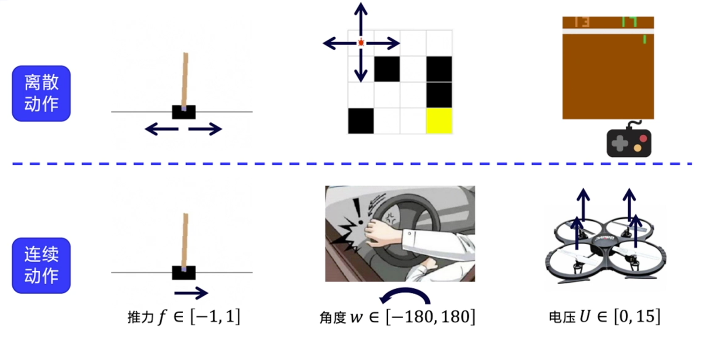
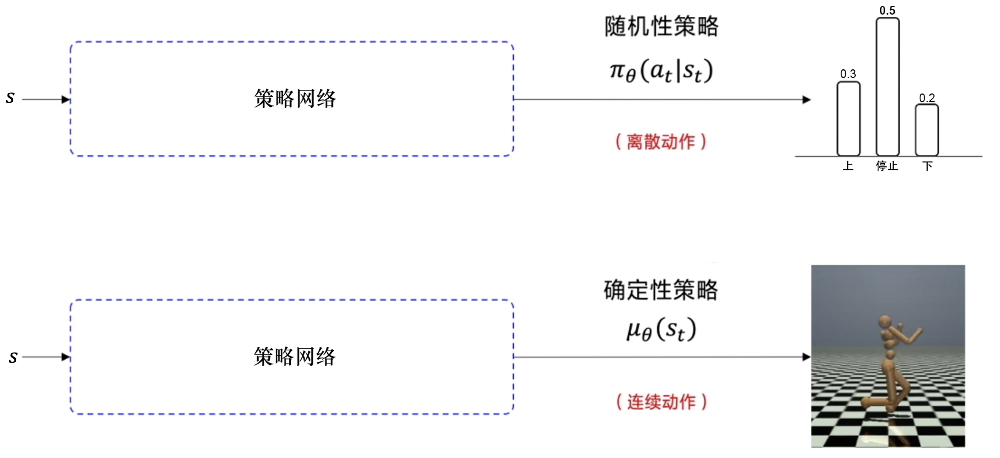
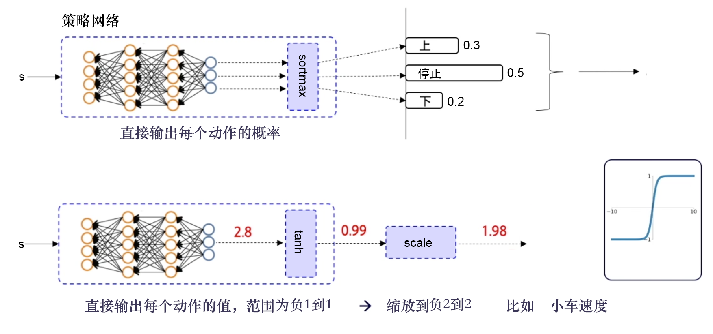
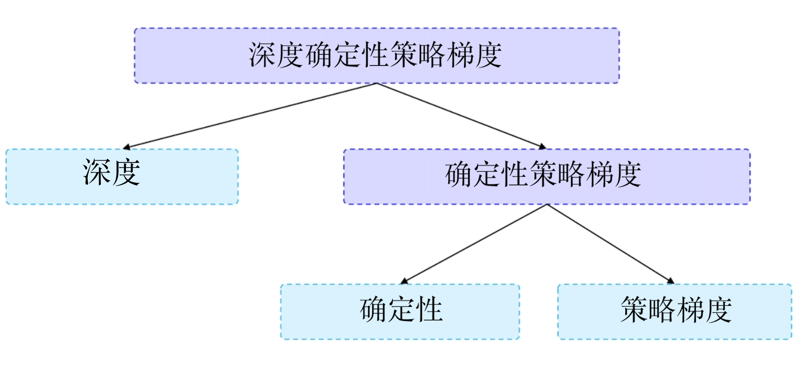
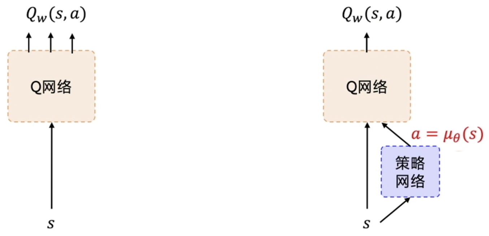
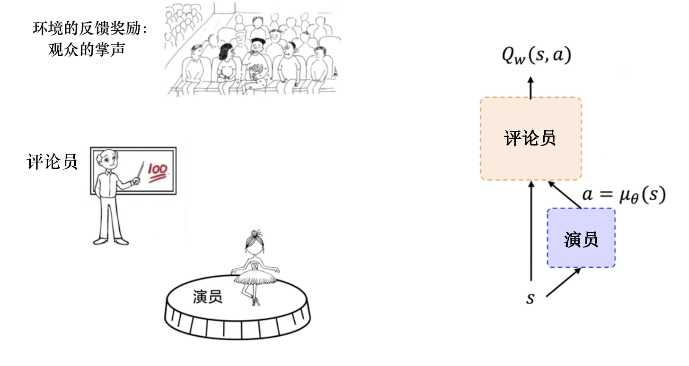
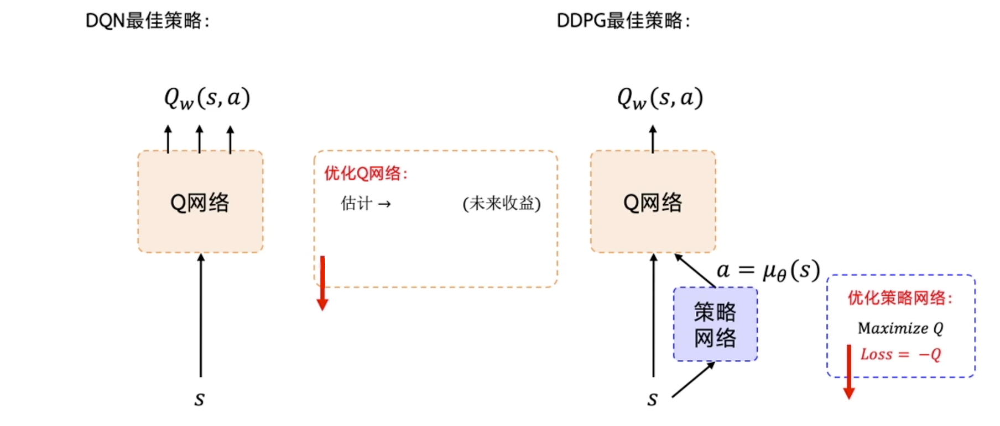
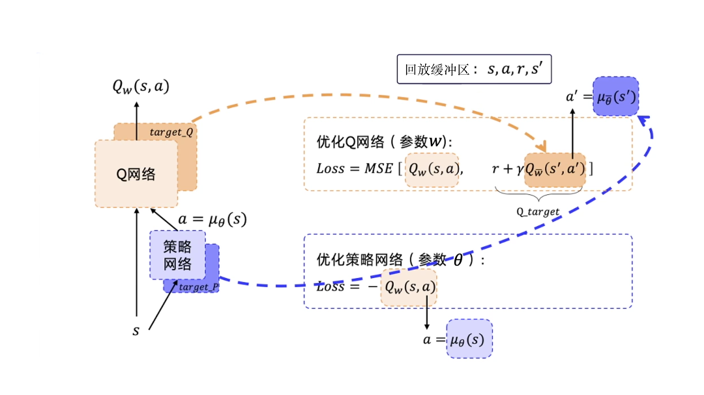
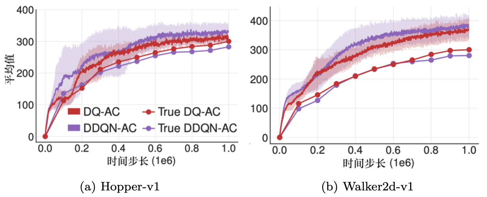
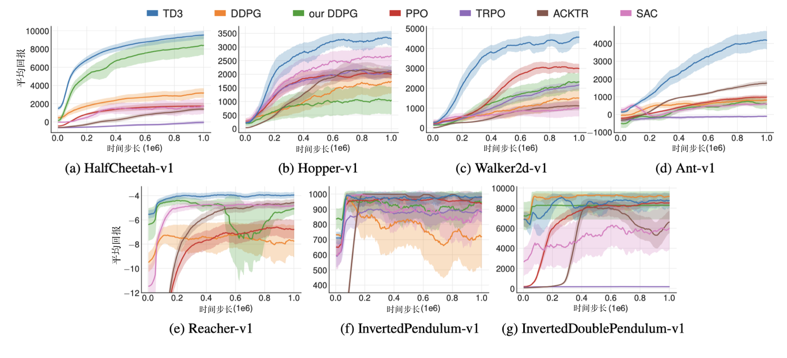

# 第12章 深度确定性策略梯度

## 12.1 离散动作与连续动作的区别 

离散动作与连续动作是相对的概念，一个是可数的，一个是不可数的。 如图 12.1 所示，离散动作和连续动作有几个例子。在 *CartPole* 环境中，可以有向左推小车、向右推小车两个动作。在 *Frozen Lake* 环境中，小乌龟可以有上、下、左、右4个动作。在雅达利的 *Pong* 游戏中，游戏有 6 个按键的动作可以输出。但在实际情况中，我们经常会遇到连续动作空间的情况，也就是输出的动作是不可数的。比如：推小车推力的大小、选择下一时刻方向盘转动的具体角度、给四轴飞行器的4个螺旋桨给的电压的大小。

图 12.1 离散动作和连续动作的区别

对于这些连续的动作，Q学习、深度Q网络等算法是没有办法处理的。那我们怎么输出连续的动作呢？这个时候，“万能”的神经网络又出现了。如图 12.2 所示，在离散动作的场景下，比如我们输出上、下或是停止这几个动作。有几个动作，神经网络就输出几个概率值，我们用 $\pi_\theta(a_t|s_t)$ 来表示这个随机性的策略。在连续的动作场景下，比如我们要输出机械臂弯曲的角度，我们就输出一个具体的浮点数。我们用 $\mu_{\theta}(s_t)$ 来代表这个确定性的策略。

我们再对随机性策略与确定性策略进行解释。对随机性策略来说，输入某一个状态 $s$，采取某一个动作的可能性并不是百分之百的，而是有一个概率的（就好像抽奖一样），根据概率随机抽取一个动作。而对于确定性策略来说，它不受概率的影响。当神经网络的参数固定之后，输入同样的状态，必然输出同样的动作，这就是确定性策略。

图 12.2 使用神经网络处理连续动作与离散动作

如图 12.3 所示，要输出离散动作，我们就加一个 softmax 层来确保所有的输出是动作概率，并且所有的动作概率和为 1。要输出连续动作，我们一般可以在输出层加一层 tanh 函数。tanh 函数的作用就是把输出限制到 [$-$1,1] 。我们得到输出后，就可以根据实际动作的范围将其缩放，再输出给环境。比如神经网络输出一个浮点数 2.8，经过 tanh 函数之后，它就可以被限制在 [$-$1,1] 之间，输出 0.99。假设小车速度的范围是 [$-$2,2] ，我们就按比例从 [$-$1,1] 扩大到 [$-$2,2]，0.99 乘 2，最终输出的就是 1.98，将其作为小车的速度或者推小车的推力输出给环境。

图 12.3 使用神经网络输出离散动作与连续动作

## 12.2 深度确定性策略梯度 

在连续控制领域，比较经典的强化学习算法就是**深度确定性策略梯度（deep deterministic policy gradient，DDPG）**。如图 12.4 所示，DDPG 的特点可以从它的名字中拆解出来，拆解成深度、确定性和策略梯度。

深度是因为用了神经网络；确定性表示 DDPG 输出的是一个确定性的动作，可以用于有连续动作的环境；策略梯度代表的是它用到的是策略网络。REINFORCE 算法每隔一个回合就更新一次，但 DDPG 是每个步骤都会更新一次策略网络，它是一个单步更新的策略网络。

图 12.4 DDPG

DDPG 是 深度Q网络的一个扩展版本，可以扩展到连续动作空间。在 DDPG 的训练中，它借鉴了 深度Q网络 的技巧：目标网络和经验回放。经验回放与 深度Q网络 是一样的，但目标网络的更新与 深度Q网络 的有点儿不一样。提出 DDPG 是为了让 深度Q网络 可以扩展到连续的动作空间，就是我们刚才提到的小车速度、角度和电压等这样的连续值。如图 12.5 所示，DDPG 在 深度Q网络 基础上加了一个策略网络来直接输出动作值，所以 DDPG 需要一边学习 Q 网络，一边学习策略网络。Q 网络的参数用 $w$ 来表示。策略网络的参数用 $\theta$ 来表示。我们称这样的结构为演员-评论员的结构。

图 12.5 从深度Q网络到DDPG

通俗地解释一下演员-评论员结构。如图 12.6 所示，策略网络扮演的就是演员的角色，它负责对外展示输出，输出动作。Q 网络就是评论员，它会在每一个步骤都对演员输出的动作做一个评估，打一个分，估计演员的动作未来能有多少奖励，也就是估计演员输出的动作的 Q 值大概是多少，即 $Q_w(s,a)$。演员需要根据舞台目前的状态来做出一个动作。评论员就是评委，它需要根据舞台现在的状态和演员输出的动作对演员刚刚的表现去打一个分数 $Q_w(s,a)$。演员根据评委的打分来调整自己的策略，也就是更新演员的神经网络参数 $\theta$，争取下次可以做得更好。评论员则要根据观众的反馈，也就是环境的反馈奖励来调整自己的打分策略，也就是要更新评论员的神经网络的参数 $w$ ，评论员的最终目标是让演员的表演获得观众尽可能多的欢呼声和掌声，从而最大化未来的总收益。

最开始训练的时候，这两个神经网络的参数是随机的。所以评论员最开始是随机打分的，演员也随机输出动作。但是由于有环境反馈的奖励存在，因此评论员的评分会越来越准确，所评判的演员的表现也会越来越好。既然演员是一个神经网络，是我们希望训练好的策略网络，我们就需要计算梯度来更新优化它里面的参数 $\theta$ 。简单来说，我们希望调整演员的网络参数，使得评委打分尽可能高。注意，这里的演员是不关注观众的，它只关注评委，它只迎合评委的打分 $Q_w(s,a)$。

图 12.6 演员-评论员结构通俗解释

深度Q网络与DDPG的联系如图 12.7 所示。深度Q网络 的最佳策略是想要学出一个很好的 Q 网络，学出这个网络之后，我们希望选取的那个动作使 Q 值最大。DDPG 的目的也是求解让 Q 值最大的那个动作。演员只是为了迎合评委的打分而已，所以优化策略网络的梯度就是要最大化这个 Q 值，所以构造的损失函数就是让 Q 取一个负号。我们写代码的时候把这个损失函数放入优化器里面，它就会自动最小化损失，也就是最大化 Q。

这里要注意，除了策略网络要做优化，DDPG 还有一个 Q 网络也要优化。评论员一开始也不知道怎么评分，它也是在一步一步的学习当中，慢慢地给出准确的分数。我们优化 Q 网络的方法其实与 深度Q网络 优化 Q 网络的方法是一样的，我们用真实的奖励$r$ 和下一步的 $Q$ 即 $Q^{\prime}$ 来拟合未来的奖励 $Q\_\text{target}$。然后让 Q 网络的输出逼近 $Q\_\text{target}$。所以构造的损失函数就是直接求这两个值的均方差。构造好损失函数后，我们将其放到优化器中，让它自动最小化损失。

图 12.7 深度Q网络与DDPG的联系

如图 12.8 所示，我们可以把两个网络的损失函数构造出来。策略网络的损失函数是一个复合函数。我们把 $a = \mu_\theta(s)$ 代入，最终策略网络要优化的是策略网络的参数 $\theta$ 。Q 网络要优化的是 $Q_w(s,a)$ 和 $Q\_\text{target}$ 之间的一个均方差。但是 Q 网络的优化存在一个和 深度Q网络 一模一样的问题就是它后面的 $Q\_\text{target}$ 是不稳定的。此外，后面的 $Q_{\bar{w}}\left(s^{\prime}, a^{\prime}\right)$ 也是不稳定的，因为 $Q_{\bar{w}}\left(s^{\prime}, a^{\prime}\right)$ 也是一个预估的值。

为了使 $Q\_\text{target}$ 更加稳定，DDPG 分别给 Q 网络和策略网络搭建了目标网络，即target\_Q网络和target\_P策略网络。$\text{target}\_Q$ 网络是为了计算 $Q\_\text{target}$ 中 $Q_{\bar{w}}\left(s^{\prime}, a^{\prime}\right)$。$Q_{\bar{w}}\left(s^{\prime}, a^{\prime}\right)$ 里面的需要的下一个动作 $a'$  是通过 $\text{target}\_P$ 网络输出的，即 $a^{\prime}=\mu_{\bar{\theta}}\left(s^{\prime}\right)$。Q 网络和策略网络的参数是$w$，$\text{target}\_Q$ 网络和 $\text{target}\_P$ 策略网络的参数是 $\bar{w}$。DDPG 有4个网络，策略网络的目标网络 和 Q 网络的目标网络是颜色比较深的这两个，它们只是为了让计算 $Q\_\text{target}$ 更稳定。因为这两个网络也是固定一段时间的参数之后再与评估网络同步最新的参数。

这里训练需要用到的数据就是 $s$、$a$、$r$、$s'$，我们只需要用到这4个数据。我们用回放缓冲区把这些数据存起来，然后采样进行训练。经验回放的技巧与 深度Q网络 中的是一样的。注意，因为 DDPG 使用了经验回放技巧，所以 DDPG 是一个异策略的算法。

图 12.8 目标网络和经验回放

DDPG通过异策略的方式来训练一个确定性策略。因为策略是确定的，所以如果智能体使用同策略来探索，在一开始的时候，它很可能不会尝试足够多的动作来找到有用的学习信号。为了让 DDPG 的策略更好地探索，我们在训练的时候给它们的动作加了噪声。DDPG 的原作者推荐使用时间相关的[OU 噪声](https://en.wikipedia.org/wiki/Ornstein–Uhlenbeck_process)，但最近的结果表明不相关的、均值为 0 的高斯噪声的效果非常好。由于后者更简单，因此我们更喜欢使用它。为了便于获得更高质量的训练数据，我们可以在训练过程中把噪声变小。在测试的时候，为了查看策略利用它学到的东西的表现，我们不会在动作中加噪声。

## 12.3 双延迟深度确定性策略梯度 

虽然 DDPG 有时表现很好，但它对于超参数和其他类型的调整方面经常很敏感。如图 12.9 所示，DDPG常见的问题是已经学习好的 Q 函数开始显著地高估 Q 值，然后导致策略被破坏，因为它利用了 Q 函数中的误差。

图 12.9 DDPG的问题

我们可以使用实际的 Q 值与Q网络输出的 Q 值进行对比。实际的 Q 值可以用蒙特卡洛来算。根据当前的策略采样 1000 条轨迹，得到 $G$ 后取平均值，进而得到实际的 Q 值。

**双延迟深度确定性策略梯度（twin delayed DDPG，TD3）**通过引入3个关键技巧来解决这个问题。
* **截断的双 Q 学习（clipped dobule Q-learning）** 。TD3学习两个Q函数（因此名字中有 “twin”）。TD3通过最小化均方差来同时学习两个Q函数：$Q_{\phi_1}$ 和 $Q_{\phi_2}$。两个Q函数都使用一个目标，两个Q函数中给出的较小的值会被作为如下的 Q-target：

$$
y\left(r, s^{\prime}, d\right)=r+\gamma(1-d) \min _{i=1,2} Q_{\phi_{i, \text{targ}}}\left(s^{\prime}, a_\text{TD3}\left(s^{\prime}\right)\right)
$$

* **延迟的策略更新（delayed policy updates）** 。相关实验结果表明，同步训练动作网络和评价网络，却不使用目标网络，会导致训练过程不稳定；但是仅固定动作网络时，评价网络往往能够收敛到正确的结果。因此 TD3算法以较低的频率更新动作网络，以较高的频率更新评价网络，通常每更新两次评价网络就更新一次策略。
*  **目标策略平滑（target policy smoothing）**。TD3引入了平滑化（smoothing）思想。TD3在目标动作中加入噪声，通过平滑 Q 沿动作的变化，使策略更难利用 Q 函数的误差。

这3个技巧加在一起，使得性能相比基线 DDPG 有了大幅的提升。

目标策略平滑化的工作原理如下：
$$
a_\text{TD3}\left(s^{\prime}\right)=\operatorname{clip}\left(\mu_{\theta, \text{targ}}\left(s^{\prime}\right)+\operatorname{clip}(\epsilon,-c, c), a_{\text {low }}, a_{\text {high }}\right)
$$
其中 $\epsilon$ 本质上是一个噪声，是从正态分布中取样得到的，即 $\epsilon \sim N(0,\sigma)$。目标策略平滑化是一种正则化方法。

如图 12.10 所示，我们可以将 TD3 算法与其他算法进行对比。TD3算法的作者自己实现的 深度确定性策略梯度（图中为our DDPG）和官方实现的 DDPG 的表现不一样，这说明 DDPG 对初始化和调参非常敏感。TD3对参数不是这么敏感。在TD3的论文中，TD3的性能比**软演员-评论员（soft actor-critic，SAC）**高。软演员-评论员又被译作软动作评价。但在SAC的论文中， SAC 的性能比TD3 高，这是因为强化学习的很多算法估计对参数和初始条件敏感。

图 12.10 TD3与其他算法对比

TD3的作者给出了其对应[PyTorch的实现](https://github.com/sfujim/TD3/)，代码写得很棒，我们可以将其作为一个强化学习的标准库来学习。TD3以异策略的方式训练确定性策略。由于该策略是确定性的，因此如果智能体要探索策略，则一开始它可能不会尝试采取足够广泛的动作来找到有用的学习信号。为了使TD3策略更好地探索，我们在训练时在它们的动作中添加了噪声，通常是不相关的均值为0的高斯噪声。为了便于获取高质量的训练数据，我们可以在训练过程中减小噪声的大小。
在测试时，为了查看策略对所学知识的利用程度，我们不会在动作中增加噪声。

## 参考文献
* [百度强化学习](https://aistudio.baidu.com/aistudio/education/lessonvideo/460292)

* [OpenAI Spinning Up ](https://spinningup.openai.com/en/latest/algorithms/ddpg.html#)

* [Intro to Reinforcement Learning (强化学习纲要）](https://github.com/zhoubolei/introRL)

* [天授文档](https://tianshou.readthedocs.io/zh/latest/index.html)