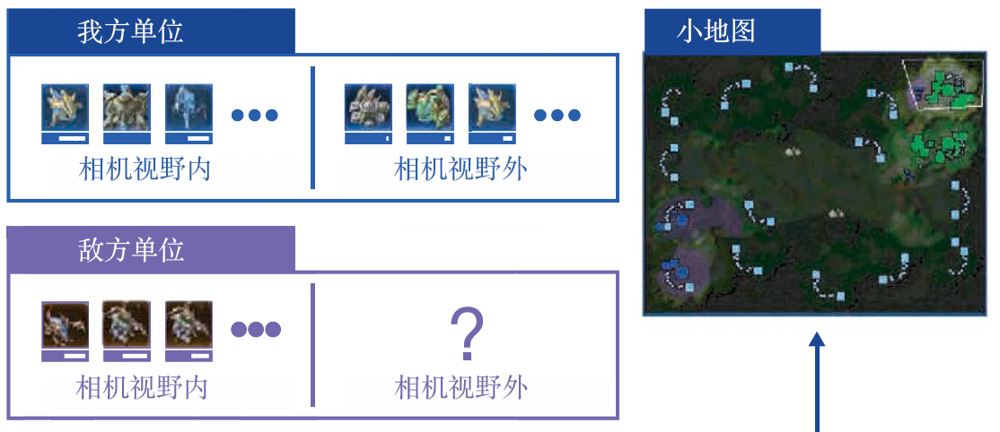
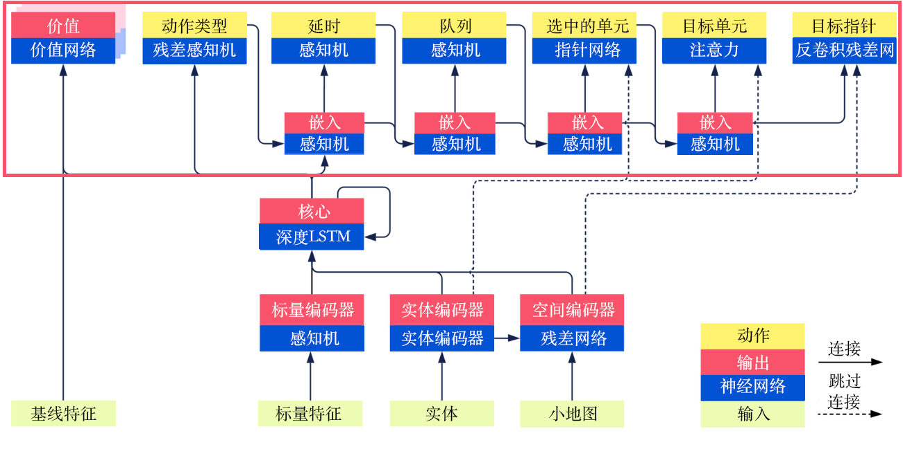
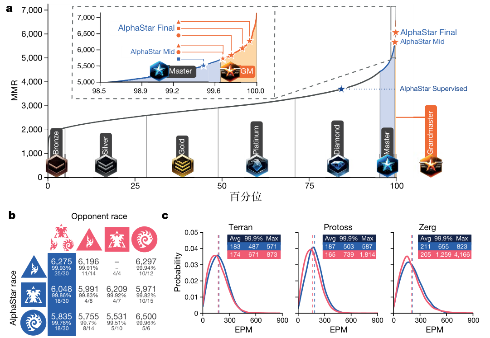

# 第13章 AlphaStar 论文解读

## 13.1 AlphaStar及背景简介

相比于之前的深蓝和AlphaGo，对于《星际争霸Ⅱ》等策略对战型游戏，使用AI与人类对战的难度更大。比如在《星际争霸Ⅱ》中，要想在玩家对战玩家的模式中击败对方，就要学会各种战术，各种微操和掌握时机。在游戏中玩家还需要对对方阵容的更新实时地做出正确判断以及行动，甚至要欺骗对方以达到战术目的。总而言之，想要让AI上手这款游戏是非常困难的。但是DeepMind做到了。

AlphaStar是DeepMind与暴雪使用深度强化学习技术实现的计算机与《星际争霸Ⅱ》人类玩家对战的产品，其因为近些年在《星际争霸Ⅱ》比赛中打败了职业选手以及99.8\%的欧服玩家而被人所熟知。北京时间2019年1月25日凌晨2点，暴雪公司与DeepMind合作研发的AlphaStar正式通过直播亮相。按照直播安排，AlphaStar与两位《星际争霸Ⅱ》人类职业选手进行了5场比赛对决演示。加上并未在直播中演示的对决，在人类对阵AlphaStar的共计11场比赛中，人类仅取得了1场胜利。DeepMind也将研究工作发表在了2019年10月的 *Nature* 杂志上。本章将对这篇论文进行深入的分析，有兴趣的读者可以阅读原文。

## 13.2 AlphaStar的模型输入和输出是什么呢？————环境设计

构建深度强化学习模型的第一步就是构建模型的输入和输出，对于《星际争霸Ⅱ》这一个复杂的环境，文章第一步就是将游戏的环境抽象成众多独立的数据信息。

### 13.2.1 状态（网络的输入）

AlphaStar将《星际争霸Ⅱ》的环境状态分为4部分，分别为实体（entities）信息、地图（map）信息、玩家数据（player data）信息、游戏统计（game statistics）信息，如图13.1所示。

图 13.1 环境状态的构成

第一部分————实体信息，例如当前时刻环境中有什么建筑、兵种等，并且我们将每一个实体的属性信息使用向量表示。例如对于一个建筑，其当前时刻的向量中包含此建筑的血量、等级、位置以及冷却时间等信息。所以对于当前帧的全部实体信息，环境会给神经网络 $N$ 个长度为 $K$ 的向量，分别表示此刻智能体能够看见的 $N$ 个实体的具体信息（向量信息）。

第二部分————地图信息，这部分比较好理解，即将地图中的信息以矩阵的形式输入神经网络中，来表示当前状态全局地图的信息（向量信息或图像信息）。

第三部分————玩家数据信息，也就是当前状态下，玩家的等级和种族等信息（标量信息）。

第四部分————游戏统计信息，视野的位置（小窗口的位置，区别于第二部分的全局地图信息），还有当前游戏的开始时间等信息（标量信息）。

### 13.2.2 动作（网络的输出）

AlphaStar的动作信息主要分为6个部分，如图13.2所示，分别为动作类型（action type）、选中的单元（selected units）、目标（target）、执行动作的队列（queued）、是否重复（repeat）以及延时（delay），各个部分间是有关联的。

图 13.2 动作信息的构成

第一部分————动作类型，即下一次要进行的动作的类型是移动小兵、升级建筑还是移动小窗口的位置等。

第二部分————选中的单元，承接第一部分，例如我们要进行的动作类型是移动小兵，那么我们就应该选择具体移动哪一个小兵。

第三部分————目标，承接第二部分，我们移动小兵A后，是要去地图的某一个位置还是去攻击对手的哪一个目标等，即选择目的地或攻击的对象。

第四部分————执行动作的队列，即是否立即执行动作，对于小兵A，是到达目的地后直接进行攻击还是原地待命。

第五部分————是否重复，如果需要小兵A持续攻击，那么就不需要再通过网络计算得到下一个动作，直接重复上一个动作即可。

第六部分————延时，即等候多久后再接收网络的输入，可以理解为一个操作的延迟。

## 13.3 AlphaStar的计算模型是什么呢？————网络结构

我们在13.2节说明了AlphaStar网络的输入和输出，即状态和动作，那么从状态怎么得到动作呢？这里我们先给出其网络结构的总览，如图13.3所示，后面对此详细讨论。

图 13.3 AlphaStar网络结构总览

### 13.3.1 输入部分

图 13.4 AlphaStar网络结构输入部分

从图13.4中的红框可以看出，模型的输入部分主要有3个部分：标量特征（scalar features)，例如前面描述的玩家等级以及小窗口的位置等信息；实体（entities)，是向量，即前面所叙述的一个建筑或一个小兵的当前所有的属性信息；小地图（minimap），即图像数据。

- 对于标量特征，使用多层感知机（multilayer perceptron，MLP），就可以得到对应的向量，可以认为是一个嵌入过程。
- 对于实体，使用自然语言处理中常用的Transformer架构作为编码器（encoder）。
- 对于小地图，使用图像中常用的ResNet架构作为编码器，得到一个定长的向量。

### 13.3.2 中间过程

中间过程比较简单，即通过一个深度长短期记忆网络模块融合3种当前状态下的嵌入并进行下一时刻的输出，如图13.5所示，并且将该输出分别送入价值网络（value network）、残差多层感知机（residual MLP）以及动作类型的后续的多层感知机中。

图 13.5 AlphaStar网络结构中的深度长短期记忆网络模块

### 13.3.3 输出部分

正如前面介绍的，输出的动作是前后相关联的，如图13.6所示，我们按照顺序一一介绍。

图 13.6 AlphaStar网络结构输出部分

首先是动作类型：使用深度长短期记忆网络的嵌入向量作为输入，使用残差多层感知机得到动作类型的Softmax激活函数的输出结果，并将其传给下一个子模型进行嵌入。

然后是延时：将动作类型嵌入的结果以及深度长短期记忆网络的结果一起输入多层感知机后得到结果，并传给下一个子模型进行嵌入。

接下来是执行动作的队列：将延时的结果以及嵌入的结果一起输入多层感知机后得到结果，并传给下一个子模型进行嵌入。

然后是选中的单元：将队列的结果、嵌入的结果以及实体编码后的全部结果（非平均的结果）一起送入指针网络（pointer network）中得到结果，并传给下一个子模型进行嵌入。这里的指针网络的输入是一个序列，输出是另外一个序列，并且输出序列的元素来自输入的序列。其主要用于自然语言处理中，在这里很适合我们选中的单元的计算。

接着是目标单元（target unit）和目标指针（target point）两者二选一，对于目标单元，使用注意力（attention）机制得到最优的动作作用的一个对象；对于目标区域，使用反卷积残差网络，将嵌入的向量反卷积为地图的大小，从而执行目标移动到某一点的对应动作。

## 13.4 庞大的AlphaStar如何训练呢？————学习算法

对于上面复杂的模型，AlphaStar究竟如何进行训练呢？总结下来一共分为4个部分，即监督学习（主要是解决训练的初始化问题）、强化学习、模仿学习（配合强化学习）以及多智能体学习或自学习（面向对战的具体问题），下面我们一一分析。

### 13.4.1 监督学习

在训练一开始，AlphaStar首先使用监督学习即利用人类的数据进行比较好的初始化。模型的输入是收集到的人类的对局数据，输出是训练好的神经网络。具体的做法是，对于收集到的人类对局数据，即对于每一个时刻解码游戏的状态，将每一时刻的状态送入网络中得到每一个动作的概率分布，最终计算模型的输出以及人类对局数据的KL散度，并以KL散度进行网络的优化，其中在KL散度中需要使用不同的损失函数。例如，动作类型的损失，即分类问题的损失就需要使用交叉熵。而对于目标定位等类似的回归问题就需要计算均方误差（mean square error，MSE）。当然还有一些细节，大家可以自行阅读论文。总之，经过监督学习，模型输出的概率分布就可以与人类玩家输出的概率分布类似。

### 13.4.2 强化学习

这里的目标就是通过优化策略使得期望的奖励最大，即

$$
    J(\pi_{\theta}) = E_{\pi_{\theta}} \sum_{t=0}r(s_t,a_t)
$$

但AlphaStar的训练模型使用非采样模型，即免策略的模型，这是因为其使用的架构为类似于 IMPALA 的架构，即演员负责与环境交互并采样，学习者负责优化网络并更新参数，而演员和学习者通常是异步进行计算的，并且由于前面介绍的输出动作的类型空间复杂，因此导致价值函数的拟合比较困难。

AlphaStar利用以下的方式进行强化学习模型的构建。

（1）首先是采取经典的演员-评论员（actor-critic）结构，使用策略网络给出当前状态下的智能体的动作，即计算 $\pi(a_t|s_t)$ ，使用价值网络计算当前状态下的智能体的期望奖励，即计算 $V(s_t) = E \sum_{t'=t}r_{t'} = E_{a_t}[r(s_t,a_t)+V(s_{t+1})]$。具体的计算方法是：对于当前的状态 $s$ ，计算当前动作 $a$ 相对于“平均动作”所能额外获得的奖励。

$$
    A(s_t,a_t)=[r(s_t,a_t)+V(s_{t+1})]-V(s_t)
$$
        
即当前动作的预期奖励减去当前状态的预期奖励。在 AlphaStar 中，向上移动的策略更新（upgoing policy update，UPGO）也得到了应用，向上移动的策略更新使用一个迭代变量 $G_t$ 来取代原来的动作的预期奖励 $r(s_t,a_t)+V(s_{t+1})$ ，即把未来乐观的信息纳入额外奖励中，上式可改写为：

$$
    A(s_t,a_t)=G_t-V(s_t)
$$

其中，

$$
    G_t=
    \begin{cases}
        r_t+G_{t+1} &, \text{如果} Q(s_{s+1},a_{t+1})\geqslant V(s_{t+1}) \\
        r_t+V(s_{t+1}) &, \text{否则} \\
    \end{cases}
$$

（2）基于上面计算得到的动作，更新策略梯度，即 $\nabla_{\theta}J = A(s_t,a_t)\nabla_{\theta}\mathrm{log} \pi_{\theta}(a_t|s_t)$。我们在前面介绍了，如果基于 $\pi_{\theta}$ 的分布不好求解，或者说学习策略 $\pi_{\theta}$ 与采集策略 $\pi_{\mu}$ 不同，我们需要使用重要性采样，即 $\nabla_{\theta}J = E_{\pi_{\mu}}\frac{\pi_{\theta} (a_t|s_t)}{\pi_{\mu} (a_t|s_t)} A_{\pi_{\theta}}(s_t,a_t)\nabla_{\theta}\mathrm{log} \pi_{\theta}(a_t|s_t)$。当然我们还需防止 $\frac{\pi_{\theta} (a_t|s_t)}{\pi_{\mu} (a_t|s_t)}$ 出现无穷大的情况，我们需要使用V-trace限制重要性系数。这也是用于免策略的一个更新方法，在 IMPALA 论文中的4.1节有所体现。即将重要性系数的最大值限制为1，公式如下：

$$
    \nabla_{\theta}J = E_{\pi_{\mu}}\rho_t A_{\pi_{\theta}}(s_t,a_t)\nabla_{\theta}\mathrm{log} \pi_{\theta}(a_t|s_t)
$$

其中，

$$
    \rho_t = \mathrm{min}(\frac{\pi_{\theta} (a_t|s_t)}{\pi_{\mu} (a_t|s_t)},1)
$$

（3）利用时序差分（$\lambda$）来优化价值网络，并同时输入对手的数据。对于我们的价值函数

$$
    V_{\pi_{\theta}}(s_t)=E_{\pi_{\theta}}\sum_{t'=t}\gamma^{t'-t}r(s_t,a_t)=E_{a_t\sim\pi_{\theta}(\cdot|s_t)}[r(s_t,a_t)+\gamma V(s_{t+1})]
$$

可以使用时序差分方法计算均方差损失，有如下几种。

- $\mathrm{TD}(0)$ ，表达式为 $L = [(r_t+\gamma V_{t+1})-V_t]^2$ ，即当前步（step）的信息，有偏小的方差存在。
- $\mathrm{TD}(1)$ ，即蒙特卡洛方法，表达式为 $L = [(\sum_{t'=t}^\infty\gamma^{t'-t}r_{t'})-V_t]^2$，即未来无穷步的信息，无偏大方差。
- $\mathrm{TD}(\lambda)$ ，即以上两个方法的加权平均。平衡当前步、下一步到无穷步后的结果。
    - 已知对于 $\lambda \in (0,1)$， $(1-\lambda)+(1-\lambda)\lambda+(1-\lambda)\lambda ^2+...=1$。
    - $r_t = \lim_{T\rightarrow\infty} (1-\lambda)(r_t+V_{t+1})+(1-\lambda)\lambda(r_t+\gamma r_{t+1}+\gamma^2 V_{t+2})+...$。

### 13.4.3 模仿学习
模仿学习额外引入了监督学习损失以及人类的统计量 $Z$ ，即对于建造顺序（build order）、建造单元（build unit）、升级（upgrade）、技能（effect）等信息进行奖励，并将统计量 $Z$ 输入策略网络和价值网络。另外，AlphaStar对于人类数据的利用还体现在前面介绍的使用监督学习进行网络的预训练工作中。

### 13.4.4 多智能体学习/自学习

自学习在AlphaGo中得到了应用。自学习通俗讲就是自己和自己玩，自己和自己对战。AlphaStar对此进行了一些更新，即有优先级的虚拟自学习策略。虚拟自学习就是在训练过程中，每隔一段时间就进行存档，并随机均匀地从存档中选出对手与正在训练的智能体对战。而有优先级的虚拟自学习指的是优先挑选常能打败智能体的对手进行训练对战，评判指标就是概率。在AlphaStar中，其训练的智能体分为3种：主智能体（main agent）、联盟利用者（league exploiter）和主利用者（main exploiter）。

- 主智能体：正在训练的智能体及其祖先。其有0.5的概率从联盟中的所有对手中挑选对手，使用有优先级的虚拟自学习策略，即能打败智能体的概率高，不能打败智能体的概率低。有0.35的概率与自己对战，有0.15的概率与能打败智能体的联盟利用者或者先前的智能体对战。

- 联盟利用者：能打败联盟中的所有智能体。其按照有优先级的虚拟自学习策略计算的概率与全联盟的对手训练，在以0.7的胜率打败所有的智能体或者距离上次存档 $2 \times 10^9$ 步后就保存策略，并且在存档的时候，有0.25概率把场上的联盟利用者的策略重设成监督学习初始化的策略。

- 主利用者：能打败训练中的所有智能体。在训练的过程中，随机从3个智能体中挑选1个主智能体，如果可以以高于0.1的概率打败该智能体就与其进行训练，如果不能就从之前的主智能体中再挑选对手。当以0.7的胜率打败全部3个正在学习的主智能体时，或者距上次存档 $4 \times 10^9$ 步之后就保存策略，并且进行重设初始化策略的操作。

他们的区别在于：如何选取训练过程中对战的对手；在什么情况下存档（snapshot）现在的策略；以多大的概率将策略参数重设为监督学习给出的初始化参数。

## 13.5 AlphaStar实验结果如何呢？————实验结果

### 13.5.1 宏观结果

图 13.7 AlphaStar的实验结果

图13.7（a） 为训练后的智能体与人类对战的结果（天梯图）。具体地，刚刚结束监督学习后的 AlphaStar 可以达到“钻石”级别，而训练到一半（20天）以及训练完结（40天）的 AlphaStar 可以达到“大师”级别。这也表明AlphaStar已经可以击败绝大多数的普通玩家。

图13.7（b） 为不同种族间对战的胜率。

图13.7（c） 为《星际争霸Ⅱ》报告的每分钟有效行动分布情况，其中蓝色为AlphaStar最终的结果，红色为人类选手的结果，虚线表示平均值。

### 13.5.2 其他实验（消融实验）

AlphaStar的论文中也使用了消融实验，即控制变量法，来进一步分析每一个约束条件对于对战结果的影响。下面举一个特别的例子。

图 13.8 AlphaStar中人类对局数据使用情况

图13.8 所示为人类对局数据的使用情况。可以看出在没有人类对局数据的情况下，数值仅仅为 149 ，但是只要经过了简单的监督学习，对应的数值就可以达到936，当然使用人类初始化后的强化学习可以达到更好的效果，利用强化学习加监督学习的KL散度可以达到接近于完整的利用人类统计量 $Z$ 的效果。由此我们可以分析出，AlphaStar 中人类对局数据对于整个模型的表现是很重要的，其并没有完全像 AlphaGo 一样，存在可以不使用人类数据进行训练的情况。

## 13.6 关于AlphaStar的总结

关于AlphaStar的总结如下。

（1）AlphaStar设计了一个高度可融合图像、文本、标量等信息的神经网络架构，并且对于网络设计使用了自回归（autoregressive）技巧，从而解耦了结构化的动作空间。

（2）其融合了模仿学习和监督学习的内容，例如人类统计量 $Z$ 的计算方法。

（3）其拥有复杂的深度强化学习方法以及超复杂的训练策略。

（4）其完整模型的端到端训练过程需要大量的计算资源。对于此，原文表述如下：每个智能体使用32个第三代张量处理单元（tensor processing unit，TPUs）进行了44天的训练；在训练期间，创建了近900个不同的游戏玩家。

##  参考文献

[Vinyals, Oriol, et al. "Grandmaster level in StarCraft II using multi-agent reinforcement learning." Nature (2019): 1-5.](https://www.nature.com/articles/s41586-019-1724-z?)
