# 第 2 章 马尔可夫决策过程
图 2.1 介绍了强化学习里面智能体与环境之间的交互，智能体得到环境的状态后，它会采取动作，并把这个采取的动作返还给环境。环境得到智能体的动作后，它会进入下一个状态，把下一个状态传给智能体。在强化学习中，智能体与环境就是这样进行交互的，这个交互过程可以通过马尔可夫决策过程来表示，所以马尔可夫决策过程是强化学习的基本框架。

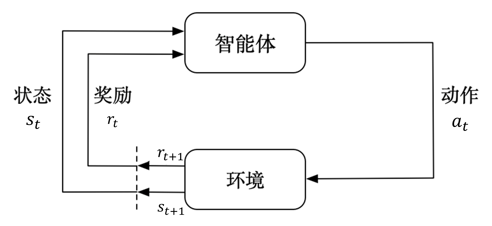

图 2.1 智能体与环境之间的交互

本章将介绍马尔可夫决策过程。在介绍马尔可夫决策过程之前，我们先介绍它的简化版本：马尔可夫过程（Markov process，MP）以及马尔可夫奖励过程（Markov reward process，MRP）。通过与这两种过程的比较，我们可以更容易理解马尔可夫决策过程。其次，我们会介绍马尔可夫决策过程中的**策略评估（policy evaluation）**，就是当给定决策后，我们怎么去计算它的价值函数。最后，我们会介绍马尔可夫决策过程的控制，具体有**策略迭代（policy iteration）** 和**价值迭代（value iteration）**两种算法。在马尔可夫决策过程中，它的环境是全部可观测的。但是很多时候环境里面有些量是不可观测的，但是这个部分观测的问题也可以转换成马尔可夫决策过程的问题。

## 2.1 马尔可夫过程 
### 2.1.1 马尔可夫性质
在随机过程中，**马尔可夫性质（Markov property）**是指一个随机过程在给定现在状态及所有过去状态情况下，其未来状态的条件概率分布仅依赖于当前状态。以离散随机过程为例，假设随机变量 $X_0,X_1,\cdots,X_T$构成一个随机过程。这些随机变量的所有可能取值的集合被称为状态空间（state space）。如果 $X_{t+1}$ 对于过去状态的条件概率分布仅是 $X_t$ 的一个函数，则
$$
p\left(X_{t+1}=x_{t+1} \mid X_{0:t}=x_{0: t}\right)=p\left(X_{t+1}=x_{t+1} \mid X_{t}=x_{t}\right)
$$
其中，$X_{0:t}$ 表示变量集合 $X_{0}, X_{1}, \cdots, X_{t}$，$x_{0: t}$ 为在状态空间中的状态序列 $x_{0}, x_{1}, \cdots, x_{t}$。马尔可夫性质也可以描述为给定当前状态时，将来的状态与过去状态是条件独立的。如果某一个过程满足**马尔可夫性质**，那么未来的转移与过去的是独立的，它只取决于现在。马尔可夫性质是所有马尔可夫过程的基础。

### 2.1.2 马尔可夫链

马尔可夫过程是一组具有马尔可夫性质的随机变量序列 $s_1,\cdots,s_t$，其中下一个时刻的状态$s_{t+1}$只取决于当前状态 $s_t$。我们设状态的历史为 $h_{t}=\left\{s_{1}, s_{2}, s_{3}, \ldots, s_{t}\right\}$（$h_t$ 包含了之前的所有状态），则马尔可夫过程满足条件：
$$
  p\left(s_{t+1} \mid s_{t}\right) =p\left(s_{t+1} \mid h_{t}\right) \tag{2.1}
$$
从当前 $s_t$ 转移到 $s_{t+1}$，它是直接就等于它之前所有的状态转移到 $s_{t+1}$。

离散时间的马尔可夫过程也称为**马尔可夫链（Markov chain）**。马尔可夫链是最简单的马尔可夫过程，其状态是有限的。例如，图 2.2 里面有4个状态，这4个状态在 $s_1,s_2,s_3,s_4$ 之间互相转移。比如从 $s_1$ 开始，$s_1$ 有 0.1 的概率继续存留在 $s_1$ 状态，有 0.2 的概率转移到 $s_2$，有 0.7 的概率转移到 $s_4$ 。如果 $s_4$ 是我们的当前状态，它有 0.3 的概率转移到 $s_2$，有 0.2 的概率转移到 $s_3$，有 0.5 的概率留在当前状态。

 
图 2.2 马尔可夫链示例

我们可以用**状态转移矩阵（state transition matrix）**$\boldsymbol{P}$ 来描述状态转移 $p\left(s_{t+1}=s^{\prime} \mid s_{t}=s\right)$：
$$
  \boldsymbol{P}=\left(\begin{array}{cccc}
    p\left(s_{1} \mid s_{1}\right) & p\left(s_{2} \mid s_{1}\right) & \ldots & p\left(s_{N} \mid s_{1}\right) \\
    p\left(s_{1} \mid s_{2}\right) & p\left(s_{2} \mid s_{2}\right) & \ldots & p\left(s_{N} \mid s_{2}\right) \\
    \vdots & \vdots & \ddots & \vdots \\
    p\left(s_{1} \mid s_{N}\right) & p\left(s_{2} \mid s_{N}\right) & \ldots & p\left(s_{N} \mid s_{N}\right)
    \end{array}\right)
$$
状态转移矩阵类似于条件概率（conditional probability），它表示当我们知道当前我们在状态 $s_t$ 时，到达下面所有状态的概率。所以它的每一行描述的是从一个节点到达所有其他节点的概率。

### 2.1.3 马尔可夫过程的例子 
图 2.3 所示为一个马尔可夫过程的例子，这里有七个状态。比如从 $s_1$ 开始，它有0.4的概率到 $s_2$ ，有 0.6 的概率留在当前的状态。 $s_2$ 有 0.4 的概率到$s_1$，有 0.4 的概率到 $s_3$ ，另外有 0.2 的概率留在当前状态。所以给定状态转移的马尔可夫链后，我们可以对这个链进行采样，这样就会得到一串轨迹。例如，假设我们从状态 $s_3$ 开始，可以得到3个轨迹：
* $s_3, s_4, s_5, s_6, s_6$；
* $s_3, s_2, s_3, s_2, s_1$；
* $s_3, s_4, s_4, s_5, s_5$。

通过对状态的采样，我们可以生成很多这样的轨迹。

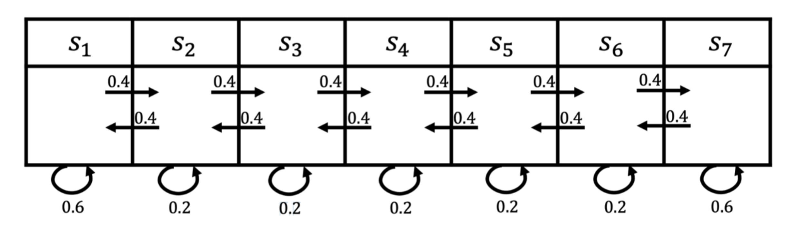

图 2.3 马尔可夫过程的例子

## 2.2 马尔可夫奖励过程 

**马尔可夫奖励过程（Markov reward process, MRP）**是马尔可夫链加上奖励函数。在马尔可夫奖励过程中，状态转移矩阵和状态都与马尔可夫链一样，只是多了**奖励函数（reward function）**。奖励函数 $R$ 是一个期望，表示当我们到达某一个状态的时候，可以获得多大的奖励。这里另外定义了折扣因子 $\gamma$ 。如果状态数是有限的，那么 $R$ 可以是一个向量。

### 2.2.1 回报与价值函数

这里我们进一步定义一些概念。**范围（horizon）** 是指一个回合的长度（每个回合最大的时间步数），它是由有限个步数决定的。
**回报（return）**可以定义为奖励的逐步叠加，假设时刻$t$后的奖励序列为$r_{t+1},r_{t+2},r_{t+3},\cdots$，则回报为
$$
  G_{t}=r_{t+1}+\gamma r_{t+2}+\gamma^{2} r_{t+3}+\gamma^{3} r_{t+4}+\ldots+\gamma^{T-t-1} r_{T}
$$
其中，$T$是最终时刻，$\gamma$ 是折扣因子，越往后得到的奖励，折扣越多。这说明我们更希望得到现有的奖励，对未来的奖励要打折扣。当我们有了回报之后，就可以定义状态的价值了，就是**状态价值函数（state-value function）**。对于马尔可夫奖励过程，状态价值函数被定义成回报的期望，即
$$
\begin{aligned}
    V^{t}(s) &=\mathbb{E}\left[G_{t} \mid s_{t}=s\right] \\
    &=\mathbb{E}\left[r_{t+1}+\gamma r_{t+2}+\gamma^{2} r_{t+3}+\ldots+\gamma^{T-t-1} r_{T} \mid s_{t}=s\right]
\end{aligned}  
$$
其中，$G_t$ 是之前定义的**折扣回报（discounted return）**。我们对$G_t$取了一个期望，期望就是从这个状态开始，我们可能获得多大的价值。所以期望也可以看成未来可能获得奖励的当前价值的表现，就是当我们进入某一个状态后，我们现在有多大的价值。

我们使用折扣因子的原因如下。第一，有些马尔可夫过程是带环的，它并不会终结，我们想避免无穷的奖励。第二，我们并不能建立完美的模拟环境的模型，我们对未来的评估不一定是准确的，我们不一定完全信任模型，因为这种不确定性，所以我们对未来的评估增加一个折扣。我们想把这个不确定性表示出来，希望尽可能快地得到奖励，而不是在未来某一个点得到奖励。第三，如果奖励是有实际价值的，我们可能更希望立刻就得到奖励，而不是后面再得到奖励（现在的钱比以后的钱更有价值）。最后，我们也更想得到即时奖励。有些时候可以把折扣因子设为 0（$\gamma=0$），我们就只关注当前的奖励。我们也可以把折扣因子设为 1（$\gamma=1$），对未来的奖励并没有打折扣，未来获得的奖励与当前获得的奖励是一样的。折扣因子可以作为强化学习智能体的一个超参数（hyperparameter）来进行调整，通过调整折扣因子，我们可以得到不同动作的智能体。

在马尔可夫奖励过程里面，我们如何计算价值呢？如图 2.4 所示，马尔可夫奖励过程依旧是状态转移，其奖励函数可以定义为：智能体进入第一个状态 $s_1$ 的时候会得到 5 的奖励，进入第七个状态 $s_7$ 的时候会得到 10 的奖励，进入其他状态都没有奖励。我们可以用向量来表示奖励函数，即

$$
  \boldsymbol{R}=[5,0,0,0,0,0,10]
$$

 

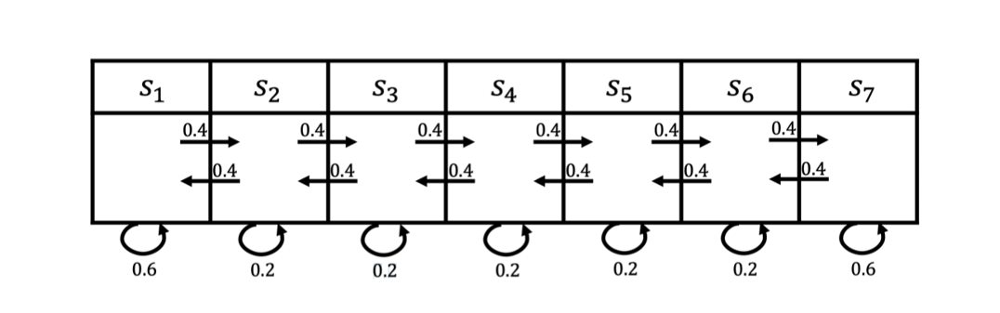

 
图 2.4 马尔可夫奖励过程的例子

我们对 4 步的回合（$\gamma=0.5$）来采样回报 $G$。

  （1）$s_{4}, s_{5}, s_{6}, s_{7} \text{的回报}: 0+0.5\times 0+0.25 \times 0+ 0.125\times 10=1.25$

  （2）$s_{4}, s_{3}, s_{2}, s_{1} \text{的回报}: 0+0.5 \times 0+0.25\times 0+0.125 \times 5=0.625$

  （3）$s_{4}, s_{5}, s_{6}, s_{6} \text{的回报}: 0+0.5\times 0 +0.25 \times 0+0.125 \times 0=0$

我们现在可以计算每一个轨迹得到的奖励，比如我们对轨迹 $s_4,s_5,s_6,s_7$ 的奖励进行计算，这里折扣因子是 0.5。在 $s_4$ 的时候，奖励为0。下一个状态 $s_5$ 的时候，因为我们已经到了下一步，所以要把 $s_5$ 进行折扣，$s_5$ 的奖励也是0。然后是 $s_6$，奖励也是0，折扣因子应该是0.25。到达 $s_7$ 后，我们获得了一个奖励，但是因为状态 $s_7$ 的奖励是未来才获得的奖励，所以我们要对之进行3次折扣。最终这个轨迹的回报就是 1.25。类似地，我们可以得到其他轨迹的回报。

这里就引出了一个问题，当我们有了一些轨迹的实际回报时，怎么计算它的价值函数呢？比如我们想知道 $s_4$ 的价值，即当我们进入 $s_4$ 后，它的价值到底如何？一个可行的做法就是我们可以生成很多轨迹，然后把轨迹都叠加起来。比如我们可以从 $s_4$ 开始，采样生成很多轨迹，把这些轨迹的回报都计算出来，然后将其取平均值作为我们进入 $s_4$ 的价值。这其实是一种计算价值函数的办法，也就是通过蒙特卡洛（Monte Carlo，MC）采样的方法计算 $s_4$ 的价值。
### 2.2.2 贝尔曼方程

但是这里我们采取了另外一种计算方法，从价值函数里面推导出**贝尔曼方程（Bellman equation）**：
$$
  V(s)=\underbrace{R(s)}_{\text {即时奖励}}+\underbrace{\gamma \sum_{s^{\prime} \in S} p\left(s^{\prime} \mid s\right) V\left(s^{\prime}\right)}_{\text {未来奖励的折扣总和}}
$$
其中，
* $s'$ 可以看成未来的所有状态，
* $p(s'|s)$  是指从当前状态转移到未来状态的概率。
* $V(s')$ 代表的是未来某一个状态的价值。我们从当前状态开始，有一定的概率去到未来的所有状态，所以我们要把 $p\left(s^{\prime} \mid s\right)$ 写上去。我们得到了未来状态后，乘一个 $\gamma$，这样就可以把未来的奖励打折扣。
* $\gamma \sum_{s^{\prime} \in S} p\left(s^{\prime} \mid s\right) V\left(s^{\prime}\right)$ 可以看成未来奖励的折扣总和（discounted sum of future reward）。

贝尔曼方程定义了当前状态与未来状态之间的关系。未来奖励的折扣总和加上即时奖励，就组成了贝尔曼方程。

**1.全期望公式**

在推导贝尔曼方程之前，我们先仿照**全期望公式（law of total expectation）**的证明过程来证明：
$$
  \mathbb{E}[V(s_{t+1})|s_t]=\mathbb{E}[\mathbb{E}[G_{t+1}|s_{t+1}]|s_t]=\mathbb{E}[G_{t+1}|s_t]
$$

>全期望公式也被称为叠期望公式（law of iterated expectations，LIE）。
如果 $A_i$ 是样本空间的有限或可数的划分（partition），则全期望公式可定义为
$$
  \mathbb{E}[X]=\sum_{i} \mathbb{E}\left[X \mid A_{i}\right] p\left(A_{i}\right)
$$

证明：
为了符号简洁并且易读，我们去掉下标，令 $s=s_t$，$g'=G_{t+1}$，$s'=s_{t+1}$。我们可以根据条件期望的定义来重写回报的期望为

$$
  \begin{aligned}
    \mathbb{E}\left[G_{t+1} \mid s_{t+1}\right] &=\mathbb{E}\left[g^{\prime} \mid s^{\prime}\right] \\
    &=\sum_{g^{\prime}} g^{\prime}~p\left(g^{\prime} \mid s^{\prime}\right)
    \end{aligned} \tag{2.2}
$$

>如果 $X$ 和 $Y$ 都是离散型随机变量，则条件期望（conditional expectation）$\mathbb{E}[X|Y=y]$ 定义为
$$
  \mathbb{E}[X \mid Y=y]=\sum_{x} x p(X=x \mid Y=y)
$$

令 $s_t=s$，我们对式(2.2)求期望可得
$$
  \begin{aligned}
    \mathbb{E}\left[\mathbb{E}\left[G_{t+1} \mid s_{t+1}\right] \mid s_{t}\right] &=\mathbb{E} \left[\mathbb{E}\left[g^{\prime} \mid s^{\prime}\right] \mid s\right] \\
    &=\mathbb{E} \left[\sum_{g^{\prime}} g^{\prime}~p\left(g^{\prime} \mid s^{\prime}\right)\mid s\right]\\
    &=\sum_{s^{\prime}} \sum_{g^{\prime}} g^{\prime} p\left(g^{\prime} \mid s^{\prime}, s\right) p\left(s^{\prime} \mid s\right) \\
    &=\sum_{s^{\prime}} \sum_{g^{\prime}} \frac{g^{\prime} p\left(g^{\prime} \mid s^{\prime}, s\right) p\left(s^{\prime} \mid s\right) p(s)}{p(s)} \\
    &=\sum_{s^{\prime}} \sum_{g^{\prime}} \frac{g^{\prime} p\left(g^{\prime} \mid s^{\prime}, s\right) p\left(s^{\prime}, s\right)}{p(s)} \\
    &=\sum_{s^{\prime}} \sum_{g^{\prime}} \frac{g^{\prime} p\left(g^{\prime}, s^{\prime}, s\right)}{p(s)} \\
    &=\sum_{s^{\prime}} \sum_{g^{\prime}} g^{\prime} p\left(g^{\prime}, s^{\prime} \mid s\right) \\
    &=\sum_{g^{\prime}} \sum_{s^{\prime}} g^{\prime} p\left(g^{\prime}, s^{\prime} \mid s\right) \\
    &=\sum_{g^{\prime}} g^{\prime} p\left(g^{\prime} \mid s\right) \\
    &=\mathbb{E}\left[g^{\prime} \mid s\right]=\mathbb{E}\left[G_{t+1} \mid s_{t}\right]
    \end{aligned}    
$$

**2.贝尔曼方程推导**

贝尔曼方程的推导过程如下：

$$
  \begin{aligned}
    V(s)&=\mathbb{E}\left[G_{t} \mid s_{t}=s\right]\\
    &=\mathbb{E}\left[r_{t+1}+\gamma r_{t+2}+\gamma^{2} r_{t+3}+\ldots \mid s_{t}=s\right]  \\
    &=\mathbb{E}\left[r_{t+1}|s_t=s\right] +\gamma \mathbb{E}\left[r_{t+2}+\gamma r_{t+3}+\gamma^{2} r_{t+4}+\ldots \mid s_{t}=s\right]\\
    &=R(s)+\gamma \mathbb{E}[G_{t+1}|s_t=s] \\
    &=R(s)+\gamma \mathbb{E}[V(s_{t+1})|s_t=s]\\
    &=R(s)+\gamma \sum_{s^{\prime} \in S} p\left(s^{\prime} \mid s\right) V\left(s^{\prime}\right)
    \end{aligned}  
$$

>贝尔曼方程就是当前状态与未来状态的迭代关系，表示当前状态的价值函数可以通过下个状态的价值函数来计算。贝尔曼方程因其提出者、动态规划创始人理查德 $\cdot$ 贝尔曼（Richard Bellman）而得名 ，也叫作“动态规划方程”。

贝尔曼方程定义了状态之间的迭代关系，即
$$
  V(s)=R(s)+\gamma \sum_{s^{\prime} \in S} p\left(s^{\prime} \mid s\right) V\left(s^{\prime}\right)
$$

假设有一个马尔可夫链如图 2.5a 所示，贝尔曼方程描述的就是当前状态到未来状态的一个转移。如图 2.5b 所示，假设我们当前在 $s_1$， 那么它只可能去到3个未来的状态：有 0.1 的概率留在它当前位置，有 0.2 的概率去到 $s_2$ 状态，有 0.7 的概率去到 $s_4$ 状态。所以我们把状态转移概率乘它未来的状态的价值，再加上它的即时奖励（immediate reward），就会得到它当前状态的价值。贝尔曼方程定义的就是当前状态与未来状态的迭代关系。

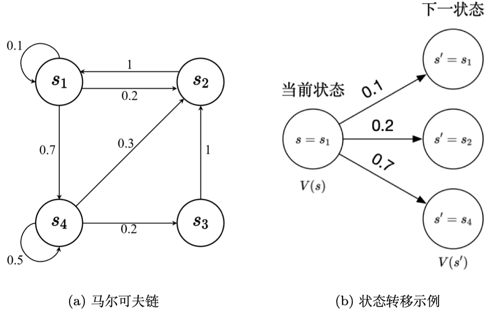

图 2.5 状态转移

我们可以把贝尔曼方程写成矩阵的形式：
$$
  \left(\begin{array}{c}
    V\left(s_{1}\right) \\
    V\left(s_{2}\right) \\
    \vdots \\
    V\left(s_{N}\right)
    \end{array}\right)=\left(\begin{array}{c}
    R\left(s_{1}\right) \\
    R\left(s_{2}\right) \\
    \vdots \\
    R\left(s_{N}\right)
    \end{array}\right)+\gamma\left(\begin{array}{cccc}
    p\left(s_{1} \mid s_{1}\right) & p\left(s_{2} \mid s_{1}\right) & \ldots & p\left(s_{N} \mid s_{1}\right) \\
    p\left(s_{1} \mid s_{2}\right) & p\left(s_{2} \mid s_{2}\right) & \ldots & p\left(s_{N} \mid s_{2}\right) \\
    \vdots & \vdots & \ddots & \vdots \\
    p\left(s_{1} \mid s_{N}\right) & p\left(s_{2} \mid s_{N}\right) & \ldots & p\left(s_{N} \mid s_{N}\right)
    \end{array}\right)\left(\begin{array}{c}
    V\left(s_{1}\right) \\
    V\left(s_{2}\right) \\
    \vdots \\
    V\left(s_{N}\right)
    \end{array}\right) 
$$

我们当前的状态是向量$[V(s_1),V(s_2),\cdots,V(s_N)]^\mathrm{T}$。每一行来看，向量$\boldsymbol{V}$乘状态转移矩阵里面的某一行，再加上它当前可以得到的奖励，就会得到它当前的价值。

当我们把贝尔曼方程写成矩阵形式后，可以直接求解：
$$
  \begin{aligned}
    \boldsymbol{V} &= \boldsymbol{\boldsymbol{R}}+ \gamma \boldsymbol{P}\boldsymbol{V} \\
    \boldsymbol{I}\boldsymbol{V} &= \boldsymbol{R}+ \gamma \boldsymbol{P}\boldsymbol{V} \\
    (\boldsymbol{I}-\gamma \boldsymbol{P})\boldsymbol{V}&=\boldsymbol{R} \\
    \boldsymbol{V}&=(\boldsymbol{I}-\gamma \boldsymbol{P})^{-1}\boldsymbol{R}
    \end{aligned}
$$

我们可以直接得到**解析解（analytic solution）**：
$$
  \boldsymbol{V}=(\boldsymbol{I}-\gamma \boldsymbol{P})^{-1} \boldsymbol{R}
$$

我们可以通过矩阵求逆把 $\boldsymbol{V}$ 的价值直接求出来。但是一个问题是这个矩阵求逆的过程的复杂度是 $O(N^3)$。所以当状态非常多的时候，比如从10个状态到1000个状态，或者到100万个状态，当我们有100万个状态的时候，状态转移矩阵就会是一个100万乘100万的矩阵，对这样一个大矩阵求逆是非常困难的。所以这种通过解析解去求解的方法只适用于很小量的马尔可夫奖励过程。

### 2.2.3 计算马尔可夫奖励过程价值的迭代算法 

我们可以将迭代的方法应用于状态非常多的马尔可夫奖励过程（large MRP），比如：动态规划的方法，蒙特卡洛的方法（通过采样的办法计算它），**时序差分学习（temporal-difference learning，TD learning）**的方法（时序差分学习是动态规划和蒙特卡洛方法的一个结合）。

首先我们用蒙特卡洛方法来计算价值。如图 2.6  所示，蒙特卡洛方法就是当得到一个马尔可夫奖励过程后，我们可以从某个状态开始，把小船放到状态转移矩阵里面，让它“随波逐流”，这样就会产生一个轨迹。产生一个轨迹之后，就会得到一个奖励，那么直接把折扣的奖励即回报 $g$ 算出来。算出来之后将它积累起来，得到回报$G_t$。 当积累了一定数量的轨迹之后，我们直接用 $G_t$ 除以轨迹数量，就会得到某个状态的价值。

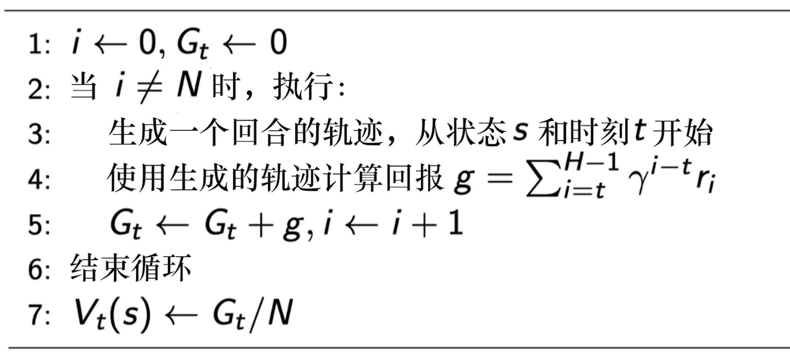

 
图 2.6 计算马尔可夫奖励过程价值的蒙特卡洛方法

比如我们要计算 $s_4$ 状态的价值，可以从 $s_4$ 状态开始，随机产生很多轨迹。把小船放到状态转移矩阵里面，然后它就会“随波逐流”，产生轨迹。每个轨迹都会得到一个回报，我们得到大量的回报，比如100个、1000个回报，然后直接取平均值，就可以等价于现在 $s_4$ 的价值，因为 $s_4$ 的价值 $V(s_4)$  定义了我们未来可能得到多少的奖励。这就是蒙特卡洛采样的方法。

如图 2.7 所示，我们也可以用动态规划的方法，一直迭代贝尔曼方程，直到价值函数收敛，我们就可以得到某个状态的价值。我们通过**自举（bootstrapping）**的方法不停地迭代贝尔曼方程，当最后更新的状态与我们上一个状态的区别并不大的时候，更新就可以停止，我们就可以输出最新的 $V'(s)$ 作为它当前的状态的价值。这里就是把贝尔曼方程变成一个贝尔曼更新（Bellman update），这样就可以得到状态的价值。

动态规划的方法基于后继状态价值的估计来更新现在状态价值的估计（如图 2.7 所示算法中的第 3 行用 $V'$ 来更新 $V$ ）。根据其他估算值来更新估算值的思想，我们称其为自举。

 

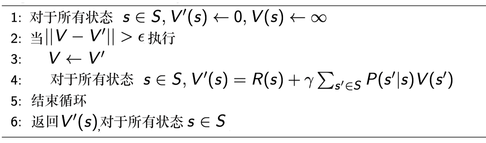

 
图 2.7 计算马尔可夫奖励过程价值的动态规划算法

>bootstrap 的本意是“解靴带”。这里使用了德国文学作品《吹牛大王历险记》中解靴带自助（拔靴自助）的典故，因此将其译为“自举”。

### 2.2.4 马尔可夫奖励过程的例子 

如图 2.8 所示，如果我们在马尔可夫链上加上奖励，那么到达每个状态，我们都会获得一个奖励。我们可以设置对应的奖励，比如智能体到达状态 $s_1$时，可以获得 5 的奖励；到达 $s_7$ 的时候，可以得到 10 的奖励；到达其他状态没有任何奖励。
因为这里的状态是有限的，所以我们可以用向量 $\boldsymbol{R}=[5,0,0,0,0,0,10]$ 来表示奖励函数，$\boldsymbol{R}$表示每个状态的奖励大小。

我们通过一个形象的例子来理解马尔可夫奖励过程。我们把一艘纸船放到河流之中，它就会随着水流而流动，它自身是没有动力的。所以我们可以把马尔可夫奖励过程看成一个随波逐流的例子，当我们从某一个点开始的时候，纸船就会随着事先定义好的状态转移进行流动，它到达每个状态后，我们都有可能获得一些奖励。

 

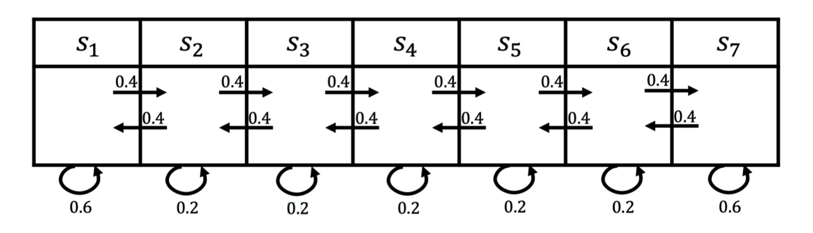

 
图 2.8 马尔可夫奖励过程的例子

## 2.3 马尔可夫决策过程 
相对于马尔可夫奖励过程，马尔可夫决策过程多了决策（决策是指动作），其他的定义与马尔可夫奖励过程的是类似的。此外，状态转移也多了一个条件，变成了$p\left(s_{t+1}=s^{\prime} \mid s_{t}=s,a_{t}=a\right)$。未来的状态不仅依赖于当前的状态，也依赖于在当前状态智能体采取的动作。马尔可夫决策过程满足条件：
$$
  p\left(s_{t+1} \mid s_{t}, a_{t}\right) =p\left(s_{t+1} \mid h_{t}, a_{t}\right)   
$$

对于奖励函数，它也多了一个当前的动作，变成了 $R\left(s_{t}=s, a_{t}=a\right)=\mathbb{E}\left[r_{t} \mid s_{t}=s, a_{t}=a\right]$。当前的状态以及采取的动作会决定智能体在当前可能得到的奖励多少。

### 2.3.1 马尔可夫决策过程中的策略 

策略定义了在某一个状态应该采取什么样的动作。知道当前状态后，我们可以把当前状态代入策略函数来得到一个概率，即 
$$
  \pi(a \mid s)=p\left(a_{t}=a \mid s_{t}=s\right)
$$
概率代表在所有可能的动作里面怎样采取行动，比如可能有 0.7 的概率往左走，有 0.3 的概率往右走，这是一个概率的表示。另外策略也可能是确定的，它有可能直接输出一个值，或者直接告诉我们当前应该采取什么样的动作，而不是一个动作的概率。假设概率函数是平稳的（stationary），不同时间点，我们采取的动作其实都是在对策略函数进行采样。

已知马尔可夫决策过程和策略 $\pi$，我们可以把马尔可夫决策过程转换成马尔可夫奖励过程。在马尔可夫决策过程里面，状态转移函数 $P(s'|s,a)$ 基于它当前的状态以及它当前的动作。因为我们现在已知策略函数，也就是已知在每一个状态下，可能采取的动作的概率，所以我们就可以直接把动作进行加和，去掉 $a$，这样我们就可以得到对于马尔可夫奖励过程的转移，这里就没有动作，即
$$
  P_{\pi}\left(s^{\prime} \mid s\right)=\sum_{a \in A} \pi(a \mid s) p\left(s^{\prime} \mid s, a\right)
$$

对于奖励函数，我们也可以把动作去掉，这样就会得到类似于马尔可夫奖励过程的奖励函数，即
$$
  r_{\pi}(s)=\sum_{a \in A} \pi(a \mid s) R(s, a)
$$

### 2.3.2 马尔可夫决策过程和马尔可夫过程/马尔可夫奖励过程的区别 
马尔可夫决策过程里面的状态转移与马尔可夫奖励过程以及马尔可夫过程的状态转移的差异如图 2.9 所示。马尔可夫过程/马尔可夫奖励过程的状态转移是直接决定的。比如当前状态是 $s$，那么直接通过转移概率决定下一个状态是什么。但对于马尔可夫决策过程，它的中间多了一层动作 $a$ ，即智能体在当前状态的时候，首先要决定采取某一种动作，这样我们会到达某一个黑色的节点。到达这个黑色的节点后，因为有一定的不确定性，所以当智能体当前状态以及智能体当前采取的动作决定过后，智能体进入未来的状态其实也是一个概率分布。在当前状态与未来状态转移过程中多了一层决策性，这是马尔可夫决策过程与之前的马尔可夫过程/马尔可夫奖励过程很不同的一点。在马尔可夫决策过程中，动作是由智能体决定的，智能体会采取动作来决定未来的状态转移。

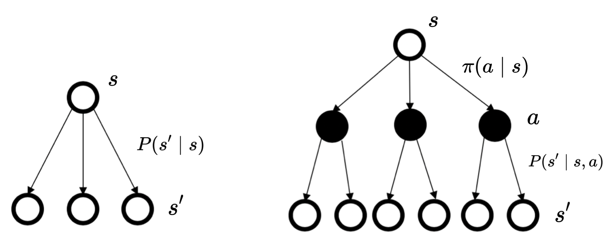

 
图 2.9 马尔可夫决策过程与马尔可夫过程/马尔可夫奖励过程的状态转移的对比

### 2.3.3 马尔可夫决策过程中的价值函数 

马尔可夫决策过程中的价值函数可定义为
$$
V_{\pi}(s)=\mathbb{E}_{\pi}\left[G_{t} \mid s_{t}=s\right] \tag{2.3}
$$
其中，期望基于我们采取的策略。当策略决定后，我们通过对策略进行采样来得到一个期望，计算出它的价值函数。

这里我们另外引入了一个 **Q 函数（Q-function）**。Q 函数也被称为**动作价值函数（action-value function）**。Q 函数定义的是在某一个状态采取某一个动作，它有可能得到的回报的一个期望，即
$$
Q_{\pi}(s, a)=\mathbb{E}_{\pi}\left[G_{t} \mid s_{t}=s, a_{t}=a\right] \tag{2.4}
$$
这里的期望其实也是基于策略函数的。所以我们需要对策略函数进行一个加和，然后得到它的价值。
对 Q 函数中的动作进行加和，就可以得到价值函数：
$$
V_{\pi}(s)=\sum_{a \in A} \pi(a \mid s) Q_{\pi}(s, a)
\tag{2.5}
$$

此处我们对 Q 函数的贝尔曼方程进行推导：
$$
  \begin{aligned}
    Q(s,a)&=\mathbb{E}\left[G_{t} \mid s_{t}=s,a_{t}=a\right]\\
    &=\mathbb{E}\left[r_{t+1}+\gamma r_{t+2}+\gamma^{2} r_{t+3}+\ldots \mid s_{t}=s,a_{t}=a\right]  \\
    &=\mathbb{E}\left[r_{t+1}|s_{t}=s,a_{t}=a\right] +\gamma \mathbb{E}\left[r_{t+2}+\gamma r_{t+3}+\gamma^{2} r_{t+4}+\ldots \mid s_{t}=s,a_{t}=a\right]\\
    &=R(s,a)+\gamma \mathbb{E}[G_{t+1}|s_{t}=s,a_{t}=a] \\
    &=R(s,a)+\gamma \mathbb{E}[V(s_{t+1})|s_{t}=s,a_{t}=a]\\
    &=R(s,a)+\gamma \sum_{s^{\prime} \in S} p\left(s^{\prime} \mid s,a\right) V\left(s^{\prime}\right)
    \end{aligned}
$$

### 2.3.4 贝尔曼期望方程 

我们可以把状态价值函数和 Q 函数拆解成两个部分：即时奖励和后续状态的折扣价值（discounted value of successor state）。
通过对状态价值函数进行分解，我们就可以得到一个类似于之前马尔可夫奖励过程的贝尔曼方程————**贝尔曼期望方程（Bellman expectation equation）**：
$$
  V_{\pi}(s)=\mathbb{E}_{\pi}\left[r_{t+1}+\gamma V_{\pi}\left(s_{t+1}\right) \mid s_{t}=s\right] \tag{2.6} 
$$

对于 Q 函数，我们也可以做类似的分解，得到 Q 函数的贝尔曼期望方程：
$$
  Q_{\pi}(s, a)=\mathbb{E}_{\pi}\left[r_{t+1}+\gamma Q_{\pi}\left(s_{t+1}, a_{t+1}\right) \mid s_{t}=s, a_{t}=a\right] \tag{2.7}
$$
贝尔曼期望方程定义了当前状态与未来状态之间的关联。

我们进一步进行简单的分解，先给出式(2.8)：

$$
  V_{\pi}(s)=\sum_{a \in A} \pi(a \mid s) Q_{\pi}(s, a) \tag{2.8} 
$$

接着，我们再给出式(2.9)：
$$
  Q_{\pi}(s, a)=R(s,a)+\gamma \sum_{s^{\prime} \in S} p\left(s^{\prime} \mid s, a\right) V_{\pi}\left(s^{\prime}\right) \tag{2.9} 
$$

式(2.8)和式(2.9)代表状态价值函数与 Q 函数之间的关联。

我们把式(2.9)代入式(2.8)可得
$$
  V_{\pi}(s)=\sum_{a \in A} \pi(a \mid s)\left(R(s, a)+\gamma \sum_{s^{\prime} \in S} p\left(s^{\prime} \mid s, a\right) V_{\pi}\left(s^{\prime}\right)\right) \tag{2.10} 
$$

式(2.10)代表当前状态的价值与未来状态价值之间的关联。

我们把式(2.8)代入式(2.9)可得
$$
  Q_{\pi}(s, a)=R(s, a)+\gamma \sum_{s^{\prime} \in S} p\left(s^{\prime} \mid s, a\right) \sum_{a^{\prime} \in A} \pi\left(a^{\prime} \mid s^{\prime}\right) Q_{\pi}\left(s^{\prime}, a^{\prime}\right) \tag{2.11} 
$$

式(2.11)代表当前时刻的 Q 函数与未来时刻的 Q 函数之间的关联。

式(2.10)和式(2.11)是贝尔曼期望方程的另一种形式。

### 2.3.5 备份图 

接下来我们介绍**备份（backup）**的概念。备份类似于自举之间的迭代关系，对于某一个状态，它的当前价值是与它的未来价值线性相关的。
我们将与图 2.10 类似的图称为**备份图（backup diagram）**或回溯图，因为它们所示的关系构成了更新或备份操作的基础，而这些操作是强化学习方法的核心。这些操作将价值信息从一个状态（或状态-动作对）的后继状态（或状态-动作对）转移回它。
每一个空心圆圈代表一个状态，每一个实心圆圈代表一个状态-动作对。

 

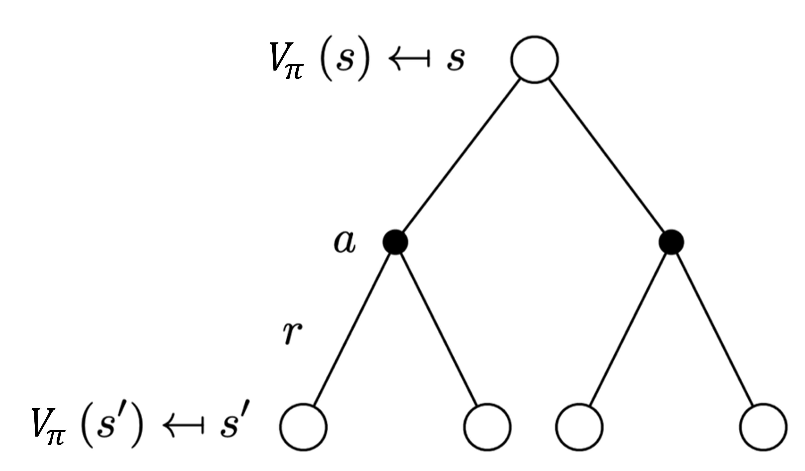

&ensp;&ensp;&ensp;&ensp;&ensp;&ensp;&ensp;&ensp;&ensp;&ensp;&ensp;&ensp;&ensp;&ensp;&ensp;&ensp;&ensp;&ensp;&ensp;&ensp;&ensp;&ensp;&ensp;&ensp;&ensp;&ensp;&ensp;&ensp;&ensp;&ensp;&ensp;&ensp;&ensp;&ensp;&ensp;&ensp;&ensp;&ensp;&ensp;&ensp;&ensp;&ensp;&ensp;&ensp;&ensp;&ensp;&ensp;&ensp;&ensp;&ensp;图 2.10 $V_{\pi}$备份图

如式(2.12)所示，这里有两层加和。第一层加和是对叶子节点进行加和，往上备份一层，我们就可以把未来的价值（$s'$ 的价值）备份到黑色的节点。
第二层加和是对动作进行加和，得到黑色节点的价值后，再往上备份一层，就会得到根节点的价值，即当前状态的价值。
$$
V_{\pi}(s)=\sum_{a \in A} \pi(a \mid s)\left(R(s, a)+\gamma \sum_{s^{\prime} \in S} p\left(s^{\prime} \mid s, a\right) V_{\pi}\left(s^{\prime}\right)\right) \tag{2.12}
$$

图 2.11 所示为状态价值函数的计算分解，图 2.11b 的计算公式为
$$
  V_{\pi}(s)=\sum_{a \in A} \pi(a \mid s) Q_{\pi}(s, a) \tag{2.13} 
$$

图 2.11b 给出了状态价值函数与 Q 函数之间的关系。图 2.11c 计算 Q 函数为

$$
  Q_{\pi}(s,a)=R(s, a)+\gamma \sum_{s^{\prime} \in S} p\left(s^{\prime} \mid s, a\right) V_{\pi}\left(s^{\prime}\right) \tag{2.14} 
$$

我们将式(2.14)代入式(2.13)可得
$$
  V_{\pi}(s)=\sum_{a \in A} \pi(a \mid s)\left(R(s, a)+\gamma \sum_{s^{\prime} \in S} p\left(s^{\prime} \mid s, a\right) V_{\pi}\left(s^{\prime}\right)\right)
$$

所以备份图定义了未来下一时刻的状态价值函数与上一时刻的状态价值函数之间的关联。

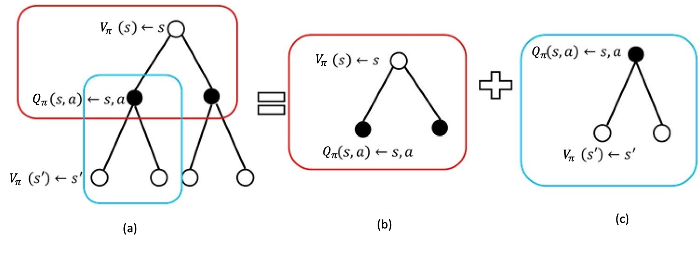

图 2.11 状态价值函数的计算分解

对于 Q 函数，我们也可以进行这样的一个推导。如图 2.12 所示，现在的根节点是 Q 函数的一个节点。Q 函数对应于黑色的节点。下一时刻的 Q 函数对应于叶子节点，有4个黑色的叶子节点。
$$
Q_{\pi}(s, a)=R(s, a)+\gamma \sum_{s^{\prime} \in S} p\left(s^{\prime} \mid s, a\right) \sum_{a^{\prime} \in A} \pi\left(a^{\prime} \mid s^{\prime}\right) Q_{\pi}\left(s^{\prime}, a^{\prime}\right) \tag{2.15}
$$

如式(2.15)所示，这里也有两层加和。第一层加和先把叶子节点从黑色节点推到空心圆圈节点，进入到空心圆圈结点的状态。
当我们到达某一个状态后，再对空心圆圈节点进行加和，这样就把空心圆圈节点重新推回到当前时刻的 Q 函数。

 

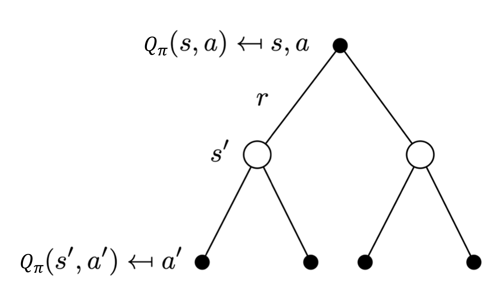

&ensp;&ensp;&ensp;&ensp;&ensp;&ensp;&ensp;&ensp;&ensp;&ensp;&ensp;&ensp;&ensp;&ensp;&ensp;&ensp;&ensp;&ensp;&ensp;&ensp;&ensp;&ensp;&ensp;&ensp;&ensp;&ensp;&ensp;&ensp;&ensp;&ensp;&ensp;&ensp;&ensp;&ensp;&ensp;&ensp;&ensp;&ensp;&ensp;&ensp;&ensp;&ensp;&ensp;&ensp;&ensp;&ensp;&ensp;&ensp;&ensp;&ensp;图 2.12 $Q^{\pi}$的备份图

图 2.13c 中，
$$
V_{\pi}\left(s^{\prime}\right)=\sum_{a^{\prime} \in A} \pi\left(a^{\prime} \mid s^{\prime}\right) Q_{\pi}\left(s^{\prime}, a^{\prime}\right) \tag{2.16}
$$

我们将式(2.16)代入式(2.14)可得未来 Q 函数与当前 Q 函数之间的关联，即
$$
  Q_{\pi}(s, a)=R(s, a)+\gamma \sum_{s^{\prime} \in S} p\left(s^{\prime} \mid s, a\right) \sum_{a^{\prime} \in A} \pi\left(a^{\prime} \mid s^{\prime}\right) Q_{\pi}\left(s^{\prime}, a^{\prime}\right)
$$

 

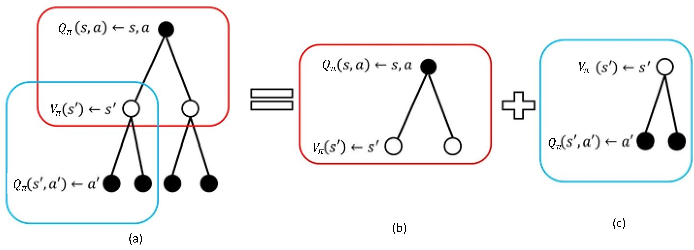

 
图 2.13 Q函数的计算分解

### 2.3.6 策略评估

已知马尔可夫决策过程以及要采取的策略 $\pi$ ，计算价值函数 $V_{\pi}(s)$ 的过程就是**策略评估**。策略评估在有些地方也被称为**（价值）预测[（value）prediction）]**，也就是预测我们当前采取的策略最终会产生多少价值。如图 2.14a 所示，对于马尔可夫决策过程，我们其实可以把它想象成一个摆渡的人在船上，她可以控制船的移动，避免船随波逐流。因为在每一个时刻，摆渡的人采取的动作会决定船的方向。如图 2.14b 所示，对于马尔可夫奖励过程与马尔可夫过程，纸的小船会随波逐流，然后产生轨迹。马尔可夫决策过程的不同之处在于有一个智能体控制船，这样我们就可以尽可能多地获得奖励。

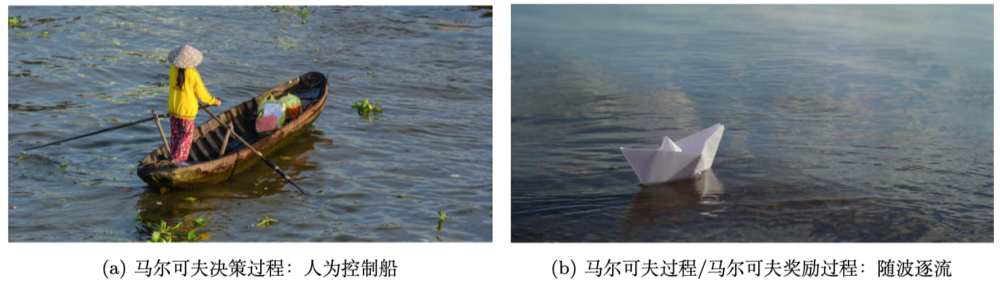

 
图 2.14 马尔可夫决策过程与马尔可夫过程/马尔可夫奖励过程的区别

我们再看一下策略评估的例子，探究怎么在决策过程中计算每一个状态的价值。如图 2.15 所示，假设环境里面有两种动作：往左走和往右走。现在的奖励函数应该是关于动作和状态两个变量的函数。但这里规定，不管智能体采取什么动作，只要到达状态 $s_1$，就有 5 的奖励；只要到达状态 $s_7$ ，就有 10 的奖励，到达其他状态没有奖励。我们可以将奖励函数表示为 $\boldsymbol{R}=[5,0,0,0,0,0,10]$。假设智能体现在采取一个策略：不管在任何状态，智能体采取的动作都是往左走，即采取的是确定性策略 $\pi(s)=\text{左}$。假设价值折扣因子$\gamma=0$，那么对于确定性策略，最后估算出的价值函数是一致的，即 $\boldsymbol{V}_{\pi}=[5,0,0,0,0,0,10]$。

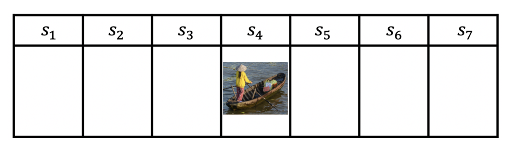

图 2.15 策略评估示例

我们可以直接通过贝尔曼方程来得到价值函数：
$$
  V^{k}_{\pi}(s)=r(s, \pi(s))+\gamma \sum_{s^{\prime} \in S} p\left(s^{\prime} \mid s, \pi(s)\right) V^{k-1}_{\pi}\left(s^{\prime}\right)
$$
其中，$k$ 是迭代次数。我们可以不停地迭代，最后价值函数会收敛。收敛之后，价值函数的值就是每一个状态的价值。

再来看一个例子，如果折扣因子 $\gamma=0.5$，我们可以通过式(2.17)进行迭代：
$$
  V^{t}_{\pi}(s)=\sum_{a} p(\pi(s)=a)\left(r(s, a)+\gamma \sum_{s^{\prime} \in S} p\left(s^{\prime} \mid s, a\right) V^{t-1}_{\pi}\left(s^{\prime}\right)\right) \tag{2.17}
$$
其中，$t$是迭代次数。然后就可以得到它的状态价值。

最后，例如，我们现在采取随机策略，在每个状态下，有 0.5 的概率往左走，有 0.5 的概率往右走，即 $p(\pi(s)= \text{左})=0.5$，$p(\pi(s)= \text{右})=0.5$，如何求出这个策略下的状态价值呢？我们可以这样做：一开始的时候，我们对$V(s')$进行初始化，不同的 $V(s')$ 都会有一个值；接着，我们将$V(s')$代入贝尔曼期望方程里面进行迭代，就可以算出它的状态价值。

### 2.3.7 预测与控制 

预测（prediction）和控制（control）是马尔可夫决策过程里面的核心问题。预测（评估一个给定的策略）的输入是马尔可夫决策过程 $<S,A,P,R,\gamma>$ 和策略 $\pi$，  

输出是价值函数 $V_{\pi}$。预测是指给定一个马尔可夫决策过程以及一个策略 $\pi$ ，计算它的价值函数，也就是计算每个状态的价值。

控制（搜索最佳策略）的输入是马尔可夫决策过程 $<S,A,P,R,\gamma>$，输出是最佳价值函数（optimal value function）$V^*$ 和最佳策略（optimal policy）$\pi^*$。控制就是我们去寻找一个最佳的策略，然后同时输出它的最佳价值函数以及最佳策略。

在马尔可夫决策过程里面，预测和控制都可以通过动态规划解决。要强调的是，这两者的区别就在于，预测问题是给定一个策略，我们要确定它的价值函数是多少。而控制问题是在没有策略的前提下，我们要确定最佳的价值函数以及对应的决策方案。实际上，这两者是递进的关系，在强化学习中，我们通过解决预测问题，进而解决控制问题。

举一个例子来说明预测与控制的区别。首先是预测问题。在图 2.16a 的方格中，我们规定从 A $\to$ A' 可以得到 +10 的奖励，从 B $\to$ B' 可以得到 +5 的奖励，其他步骤的奖励为 $-$1。如图 2.16b 所示，现在，我们给定一个策略：在任何状态中，智能体的动作模式都是随机的，也就是上、下、左、右的概率均为0.25。预测问题要做的就是，求出在这种决策模式下，价值函数是什么。图 2.16c 是对应的价值函数。

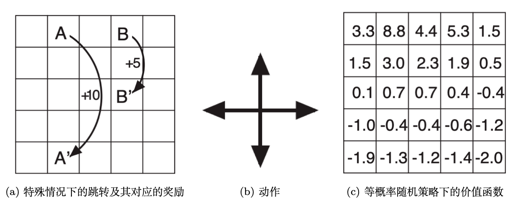

 
图 2.16 网格世界例子：预测

接着是控制问题。在控制问题中，问题背景与预测问题的相同，唯一的区别就是：不再限制策略。也就是动作模式是未知的，我们需要自己确定。 所以我们通过解决控制问题，求得每一个状态的最优的价值函数，如图 2.17b 所示；也得到了最优的策略，如图 2.17c 所示。
 控制问题要做的就是，给定同样的条件，求出在所有可能的策略下最优的价值函数是什么，最优策略是什么。

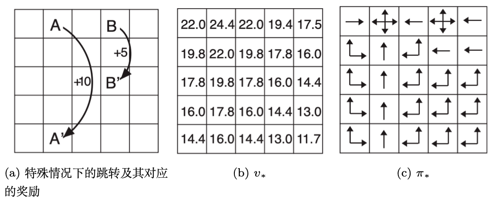

 
图 2.17 网格世界例子：控制

 

### 2.3.8 动态规划

**动态规划（dynamic programming，DP）**适合解决满足**最优子结构（optimal substructure）**和**重叠子问题（overlapping subproblem）**两个性质的问题。最优子结构意味着，问题可以拆分成一个个的小问题，通过解决这些小问题，我们能够组合小问题的答案，得到原问题的答案，即最优的解。重叠子问题意味着，子问题出现多次，并且子问题的解决方案能够被重复使用，我们可以保存子问题的首次计算结果，在再次需要时直接使用。

马尔可夫决策过程是满足动态规划的要求的，在贝尔曼方程里面，我们可以把它分解成递归的结构。当我们把它分解成递归的结构的时候，如果子问题的子状态能得到一个值，那么它的未来状态因为与子状态是直接相关的，我们也可以将之推算出来。价值函数可以存储并重用子问题的最佳的解。动态规划应用于马尔可夫决策过程的规划问题而不是学习问题，我们必须对环境是完全已知的，才能做动态规划，也就是要知道状态转移概率和对应的奖励。使用动态规划完成预测问题和控制问题的求解，是解决马尔可夫决策过程预测问题和控制问题的非常有效的方式。

### 2.3.9 马尔可夫决策过程中的策略评估 

策略评估就是给定马尔可夫决策过程和策略，评估我们可以获得多少价值，即对于当前策略，我们可以得到多大的价值。我们可以直接把**贝尔曼期望备份（Bellman expectation backup）** ，变成迭代的过程，反复迭代直到收敛。这个迭代过程可以看作**同步备份（synchronous backup）** 的过程。

>同步备份是指每一次的迭代都会完全更新所有的状态，这对于程序资源的需求特别大。异步备份（asynchronous backup）的思想就是通过某种方式，使得每一次迭代不需要更新所有的状态，因为事实上，很多状态也不需要被更新。

 式(2.18)是指我们可以把贝尔曼期望备份转换成动态规划的迭代。 当我们得到上一时刻的 $V_t$ 的时候，就可以通过递推的关系推出下一时刻的值。 反复迭代，最后$V$的值就是从 $V_1$、$V_2$ 到最后收敛之后的值 $V_{\pi}$。$V_{\pi}$ 就是当前给定的策略 $\pi$ 对应的价值函数。

$$
  V^{t+1}(s)=\sum_{a \in A} \pi(a \mid s)\left(R(s, a)+\gamma \sum_{s^{\prime} \in S} p\left(s^{\prime} \mid s, a\right) V^{t}\left(s^{\prime}\right)\right) \tag{2.18} 
$$

策略评估的核心思想就是把如式(2.18)所示的贝尔曼期望备份反复迭代，然后得到一个收敛的价值函数的值。因为已经给定了策略函数，所以我们可以直接把它简化成一个马尔可夫奖励过程的表达形式，相当于把 $a$ 去掉，即
$$
  V_{t+1}(s)=r_{\pi}(s)+\gamma P_{\pi}\left(s^{\prime} \mid s\right) V_{t}\left(s^{\prime}\right) \tag{2.19}
$$
这样迭代的式子中就只有价值函数与状态转移函数了。通过迭代式(2.19)，我们也可以得到每个状态的价值。因为不管是在马尔可夫奖励过程，还是在马尔可夫决策过程中，价值函数$V$包含的变量都是只与状态有关，其表示智能体进入某一个状态，未来可能得到多大的价值。比如现在的环境是一个小网格世界（small gridworld），智能体的目的是从某一个状态开始行走，然后到达终止状态，它的终止状态就是左上角与右下角（如图 2.18（右）所示的阴影方块）。小网格世界总共有 14 个非终止状态：$1,\cdots,14$。我们把它的每个位置用一个状态来表示。如图 2.18（左）所示，在小网格世界中，智能体的策略函数直接给定了，它在每一个状态都是随机行走，即在每一个状态都是上、下、左、右行走，采取均匀的随机策略（uniform random policy），$\pi(\mathrm{l} \mid .)=\pi(\mathrm{r} \mid .)=\pi(\mathrm{u} \mid .)=\pi(\mathrm{d} \mid .)=0.25$。 它在边界状态的时候，比如在第4号状态的时候往左走，依然留在第4号状态。我们对其加了限制，这个限制就是出边界的动作不会改变状态，相应概率设置为1，如 $p(7\mid7,\mathrm{r})=1$。 
我们给出的奖励函数就是智能体每走一步，就会得到 $-$1 的奖励，也就是到达终止状态之前每走一步获得的奖励都是 $-$1，所以智能体需要尽快地到达终止状态。

给定动作之后状态之间的转移（transition）是确定的，例如$p(2 \mid 6$,u$)=1$，即从第6号状态往上走，它就会直接到达第2号状态。很多时候有些环境是概率性的（probabilistic），比如智能体在第6号状态，它选择往上走的时候，地板可能是滑的，然后它可能滑到第3号状态或者第1号状态，这就是有概率的转移。但我们把环境进行了简化，从6号状态往上走，它就到了第2号状态。因为我们已经知道环境中的每一个概率以及概率转移，所以就可以直接使用式(2.19)进行迭代，这样就会算出每一个状态的价值。

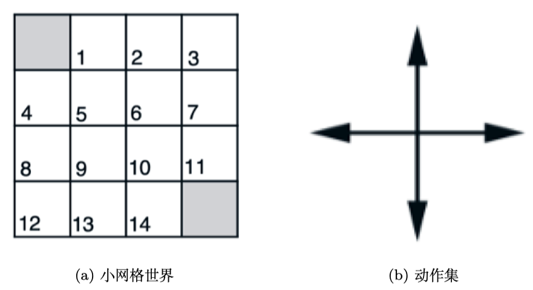

 
图 2.18 小网格世界环境

我们再来看一个动态的例子，推荐[斯坦福大学的一个网页](https://cs.stanford.edu/people/karpathy/reinforcejs/gridworld_dp.html)，这个网页模拟了式(2.18)所示的单步更新的过程中，所有格子的状态价值的变化过程。

如图 2.19a 所示，网格世界里面有很多格子，每个格子都代表一个状态。每个格子里面有一个初始值0。每个格子里还有一个箭头，这个箭头是指智能体在当前状态应该采取什么策略。我们这里采取随机的策略，不管智能体在哪一个状态，它往上、下、左、右的概率都是相同的。比如在某个状态，智能体都有上、下、左、右各 0.25 的概率采取某一个动作，所以它的动作是完全随机的。在这样的环境里面，我们想计算每一个状态的价值。我们也定义了奖励函数，我们可以看到有些格子里面有一个 $R$ 的值，比如有些值是负的。我们可以看到有几个格子里面是 $-$1 的奖励，只有一个 +1 奖励的格子。在网格世界的中间位置，我们可以看到有一个 $R$ 的值是 1。所以每个状态对应一个值，有一些状态没有任何值，它的奖励就为0。

如图 2.19b 所示，我们开始策略评估，策略评估是一个不停迭代的过程。当我们初始化的时候，所有的 $V(s)$ 都是 0。我们现在迭代一次，迭代一次之后，有些状态的值已经产生了变化。比如有些状态的 $R$ 值为 $-$1，迭代一次之后，它就会得到 $-$1 的奖励。对于中间绿色的格子，因为它的奖励为正，所以它是值为 +1 的状态。当迭代第1次的时候，某些状态已经有些值的变化。

 
图 2.19 网格世界：动态规划示例

如图 2.20a 所示，我们再迭代一次，之前有值的状态的周围状态也开始有值。因为周围状态与之前有值的状态是临近的，所以这就相当于把周围的状态转移过来。如图 2.20b 所示，我们逐步迭代，值是一直在变换的。

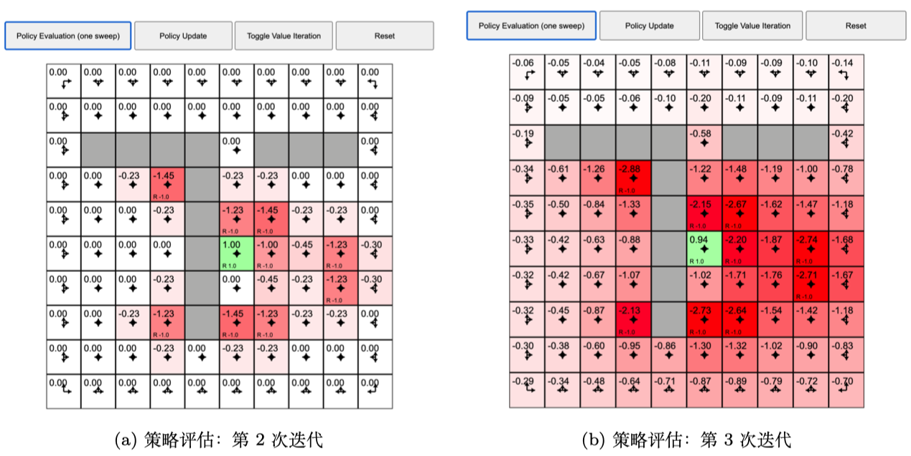

 
图 2.20 网格世界：策略评估过程示例

当我们迭代了很多次之后，有些很远的状态的价值函数已经有值了，而且整个过程是一个呈逐渐扩散的过程，这其实也是策略评估的可视化。当我们每一步进行迭代的时候，远的状态就会得到一些值，值从已经有奖励的状态逐渐扩散。当我们执行很多次迭代之后，各个状态的值会逐渐稳定下来，最后值就会确定不变。收敛之后，每个状态的值就是它的状态价值。

### 2.3.10 马尔可夫决策过程控制 

策略评估是指给定马尔可夫决策过程和策略，我们可以估算出价值函数的值。如果我们只有马尔可夫决策过程，那么应该如何寻找最佳的策略，从而得到**最佳价值函数（optimal value function）**呢？

最佳价值函数的定义为
$$
V^{*}(s)=\max _{\pi} V_{\pi}(s)
$$
最佳价值函数是指，我们搜索一种策略$\pi$ 让每个状态的价值最大。$V^*$ 就是到达每一个状态，它的值的最大化情况。
在这种最大化情况中，我们得到的策略就是最佳策略，即
$$
\pi^{*}(s)=\underset{\pi}{\arg \max }~ V_{\pi}(s)
$$
最佳策略使得每个状态的价值函数都取得最大值。所以如果我们可以得到一个最佳价值函数，就可以认为某个马尔可夫决策过程的环境可解。在这种情况下，最佳价值函数是一致的，环境中可达到的上限的值是一致的，但这里可能有多个最佳策略，多个最佳策略可以取得相同的最佳价值。

当取得最佳价值函数后，我们可以通过对 Q 函数进行最大化来得到最佳策略：
$$
  \pi^{*}(a \mid s)=\left\{\begin{array}{ll}
  1, &  a=\underset{a \in A}{\arg \max} Q^{*}(s, a) \\
  0, & \text {其他 }
  \end{array}\right.
$$

当Q函数收敛后，因为 Q 函数是关于状态与动作的函数，所以如果在某个状态采取某个动作，可以使得 Q 函数最大化，那么这个动作就是最佳的动作。如果我们能优化出一个 Q 函数 $Q^{*}(s, a)$，就可以直接在 Q 函数中取一个让 Q 函数值最大化的动作的值，就可以提取出最佳策略。

Q: 怎样进行策略搜索？

A: 最简单的策略搜索方法就是**穷举**。假设状态和动作都是有限的，那么每个状态我们可以采取 $A$ 种动作的策略，总共就是 $|A|^{|S|}$ 个可能的策略。我们可以把策略穷举一遍，算出每种策略的价值函数，对比一下就可以得到最佳策略。

但是穷举非常没有效率，所以我们要采取其他方法。搜索最佳策略有两种常用的方法：策略迭代和价值迭代。

寻找最佳策略的过程就是马尔可夫决策过程的控制过程。马尔可夫决策过程控制就是去寻找一个最佳策略使我们得到一个最大的价值函数值，即

$$
  \pi^{*}(s)=\underset{\pi}{\arg \max } ~ V_{\pi}(s)
$$

对于一个事先定好的马尔可夫决策过程，当智能体采取最佳策略的时候，最佳策略一般都是确定的，而且是稳定的（它不会随着时间的变化而变化）。但最佳策略不一定是唯一的，多种动作可能会取得相同的价值。

我们可以通过策略迭代和价值迭代来解决马尔可夫决策过程的控制问题。

### 2.3.11 策略迭代 

策略迭代由两个步骤组成：策略评估和策略改进（policy improvement）。如图 2.21a 所示，第一个步骤是策略评估，当前我们在优化策略 $\pi$，在优化过程中得到一个最新的策略。我们先保证这个策略不变，然后估计它的价值，即给定当前的策略函数来估计状态价值函数。
第二个步骤是策略改进，得到 状态价值函数后，我们可以进一步推算出它的 Q 函数。得到 Q 函数后，我们直接对 Q 函数进行最大化，通过在 Q 函数做一个贪心的搜索来进一步改进策略。这两个步骤一直在迭代进行。所以如图 2.21b 所示，在策略迭代里面，在初始化的时候，我们有一个初始化的状态价值函数 $V$ 和 策略$\pi$ ，然后在这两个步骤之间迭代。图 2.21b 上面的线就是我们当前状态价值函数的值，下面的线是策略的值。
策略迭代的过程与踢皮球一样。我们先给定当前已有的策略函数，计算它的状态价值函数。算出状态价值函数后，我们会得到一个 Q 函数。我们对Q 函数采取贪心的策略，这样就像踢皮球，“踢”回策略。然后进一步改进策略，得到一个改进的策略后，它还不是最佳的策略，我们再进行策略评估，又会得到一个新的价值函数。基于这个新的价值函数再进行 Q 函数的最大化，这样逐渐迭代，状态价值函数和策略就会收敛。

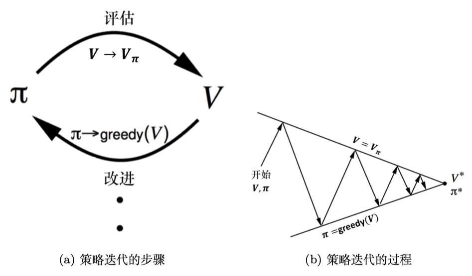

 
图 2.21 策略迭代

这里再来看一下第二个步骤————策略改进，看我们是如何改进策略的。得到状态价值函数后，我们就可以通过奖励函数以及状态转移函数来计算 Q 函数：
$$
  Q_{\pi_{i}}(s, a)=R(s, a)+\gamma \sum_{s^{\prime} \in S} p\left(s^{\prime} \mid s, a\right) V_{\pi_{i}}\left(s^{\prime}\right)
$$

对于每个状态，策略改进会得到它的新一轮的策略，对于每个状态，我们取使它得到最大值的动作，即
$$
  \pi_{i+1}(s)=\underset{a}{\arg \max } ~Q_{\pi_{i}}(s, a)
$$

如图 2.22 所示，我们可以把 Q 函数看成一个 **Q表格（Q-table）**：横轴是它的所有状态，纵轴是它的可能的动作。如果我们得到了 Q 函数，Q表格也就得到了。对于某个状态，每一列里面我们会取最大的值，最大值对应的动作就是它现在应该采取的动作。所以 arg max 操作是指在每个状态里面采取一个动作，这个动作是能使这一列的 Q 函数值最大化的动作。

 

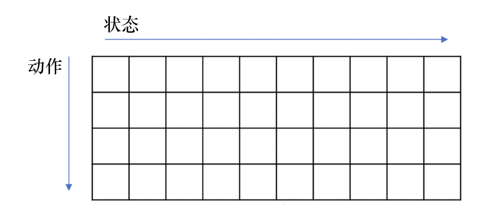

 
图 2.22 Q表格

**贝尔曼最优方程**

当我们一直采取 arg max 操作的时候，我们会得到一个单调的递增。通过采取这种贪心操作（arg max 操作），我们就会得到更好的或者不变的策略，而不会使价值函数变差。所以当改进停止后，我们就会得到一个最佳策略。当改进停止后，我们取让 Q 函数值最大化的动作，Q 函数就会直接变成价值函数，即
$$
  Q_{\pi}\left(s, \pi^{\prime}(s)\right)=\max _{a \in A} Q_{\pi}(s, a)=Q_{\pi}(s, \pi(s))=V_{\pi}(s)
$$

我们也就可以得到**贝尔曼最优方程（Bellman optimality equation）**
$$
  V_{\pi}(s)=\max _{a \in A} Q_{\pi}(s, a)
$$
贝尔曼最优方程表明：最佳策略下的一个状态的价值必须等于在这个状态下采取最好动作得到的回报的期望。 当马尔可夫决策过程满足贝尔曼最优方程的时候，整个马尔可夫决策过程已经达到最佳的状态。

只有当整个状态已经收敛后，我们得到最佳价值函数后，贝尔曼最优方程才会满足。满足贝尔曼最优方程后，我们可以采用最大化操作，即

$$
  V^{*}(s)=\max _{a} Q^{*}(s, a) \tag{2.20}
$$
当我们取让 Q 函数值最大化的动作对应的值就是当前状态的最佳的价值函数的值。另外，我们给出 Q 函数的贝尔曼方程

$$
  Q^{*}(s, a)=R(s, a)+\gamma \sum_{s^{\prime} \in S} p\left(s^{\prime} \mid s, a\right) V^{*}\left(s^{\prime}\right) \tag{2.21}
$$

我们把式(2.20)代入式(2.21)可得

$$
  \begin{aligned}
    Q^{*}(s, a)&=R(s, a)+\gamma \sum_{s^{\prime} \in S} p\left(s^{\prime} \mid s, a\right) V^{*}\left(s^{\prime}\right) \\
    &=R(s,a)+\gamma \sum_{s^{\prime} \in S} p\left(s^{\prime} \mid s, a\right) \max _{a} Q^{*}(s', a')
    \end{aligned}
$$

我们就可以得到 Q 函数之间的转移。Q学习是基于贝尔曼最优方程来进行的，当取Q函数值最大的状态（ $\underset{a'}{\max} Q^{*}\left(s^{\prime}, a^{\prime}\right)$ ）的时候可得

$$
  Q^{*}(s, a)=R(s, a)+\gamma \sum_{s^{\prime} \in S} p\left(s^{\prime} \mid s, a\right) \max _{a^{\prime}} Q^{*}\left(s^{\prime}, a^{\prime}\right)
$$
我们会在第三章介绍Q学习的具体内容。我们还可以把式(2.21)代入式(2.20)可得

$$
  \begin{aligned}
    V^{*}(s)&=\max _{a} Q^{*}(s, a) \\
    &=\max_{a} \mathbb{E}[G_t|s_t=s,a_t=a]\\  
    &=\max_{a}\mathbb{E}[r_{t+1}+\gamma G_{t+1}|s_t=s,a_t=a]\\
    &=\max_{a}\mathbb{E}[r_{t+1}+\gamma V^*(s_{t+1})|s_t=s,a_t=a]\\
    &=\max_{a}\mathbb{E}[r_{t+1}]+ \max_a \mathbb{E}[\gamma V^*(s_{t+1})|s_t=s,a_t=a]\\
    &=\max_{a} R(s,a) + \max_a\gamma \sum_{s^{\prime} \in S} p\left(s^{\prime} \mid s, a\right) V^{*}\left(s^{\prime}\right)\\
    &=\max_{a} \left(R(s,a) + \gamma \sum_{s^{\prime} \in S} p\left(s^{\prime} \mid s, a\right) V^{*}\left(s^{\prime}\right)\right)
    \end{aligned}
$$

我们就可以得到状态价值函数的转移。

### 2.3.12 价值迭代 

**1.最优性原理**

我们从另一个角度思考问题，动态规划的方法将优化问题分成两个部分。第一步执行的是最优的动作。之后后继的状态的每一步都按照最优的策略去做，最后的结果就是最优的。

**最优性原理定理（principle of optimality theorem）**：
一个策略$\pi(a|s)$ 在状态 $s$ 达到了最优价值，也就是 $V_{\pi}(s) = V^{*}(s)$ 成立，当且仅当对于任何能够从 $s$ 到达的 $s'$，都已经达到了最优价值。也就是对于所有的 $s'$，$V_{\pi}(s') = V^{*}(s')$ 恒成立。

**2.确认性价值迭代**

如果我们知道子问题 $V^{*}(s')$ 的最优解，就可以通过价值迭代来得到最优的 $V^{*}(s)$ 的解。价值迭代就是把贝尔曼最优方程当成一个更新规则来进行，即
$$
  V(s) \leftarrow \max _{a \in A}\left(R(s, a)+\gamma \sum_{s^{\prime} \in S} p\left(s^{\prime} \mid s, a\right) V\left(s^{\prime}\right)\right) \tag{2.22}
$$

只有当整个马尔可夫决策过程已经达到最佳的状态时，式(2.22)才满足。但我们可以把它转换成一个备份的等式。备份的等式就是一个迭代的等式。我们不停地迭代贝尔曼最优方程，价值函数就能逐渐趋向于最佳的价值函数，这是价值迭代算法的精髓。

为了得到最佳的 $V^*$ ，对于每个状态的 $V$，我们直接通过贝尔曼最优方程进行迭代，迭代多次之后，价值函数就会收敛。这种价值迭代算法也被称为确认性价值迭代（deterministic value iteration）。

**3.价值迭代算法**

价值迭代算法的过程如下。

（1）初始化：令 $k=1$，对于所有状态 $s$，$V_0(s)=0$。

（2）对于 $k=1:H$（$H$是让$V(s)$收敛所需的迭代次数）

&ensp;&ensp;&ensp;&ensp;（a）对于所有状态 $s$
$$
Q_{k+1}(s, a)=R(s, a)+\gamma \sum_{s^{\prime} \in S} p\left(s^{\prime} \mid s, a\right) V_{k}\left(s^{\prime}\right) \tag{2.23}
$$

$$
V_{k+1}(s)=\max _{a} Q_{k+1}(s, a) \tag{2.24}
$$

&ensp;&ensp;&ensp;&ensp;（b）$k \leftarrow k+1$。

（3）在迭代后提取最优策略：
$$
\pi(s)=\underset{a}{\arg \max } \left[R(s, a)+\gamma \sum_{s^{\prime} \in S} p\left(s^{\prime} \mid s, a\right) V_{H+1}\left(s^{\prime}\right)\right]  
$$

 我们使用价值迭代算法是为了得到最佳的策略 $\pi$。我们可以使用式(2.22)进行迭代，迭代多次且收敛后得到的值就是最佳的价值。

 价值迭代算法开始的时候，把所有值初始化，接着对每个状态进行迭代。 我们把式(2.23)代入式(2.24)，就可以得到式(2.22)。因此，我们有了式(2.23)和式(2.24)后，就不停地迭代，迭代多次后价值函数就会收敛，收敛后就会得到 $V^*$ 。我们有了 $V^*$ 后，一个问题是如何进一步推算出它的最佳策略。我们可以直接用 arg max 操作来提取最佳策略。我们先重构 Q 函数，重构后，每一列对应的Q值最大的动作就是最佳策略。这样我们就可以从最佳价值函数里面提取出最佳策略。 我们只是在解决一个规划的问题，而不是强化学习的问题，因为我们知道环境如何变化。

价值迭代做的工作类似于价值的反向传播，每次迭代做一步传播，所以中间过程的策略和价值函数 是没有意义的。而策略迭代的每一次迭代的结果都是有意义的，都是一个完整的策略。图 2.23 所示为一个可视化的求最短路径的过程，在一个网格世界中，我们设定了一个终点，也就是左上角的点。不管我们在哪一个位置开始，我们都希望能够到达终点（实际上这个终点在迭代过程中是不必要的，只是为了更好地演示）。价值迭代的迭代过程像是一个从某一个状态（这里是我们的终点）反向传播到其他各个状态的过程，因为每次迭代只能影响到与之直接相关的状态。
 让我们回忆一下最优性原理定理：如果我们某次迭代求解的某个状态 $s$ 的价值函数 $V_{k+1}(s)$ 是最优解，它的前提是能够从该状态到达的所有状态 $s^{\prime}$ 都已经得到了最优解；如果不是，它所做的只是一个类似传递价值函数的过程。

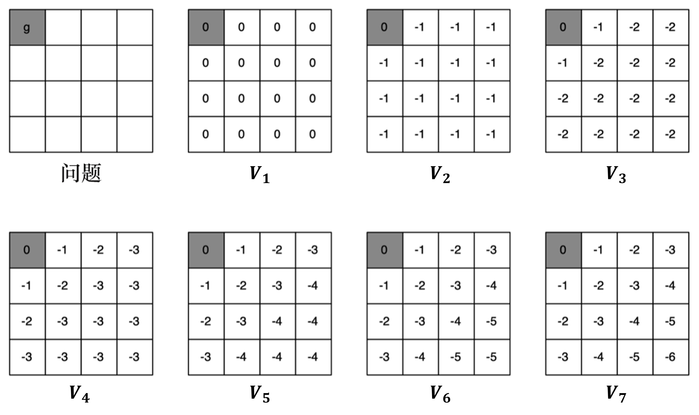

图 2.23 例子：最短路径

如图 2.23 所示，实际上，对于每一个状态，我们都可以将其看成一个终点。迭代由每一个终点开始，我们每次都根据贝尔曼最优方程重新计算价值。如果它的相邻节点价值发生了变化，变得更好了，那么它的价值也会变得更好，一直到相邻节点都不变。因此，在我们迭代到 $V_7$ 之前，也就是还没将每个终点的最优的价值传递给其他的所有状态之前，中间的几个价值只是一种暂存的不完整的数据，它不能代表每一个状态的价值，所以生成的策略是没有意义的策略。价值迭代是一个迭代过程，图 2.23 可视化了从  $V_1$ 到 $V_7$  每一个状态的价值的变化。而且因为智能体每走一步就会得到一个负的价值，所以它需要尽快地到达终点，可以发现离它越远的状态，价值就越小。$V_7$ 收敛过后，右下角的价值是 $-$6，相当于它要走6步，才能到达终点。智能体离终点越近，价值越大。当我们得到最优价值后，我们就可以通过策略提取来得到最佳策略。

### 2.3.13 策略迭代与价值迭代的区别 
我们来看一个马尔可夫决策过程控制的动态演示，图 2.24  所示为网格世界的初始化界面。

图 2.24 网格世界：初始化界面

首先我们来看看策略迭代，之前的例子在每个状态都采取固定的随机策略，每个状态都以 0.25 的概率往上、下、左、右，没有策略的改变。但是我们现在想进行策略迭代，每个状态的策略都进行改变。如图 2.25a 所示，我们先执行一次策略评估，得到价值函数，每个状态都有一个价值函数。如图 2.25b 所示，我们接着进行策略改进，单击“策略更新（policy update）”，这时有些格子里面的策略已经产生变化。比如对于中间 $-$1 的这个状态，它的最佳策略是往下走。当我们到达 $-$1 状态后，我们应该往下走，这样就会得到最佳的价值。绿色右边的格子的策略也改变了，它现在选取的最佳策略是往左走，也就是在这个状态的时候，最佳策略应该是往左走。

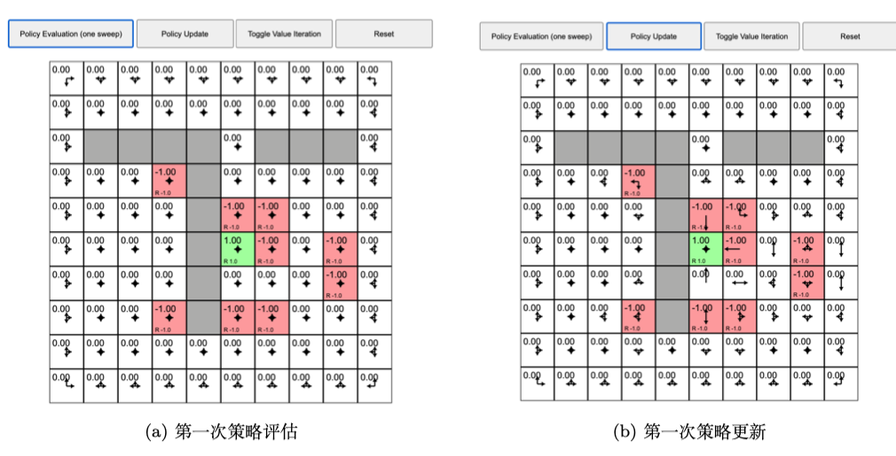

 
图 2.25 马尔可夫决策过程控制：策略迭代示例

如图 2.27a 所示，我们再执行下一轮的策略评估，格子里面的值又被改变了。多次之后，格子里面的值会收敛。如图 2.27b 所示，我们再次执行策略更新，每个状态里面的值基本都改变了，它们不再上、下、左、右随机改变，而是会选取最佳的策略进行改变。

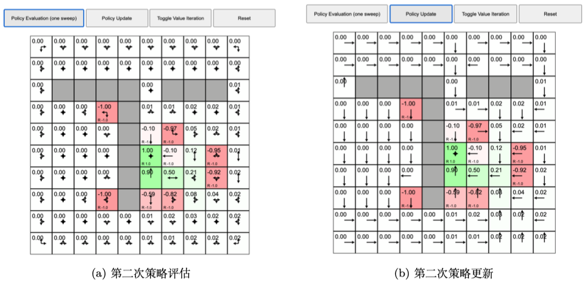

图 2.26 马尔可夫决策过程控制：策略迭代示例

如图 2.27a 所示，我们再次执行策略评估，格子的值又在不停地变化，变化之后又收敛了。如图 2.27b 所示，我们再执行一次策略更新。现在格子的值又会有变化，每一个状态中格子的最佳策略也会产生一些改变。如图 2.28a 所示，我们再执行一遍策略更新，格子的值没有发生变化，这说明整个马尔可夫决策过程已经收敛了。所以现在每个状态的值就是当前最佳的价值函数的值，当前状态对应的策略就是最佳的策略。

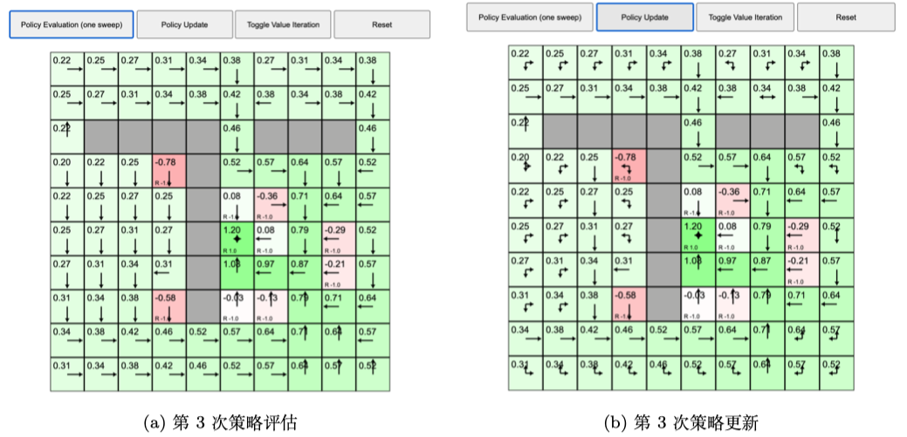

 
图 2.27 马尔可夫决策过程控制：策略迭代示例

通过上面的例子，我们知道策略迭代可以把网格世界“解决掉”。“解决掉”是指，不管在哪个状态，我们都可以利用状态对应的最佳的策略到达可以获得最多奖励的状态。

如图 2.28b 所示，我们再用价值迭代来解马尔可夫决策过程，单击“切换成价值迭代”。 当格子的值确定后，就会产生它的最佳状态，最佳状态提取的策略与策略迭代得出的最佳策略是一致的。在每个状态，我们使用最佳策略，就可以到达得到最多奖励的状态。

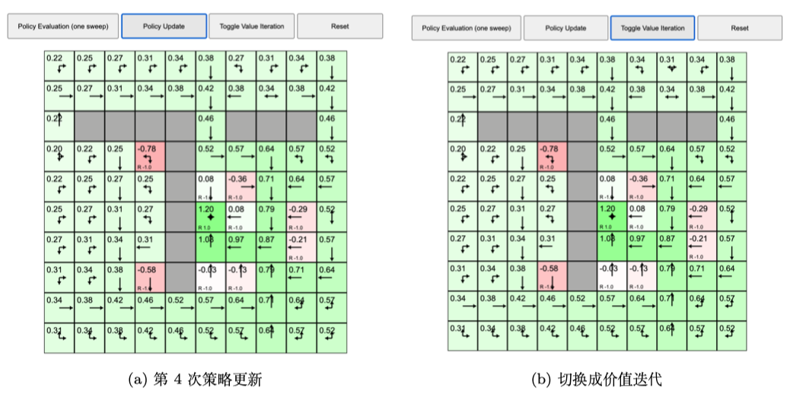

图 2.28 马尔可夫决策过程控制：策略迭代示例

我们再来对比策略迭代和价值迭代，这两个算法都可以解马尔可夫决策过程的控制问题。策略迭代分两步。首先进行策略评估，即对当前已经搜索到的策略函数进行估值。得到估值后，我们进行策略改进，即把 Q 函数算出来，进行进一步改进。不断重复这两步，直到策略收敛。价值迭代直接使用贝尔曼最优方程进行迭代，从而寻找最佳的价值函数。找到最佳价值函数后，我们再提取最佳策略。

### 2.3.14 马尔可夫决策过程中的预测和控制总结 
总结如表 2.1 所示，我们使用动态规划算法来解马尔可夫决策过程里面的预测和控制，并且采取不同的贝尔曼方程。对于预测问题，即策略评估的问题，我们不停地执行贝尔曼期望方程，这样就可以估计出给定的策略，然后得到价值函数。对于控制问题，如果我们采取的算法是策略迭代，使用的就是贝尔曼期望方程；如果我们采取的算法是价值迭代，使用的就是贝尔曼最优方程。

表 2.1 动态规划算法

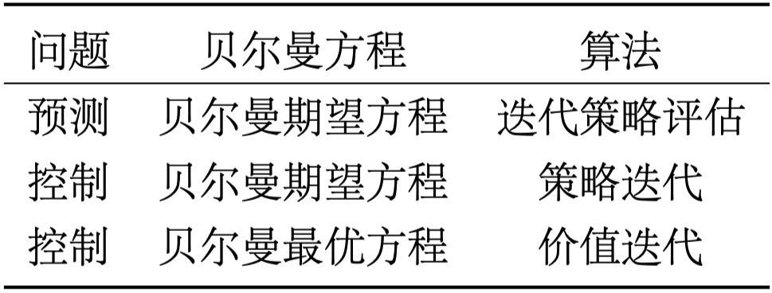

## 参考文献
* [强化学习基础 David Silver 笔记](https://zhuanlan.zhihu.com/c_135909947)
* [Reinforcement Learning: An Introduction (second edition)](https://book.douban.com/subject/30323890/)
* [David Silver 强化学习公开课中文讲解及实践](https://zhuanlan.zhihu.com/reinforce)
* [UCL Course on RL(David Silver)](https://www.davidsilver.uk/teaching/)
* [Derivation of Bellman’s Equation](https://jmichaux.github.io/_notebook/2018-10-14-bellman/)
* [深入浅出强化学习：原理入门](https://book.douban.com/subject/27624485//)

