# MDP

本章给大家介绍马尔可夫决策过程。

* 在介绍马尔可夫决策过程之前，先介绍它的简化版本：马尔可夫链以及马尔可夫奖励过程，通过跟这两种过程的比较，我们可以更容易理解马尔可夫决策过程。
* 第二部分会介绍马尔可夫决策过程中的 `policy evaluation`，就是当给定一个决策过后，怎么去计算它的价值函数。
* 第三部分会介绍马尔可夫决策过程的控制，具体有两种算法：`policy iteration` 和 `value iteration`。

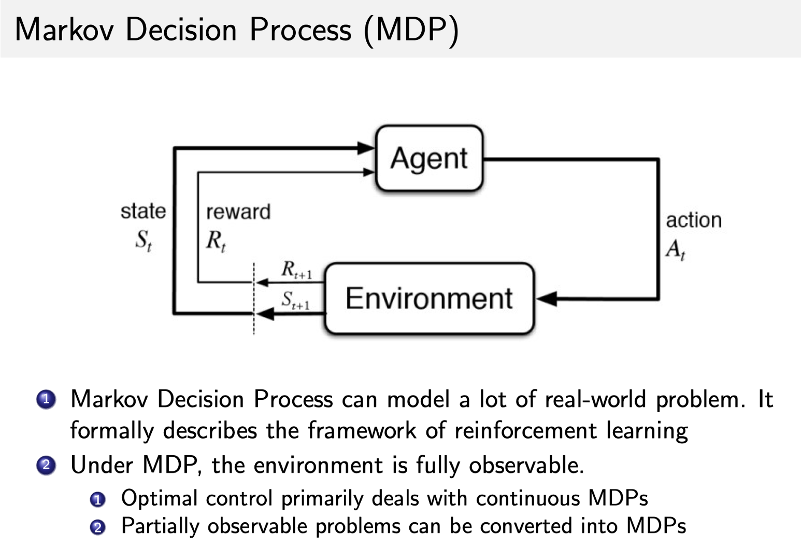

上图介绍了在强化学习里面 agent 跟 environment 之间的交互，agent 在得到环境的状态过后，它会采取动作，它会把这个采取的动作返还给环境。环境在得到 agent 的动作过后，它会进入下一个状态，把下一个状态传回 agent。在强化学习中，agent 跟环境就是这样进行交互的，这个交互过程是可以通过马尔可夫决策过程来表示的，所以马尔可夫决策过程是强化学习里面的一个基本框架。

在马尔可夫决策过程中，它的环境是全部可以观测的(`fully observable`)。但是很多时候环境里面有些量是不可观测的，但是这个部分观测的问题也可以转换成一个 MDP 的问题。

在介绍马尔可夫决策过程(Markov Decision Process，MDP)之前，先给大家梳理一下马尔可夫过程(Markov Process，MP)、马尔可夫奖励过程(Markov Reward Processes，MRP)。这两个过程是马尔可夫决策过程的一个基础。

## Markov Process(MP)

### Markov Property

如果一个状态转移是符合马尔可夫的，那就是说一个状态的下一个状态只取决于它当前状态，而跟它当前状态之前的状态都没有关系。

我们设状态的历史为 $h_{t}=\left\{s_{1}, s_{2}, s_{3}, \ldots, s_{t}\right\}$（$h_t$ 包含了之前的所有状态），如果一个状态转移是符合马尔可夫的，也就是满足如下条件：
$$
p\left(s_{t+1} \mid s_{t}\right) =p\left(s_{t+1} \mid h_{t}\right) \tag{1}
$$

$$
p\left(s_{t+1} \mid s_{t}, a_{t}\right) =p\left(s_{t+1} \mid h_{t}, a_{t}\right) \tag{2}
$$

从当前 $s_t$ 转移到 $s_{t+1}$ 这个状态，它是直接就等于它之前所有的状态转移到 $s_{t+1}$。如果某一个过程满足`马尔可夫性质(Markov Property)`，就是说未来的转移跟过去是独立的，它只取决于现在。**马尔可夫性质是所有马尔可夫过程的基础。**

### Markov Process/Markov Chain

首先看一看`马尔可夫链(Markov Chain)`。举个例子，这个图里面有四个状态，这四个状态从 $s_1,s_2,s_3,s_4$ 之间互相转移。比如说从 $s_1$ 开始，

*  $s_1$ 有 0.1 的概率继续存活在 $s_1$ 状态，
* 有 0.2 的概率转移到 $s_2$， 
* 有 0.7 的概率转移到 $s_4$ 。

如果 $s_4$ 是我们当前状态的话，

* 它有 0.3 的概率转移到 $s_2$ ，
* 有 0.2 的概率转移到 $s_3$ ，
* 有 0.5 的概率留在这里。

我们可以用`状态转移矩阵(State Transition Matrix)` $P$ 来描述状态转移 $p\left(s_{t+1}=s^{\prime} \mid s_{t}=s\right)$，如下式所示。
$$
P=\left[\begin{array}{cccc}
P\left(s_{1} \mid s_{1}\right) & P\left(s_{2} \mid s_{1}\right) & \ldots & P\left(s_{N} \mid s_{1}\right) \\
P\left(s_{1} \mid s_{2}\right) & P\left(s_{2} \mid s_{2}\right) & \ldots & P\left(s_{N} \mid s_{2}\right) \\
\vdots & \vdots & \ddots & \vdots \\
P\left(s_{1} \mid s_{N}\right) & P\left(s_{2} \mid s_{N}\right) & \ldots & P\left(s_{N} \mid s_{N}\right)
\end{array}\right]
$$
状态转移矩阵类似于一个 conditional probability，当我们知道当前我们在 $s_t$ 这个状态过后，到达下面所有状态的一个概念。所以它每一行其实描述了是从一个节点到达所有其它节点的概率。

### Example of MP

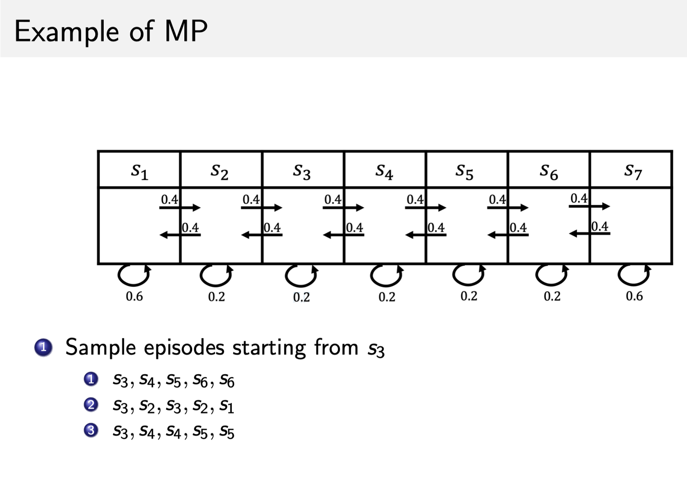

上图是一个马尔可夫链的例子，我们这里有七个状态。比如说从 $s_1$ 开始到 $s_2$ ，它有 0.4 的概率，然后它有 0.6 的概率继续存活在它当前的状态。 $s_2$ 有 0.4 的概率到左边，有 0.4 的概率到 $s_3$ ，另外有 0.2 的概率存活在现在的状态，所以给定了这个状态转移的马尔可夫链后，我们可以对这个链进行采样，这样就会得到一串的轨迹。

下面我们有三个轨迹，都是从同一个起始点开始。假设还是从 $s_3$ 这个状态开始，

* 第一条链先到了 $s_4$， 又到了 $s_5$，又往右到了 $s_6$ ，然后继续存活在 $s_6$ 状态。
* 第二条链从 $s_3$ 开始，先往左走到了 $s_2$ 。然后它又往右走，又回到了$s_3$ ，然后它又往左走，然后再往左走到了 $s_1$ 。
* 通过对这个状态的采样，我们生成了很多这样的轨迹。

## Markov Reward Process(MRP)

**`马尔可夫奖励过程(Markov Reward Process, MRP)` 是马尔可夫链再加上了一个奖励函数。**在 MRP 中，转移矩阵和状态都是跟马尔可夫链一样的，多了一个`奖励函数(reward function)`。**奖励函数 $R$ 是一个期望**，就是说当你到达某一个状态的时候，可以获得多大的奖励，然后这里另外定义了一个 discount factor $\gamma$ 。如果状态数是有限的，$R$ 可以是一个向量。

### Example of MRP

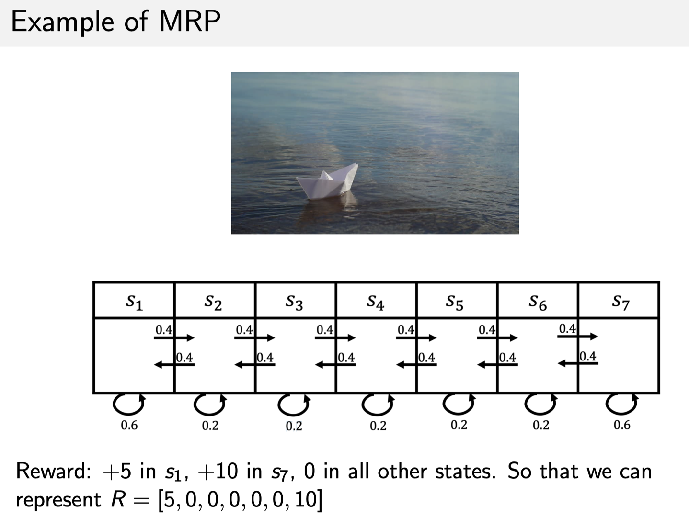

这里是我们刚才看的马尔可夫链，如果把奖励也放上去的话，就是说到达每一个状态，我们都会获得一个奖励。这里我们可以设置对应的奖励，比如说到达 $s_1$ 状态的时候，可以获得 5 的奖励，到达 $s_7$ 的时候，可以得到 10 的奖励，其它状态没有任何奖励。因为这里状态是有限的，所以我们可以用向量 $R=[5,0,0,0,0,0,10]$ 来表示这个奖励函数，这个向量表示了每个点的奖励大小。

我们通过一个形象的例子来理解 MRP。我们把一个纸船放到河流之中，那么它就会随着这个河流而流动，它自身是没有动力的。所以你可以把 MRP 看成是一个随波逐流的例子，当我们从某一个点开始的时候，这个纸船就会随着事先定义好的状态转移进行流动，它到达每个状态过后，我们就有可能获得一些奖励。

### Return and Value function

这里我们进一步定义一些概念。

*  `Horizon` 是指一个回合的长度（每个回合最大的时间步数），它是由有限个步数决定的。

* `Return(回报)` 说的是把奖励进行折扣后所获得的收益。Return 可以定义为奖励的逐步叠加，如下式所示：

$$
G_{t}=R_{t+1}+\gamma R_{t+2}+\gamma^{2} R_{t+3}+\gamma^{3} R_{t+4}+\ldots+\gamma^{T-t-1} R_{T}
$$

这里有一个叠加系数，越往后得到的奖励，折扣得越多。这说明我们其实更希望得到现有的奖励，未来的奖励就要把它打折扣。

* 当我们有了 return 过后，就可以定义一个状态的价值了，就是 `state value function`。对于 MRP，state value function 被定义成是 return 的期望，如下式所示：
  $$
  \begin{aligned}
  V_{t}(s) &=\mathbb{E}\left[G_{t} \mid s_{t}=s\right] \\
  &=\mathbb{E}\left[R_{t+1}+\gamma R_{t+2}+\gamma^{2} R_{t+3}+\ldots+\gamma^{T-t-1} R_{T} \mid s_{t}=s\right]
  \end{aligned}
  $$

$G_t$ 是之前定义的 `discounted return`，我们这里取了一个期望，期望就是说从这个状态开始，你有可能获得多大的价值。所以这个期望也可以看成是对未来可能获得奖励的当前价值的一个表现，就是当你进入某一个状态过后，你现在就有多大的价值。

### Why Discount Factor

**这里解释一下为什么需要 discount factor。**

* 有些马尔可夫过程是带环的，它并没有终结，我们想避免这个无穷的奖励。
* 我们并没有建立一个完美的模拟环境的模型，也就是说，我们对未来的评估不一定是准确的，我们不一定完全信任我们的模型，因为这种不确定性，所以我们对未来的预估增加一个折扣。我们想把这个不确定性表示出来，希望尽可能快地得到奖励，而不是在未来某一个点得到奖励。
* 如果这个奖励是有实际价值的，我们可能是更希望立刻就得到奖励，而不是后面再得到奖励（现在的钱比以后的钱更有价值）。
* 在人的行为里面来说的话，大家也是想得到即时奖励。
* 有些时候可以把这个系数设为 0，$\gamma=0$：我们就只关注了它当前的奖励。我们也可以把它设为 1，$\gamma=1$：对未来并没有折扣，未来获得的奖励跟当前获得的奖励是一样的。

Discount factor 可以作为强化学习 agent 的一个超参数来进行调整，然后就会得到不同行为的 agent。

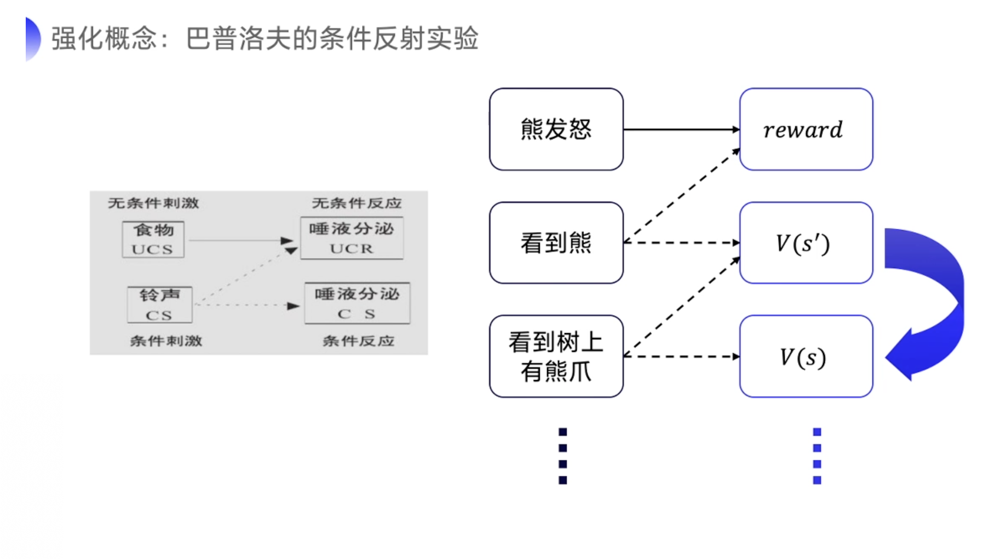

这里我们再来看一看，在这个 MRP 里面，如何计算它的价值。这个 MRP 依旧是这个状态转移。它的奖励函数是定义成这样，它在进入第一个状态的时候会得到 5 的奖励，进入第七个状态的时候会得到 10 的奖励，其它状态都没有奖励。

我们现在可以计算每一个轨迹得到的奖励，比如我们对于这个 $s_4,s_5,s_6,s_7$ 轨迹的奖励进行计算，这里折扣系数是 0.5。

* 在 $s_4$ 的时候，奖励为零。

* 下一个状态 $s_5$ 的时候，因为我们已经到了下一步了，所以我们要把 $s_5$ 进行一个折扣，$s_5$ 本身也是没有奖励的。
* 然后是到 $s_6$，也没有任何奖励，折扣系数应该是 $\frac{1}{4}$ 。
* 到达 $s_7$ 后，我们获得了一个奖励，但是因为 $s_7$ 这个状态是未来才获得的奖励，所以我们要进行三次折扣。

所以对于这个轨迹，它的 return 就是一个 1.25，类似地，我们可以得到其它轨迹的 return 。

这里就引出了一个问题，当我们有了一些轨迹的实际 return，怎么计算它的价值函数。比如说我们想知道 $s_4$ 状态的价值，就是当你进入 $s_4$ 后，它的价值到底如何。一个可行的做法就是说我们可以产生很多轨迹，然后把这里的轨迹都叠加起来。比如我们可以从 $s_4$ 开始，采样生成很多轨迹，都把它的 return 计算出来，然后可以直接把它取一个平均作为你进入 $s_4$ 它的价值。这其实是一种计算价值函数的办法，通过这个蒙特卡罗采样的办法计算 $s_4$ 的状态。接下来会进一步介绍蒙特卡罗算法。

### Bellman Equation

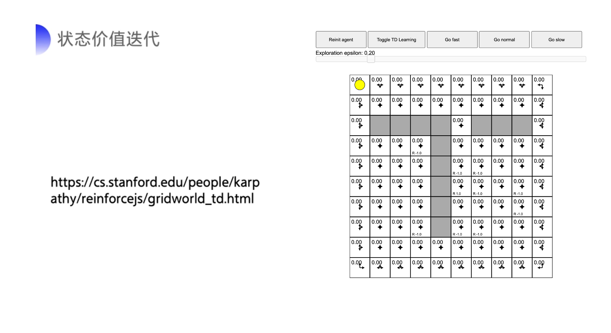

但是这里我们采取了另外一种计算方法，我们从这个价值函数里面推导出 `Bellman Equation（贝尔曼等式）`，如下式所示：
$$
V(s)=\underbrace{R(s)}_{\text {Immediate reward }}+\underbrace{\gamma \sum_{s^{\prime} \in S} P\left(s^{\prime} \mid s\right) V\left(s^{\prime}\right)}_{\text {Discounted sum of future reward }}
$$
其中：

*  $s'$ 可以看成未来的所有状态。
* 转移 $P(s'|s)$  是指从当前状态转移到未来状态的概率。
* $V(s')$ 代表的是未来某一个状态的价值。我们从当前这个位置开始，有一定的概率去到未来的所有状态，所以我们要把这个概率也写上去，这个转移矩阵也写上去，然后我们就得到了未来状态，然后再乘以一个 $\gamma$，这样就可以把未来的奖励打折扣。
* 第二部分可以看成是未来奖励的折扣总和(Discounted sum of future reward)。

**Bellman Equation 定义了当前状态跟未来状态之间的这个关系。**

未来打了折扣的奖励加上当前立刻可以得到的奖励，就组成了这个 Bellman Equation。

#### Law of Total Expectation

在推导 Bellman equation 之前，我们可以仿照`Law of Total Expectation(全期望公式)`的证明过程来证明下面的式子：
$$
\mathbb{E}[V(s_{t+1})|s_t]=\mathbb{E}[\mathbb{E}[G_{t+1}|s_{t+1}]|s_t]=E[G_{t+1}|s_t]
$$

> Law of total expectation 也被称为 law of iterated expectations(LIE)。如果 $A_i$ 是样本空间的有限或可数的划分(partition)，则全期望公式可以写成如下形式：
> $$
> \mathrm{E}(X)=\sum_{i} \mathrm{E}\left(X \mid A_{i}\right) \mathrm{P}\left(A_{i}\right)
> $$

**证明：**

为了记号简洁并且易读，我们丢掉了下标，令 $s=s_t,g'=G_{t+1},s'=s_{t+1}$。我们可以根据条件期望的定义来重写这个回报的期望为：
$$
\begin{aligned}
\mathbb{E}\left[G_{t+1} \mid s_{t+1}\right] &=\mathbb{E}\left[g^{\prime} \mid s^{\prime}\right] \\
&=\sum_{g^{\prime}} g^{\prime}~p\left(g^{\prime} \mid s^{\prime}\right)
\end{aligned}
$$
> 如果 $X$ 和 $Y$ 都是离散型随机变量，则条件期望（Conditional Expectation）$E(X|Y=y)$的定义如下式所示：
> $$
> \mathrm{E}(X \mid Y=y)=\sum_{x} x P(X=x \mid Y=y)
> $$

令 $s_t=s$，我们对 $\mathbb{E}\left[G_{t+1} \mid s_{t+1}\right]$ 求期望可得：
$$
\begin{aligned}
\mathbb{E}\left[\mathbb{E}\left[G_{t+1} \mid s_{t+1}\right] \mid s_{t}\right] 
&=\mathbb{E} \left[\mathbb{E}\left[g^{\prime} \mid s^{\prime}\right] \mid s\right]\\
&=\mathbb{E} \left[\sum_{g^{\prime}} g^{\prime}~p\left(g^{\prime} \mid s^{\prime}\right)\mid s\right]\\
&= \sum_{s^{\prime}}\sum_{g^{\prime}} g^{\prime}~p\left(g^{\prime} \mid s^{\prime},s\right)p(s^{\prime} \mid s)\\
&=\sum_{s^{\prime}} \sum_{g^{\prime}} \frac{g^{\prime} p\left(g^{\prime} \mid s^{\prime}, s\right) p\left(s^{\prime} \mid s\right) p(s)}{p(s)} \\
&=\sum_{s^{\prime}} \sum_{g^{\prime}} \frac{g^{\prime} p\left(g^{\prime} \mid s^{\prime}, s\right) p\left(s^{\prime}, s\right)}{p(s)} \\
&=\sum_{s^{\prime}} \sum_{g^{\prime}} \frac{g^{\prime} p\left(g^{\prime}, s^{\prime}, s\right)}{p(s)} \\
&=\sum_{s^{\prime}} \sum_{g^{\prime}} g^{\prime} p\left(g^{\prime}, s^{\prime} \mid s\right) \\
&=\sum_{g^{\prime}} \sum_{s^{\prime}} g^{\prime} p\left(g^{\prime}, s^{\prime} \mid s\right) \\
&=\sum_{g^{\prime}} g^{\prime} p\left(g^{\prime} \mid s\right) \\
&=\mathbb{E}\left[g^{\prime} \mid s\right]=\mathbb{E}\left[G_{t+1} \mid s_{t}\right]
\end{aligned}
$$

#### Bellman Equation Derivation

Bellman equation 的推导过程如下：
$$
\begin{aligned}
V(s)&=\mathbb{E}\left[G_{t} \mid s_{t}=s\right]\\
&=\mathbb{E}\left[R_{t+1}+\gamma R_{t+2}+\gamma^{2} R_{t+3}+\ldots \mid s_{t}=s\right]  \\
&=\mathbb{E}\left[R_{t+1}|s_t=s\right] +\gamma \mathbb{E}\left[R_{t+2}+\gamma R_{t+3}+\gamma^{2} R_{t+4}+\ldots \mid s_{t}=s\right]\\
&=R(s)+\gamma \mathbb{E}[G_{t+1}|s_t=s] \\
&=R(s)+\gamma \mathbb{E}[V(s_{t+1})|s_t=s]\\
&=R(s)+\gamma \sum_{s^{\prime} \in S} P\left(s^{\prime} \mid s\right) V\left(s^{\prime}\right)
\end{aligned}
$$

>Bellman Equation 就是当前状态与未来状态的迭代关系，表示当前状态的值函数可以通过下个状态的值函数来计算。Bellman Equation 因其提出者、动态规划创始人 Richard Bellman 而得名 ，也叫作“动态规划方程”。

**Bellman Equation 定义了状态之间的迭代关系，如下式所示。**
$$
V(s)=R(s)+\gamma \sum_{s^{\prime} \in S} P\left(s^{\prime} \mid s\right) V\left(s^{\prime}\right)
$$
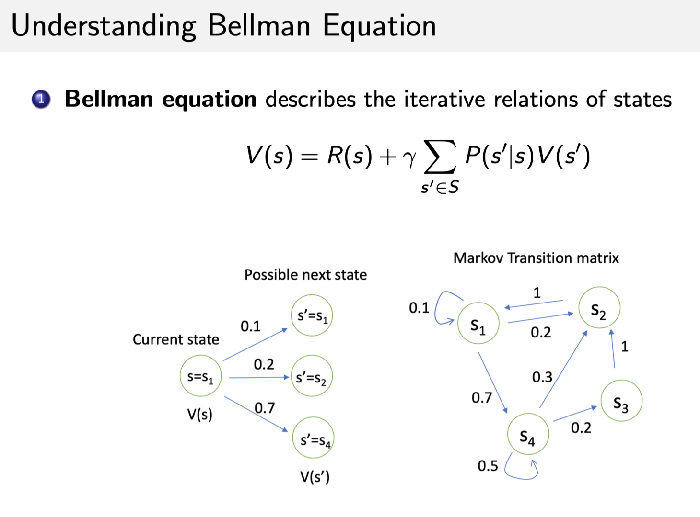

假设有一个马尔可夫转移矩阵是右边这个样子，Bellman Equation 描述的就是当前状态到未来状态的一个转移。假设我们当前是在 $s_1$， 那么它只可能去到三个未来的状态：有 0.1 的概率留在它当前这个位置，有 0.2 的概率去到 $s_2$ 状态，有 0.7 的概率去到 $s_4$ 的状态，所以我们要把这个转移乘以它未来的状态的价值，再加上它的 immediate reward 就会得到它当前状态的价值。**所以 Bellman Equation 定义的就是当前状态跟未来状态的一个迭代的关系。**

我们可以把 Bellman Equation 写成一种矩阵的形式，如下式所示。
$$
\left[\begin{array}{c}
V\left(s_{1}\right) \\
V\left(s_{2}\right) \\
\vdots \\
V\left(s_{N}\right)
\end{array}\right]=\left[\begin{array}{c}
R\left(s_{1}\right) \\
R\left(s_{2}\right) \\
\vdots \\
R\left(s_{N}\right)
\end{array}\right]+\gamma\left[\begin{array}{cccc}
P\left(s_{1} \mid s_{1}\right) & P\left(s_{2} \mid s_{1}\right) & \ldots & P\left(s_{N} \mid s_{1}\right) \\
P\left(s_{1} \mid s_{2}\right) & P\left(s_{2} \mid s_{2}\right) & \ldots & P\left(s_{N} \mid s_{2}\right) \\
\vdots & \vdots & \ddots & \vdots \\
P\left(s_{1} \mid s_{N}\right) & P\left(s_{2} \mid s_{N}\right) & \ldots & P\left(s_{N} \mid s_{N}\right)
\end{array}\right]\left[\begin{array}{c}
V\left(s_{1}\right) \\
V\left(s_{2}\right) \\
\vdots \\
V\left(s_{N}\right)
\end{array}\right]
$$
首先有这个转移矩阵。我们当前这个状态是一个向量  $[V(s_1),V(s_2),\cdots,V(s_N)]^T$。我们可以写成迭代的形式。我们每一行来看的话，$V$ 这个向量乘以了转移矩阵里面的某一行，再加上它当前可以得到的 reward，就会得到它当前的价值。

当我们把 Bellman Equation 写成矩阵形式后，可以直接求解：
$$
\begin{aligned}
V &= R+ \gamma PV \\
IV &= R+ \gamma PV \\
(I-\gamma P)V &=R \\
V&=(I-\gamma P)^{-1}R
\end{aligned}
$$

我们可以直接得到一个`解析解(analytic solution)`:
$$
V=(I-\gamma P)^{-1} R
$$
我们可以通过矩阵求逆把这个 V 的这个价值直接求出来。但是一个问题是这个矩阵求逆的过程的复杂度是 $O(N^3)$。所以当状态非常多的时候，比如说从十个状态到一千个状态，到一百万个状态。那么当我们有一百万个状态的时候，这个转移矩阵就会是个一百万乘以一百万的矩阵，这样一个大矩阵的话求逆是非常困难的，**所以这种通过解析解去求解的方法只适用于很小量的 MRP。**

### Iterative Algorithm for Computing Value of a MRP

接下来我们来求解这个价值函数。**我们可以通过迭代的方法来解这种状态非常多的 MRP(large MRPs)，**比如说：

* 动态规划的方法，
* 蒙特卡罗的办法(通过采样的办法去计算它)，
* 时序差分学习(Temporal-Difference Learning)的办法。 `Temporal-Difference Learning` 叫 `TD Leanring`，它是动态规划和蒙特卡罗的一个结合。

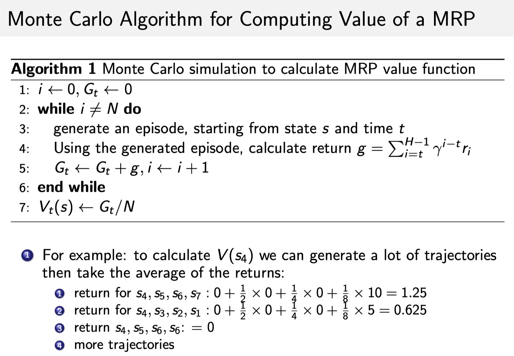

**首先我们用蒙特卡罗(Monte Carlo)的办法来计算它的价值函数。**蒙特卡罗就是说当得到一个 MRP 过后，我们可以从某一个状态开始，把这个小船放进去，让它随波逐流，这样就会产生一个轨迹。产生了一个轨迹过后，就会得到一个奖励，那么就直接把它的折扣的奖励 $g$ 算出来。算出来过后就可以把它积累起来，得到 return $G_t$。 当积累到一定的轨迹数量过后，直接用 $G_t$ 除以轨迹数量，就会得到它的价值。

比如说我们要算 $s_4$ 状态的价值。

* 我们就可以从 $s_4$ 状态开始，随机产生很多轨迹，就是说产生很多小船，把小船扔到这个转移矩阵里面去，然后它就会随波逐流，产生轨迹。
* 每个轨迹都会得到一个 return，我们得到大量的 return，比如说一百个、一千个 return ，然后直接取一个平均，那么就可以等价于现在 $s_4$ 这个价值，因为 $s_4$ 的价值 $V(s_4)$  定义了你未来可能得到多少的奖励。这就是蒙特卡罗采样的方法。

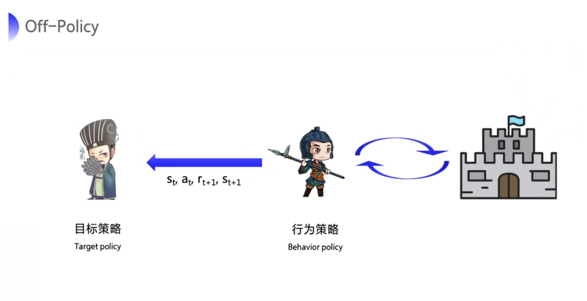

**我们也可以用这个动态规划的办法**，一直去迭代它的 Bellman equation，让它最后收敛，我们就可以得到它的一个状态。所以在这里算法二就是一个迭代的算法，通过 `bootstrapping(自举)`的办法，然后去不停地迭代这个 Bellman Equation。当这个最后更新的状态跟你上一个状态变化并不大的时候，更新就可以停止，我们就可以输出最新的 $V'(s)$ 作为它当前的状态。所以这里就是把 Bellman Equation 变成一个 Bellman Update，这样就可以得到它的一个价值。

动态规划的方法基于后继状态值的估计来更新状态值的估计（算法二中的第 3 行用 $V'$ 来更新 $V$ ）。也就是说，它们根据其他估算值来更新估算值。我们称这种基本思想为 bootstrapping。

>Bootstrap 本意是“解靴带”；这里是在使用徳国文学作品《吹牛大王历险记》中解靴带自助(拔靴自助)的典故，因此将其译为“自举”。

## Markov Decision Process(MDP)

### MDP

**相对于 MRP，`马尔可夫决策过程(Markov Decision Process)`多了一个 `decision`，其它的定义跟 MRP 都是类似的**:

* 这里多了一个决策，多了一个动作。
* 状态转移也多了一个条件，变成了 $P\left(s_{t+1}=s^{\prime} \mid s_{t}=s, a_{t}=a\right)$。你采取某一种动作，然后你未来的状态会不同。未来的状态不仅是依赖于你当前的状态，也依赖于在当前状态 agent 采取的这个动作。
* 对于这个价值函数，它也是多了一个条件，多了一个你当前的这个动作，变成了 $R\left(s_{t}=s, a_{t}=a\right)=\mathbb{E}\left[r_{t} \mid s_{t}=s, a_{t}=a\right]$。你当前的状态以及你采取的动作会决定你在当前可能得到的奖励多少。

### Policy in MDP

* Policy 定义了在某一个状态应该采取什么样的动作。

* 知道当前状态过后，我们可以把当前状态带入 policy function，然后就会得到一个概率，即 
$$
\pi(a \mid s)=P\left(a_{t}=a \mid s_{t}=s\right)
$$

概率就代表了在所有可能的动作里面怎样采取行动，比如可能有 0.7 的概率往左走，有 0.3 的概率往右走，这是一个概率的表示。

* 另外这个策略也可能是确定的，它有可能是直接输出一个值。或者就直接告诉你当前应该采取什么样的动作，而不是一个动作的概率。

* 假设这个概率函数应该是稳定的(stationary)，不同时间点，你采取的动作其实都是对这个 policy function 进行采样。

我们可以将 MRP 转换成 MDP。已知一个 MDP 和一个 policy $\pi$ 的时候，我们可以把 MDP 转换成 MRP。

在 MDP 里面，转移函数 $P(s'|s,a)$  是基于它当前状态以及它当前的 action。因为我们现在已知它 policy function，就是说在每一个状态，我们知道它可能采取的动作的概率，那么就可以直接把这个 action 进行加和，直接把这个 a 去掉，那我们就可以得到对于 MRP 的一个转移，这里就没有 action。

$$
 P^{\pi}\left(s^{\prime} \mid s\right)=\sum_{a \in A} \pi(a \mid s) P\left(s^{\prime} \mid s, a\right)
$$

对于这个奖励函数，我们也可以把 action 拿掉，这样就会得到一个类似于 MRP 的奖励函数。

$$
R^{\pi}(s)=\sum_{a \in A} \pi(a \mid s) R(s, a)
$$

### Comparison of MP/MRP and MDP

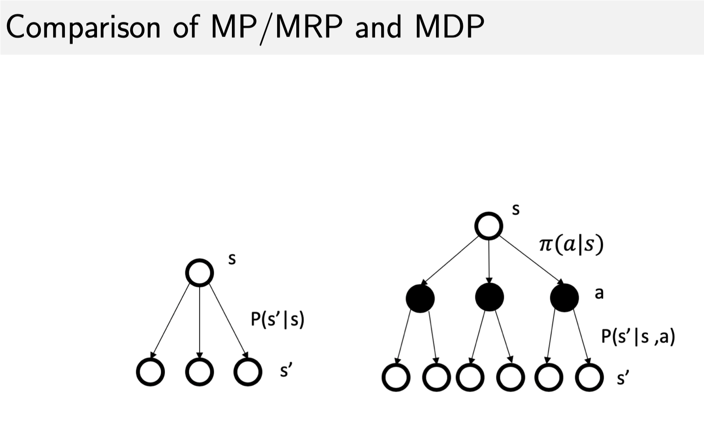

**这里我们看一看，MDP 里面的状态转移跟 MRP 以及 MP 的一个差异。**

* 马尔可夫过程的转移是直接就决定。比如当前状态是 s，那么就直接通过这个转移概率决定了下一个状态是什么。
* 但对于 MDP，它的中间多了一层这个动作 a ，就是说在你当前这个状态的时候，首先要决定的是采取某一种动作，那么你会到了某一个黑色的节点。到了这个黑色的节点，因为你有一定的不确定性，当你当前状态决定过后以及你当前采取的动作过后，你到未来的状态其实也是一个概率分布。**所以在这个当前状态跟未来状态转移过程中这里多了一层决策性，这是 MDP 跟之前的马尔可夫过程很不同的一个地方。**在马尔可夫决策过程中，动作是由 agent 决定，所以多了一个 component，agent 会采取动作来决定未来的状态转移。

### Value function for MDP

顺着 MDP 的定义，我们可以把 `状态-价值函数(state-value function)`，就是在 MDP 里面的价值函数也进行一个定义，它的定义是跟 MRP 是类似的，如式 (3)  所示：
$$
v^{\pi}(s)=\mathbb{E}_{\pi}\left[G_{t} \mid s_{t}=s\right] \tag{3}
$$
但是这里 expectation over policy，就是这个期望是基于你采取的这个 policy ，就当你的 policy 决定过后，**我们通过对这个 policy 进行采样来得到一个期望，那么就可以计算出它的这个价值函数。**

这里我们另外引入了一个 `Q 函数(Q-function)`。Q 函数也被称为 `action-value function`。**Q 函数定义的是在某一个状态采取某一个动作，它有可能得到的这个 return 的一个期望**，如式 (4) 所示：
$$
q^{\pi}(s, a)=\mathbb{E}_{\pi}\left[G_{t} \mid s_{t}=s, A_{t}=a\right] \tag{4}
$$
这里期望其实也是 over policy function。所以你需要对这个 policy function 进行一个加和，然后得到它的这个价值。
**对 Q 函数中的动作函数进行加和，就可以得到价值函数**，如式 (5) 所示：
$$
v^{\pi}(s)=\sum_{a \in A} \pi(a \mid s) q^{\pi}(s, a) \tag{5}
$$
#### Q-function Bellman Equation

此处我们给出 Q 函数的 Bellman equation：

$$
\begin{aligned}
q(s,a)&=\mathbb{E}\left[G_{t} \mid s_{t}=s,a_{t}=a\right]\\
&=\mathbb{E}\left[R_{t+1}+\gamma R_{t+2}+\gamma^{2} R_{t+3}+\ldots \mid s_{t}=s,a_{t}=a\right]  \\
&=\mathbb{E}\left[R_{t+1}|s_{t}=s,a_{t}=a\right] +\gamma \mathbb{E}\left[R_{t+2}+\gamma R_{t+3}+\gamma^{2} R_{t+4}+\ldots \mid s_{t}=s,a_{t}=a\right]\\
&=R(s,a)+\gamma \mathbb{E}[G_{t+1}|s_{t}=s,a_{t}=a] \\
&=R(s,a)+\gamma \mathbb{E}[V(s_{t+1})|s_{t}=s,a_{t}=a]\\
&=R(s,a)+\gamma \sum_{s^{\prime} \in S} P\left(s^{\prime} \mid s,a\right) V\left(s^{\prime}\right)
\end{aligned}
$$

### Bellman Expectation Equation

**我们可以把状态-价值函数和 Q 函数拆解成两个部分：即时奖励(immediate reward) 和后续状态的折扣价值(discounted value of successor state)。**

通过对状态-价值函数进行一个分解，我们就可以得到一个类似于之前 MRP 的 Bellman Equation，这里叫 `Bellman Expectation Equation`，如式 (6) 所示：
$$
v^{\pi}(s)=E_{\pi}\left[R_{t+1}+\gamma v^{\pi}\left(s_{t+1}\right) \mid s_{t}=s\right] \tag{6}
$$
对于 Q 函数，我们也可以做类似的分解，也可以得到 Q 函数的 Bellman Expectation Equation，如式 (7) 所示：
$$
q^{\pi}(s, a)=E_{\pi}\left[R_{t+1}+\gamma q^{\pi}\left(s_{t+1}, A_{t+1}\right) \mid s_{t}=s, A_{t}=a\right] \tag{7}
$$
**Bellman expectation equation 定义了你当前状态跟未来状态之间的一个关联。**

我们进一步进行一个简单的分解。

我们先给出等式 (8)：
$$
v^{\pi}(s)=\sum_{a \in A} \pi(a \mid s) q^{\pi}(s, a) \tag{8}
$$
再给出等式 (9)：
$$
q^{\pi}(s, a)=R_{s}^{a}+\gamma \sum_{s^{\prime} \in S} P\left(s^{\prime} \mid s, a\right) v^{\pi}\left(s^{\prime}\right) \tag{9}
$$
**等式 (8) 和等式 (9) 代表了价值函数跟 Q 函数之间的一个关联。**

也可以把等式 (9) 插入等式 (8) 中，得到等式 (10)：
$$
v^{\pi}(s)=\sum_{a \in A} \pi(a \mid s)\left(R(s, a)+\gamma \sum_{s^{\prime} \in S} P\left(s^{\prime} \mid s, a\right) v^{\pi}\left(s^{\prime}\right)\right) \tag{10}
$$
**等式 (10) 代表了当前状态的价值跟未来状态价值之间的一个关联。**

我们把等式 (8) 插入到等式 (9)，就可以得到等式 (11)：
$$
q^{\pi}(s, a)=R(s, a)+\gamma \sum_{s^{\prime} \in S} P\left(s^{\prime} \mid s, a\right) \sum_{a^{\prime} \in A} \pi\left(a^{\prime} \mid s^{\prime}\right) q^{\pi}\left(s^{\prime}, a^{\prime}\right) \tag{11}
$$
**等式 (11) 代表了当前时刻的 Q 函数跟未来时刻的 Q 函数之间的一个关联。**

**等式  (10) 和等式 (11)  是 Bellman expectation equation 的另一种形式。**

### Backup Diagram

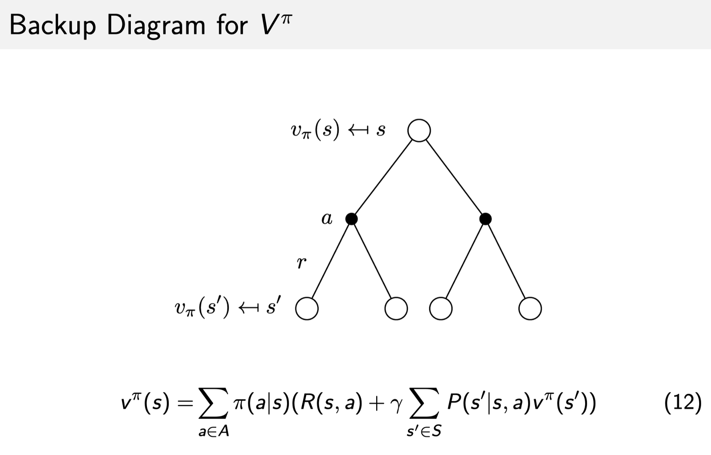

这里有一个概念叫 `backup`。Backup 类似于 bootstrapping 之间这个迭代关系，就对于某一个状态，它的当前价值是跟它的未来价值线性相关的。

我们把上面这样的图称为 `backup diagram(备份图)`，因为它们图示的关系构成了更新或备份操作的基础，而这些操作是强化学习方法的核心。这些操作将价值信息从一个状态（或状态-动作对）的后继状态（或状态-动作对）转移回它。

每一个空心圆圈代表一个状态，每一个实心圆圈代表一个状态-动作对。

$$
v^{\pi}(s)=\sum_{a \in A} \pi(a \mid s)\left(R(s, a)+\gamma \sum_{s^{\prime} \in S} P\left(s^{\prime} \mid s, a\right) v^{\pi}\left(s^{\prime}\right)\right) \tag{12}
$$
如式 (12) 所示，我们这里有两层加和：

* 第一层加和就是这个叶子节点，往上走一层的话，我们就可以把未来的价值($s'$ 的价值) backup 到黑色的节点。
* 第二层加和是对 action 进行加和。得到黑色节点的价值过后，再往上 backup 一层，就会推到根节点的价值，即当前状态的价值。

上图是状态-价值函数的计算分解图，上图 B 计算公式为
$$
v^{\pi}(s)=\sum_{a \in A} \pi(a \mid s) q^{\pi}(s, a) \tag{i}
$$
上图 B 给出了状态-价值函数与 Q 函数之间的关系。上图 C 计算 Q 函数为
$$
q^{\pi}(s,a)=R(s, a)+\gamma \sum_{s^{\prime} \in S} P\left(s^{\prime} \mid s, a\right) v^{\pi}\left(s^{\prime}\right) \tag{ii}
$$

将式 (ii) 代入式 (i) 可得：
$$
v^{\pi}(s)=\sum_{a \in A} \pi(a \mid s)\left(R(s, a)+\gamma \sum_{s^{\prime} \in S} P\left(s^{\prime} \mid s, a\right) v^{\pi}\left(s^{\prime}\right)\right)
$$
**所以 backup diagram 定义了未来下一时刻的状态-价值函数跟上一时刻的状态-价值函数之间的关联。**

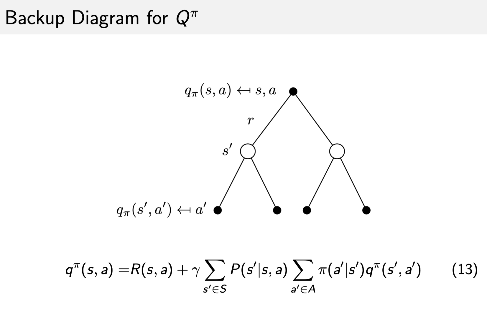

对于 Q 函数，我们也可以进行这样的一个推导。现在的根节点是这个 Q 函数的一个节点。Q 函数对应于黑色的节点。我们下一时刻的 Q 函数是叶子节点，有四个黑色节点。
$$
q^{\pi}(s, a)=R(s, a)+\gamma \sum_{s^{\prime} \in S} P\left(s^{\prime} \mid s, a\right) \sum_{a^{\prime} \in A} \pi\left(a^{\prime} \mid s^{\prime}\right) q^{\pi}\left(s^{\prime}, a^{\prime}\right) \tag{13}
$$
如式 (13) 所示，我们这里也有两个加和：

* 第一层加和是先把这个叶子节点从黑色节点推到这个白色的节点，进了它的这个状态。
* 当我们到达某一个状态过后，再对这个白色节点进行一个加和，这样就把它重新推回到当前时刻的一个 Q 函数。

在上图 C 中，
$$
v^{\pi}\left(s^{\prime}\right)=\sum_{a^{\prime} \in A} \pi\left(a^{\prime} \mid s^{\prime}\right) q^{\pi}\left(s^{\prime}, a^{\prime}\right) \tag{iii}
$$
将式 (iii) 代入式 (ii) 可得到 Q 函数：
$$
q^{\pi}(s, a)=R(s, a)+\gamma \sum_{s^{\prime} \in S} P\left(s^{\prime} \mid s, a\right) \sum_{a^{\prime} \in A} \pi\left(a^{\prime} \mid s^{\prime}\right) q^{\pi}\left(s^{\prime}, a^{\prime}\right)
$$
**所以这个等式就决定了未来 Q 函数跟当前 Q 函数之间的这个关联。**

### Policy Evaluation(Prediction)

* 当我们知道一个 MDP 以及要采取的策略 $\pi$ ，计算价值函数 $v^{\pi}(s)$ 的过程就是 `policy evaluation`。就像我们在评估这个策略，我们会得到多大的奖励。
* **Policy evaluation 在有些地方也被叫做 `(value) prediction`，也就是预测你当前采取的这个策略最终会产生多少的价值。**

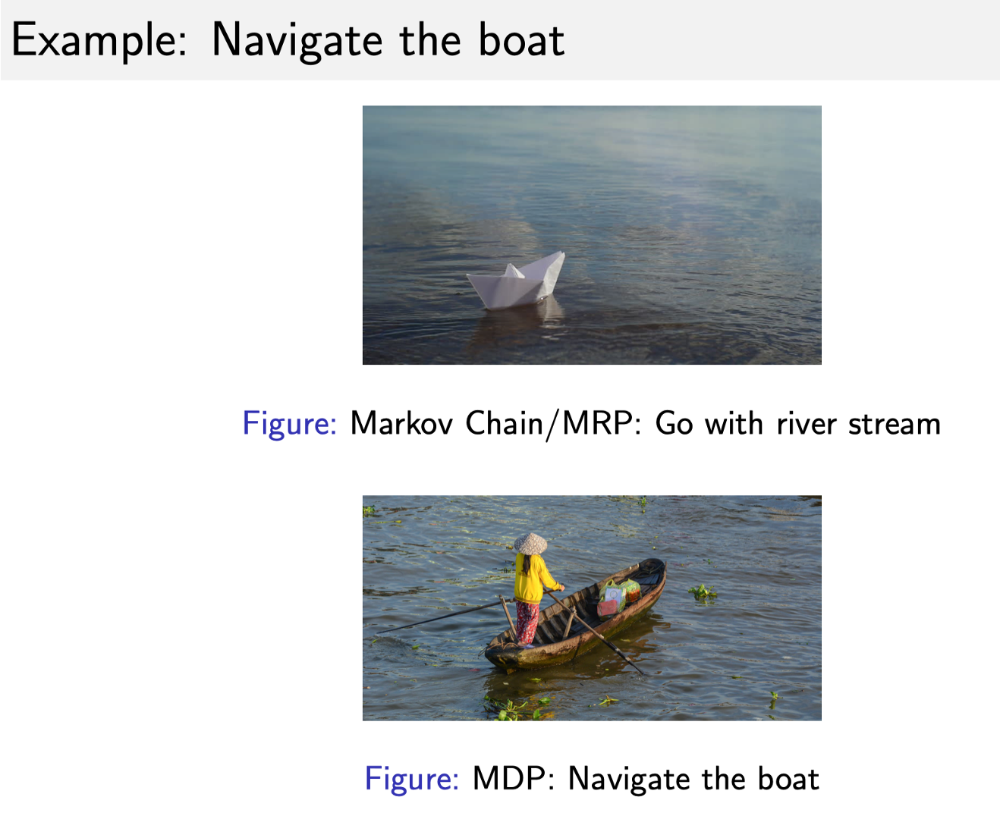

* MDP，你其实可以把它想象成一个摆渡的人在这个船上面，她可以控制这个船的移动，这样就避免了这个船随波逐流。因为在每一个时刻，这个人会决定采取什么样的一个动作，这样会把这个船进行导向。

* MRP 跟 MP 的话，这个纸的小船会随波逐流，然后产生轨迹。
* MDP 的不同就是有一个 agent 去控制这个船，这样我们就可以尽可能多地获得奖励。

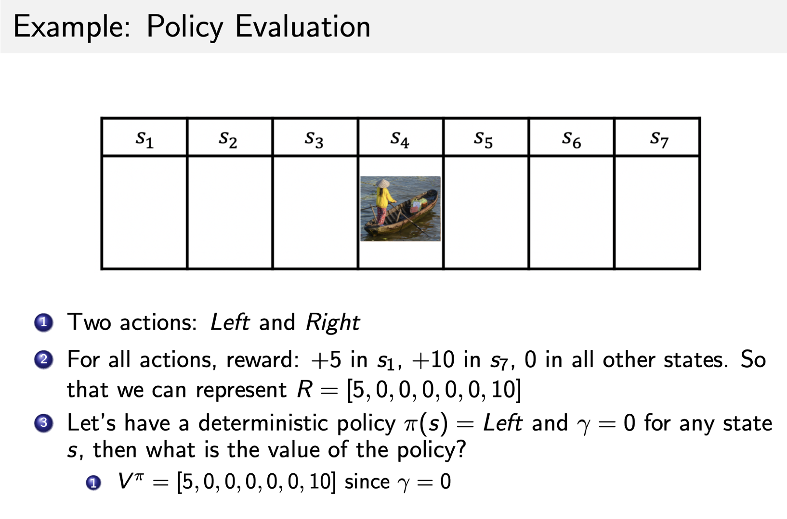

我们再看下 policy evaluation 的例子，怎么在决策过程里面计算它每一个状态的价值。

* 假设环境里面有两种动作：往左走和往右走。
* 现在的奖励函数有两个变量：动作和状态。但我们这里规定，不管你采取什么动作，只要到达状态 $s_1$，就有 5 的奖励。只要你到达状态 $s_7$ 了，就有 10 的奖励，中间没有任何奖励。
* 假设我们现在采取的一个策略，这个策略是说不管在任何状态，我们采取的策略都是往左走。假设价值折扣因子是零，那么对于确定性策略(deterministic policy)，最后估算出的价值函数是一致的，即

$$
V^{\pi}=[5,0,0,0,0,0,10]
$$

Q: 怎么得到这个结果？

A: 我们可以直接在去 run 下面这个 iterative equation：
$$
v_{k}^{\pi}(s)=r(s, \pi(s))+\gamma \sum_{s^{\prime} \in S} P\left(s^{\prime} \mid s, \pi(s)\right) v_{k-1}^{\pi}\left(s^{\prime}\right)
$$
就把 Bellman expectation equation 拿到这边来，然后不停地迭代，最后它会收敛。收敛过后，它的值就是它每一个状态的价值。

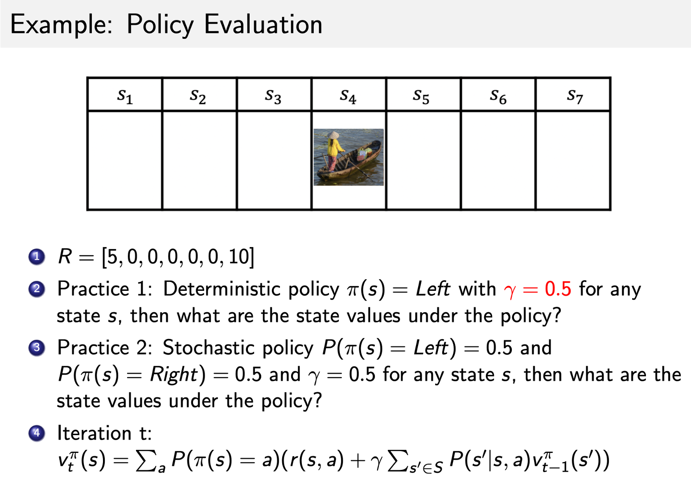

再来看一个例子(practice 1)，如果折扣因子是 0.5，我们可以通过下面这个等式进行迭代：
$$
v_{t}^{\pi}(s)=\sum_{a} P(\pi(s)=a)\left(r(s, a)+\gamma \sum_{s^{\prime} \in S} P\left(s^{\prime} \mid s, a\right) v_{t-1}^{\pi}\left(s^{\prime}\right)\right)
$$
然后就会得到它的状态价值。

另外一个例子(practice 2)，就是说我们现在采取的 policy 在每个状态下，有 0.5 的概率往左走，有 0.5 的概率往右走，那么放到这个状态里面去如何计算。其实也是把这个 Bellman expectation equation 拿出来，然后进行迭代就可以算出来了。一开始的时候，我们可以初始化，不同的 $v(s')$ 都会有一个值，放到 Bellman expectation equation 里面去迭代，然后就可以算出它的状态价值。

### Prediction and Control

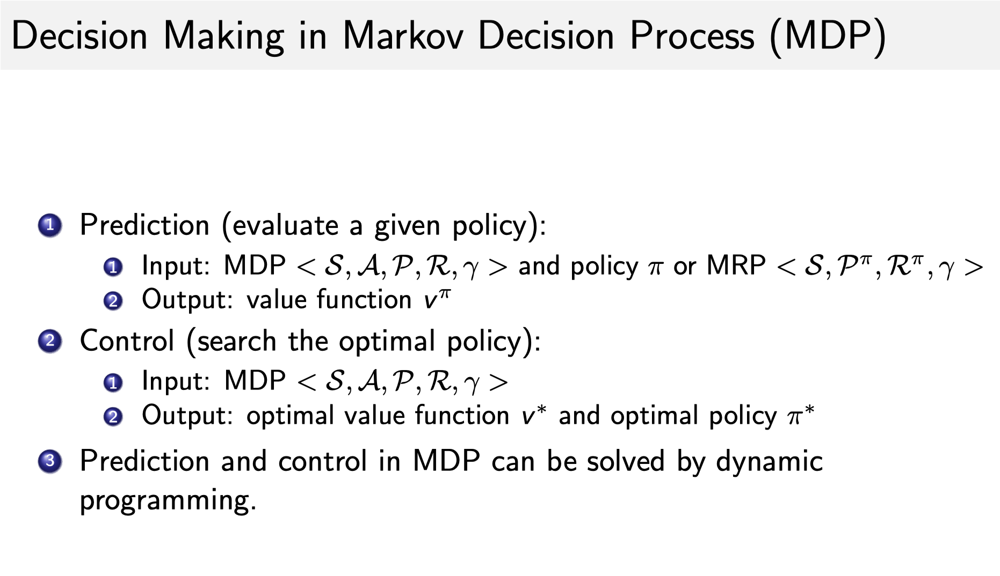

MDP 的 `prediction` 和 `control` 是 MDP 里面的核心问题。

* 预测问题：
  * 输入：MDP $<S,A,P,R,\gamma>$ 和 policy $\pi$  或者 MRP $<S,P^{\pi},R^{\pi},\gamma>$。
  * 输出：value function $v^{\pi}$。
  * Prediction 是说给定一个 MDP 以及一个 policy $\pi$ ，去计算它的 value function，就对于每个状态，它的价值函数是多少。

* 控制问题：
  * 输入：MDP  $<S,A,P,R,\gamma>$。
  * 输出：最佳价值函数(optimal value function) $v^*$ 和最佳策略(optimal policy) $\pi^*$。
  * Control 就是说我们去寻找一个最佳的策略，然后同时输出它的最佳价值函数以及最佳策略。
* 在 MDP 里面，prediction 和 control 都可以通过动态规划去解决。
* 要强调的是，这两者的区别就在于，
  * 预测问题是**给定一个 policy**，我们要确定它的 value function 是多少。
  * 而控制问题是在**没有 policy 的前提下**，我们要确定最优的 value function 以及对应的决策方案。
* **实际上，这两者是递进的关系，在强化学习中，我们通过解决预测问题，进而解决控制问题。**

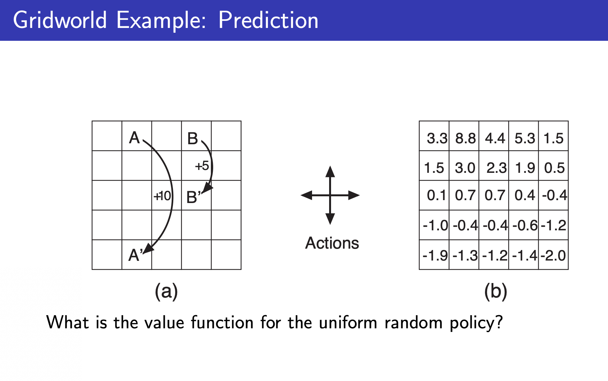

**举一个例子来说明 prediction 与 control 的区别。**

首先是**预测问题**：

* 在上图的方格中，我们规定从 A $\to$ A' 可以得到 +10 的奖励，从 B $\to$ B' 可以得到 +5 的奖励，其它步骤的奖励为 -1。
* 现在，我们给定一个 policy：在任何状态中，它的行为模式都是随机的，也就是上下左右的概率各 25%。
* 预测问题要做的就是，在这种决策模式下，我们的 value function 是什么。上图 b 是对应的 value function。

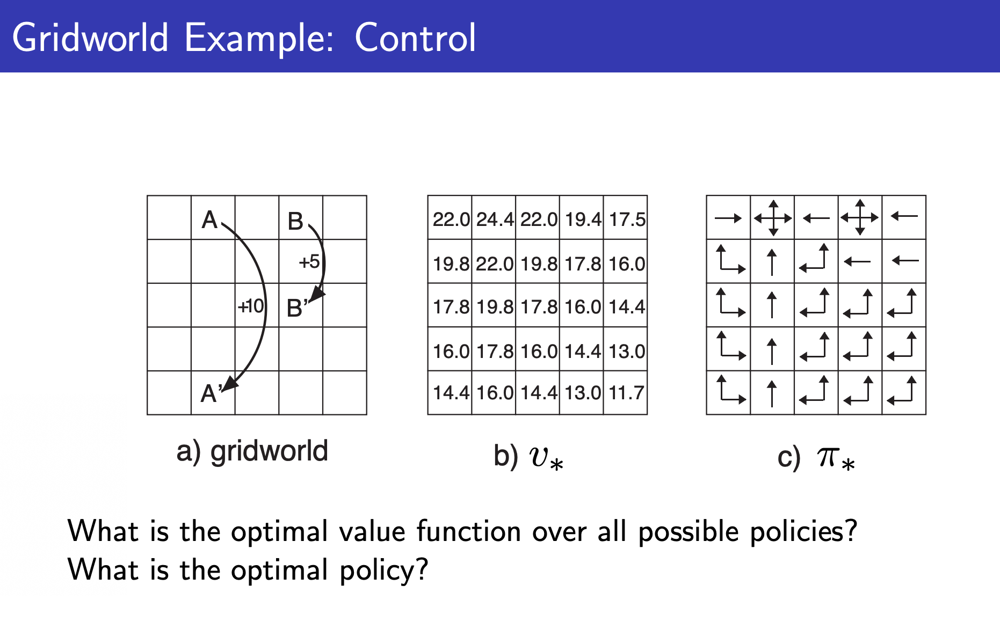

接着是**控制问题**：

* 在控制问题中，问题背景与预测问题相同，唯一的区别就是：不再限制 policy。也就是说行为模式是未知的，我们要自己确定。
* 所以我们通过解决控制问题，求得每一个状态的最优的 value function（如上图 b 所示），也得到了最优的 policy（如上图 c 所示）。

* 控制问题要做的就是，给定同样的条件，在所有可能的策略下最优的价值函数是什么？最优策略是什么？

### Dynamic Programming

`动态规划(Dynamic Programming，DP)`适合解决满足如下两个性质的问题：

* `最优子结构(optimal substructure)`。最优子结构意味着，我们的问题可以拆分成一个个的小问题，通过解决这个小问题，最后，我们能够通过组合小问题的答案，得到大问题的答案，即最优的解。
* `重叠子问题(Overlapping subproblems)`。重叠子问题意味着，子问题出现多次，并且子问题的解决方案能够被重复使用。

MDP 是满足动态规划的要求的，

* 在 Bellman equation 里面，我们可以把它分解成一个递归的结构。当我们把它分解成一个递归的结构的时候，如果我们的子问题子状态能得到一个值，那么它的未来状态因为跟子状态是直接相连的，那我们也可以继续推算出来。
* 价值函数就可以储存并重用它的最佳的解。

动态规划应用于 MDP 的规划问题(planning)而不是学习问题(learning)，我们必须对环境是完全已知的(Model-Based)，才能做动态规划，直观的说，就是要知道状态转移概率和对应的奖励才行

动态规划能够完成预测问题和控制问题的求解，是解 MDP prediction 和 control 一个非常有效的方式。

### Policy Evaluation on MDP

**Policy evaluation 就是给定一个 MDP 和一个 policy，我们可以获得多少的价值。**就对于当前这个策略，我们可以得到多大的 value function。

这里有一个方法是说，我们直接把这个 `Bellman Expectation Backup` 拿过来，变成一个迭代的过程，这样反复迭代直到收敛。这个迭代过程可以看作是 `synchronous backup` 的过程。

> 同步备份(synchronous backup)是指每一次的迭代都会完全更新所有的状态，这样对于程序资源需求特别大。异步备份(asynchronous backup)的思想就是通过某种方式，使得每一次迭代不需要更新所有的状态，因为事实上，很多的状态也不需要被更新。

$$
v_{t+1}(s)=\sum_{a \in \mathcal{A}} \pi(a \mid s)\left(R(s, a)+\gamma \sum_{s^{\prime} \in \mathcal{S}} P\left(s^{\prime} \mid s, a\right) v_{t}\left(s^{\prime}\right)\right) \tag{14}
$$
* 等式 (14) 说的是说我们可以把 Bellman Expectation Backup 转换成一个动态规划的迭代。
* 当我们得到上一时刻的 $v_t$ 的时候，就可以通过这个递推的关系来推出下一时刻的值。
* 反复去迭代它，最后它的值就是从 $v_1,v_2$ 到最后收敛过后的这个值。这个值就是当前给定的 policy 对应的价值函数。

Policy evaluation 的核心思想就是把如下式所示的 Bellman expectation backup 拿出来反复迭代，然后就会得到一个收敛的价值函数的值。
$$
v_{t+1}(s)=\sum_{a \in \mathcal{A}} \pi(a \mid s)\left(R(s, a)+\gamma \sum_{s^{\prime} \in \mathcal{S}} P\left(s^{\prime} \mid s, a\right) v_{t}\left(s^{\prime}\right)\right) \tag{15}
$$
因为已经给定了这个函数的 policy  function，那我们可以直接把它简化成一个 MRP 的表达形式，这样的话，形式就更简洁一些，就相当于我们把这个 $a$  去掉，如下式所示：
$$
v_{t+1}(s)=R^{\pi}(s)+\gamma P^{\pi}\left(s^{\prime} \mid s\right) v_{t}\left(s^{\prime}\right) \tag{16}
$$
这样它就只有价值函数跟转移函数了。通过去迭代这个更简化的一个函数，我们也可以得到它每个状态的价值。因为不管是在 MRP 以及 MDP，它的价值函数包含的这个变量都是只跟这个状态有关，就相当于进入某一个状态，未来可能得到多大的价值。

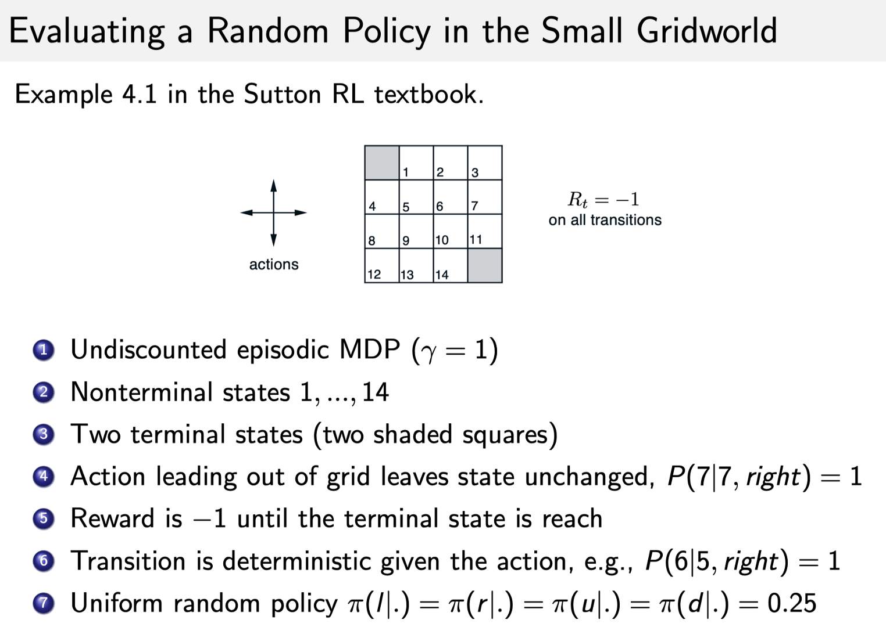

* 比如现在的环境是一个 small gridworld。这个 agent 的目的是从某一个状态开始，然后到达终点状态。它的终止状态就是左上角跟右下角，这里总共有 14 个状态，因为我们把每个位置用一个状态来表示。
* 这个 agent 采取的动作，它的 policy function 就直接先给定了，它在每一个状态都是随机游走，它们在每一个状态就是上下左右行走。它在边缘状态的时候，比如说在第四号状态的时候，它往左走的话，它是依然存在第四号状态，我们加了这个限制。

* 这里我们给的奖励函数就是说你每走一步，就会得到 -1 的奖励，所以 agent 需要尽快地到达终止状态。
* 状态之间的转移也是确定的。比如从第六号状态往上走，它就会直接到达第二号状态。很多时候有些环境是 `概率性的(probabilistic)`， 就是说 agent 在第六号状态，它选择往上走的时候，有可能地板是滑的，然后它可能滑到第三号状态或者第一号状态，这就是有概率的一个转移。但这里把这个环境进行了简化，从六号往上走，它就到了二号。
* 所以直接用这个迭代来解它，因为我们已经知道每一个概率以及它的这个概率转移，那么就直接可以进行一个简短的迭代，这样就会算出它每一个状态的价值。

我们再来看一个动态的例子，首先推荐斯坦福大学的一个网站：[GridWorld: Dynamic Programming Demo](https://cs.stanford.edu/people/karpathy/reinforcejs/gridworld_dp.html) ，这个网站模拟了单步更新的过程中，所有格子的一个状态价值的变化过程。

这里有很多格子，每个格子都代表了一个状态。在每个格子里面有一个初始值零。然后在每一个状态，它还有一些箭头，这个箭头就是说它在当前这个状态应该采取什么样的策略。我们这里采取一个随机的策略，不管它在哪一个状态，它上下左右的概率都是相同的。比如在某个状态，它都有上下左右 0.25 的概率采取某一个动作，所以它的动作是完全随机的。

在这样的环境里面，我们想计算它每一个状态的价值。我们也定义了它的 reward function，你可以看到有些状态上面有一个 R 的值。比如我们这边有些值是为负的，我们可以看到格子里面有几个 -1 的奖励，只有一个 +1 奖励的格子。在这个棋盘的中间这个位置，可以看到有一个 R 的值是 1.0，为正的一个价值函数。 所以每个状态对应了一个值，然后有一些状态没有任何值，就说明它的这个 reward function，它的奖励是为零的。

我们开始做这个 policy evaluation，policy evaluation 是一个不停迭代的过程。当我们初始化的时候，所有的 $v(s)$ 都是 0。我们现在迭代一次，迭代一次过后，你发现有些状态上面，值已经产生了变化。比如有些状态的值的 R 为 -1，迭代一次过后，它就会得到 -1 的这个奖励。对于中间这个绿色的，因为它的奖励为正，所以它是 +1 的状态。

所以当迭代第一次的时候，$v(s)$ 某些状态已经有些值的变化。

* 我们再迭代一次(one sweep)，然后发现它就从周围的状态也开始有值。因为周围状态跟之前有值的状态是临近的，所以它就相当于把旁边这个状态转移过来。所以当我们逐渐迭代的话，你会发现这个值一直在变换。

* 等迭代了很多次过后，很远的这些状态的价值函数已经有些值了，而且你可以发现它这里整个过程呈现逐渐扩散开的一个过程，这其实也是 policy evaluation 的一个可视化。
* 当我们每一步在进行迭代的时候，远的状态就会得到了一些值，就逐渐从一些已经有奖励的这些状态，逐渐扩散，当你 run 很多次过后，它就逐渐稳定下来，最后值就会确定不变，这样收敛过后，每个状态上面的值就是它目前得到的这个 value function 的值。

### MDP Control

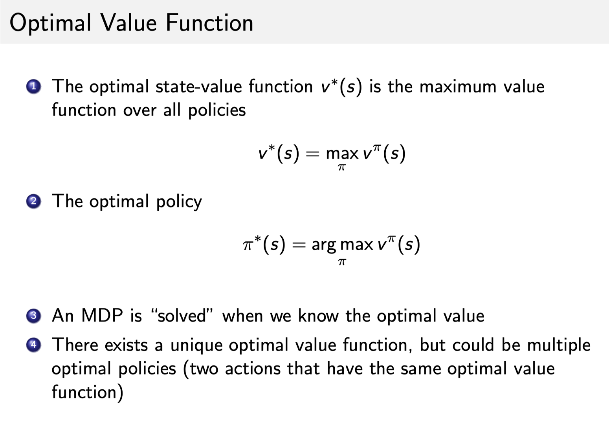

Policy evaluation 是说给定一个 MDP 和一个 policy，我们可以估算出它的价值函数。**还有问题是说如果我们只有一个 MDP，如何去寻找一个最佳的策略，然后可以得到一个`最佳价值函数(Optimal Value Function)`。**

Optimal Value Function 的定义如下式所示：
$$
v^{*}(s)=\max _{\pi} v^{\pi}(s)
$$
Optimal Value Function 是说，我们去搜索一种 policy $\pi$ 来让每个状态的价值最大。$v^*$ 就是到达每一个状态，它的值的极大化情况。

在这种极大化情况上面，我们得到的策略就可以说它是`最佳策略(optimal policy)`，如下式所示：
$$
\pi^{*}(s)=\underset{\pi}{\arg \max }~ v^{\pi}(s)
$$
Optimal policy 使得每个状态的价值函数都取得最大值。所以如果我们可以得到一个 optimal value function，就可以说某一个 MDP 的环境被解。在这种情况下，它的最佳的价值函数是一致的，就它达到的这个上限的值是一致的，但这里可能有多个最佳的 policy，就是说多个 policy 可以取得相同的最佳价值。

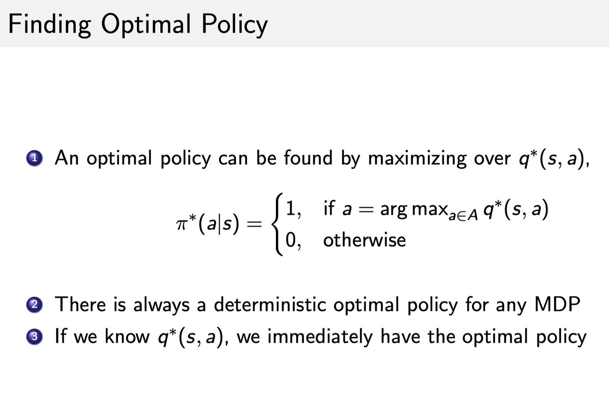

Q: 怎么去寻找这个最佳的 policy ？

A: 当取得最佳的价值函数过后，我们可以通过对这个 Q 函数进行极大化，然后得到最佳策略。当所有东西都收敛过后，因为 Q 函数是关于状态跟动作的一个函数，所以在某一个状态采取一个动作，可以使得这个 Q 函数最大化，那么这个动作就应该是最佳的动作。所以如果我们能优化出一个 Q 函数，就可以直接在这个 Q 函数上面取一个让 Q 函数最大化的 action 的值，就可以提取出它的最佳策略。

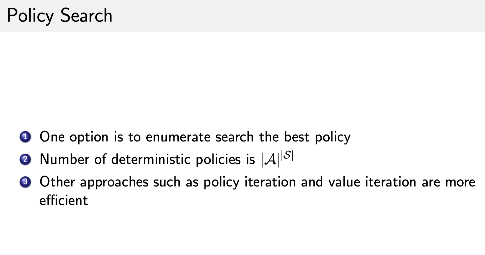

最简单的策略搜索办法就是`穷举`。假设状态和动作都是有限的，那么每个状态我们可以采取这个 A 种动作的策略，那么总共就是 $|A|^{|S|}$ 个可能的 policy。那我们可以把策略都穷举一遍，然后算出每种策略的 value function，对比一下就可以得到最佳策略。

但是穷举非常没有效率，所以我们要采取其他方法。**搜索最佳策略有两种常用的方法：policy iteration 和  value iteration**。

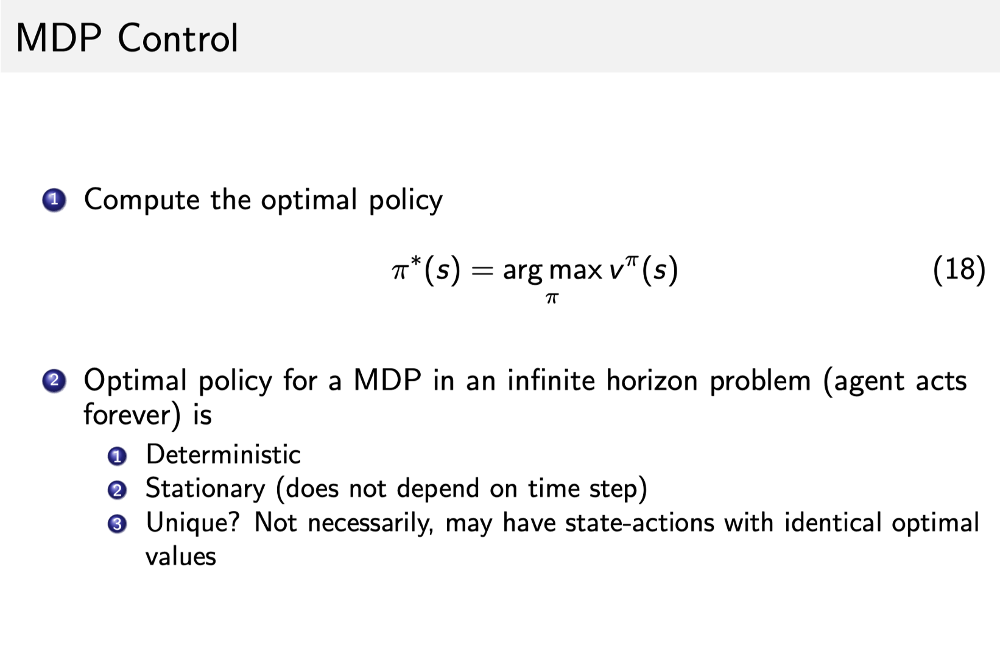

**寻找这个最佳策略的过程就是 MDP control 过程**。MDP control 说的就是怎么去寻找一个最佳的策略来让我们得到一个最大的价值函数，如下式所示：
$$
\pi^{*}(s)=\underset{\pi}{\arg \max } ~ v^{\pi}(s)
$$
对于一个事先定好的 MDP 过程，当 agent 去采取最佳策略的时候，我们可以说最佳策略一般都是确定的，而且是稳定的(它不会随着时间的变化)。但是不一定是唯一的，多种动作可能会取得相同的这个价值。

**我们可以通过 policy iteration 和 value iteration 来解 MDP 的控制问题。**

### Policy Iteration

**Policy iteration 由两个步骤组成：policy evaluation 和 policy improvement。**

* **第一个步骤是 policy evaluation**，当前我们在优化这个 policy $\pi$，在优化过程中得到一个最新的 policy。我们先保证这个 policy 不变，然后去估计它出来的这个价值。给定当前的 policy function 来估计这个 v 函数。
* **第二个步骤是 policy improvement**，得到 v 函数过后，我们可以进一步推算出它的 Q 函数。得到 Q 函数过后，我们直接在 Q 函数上面取极大化，通过在这个 Q 函数上面做一个贪心的搜索来进一步改进它的策略。
* 这两个步骤就一直是在迭代进行，所以在 policy iteration 里面，在初始化的时候，我们有一个初始化的 $V$ 和 $\pi$ ，然后就是在这两个过程之间迭代。
* 左边这幅图上面的线就是我们当前 v 的值，下面的线是 policy 的值。
  * 跟踢皮球一样，我们先给定当前已有的这个 policy function，然后去算它的 v。
  * 算出 v 过后，我们会得到一个 Q 函数。Q 函数我们采取 greedy 的策略，这样就像踢皮球，踢回这个 policy 。
  * 然后进一步改进那个 policy ，得到一个改进的 policy 过后，它还不是最佳的，我们再进行 policy evaluation，然后又会得到一个新的 value function。基于这个新的 value function 再进行 Q 函数的极大化，这样就逐渐迭代，然后就会得到收敛。

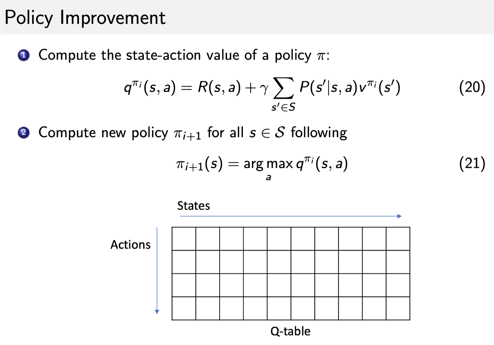

这里再来看一下第二个步骤： `policy improvement`，我们是如何改进它的这个策略。得到这个 v 值过后，我们就可以通过这个 reward function 以及状态转移把它的这个 Q-function 算出来，如下式所示：
$$
q^{\pi_{i}}(s, a)=R(s, a)+\gamma \sum_{s^{\prime} \in S} P\left(s^{\prime} \mid s, a\right) v^{\pi_{i}}\left(s^{\prime}\right)
$$
对于每一个状态，第二个步骤会得到它的新一轮的这个 policy ，就在每一个状态，我们去取使它得到最大值的 action，如下式所示：
$$
\pi_{i+1}(s)=\underset{a}{\arg \max } ~q^{\pi_{i}}(s, a)
$$
**你可以把 Q 函数看成一个 Q-table:**

* 横轴是它的所有状态，
* 纵轴是它的可能的 action。

得到 Q 函数后，`Q-table`也就得到了。

那么对于某一个状态，每一列里面我们会取最大的那个值，最大值对应的那个 action 就是它现在应该采取的 action。所以 arg max 操作就说在每个状态里面采取一个 action，这个 action 是能使这一列的 Q 最大化的那个动作。

#### Bellman Optimality Equation

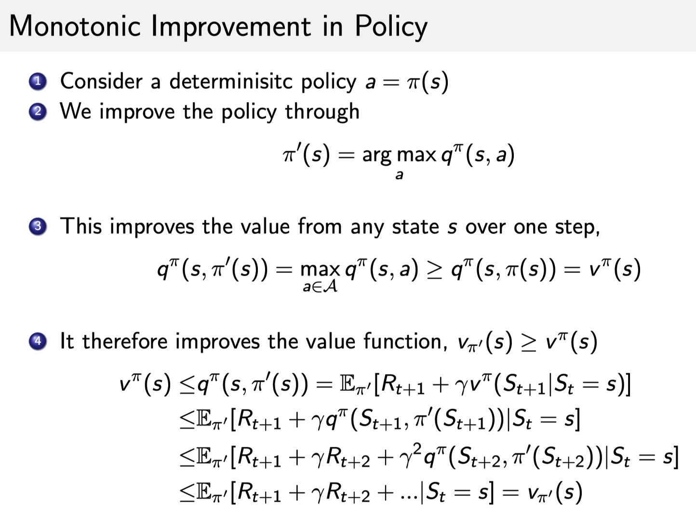

当一直在采取 arg max 操作的时候，我们会得到一个单调的递增。通过采取这种 greedy，即 arg max 操作，我们就会得到更好的或者不变的 policy，而不会使它这个价值函数变差。所以当这个改进停止过后，我们就会得到一个最佳策略。

当改进停止过后，我们取它最大化的这个 action，它直接就会变成它的价值函数，如下式所示：
$$
q^{\pi}\left(s, \pi^{\prime}(s)\right)=\max _{a \in \mathcal{A}} q^{\pi}(s, a)=q^{\pi}(s, \pi(s))=v^{\pi}(s)
$$
所以我们有了一个新的等式：
$$
v^{\pi}(s)=\max _{a \in \mathcal{A}} q^{\pi}(s, a)
$$
上式被称为  `Bellman optimality equation`。从直觉上讲，Bellman optimality equation 表达了这样一个事实：最佳策略下的一个状态的价值必须等于在这个状态下采取最好动作得到的回报的期望。 

**当 MDP 满足 Bellman optimality equation 的时候，整个 MDP 已经到达最佳的状态。**它到达最佳状态过后，对于这个 Q 函数，取它最大的 action 的那个值，就是直接等于它的最佳的 value function。只有当整个状态已经收敛过后，得到一个最佳的 policy 的时候，这个条件才是满足的。

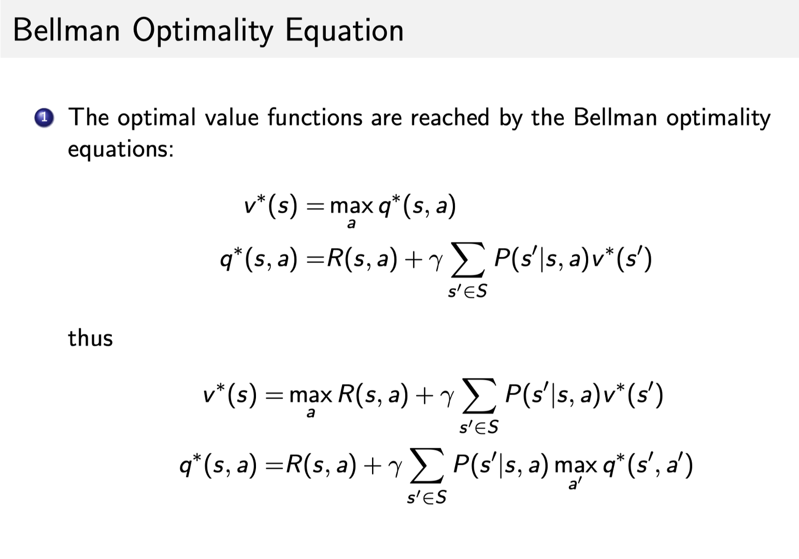

最佳的价值函数到达过后，这个 Bellman optimlity equation 就会满足。

满足过后，就有这个 max 操作，如第一个等式所示：
$$
v^{*}(s)=\max _{a} q^{*}(s, a)
$$
当我们取最大的这个 action 的时候对应的值就是当前状态的最佳的价值函数。

另外，我们给出第二个等式，即 Q 函数的 Bellman equation：
$$
q^{*}(s, a)=R(s, a)+\gamma \sum_{s^{\prime} \in S} P\left(s^{\prime} \mid s, a\right) v^{*}\left(s^{\prime}\right)
$$
**我们可以把第一个等式插入到第二个等式里面去**，如下式所示：
$$
\begin{aligned}
q^{*}(s, a)&=R(s, a)+\gamma \sum_{s^{\prime} \in S} P\left(s^{\prime} \mid s, a\right) v^{*}\left(s^{\prime}\right) \\
&=R(s,a)+\gamma \sum_{s^{\prime} \in S} P\left(s^{\prime} \mid s, a\right) \max _{a} q^{*}(s', a')
\end{aligned}
$$
我们就会得到 Q 函数之间的转移。它下一步这个状态，取了 max 这个值过后，就会跟它最佳的这个状态等价。

Q-learning 是基于 Bellman Optimality Equation 来进行的，当取它最大的这个状态的时候（ $\underset{a'}{\max} q^{*}\left(s^{\prime}, a^{\prime}\right)$ ），它会满足下面这个等式：
$$
q^{*}(s, a)=R(s, a)+\gamma \sum_{s^{\prime} \in S} P\left(s^{\prime} \mid s, a\right) \max _{a^{\prime}} q^{*}\left(s^{\prime}, a^{\prime}\right)
$$

我们还可以把第二个等式插入到第一个等式，如下式所示：
$$
\begin{aligned}
v^{*}(s)&=\max _{a} q^{*}(s, a) \\
&=\max_{a} \mathbb{E}[G_t|s_t=s,a_t=a]\\  
&=\max_{a}\mathbb{E}[R_{t+1}+\gamma G_{t+1}|s_t=s,a_t=a]\\
&=\max_{a}\mathbb{E}[R_{t+1}+\gamma v^*(s_{t+1})|s_t=s,a_t=a]\\
&=\max_{a}\mathbb{E}[R_{t+1}]+ \max_a \mathbb{E}[\gamma v^*(s_{t+1})|s_t=s,a_t=a]\\
&=\max_{a} R(s,a) + \max_a\gamma \sum_{s^{\prime} \in S} P\left(s^{\prime} \mid s, a\right) v^{*}\left(s^{\prime}\right)\\
&=\max_{a} \left(R(s,a) + \gamma \sum_{s^{\prime} \in S} P\left(s^{\prime} \mid s, a\right) v^{*}\left(s^{\prime}\right)\right)
\end{aligned}
$$
我们就会得到状态-价值函数的一个转移。

### Value Iteration

#### Principle of Optimality

我们从另一个角度思考问题，动态规划的方法将优化问题分成两个部分：

* 第一步执行的是最优的 action；
* 之后后继的状态每一步都按照最优的 policy 去做，那么我最后的结果就是最优的。

**Principle of Optimality Theorem**:

一个 policy $\pi(s|a)$ 在状态 $s$ 达到了最优价值，也就是 $v^{\pi}(s) = v^{*}(s)$ 成立，当且仅当：

对于**任何**能够从 $s$ 到达的 $s'$，都已经达到了最优价值，也就是，对于所有的 $s'$，$v^{\pi}(s') = v^{*}(s')$ 恒成立。

#### Deterministic Value Iteration

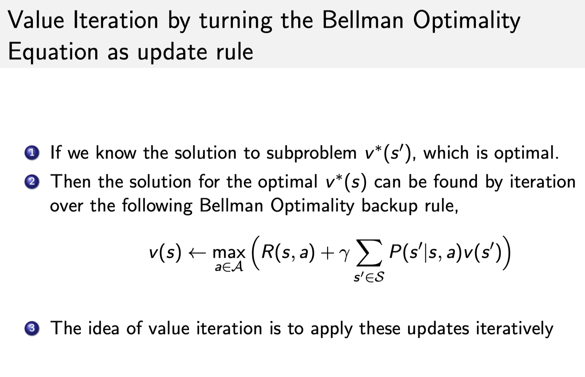

**Value iteration 就是把 Bellman Optimality Equation 当成一个 update rule 来进行，**如下式所示：
$$
v(s) \leftarrow \max _{a \in \mathcal{A}}\left(R(s, a)+\gamma \sum_{s^{\prime} \in \mathcal{S}} P\left(s^{\prime} \mid s, a\right) v\left(s^{\prime}\right)\right)
$$
之前我们说上面这个等式只有当整个 MDP 已经到达最佳的状态时才满足。但这里可以把它转换成一个 backup 的等式。Backup 就是说一个迭代的等式。**我们不停地去迭代 Bellman Optimality Equation，到了最后，它能逐渐趋向于最佳的策略，这是 value iteration 算法的精髓。**

为了得到最佳的 $v^*$ ，对于每个状态的 $v^*$，我们直接把这个 Bellman Optimality Equation 进行迭代，迭代了很多次之后，它就会收敛。

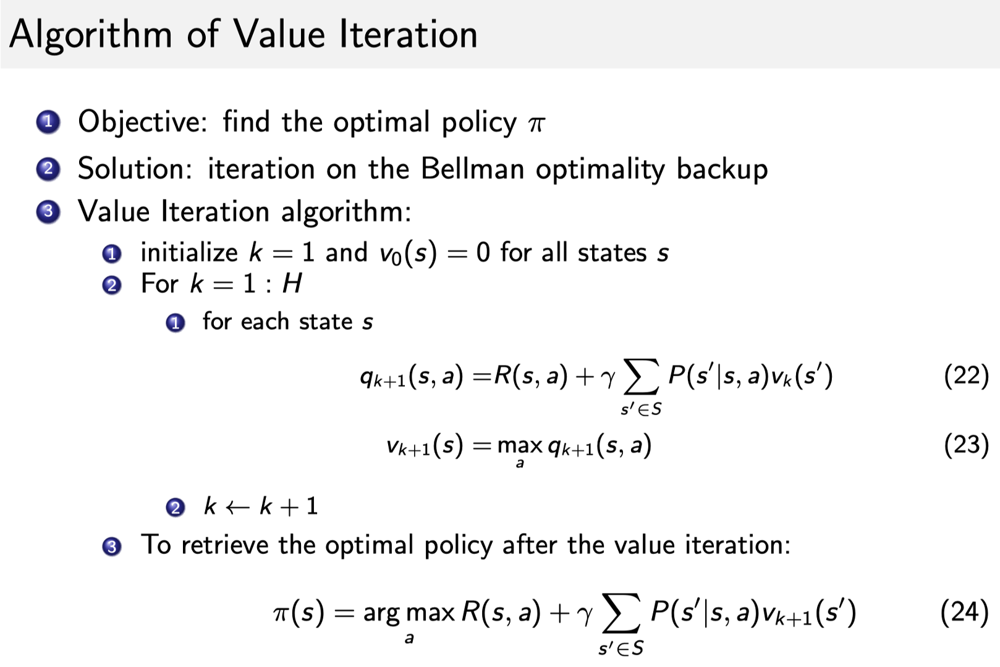

* 我们使用 value iteration 算法是为了得到一个最佳的策略。
* 解法：我们可以直接把 `Bellman Optimality backup` 这个等式拿进来进行迭代，迭代很多次，收敛过后得到的那个值就是它的最佳的值。
* 这个算法开始的时候，它是先把所有值初始化，通过每一个状态，然后它会进行这个迭代。把等式 (22) 插到等式 (23) 里面，就是 Bellman optimality backup 的那个等式。有了等式 (22) 和等式 (23) 过后，然后进行不停地迭代，迭代过后，然后收敛，收敛后就会得到这个 $v^*$ 。当我们有了 $v^*$ 过后，一个问题是如何进一步推算出它的最佳策略。
* 提取最佳策略的话，我们可以直接用 arg max。就先把它的 Q 函数重构出来，重构出来过后，每一个列对应的最大的那个 action 就是它现在的最佳策略。这样就可以从最佳价值函数里面提取出最佳策略。
* 我们只是在解决一个 planning 的问题，而不是强化学习的问题，因为我们知道环境如何变化。

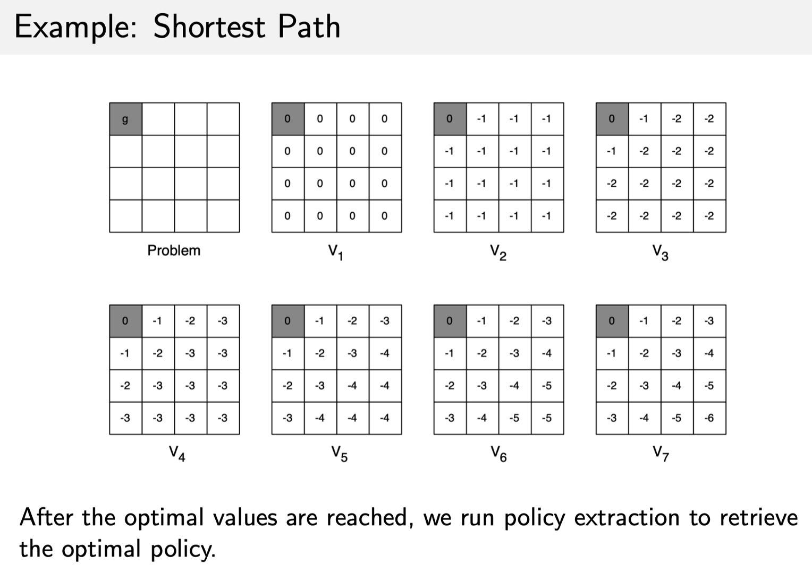

* value function 做的工作类似于 value 的反向传播，每次迭代做一步传播，所以中间过程的 policy 和 value function 是没有意义的。不像是 policy iteration，它每一次迭代的结果都是有意义的，都是一个完整的 policy。
* 上图是一个可视化的过程，在一个 gridworld 中，我们设定了一个终点(goal)，也就是左上角的点。不管你在哪一个位置开始，我们都希望能够到终点（实际上这个终点是在迭代过程中不必要的，只是为了更好的演示）。Value iteration 的迭代过程像是一个从某一个状态（这里是我们的 goal）反向传播其他各个状态的过程。因为每次迭代只能影响到与之直接相关的状态。
* 让我们回忆下 `Principle of Optimality Theorem`：当你这次迭代求解的某个状态 s 的 value function $v_{k+1}(s)$ 是最优解，它的前提是能够从该状态到达的所有状态 s' 此时都已经得到了最优解；如果不是的话，它做的事情只是一个类似传递 value function 的过程。
* 以上图为例，实际上，对于每一个状态，我们都可以看成一个终点。迭代由每一个终点开始，每次都根据 Bellman optimality equation 重新计算 value。如果它的相邻节点 value 发生变化，变得更好，那么它也会变得更好，一直到相邻节点都不变了。因此，**在我们迭代到** $v_7$ **之前，也就是还没将每个终点的最优的 value 传递给其他的所有状态之前，中间的几个 value function 只是一种暂存的不完整的数据，它不能代表每一个 state 的 value function，所以生成的 policy 是一个没有意义的 policy**。
* 因为它是一个迭代过程，这里可视化了从  $v_1$ 到 $v_7$  每一个状态的值的变化，它的这个值逐渐在变化。而且因为它每走一步，就会得到一个负的值，所以它需要尽快地到达左上角，可以发现离它越远的，那个值就越小。
* $v_7$ 收敛过后，右下角那个值是 -6，相当于它要走六步，才能到达最上面那个值。而且离目的地越近，它的价值越大。

### Difference between Policy Iteration and Value Iteration

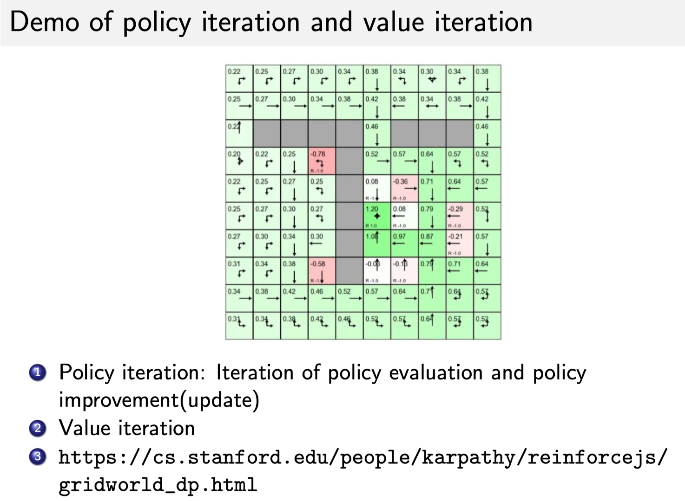

**我们来看一个 MDP control 的 Demo。**

* 首先来看 policy iteration。之前的例子在每个状态都是采取固定的随机策略，就每个状态都是 0.25 的概率往上往下往左往右，没有策略的改变。
* 但是我们现在想做 policy iteration，就是每个状态的策略都进行改变。Policy iteration 的过程是一个迭代过程。

我们先在这个状态里面 run 一遍 policy  evaluation，就得到了一个 value function，每个状态都有一个 value function。

* **现在进行 policy improvement，点一下 policy update。**点一下 policy update 过后，你可以发现有些格子里面的 policy 已经产生变化。
* 比如说对于中间这个 -1 的这个状态，它的最佳策略是往下走。当你到达这个状态后，你应该往下，这样就会得到最佳的这个值。
* 绿色右边的这个方块的策略也改变了，它现在选取的最佳策略是往左走，也就是说在这个状态的时候，最佳策略应该是往左走。

我们再 run 下一轮的 policy evaluation，你发现它的值又被改变了，很多次过后，它会收敛。

我们再 run policy update，你发现每个状态里面的值基本都改变，它不再是上下左右随机在变了，它会选取一个最佳的策略。

我们再 run 这个 policy evaluation，它的值又在不停地变化，变化之后又收敛了。

我们再来 run 一遍 policy update。现在它的值又会有变化，就在每一个状态，它的这个最佳策略也会产生一些改变。

再来在这个状态下面进行改变，现在你看基本没有什么变化，就说明整个 MDP 已经收敛了。所以现在它每个状态的值就是它当前最佳的 value function 的值以及它当前状态对应的这个 policy 就是最佳的 policy。

比如说现在我们在右上角 0.38 的这个位置，然后它说现在应该往下走，我们往下走一步。它又说往下走，然后再往下走。现在我们有两个选择：往左走和往下走。我们现在往下走，随着这个箭头的指示，我们就会到达中间 1.20 的一个状态。如果能达到这个状态，我们就会得到很多 reward 。

这个 Demo 说明了 policy iteration 可以把 gridworld 解决掉。解决掉的意思是说，不管在哪个状态，都可以顺着状态对应的最佳的策略来到达可以获得最多奖励的一个状态。

**我们再用 value iteration 来解 MDP，点 Toggle value iteration。** 

* 当它的这个值确定下来过后，它会产生它的最佳状态，这个最佳状态提取的策略跟 policy iteration 得出来的最佳策略是一致的。
* 在每个状态，我们跟着这个最佳策略走，就会到达可以得到最多奖励的一个状态。

我们给出一个[ Demo](https://github.com/cuhkrlcourse/RLexample/tree/master/MDP)，这个 Demo 是为了解一个叫 `FrozenLake` 的例子，这个例子是 OpenAI Gym 里的一个环境，跟 gridworld 很像，不过它每一个状态转移是一个概率。

**我们再来对比下 policy iteration 和 value iteration，这两个算法都可以解 MDP 的控制问题。**

* Policy Iteration 分两步，首先进行 policy evaluation，即对当前已经搜索到的策略函数进行一个估值。得到估值过后，进行 policy improvement，即把 Q 函数算出来，我们进一步进行改进。不断重复这两步，直到策略收敛。
* Value iteration 直接把 Bellman Optimality Equation 拿进来，然后去寻找最佳的 value function，没有 policy function 在这里面。当算出 optimal value function 过后，我们再来提取最佳策略。

### Summary for Prediction and Control in MDP

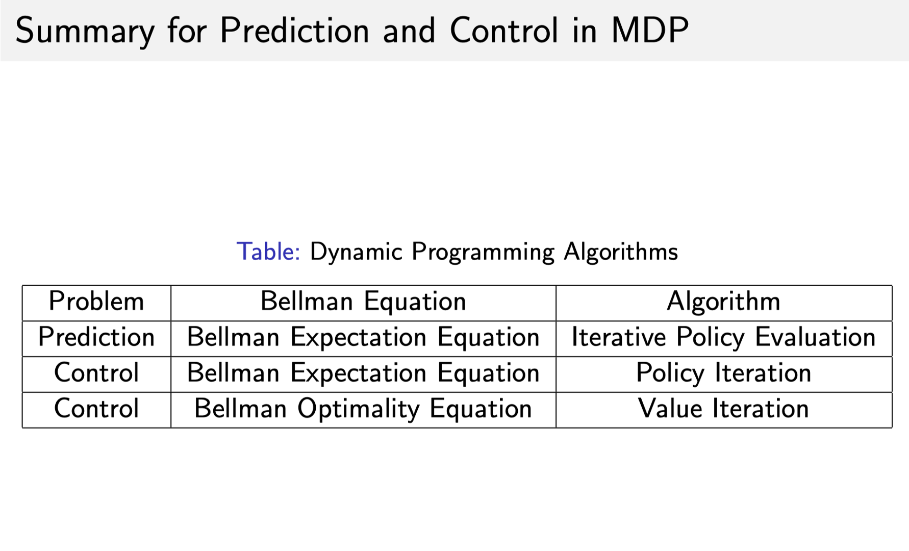

总结如上表所示，就对于 MDP 里面的 prediction 和 control  都是用动态规划来解，我们其实采取了不同的 Bellman Equation。

* 如果是一个 prediction 的问题，即 policy evaluation  的问题，直接就是不停地 run 这个 Bellman Expectation Equation，这样我们就可以去估计出给定的这个策略，然后得到价值函数。
* 对于 control，
  * 如果采取的算法是 policy  iteration，那这里用的是 Bellman Expectation Equation 。把它分成两步，先上它的这个价值函数，再去优化它的策略，然后不停迭代。这里用到的只是 Bellman Expectation Equation。
  * 如果采取的算法是 value iteration，那这里用到的 Bellman Equation 就是 Bellman Optimality Equation，通过 arg max 这个过程，不停地去 arg max 它，最后它就会达到最优的状态。

## References

* [强化学习基础 David Silver 笔记](https://zhuanlan.zhihu.com/c_135909947)
* [Reinforcement Learning: An Introduction (second edition)](https://book.douban.com/subject/30323890/)
* [David Silver 强化学习公开课中文讲解及实践](https://zhuanlan.zhihu.com/reinforce)
* [UCL Course on RL(David Silver)](https://www.davidsilver.uk/teaching/)
* [Derivation of Bellman’s Equation](https://jmichaux.github.io/_notebook/2018-10-14-bellman/)
* [深入浅出强化学习：原理入门](https://book.douban.com/subject/27624485//)

