# 第 3 章 表格型方法

策略最简单的表示是查找表（look-up table），即表格型策略（tabular policy）。使用查找表的强化学习方法称为**表格型方法（tabular method）**，如蒙特卡洛、Q学习和Sarsa。本章通过最简单的表格型方法来讲解如何使用基于价值的方法求解强化学习问题。

## 3.1 马尔可夫决策过程

强化学习是一个与时间相关的序列决策的问题。例如，如图 3.1 所示，在 $t-1$ 时刻，我看到熊对我招手，下意识的动作就是逃跑。熊看到有人逃跑，就可能觉得发现了猎物，并开始发动攻击。而在 $t$ 时刻，我如果选择装死的动作，可能熊咬咬我、摔几下就觉得挺无趣的，可能会走开。这个时候我再逃跑，可能就成功了，这就是一个序列决策过程。

在输出每一个动作之前，我们可以选择不同的动作。比如在 $t$ 时刻，我选择逃跑的时候，可能熊已经追上来了。如果在 $t$ 时刻，我没有选择装死，而是选择逃跑，这个时候熊已经追上来了，那么我就会转移到不同的状态。有一定的概率我会逃跑成功，也有一定的概率我会逃跑失败。我们用状态转移概率 $p\left[s_{t+1}, r_{t} \mid s_{t}, a_{t}\right]$ 来表示在状态 $s_t$ 选择动作 $a_t$ 的时候，转移到状态 $s_{t+1}$ ，而且得到奖励 $r_t$ 的概率是多少。状态转移概率是具有**马尔可夫性质**的（系统下一时刻的状态仅由当前时刻的状态决定，不依赖于以往任何状态）。因为在这个过程中，下一时刻的状态取决于当前的状态 $s_t$，它和之前的 $s_{t-1}$ 和 $s_{t-2}$ 没有关系。再加上这个过程也取决于智能体与环境交互的 $a_t$ ，所以包含了决策的过程，我们称这样的过程为马尔可夫决策过程。马尔可夫决策过程就是序列决策的经典的表现方式。马尔可夫决策过程也是强化学习里面一个非常基本的学习框架。状态、动作、状态转移概率和奖励 $(S$、$A$、$P$、$R)$，这4个合集就构成了强化学习马尔可夫决策过程的四元组，后面也可能会再加上折扣因子构成五元组。

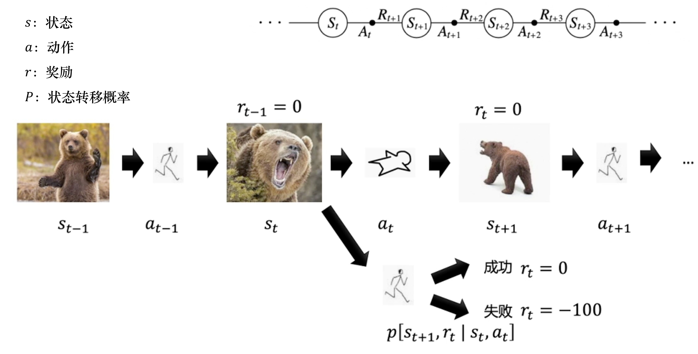

图 3.1 马尔可夫决策过程四元组

### 3.1.1 有模型 

如图 3.2 所示，我们把这些可能的动作和可能的状态转移的关系画成树状。它们之间的关系就是从 $s_t$ 到 $a_t$ ，再到 $s_{t+1}$ ，再到 $a_{t+1}$，再到 $s_{t+2}$ 的过程。
我们与环境交互时，只能走一条完整的通路，这里面产生了一系列决策的过程，我们与环境交互产生了经验。我们会使用**概率函数（probability function）**$P\left[s_{t+1}, r_{t} \mid s_{t}, a_{t}\right]$和奖励函数 $R\left[s_{t}, a_{t}\right]$来描述环境。概率函数就是状态转移的概率，它反映的是环境的随机性。

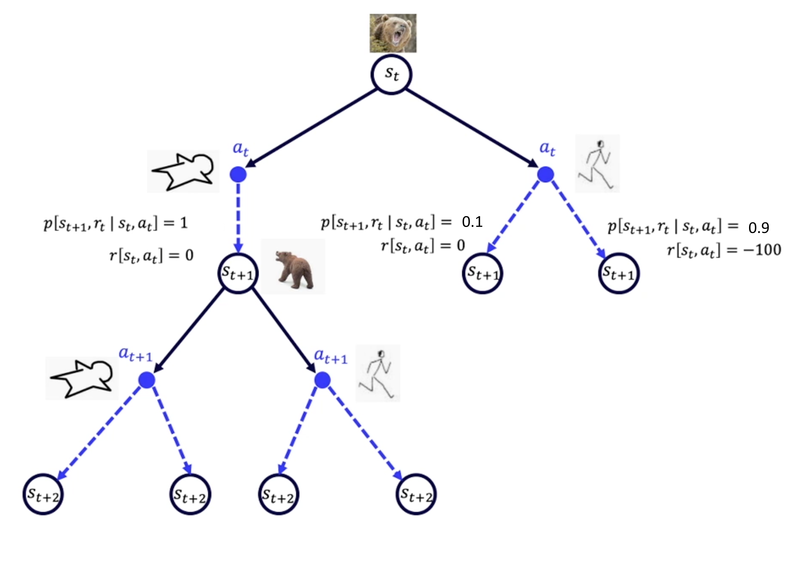

图 3.2 状态转移与序列决策

如果我们知道概率函数和奖励函数，马尔可夫决策过程就是已知的，我们可以通过策略迭代和价值迭代来找最佳的策略。
比如，在熊发怒的情况下，我如果选择装死，假设熊看到人装死就一定会走开，我们就称这里面的状态转移概率是 1。但如果在熊发怒的情况下，我选择逃跑而导致可能成功以及失败两种情况，转移到跑成功情况的概率大概 0.1，跑失败的概率大概是 0.9。

如果我们知道环境的状态转移概率和奖励函数，就可以认为这个环境是已知的，因为我们用这两个函数来描述环境。如果环境是已知的，我们其实可以用动态规划算法去计算，如果要逃脱，那么能够逃脱的概率最大的最佳策略是什么。

### 3.1.2 免模型 
很多强化学习的经典算法都是免模型的，也就是环境是未知的。
因为现实世界中人类第一次遇到熊时，我们根本不知道能不能逃脱，所以 0.1、0.9 的概率都是虚构出来的概率。熊到底在什么时候往什么方向转变，我们通常是不知道的。
我们处在未知的环境里，也就是这一系列的决策的概率函数和奖励函数是未知的，这就是有模型与免模型的最大的区别。

如图 3.3 所示，强化学习可以应用于完全未知的和随机的环境。强化学习像人类一样学习，人类通过尝试不同的路来学习，通过尝试不同的路，人类可以慢慢地了解哪个状态会更好。强化学习用价值函数 $V(S)$ 来表示状态是好的还是坏的，用 Q 函数来判断在什么状态下采取什么动作能够取得最大奖励，即用 Q 函数来表示状态-动作值。

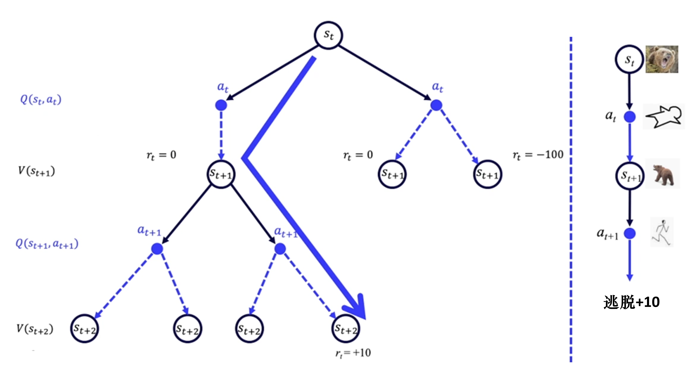

图 3.3 免模型试错探索

### 3.1.3 有模型与免模型的区别 

如图 3.4 所示，策略迭代和价值迭代都需要得到环境的转移和奖励函数，所以在这个过程中，智能体没有与环境进行交互。在很多实际的问题中，马尔可夫决策过程的模型有可能是未知的，也有可能因模型太大不能进行迭代的计算，比如雅达利游戏、围棋、控制直升飞机、股票交易等问题，这些问题的状态转移非常复杂。

图 3.4 有模型强化学习方法

如图 3.5 所示，当马尔可夫决策过程的模型未知或者模型很大时，我们可以使用免模型强化学习的方法。免模型强化学习方法没有获取环境的状态转移和奖励函数，而是让智能体与环境进行交互，采集大量的轨迹数据，智能体从轨迹中获取信息来改进策略，从而获得更多的奖励。

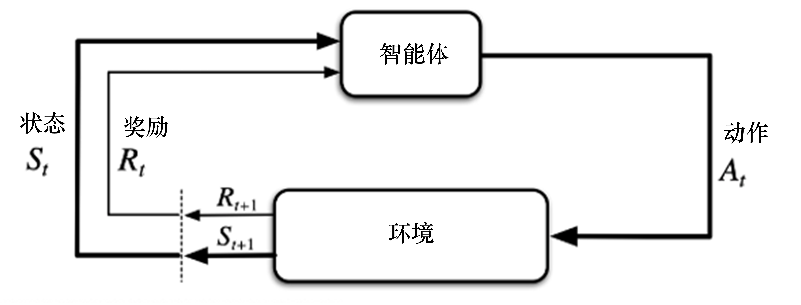

图 3.5 免模型强化学习方法

## 3.2 Q 表格 

在多次尝试和熊打交道之后，我们就可以对熊的不同的状态做出判断，用状态动作价值来表达在某个状态下某个动作的好坏。
如图 3.6 所示，如果 **Q 表格**是一张已经训练好的表格，这张表格就像是一本生活手册。通过查看这本手册，我们就知道在熊发怒的时候，装死的价值会高一点；在熊离开的时候，我们偷偷逃跑会比较容易获救。
这张表格里面 Q 函数的意义就是我们选择了某个动作后，最后能不能成功，就需要我们去计算在某个状态下选择某个动作，后续能够获得多少总奖励。如果可以预估未来的总奖励的大小，我们就知道在当前的状态下选择哪个动作价值更高。我们选择某个动作是因为这样未来可以获得的价值会更高。所以强化学习的目标导向性很强，环境给出的奖励是非常重要的反馈，它根据环境的奖励来做选择。

图 3.6 Q表格

Q: 为什么我们可以用未来的总奖励来评价当前动作是好是坏?

A: 例如，如图 3.7 所示，假设一辆车在路上，当前是红灯，我们直接闯红灯的奖励就很低，因为这违反了交通规则，我们得到的奖励是当前的单步奖励。可是如果我们的车是一辆救护车，我们正在运送病人，把病人快速送达医院的奖励非常高，而且越快奖励越高。在这种情况下，我们可能要闯红灯，因为未来的远期奖励太高了。这是因为在现实世界中奖励往往是延迟的，所以强化学习需要学习远期的奖励。我们一般会从当前状态开始，把后续有可能会收到的所有奖励加起来计算当前动作的 Q 值，让 Q 值可以真正代表当前状态下动作的真正价值。

图 3.7 未来的总奖励示例

但有的时候我们把目光放得太长远并不好。如果任务很快就结束，那么考虑到最后一步的奖励无可厚非。但如果任务是一个持续的没有尽头的任务，即**持续式任务（continuing task）**，我们把未来的奖励全部相加作为当前的状态价值就很不合理。
股票就是一个典型的例子，如图 3.8 所示，我们关注的是累积的股票奖励，可是如果10年之后股票才有一次大涨大跌，我们肯定不会把10年后的奖励也作为当前动作的考虑因素。这个时候，我们就可以引入折扣因子 $\gamma$ 来计算未来总奖励，$\gamma \in [0,1]$，越往后 $\gamma^n$ 就会越小，越后面的奖励对当前价值的影响就会越小。

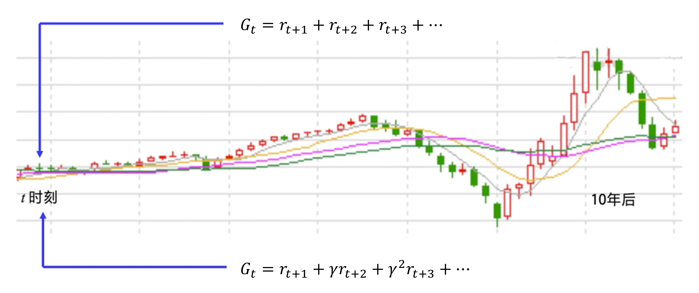

图 3.8 股票的例子

悬崖行走问题是强化学习的一个经典问题，如图 3.9 所示，
该问题需要智能体从出发点 S 出发，到达目的地 G，同时避免掉进悬崖（cliff），每走一步就有 $-$1分 的惩罚，掉进悬崖会有 $-$100 分的惩罚，但游戏不会结束，智能体会回到出发点，游戏继续，直到到达目的地结束游戏。智能体需要尽快地到达目的地。
为了到达目的地，智能体可以沿着例如蓝线和红线的路线行走。

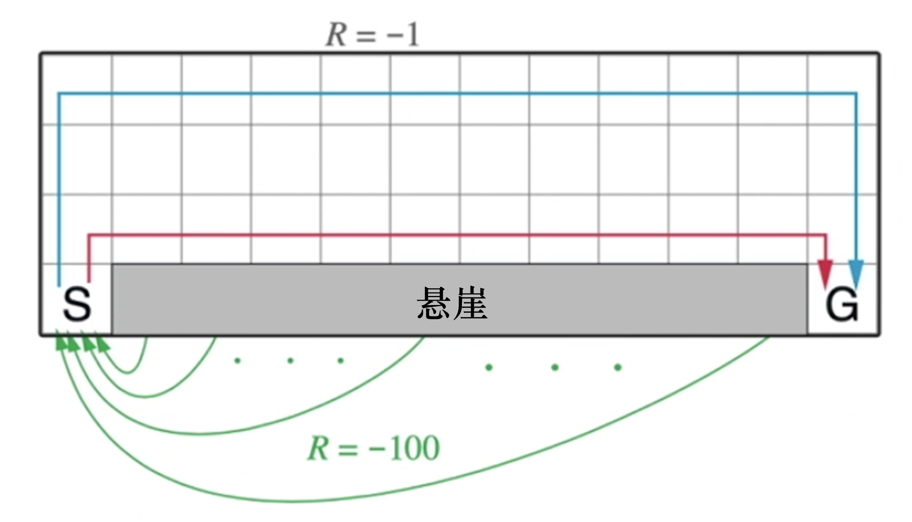

图 3.9 悬崖行走问题

在悬崖行走问题的环境中，我们怎么计算状态动作价值（未来的总奖励）呢？我们可以选择一条路线，计算出这条路线上每个状态动作的价值。在悬崖行走问题里面，智能体每走一步都会拿到 $-$1 分的奖励，只有到达目的地之后，智能体才会停止。
* 如果 $\gamma = 0$，如图 3.10a 所示，我们考虑的就是单步的奖励，我们可以认为它是目光短浅的计算的方法。
* 如果 $\gamma = 1$，如图 3.10b 所示，就等于把后续所有的奖励全部加起来，我们可以认为它是目光过于长远的方法。如果智能体走的不是红色的路线，而是蓝色的路线，算出来的 Q 值可能如图中所示。因此，我们就可以知道，当小乌龟在 $-$12 的时候，往右走是 $-$11，往上走是 $-$15，它知道往右走的价值更大，它就会往右走。
* 如果 $\gamma = 0.6$，如图 3.10c 所示，
	我们的目光没有放得太长远，计算结果如式(3.1)所示。我们可以利用公式 $G_{t}=r_{t+1}+\gamma G_{t+1}$ 从后往前推。
$$
\begin{array}{l}
G_{13}=0 \\
G_{12}=r_{13}+\gamma G_{13}=-1+0.6 \times 0=-1 \\
G_{11}=r_{12}+\gamma G_{12}=-1+0.6 \times(-1)=-1.6 \\
G_{10}=r_{11}+\gamma G_{11}=-1+0.6 \times(-1.6)=-1.96 \\
G_{9}=r_{10}+\gamma G_{10}=-1+0.6 \times(-1.96)=-2.176 \approx-2.18 \\
G_{8}=r_{9}+\gamma G_{9}=-1+0.6 \times(-2.176)=-2.3056 \approx-2.3 \\
\end{array} 
$$

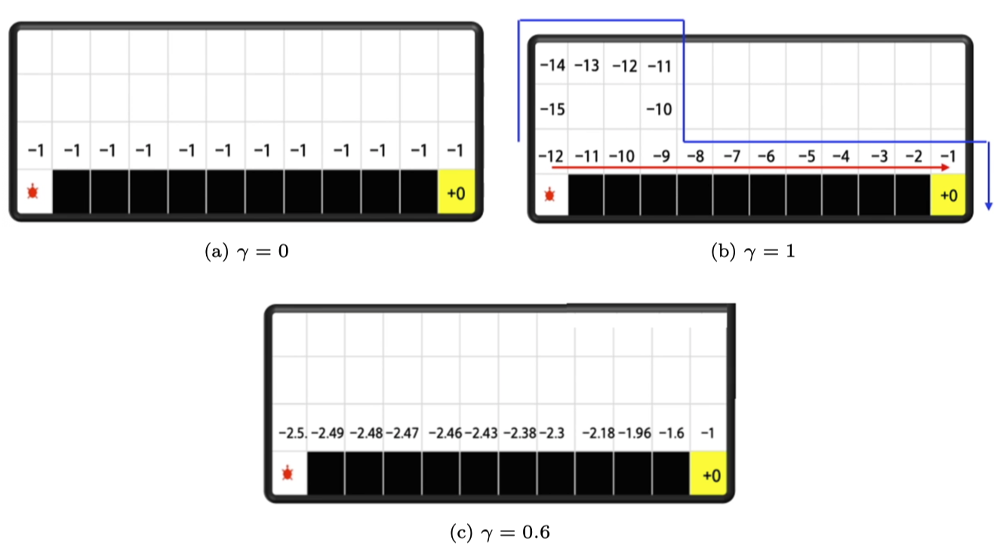

图 3.10 折扣因子

类似于图 3.11，最后我们要求解的就是一张 Q 表格，它的行数是所有状态的数量，一般可以用坐标来表示格子的状态，也可以用 1、2、3、4、5、6、7 来表示不同的位置。Q 表格的列表示上、下、左、右4个动作。
最开始的时候，Q 表格会全部初始化为0。智能体会不断和环境交互得到不同的轨迹，当交互的次数足够多的时候，我们就可以估算出每一个状态下，每个动作的平均总奖励，进而更新 Q  表格。Q表格的更新就是接下来要引入的强化概念。

图 3.11 Q表格

**强化**是指我们可以用下一个状态的价值来更新当前状态的价值，其实就是强化学习里面自举的概念。在强化学习里面，我们可以每走一步更新一次 Q 表格，用下一个状态的 Q 值来更新当前状态的 Q 值，这种单步更新的方法被称为时序差分方法。

## 3.3 免模型预测 

在无法获取马尔可夫决策过程的模型情况下，我们可以通过蒙特卡洛方法和时序差分方法来估计某个给定策略的价值。

### 3.3.1 蒙特卡洛策略评估
**蒙特卡洛**方法是基于采样的方法，给定策略 $\pi$，我们让智能体与环境进行交互，可以得到很多轨迹。每个轨迹都有对应的回报：

$$
G_{t}=r_{t+1}+\gamma r_{t+2}+\gamma^{2} r_{t+3}+\ldots
$$

我们求出所有轨迹的回报的平均值，就可以知道某一个策略对应状态的价值，即 
$$
V_{\pi}(s)=\mathbb{E}_{\tau \sim \pi}\left[G_{t} \mid  s_{t}=s\right]
$$

蒙特卡洛仿真是指我们可以采样大量的轨迹，计算所有轨迹的真实回报，然后计算平均值。蒙特卡洛方法使用经验平均回报（empirical mean return）的方法来估计，它不需要马尔可夫决策过程的状态转移函数和奖励函数，并且不需要像动态规划那样用自举的方法。此外，蒙特卡洛方法有一定的局限性，它只能用在有终止的马尔可夫决策过程中。

接下来，我们对蒙特卡洛方法进行总结。为了得到评估 $V(s)$，我们采取了如下的步骤。

（1）在每个回合中，如果在时间步 $t$ 状态 $s$ 被访问了，那么

* 状态 $s$ 的访问数 $N(s)$ 增加 1，$N(s)\leftarrow N(s)+1$。
* 状态 $s$ 的总的回报 $S(s)$  增加 $G_t$，$S(s)\leftarrow S(s)+G_t$。

（2）状态 $s$ 的价值可以通过回报的平均来估计，即 $V(s)=S(s)/N(s)$。 

根据大数定律，只要我们得到足够多的轨迹，就可以趋近这个策略对应的价值函数。当 $N(s)\rightarrow \infty$ 时，$V(s) \rightarrow V_{\pi}(s)$。

假设现在有样本 $x_1,x_2,\cdots, x_t$，我们可以把经验均值（empirical mean）转换成增量均值（incremental mean）的形式：
$$
\begin{aligned}
	\mu_{t} &=\frac{1}{t} \sum_{j=1}^{t} x_{j} \\
	&=\frac{1}{t}\left(x_{t}+\sum_{j=1}^{t-1} x_{j}\right) \\
	&=\frac{1}{t}\left(x_{t}+(t-1) \mu_{t-1}\right) \\
	&=\frac{1}{t}\left(x_{t}+t \mu_{t-1}-\mu_{t-1}\right) \\
	&=\mu_{t-1}+\frac{1}{t}\left(x_{t}-\mu_{t-1}\right) 
	\end{aligned}
$$
通过这种转换，我们就可以把上一时刻的平均值与现在时刻的平均值建立联系，即
$$
	\mu_t = \mu_{t-1}+\frac{1}{t}(x_t-\mu_{t-1})
$$
其中，$x_t- \mu_{t-1}$ 是残差，$\frac{1}{t}$ 类似于学习率（learning rate）。
当我们得到 $x_t$时，就可以用上一时刻的值来更新现在的值。

我们可以把蒙特卡洛方法更新的方法写成增量式蒙特卡洛（incremental MC）方法。我们采集数据，得到一个新的轨迹 $(s_1,a_1,r_1,\dots,s_t)$。对于这个轨迹，我们采用增量的方法进行更新：

$$
\begin{array}{l}
N\left(s_{t}\right) \leftarrow N\left(s_{t}\right)+1 \\
V\left(s_{t}\right) \leftarrow V\left(s_{t}\right)+\frac{1}{N\left(s_{t}\right)}\left(G_{t}-V\left(s_{t}\right)\right)
\end{array}	
$$

我们可以直接把 $\frac{1}{N(s_t)}$ 变成 $\alpha$（学习率），即
$$
	V\left(s_{t}\right) \leftarrow V\left(s_{t}\right)+\alpha\left(G_{t}-V\left(s_{t}\right)\right)
$$
其中，$\alpha$ 代表更新的速率，我们可以对其进行设置。

我们再来看一下动态规划方法和蒙特卡洛方法的差异。动态规划也是常用的估计价值函数的方法。在动态规划方法里面，我们使用了自举的思想。自举就是我们基于之前估计的量来估计一个量。此外，动态规划方法使用贝尔曼期望备份（Bellman expectation backup），通过上一时刻的值 $V_{i-1}(s')$ 来更新当前时刻的值 $V_i(s)$ ，即
$$
V_{i}(s) \leftarrow \sum_{a \in A} \pi(a \mid s)\left(R(s, a)+\gamma \sum_{s^{\prime} \in S} P\left(s^{\prime} \mid s, a\right) V_{i-1}\left(s^{\prime}\right)\right)
$$
将其不停迭代，最后可以收敛。如图 3.12 所示，贝尔曼期望备份有两层加和，即内部加和和外部加和，计算两次期望，得到一个更新。

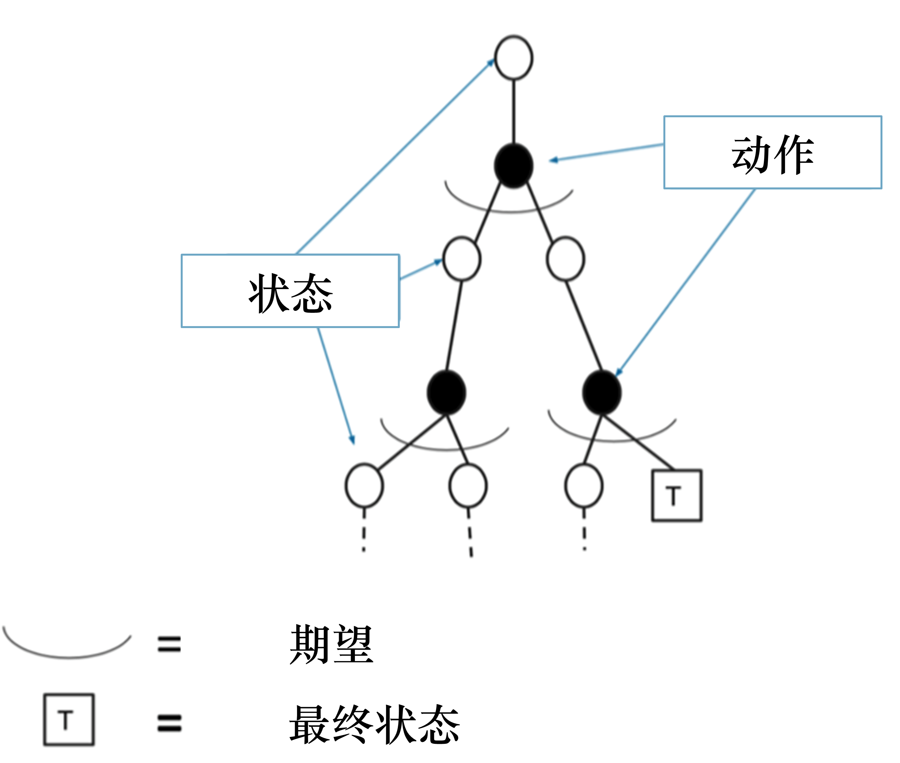

图 3.12 贝尔曼期望备份

蒙特卡洛方法通过一个回合的经验平均回报（实际得到的奖励）来进行更新，即
$$
	V\left(s_{t}\right) \leftarrow V\left(s_{t}\right)+\alpha\left(G_{i, t}-V\left(s_{t}\right)\right)
$$

如图 3.13 所示，我们使用蒙特卡洛方法得到的轨迹对应树上蓝色的轨迹，轨迹上的状态已经是决定的，采取的动作也是已经决定的。我们现在只更新这条轨迹上的所有状态，与这条轨迹没有关系的状态都不进行更新。

图 3.13 蒙特卡洛方法更新

蒙特卡洛方法相比动态规划方法是有一些优势的。首先，蒙特卡洛方法适用于环境未知的情况，而动态规划是有模型的方法。
蒙特卡洛方法只需要更新一条轨迹的状态，而动态规划方法需要更新所有的状态。状态数量很多的时候（比如100万个、200万个），我们使用动态规划方法进行迭代，速度是非常慢的。这也是基于采样的蒙特卡洛方法相对于动态规划方法的优势。

### 3.3.2 时序差分 

为了让读者更好地理解时序差分这种更新方法，我们给出它的“物理意义”。我们先了解一下巴甫洛夫的条件反射实验，如图 3.14 所示，这个实验讲的是小狗会对盆里面的食物无条件产生刺激，分泌唾液。一开始小狗对于铃声这种中性刺激是没有反应的，可是我们把铃声和食物结合起来，每次先给它响一下铃，再给它喂食物，多次重复之后，当铃声响起的时候，小狗也会开始流口水。盆里的肉可以认为是强化学习里面那个延迟的奖励，声音的刺激可以认为是有奖励的那个状态之前的状态。多次重复实验之后，最后的奖励会强化小狗对于声音的条件反射，它会让小狗知道这个声音代表着有食物，这个声音对于小狗也就有了价值，它听到这个声音就会流口水。

图 3.14 强化概念：巴甫洛夫的条件反射实验

如图 3.15 所示，巴甫洛夫效应揭示的是，当中性刺激（铃声）与无条件刺激（食物）相邻反复出现的时候，中件刺激也可以引起无条件刺激引起的唾液分泌，然后形成条件刺激。
我们称这种中性刺激与无条件刺激在时间上面的结合为强化，强化的次数越多，条件反射就会越巩固。小狗本来不觉得铃声有价值的，经过强化之后，小狗就会慢慢地意识到铃声也是有价值的，它可能带来食物。更重要的是当一种条件反射巩固之后，我们再用另外一种新的刺激和条件反射相结合，还可以形成第二级条件反射，同样地还可以形成第三级条件反射。

在人的身上也可以建立多级的条件反射，例如，比如我们遇到熊可能是这样一个顺序：看到树上有熊爪，然后看到熊，突然熊发怒并扑过来了。经历这个过程之后，我们可能最开始看到熊才会害怕，后面可能看到树上有熊爪就已经有害怕的感觉了。在不断的重复实验后，下一个状态的价值可以不断地强化影响上一个状态的价值。

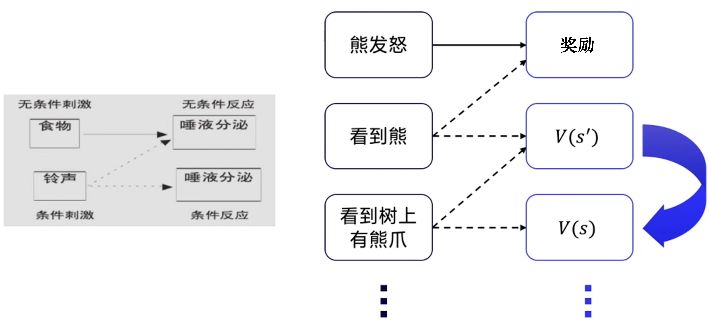

图 3.15 强化示例

为了让读者更加直观地感受下一个状态会如何影响上一个状态（状态价值迭代），我们推荐[时序差分学习网格世界演示](https://cs.stanford.edu/people/karpathy/reinforcejs/gridworld_td.html)。
如图 3.16 所示，我们先初始化，然后开始时序差分方法的更新过程。
在训练的过程中，小黄球在不断地试错，在探索中会先迅速地发现有奖励的格子。最开始的时候，有奖励的格子才有价值。当小黄球不断地重复走这些路线的时候，有价值的格子可以慢慢地影响它附近的格子的价值。
反复训练之后，有奖励的格子周围的格子的状态就会慢慢被强化。强化就是价值最终收敛到最优的情况之后，小黄球就会自动往价值高的格子走，就可以走到能够拿到奖励的格子。

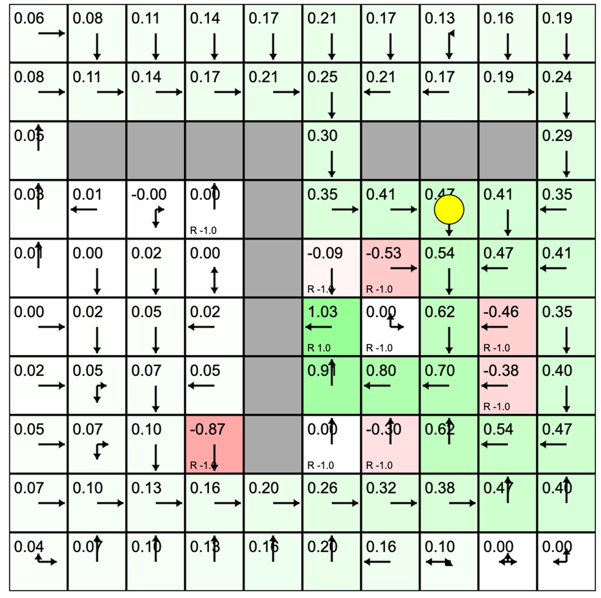

图 3.16 时序差分学习网格世界演示

下面我们开始正式介绍时序差分方法。
时序差分是介于蒙特卡洛和动态规划之间的方法，它是免模型的，不需要马尔可夫决策过程的转移矩阵和奖励函数。
此外，时序差分方法可以从不完整的回合中学习，并且结合了自举的思想。

接下来，我们对时序差分方法进行总结。时序差分方法的目的是对于某个给定的策略 $\pi$，在线（online）地算出它的价值函数 $V_{\pi}$，即一步一步地（step-by-step）算。
最简单的算法是**一步时序差分（one-step TD）**，即TD(0)。每往前走一步，就做一步自举，用得到的估计回报（estimated return）$r_{t+1}+\gamma V(s_{t+1})$ 来更新上一时刻的值 $V(s_t)$：
$$
  V\left(s_{t}\right) \leftarrow V\left(s_{t}\right)+\alpha\left(r_{t+1}+\gamma V\left(s_{t+1}\right)-V\left(s_{t}\right)\right) \tag{3.1}
$$
估计回报 $r_{t+1}+\gamma V(s_{t+1})$ 被称为**时序差分目标（TD target）**，
时序差分目标是带衰减的未来奖励的总和。时序差分目标由两部分组成：

（1）我们走了某一步后得到的实际奖励$r_{t+1}$；

（2）我们利用了自举的方法，通过之前的估计来估计 $V(s_{t+1})$  ，并且加了折扣因子，即 $\gamma V(s_{t+1})$。

时序差分目标是估计有两个原因：

（1）时序差分方法对期望值进行采样；

（2）时序差分方法使用当前估计的 $V$ 而不是真实的 $V_{\pi}$。

**时序差分误差（TD error）** $\delta=r_{t+1}+\gamma V(s_{t+1})-V(s_t)$。
类比增量式蒙特卡洛方法，给定一个回合 $i$，我们可以更新 $V(s_t)$ 来逼近真实的回报 $G_t$，具体更新公式为
$$
V\left(s_{t}\right) \leftarrow V\left(s_{t}\right)+\alpha\left(G_{i, t}-V\left(s_{t}\right)\right)
$$
式(3.1)体现了强化的概念。

我们对比一下蒙特卡洛方法和时序差分方法。在蒙特卡洛方法里面，$G_{i,t}$ 是实际得到的值（可以看成目标），因为它已经把一条轨迹跑完了，可以算出每个状态实际的回报。时序差分不等轨迹结束，往前走一步，就可以更新价值函数。 
如图 3.17 所示，时序差分方法只执行一步，状态的值就更新。蒙特卡洛方法全部执行完之后，到了终止状态之后，再更新它的值。

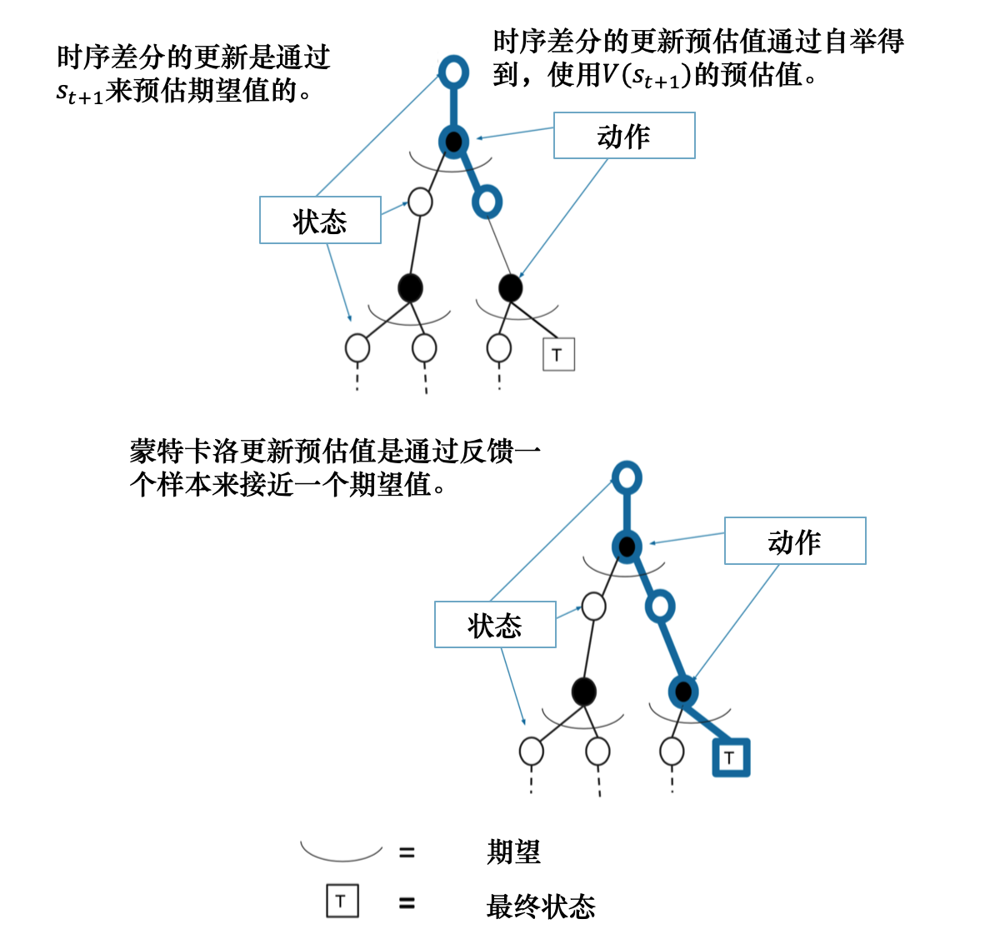

图 3.17 时序差分方法相比蒙特卡洛方法的优势

接下来，进一步比较时序差分方法和蒙特卡洛方法。

（1）时序差分方法可以在线学习（online learning），每走一步就可以更新，效率高。蒙特卡洛方法必须等游戏结束时才可以学习。

（2）时序差分方法可以从不完整序列上进行学习。蒙特卡洛方法只能从完整的序列上进行学习。

（3）时序差分方法可以在连续的环境下（没有终止）进行学习。蒙特卡洛方法只能在有终止的情况下学习。

（4）时序差分方法利用了马尔可夫性质，在马尔可夫环境下有更高的学习效率。蒙特卡洛方法没有假设环境具有马尔可夫性质，利用采样的价值来估计某个状态的价值，在不是马尔可夫的环境下更加有效。

例如来解释 时序差分方法和蒙特卡洛方法的区别。
时序差分方法是指在不清楚马尔可夫状态转移概率的情况下，以采样的方式得到不完整的状态序列，估计某状态在该状态序列完整后可能得到的奖励，并通过不断地采样持续更新价值。蒙特卡洛则需要经历完整的状态序列后，再来更新状态的真实价值。
例如，我们想获得开车去公司的时间，每天上班开车的经历就是一次采样。假设我们今天在路口 A 遇到了堵车，
时序差分方法会在路口 A 就开始更新预计到达路口 B、路口 C $\cdots \cdots$，以及到达公司的时间；
而蒙特卡洛方法并不会立即更新时间，而是在到达公司后，再更新到达每个路口和公司的时间。
时序差分方法能够在知道结果之前就开始学习，相比蒙特卡洛方法，其更快速、灵活。

如图 3.18 所示，我们可以把时序差分方法进行进一步的推广。之前是只往前走一步，即TD(0)。
我们可以调整步数（step），变成 **$n$步时序差分（$n$-step TD）**。比如 TD(2)，即往前走两步，利用两步得到的回报，使用自举来更新状态的价值。

$\qquad\qquad\qquad\qquad\qquad\qquad\qquad\qquad\qquad\qquad\qquad\qquad$ 图 3.18 $n$步时序差分

这样我们就可以通过步数来调整算法需要的实际奖励和自举。

$$
\begin{array}{lcl}
n=1\text{（TD）} &G_{t}^{(1)}&=r_{t+1}+\gamma V\left(s_{t+1}\right) \\
n=2 &G_{t}^{(2)}&= r_{t+1}+\gamma r_{t+2}+\gamma^{2} V\left(s_{t+2}\right) \\
& &\vdots \\
n=\infty\text{（MC）} &G_{t}^{\infty}&=r_{t+1}+\gamma r_{t+2}+\ldots+\gamma^{T-t-1} r_{T}
\end{array} \tag{3.2}
$$

如式(3.2)所示，通过调整步数，可以进行蒙特卡洛方法和时序差分方法之间的权衡。如果 $n=\infty$， 即整个游戏结束后，再进行更新，时序差分方法就变成了蒙特卡洛方法。

$n$步时序差分可写为

$$
G_{t}^{n}=r_{t+1}+\gamma r_{t+2}+\ldots+\gamma^{n-1} r_{t+n}+\gamma^{n} V\left(s_{t+n}\right)
$$

得到时序差分目标之后，我们用增量式学习（incremental learning）的方法来更新状态的价值：

$$
V\left(s_{t}\right) \leftarrow V\left(s_{t}\right)+\alpha\left(G_{t}^{n}-V\left(s_{t}\right)\right)
$$

### 3.3.3 动态规划方法、蒙特卡洛方法以及时序差分方法的自举和采样 
自举是指更新时使用了估计。蒙特卡洛方法没有使用自举，因为它根据实际的回报进行更新。
动态规划方法和时序差分方法使用了自举。

采样是指更新时通过采样得到一个期望。
蒙特卡洛方法是纯采样的方法。
动态规划方法没有使用采样，它是直接用贝尔曼期望方程来更新状态价值的。
时序差分方法使用了采样。时序差分目标由两部分组成，一部分是采样，一部分是自举。

如图 3.19 所示，动态规划方法直接计算期望，它把所有相关的状态都进行加和，即
$$
	V\left(s_{t}\right) \leftarrow \mathbb{E}_{\pi}\left[r_{t+1}+\gamma V\left(s_{t+1}\right)\right]
$$

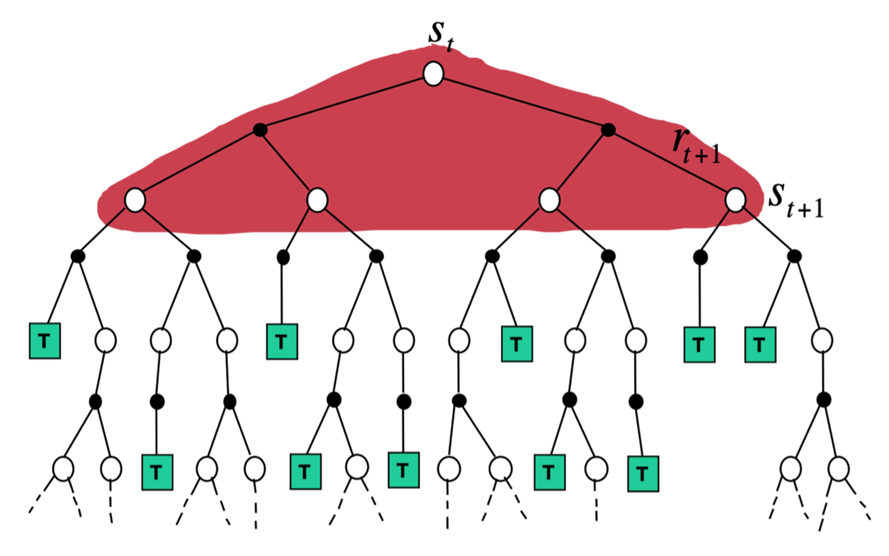

图 3.19 统一视角：动态规划方法备份

如图 3.20 所示，蒙特卡洛方法在当前状态下，采取一条支路，在这条路径上进行更新，更新这条路径上的所有状态，即
$$
V\left(s_{t}\right) \leftarrow V\left(s_{t}\right)+\alpha\left(G_{t}-V\left(s_{t}\right)\right)
$$

图 3.20 统一视角：蒙特卡洛备份

如图 3.20 所示，时序差分从当前状态开始，往前走了一步，关注的是非常局部的步骤，即
$$
	\text{TD}(0): V\left(s_{t}\right) \leftarrow V\left(s_{t}\right)+\alpha\left(r_{t+1}+\gamma V\left(s_{t+1}\right)-V\left(s_{t}\right)\right)
$$

图 3.21 统一视角：时序差分方法备份

如图 3.22 所示，如果 时序差分方法需要更广度的更新，就变成了 动态规划方法（因为动态规划方法是把所有状态都考虑进去来进行更新）。如果时序差分方法需要更深度的更新，就变成了蒙特卡洛方法。图 3.22 右下角是穷举搜索的方法（exhaustive search），穷举搜索的方法不仅需要很深度的信息，还需要很广度的信息。

图 3.22 强化学习的统一视角

## 3.4 免模型控制 
在我们不知道马尔可夫决策过程模型的情况下，如何优化价值函数，得到最佳的策略呢？我们可以把策略迭代进行广义的推广，使它能够兼容蒙特卡洛和时序差分的方法，即带有蒙特卡洛方法和时序差分方法的**广义策略迭代（generalized policy iteration，GPI）**。

如图 3.23 所示，策略迭代由两个步骤组成。第一，我们根据给定的当前策略 $\pi$ 来估计价值函数；第二，得到估计的价值函数后，我们通过贪心的方法来改进策略，即
$$
\pi^{'}=\text{贪心函数}(V_{\pi})
$$

这两个步骤是一个互相迭代的过程。

$$
\pi_{i+1}(s)=\underset{a}{\arg \max } Q_{\pi_{i}}(s, a) \tag{3.3}
$$

我们可以计算出策略 $\pi$ 的动作价值函数，并且可以根据式（3.3）来计算针对状态 $s \in S$ 的新策略 $\pi_{i+1}$。但得到状态价值函数后，我们并不知道奖励函数 $R(s,a)$ 和状态转移 $P(s'|s,a)$，所以就无法估计 Q 函数
$$
Q_{\pi_{i}}(s, a)=R(s, a)+\gamma \sum_{s^{\prime} \in S} P\left(s^{\prime} \mid s, a\right) V_{\pi_{i}}\left(s^{\prime}\right)
$$

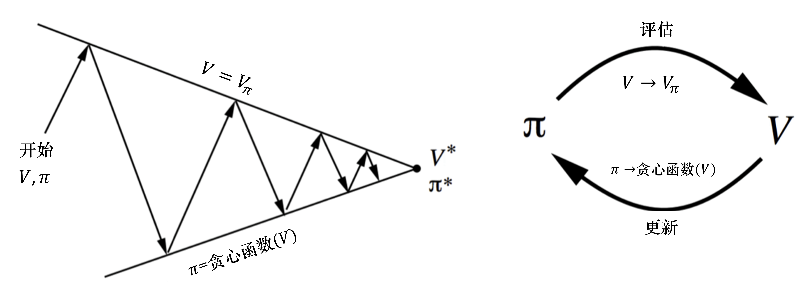

图 3.23 策略迭代

这里有一个问题：当我们不知道奖励函数和状态转移时，如何进行策略的优化？

如图 3.24 所示，针对上述情况，我们引入了广义的策略迭代的方法。
我们对策略评估部分进行修改，使用蒙特卡洛的方法代替动态规划的方法估计 Q 函数。我们首先进行策略评估，使用蒙特卡洛方法来估计策略 $Q=Q_{\pi}$，然后进行策略更新，即得到 Q 函数后，我们就可以通过贪心的方法去改进它：
$$
\pi(s)=\underset{a}{\arg \max} Q(s, a)
$$

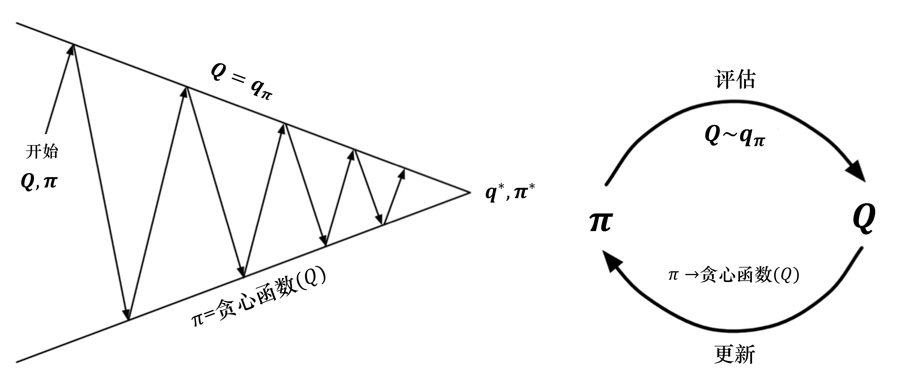

图 3.24 广义策略迭代

图 3.25 所示为蒙特卡洛方法估计 Q 函数的算法。
一个保证策略迭代收敛的假设是回合有**探索性开始（exploring start）**。
假设每一个回合都有一个探索性开始，探索性开始保证所有的状态和动作都在无限步的执行后能被采样到，这样才能很好地进行估计。
算法通过蒙特卡洛方法产生很多轨迹，每条轨迹都可以算出它的价值。然后，我们可以通过平均的方法去估计 Q 函数。Q 函数可以看成一个Q表格，我们通过采样的方法把表格的每个单元的值都填上，然后使用策略改进来选取更好的策略。
如何用蒙特卡洛方法来填 Q 表格是这个算法的核心。

图 3.25 基于探索性开始的蒙特卡洛方法

为了确保蒙特卡洛方法能够有足够的探索，我们使用了 $\varepsilon$-贪心（$\varepsilon\text{-greedy}$）探索。
$\varepsilon$-贪心是指我们有 $1-\varepsilon$ 的概率会按照 Q函数来决定动作，通常 $\varepsilon$ 就设一个很小的值， $1-\varepsilon$ 可能是 0.9，也就是 0.9 的概率会按照Q函数来决定动作，但是我们有 0.1 的概率是随机的。通常在实现上，$\varepsilon$ 的值会随着时间递减。在最开始的时候，因为我们还不知道哪个动作是比较好的，所以会花比较多的时间探索。接下来随着训练的次数越来越多，我们已经比较确定哪一个动作是比较好的，就会减少探索，把 $\varepsilon$ 的值变小。主要根据 Q函数来决定动作，比较少随机决定动作，这就是 $\varepsilon$-贪心。

当我们使用蒙特卡洛方法和 $\varepsilon$-贪心探索的时候，可以确保价值函数是单调的、改进的。对于任何 $\varepsilon$-贪心策略 $\pi$，关于 $Q_{\pi}$ 的 $\varepsilon$-贪心策略 $\pi^{\prime}$ 都是一个改进，即 $V_{\pi}(s) \leqslant V_{\pi^{\prime}}(s)$，证明过程如下：

$$
\begin{aligned}
	Q_{\pi}\left(s, \pi^{\prime}(s)\right) &=\sum_{a \in A} \pi^{\prime}(a \mid s) Q_{\pi}(s, a) \\
	&=\frac{\varepsilon}{|A|} \sum_{a \in A} Q_{\pi}(s, a)+(1-\varepsilon) \max _{a} Q_{\pi}(s, a) \\
	& \geqslant \frac{\varepsilon}{|A|} \sum_{a \in A} Q_{\pi}(s, a)+(1-\varepsilon) \sum_{a \in A} \frac{\pi(a \mid s)-\frac{\varepsilon}{|A|}}{1-\varepsilon} Q_{\pi}(s, a) \\
	&=\sum_{a \in A} \pi(a \mid s) Q_{\pi}(s, a)=V_{\pi}(s)
	\end{aligned}
$$

基于 $\varepsilon$-贪心探索的蒙特卡洛方法如图 3.26 所示。

$\qquad\qquad\qquad\qquad\qquad\qquad\qquad\qquad\qquad$ 图 3.26 基于 $\varepsilon$-贪心探索的蒙特卡洛方法

与蒙特卡洛方法相比，时序差分方法有如下几个优势：低方差，能够在线学习，能够从不完整的序列中学习。
所以我们可以把时序差分方法也放到控制循环（control loop）里面去估计Q表格，再采取 $\varepsilon$-贪心探索改进。这样就可以在回合没结束的时候更新已经采集到的状态价值。  

>偏差（bias）：描述的是预测值（估计值）的期望与真实值之间的差距。偏差越高，越偏离真实数据，如图 3.27 第2行所示。
方差（variance）：描述的是预测值的变化范围、离散程度，也就是离其期望值的距离。方差越高，数据的分布越分散，如图 3.27 右列所示。

图 3.27 偏差-方差

### 3.4.1 Sarsa：同策略时序差分控制 

时序差分方法是给定一个策略，然后我们去估计它的价值函数。接着我们要考虑怎么使用时序差分方法的框架来估计Q函数，也就是 Sarsa 算法。

Sarsa 所做出的改变很简单，它将原本时序差分方法更新 $V$ 的过程，变成了更新 $Q$，即
$$
	Q\left(s_{t}, a_{t}\right) \leftarrow Q\left(s_{t}, a_{t}\right)+\alpha\left[r_{t+1}+\gamma Q\left(s_{t+1}, a_{t+1}\right)-Q\left(s_{t}, a_{t}\right)\right] \tag{3.4}
$$

式(3.4)是指我们可以用下一步的 Q 值 $Q(s_{t+_1},a_{t+1})$ 来更新这一步的 Q 值 $Q(s_t,a_t)$ 。
Sarsa 直接估计 Q 表格，得到 Q 表格后，就可以更新策略。

为了理解式(3.4)，
如图 3.28 所示，我们先把 $r_{t+1}+\gamma Q\left(s_{t+1}, a_{t+1}\right.)$ 当作目标值，即 $Q(s_t,a_t)$ 想要逼近的目标值。$r_{t+1}+\gamma Q\left(s_{t+1}, a_{t+1}\right.)$ 就是时序差分目标。

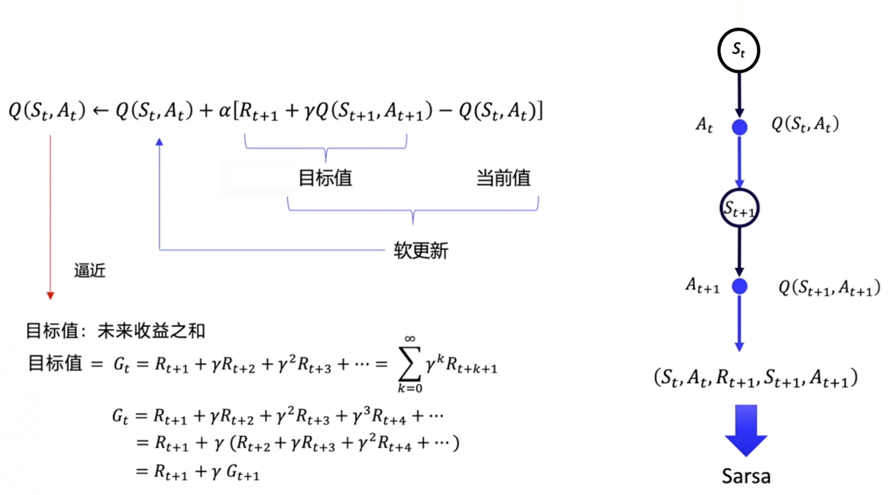

图 3.28 时序差分单步更新

我们想要计算的就是 $Q(s_t,a_t)$ 。因为最开始 Q 值都是随机初始化或者是初始化为0，所以它需要不断地去逼近它理想中真实的 Q 值（时序差分目标），$r_{t+1}+\gamma Q\left(s_{t+1}, a_{t+1}\right)-Q\left(s_{t}, a_{t}\right)$ 就是时序差分误差。
我们用 $Q(s_t,a_t)$ 来逼近 $G_t$，那么 $Q(s_{t+1},a_{t+1})$ 其实就是近似 $G_{t+1}$。我们就可以用  $Q(s_{t+1},a_{t+1})$ 近似 $G_{t+1}$，把  $r_{t+1}+\gamma Q(s_{t+1},a_{t+1})$  当成目标值。
$Q(s_t,a_t)$  要逼近目标值，我们用软更新的方式来逼近。软更新的方式就是每次我们只更新一点点，$\alpha$ 类似于学习率。最终Q 值是可以慢慢地逼近真实的目标值的。这样更新公式只需要用到当前时刻的 $s_{t}$、$a_t$，还有获取的 $r_{t+1}$、$s_{t+1}$、$a_{t+1}$ 。

该算法由于每次更新值函数时需要知道当前的状态（state）、当前的动作（action）、奖励（reward）、下一步的状态（state）、下一步的动作（action），即 $(s_{t}, a_{t}, r_{t+1}, s_{t+1}, a_{t+1})$ 这几个值 ，因此得名 **Sarsa** 算法。它走了一步之后，获取了 $(s_{t}, a_{t}, r_{t+1}, s_{t+1}, a_{t+1})$  之后，就可以做一次更新。

如图 3.29 所示，Sarsa 的更新公式可写为
$$
	Q(S, A) \leftarrow Q(S, A)+\alpha\left(R+\gamma Q\left(S^{\prime}, A^{\prime}\right)-Q(S, A)\right)
$$

Sarsa的更新公式与时序差分方法的公式是类似的。$S'$ 就是 $s_{t+1}$ 。我们就是用下一步的 Q 值 $Q(S',A')$ 来更新这一步的 Q 值 $Q(S,A)$，不断地强化每一个 Q 值。
$$
\begin{array}{lrl}
	{n=1}\text {（Sarsa）} &Q_{t}^{1}&=r_{t+1}+\gamma Q\left(s_{t+1}, a_{t+1}\right) \\
	n=2 &Q_{t}^{2}&=r_{t+1}+\gamma r_{t+2}+\gamma^{2} Q\left(s_{t+2}, a_{t+2}\right) \\
	&&\vdots \\
	n=\infty\text{（MC）} \quad &Q_{t}^{\infty}&=r_{t+1}+\gamma r_{t+2}+\ldots+\gamma^{T-t-1} r_{T}
	\end{array} \tag{3.5}
$$

我们考虑 $n$ 步的回报（$n=1,2,\cdots,\infty$），如式(3.5)所示。Sarsa 属于单步更新算法，每执行一个动作，就会更新一次价值和策略。如果不进行单步更新，而是采取 $n$ 步更新或者回合更新，即在执行 $n$ 步之后再更新价值和策略，这样我们就得到了 **$n$ 步 Sarsa（$n$-step Sarsa）**。

图 3.29 Sarsa算法

比如 2步 Sarsa 就是执行两步后再来更新 Q函数的值。
对于 Sarsa，在 $t$ 时刻的价值为
$$
	Q_{t}=r_{t+1}+\gamma Q\left(s_{t+1}, a_{t+1}\right)
$$
而对于 $n$ 步 Sarsa，它的 $n$ 步 Q 回报为
$$
	Q_{t}^{n}=r_{t+1}+\gamma r_{t+2}+\ldots+\gamma^{n-1} r_{t+n}+\gamma^{n} Q\left(s_{t+n}, a_{t+n}\right)
$$
如果给 $Q_t^{n}$ 加上资格迹衰减参数（decay-rate parameter for eligibility traces）$\lambda$ 并进行求和，即可得到 Sarsa($\lambda$) 的 Q 回报
$$
	Q_{t}^{\lambda}=(1-\lambda) \sum_{n=1}^{\infty} \lambda^{n-1} Q_{t}^{n}
$$
因此，$n$ 步 Sarsa($\lambda$) 的更新策略为
$$
	Q\left(s_{t}, a_{t}\right) \leftarrow Q\left(s_{t}, a_{t}\right)+\alpha\left(Q_{t}^{\lambda}-Q\left(s_{t}, a_{t}\right)\right)
$$
总之，Sarsa 和 Sarsa($\lambda$) 的差别主要体现在价值的更新上。

了解单步更新的基本公式之后，代码实现就很简单了。如图 3.30 所示，右边是环境，左边是智能体。智能体每与环境交互一次之后，就可以学习一次，向环境输出动作，从环境当中获取状态和奖励。智能体主要实现两个方法：

（1）根据 Q 表格选择动作，输出动作；

（2）获取 $(s_{t}, a_{t}, r_{t+1}, s_{t+1}, a_{t+1})$  这几个值更新 Q 表格。

图 3.30 Sarsa代码实现示意

### 3.4.2 Q学习：异策略时序差分控制 

Sarsa 是一种**同策略（on-policy）**算法，它优化的是它实际执行的策略，它直接用下一步会执行的动作去优化 Q 表格。同策略在学习的过程中，只存在一种策略，它用一种策略去做动作的选取，也用一种策略去做优化。所以 Sarsa 知道它下一步的动作有可能会跑到悬崖那边去，它就会在优化自己的策略的时候，尽可能离悬崖远一点。这样子就会保证，它下一步哪怕是有随机动作，它也还是在安全区域内。

Q学习是一种**异策略（off-policy）**算法。如图 3.31 所示，异策略在学习的过程中，有两种不同的策略：**目标策略（target policy）**和**行为策略（behavior policy）**。
目标策略是我们需要去学习的策略，一般用 $\pi$ 来表示。目标策略就像是在后方指挥战术的一个军师，它可以根据自己的经验来学习最优的策略，不需要去和环境交互。
行为策略是探索环境的策略，一般用 $\mu$ 来表示。行为策略可以大胆地去探索到所有可能的轨迹，采集轨迹，采集数据，然后把采集到的数据“喂”给目标策略学习。而且“喂”给目标策略的数据中并不需要 $a_{t+1}$ ，而 Sarsa 是要有 $a_{t+1}$ 的。行为策略像是一个战士，可以在环境里面探索所有的动作、轨迹和经验，然后把这些经验交给目标策略去学习。比如目标策略优化的时候，Q学习不会管我们下一步去往哪里探索，它只选取奖励最大的策略。

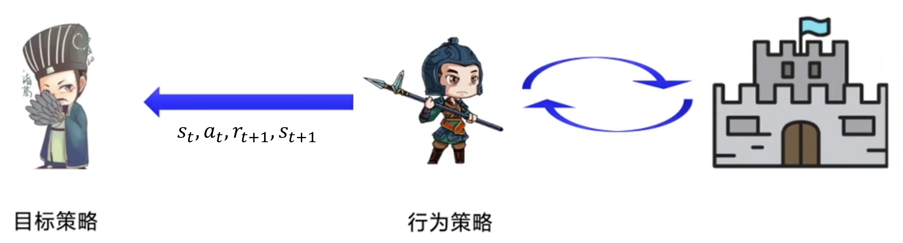

图 3.21 异策略

再例如，如图 3.32 所示，比如环境是波涛汹涌的大海，但学习策略（learning policy）太“胆小”了，无法直接与环境交互学习，所以我们有了探索策略（exploratory policy），探索策略是一个不畏风浪的海盗，它非常激进，可以在环境中探索。因此探索策略有很多经验，它可以把这些经验“写成稿子”，然后“喂”给学习策略。学习策略可以通过稿子进行学习。

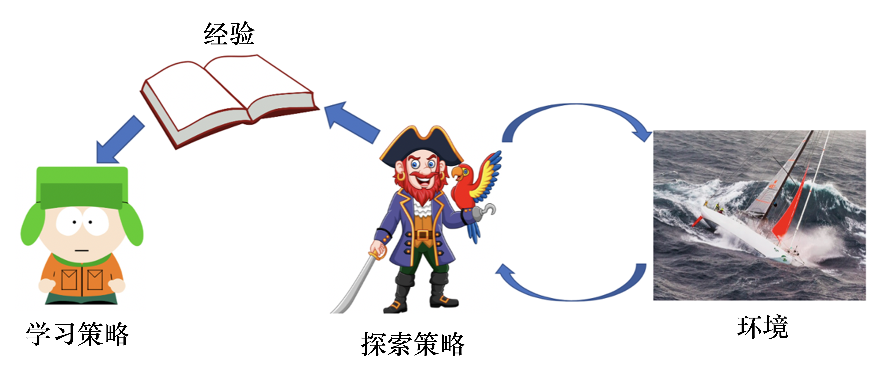

图 3.32 异策略例子

在异策略学习的过程中，轨迹都是行为策略与环境交互产生的，产生这些轨迹后，我们使用这些轨迹来更新目标策略 $\pi$。
异策略学习有很多好处。首先，我们可以利用探索策略来学到最佳的策略，学习效率高；
其次，异策略学习可以让我们学习其他智能体的动作，进行模仿学习，学习人或者其他智能体产生的轨迹；
最后，异策略学习可以让我们重用旧的策略产生的轨迹，探索过程需要很多计算资源，这样可以节省资源。

Q学习有两种策略：行为策略和目标策略。
目标策略 $\pi$ 直接在 Q表格上使用贪心策略，取它下一步能得到的所有状态，即
$$
	\pi\left(s_{t+1}\right)=\underset{a^{\prime}}{\arg \max}~ Q\left(s_{t+1}, a^{\prime}\right)
$$
行为策略 $\mu$ 可以是一个随机的策略，但我们采取 $\varepsilon$-贪心策略，让行为策略不至于是完全随机的，它是基于Q表格逐渐改进的。

我们可以构造 Q学习 目标，Q学习的下一个动作都是通过 arg max 操作选出来的，于是我们可得
$$
\begin{aligned}
r_{t+1}+\gamma Q\left(s_{t+1}, A^{\prime}\right) &=r_{t+1}+\gamma Q\left(s_{t+1},\arg \max ~Q\left(s_{t+1}, a^{\prime}\right)\right) \\
&=r_{t+1}+\gamma \max _{a^{\prime}} Q\left(s_{t+1}, a^{\prime}\right)
\end{aligned}	
$$

接着我们可以把 Q学习更新写成增量学习的形式，时序差分目标变成了$r_{t+1}+\gamma \max _{a} Q\left(s_{t+1}, a\right)$，即
$$
	Q\left(s_{t}, a_{t}\right) \leftarrow Q\left(s_{t}, a_{t}\right)+\alpha\left[r_{t+1}+\gamma \max _{a} Q\left(s_{t+1}, a\right)-Q\left(s_{t}, a_{t}\right)\right]
$$

如图 3.33 所示，我们再通过对比的方式来进一步理解 **Q学习**。Q学习是异策略的时序差分学习方法，Sarsa 是同策略的时序差分学习方法。
Sarsa 在更新 Q 表格的时候，它用到的是 $A'$ 。我们要获取下一个 Q 值的时候，$A'$ 是下一个步骤一定会执行的动作，这个动作有可能是 $\varepsilon$-贪心方法采样出来的动作，也有可能是最大化 Q 值对应的动作，也有可能是随机动作，但这是它实际执行的动作。
但是 Q学习 在更新 Q 表格的时候，它用到的是 Q 值 $Q(S',a)$ 对应的动作 ，它不一定是下一个步骤会执行的实际的动作，因为我们下一个实际会执行的那个动作可能会探索。
Q学习默认的下一个动作不是通过行为策略来选取的，Q学习直接看Q表格，取它的最大化的值，它是默认 $A'$ 为最佳策略选取的动作，所以 Q学习 在学习的时候，不需要传入 $A'$，即 $a_{t+1}$  的值。

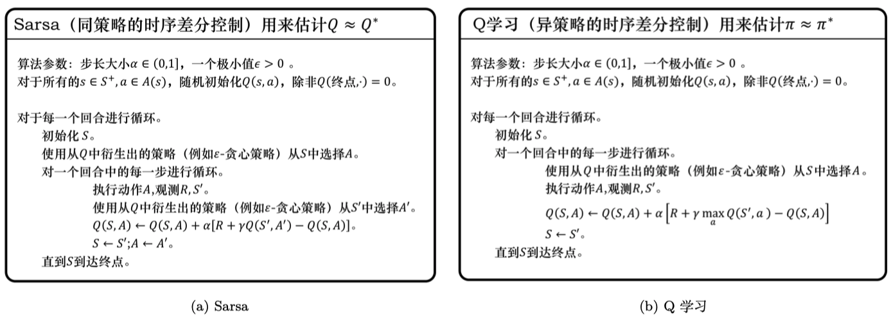

	

图 3.33 Sarsa与Q学习的伪代码

Sarsa 和 Q学习 的更新公式是一样的，区别只在目标计算的部分，
Sarsa 是 $r_{t+1}+\gamma Q(s_{t+1}, a_{t+1})$， 
Q学习 是 $r_{t+1}+\gamma  \underset{a}{\max} Q\left(s_{t+1}, a\right)$ 。

如图 3.34a 所示，Sarsa 用自己的策略产生了 $S,A,R,S',A'$ 这条轨迹，然后用 $Q(s_{t+1},a_{t+1})$ 去更新原本的 Q 值 $Q(s_t,a_t)$。 
但是 Q学习 并不需要知道我们实际上选择哪一个动作 ，它默认下一个动作就是 Q 值最大的那个动作。Q学习知道实际上行为策略可能会有 0.1 的概率选择别的动作，但 Q 学习并不担心受到探索的影响，它默认按照最佳的策略去优化目标策略，所以它可以更大胆地去寻找最优的路径，它表现得比 Sarsa 大胆得多。

如图 3.34b 所示，我们对Q学习进行逐步拆解，Q学习与 Sarsa 唯一不一样的就是并不需要提前知道 $A_2$ ，就能更新 $Q(S_1,A_1)$ 。在一个回合的训练当中，Q学习 在学习之前也不需要获取下一个动作 $A'$，它只需要前面的 $(S,A,R,S')$ ，这与 Sarsa 很不一样。 

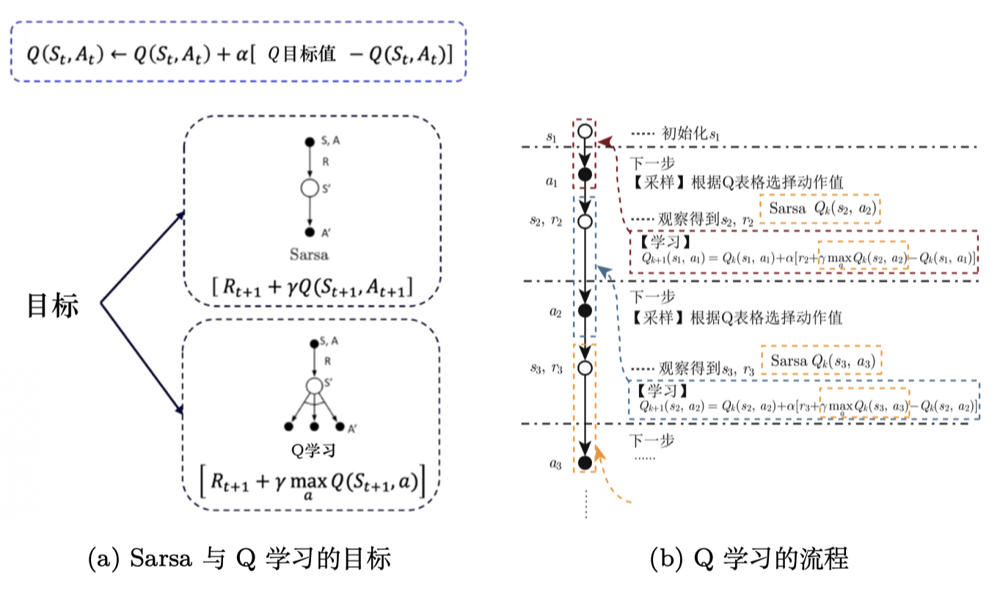

图 3.34 Sarsa与Q学习的区别

### 3.4.3 同策略与异策略的区别 

总结一下同策略和异策略的区别。
* Sarsa 是一个典型的同策略算法，它只用了一个策略 $\pi$，它不仅使用策略 $\pi$ 学习，还使用策略 $\pi$ 与环境交互产生经验。
如果策略采用 $\varepsilon$-贪心算法，它需要兼顾探索，为了兼顾探索和利用，它训练的时候会显得有点“胆小”。它在解决悬崖行走问题的时候，会尽可能地远离悬崖边，确保哪怕自己不小心探索了一点儿，也还是在安全区域内。此外，因为采用的是 $\varepsilon$-贪心 算法，策略会不断改变（$\varepsilon$ 值会不断变小），所以策略不稳定。
* Q学习是一个典型的异策略算法，它有两种策略————目标策略和行为策略，它分离了目标策略与行为策略。Q学习可以大胆地用行为策略探索得到的经验轨迹来优化目标策略，从而更有可能探索到最佳策略。行为策略可以采用 $\varepsilon$-贪心 算法，但目标策略采用的是贪心算法，它直接根据行为策略采集到的数据来采用最佳策略，所以 Q学习 不需要兼顾探索。

* 我们比较一下 Q学习 和 Sarsa 的更新公式，就可以发现 Sarsa 并没有选取最大值的最大化操作。因此，Q学习是一个非常激进的方法，它希望每一步都获得最大的利益；Sarsa 则相对较为保守，它会选择一条相对安全的迭代路线。

表格型方法总结如图 3.35 所示。

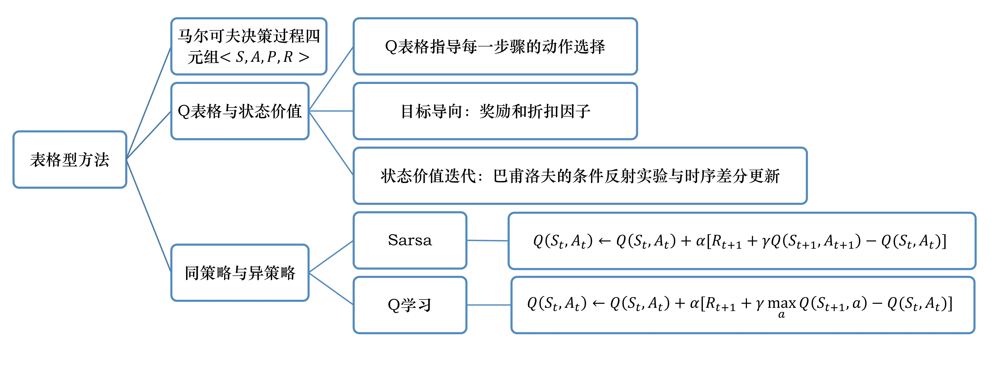

图 3.35 表格型方法总结

## 参考文献

* [百度强化学习](https://aistudio.baidu.com/aistudio/education/lessonvideo/460292)

* [强化学习基础 David Silver 笔记](https://zhuanlan.zhihu.com/c_135909947)
* [Intro to Reinforcement Learning (强化学习纲要）](https://github.com/zhoubolei/introRL)
* [Reinforcement Learning: An Introduction (second edition)](https://book.douban.com/subject/30323890/)
* [百面深度学习](https://book.douban.com/subject/35043939/)
* [神经网络与深度学习](https://nndl.github.io/)
* [机器学习](https://book.douban.com/subject/26708119//)
* [Understanding the Bias-Variance Tradeoff](http://scott.fortmann-roe.com/docs/BiasVariance.html)

