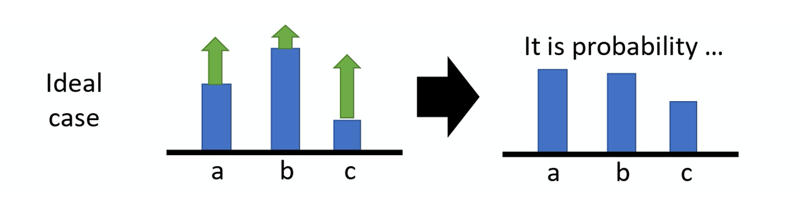
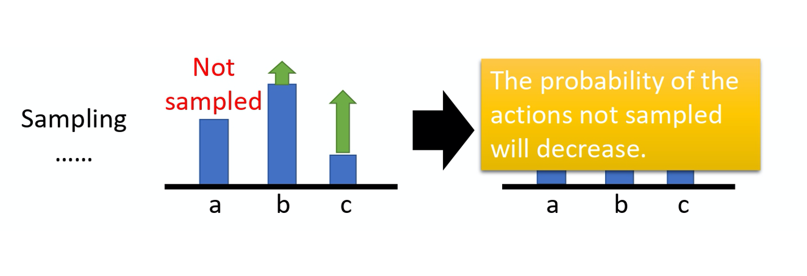

# Q-learning

## Q-learning

Q-learning 是value-based 的方法。在value based 的方法里面，我们 learn 的并不是 policy。我们要 learn 的是一个 critic，critic 并不直接采取行为，它想要做的事情是评价现在的行为有多好或者是有多不好。Critic 并不直接采取行为是说，假设有一个 actor $\pi$ ，那 critic 的工作就是来评价这个 actor $\pi$ 做得有多好或者有多不好。举例来说，有一种 actor 叫做 state value 的 function。state value function 的意思就是说，假设 actor 叫做 $\pi$，拿 $\pi$  跟环境去做互动。假设 $\pi$ 看到了某一个state s。如果在玩Atari 游戏的话，state s 是某一个画面，看到某一个画面，某一个state s 的时候，接下来一直玩到游戏结束，累积的reward 的期望值有多大。所以 $V^{\pi}$ 是一个function，这个 function 吃一个state，当作input，然后它会 output 一个 scalar， 这个 scalar 代表说，$\pi$ 这个actor 看到state s 的时候，接下来预期到游戏结束的时候，它可以得到多大的value。

举个例子，假设你是玩space invader 的话，也许这个 state s，这一个游戏画面，你的 $V^{\pi}(s)$ 会很大，因为接下来还有很多的怪可以杀， 所以你会得到很大的分数。一直到游戏结束的时候，你仍然有很多的分数可以吃。右边那个case，也许你得到的$V^{\pi}(s)$就很小，因为剩下的怪也不多了，并且红色的防护罩已经消失了，所以可能很快就会死掉。所以接下来得到预期的 reward，就不会太大。这边需要强调的一个点是说，当你在讲这一个critic 的时候，critic 都是绑一个 actor 的，就 critic 并没有办法去凭空去 evaluate 一个 state 的好坏，它所 evaluate 的东西是在 given 某一个 state 的时候， 假设我接下来互动的actor 是$\pi$，那我会得到多少reward，因为就算是给同样的 state，你接下来的 $\pi$ 不一样，你得到的 reward 也是不一样的。举例来说，在左边那个case，虽然假设是一个正常的$\pi$，它可以杀很多怪，那假设他是一个很弱的$\pi$，它就站在原地不动，然后马上就被射死了，那你得到的 V 还是很小。所以 critic output 值有多大，其实是取决于两件事：state 和 actor。所以你的 critic 其实都要绑一个 actor，它是在衡量某一个actor 的好坏，而不是 generally 衡量一个 state 的好坏。这边要强调一下，critic output 是跟 actor 有关的，state value 其实是 depend on 你的 actor。当你的actor 变的时候，state value function 的output 其实也是会跟着改变的。
再来问题就是，怎么衡量这一个state value function 呢？怎么衡量这一个$V^{\pi}(s)$ 呢？有两种不同的做法。

怎么estimate 这些critic，那怎么estimate $V^{\pi}(s)$  呢。有两个方向，一个是用` Monte-Carlo(MC) based` 的方法。MC based 的方法就是让 actor 去跟环境做互动，你要看 actor 好不好， 你就让actor 去跟环境做互动，给critic 看。然后，critic 就统计说， 这个actor 如果看到 state $s_a$，接下来 accumulated reward 会有多大。如果它看到 state $s_b$，接下来accumulated reward会有多大。但是实际上，你当然不可能把所有的state 通通都扫过。如果你是玩Atari 游戏的话，你的state 是image ，你没有办法把所有的state 通通扫过。所以实际上我们的 $V^{\pi}(s)$ 是一个network。对一个network 来说，就算是 input state 是从来都没有看过的，它也可以想办法估测一个value 的值。怎么训练这个network 呢？因为如果在state $s_a$，接下来的 accumulated reward 就是 $G_a$。也就是说，对这个 value function 来说，如果input 是state $s_a$，正确的output 应该是$G_a$。如果input state $s_b$，正确的output 应该是value $G_b$。所以在training 的时候， 它就是一个regression 的 problem。Network 的 output 就是一个 value，你希望在 input $s_a$ 的时候，output value 跟$G_a$ 越近越好，input $s_b$ 的时候，output value 跟 $G_b$ 越近越好。接下来把network train 下去，就结束了。这是第一个方法，这是MC based 的方法。

第二个方法是`Temporal-difference` 的方法， `即TD based `的方法。在 MC based 的方法中，每次我们都要算accumulated reward，也就是从某一个 state $s_a$ 一直玩游戏玩到游戏结束的时候，你会得到的所有reward 的总和。所以今天你要 apply MC based 的approach，你必须至少把这个游戏玩到结束。但有些游戏非常的长，你要玩到游戏结束才能够 update network，你可能根本收集不到太多的资料，花的时间太长了。所以怎么办？有另外一种 TD based 的方法。TD based 的方法不需要把游戏玩到底。只要在游戏的某一个情况，某一个 state $s_t$ 的时候，采取 action $a_t$ ，得到 reward $r_t$ ，跳到 state $s_{t+1}$，就可以apply TD 的方法。

怎么 apply TD 的方法呢？这边是基于以下这个式子：
$$
V^{\pi}\left(s_{t}\right)=V^{\pi}\left(s_{t+1}\right)+r_{t}
$$

假设我们现在用的是某一个 policy $\pi$，在 state $s_t$，它会采取 action $a_t$，给我们 reward $r_t$ ，接下来进入$s_{t+1}$ 。state $s_{t+1}$ 的 value 跟 state $s_t$ 的 value，它们的中间差了一项 $r_t$。因为你把 $s_{t+1}$ 得到的 value 加上得到的 reward $r_t$ 就会等于$s_t$ 得到的value。有了这个式子以后，你在training 的时候，你要做的事情并不是直接去估测 V，而是希望你得到的结果 V 可以满足这个式子，也就是说你 training 的时候会是这样 train 的，你把 $s_t$ 丢到network 里面，因为 $s_t$ 丢到network 里面会得到 $V^{\pi}(s_t)$，把 $s_{t+1}$ 丢到你的 value network 里面会得到$V^{\pi}(s_{t+1})$，这个式子告诉我们，$V^{\pi}(s_t)$ 减$V^{\pi}(s_{t+1})$，它应该值是$r_t$。然后希望它们两个相减的 loss 跟 $r_t$ 越接近，train 下去，update V 的参数，你就可以把 V function learn 出来。

MC 跟TD 有什么样的差别呢？MC 最大的问题就是 variance 很大。因为我们在玩游戏的时候，它本身是有随机性的。所以你可以把 $G_a$ 看成一个 random 的 variable。因为你每次同样走到 $s_a$ 的时候，最后你得到的 $G_a$ 其实是不一样的。你看到同样的state $s_a$，最后玩到游戏结束的时候，因为游戏本身是有随机性的，你的玩游戏的model 本身搞不好也有随机性，所以你每次得到的 $G_a$ 是不一样的，每一次得到$G_a$ 的差别其实会很大。为什么它会很大呢？因为 $G_a$ 其实是很多个不同的 step 的reward 的和。假设你每一个step 都会得到一个reward，$G_a$ 是从 state $s_a$  开始，一直玩到游戏结束，每一个timestamp reward 的和。

那举例来说，我在右上角就列一个式子是说，

$$
\operatorname{Var}[k X]=k^{2} \operatorname{Var}[X]
$$
Var就是指variance。 
通过这个式子，我们可以知道 $G_a$ 的 variance  相较于某一个 state 的 reward，它会是比较大的，$G_a$ 的variance 是比较大的。

现在，如果说用TD 的话呢？用TD 的话，你是要去minimize 这样的一个式子：

在这中间会有随机性的是 r。因为计算你在 $s_t$ 采取同一个 action，你得到的 reward 也不见得是一样的，所以 r 其实也是一个 random variable。但这个 random variable 的 variance 会比 $G_a$ 还要小，因为 $G_a$ 是很多 r 合起来。这边只是某一个 r  而已。$G_a$ 的variance 会比较大，r  的variance 会比较小。但是这边你会遇到的一个问题是你这个 V 不见得估的准，假设你的这个 V 估的是不准的，那你 apply 这个式子 learn 出来的结果，其实也会是不准的。所以MC 跟TD各有优劣。今天其实TD 的方法是比较常见的，MC 的方法其实是比较少用的。

上图是讲 TD 跟 MC 的差异。假设有某一个critic，它去观察某一个 policy $\pi$ 跟环境互动的8个 episode 的结果。有一个actor $\pi$ 跟环境互动了8 次，得到了8 次玩游戏的结果。接下来这个 critic 去估测 state 的 value。如果我们看 $s_b$ 的value 是多少，$s_b$ 这个state 在8场游戏里面都有经历过，然后在这8 场游戏里面，其中有6 场得到 reward 1，有两场得到reward 0，所以如果你是要算期望值的话，就看到 state $s_b$ 以后得到的 reward，一直到游戏结束的时候得到的accumulated reward 期望值是3/4。但 $s_a$ 期望的reward 到底应该是多少呢？这边其实有两个可能的答案：一个是0，一个是3/4。为什么有两个可能的答案呢？这取决于你用MC 还是TD。用MC 跟用TD 算出来的结果是不一样的。

假如你用MC 的话，你会发现这个$s_a$ 就出现一次，看到$s_a$ 这个state，接下来 accumulated reward 就是 0。所以今天 $s_a$ expected reward 就是 0。但 TD 在计算的时候，它是要update 下面这个式子。
$$
V^{\pi}\left(s_{a}\right)=V^{\pi}\left(s_{b}\right)+r
$$

因为我们在 state $s_a$ 得到 reward r=0 以后，跳到 state $s_b$。所以 state $s_b$ 的 reward 会等于 state $s_b$ 的 reward 加上在state $s_a$ 跳到 state $s_b$ 的时候可能得到的 reward r。而这个可能得到的reward r 的值是 0。$s_b$ expected reward 是3/4。那$s_a$ 的reward 应该是3/4。有趣的地方是用 MC 跟 TD 你估出来的结果，其实很有可能是不一样的。就算 critic observed 到一样的 training data，它最后估出来的结果，也不见得会是一样。那为什么会这样呢？你可能问说，那一个比较对呢？其实就都对。

因为在第一个 trajectory， $s_a$ 得到 reward 0 以后，再跳到 $s_b$ 也得到reward 0。这边有两个可能，一个可能是$s_a$，它就是一个带 sign 的state，所以只要看到 $s_a$ 以后，$s_b$ 就会拿不到reward，有可能$s_a$ 其实影响了$s_b$。如果是用MC 的算法的话，它就会考虑这件事， 它会把 $s_a$ 影响 $s_b$ 这件事考虑进去。所以看到 $s_a$ 以后，接下来 $s_b$ 就得不到 reward，所以看到$s_a$ 以后，期望的reward 是 0。但是今天看到$s_a$ 以后， $s_b$ 的 reward 是0 这件事有可能只是一个巧合，就并不是 $s_a$ 所造成，而是因为说 $s_b$ 有时候就是会得到reward 0，这只是单纯运气的问题。其实平常 $s_b$ 会得到reward 期望值是3/4。跟$s_a$ 是完全没有关系的。所以 $s_a$ 假设之后会跳到 $s_b$，那其实得到的reward 按照TD 来算应该是3/4。所以不同的方法，它考虑了不同的假设，运算结果不同。

还有另外一种critic，这种critic 叫做 `Q-function`。它又叫做`state-action value function`。

刚才的 state function，它的 input 是一个 state，它是根据 state 去计算出，看到这个state 以后的 expected accumulated reward 是多少。这个 state-action value function 的 input 不是 state，它是一个 state 跟 action 的 pair，它的意思是说，在某一个 state 采取某一个action，假设我们都使用 actor $\pi$ ，得到的 accumulated reward 的期望值有多大。
Q-function 有一个需要注意的问题是，这个 actor $\pi$，在看到 state s 的时候，它采取的 action 不一定是 a。Q-function 的假设是说，假设在 state s 强制采取 action a。不管你现在考虑的这个actor $\pi$， 它会不会采取action a，这不重要。在state s 强制采取 action a。接下来都用 actor $\pi$ 继续玩下去，就只有在 state s，我们才强制一定要采取action a，接下来就进入自动模式，让actor $\pi$ 继续玩下去，得到的 expected reward 才是$Q^{\pi}(s,a)$。

Q-function 有两种写法：

* input 是 state 跟action，output 就是一个scalar；
* input  是一个 state s，会output 好几个value。

假设 action 是 discrete 的，action 就只有3 个可能，往左往右或是开火。那这个 Q-function output 的3 个 values 就分别代表 a 是向左的时候的 Q value，a 是向右的时候的Q value，还有 a 是开火的时候的 Q value。

那你要注意的事情是，上图右边的 function 只有discrete action 才能够使用。如果 action 是无法穷举的，你只能够用上图左边这个式子，不能够用右边这个式子。

上图是文献上的结果，你去 estimate Q-function 的话，看到的结果可能会像是这个样子。这是什么意思呢？它说假设我们有3 个 actions，3 个actions 就是原地不动、向上、向下。

* 假设是在第一个state，不管是采取哪个action，最后到游戏结束的时候，得到的 expected reward 其实都差不多。因为球在这个地方，就算是你向下，接下来你其实应该还来的急救，所以今天不管是采取哪一个action，就差不了太多。

* 假设在第二个state，这个乒乓球它已经反弹到很接近边缘的地方，这个时候你采取向上，你才能得到positive 的reward，才接的到球。如果你是站在原地不动或向下的话，接下来你都会miss 掉这个球。你得到的reward 就会是负的。

* 假设在第三个state，球很近了，所以就要向上。

* 假设在第四个state，球被反弹回去，这时候采取那个action就都没有差了。

这个是 state-action value 的一个例子。

虽然表面上我们 learn 一个Q-function，它只能拿来评估某一个actor $\pi$ 的好坏，但只要有了这个 Q-function，我们就可以做 reinforcement learning。有这个Q-function，我们就可以决定要采取哪一个action。它的大原则是这样，假设你有一个初始的actor，也许一开始很烂， 随机的也没有关系，初始的actor 叫做 $\pi$，这个$\pi$ 跟环境互动，会collect data。接下来你learn 一个 $\pi$ 这个actor 的Q value，你去衡量一下 $\pi$ 这个actor 在某一个state 强制采取某一个action，接下来用$\pi$ 这个policy 会得到的expected reward，那用TD 或 MC 也是可以的。你learn 出一个Q-function 以后，就保证你可以找到一个新的policy $\pi'$ 。这一个policy $\pi'$ 一定会比原来的policy $\pi$ 还要好。那等一下会定义说，什么叫做好。所以这边神奇的地方是，假设你只要有一个Q-function，你有某一个policy $\pi$，你根据那个policy $\pi$ learn 出 policy $\pi$ 的Q-function，接下来保证你可以找到一个新的policy  $\pi'$ ，它一定会比$\pi$ 还要好，然后你把原来的$\pi$ 用$\pi'$ 取代掉，再去找它的Q，得到新的以后，再去找一个更好的policy。 然后这个循环一直下去，你的policy 就会越来越好。 

上图就是讲我们刚才讲的到底是什么。

* 首先要定义的是什么叫做比较好？我们说$\pi'$ 一定会比$\pi$ 还要好，什么叫做好呢？这边所谓好的意思是说，对所有可能的state s 而言，对同一个state s 而言，$\pi$ 的 value function 一定会小于$\pi'$ 的value function。也就是说我们走到同一个 state s 的时候，如果拿 $\pi$ 继续跟环境互动下去，我们得到的 reward 一定会小于用$\pi'$ 跟环境互动下去得到的reward。所以不管在哪一个state，你用$\pi'$ 去做interaction，得到的expected reward 一定会比较大。所以 $\pi'$ 是比 $\pi$  还要好的一个policy。

* 有了这个 Q 以后，怎么找这个$\pi'$ 呢？事实上这个$\pi'$ 是什么？这个$\pi'$ 就是， 如果你根据以下的这个式子去决定你的action，

$$
\pi^{\prime}(s)=\arg \max _{a} Q^{\pi}(s, a)
$$

根据上式去决定你的action 的步骤叫做 $\pi'$ 的话，那这个 $\pi'$ 一定会比$\pi$ 还要好。这个意思是说，假设你已经learn 出 $\pi$ 的Q-function，今天在某一个state s，你把所有可能的action a 都一一带入这个Q-function，看看说那一个 a 可以让 Q-function 的value 最大。那这一个action，就是$\pi'$ 会采取的action。这边要注意一下，今天given 这个state s，你的policy $\pi$ 并不一定会采取action a。今天是 given 某一个state s 强制采取 action a，用$\pi$ 继续互动下去得到的expected reward，才是这个Q-function 的定义。所以在state s 里面不一定会采取action a。假设用这一个 $\pi'$ 在state s 采取action a 跟 $\pi$ 所谓采取action 是不一定会一样的。然后 $\pi'$ 所采取的action 会让他得到比较大的reward。

* 所以根本就没有一个policy 叫做 $\pi'$，这个$\pi'$ 其实就是用 Q-function 推出来的。所以没有另外一个 network 决定 $\pi'$ 怎么interaction，有Q 就可以找出$\pi'$。
* 但是这边有另外一个问题就是，在这边要解一个 arg max 的 problem。所以a 如果是continuous 的就会有问题，如果是discrete 的，a 只有3 个选项，一个一个带进去， 看谁的Q 最大，没有问题。但如果是 continuous 要解 arg max problem，你就会有问题，但这个是之后才会解决的。

上图想要跟大家讲的是说，为什么用 $Q^{\pi}(s,a)$ 这个Q-function 所决定出来的$\pi'$，一定会比 $\pi$ 还要好。

假设现在呢，我们有一个policy 叫做 $\pi'$，它是由 $Q^{\pi}$ 决定的。我们要证对所有的 state s 而言，$V^{\pi^{\prime}}(s) \geq V^{\pi}(s)$。怎么证呢？我们先把$V^{\pi^{\prime}}(s)$写出来：
$$
V^{\pi}(s)=Q^{\pi}(s, \pi(s))
$$
假设在 state s 这个地方，你 follow $\pi$ 这个actor，它会采取的action，也就是$\pi(s)$，那你算出来的$Q^{\pi}(s, \pi(s))$ 会等于$V^{\pi}(s)$。In general 而言，$Q^{\pi}(s, \pi(s))$ 不见得等于$V^{\pi}(s)$ ，因为 action 不见得是$\pi(s)$。但如果这个 action 是 $\pi(s)$ 的话，$Q^{\pi}(s, \pi(s))$ 是等于$V^{\pi}(s)$的。

$Q^{\pi}(s, \pi(s))$ 还满足如下的关系：
$$
Q^{\pi}(s, \pi(s)) \le \max _{a} Q^{\pi}(s, a)
$$

因为这边是所有action 里面可以让 Q 最大的那个action，所以今天这一项一定会比它大。那我们知道说这一项是什么，这一项就是$Q^{\pi}(s, a)$，$a$ 就是 $\pi'(s)$。因为$\pi'(s)$ output 的 a， 就是可以让$Q^\pi(s,a)$ 最大的那一个。所以我们得到了下面的式子：
$$
\max _{a} Q^{\pi}(s, a)=Q^{\pi}\left(s, \pi^{\prime}(s)\right)
$$

于是：
$$
V^{\pi}(s) \leq Q^{\pi}\left(s, \pi^{\prime}(s)\right)
$$
也就是说某一个state，如果你按照policy $\pi$，一直做下去，你得到的reward 一定会小于等于，在这个state s。你故意不按照 $\pi$ 所给你指示的方向，而是按照 $\pi'$ 的方向走一步，但之后只有第一步是按照 $\pi'$ 的方向走，只有在state s 这个地方，你才按照 $\pi'$ 的指示走，但接下来你就按照 $\pi$ 的指示走。虽然只有一步之差， 但是我从上面这个式子知道说，只有一步之差，你得到的 reward 一定会比完全 follow $\pi$ 得到的 reward 还要大。

那接下来你想要证的东西就是：
$$
Q^{\pi}\left(s, \pi^{\prime}(s) \right) \le V^{\pi'}(s)
$$

也就是说，只有一步之差，你会得到比较大的reward。但假设每步都是不一样的， 每步都是 follow $\pi'$ 而不是$\pi$ 的话，那你得到的reward 一定会更大。如果你要用数学式把它写出来的话，你可以这样写 

$Q^{\pi}\left(s, \pi^{\prime}(s)\right)$这个式子，它的意思就是说，我们在state $s_t$ 采取 action $a_t$，得到 reward $r_{t+1}$，然后跳到state $s_{t+1}$，即如下式所示：
$$
Q^{\pi}\left(s, \pi^{\prime}(s)\right)=E\left[r_{t+1}+V^{\pi}\left(s_{t+1}\right) \mid s_{t}=s, a_{t}=\pi^{\prime}\left(s_{t}\right)\right]
$$
这边有一个地方写得不太好，这边应该写成$r_t$ 跟之前的notation 比较一致，但这边写成了$r_{t+1}$，其实这都是可以的。在文献上有时候有人会说 在state $s_t$ 采取action $a_t$ 得到reward $r_{t+1}$， 有人会写成$r_t$，但意思其实都是一样的。在state s，按照$\pi'$ 采取某一个action $a_t$ ，得到reward $r_{t+1}$，然后跳到state $s_{t+1}$，$V^{\pi}\left(s_{t+1}\right)$是state $s_{t+1}$，根据$\pi$ 这个actor 所估出来的value。这边要取一个期望值，因为在同样的state 采取同样的action，你得到的reward，还有会跳到的 state 不一定是一样， 所以这边需要取一个期望值。 

接下来我们会得到如下的式子：
$$
\begin{array}{l}
E\left[r_{t+1}+V^{\pi}\left(s_{t+1}\right) | s_{t}=s, a_{t}=\pi^{\prime}\left(s_{t}\right)\right] \\
\leq E\left[r_{t+1}+Q^{\pi}\left(s_{t+1}, \pi^{\prime}\left(s_{t+1}\right)\right) | s_{t}=s, a_{t}=\pi^{\prime}\left(s_{t}\right)\right]
\end{array}
$$
上式为什么成立呢？因为
$$
V^{\pi}(s) \leq Q^{\pi}\left(s, \pi^{\prime}(s)\right)
$$
也就是
$$
V^{\pi}(s_{t+1}) \leq Q^{\pi}\left(s_{t+1}, \pi^{\prime}(s_{t+1})\right)
$$

也就是说，现在你一直follow $\pi$，跟某一步follow $\pi'$，接下来都follow $\pi$ 比起来，某一步follow $\pi'$ 得到的reward 是比较大的。

接着我们得到下式：
$$
\begin{array}{l}
E\left[r_{t+1}+Q^{\pi}\left(s_{t+1}, \pi^{\prime}\left(s_{t+1}\right)\right) | s_{t}=s, a_{t}=\pi^{\prime}\left(s_{t}\right)\right] \\
=E\left[r_{t+1}+r_{t+2}+V^{\pi}\left(s_{t+2}\right) | \ldots\right]
\end{array}
$$

因为
$$
Q^{\pi}\left(s_{t+1}, \pi^{\prime}\left(s_{t+1}\right)\right) = r_{t+2}+V^{\pi}\left(s_{t+2}\right)
$$

然后你再代入

$$
V^{\pi}(s) \leq Q^{\pi}\left(s, \pi^{\prime}(s)\right)
$$

一直算到底，算到episode 结束。那你就知道说
$$
V^{\pi}(s)\le V^{\pi'}(s)
$$

这边告诉我们的事情如下，你可以estimate 某一个policy 的Q-function，接下来你就一定可以找到另外一个policy 叫做$\pi'$，它一定比原来的policy 还要更好。

## Target Network

接下来讲一下在Q-learning 里你一定会用到的tip。第一个是 `target network`，什么意思呢？我们在learn Q-function 的时候，也会用到 TD 的概念。那怎么用 TD？你现在收集到一个data， 是说在state $s_t$，你采取action $a_t$ 以后，你得到reward $r_t$ ，然后跳到state $s_{t+1}$。然后根据这个Q-function，你会知道说
$$
\mathrm{Q}^{\pi}\left(s_{t}, a_{t}\right) 
=r_{t}+\mathrm{Q}^{\pi}\left(s_{t+1}, \pi\left(s_{t+1}\right)\right)
$$

所以你在learn 的时候，你会说我们有Q-function，input $s_t$, $a_t$ 得到的value，跟input $s_{t+1}$, $\pi (s_{t+1})$ 得到的value 中间，我们希望它差了一个$r_t$， 这跟刚才讲的TD 的概念是一样的。但是实际上在learn 的时候，你会发现这样的一个function 并不好 learn。因为假设你说这是一个regression 的problem，$\mathrm{Q}^{\pi}\left(s_{t}, a_{t}\right) $是你network 的output，$r_{t}+\mathrm{Q}^{\pi}\left(s_{t+1}, \pi\left(s_{t+1}\right)\right)$是你的target，你会发现 target 是会动的。当然你要implement 这样的training，其实也没有问题。就是你在做 back propagation 的时候， $Q^{\pi}$ 的参数会被 update，你会把两个update 的结果加在一起。它们是同一个model $Q^{\pi}$， 所以两个update 的结果会加在一起。但是实际上在做的时候，你的training 会变得不太稳定，因为假设你把 $\mathrm{Q}^{\pi}\left(s_{t}, a_{t}\right) $ 当作你model 的output， $r_{t}+\mathrm{Q}^{\pi}\left(s_{t+1}, \pi\left(s_{t+1}\right)\right)$ 当作target 的话。你要去 fit 的 target 是一直在变的，这种一直在变的target 的training 是不太好train 的。所以实际上你会把其中一个 Q，通常是你就选择下面这个 Q，把它固定住。也就是说你在training 的时候，你并不 update 这个Q 的参数，你只update 左边这个Q 的参数，而右边这个Q 的参数，它会被固定住，我们叫它 `target network`。它负责产生target，所以叫做target network。因为target network 是固定的，所以你现在得到的target，也就是 $r_{t}+\mathrm{Q}^{\pi}\left(s_{t+1}, \pi\left(s_{t+1}\right)\right)$ 的值也是固定的。

因为 target network 是固定的，我们只调左边network 的参数，它就变成是一个regression 的problem。我们希望  model 的output，它的值跟你的目标越接近越好，你会minimize 它的 mean square error。你会 minimize 它们 L2 的distance。这个东西就是regression。在实现上，你会把这个Q update 好几次以后，再去用 update 过的 Q 替换这个 target network 。但它们两个不要一起动，它们两个一起动的话， 你的结果会很容易坏掉。一开始这两个network 是一样的，然后接下来在train 的时候，你会把右边的 network fix 住。你在做 gradient decent 的时候，只调左边这个network 的参数，那你可能update 100 次以后才把这个参数，复制到右边的 network 去，把它盖过去。把它盖过去以后，你这个target 的value 就变了。就好像说你今天本来在做一个regression 的problem，那你train后把这个regression problem 的loss 压下去以后，接下来你把这边的参数把它copy 过去以后，你的target 就变掉了。 那你接下来就要重新再train。

## Exploration

第二个 tip 是`Exploration`。当我们使用 Q-function 的时候，policy 完全depend on  Q-function。说given 某一个state，你就穷举所有的 a， 看哪个 a 可以让 Q value 最大，它就是采取的action。那其实这个跟 policy gradient 不一样，在做 policy gradient 的时候，output 其实是 stochastic 的。我们 output 一个action 的distribution，根据这个action 的distribution 去做sample， 所以在policy gradient 里面，你每次采取的action 是不一样的，是有随机性的。那像这种Q-function， 如果你采取的action 总是固定的，会有什么问题呢？你会遇到的问题就是这不是一个好的收集 data 的方式。因为假设我们今天真的要估某一个state，你可以采取action $a_{1}$, $a_{2}$, $a_{3}$。你要估测在某一个state 采取某一个action 会得到的Q value，你一定要在那一个 state 采取过那一个action，才估得出它的value。如果你没有在那个state 采取过那个action，你其实估不出那个value 的。当然如果是用deep 的network，就你的Q-function 其实是一个network，这种情形可能会没有那么严重。但是 in general 而言，假设 Q-function 是一个table，没有看过的  state-action pair，它就是估不出值来。Network 也是会有一样的问题就是， 只是没有那么严重。所以今天假设你在某一个state，action $a_{1}$, $a_{2}$, $a_{3}$ 你都没有采取过，那你估出来的 $Q(s,a_{1})$, $Q(s,a_{2})$, $Q(s,a_{3})$ 的 value 可能都是一样的，就都是一个初始值，比如说 0，即
$$
\begin{array}{l}
Q(s, a_1)=0 \\
Q(s, a_2)=0 \\
Q(s, a_3)=0
\end{array}
$$

但是假设你在state s，你sample 过某一个action $a_{2}$ ，它得到的值是positive 的reward。那 $Q(s, a_2)$ 就会比其他的action 都要好。在采取action 的时候， 就看说谁的Q value 最大就采取谁，所以之后你永远都只会sample 到$a_{2}$，其他的action 就再也不会被做了，所以就会有问题。就好像说你进去一个餐厅吃饭，其实你都很难选。你今天点了某一个东西以后，假说点了某一样东西， 比如说椒麻鸡，你觉得还可以。接下来你每次去就都会点椒麻鸡，再也不会点别的东西了，那你就不知道说别的东西是不是会比椒麻鸡好吃，这个是一样的问题。

如果你没有好的 exploration 的话， 你在training 的时候就会遇到这种问题。举一个实际的例子， 假设你今天是用 Q-learning 来玩比如说`slither.io`。在玩`slither.io` 你会有一个蛇，然后它在环境里面就走来走去， 然后就吃到星星，它就加分。假设这个游戏一开始，它采取往上走，然后就吃到那个星星，它就得到分数，它就知道说往上走是positive。接下来它就再也不会采取往上走以外的action 了，所以接下来就会变成每次游戏一开始，它就往上冲，然后就死掉，再也做不了别的事。所以今天需要有exploration 的机制，需要让 machine 知道说，虽然根据之前sample 的结果，$a_2$ 好像是不错的，但你至少偶尔也试一下$a_{1}$ 跟$a_{3}$，搞不好他们更好也说不定。

有两个方法解这个问题，一个是`Epsilon Greedy`。Epsilon Greedy 的意思是说，我们有$1-\varepsilon$ 的机率，通常$\varepsilon$ 就设一个很小的值， $1-\varepsilon$ 可能是90%，也就是90% 的机率，完全按照Q-function 来决定action。但是你有10% 的机率是随机的。通常在实现上 $\varepsilon$ 会随着时间递减。也就是在最开始的时候。因为还不知道那个action 是比较好的，所以你会花比较大的力气在做 exploration。接下来随着training 的次数越来越多。已经比较确定说哪一个Q 是比较好的。你就会减少你的exploration，你会把 $\varepsilon$ 的值变小，主要根据Q-function 来决定你的action，比较少做random，这是Epsilon Greedy。

还有一个方法叫做 `Boltzmann Exploration`，这个方法就比较像是policy gradient。在policy gradient 里面我们说network 的output 是一个 expected action space 上面的一个的 probability distribution。再根据 probability distribution 去做sample。那其实你也可以根据 Q value 去定一个probability distribution，你可以说，假设某一个action 的Q value 越大，代表它越好，那我们采取这个action 的机率就越高。但是某一个action 的Q value 小，不代表我们不能try，try 看它好不好用。所以我们有时候也要try，try 那些 Q value 比较差的 action，怎么做呢？因为Q value 是有正有负的。所以你要把它弄成一个概率，你可能就先取exponential，然后再做normalize。然后把 $exp(Q(s,a))$ 做normalize 的这个概率当作是你在决定action 的时候sample 的概率。在实现上，Q 是一个network，所以你有点难知道， 在一开始的时候network 的output 到底会长怎么样子。但是你可以猜测说， 假设你一开始没有任何的training data，你的参数是随机的，那given 某一个state s，不同的a output 的值，可能就是差不多的。所以一开始$Q(s,a)$ 应该会倾向于是uniform。也就是在一开始的时候，你这个probability distribution 算出来，它可能是比较uniform 的。

## Replay Buffer

第三个tip是`replay buffer`。replay buffer 是说现在会有某一个policy $\pi$ 去跟环境做互动，然后它会去收集data。我们会把所有的data 放到一个buffer 里面，buffer 里面就存了很多data。Buffer 比如说 5 万，这样它里面可以存 5 万笔资料，每一笔资料就是记得说，我们之前在某一个state $s_t$，采取某一个action $a_t$，得到了 reward $r_t$。然后跳到 state $s_{t+1}$。那你用 $\pi$ 去跟环境互动很多次，把收集到的资料都放到这个 replay buffer 里面。这边要注意的事情是replay buffer 里面的 experience可能是来自于不同的policy，你每次拿 $\pi$ 去跟环境互动的时候，你可能只互动10000 次，然后接下来你就更新你的$\pi$ 了。但是这个buffer 里面可以放5 万笔资料，所以 5 万笔资料可能是来自于不同的 policy。Buffer 只有在它装满的时候，才会把旧的资料丢掉。所以这个buffer 里面它其实装了很多不同的 policy 的experiences。

有了这个buffer 以后，你做的事情就是怎么train 这个Q 的model 呢，怎么估Q 的function？你的做法是这样：你会iterative 去train 这个Q-function，在每一个iteration 里面，你从这个buffer 里面，随机挑一个batch 出来，就跟一般的network training 一样，你从那个training data set 里面，去挑一个batch 出来。你去sample 一个batch 出来，里面有一把的experiences，根据这把experiences 去update 你的Q-function。就跟我们刚才讲那个 TD learning 要有一个target network 是一样的。你去sample 一堆batch，sample 一个batch 的data，sample 一堆 experiences，然后再去update 你的Q-function。

当我们这么做的时候， 它变成了一个off-policy 的做法。因为本来我们的 Q 是要观察 $\pi$ 这个action 的value，但实际上存在你的 replay buffer 里面的这些experiences 不是通通来自于$\pi$，有些是过去其他的$\pi$ 所遗留下来的experience。因为你不会拿某一个$\pi$ 就把整个buffer 装满，然后拿去测 Q-function，这个$\pi$ 只是sample 一些data塞到那个buffer 里面去，然后接下来就让 Q 去train。所以Q 在sample 的时候， 它会sample 到过去的一些资料。

但是这样做有什么好处呢？这么做有两个好处。

* 第一个好处，其实在做reinforcement learning 的时候， 往往最花时间的step 是在跟环境做互动，train network 反而是比较快的。因为你用GPU train 其实很快， 真正花时间的往往是在跟环境做互动。用replay buffer 可以减少跟环境做互动的次数，因为在做training 的时候，你的experience 不需要通通来自于某一个policy。一些过去的policy 所得到的experience 可以放在 buffer 里面被使用很多次，被反复的再利用，这样让你的sample 到experience 的利用是比较efficient。

* 第二个好处，在train network 的时候，其实我们希望一个batch 里面的data 越diverse 越好。如果你的batch 里面的data 都是同样性质的，你train 下去，其实是容易坏掉的。如果你batch 里面都是一样的data，你train 的时候，performance 会比较差。我们希望batch data 越diverse 越好。那如果你今天，你的这个buffer 里面的那些experience 通通来自于不同的policy ，那你sample 到的一个batch 里面的data 会是比较diverse 。

Q：我们明明是要观察 $\pi$ 的value， 我们要量的是 $\pi$ 的value ，里面混杂了一些不是$\pi$ 的experience 到底有没有关系？

A：没关系。这并不是因为过去的 $\pi$ 跟现在的 $\pi$ 很像， 就算过去的$\pi$ 没有很像，其实也是没有关系的。主要的原因是因为， 我们并不是去sample 一个trajectory，我们只sample 了一笔experience，所以跟是不是 off-policy 这件事是没有关系的。就算是off-policy，就算是这些 experience 不是来自于 $\pi$，我们其实还是可以拿这些 experience 来估测 $Q^{\pi}(s,a)$。这件事有点难解释，不过你就记得说 replay buffer 这招在理论上也是没有问题的。

## Typical Q-learing Algorithm

上图就是一般的 Q-learning 的算法。

这个算法是这样，我们需要一个target network， 先开始initialize 的时候，你initialize 2 个network，一个是 Q，一个是$\hat{Q}$，其实 $\hat{Q}$ 就等于 Q。一开始这个 target Q-network，跟你原来的 Q network 是一样的。在每一个episode，就你拿你的 agent，你拿你的 actor 去跟环境做互动，那在每一次互动的过程中，你都会得到一个state $s_t$，一个游戏的画面，那你会采取某一个action $a_t$，那怎么知道采取哪一个action $a_t$ 呢？你就根据你现在的 Q-function。但是记得你要有exploration 的机制。比如说你用 Boltzmann exploration 或是 Epsilon Greedy 的 exploration。那接下来你得到reward $r_t$，然后跳到state $s_{t+1}$。所以现在collect 到一笔data，这笔data 是 $s_t$, $a_t$ ,$r_t$, $s_{t+1}$。结果这笔 data 就塞到你的buffer 里面去。如果buffer 满的话， 你就再把一些旧有的资料丢掉。那接下来你就从你的buffer 里面去sample data，那你sample 到的是$s_{i}, a_{i}, r_{i}, s_{i+1}$。这笔data 跟你刚放进去的，不一定是同一笔。你把这笔data 塞到buffer 里面，再到buffer 里面去抽data，抽出来并不是同一笔，你可能抽到一个旧的。

那这边另外要注意的是，其实你sample 出来不是一笔data，你 sample 出来的是一个batch 的data，你sample 一个batch 出来，sample 一把experiences 出来，接下来你要做的事情就是计算你的target。假设你 sample 出这么一笔data。根据这笔data 去算你的target。你的target 是什么呢？target 记得要用target network，也就是$\hat{Q}$ 来算。我们用$\hat{Q}$  来代表target network。Target 就是：
$$
y=r_{i}+\max _{a} \hat{Q}\left(s_{i+1}, a\right)
$$
其中 a 就是看现在哪一个 a 可以让$\hat{Q}$ 的值最大，你就选那一个a。因为我们在 state $s_{i+1}$会采取的action a，其实就是那个可以让 Q value 的值最大的那一个 a。接下来我们要update Q 的值，那就把它当作一个regression 的problem。希望$Q(s_i,a_i)$  跟你的target 越接近越好。然后假设已经update 了某一个数目的次，比如说 C 次，设 C = 100， 那你就把 $\hat{Q}$ 设成 Q，这就是Q-learning。
