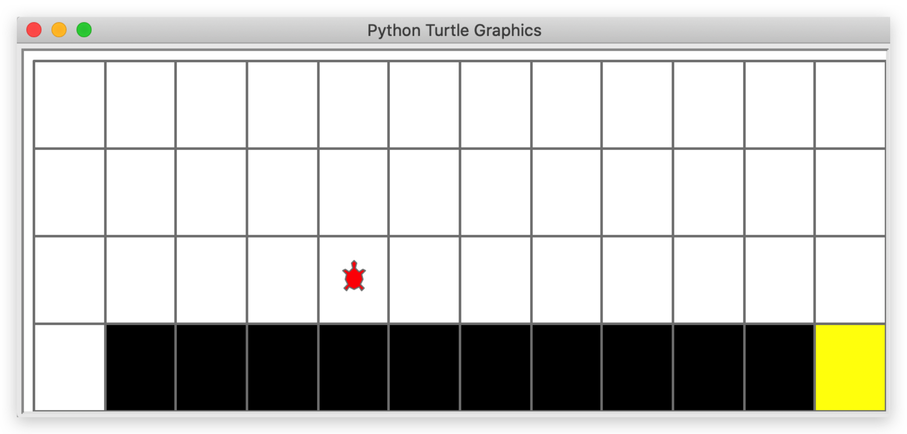
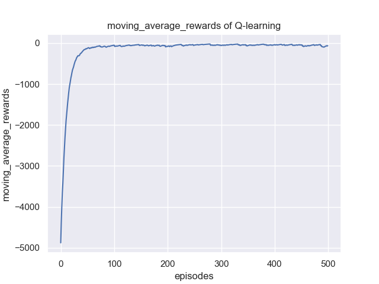

# 使用Q-learning解决悬崖寻路问题

强化学习在运动规划方面也有很大的应用前景，具体包括路径规划与决策，智能派单等等，本次项目就将单体运动规划抽象并简化，让大家初步认识到强化学习在这方面的应用。在运动规划方面，其实已有很多适用于强化学习的仿真环境，小到迷宫，大到贴近真实的自动驾驶环境[CARLA](http://carla.org/)，对这块感兴趣的童鞋可以再多搜集一点。本项目采用gym开发的```CliffWalking-v0```环境，在上面实现一个简单的Q-learning入门demo。

## CliffWalking-v0环境简介

首先对该环境做一个简介，该环境中文名称叫悬崖寻路问题（CliffWalking），是指在一个4 x 12的网格中，智能体以网格的左下角位置为起点，以网格的下角位置为终点，目标是移动智能体到达终点位置，智能体每次可以在上、下、左、右这4个方向中移动一步，每移动一步会得到-1单位的奖励。


如图，红色部分表示悬崖，数字代表智能体能够观测到的位置信息，即observation，总共会有0-47等48个不同的值，智能体再移动中会有以下限制：

* 智能体不能移出网格，如果智能体想执行某个动作移出网格，那么这一步智能体不会移动，但是这个操作依然会得到-1单位的奖励

* 如果智能体“掉入悬崖” ，会立即回到起点位置，并得到-100单位的奖励

* 当智能体移动到终点时，该回合结束，该回合总奖励为各步奖励之和

实际的仿真界面如下：



**由于从起点到终点最少需要13步，每步得到-1的reward，因此最佳训练算法下，每个episode下reward总和应该为-13**。所以我们的目标也是要通过RL训练出一个模型，使得该模型能在测试中一个episode的reward能够接近于-13左右。

## RL基本训练接口

以下是强化学习算法的基本接口，也就是一个完整的上层训练模式，首先是初始化环境和智能体，然后每个episode中，首先agent选择action给到环境，然后环境反馈出下一个状态和reward，然后agent开始更新或者学习，如此多个episode之后agent开始收敛并保存模型。其中可以通过可视化reward随每个episode的变化来查看训练的效果。另外由于强化学习的不稳定性，在收敛的状态下也可能会有起伏的情况，此时可以使用滑动平均的reward让曲线更加平滑便于分析。

```python
  '''初始化环境'''  
env = gym.make("CliffWalking-v0")  # 0 up, 1 right, 2 down, 3 left
env = CliffWalkingWapper(env)
agent = QLearning(
    state_dim=env.observation_space.n,
    action_dim=env.action_space.n,
    learning_rate=cfg.policy_lr,
    gamma=cfg.gamma,
rewards = []  
ma_rewards = [] # moving average reward
for i_ep in range(cfg.train_eps): # train_eps: 训练的最大episodes数
    ep_reward = 0  # 记录每个episode的reward
    state = env.reset()  # 重置环境, 重新开一局（即开始新的一个episode）
    while True:
        action = agent.choose_action(state)  # 根据算法选择一个动作
        next_state, reward, done, _ = env.step(action)  # 与环境进行一次动作交互
        agent.update(state, action, reward, next_state, done)  # Q-learning算法更新
        state = next_state  # 存储上一个观察值
        ep_reward += reward
        if done:
            break
    rewards.append(ep_reward)
    if ma_rewards:
        ma_rewards.append(ma_rewards[-1]*0.9+ep_reward*0.1)
    else:
        ma_rewards.append(ep_reward)
    print("Episode:{}/{}: reward:{:.1f}".format(i_ep+1, cfg.train_eps,ep_reward))
```

## 任务要求

基于以上的目标，本次任务即使训练并绘制reward以及滑动平均后的reward随episode的变化曲线图并记录超参数写成报告，示例如下：




## 主要代码清单

**main.py** 或 **task_train.py**：保存强化学习基本接口，以及相应的超参数

**agent.py**: 保存算法模型，主要包含choose_action(预测动作)和update两个函数，有时会多一个predict_action函数，此时choose_action使用了epsilon-greedy策略便于训练的探索，而测试时用predict_action单纯贪心地选择网络的值输出动作

**model.py**：保存神经网络，比如全连接网络等等，对于一些算法，分为Actor和Critic两个类

**memory.py**：保存replay buffer，根据算法的不同，replay buffer功能有所不同，因此会改写

**plot.py**：保存相关绘制函数

[参考代码](https://github.com/datawhalechina/easy-rl/tree/master/projects/codes/QLearning)

## 备注

* 注意 $\varepsilon$-greedy 策略的使用，以及相应的参数$\varepsilon$如何衰减
* 训练模型和测试模型的时候选择动作有一些不同，训练时采取 $\varepsilon$-greedy策略，而测试时直接选取Q值最大对应的动作，所以算法在动作选择的时候会包括sample(训练时的动作采样)和predict(测试时的动作选择)

* Q值最大对应的动作可能不止一个，此时可以随机选择一个输出结果
