# Policy Gradient
##  Policy Gradient

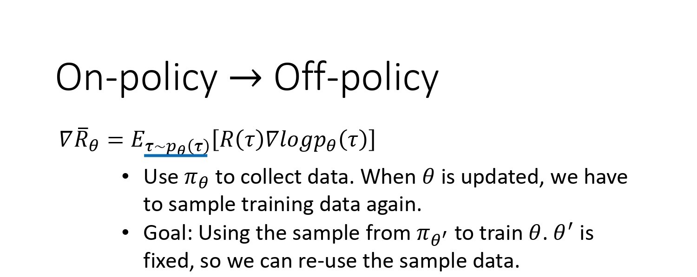

在强化学习中有 3 个组成部分：`演员(actor)`、`环境(environment)` 和 `奖励函数(reward function)`。

让机器玩视频游戏时，

* 演员做的事情就是去操控游戏的摇杆， 比如说向左、向右、开火等操作；
* 环境就是游戏的主机， 负责控制游戏的画面，负责控制怪物要怎么移动， 你现在要看到什么画面等等；
* 奖励函数就是当你做什么事情，发生什么状况的时候，你可以得到多少分数， 比如说杀一只怪兽得到 20 分等等。

同样的概念用在围棋上也是一样的，

* 演员就是 Alpha Go，它要决定下哪一个位置；
* 环境就是对手；
* 奖励函数就是按照围棋的规则， 赢就是得一分，输就是负一分。

在强化学习里面，环境跟奖励函数不是你可以控制的，环境跟奖励函数是在开始学习之前，就已经事先给定的。你唯一能做的事情是调整演员里面的策略(policy)，使得演员可以得到最大的奖励。演员里面会有一个策略，这个策略决定了演员的行为。给定一个外界的输入，策略会输出演员现在应该要执行的行为。

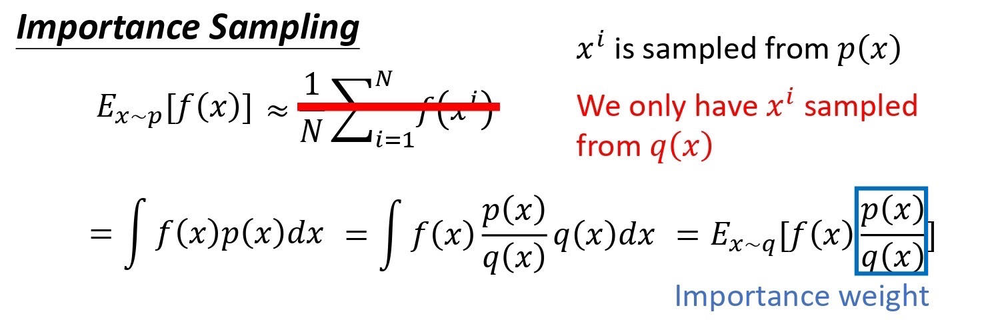

* 策略一般写成 $\pi$。假设你是用深度学习的技术来做强化学习的话，**策略就是一个网络**。网络里面就有一堆参数，我们用 $\theta$ 来代表 $\pi$ 的参数。

* **网络的输入就是现在机器看到的东西**，如果让机器打电玩的话，机器看到的东西就是游戏的画面。机器看到什么东西，会影响你现在训练到底好不好训练。举例来说，在玩游戏的时候， 也许你觉得游戏的画面前后是相关的，也许你觉得你应该让你的策略，看从游戏初始到现在这个时间点，所有画面的总和。你可能会觉得你要用到 RNN 来处理它，不过这样子会比较难处理。要让你的机器，你的策略看到什么样的画面，这个是你自己决定的。让你知道说给机器看到什么样的游戏画面，可能是比较有效的。
* **输出的就是机器要采取什么样的行为。**

* 上图就是具体的例子，
  * 策略就是一个网络；
  * 输入 就是游戏的画面，它通常是由像素(pixels)所组成的；
  * 输出就是看看说有哪些选项是你可以去执行的，输出层就有几个神经元。
  * 假设你现在可以做的行为有 3 个，输出层就是有 3 个神经元。每个神经元对应到一个可以采取的行为。
  * 输入一个东西后，网络就会给每一个可以采取的行为一个分数。你可以把这个分数当作是概率。演员就是看这个概率的分布，根据这个概率的分布来决定它要采取的行为。比如说 70% 会向左走，20% 向右走，10% 开火等等。概率分布不同，演员采取的行为就会不一样。

**接下来用一个例子来说明演员是怎么样跟环境互动的。**

首先演员会看到一个游戏画面，我们用 $s_1$ 来表示游戏初始的画面。接下来演员看到这个游戏的初始画面以后，根据它内部的网络，根据它内部的策略来决定一个动作。假设它现在决定的动作 是向右，它决定完动作 以后，它就会得到一个奖励，代表它采取这个动作以后得到的分数。

我们把一开始的初始画面记作 $s_1$， 把第一次执行的动作记作 $a_1$，把第一次执行动作完以后得到的奖励记作 $r_1$。不同的书会有不同的定义，有人会觉得说这边应该要叫做 $r_2$，这个都可以，你自己看得懂就好。演员决定一个行为以后，就会看到一个新的游戏画面，这边是 $s_2$。然后把这个 $s_2$ 输入给演员，这个演员决定要开火，然后它可能杀了一只怪，就得到五分。这个过程就反复地持续下去，直到今天走到某一个时间点执行某一个动作，得到奖励之后，这个环境决定这个游戏结束了。比如说，如果在这个游戏里面，你是控制绿色的船去杀怪，如果你被杀死的话，游戏就结束，或是你把所有的怪都清空，游戏就结束了。

* 一场游戏叫做一个 `回合(episode)` 或者 `试验(trial)`。
* 把这场游戏里面所有得到的奖励都加起来，就是 `总奖励(total reward)`，我们称其为`回报(return)`，用 R 来表示它。
* 演员要想办法去最大化它可以得到的奖励。

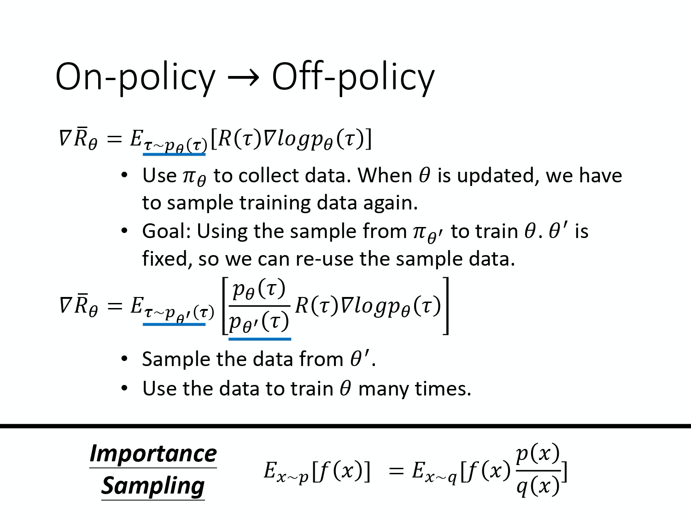
首先，`环境` 是一个`函数`，游戏的主机也可以把它看作是一个函数，虽然它不一定是神经网络，可能是基于规则的(rule-based)规则，但你可以把它看作是一个函数。这个函数一开始就先吐出一个状态，也就是游戏的画面，接下来你的演员看到这个游戏画面 $s_1$ 以后，它吐出 $a_1$，然后环境把 $a_1$ 当作它的输入，然后它再吐出 $s_2$，吐出新的游戏画面。演员看到新的游戏画面，再采取新的行为 $a_2$，然后 环境再看到 $a_2$，再吐出 $s_3$。这个过程会一直持续下去，直到环境觉得说应该要停止为止。

在一场游戏里面，我们把环境输出的 $s$ 跟演员输出的行为 $a$，把 $s$ 跟 $a$ 全部串起来， 叫做一个 `Trajectory(轨迹)`，如下式所示。
$$
\text { Trajectory } \tau=\left\{s_{1}, a_{1}, s_{2}, a_{2}, \cdots, s_{t}, a_{t}\right\}
$$

你可以计算每一个轨迹发生的概率。假设现在演员的参数已经被给定了话，就是 $\theta$。根据 $\theta$，你其实可以计算某一个轨迹发生的概率，你可以计算某一个回合里面发生这样子状况的概率。

$$
\begin{aligned}
p_{\theta}(\tau)
&=p\left(s_{1}\right) p_{\theta}\left(a_{1} | s_{1}\right) p\left(s_{2} | s_{1}, a_{1}\right) p_{\theta}\left(a_{2} | s_{2}\right) p\left(s_{3} | s_{2}, a_{2}\right) \cdots \\
&=p\left(s_{1}\right) \prod_{t=1}^{T} p_{\theta}\left(a_{t} | s_{t}\right) p\left(s_{t+1} | s_{t}, a_{t}\right)
\end{aligned}
$$

怎么算呢，如上式所示。在假设演员的参数就是 $\theta$ 的情况下，某一个轨迹 $\tau$ 的概率就是这样算的，你先算环境输出 $s_1$ 的概率，再计算根据 $s_1$ 执行 $a_1$ 的概率，这是由你策略里面的网络参数 $\theta$ 所决定的， 它是一个概率，因为你的策略的网络的输出是一个分布，演员是根据这个分布去做采样，决定现在实际上要采取的动作是哪一个。接下来环境根据 $a_1$ 跟 $s_1$ 产生 $s_2$，因为 $s_2$ 跟 $s_1$ 还是有关系的，下一个游戏画面跟前一个游戏画面通常还是有关系的，至少要是连续的， 所以给定前一个游戏画面 $s_1$ 和现在演员采取的行为 $a_1$，就会产生 $s_2$。

这件事情可能是概率，也可能不是概率，这个取决于环境，就是主机它内部设定是怎样。看今天这个主机在决定，要输出什么样的游戏画面的时候，有没有概率。因为如果没有概率的话，这个游戏的每次的行为都一样，你只要找到一条路径就可以过关了，这样感觉是蛮无聊的 。所以游戏里面通常还是有一些概率的，你做同样的行为，给同样的前一个画面， 下次产生的画面不见得是一样的。过程就反复继续下去，你就可以计算一个轨迹 $s_1$,$a_1$, $s_2$ , $a_2$ 出现的概率有多大。

**这个概率取决于两部分：环境的行为和 agent 的行为**， 

*  `环境的行为` 。环境的函数内部的参数或内部的规则长什么样子。 $p(s_{t+1}|s_t,a_t)$这一项代表的是环境，环境这一项通常你是无法控制它的，因为那个是人家写好的，你不能控制它。
*  `agent 的行为`。你能控制的是 $p_\theta(a_t|s_t)$。给定一个 $s_t$，演员要采取什么样的 $a_t$ 会取决于演员的参数 $\theta$， 所以这部分是演员可以自己控制的。随着演员的行为不同，每个同样的轨迹， 它就会有不同的出现的概率。

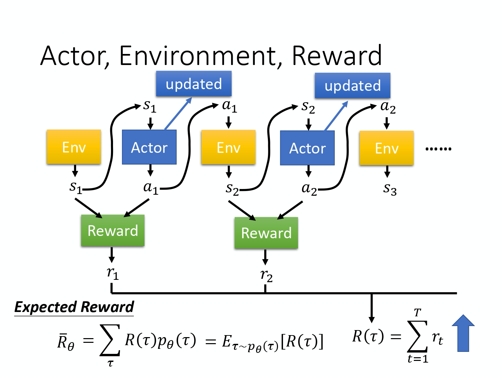

在强化学习里面，除了环境跟演员以外， 还有`奖励函数(reward function)`。

奖励函数根据在某一个状态采取的某一个动作决定说现在这个行为可以得到多少的分数。 它是一个函数，给它 $s_1$，$a_1$，它告诉你得到 $r_1$。给它 $s_2$ ，$a_2$，它告诉你得到 $r_2$。 把所有的 $r$ 都加起来，我们就得到了 $R(\tau)$ ，代表某一个轨迹 $\tau$ 的奖励。

在某一场游戏里面， 某一个回合里面，我们会得到 R。**我们要做的事情就是调整演员内部的参数 $\theta$， 使得 R 的值越大越好。** 但实际上奖励并不只是一个标量，奖励其实是一个随机变量。R 其实是一个随机变量，因为演员在给定同样的状态会做什么样的行为，这件事情是有随机性的。环境在给定同样的观测要采取什么样的动作，要产生什么样的观测，本身也是有随机性的，所以 R 是一个随机变量。你能够计算的是 R 的期望值。你能够计算的是说，在给定某一组参数 $\theta$ 的情况下，我们会得到的 $R_{\theta}$ 的期望值是多少。
$$
\bar{R}_{\theta}=\sum_{\tau} R(\tau) p_{\theta}(\tau)
$$
这个期望值的算法如上式所示。我们要穷举所有可能的轨迹 $\tau$， 每一个轨迹 $\tau$ 都有一个概率。

比如 $\theta$ 是一个很强的模型，它都不会死。因为 $\theta$ 很强，所以：

* 如果有一个回合 $\theta$ 很快就死掉了，因为这种情况很少会发生，所以该回合对应的轨迹 $\tau$ 的概率就很小；
* 如果有一个回合 $\theta$ 都一直没有死，因为这种情况很可能发生，所以该回合对应的轨迹 $\tau$ 的概率就很大。

你可以根据 $\theta$ 算出某一个轨迹 $\tau$ 出现的概率，接下来计算这个 $\tau$ 的总奖励是多少。总奖励使用这个 $\tau$ 出现的概率进行加权，对所有的 $\tau$ 进行求和，就是期望值。给定一个参数，你会得到的期望值。
$$
\bar{R}_{\theta}=\sum_{\tau} R(\tau) p_{\theta}(\tau)=E_{\tau \sim p_{\theta}(\tau)}[R(\tau)]
$$
我们还可以写成上式那样，从 $p_{\theta}(\tau)$ 这个分布采样一个轨迹 $\tau$，然后计算 $R(\tau)$ 的期望值，就是你的期望的奖励。 我们要做的事情就是最大化期望奖励。

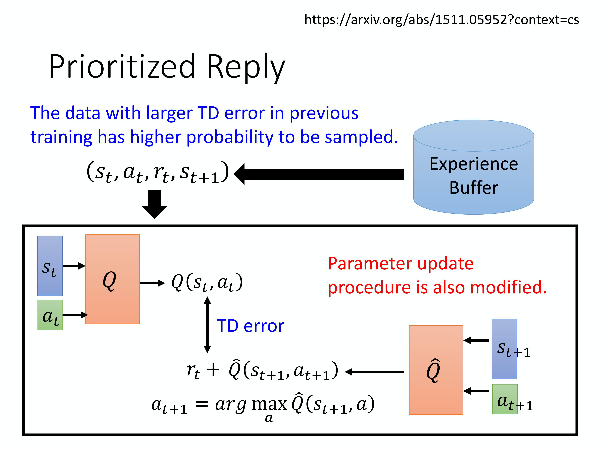

怎么最大化期望奖励呢？我们用的是 `梯度上升(gradient ascent)`，因为要让它越大越好，所以是梯度上升。梯度上升在更新参数的时候要加。要进行梯度上升，我们先要计算期望的奖励(expected reward) $\bar{R}$ 的梯度。我们对 $\bar{R}$ 取一个梯度，这里面只有 $p_{\theta}(\tau)$ 是跟 $\theta$ 有关，所以梯度就放在 $p_{\theta}(\tau)$ 这个地方。$R(\tau)$ 这个奖励函数不需要是可微分的(differentiable)，这个不影响我们解接下来的问题。举例来说，如果是在 GAN 里面，$R(\tau)$ 其实是一个 discriminator，它就算是没有办法微分，也无所谓，你还是可以做接下来的运算。

取梯度之后，我们背一个公式：
$$
\nabla f(x)=f(x)\nabla \log f(x)
$$
我们可以对 $\nabla p_{\theta}(\tau)$ 使用这个公式，然后会得到 $\nabla p_{\theta}(\tau)=p_{\theta}(\tau)  \nabla \log p_{\theta}(\tau)$，进一步地，我们可以得到下式：

$$
\frac{\nabla p_{\theta}(\tau)}{p_{\theta}(\tau)}=\nabla \log p_{\theta}(\tau)
$$

如下式所示，对 $\tau$ 进行求和，把 $R(\tau)$  和  $\log p_{\theta}(\tau)$ 这两项使用 $p_{\theta}(\tau)$ 进行加权， 既然使用 $p_{\theta}(\tau)$ 进行加权 ，它们就可以被写成期望的形式。也就是你从 $p_{\theta}(\tau)$ 这个分布里面采样 $\tau$ 出来， 去计算 $R(\tau)$ 乘上 $\nabla\log p_{\theta}(\tau)$，然后把它对所有可能的 $\tau$ 进行求和，就是这个期望的值(expected value)。
$$
\begin{aligned}
\nabla \bar{R}_{\theta}&=\sum_{\tau} R(\tau) \nabla p_{\theta}(\tau)\\&=\sum_{\tau} R(\tau) p_{\theta}(\tau) \frac{\nabla p_{\theta}(\tau)}{p_{\theta}(\tau)} \\&=
\sum_{\tau} R(\tau) p_{\theta}(\tau) \nabla \log p_{\theta}(\tau) \\
&=E_{\tau \sim p_{\theta}(\tau)}\left[R(\tau) \nabla \log p_{\theta}(\tau)\right]
\end{aligned}
$$

实际上这个期望值没有办法算，所以你是用采样的方式来采样一大堆的 $\tau$。你采样 $N$ 笔  $\tau$， 然后你去计算每一笔的这些值，然后把它全部加起来，就可以得到梯度。你就可以去更新参数，你就可以去更新你的 agent，如下式所示：
$$
\begin{aligned}
E_{\tau \sim p_{\theta}(\tau)}\left[R(\tau) \nabla \log p_{\theta}(\tau)\right] &\approx \frac{1}{N} \sum_{n=1}^{N} R\left(\tau^{n}\right) \nabla \log p_{\theta}\left(\tau^{n}\right) \\
&=\frac{1}{N} \sum_{n=1}^{N} \sum_{t=1}^{T_{n}} R\left(\tau^{n}\right) \nabla \log p_{\theta}\left(a_{t}^{n} \mid s_{t}^{n}\right)
\end{aligned}
$$
下面给出 $\nabla \log p_{\theta}(\tau)$ 的具体计算过程，如下式所示。
$$
\begin{aligned}
\nabla \log p_{\theta}(\tau) &= \nabla \left(\log p(s_1)+\sum_{t=1}^{T}\log p_{\theta}(a_t|s_t)+ \sum_{t=1}^{T}\log p(s_{t+1}|s_t,a_t) \right) \\
&= \nabla \log p(s_1)+ \nabla \sum_{t=1}^{T}\log p_{\theta}(a_t|s_t)+  \nabla \sum_{t=1}^{T}\log p(s_{t+1}|s_t,a_t) \\
&=\nabla \sum_{t=1}^{T}\log p_{\theta}(a_t|s_t)\\
&=\sum_{t=1}^{T} \nabla\log p_{\theta}(a_t|s_t)
\end{aligned}
$$

注意， $p(s_1)$ 和 $p(s_{t+1}|s_t,a_t)$ 来自于环境，$p_\theta(a_t|s_t)$ 是来自于 agent。$p(s_1)$ 和 $p(s_{t+1}|s_t,a_t)$ 由环境决定，所以与 $\theta$ 无关，因此 $\nabla \log p(s_1)=0$ ，$\nabla \sum_{t=1}^{T}\log p(s_{t+1}|s_t,a_t)=0$。

$$
\begin{aligned}
\nabla \bar{R}_{\theta}&=\sum_{\tau} R(\tau) \nabla p_{\theta}(\tau)\\&=\sum_{\tau} R(\tau) p_{\theta}(\tau) \frac{\nabla p_{\theta}(\tau)}{p_{\theta}(\tau)} \\&=
\sum_{\tau} R(\tau) p_{\theta}(\tau) \nabla \log p_{\theta}(\tau) \\
&=E_{\tau \sim p_{\theta}(\tau)}\left[R(\tau) \nabla \log p_{\theta}(\tau)\right]\\
&\approx \frac{1}{N} \sum_{n=1}^{N} R\left(\tau^{n}\right) \nabla \log p_{\theta}\left(\tau^{n}\right) \\
&=\frac{1}{N} \sum_{n=1}^{N} \sum_{t=1}^{T_{n}} R\left(\tau^{n}\right) \nabla \log p_{\theta}\left(a_{t}^{n} \mid s_{t}^{n}\right)
\end{aligned}
$$

我们可以直观地来理解上面这个式子，也就是在你采样到的数据里面， 你采样到在某一个状态 $s_t$ 要执行某一个动作 $a_t$， 这个 $s_t$ 跟 $a_t$ 它是在整个轨迹 $\tau$ 的里面的某一个状态和动作的对。

*  假设你在 $s_t$ 执行 $a_t$，最后发现 $\tau$ 的奖励是正的， 那你就要增加这一项的概率，你就要增加在 $s_t$ 执行 $a_t$ 的概率。
*  反之，在 $s_t$ 执行 $a_t$ 会导致 $\tau$ 的奖励变成负的， 你就要减少这一项的概率。

这个怎么实现呢？ 你用梯度上升来更新你的参数，你原来有一个参数 $\theta$ ，把你的 $\theta$  加上你的梯度这一项，那当然前面要有个学习率，学习率也是要调整的，你可用 Adam、RMSProp 等方法对其进行调整。

我们可以套下面这个公式来把梯度计算出来:
$$
\nabla \bar{R}_{\theta}=\frac{1}{N} \sum_{n=1}^{N} \sum_{t=1}^{T_{n}} R\left(\tau^{n}\right) \nabla \log p_{\theta}\left(a_{t}^{n} | s_{t}^{n}\right)
$$
实际上，要套上面这个公式， 首先你要先收集一大堆的 s 跟 a 的对(pair)，你还要知道这些 s 跟 a 在跟环境互动的时候，你会得到多少的奖励。 这些资料怎么收集呢？你要拿你的 agent，它的参数是 $\theta$，去跟环境做互动， 也就是拿你已经训练好的 agent 先去跟环境玩一下，先去跟那个游戏互动一下， 互动完以后，你就会得到一大堆游戏的纪录，你会记录说，今天先玩了第一场，在第一场游戏里面，我们在状态 $s_1$ 采取动作 $a_1$，在状态$s_2$ 采取动作 $a_2$ 。

玩游戏的时候是有随机性的，所以 agent 本身是有随机性的，在同样状态$s_1$，不是每次都会采取 $a_1$，所以你要记录下来。在状态 $s_1^1$ 采取 $a_1^1$，在状态 $s_2^1$ 采取 $a_2^1$。整场游戏结束以后，得到的分数是 $R(\tau^1)$。你会采样到另外一笔数据，也就是另外一场游戏。在另外一场游戏里面，你在状态 $s_1^2$ 采取 $a_1^2$，在状态 $s_2^2$ 采取 $a_2^2$，然后你采样到的就是 $\tau^2$，得到的奖励是 $R(\tau^2)$。

你就可以把采样到的东西代到这个梯度的式子里面，把梯度算出来。也就是把这边的每一个 s 跟 a 的对拿进来，算一下它的对数概率(log probability)。你计算一下在某一个状态采取某一个动作的对数概率，然后对它取梯度，然后这个梯度前面会乘一个权重，权重就是这场游戏的奖励。 有了这些以后，你就会去更新你的模型。

更新完你的模型以后。你要重新去收集数据，再更新模型。注意，一般  `policy gradient(PG) `采样的数据就只会用一次。你把这些数据采样起来，然后拿去更新参数，这些数据就丢掉了。接着再重新采样数据，才能够去更新参数，等一下我们会解决这个问题。

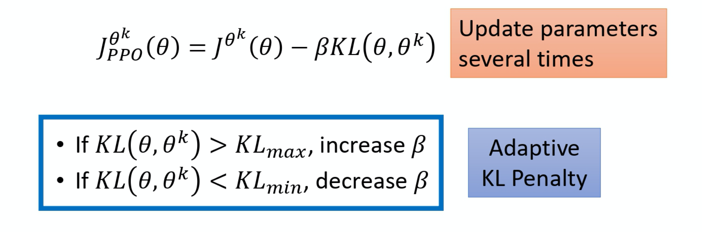

**接下来讲一些实现细节。**

我们可以把它想成一个分类的问题，在分类里面就是输入一个图像，然后输出决定说是 10 个类里面的哪一个。在做分类时，我们要收集一堆训练数据，要有输入跟输出的对。

在实现的时候，你就把状态当作是分类器的输入。 你就当在做图像分类的问题，只是现在的类不是说图像里面有什么东西，而是说看到这张图像我们要采取什么样的行为，每一个行为就是一个类。比如说第一个类叫做向左，第二个类叫做向右，第三个类叫做开火。

在做分类的问题时，要有输入和正确的输出，要有训练数据。而这些训练数据是从采样的过程来的。假设在采样的过程里面，在某一个状态，你采样到你要采取动作 a， 你就把这个动作 a 当作是你的 ground truth。你在这个状态，你采样到要向左。 本来向左这件事概率不一定是最高， 因为你是采样，它不一定概率最高。假设你采样到向左，在训练的时候，你告诉机器说，调整网络的参数， 如果看到这个状态，你就向左。在一般的分类问题里面，其实你在实现分类的时候，你的目标函数都会写成最小化交叉熵(cross entropy)，其实最小化交叉熵就是最大化对数似然(log likelihood)。

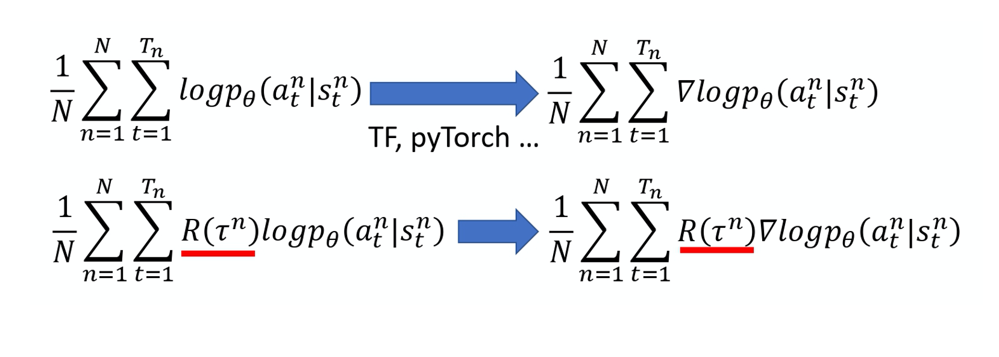

做分类的时候，目标函数就是最大化或最小化的对象， 因为我们现在是最大化似然(likelihood)，所以其实是最大化， 你要最大化的对象，如下式所示:
$$
\frac{1}{N} \sum_{n=1}^{N} \sum_{t=1}^{T_{n}} \log p_{\theta}\left(a_{t}^{n} \mid s_{t}^{n}\right)
$$
像这种损失函数，你可在 TensorFlow 里调用现成的函数，它就会自动帮你算，然后你就可以把梯度计算出来。这是一般的分类问题，RL 唯一不同的地方是 loss 前面乘上一个权重：整场游戏得到的总奖励 R，它并不是在状态 s 采取动作 a 的时候得到的奖励，如下式所示：
$$
\frac{1}{N} \sum_{n=1}^{N} \sum_{t=1}^{T_{n}} R\left(\tau^{n}\right)  \log p_{\theta}\left(a_{t}^{n} \mid s_{t}^{n}\right)
$$
你要把你的每一笔训练数据，都使用这个 R 进行加权。然后你用 TensorFlow 或 PyTorch 去帮你算梯度就结束了，跟一般分类差不多。

## Tips
这边有一些在实现的时候，你也许用得上的 tip。
### Tip 1: Add a Baseline

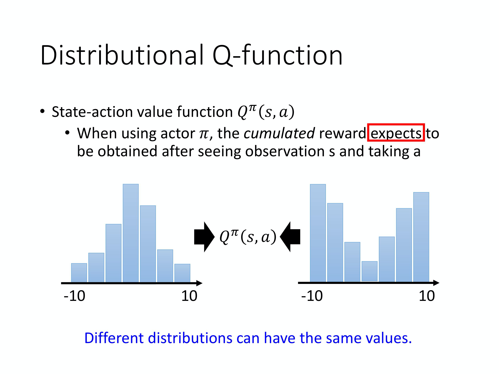

**第一个 tip 是 add 一个 baseline。** 如果给定状态 s 采取动作 a 会给你整场游戏正的奖励，就要增加它的概率。如果状态 s 执行动作 a，整场游戏得到负的奖励，就要减少这一项的概率。

但在很多游戏里面，奖励总是正的，就是说最低都是 0。比如说打乒乓球游戏， 你的分数就是介于 0 到 21 分之间，所以 R 总是正的。假设你直接套用这个式子， 在训练的时候告诉模型说，不管是什么动作你都应该要把它的概率提升。 在理想上，这么做并不一定会有问题。因为虽然说 R 总是正的，但它正的量总是有大有小，你在玩乒乓球那个游戏里面，得到的奖励总是正的，但它是介于 0~21分之间，有时候你采取某些动作可能是得到 0 分，采取某些动作可能是得到 20 分。

假设你在某一个状态有 3 个动作 a/b/c可以执行。根据下式，
$$
\nabla \bar{R}_{\theta} \approx \frac{1}{N} \sum_{n=1}^{N} \sum_{t=1}^{T_{n}} R\left(\tau^{n}\right) \nabla \log p_{\theta}\left(a_{t}^{n} \mid s_{t}^{n}\right)
$$
你要把这 3 项的概率，对数概率都拉高。 但是它们前面权重的 R 是不一样的。 R 是有大有小的，权重小的，它上升的就少，权重多的，它上升的就大一点。 因为这个对数概率是一个概率，所以动作 a、b、c 的对数概率的和要是 0。 所以上升少的，在做完归一化(normalize)以后， 它其实就是下降的，上升的多的，才会上升。

 

这是一个理想上的状况，但是实际上，我们是在做采样就本来这边应该是一个期望(expectation)，对所有可能的 s 跟 a 的对进行求和。 但你真正在学的时候不可能是这么做的，你只是采样了少量的 s 跟 a 的对而已。 因为我们做的是采样，有一些动作可能从来都没有采样到。在某一个状态，虽然可以执行的动作有 a/b/c，但你可能只采样到动作 b，你可能只采样到动作 c，你没有采样到动作 a。但现在所有动作的奖励都是正的，所以根据这个式子，它的每一项的概率都应该要上升。你会遇到的问题是，因为 a 没有被采样到，其它动作的概率如果都要上升，a 的概率就下降。 所以 a 不一定是一个不好的动作， 它只是没被采样到。但只是因为它没被采样到， 它的概率就会下降，这个显然是有问题的，要怎么解决这个问题呢？你会希望你的奖励不要总是正的。

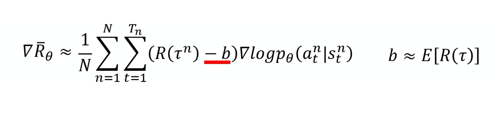

为了解决奖励总是正的这个问题，你可以把奖励减掉一项叫做 b，这项 b 叫做 baseline。你减掉这项 b 以后，就可以让 $R(\tau^n)-b$ 这一项有正有负。 所以如果得到的总奖励 $R(\tau^n)$ 大于 b 的话，就让它的概率上升。如果这个总奖励小于 b，就算它是正的，正的很小也是不好的，你就要让这一项的概率下降。 如果$R(\tau^n)<b$  ， 你就要让这个状态采取这个动作的分数下降 。这个 b 怎么设呢？一个最简单的做法就是：你把 $\tau^n$ 的值取期望， 算一下 $\tau^n$ 的平均值，即：
$$
b \approx E[R(\tau)]
$$
这是其中一种做法， 你可以想想看有没有其它的做法。

 所以在实现训练的时候，你会不断地把 $R(\tau)$ 的分数记录下来 然后你会不断地去计算 $R(\tau)$ 的平均值， 你会把这个平均值，当作你的 b 来用。 这样就可以让你在训练的时候， $\nabla \log p_{\theta}\left(a_{t}^{n} | s_{t}^{n}\right)$ 乘上前面这一项， 是有正有负的，这个是第一个 tip。

### Tip 2: Assign Suitable Credit

**第二个 tip：给每一个动作合适的分数(credit)。**

如果我们看下面这个式子的话，
$$
\nabla \bar{R}_{\theta} \approx \frac{1}{N} \sum_{n=1}^{N} \sum_{t=1}^{T_{n}}\left(R\left(\tau^{n}\right)-b\right) \nabla \log p_{\theta}\left(a_{t}^{n} \mid s_{t}^{n}\right)
$$
我们原来会做的事情是，在某一个状态，假设你执行了某一个动作 a，它得到的奖励，它前面乘上的这一项 $R(\tau^n)-b$。

只要在同一个回合里面，在同一场游戏里面， 所有的状态跟动作的对都会使用同样的奖励项(term)进行加权，这件事情显然是不公平的，因为在同一场游戏里面 也许有些动作是好的，有些动作是不好的。 假设整场游戏的结果是好的， 并不代表这个游戏里面每一个行为都是对的。若是整场游戏结果不好， 但不代表游戏里面的所有行为都是错的。所以我们希望可以给每一个不同的动作前面都乘上不同的权重。每一个动作的不同权重， 它反映了每一个动作到底是好还是不好。 

举个例子， 假设这个游戏都很短，只有 3~4 个互动， 在 $s_a$ 执行 $a_1$ 得到 5 分。在 $s_b$ 执行 $a_2$ 得到 0 分。在 $s_c$ 执行 $a_3$ 得到 -2 分。 整场游戏下来，你得到 +3 分，那你得到 +3 分 代表在 $s_b$ 执行动作 $a_2$ 是好的吗？并不见得代表 $s_b$ 执行 $a_2$ 是好的。因为这个正的分数，主要来自于在 $s_a$ 执行了 $a_1$，跟在 $s_b$ 执行 $a_2$ 是没有关系的，也许在 $s_b$ 执行 $a_2$ 反而是不好的， 因为它导致你接下来会进入 $s_c$，执行 $a_3$ 被扣分，所以整场游戏得到的结果是好的， 并不代表每一个行为都是对的。

如果按照我们刚才的讲法，整场游戏得到的分数是 3 分，那到时候在训练的时候， 每一个状态跟动作的对，都会被乘上 +3。 在理想的状况下，这个问题，如果你采样够多就可以被解决。因为假设你采样够多，在 $s_b$ 执行 $a_2$ 的这件事情，被采样到很多。就某一场游戏，在 $s_b$ 执行 $a_2$，你会得到 +3 分。 但在另外一场游戏，在 $s_b$ 执行 $a_2$，你却得到了 -7 分，为什么会得到 -7 分呢？ 因为在 $s_b$ 执行 $a_2$ 之前， 你在 $s_a$ 执行 $a_2$ 得到 -5 分，-5 分这件事可能也不是在 $s_b$ 执行 $a_2$ 的错，这两件事情，可能是没有关系的，因为它先发生了，这件事才发生，所以它们是没有关系的。

在 $s_b$ 执行 $a_2$ 可能造成的问题只有会在接下来 -2 分，而跟前面的 -5 分没有关系的。但是假设我们今天采样到这项的次数够多，把所有发生这件事情的情况的分数通通都集合起来， 那可能不是一个问题。但现在的问题就是，我们采样的次数是不够多的。在采样的次数不够多的情况下，你要给每一个状态跟动作对合理的分数，你要让大家知道它合理的贡献。怎么给它一个合理的贡献呢？ 

一个做法是计算这个对的奖励的时候，不把整场游戏得到的奖励全部加起来，**只计算从这一个动作执行以后所得到的奖励**。因为这场游戏在执行这个动作之前发生的事情是跟执行这个动作是没有关系的， 所以在执行这个动作之前得到多少奖励都不能算是这个动作的功劳。跟这个动作有关的东西， 只有在执行这个动作以后发生的所有的奖励把它加起来，才是这个动作真正的贡献。所以在这个例子里面，在 $s_b$ 执行 $a_2$ 这件事情，也许它真正会导致你得到的分数应该是 -2 分而不是 +3 分，因为前面的 +5 分 并不是执行 $a_2$ 的功劳。实际上执行 $a_2$ 以后，到游戏结束前， 你只有被扣 2 分而已，所以它应该是 -2。那一样的道理，今天执行 $a_2$ 实际上不应该是扣 7 分，因为前面扣 5 分，跟在 $s_b$ 执行 $a_2$ 是没有关系的。在 $s_b$ 执行 $a_2$，只会让你被扣两分而已，所以也许在 $s_b$ 执行 $a_2$， 你真正会导致的结果只有扣两分而已。如果要把它写成式子的话是什么样子呢？如下式所示：

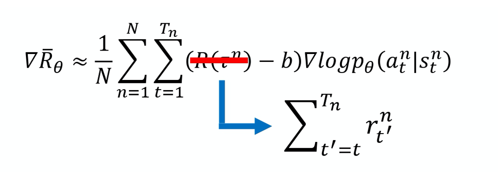

本来的权重是整场游戏的奖励的总和，现在改成从某个时间 $t$ 开始，假设这个动作是在 $t$ 这个时间点所执行的，从 $t$ 这个时间点一直到游戏结束所有奖励的总和，才真的代表这个动作是好的还是不好的。 

接下来再更进一步，我们把未来的奖励做一个折扣(discount)，由此得到的回报被称为 `Discounted Return(折扣回报)`。为什么要把未来的奖励做一个折扣呢？因为虽然在某一个时间点，执行某一个动作，会影响接下来所有的结果，有可能在某一个时间点执行的动作，接下来得到的奖励都是这个动作的功劳。但在比较真实的情况下， 如果时间拖得越长，影响力就越小。 比如说在第二个时间点执行某一个动作， 那我在第三个时间点得到的奖励可能是在第二个时间点执行某个动作的功劳，但是在 100 个时间点之后又得到奖励，那可能就不是在第二个时间点执行某一个动作得到的功劳。 所以我们实际上在做的时候，你会在 R 前面乘上一个 `discount factor`  $\gamma$， $\gamma \in [0,1] $ ，一般会设个 0.9 或 0.99，

* $\gamma = 0$ : 只关心即时奖励； 
* $\gamma = 1$ : 未来奖励等同于即时奖励。

如果时间点 $t'$ 越大，它前面就乘上越多次的 $\gamma$，就代表说现在在某一个状态 $s_t$， 执行某一个动作 $a_t$ 的时候，它真正的分数是在执行这个动作之后所有奖励的总和，而且你还要乘上 $\gamma$。

举一个例子， 你就想成说，这是游戏的第 1、2、3、4 回合，假设你在游戏的第二回合的某一个 $s_t$ 执行 $a_t$ 得到 +1 分，在 $s_{t+1}$ 执行 $a_{t+1}$ 得到 +3 分，在 $s_{t+2}$ 执行 $a_{t+2}$ 得到 -5 分，然后第二回合结束。$a_t$ 的分数应该是：
$$
1+ \gamma \times 3+\gamma^2 \times-5
$$
实际上就是这么实现的，b 可以是取决于状态(state-dependent)的，事实上 b 它通常是一个网络估计出来的，它是一个网络的输出。

把 $R-b$ 这一项合起来，我们统称为` 优势函数(advantage function)`， 用 `A` 来代表优势函数。优势函数取决于 s 和 a，我们就是要计算的是在某一个状态 s 采取某一个动作 a 的时候，优势函数有多大。

在算优势函数时，你要计算 $\sum_{t^{\prime}=t}^{T_{n}} r_{t^{\prime}}^{n}$ ，你需要有一个互动的结果。你需要有一个模型去跟环境做互动，你才知道接下来得到的奖励会有多少。优势函数 $A^{\theta}\left(s_{t}, a_{t}\right)$ 的上标是 $\theta$，$\theta$ 就是代表说是用 $\theta$ 这个模型跟环境去做互动，然后你才计算出这一项。从时间 t 开始到游戏结束为止，所有 r 的加和减掉 b，这个就叫优势函数。

优势函数的意义就是，假设我们在某一个状态$s_t$ 执行某一个动作 $a_t$，相较于其他可能的动作，它有多好。它在意的不是一个绝对的好，而是相对的好，即`相对优势(relative advantage)`。因为会减掉一个 b，减掉一个 baseline， 所以这个东西是相对的好，不是绝对的好。 $A^{\theta}\left(s_{t}, a_{t}\right)$ 通常可以是由一个网络估计出来的，这个网络叫做 critic。 

## REINFORCE: Monte Carlo Policy Gradient

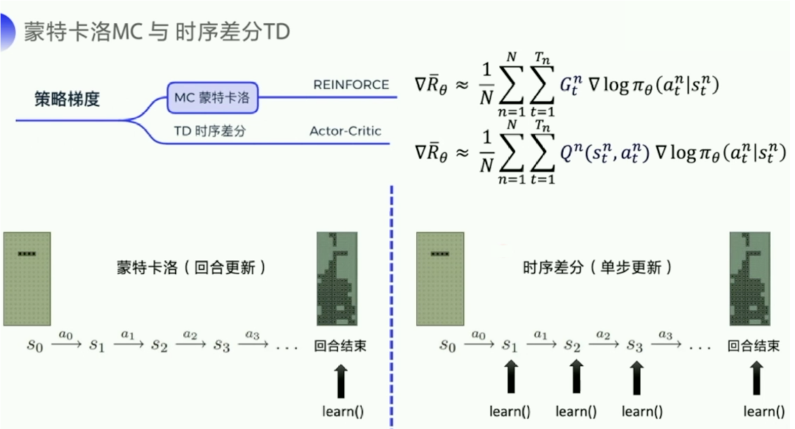

MC 可以理解为算法完成一个回合之后，再拿这个回合的数据来去 learn 一下，做一次更新。因为我们已经拿到了一整个回合的数据的话，也能够拿到每一个步骤的奖励，我们可以很方便地去计算每个步骤的未来总收益，就是我们的期望，就是我们的回报 $G_t$ 。$G_t$ 是我们的未来总收益，$G_t$ 代表是从这个步骤后面，我能拿到的收益之和是多少。$G_1 $是说我从第一步开始，往后能够拿到多少的收益。$G_2$ 是说从第二步开始，往后一共能够拿到多少的收益。

相比 MC 还是一个回合更新一次这样子的方式，TD 就是每个步骤都更新一下。每走一步，我就更新下，这样的更新频率会更高一点。它拿的是 Q-function 来去近似地表示我的未来总收益 $G_t$。

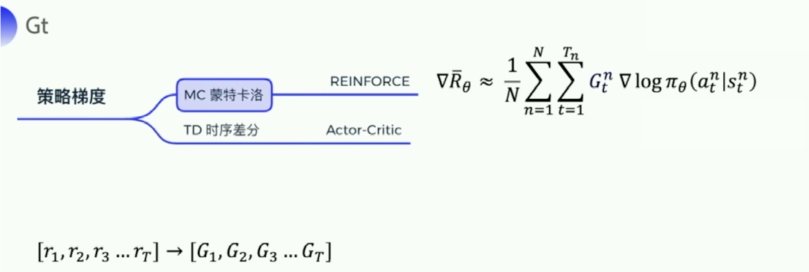

我们介绍下策略梯度最简单的也是最经典的一个算法 `REINFORCE`。REINFORCE 用的是回合更新的方式。它在代码上的处理上是先拿到每个步骤的奖励，然后计算每个步骤的未来总收益 $G_t$ 是多少，然后拿每个 $G_t$ 代入公式，去优化每一个动作的输出。所以编写代码时会有这样一个函数，输入每个步骤拿到的奖励，把这些奖励转成每一个步骤的未来总收益。因为未来总收益是这样计算的：
$$
\begin{aligned}
G_{t} &=\sum_{k=t+1}^{T} \gamma^{k-t-1} r_{k} \\
&=r_{t+1}+\gamma G_{t+1}
\end{aligned}
$$
上一个步骤和下一个步骤的未来总收益可以有这样子的一个关系。所以在代码的计算上，我们就是从后往前推，一步一步地往前推，先算 $G_T$，然后往前推，一直算到 $G_1$ 。

REINFORCE 的伪代码主要看最后四行，先产生一个回合的数据，比如 $(s_1,a_1,G_1),(s_2,a_2,G_2),\cdots,(s_T,a_T,G_T)$。然后针对每个动作来计算梯度。 在代码上计算时，我们要拿到神经网络的输出。神经网络会输出每个动作对应的概率值，然后我们还可以拿到实际的动作，把它转成 one-hot 向量乘一下，我们可以拿到 $\ln \pi(A_t|S_t,\theta)$  。

> 独热编码(one-hot Encoding)通常用于处理类别间不具有大小关系的特征。 例如血型，一共有4个取值（A型、B型、AB型、O型），独热编码会把血型变成一个4维稀疏向量，A型血表示为（1,0,0,0），B型血表示为（0,1,0,0），AB型会表示为（0,0,1,0），O型血表示为（0,0,0,1）。

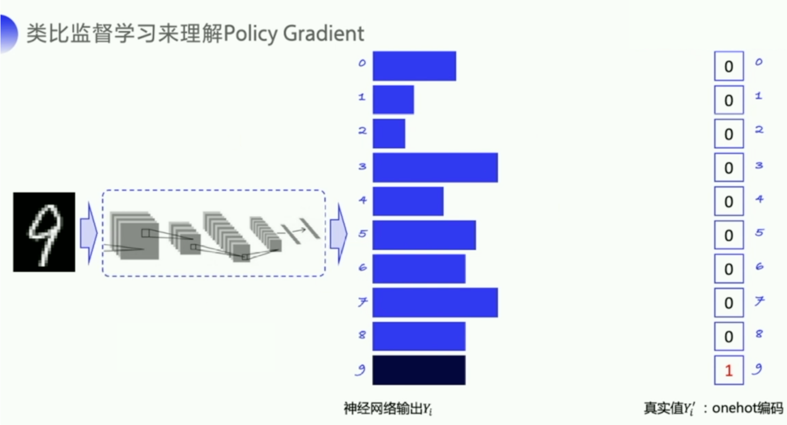

* 手写数字识别是一个经典的多分类问题，输入是一张手写数字的图片，经过神经网络输出的是各个类别的一个概率。
* 目的是希望输出的这个概率的分布尽可能地去贴近真实值的概率分布。
* 因为真实值只有一个数字 9，你用这个 one-hot 向量的形式去给它编码的话，也可以把这个真实值理解为一个概率分布，9 的概率就是1，其他的概率就是 0。

* 神经的网络输出一开始可能会比较平均，通过不断地迭代，训练优化之后，我会希望 9 输出的概率可以远高于其他数字输出的概率。

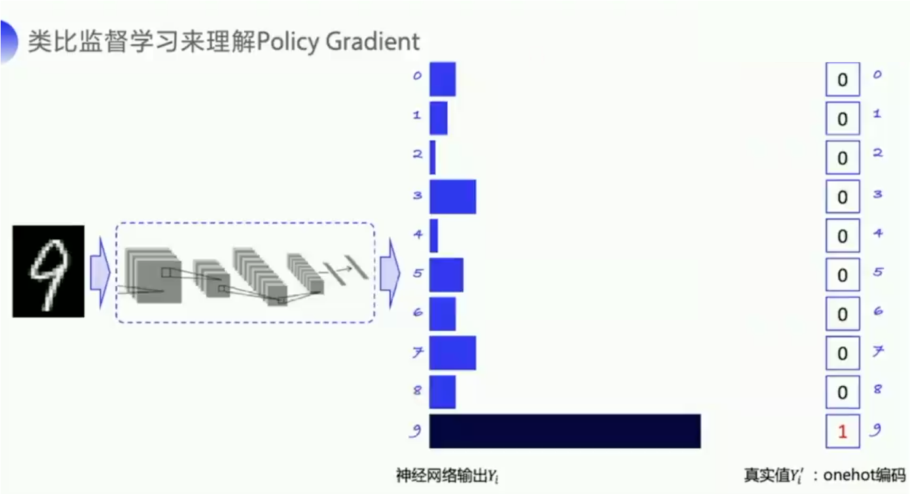

如上图所示，就是提高 9 对应的概率，降低其他数字对应的概率，让神经网络输出的概率能够更贴近这个真实值的概率分布。我们可以用`交叉熵`来去表示两个概率分布之间的差距。

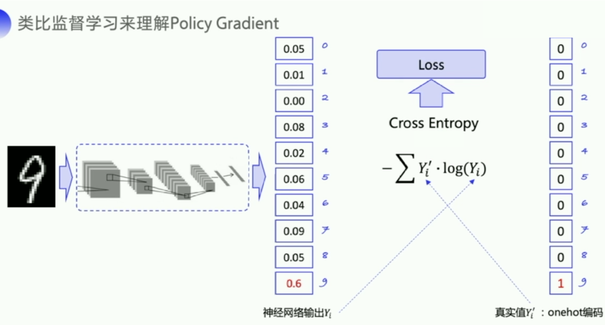

我们看一下它的优化流程，就是怎么让这个输出去逼近这个真实值。

* 它的优化流程就是将图片作为输入传给神经网络，神经网络会判断这个图片属于哪一类数字，输出所有数字可能的概率，然后再计算这个交叉熵，就是神经网络的输出 $Y_i$ 和真实的标签值 $Y_i'$ 之间的距离 $-\sum Y_{i}^{\prime} \cdot \log \left(Y_{i}\right)$。
* 我们希望尽可能地缩小这两个概率分布之间的差距，计算出来的交叉熵可以作为这个损失函数传给神经网络里面的优化器去优化，去自动去做神经网络的参数更新。

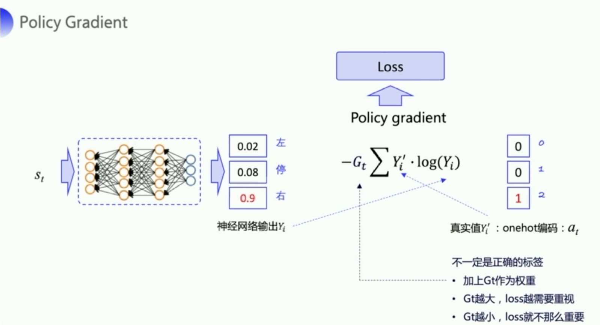

* 类似地，policy gradient 预测每一个状态下面应该要输出的这个行动的概率，就是输入状态 $s_t$，然后输出动作的概率，比如 0.02，0.08，0.09。实际上输出给环境的动作是随机选了一个动作，比如说我选了右这个动作，它的 one-hot 向量就是 0，0，1。

* 我们把神经网络的输出和实际动作带入交叉熵的公式就可以求出输出的概率和实际的动作之间的差距。
* 但这个实际的动作 $a_t$ 只是我们输出的真实的动作，它并不一定是正确的动作，它不能像手写数字识别一样作为一个正确的标签来去指导神经网络朝着正确的方向去更新，所以我们需要乘以一个奖励回报 $G_t$。这个奖励回报相当于是对这个真实动作 的评价。
  * 如果 $G_t$ 越大，未来总收益越大，那就说明当前输出的这个真实的动作就越好，这个 loss 就越需要重视。
  * 如果 $G_t$ 越小，那就说明做这个动作 $a_t$ 并没有那么的好，loss 的权重就要小一点，优化力度就小一点。
* 通过这个和那个手写输入识别的一个对比，我们就知道为什么 loss 会构造成这个样子。

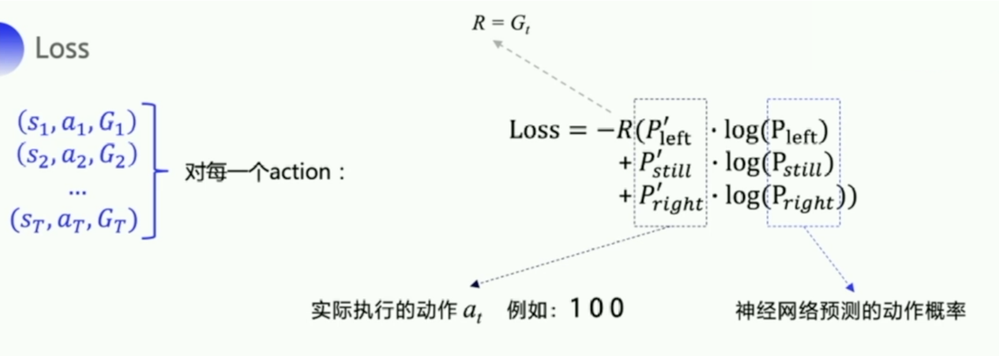

实际上我们在计算这个 loss 的时候，我们要拿到那个 $\ln \pi(A_t|S_t,\theta)$。我就拿实际执行的这个动作，先取个 one-hot 向量，然后再拿到神经网络预测的动作概率，这两个一相乘，我就可以拿到算法里面的那个  $\ln \pi(A_t|S_t,\theta)$。这个就是我们要构造的 loss。因为我们会拿到整个回合的所有的轨迹，所以我们可以对这一条整条轨迹里面的每个动作都去计算一个 loss。把所有的 loss 加起来之后，我们再扔给 adam 的优化器去自动更新参数就好了。

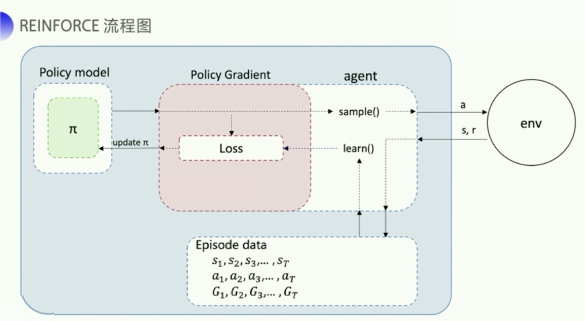

上图是 REINFORCE 的流程图。首先我们需要一个 policy model 来输出动作概率，输出动作概率后，我们 `sample()` 函数去得到一个具体的动作，然后跟环境交互过后，我们可以得到一整个回合的数据。拿到回合数据之后，我再去执行一下 `learn()` 函数，在 `learn()` 函数里面，我就可以拿这些数据去构造损失函数，扔给这个优化器去优化，去更新我的 policy model。

## References

* [Intro to Reinforcement Learning (强化学习纲要）](https://github.com/zhoubolei/introRL)
* [神经网络与深度学习](https://nndl.github.io/)
* [百面深度学习](https://book.douban.com/subject/35043939/)

