# 第 4 章 策略梯度
## 4.1 策略梯度算法
如图 4.1 所示，强化学习有 3 个组成部分：**演员（actor）**、**环境**和**奖励函数**。智能体玩视频游戏时，演员负责操控游戏的摇杆， 比如向左、向右、开火等操作；环境就是游戏的主机，负责控制游戏的画面、负责控制怪兽的移动等；奖励函数就是当我们做什么事情、发生什么状况的时候，可以得到多少分数， 比如打败一只怪兽得到 20 分等。同样的概念用在围棋上也是一样的，演员就是 Alpha Go，它要决定棋子落在哪一个位置；环境就是对手；奖励函数就是围棋的规则，赢就是得一分，输就是负一分。在强化学习里，环境与奖励函数不是我们可以控制的，它们是在开始学习之前给定的。我们唯一需要做的就是调整演员里面的策略，使得演员可以得到最大的奖励。演员里面的策略决定了演员的动作，即给定一个输入，它会输出演员现在应该要执行的动作。

图 4.1 强化学习的组成部分

    
策略一般记作 $\pi$。假设我们使用深度学习来做强化学习，策略就是一个网络。网络里面有一些参数，我们用 $\theta$ 来代表 $\pi$ 的参数。网络的输入是智能体看到的东西，如果让智能体玩视频游戏，智能体看到的东西就是游戏的画面。智能体看到的东西会影响我们训练的效果。例如，在玩游戏的时候， 也许我们觉得游戏的画面是前后相关的，所以应该让策略去看从游戏开始到当前这个时间点之间所有画面的总和。因此我们可能会觉得要用到循环神经网络（recurrent neural network，RNN）来处理它，不过这样会比较难处理。我们可以用向量或矩阵来表示智能体的观测，并将观测输入策略网络，策略网络就会输出智能体要采取的动作。图 4.2 就是具体的例子，策略是一个网络；输入是游戏的画面，它通常是由像素组成的；输出是我们可以执行的动作，有几个动作，输出层就有几个神经元。假设我们现在可以执行的动作有 3 个，输出层就有 3 个神经元，每个神经元对应一个可以采取的动作。输入一个东西后，网络会给每一个可以采取的动作一个分数。我们可以把这个分数当作概率，演员根据概率的分布来决定它要采取的动作，比如 0.7 的概率向左走、0.2 的概率向右走、0.1的概率开火等。概率分布不同，演员采取的动作就会不一样。

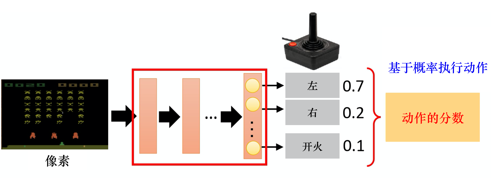

图 4.2 演员的策略

    

接下来我们用一个例子来说明演员与环境交互的过程。如图 4.3 所示，首先演员会看到一个视频游戏的初始画面，接下来它会根据内部的网络（内部的策略）来决定一个动作。假设演员现在决定的动作是向右，决定完动作以后，它就会得到一个奖励，奖励代表它采取这个动作以后得到的分数。

我们把游戏初始的画面记作 $s_1$， 把第一次执行的动作记作 $a_1$，把第一次执行动作以后得到的奖励记作 $r_1$。不同的人有不同的记法，有人觉得在 $s_1$ 执行 $a_1$ 得到的奖励应该记为 $r_2$，这两种记法都可以。演员决定一个动作以后，就会看到一个新的游戏画面$s_2$。把 $s_2$ 输入给演员，演员决定要开火，它可能打败了一只怪兽，就得到五分。这个过程反复地持续下去，直到在某一个时间点执行某一个动作，得到奖励之后，环境决定这个游戏结束。例如，如果在这个游戏里面，我们控制宇宙飞船去击杀怪兽，如果宇宙飞船被毁或是把所有的怪兽都清空，游戏就结束了。

图 4.3 玩视频游戏的例子
    

如图 4.4 所示，一场游戏称为一个回合。将这场游戏里面得到的所有奖励都加起来，就是**总奖励（total reward）**，也就是**回报**，我们用$R$来表示它。演员要想办法来最大化它可以得到的奖励。

图 4.4 回报的例子

如图 4.5 所示，首先，环境是一个函数，我们可以把游戏的主机看成一个函数，虽然它不一定是神经网络，可能是基于规则的（rule-based）模型，但我们可以把它看作一个函数。这个函数一开始先“吐”出一个状态（游戏画面 $s_1$），接下来演员看到游戏画面 $s_1$ 以后，它“吐”出动作 $a_1$。环境把动作 $a_1$ 当作它的输入，再“吐”出新的游戏画面 $s_2$。演员看到新的游戏画面$s_2$，再采取新的动作 $a_2$。环境看到 $a_2$，再“吐”出 $s_3$ ......这个过程会一直持续下去，直到环境觉得应该要停止为止。

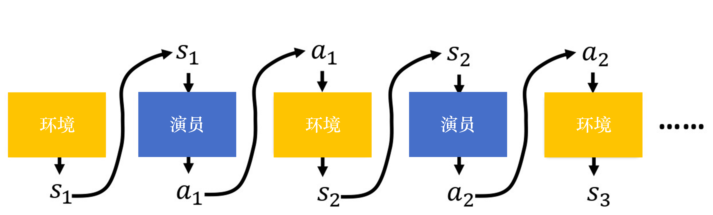

图 4.5 演员和环境

    
在一场游戏里面，我们把环境输出的 $s$ 与演员输出的动作 $a$ 全部组合起来，就是一个轨迹，即
$$
    \tau=\left\{s_{1}, a_{1}, s_{2}, a_{2}, \cdots, s_{t}, a_{t}\right\}
$$

给定演员的参数 $\theta$，我们可以计算某个轨迹$\tau$发生的概率为
$$
    \begin{aligned}
        p_{\theta}(\tau)
        &=p\left(s_{1}\right) p_{\theta}\left(a_{1} | s_{1}\right) p\left(s_{2} | s_{1}, a_{1}\right) p_{\theta}\left(a_{2} | s_{2}\right) p\left(s_{3} | s_{2}, a_{2}\right) \cdots \\
        &=p\left(s_{1}\right) \prod_{t=1}^{T} p_{\theta}\left(a_{t} | s_{t}\right) p\left(s_{t+1} | s_{t}, a_{t}\right)
        \end{aligned}
$$

我们先计算环境输出 $s_1$ 的概率 $p(s_1)$，再计算根据 $s_1$ 执行 $a_1$ 的概率$p_{\theta}\left(a_{1} | s_{1}\right)$，$p_{\theta}\left(a_{1} | s_{1}\right)$是由策略里面的网络参数 $\theta$ 所决定的。策略网络的输出是一个分布，演员根据这个分布进行采样，决定实际要采取的动作。接下来环境根据 $a_1$ 与 $s_1$ 产生 $s_2$，因为 $s_2$ 与 $s_1$ 是有关系的（游戏画面是连续的，下一个游戏画面与上一个游戏画面通常是有关系的），所以给定上一个游戏画面 $s_1$ 和演员采取的动作 $a_1$，就会产生 $s_2$。主机在决定输出游戏画面的时候，可能有概率，也可能没有概率，这取决于环境（主机内部设定）。

如果主机输出游戏画面的时候没有概率，游戏的每次的画面都一样，我们只要找到一条路径就可以过关了，这样的游戏没有意义。所以输出游戏画面时通常有一定概率，给定同样的前一个画面，我们采取同样的动作，下次产生的画面不一定是一样的。反复执行下去，我们就可以计算一个轨迹 $\tau$ 出现的概率有多大。某个轨迹出现的概率取决于环境的动作和智能体的动作。环境的动作是指环境根据其函数内部的参数或内部的规则采取的动作。$p(s_{t+1}|s_t,a_t)$代表的是环境，通常我们无法控制环境，因为环境是设定好的。我们能控制的是 $p_\theta(a_t|s_t)$。给定一个 $s_t$，演员要采取的 $a_t$ 取决于演员的参数 $\theta$， 所以智能体的动作是演员可以控制的。演员的动作不同，每个同样的轨迹就有不同的出现的概率。

在强化学习里面，除了环境与演员以外，还有奖励函数。如图 4.6 所示，奖励函数根据在某一个状态采取的某一个动作决定这个动作可以得到的分数。对奖励函数输入 $s_1$、$a_1$，它会输出$r_1$；输入 $s_2$、$a_2$，奖励函数会输出 $r_2$。 我们把轨迹所有的奖励 $r$ 都加起来，就得到了 $R(\tau)$ ，其代表某一个轨迹 $\tau$ 的奖励。

在某一场游戏的某一个回合里面，我们会得到 $R(\tau)$。我们要做的就是调整演员内部的参数 $\theta$， 使得$R(\tau)$的值越大越好。 但实际上$R(\tau)$并不只是一个标量（scalar），它是一个随机变量，因为演员在给定同样的状态下会采取什么样的动作，这是有随机性的。环境在给定同样的观测时要采取什么样的动作，要产生什么样的观测，本身也是有随机性的，所以$R(\tau)$是一个随机变量。我们能够计算的是$R(\tau)$的期望值。给定某一组参数 $\theta$，我们可计算 $r_{\theta}$ 的期望值为
$$
    \bar{R}_{\theta}=\sum_{\tau} R(\tau) p_{\theta}(\tau)
$$
我们要穷举所有可能的轨迹 $\tau$， 每一个轨迹 $\tau$ 都有一个概率。

    

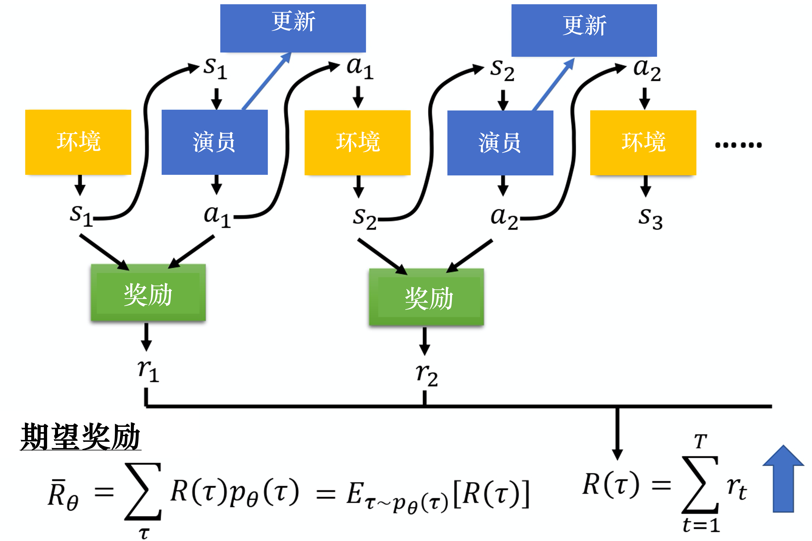

图 4.6 期望的奖励

    

比如 $\theta$ 对应的模型很强，如果有一个回合 $\theta$ 很快就死掉了，因为这种情况很少会发生，所以该回合对应的轨迹 $\tau$ 的概率就很小；如果有一个回合 $\theta$ 一直没死，因为这种情况很可能发生，所以该回合对应的轨迹 $\tau$ 的概率就很大。我们可以根据 $\theta$ 算出某一个轨迹 $\tau$ 出现的概率，接下来计算 $\tau$ 的总奖励。总奖励使用 $\tau$ 出现的概率进行加权，对所有的 $\tau$ 进行求和，就是期望值。给定一个参数，我们可以计算期望值为

$$
    \bar{R}_{\theta}=\sum_{\tau} R(\tau) p_{\theta}(\tau)=\mathbb{E}_{\tau \sim p_{\theta}(\tau)}[R(\tau)]
$$
从分布 $p_{\theta}(\tau)$ 采样一个轨迹 $\tau$，计算 $R(\tau)$ 的期望值，就是期望奖励（expected reward）。我们要最大化期望奖励。

因为我们要让奖励越大越好，所以可以使用**梯度上升（gradient ascent）**来最大化期望奖励。要进行梯度上升，我们先要计算期望奖励 $\bar{R}_{\theta}$ 的梯度。我们对 $\bar{R}_{\theta}$ 做梯度运算
$$
    \nabla \bar{R}_{\theta}=\sum_{\tau} R(\tau) \nabla p_{\theta}(\tau)
$$
其中，只有 $p_{\theta}(\tau)$ 与 $\theta$ 有关。

奖励函数$R(\tau)$ 不需要是可微分的（differentiable），这不影响我们解决接下来的问题。例如，如果在生成对抗网络（generative adversarial network，GAN）里面，$R(\tau)$ 是一个判别器（discriminator），它就算无法微分，我们还是可以做接下来的运算。

我们可以对 $\nabla p_{\theta}(\tau)$ 使用式(4.1)，得到 $\nabla p_{\theta}(\tau)=p_{\theta}(\tau)  \nabla \log p_{\theta}(\tau)$。
$$
    \nabla f(x)=f(x)\nabla \log f(x) \tag{4.1}
$$

接下来，我们可得
$$
    \frac{\nabla p_{\theta}(\tau)}{p_{\theta}(\tau)}= \nabla \log p_{\theta}(\tau)
$$

如式(4.2)所示，我们对 $\tau$ 进行求和，把 $R(\tau)$  和  $\log p_{\theta}(\tau)$ 这两项使用 $p_{\theta}(\tau)$ 进行加权， 既然使用 $p_{\theta}(\tau)$ 进行加权 ，它们就可以被写成期望的形式。也就是我们从 $p_{\theta}(\tau)$ 这个分布里面采样 $\tau$ ， 去计算 $R(\tau)$ 乘 $\nabla\log p_{\theta}(\tau)$，对所有可能的 $\tau$ 进行求和，就是期望的值（expected value）。
$$
    \begin{aligned}
        \nabla \bar{R}_{\theta}&=\sum_{\tau} R(\tau) \nabla p_{\theta}(\tau)\\&=\sum_{\tau} R(\tau) p_{\theta}(\tau) \frac{\nabla p_{\theta}(\tau)}{p_{\theta}(\tau)} \\&=
        \sum_{\tau} R(\tau) p_{\theta}(\tau) \nabla \log p_{\theta}(\tau) \\
        &=\mathbb{E}_{\tau \sim p_{\theta}(\tau)}\left[R(\tau) \nabla \log p_{\theta}(\tau)\right]
        \end{aligned} \tag{4.2}
$$
实际上期望值 $\mathbb{E}_{\tau \sim p_{\theta}(\tau)}\left[R(\tau) \nabla \log p_{\theta}(\tau)\right]$ 无法计算，所以我们用采样的方式采样 $N$ 个 $\tau$并计算每一个的值，把每一个的值加起来，就可以得到梯度，即
$$
    \begin{aligned}
        \mathbb{E}_{\tau \sim p_{\theta}(\tau)}\left[R(\tau) \nabla \log p_{\theta}(\tau)\right] &\approx \frac{1}{N} \sum_{n=1}^{N} R\left(\tau^{n}\right) \nabla \log p_{\theta}\left(\tau^{n}\right) \\
        &=\frac{1}{N} \sum_{n=1}^{N} \sum_{t=1}^{T_{n}} R\left(\tau^{n}\right) \nabla \log p_{\theta}\left(a_{t}^{n} \mid s_{t}^{n}\right)
        \end{aligned}
$$
$\nabla \log p_{\theta}(\tau)$ 的具体计算过程可写为
$$
    \begin{aligned}
        \nabla \log p_{\theta}(\tau) &= \nabla \left(\log p(s_1)+\sum_{t=1}^{T}\log p_{\theta}(a_t|s_t)+ \sum_{t=1}^{T}\log p(s_{t+1}|s_t,a_t) \right) \\
        &= \nabla \log p(s_1)+ \nabla \sum_{t=1}^{T}\log p_{\theta}(a_t|s_t)+  \nabla \sum_{t=1}^{T}\log p(s_{t+1}|s_t,a_t) \\
        &=\nabla \sum_{t=1}^{T}\log p_{\theta}(a_t|s_t)\\
        &=\sum_{t=1}^{T} \nabla\log p_{\theta}(a_t|s_t)
        \end{aligned}
$$
注意， $p(s_1)$ 和 $p(s_{t+1}|s_t,a_t)$ 来自环境，$p_\theta(a_t|s_t)$ 来自智能体。$p(s_1)$ 和 $p(s_{t+1}|s_t,a_t)$ 由环境决定，与 $\theta$ 无关，因此 $\nabla \log p(s_1)=0$ ，$\nabla \sum_{t=1}^{T}\log p(s_{t+1}|s_t,a_t)=0$。

$$
    \begin{aligned}
        \nabla \bar{R}_{\theta}&=\sum_{\tau} R(\tau) \nabla p_{\theta}(\tau)\\&=\sum_{\tau} R(\tau) p_{\theta}(\tau) \frac{\nabla p_{\theta}(\tau)}{p_{\theta}(\tau)} \\&=
        \sum_{\tau} R(\tau) p_{\theta}(\tau) \nabla \log p_{\theta}(\tau) \\
        &=\mathbb{E}_{\tau \sim p_{\theta}(\tau)}\left[R(\tau) \nabla \log p_{\theta}(\tau)\right]\\
        &\approx \frac{1}{N} \sum_{n=1}^{N} R\left(\tau^{n}\right) \nabla \log p_{\theta}\left(\tau^{n}\right) \\
        &=\frac{1}{N} \sum_{n=1}^{N} \sum_{t=1}^{T_{n}} R\left(\tau^{n}\right) \nabla \log p_{\theta}\left(a_{t}^{n} \mid s_{t}^{n}\right)
        \end{aligned} \tag{4.3}
$$

我们可以直观地理解式(4.3)，也就是在我们采样到的数据里面，采样到在某一个状态 $s_t$ 要执行某一个动作 $a_t$，$(s_t,a_t)$ 是在整个轨迹 $\tau$ 的里面的某一个状态和动作的对。假设我们在 $s_t$ 执行 $a_t$，最后发现 $\tau$ 的奖励是正的，我们就要增加在 $s_t$ 执行 $a_t$ 的概率。反之，如果在 $s_t$ 执行 $a_t$ 会导致 $\tau$ 的奖励变成负的， 我们就要减少在 $s_t$ 执行 $a_t$ 的概率。这怎么实现呢？我们用梯度上升来更新参数，原来有一个参数 $\theta$ ，把 $\theta$  加上梯度$\nabla \bar{R}_{\theta}$，当然我们要有一个学习率 $\eta$，学习率也是要调整的，可用 Adam、RMSProp 等方法来调整学习率，即
$$
    \theta \leftarrow \theta+\eta \nabla \bar{R}_{\theta}
$$

我们可以使用式(4.4)来计算梯度。实际上要计算梯度，如图 4.7 所示，首先我们要收集很多$s$与$a$的对（pair），还要知道这些$s$与$a$在与环境交互的时候，会得到多少奖励。 这些数据怎么收集呢？我们要用参数为 $\theta$的智能体与环境交互， 也就是拿已经训练好的智能体先与环境交互，交互完以后，就可以得到大量游戏的数据，我们会记录在第一场游戏里面，我们在状态 $s_1$ 采取动作 $a_1$，在状态$s_2$ 采取动作 $a_2$。
智能体本身是有随机性的，在同样的状态$s_1$下，不是每次都会采取动作 $a_1$的，所以我们要记录，在状态 $s_1^1$ 采取 $a_1^1$、在状态 $s_2^1$ 采取 $a_2^1$等，整场游戏结束以后，得到的奖励是 $R(\tau^1)$。我们会采样到另外一些数据，也就是另外一场游戏。在另外一场游戏里面，在状态 $s_1^2$ 采取 $a_1^2$，在状态 $s_2^2$ 采取 $a_2^2$，我们采样到的就是 $\tau^2$，得到的奖励是 $R(\tau^2)$。

这时我们就可以把采样到的数据代入式(4.4)里面，把梯度算出来。也就是把每一个$s$与$a$的对拿进来，计算在某一个状态下采取某一个动作的对数概率（log probability）$\log p_{\theta}\left(a_{t}^{n} | s_{t}^{n}\right)$。对这个概率取梯度，在梯度前面乘一个权重，权重就是这场游戏的奖励。我们计算出梯度后，就可以更新模型。

$$
    \nabla \bar{R}_{\theta}=\frac{1}{N} \sum_{n=1}^{N} \sum_{t=1}^{T_{n}} R\left(\tau^{n}\right) \nabla \log p_{\theta}\left(a_{t}^{n} | s_{t}^{n}\right)\tag{4.4}
$$

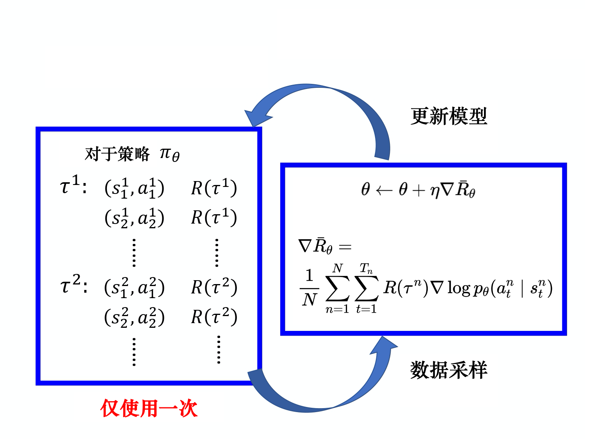

图 4.7 策略梯度

    

更新完模型以后，我们要重新采样数据再更新模型。注意，一般**策略梯度（policy gradient，PG）**采样的数据只会用一次。我们采样这些数据，然后用这些数据更新参数，再丢掉这些数据。接着重新采样数据，才能去更新参数。

接下来我们讲一些实现细节。如图 4.8 所示，我们可以把强化学习想成一个分类问题，这个分类问题就是输入一个图像，输出某个类。在解决分类问题时，我们要收集一些训练数据，数据中要有输入与输出的对。在实现的时候，我们把状态当作分类器的输入，就像在解决图像分类的问题，只是现在的类不是图像里面的东西，而是看到这张图像我们要采取什么样的动作，每一个动作就是一个类。比如第一个类是向左，第二个类是向右，第三个类是开火。

在解决分类问题时，我们要有输入和正确的输出，要有训练数据。但在强化学习中，我们通过采样来获得训练数据。假设在采样的过程中，在某个状态下，我们采样到要采取动作 $a$， 那么就把动作 $a$ 当作标准答案（ground truth）。比如，我们在某个状态下，采样到要向左。因为是采样，所以向左这个动作不一定概率最高。假设我们采样到向左，在训练的时候，让智能体调整网络的参数， 如果看到某个状态，我们就向左。在一般的分类问题里面，我们在实现分类的时候，目标函数都会写成最小化交叉熵（cross entropy），最小化交叉熵就是最大化对数似然（log likelihood）。

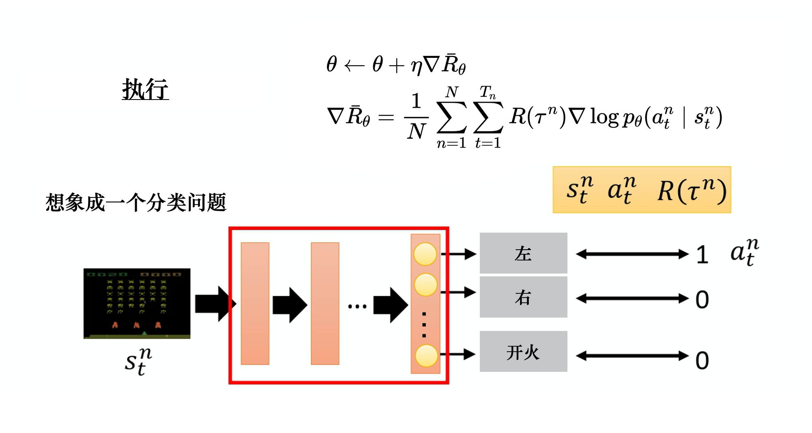

图 4.8 策略梯度实现细节

    
我们在解决分类问题的时候，目标函数就是最大化或最小化的对象，因为我们现在是最大化似然（likelihood），所以其实是最大化，我们要最大化
$$
    \frac{1}{N} \sum_{n=1}^{N} \sum_{t=1}^{T_{n}} \log p_{\theta}\left(a_{t}^{n} \mid s_{t}^{n}\right)
$$

我们可在 PyTorch 里调用现成的函数来自动计算损失函数，并且把梯度计算出来。这是一般的分类问题，强化学习与分类问题唯一不同的地方是损失前面乘一个权重————整场游戏得到的总奖励 $R(\tau)$，而不是在状态$s$采取动作$a$的时候得到的奖励，即
$$
    \frac{1}{N} \sum_{n=1}^{N} \sum_{t=1}^{T_{n}} R\left(\tau^{n}\right)  \log p_{\theta}\left(a_{t}^{n} \mid s_{t}^{n}\right) \tag{4.5}
$$

我们要把每一笔训练数据，都使用 $R(\tau)$ 进行加权。如图 4.9 所示，我们使用 PyTorch 或 TensorFlow 之类的深度学习框架计算梯度就结束了，与一般分类问题差不多。

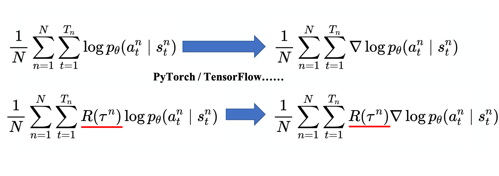

图 4.9 自动求梯度

## 4.2 策略梯度实现技巧
下面我们介绍一些在实现策略梯度时可以使用的技巧。
### 4.2.1 技巧 1：添加基线
第一个技巧：添加基线（baseline）。如果给定状态 $s$ 采取动作 $a$，整场游戏得到正的奖励，就要增加 $(s,a)$ 的概率。如果给定状态 $s$ 执行动作 $a$，整场游戏得到负的奖励，就要减小 $(s,a)$ 的概率。但在很多游戏里面，奖励总是正的，最低都是 0。比如打乒乓球游戏， 分数为 0 ~ 21 分，所以$R(\tau)$总是正的。假设我们直接使用式(4.5)，在训练的时候告诉模型，不管是什么动作，都应该要把它的概率提升。 

虽然$R(\tau)$总是正的，但它的值是有大有小的，比如我们在玩乒乓球游戏时，得到的奖励总是正的，但采取某些动作可能得到 0 分，采取某些动作可能得到 20 分。

如图 4.10 所示，假设我们在某一个状态有 3 个动作 a、b、c可以执行。根据式(4.6)，我们要把这 3 个动作的概率，对数概率都提高。 但是它们前面的权重$R(\tau)$是不一样的。权重是有大有小的，权重小的，该动作的概率提高的就少；权重大的，该动作的概率提高的就多。 因为对数概率是一个概率，所以动作 a、b、c 的对数概率的和是 0。 所以提高少的，在做完归一化（normalize）以后，动作 b 的概率就是下降的；提高多的，该动作的概率才会上升。

    

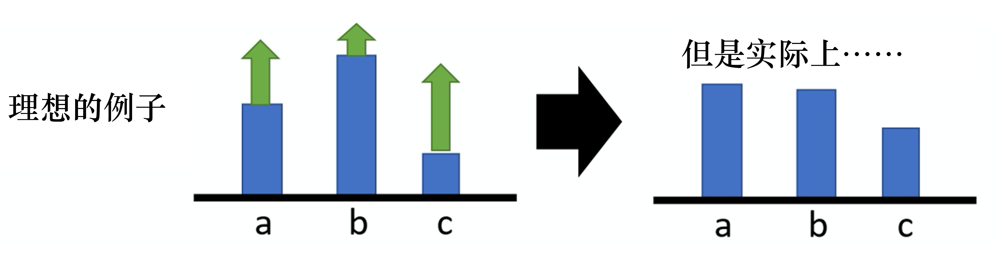

图 4.10 动作的概率的例子

    

$$
    \nabla \bar{R}_{\theta} \approx \frac{1}{N} \sum_{n=1}^{N} \sum_{t=1}^{T_{n}} R\left(\tau^{n}\right) \nabla \log p_{\theta}\left(a_{t}^{n} \mid s_{t}^{n}\right) \tag{4.6}
$$

这是一个理想的情况，但是实际上，我们是在做采样本来这边应该是一个期望（expectation），对所有可能的$s$与$a$的对进行求和。 但我们真正在学习的时候，只是采样了少量的$s$与$a$的对。 因为我们做的是采样，所以有一些动作可能从来都没有被采样到。如图 4.11 所示，在某一个状态，虽然可以执行的动作有 a、b、c，但我们可能只采样到动作 b 或者 只采样到动作 c，没有采样到动作 a。但现在所有动作的奖励都是正的，所以根据式(4.6)，在这个状态采取a、b、c的概率都应该要提高。我们会遇到的问题是，因为 a 没有被采样到，所以其他动作的概率如果都要提高，a 的概率就要下降。 所以a不一定是一个不好的动作， 它只是没有被采样到。但因为 a 没有被采样到，它的概率就会下降，这显然是有问题的。要怎么解决这个问题呢？我们会希望奖励不总是正的。

    

图 4.11 采样动作的问题

    

为了解决奖励总是正的的问题，我们可以把奖励减 $b$，即
$$
    \nabla \bar{R}_{\theta} \approx \frac{1}{N} \sum_{n=1}^{N} \sum_{t=1}^{T_{n}}\left(R\left(\tau^{n}\right)-b\right) \nabla \log p_{\theta}\left(a_{t}^{n} \mid s_{t}^{n}\right)
$$

其中，$b$ 称为基线。通过这种方法，我们就可以让 $R(\tau)-b$ 这一项有正有负。如果我们得到的总奖励$R(\tau)>b$，就让 $(s,a)$ 的概率上升。如果$R(\tau)<b$，就算$R(\tau)$是正的，值很小也是不好的，我们就让$(s,a)$的概率下降，让这个状态采取这个动作的分数下降。$b$ 怎么设置呢？我们可以对 $\tau$ 的值取期望， 计算 $\tau$ 的平均值，令$b \approx E[R(\tau)]$。
所以在训练的时候，我们会不断地把 $R(\tau)$ 的值记录下来，会不断地计算 $R(\tau)$ 的平均值，把这个平均值当作 $b$ 来使用。 这样就可以让我们在训练的时候，$R(\tau)-b$ 是有正有负的，这是第一个技巧。

### 4.2.2 技巧 2：分配合适的分数

第二个技巧：给每一个动作分配合适的分数（credit）。如式(4.7)所示，只要在同一个回合里面，在同一场游戏里面，所有的状态-动作对就使用同样的奖励项进行加权。

$$
    \nabla \bar{R}_{\theta} \approx \frac{1}{N} \sum_{n=1}^{N} \sum_{t=1}^{T_{n}}\left(R\left(\tau^{n}\right)-b\right) \nabla \log p_{\theta}\left(a_{t}^{n} \mid s_{t}^{n}\right) \tag{4.7}
$$
这显然是不公平的，因为在同一场游戏里面，也许有些动作是好的，有些动作是不好的。 假设整场游戏的结果是好的， 但并不代表这场游戏里面每一个动作都是好的。若是整场游戏结果不好， 但并不代表游戏里面的每一个动作都是不好的。所以我们希望可以给每一个不同的动作前面都乘上不同的权重。每一个动作的不同权重反映了每一个动作到底是好的还是不好的。 例如，如图 4.12a 所示，假设游戏都很短，只有 3 ~ 4 个交互，在 $s_a$ 执行 $a_1$ 得到 5 分，在 $s_b$ 执行 $a_2$ 得到 0 分，在 $s_c$ 执行 $a_3$ 得到 $-$2 分。 整场游戏下来，我们得到 +3 分，那我们得到 +3 分 代表在 $s_b$ 执行 $a_2$ 是好的吗？
这并不一定代表在 $s_b$ 执行 $a_2$ 是好的。因为这个正的分数，主要来自在 $s_a$ 执行了 $a_1$，与在 $s_b$ 执行 $a_2$ 是没有关系的，也许在 $s_b$ 执行 $a_2$ 反而是不好的， 因为它导致我们接下来会进入 $s_c$，执行 $a_3$ 被扣分。所以整场游戏得到的结果是好的， 并不代表每一个动作都是好的。

如果按照我们刚才的说法，整场游戏得到的分数是 +3 分，因此在训练的时候， 每一个状态-动作对都会被乘上 +3。 在理想的状况下，如果我们的采样数据够多，就可以解决这个问题。因为假设我们的采样数据够多，$(s_b,a_2)$被采样到很多。某一场游戏里，在 $s_b$ 执行 $a_2$，我们会得到 +3 分。 但在另外一场游戏里，如图 4.12b 所示，在 $s_b$ 执行 $a_2$，我们却得到了 $-$7 分，为什么会得到 $-$7 分呢？ 因为我们在 $s_b$ 执行 $a_2$ 之前， 在 $s_a$ 执行 $a_2$ 得到 $-$5 分，$-$5 分也不是在 $s_b$ 执行 $a_2$ 导致的。因为 $(s_a,a_2)$ 先发生，所以 $(s_a,a_2)$ 与 $(s_b,a_2)$ 是没有关系的。在 $s_b$ 执行 $a_2$ 可能造成的问题只有会在接下来得到 $-$2 分，而与前面的 $-$5 分没有关系。但是假设我们采样状态-动作对的次数够多，把所有产生这种情况的分数通通都集合起来， 这可能不是一个问题。但现在的问题是，我们采样的次数是不够多的。在采样的次数不够多的情况下，我们要给每一个状态-动作对分配合理的分数，要让大家知道它合理的贡献。

一个做法是计算某个状态-动作对的奖励的时候，不把整场游戏得到的奖励全部加起来，只计算从这个动作执行以后得到的奖励。因为这场游戏在执行这个动作之前发生的事情是与执行这个动作是没有关系的，所以在执行这个动作之前得到的奖励都不能算是这个动作的贡献。我们把执行这个动作以后发生的所有奖励加起来，才是这个动作真正的贡献。所以图 4.12a 中，在 $s_b$ 执行 $a_2$ 这件事情，也许它真正会导致我们得到的分数应该是 $-$2 分而不是 +3 分，因为前面的 +5 分 并不是执行 $a_2$ 的功劳。实际上执行 $a_2$ 以后，到游戏结束前， 我们只被扣了 2 分，所以分数应该是 $-$2。同理，图 4.12b 中，执行 $a_2$ 实际上不应该是扣 7 分，因为前面扣 5 分，与在 $s_b$ 执行 $a_2$ 是没有关系的。在 $s_b$ 执行 $a_2$，只会让我们被扣两分而已。

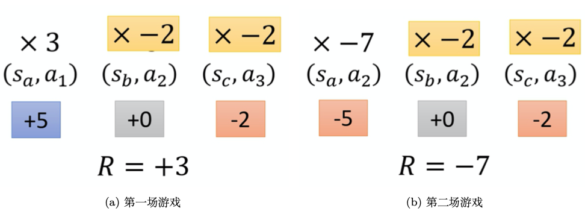

图 4.12 分配合适的分数

    

分配合适的分数这一技巧可以表达为
$$
    \nabla \bar{R}_{\theta} \approx \frac{1}{N} \sum_{n=1}^{N} \sum_{t=1}^{T_{n}}\left(\sum_{t^{\prime}=t}^{T_{n}} r_{t^{\prime}}^{n}-b\right) \nabla \log p_{\theta}\left(a_{t}^{n} \mid s_{t}^{n}\right)
$$
原来的权重是整场游戏的奖励的总和，现在改成从某个时刻 $t$ 开始，假设这个动作是在 $t$ 开始执行的，从 $t$ 一直到游戏结束所有奖励的总和才能代表这个动作的好坏。 

接下来更进一步，我们把未来的奖励做一个折扣，即
$$
    \nabla \bar{R}_{\theta} \approx \frac{1}{N} \sum_{n=1}^{N} \sum_{t=1}^{T_{n}}\left(\sum_{t^{\prime}=t}^{T_{n}} \gamma^{t^{\prime}-t} r_{t^{\prime}}^{n}-b\right) \nabla \log p_{\theta}\left(a_{t}^{n} \mid s_{t}^{n}\right)
$$
为什么要把未来的奖励做一个折扣呢？因为虽然在某一时刻，执行某一个动作，会影响接下来所有的结果（有可能在某一时刻执行的动作，接下来得到的奖励都是这个动作的功劳），但在一般的情况下，时间拖得越长，该动作的影响力就越小。 比如在第2个时刻执行某一个动作， 那在第3个时刻得到的奖励可能是在第2个时刻执行某个动作的功劳，但是在第 100 个时刻之后又得到奖励，那可能就不是在第2个时刻执行某一个动作的功劳。实际上，我们会在$R$前面乘一个折扣因子 $\gamma$（$\gamma \in [0,1] $ ，一般会设为 0.9 或 0.99），如果 $\gamma = 0$，这表示我们只关心即时奖励；如果$\gamma = 1$，这表示未来奖励等同于即时奖励。时刻 $t'$ 越大，它前面就多次乘 $\gamma$，就代表现在在某一个状态 $s_t$， 执行某一个动作 $a_t$ 的时候，它真正的分数是执行这个动作之后所有奖励的总和，而且还要乘 $\gamma$。例如，假设游戏有两个回合，我们在游戏的第二回合的某一个 $s_t$ 执行 $a_t$ 得到 +1 分，在 $s_{t+1}$ 执行 $a_{t+1}$ 得到 +3 分，在 $s_{t+2}$ 执行 $a_{t+2}$ 得到 $-$5 分，第二回合结束。$a_t$ 的分数应该是
$$
1+ \gamma \times 3+\gamma^2 \times(-5)
$$

实际上就是这么实现的。$b$ 可以是依赖状态（state-dependent）的，事实上 $b$ 通常是一个网络估计出来的，它是一个网络的输出。我们把 $R-b$ 这一项称为**优势函数（advantage function）**， 用 $A^{\theta}(s_t,a_t)$ 来代表优势函数。优势函数取决于 $s$ 和 $a$，我们就是要计算在某个状态 $s$ 采取某个动作 $a$ 的时候，优势函数的值。在计算优势函数值时，我们要计算 $\sum_{t^{\prime}=t}^{T_{n}} r_{t^{\prime}}^{n}$，需要有一个模型与环境交互，才能知道接下来得到的奖励。优势函数 $A^{\theta}\left(s_{t}, a_{t}\right)$ 的上标是 $\theta$，$\theta$ 代表用模型 $\theta$ 与环境交互。从时刻 $t$ 开始到游戏结束为止，所有 $r$ 的加和减去 $b$，这就是优势函数。优势函数的意义是，假设我们在某一个状态$s_t$ 执行某一个动作 $a_t$，相较于其他可能的动作，$a_t$有多好。优势函数在意的不是绝对的好，而是相对的好，即**相对优势（relative advantage）**。因为在优势函数中，我们会减去一个基线 $b$，所以这个动作是相对的好，不是绝对的好。 $A^{\theta}\left(s_{t}, a_{t}\right)$ 通常可以由一个网络估计出来，这个网络称为评论员（critic）。 

## 4.3 REINFORCE：蒙特卡洛策略梯度

如图 4.13 所示，蒙特卡洛方法可以理解为算法完成一个回合之后，再利用这个回合的数据去学习，做一次更新。因为我们已经获得了整个回合的数据，所以也能够获得每一个步骤的奖励，我们可以很方便地计算每个步骤的未来总奖励，即回报 $G_t$ 。$G_t$ 是未来总奖励，代表从这个步骤开始，我们能获得的奖励之和。$G_1$代表我们从第一步开始，往后能够获得的总奖励。$G_2$ 代表从第二步开始，往后能够获得的总奖励。

相比蒙特卡洛方法一个回合更新一次，时序差分方法是每个步骤更新一次，即每走一步，更新一次，时序差分方法的更新频率更高。时序差分方法使用Q函数来近似地表示未来总奖励 $G_t$。

    

图 4.13 蒙特卡洛方法与时序差分方法

    

我们介绍一下策略梯度中最简单的也是最经典的一个算法**REINFORCE**。REINFORCE 用的是回合更新的方式，它在代码上的处理上是先获取每个步骤的奖励，然后计算每个步骤的未来总奖励 $G_t$，将每个 $G_t$ 代入

$$
    \nabla \bar{R}_{\theta} \approx \frac{1}{N} \sum_{n=1}^{N} \sum_{t=1}^{T_{n}} G_{t}^{n} \nabla \log \pi_{\theta}\left(a_{t}^{n} \mid s_{t}^{n}\right)
$$

优化每一个动作的输出。所以我们在编写代码时会设计一个函数，这个函数的输入是每个步骤获取的奖励，输出是每一个步骤的未来总奖励。因为未来总奖励可写为
$$
    \begin{aligned}
        G_{t} &=\sum_{k=t+1}^{T} \gamma^{k-t-1} r_{k} \\
        &=r_{t+1}+\gamma G_{t+1}
        \end{aligned} \tag{4.8}
$$
即上一个步骤和下一个步骤的未来总奖励的关系如式(4.8)所示，所以在代码的计算上，我们是从后往前推，一步一步地往前推，先算 $G_T$，然后往前推，一直算到 $G_1$。

如图 4.14 所示，REINFORCE 的伪代码主要看最后4行，先产生一个回合的数据，比如 
$$
(s_1,a_1,G_1),(s_2,a_2,G_2),\cdots,(s_T,a_T,G_T)
$$
然后针对每个动作计算梯度 $\nabla \log \pi(a_t|s_t,\theta)$ 。在代码上计算时，我们要获取神经网络的输出。神经网络会输出每个动作对应的概率值（比如0.2、0.5、0.3），然后我们还可以获取实际的动作$a_t$，把动作转成独热（one-hot）向量（比如[0,1,0]）与 $\log [0.2,0.5,0.3]$ 相乘就可以得到 $\log \pi(a_t|s_t,\theta)$  。

    

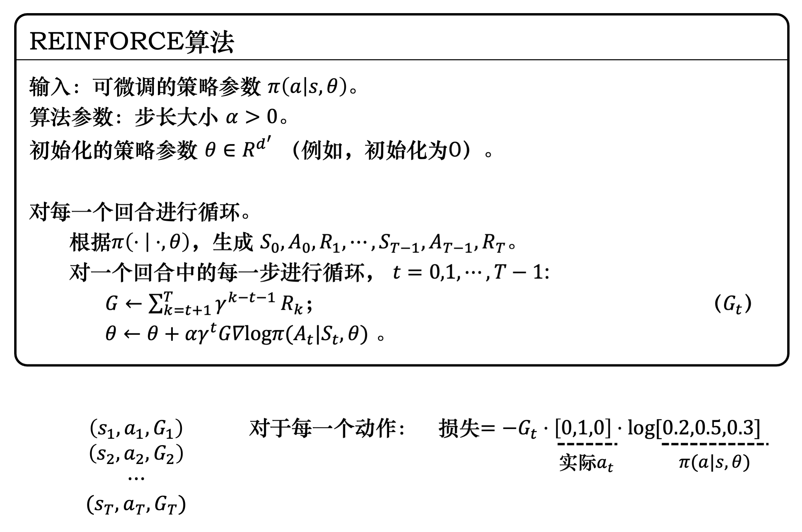

图 4.14 REINFORCE算法

    

>独热编码（one-hot encoding）通常用于处理类别间不具有大小关系的特征。 例如血型，一共有4个取值（A型、B型、AB型、O型），独热编码会把血型变成一个4维稀疏向量，A型血表示为（1,0,0,0），B型血表示为（0,1,0,0），AB型血表示为（0,0,1,0），O型血表示为（0,0,0,1）。

如图 4.15 所示，手写数字识别是一个经典的多分类问题，输入是一张手写数字的图片，经过神经网络处理后，输出的是各个类别的概率。我们希望输出的概率分布尽可能地贴近真实值的概率分布。因为真实值只有一个数字 9，所以如果我们用独热向量的形式给它编码，也可以把真实值理解为一个概率分布，9 的概率就是1，其他数字的概率就是 0。神经网络的输出一开始可能会比较平均，通过不断地迭代、训练优化之后，我们会希望输出9 的概率可以远高于输出其他数字的概率。

    
   

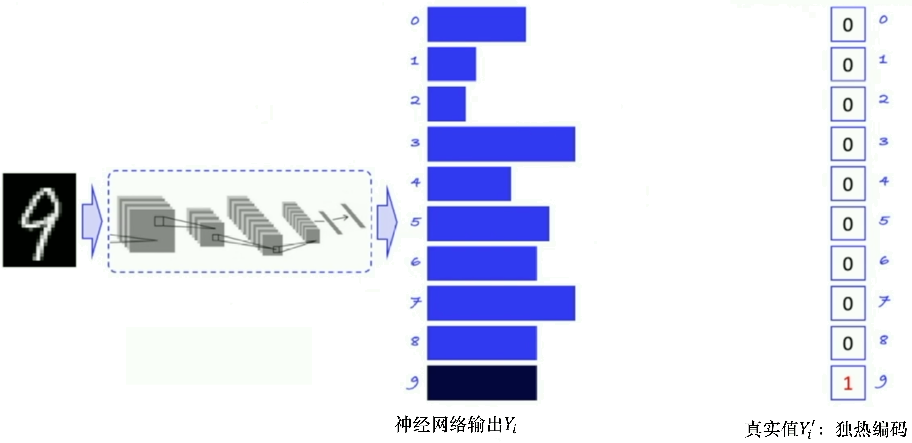

   
图 4.15 监督学习例子：手写数字识别

    

如图 4.16 所示，我们所要做的就是提高输出 9 的概率，降低输出其他数字的概率，让神经网络输出的概率分布能够更贴近真实值的概率分布。我们可以用交叉熵来表示两个概率分布之间的差距。
    

图 4.16 提高数字9的概率

    

我们看一下监督学习的优化流程，即怎么让输出逼近真实值。如图 4.17 所示，监督学习的优化流程就是将图片作为输入传给神经网络，神经网络会判断图片中的数字属于哪一类数字，输出所有数字可能的概率，再计算交叉熵，即神经网络的输出 $Y_i$ 和真实的标签值 $Y_i'$ 之间的距离 $-\sum Y_{i}^{\prime} \cdot \log \left(Y_{i}\right)$。我们希望尽可能地缩小这两个概率分布之间的差距，计算出的交叉熵可以作为损失函数传给神经网络里面的优化器进行优化，以自动进行神经网络的参数更新。

    

图 4.17 优化流程

    

类似地，如图 4.18  所示，策略梯度预测每一个状态下应该要输出的动作的概率，即输入状态 $s_t$，输出动作$a_t$的概率，比如 0.02、0.08、0.9。实际上输出给环境的动作是随机选择一个动作，比如我们选择向右这个动作，它的独热向量就是（0,0,1）。我们把神经网络的输出和实际动作代入交叉熵的公式就可以求出输出动作的概率和实际动作的概率之间的差距。但实际的动作 $a_t$ 只是我们输出的真实的动作，它不一定是正确的动作，它不能像手写数字识别一样作为一个正确的标签来指导神经网络朝着正确的方向更新，所以我们需要乘一个奖励回报 $G_t$。$G_t$相当于对真实动作的评价。如果 $G_t$ 越大，未来总奖励越大，那就说明当前输出的真实的动作就越好，损失就越需要重视。如果 $G_t$ 越小，那就说明动作 $a_t$ 不是很好，损失的权重就要小一点儿，优化力度也要小一点儿。通过与手写数字识别的一个对比，我们就知道为什么策略梯度损失会构造成这样。

    

图 4.18 策略梯度损失

    

如图 4.19 所示，实际上我们在计算策略梯度损失的时候，要先对实际执行的动作取独热向量，再获取神经网络预测的动作概率，将它们相乘，我们就可以得到 $\log \pi(a_t|s_t,\theta)$，这就是我们要构造的损失。因为我们可以获取整个回合的所有的轨迹，所以我们可以对这一条轨迹里面的每个动作都去计算一个损失。把所有的损失加起来，我们再将其“扔”给 Adam 的优化器去自动更新参数就好了。

    

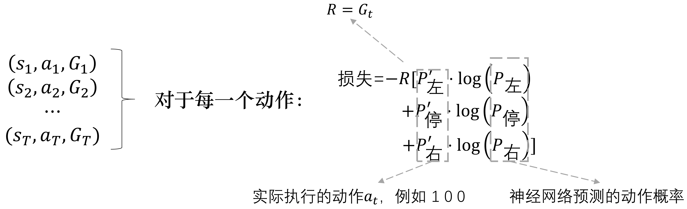

图 4.19 损失计算

    

图 4.20 所示为REINFORCE 算法示意，首先我们需要一个策略模型来输出动作概率，输出动作概率后，通过 **sample()** 函数得到一个具体的动作，与环境交互后，我们可以得到整个回合的数据。得到回合数据之后，我们再去执行 **learn()** 函数，在 **learn()** 函数里面，我们就可以用这些数据去构造损失函数，“扔”给优化器优化，更新我们的策略模型。

    

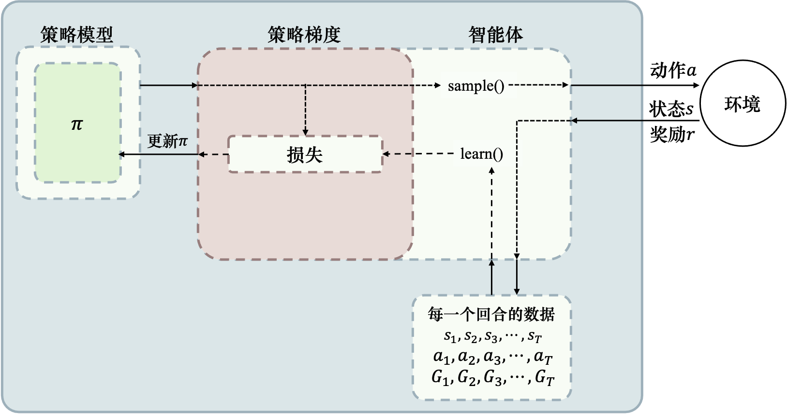

图 4.20 REINFORCE算法示意

    
## 参考文献
* [Intro to Reinforcement Learning (强化学习纲要）](https://github.com/zhoubolei/introRL)
* [神经网络与深度学习](https://nndl.github.io/)
* [百面深度学习](https://book.douban.com/subject/35043939/)

