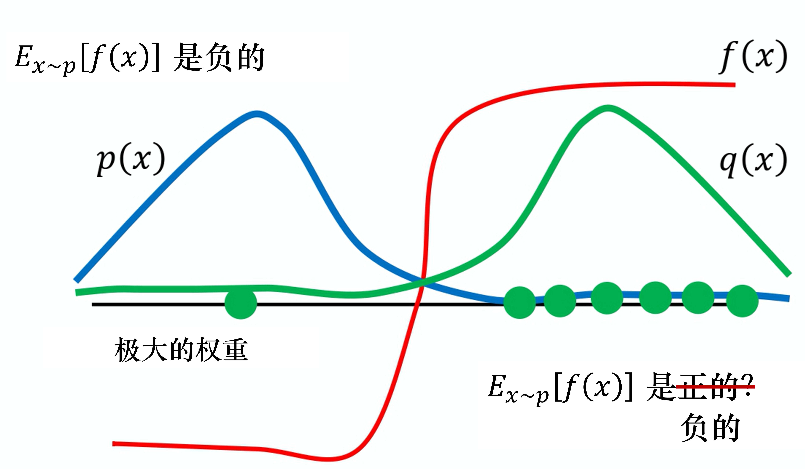
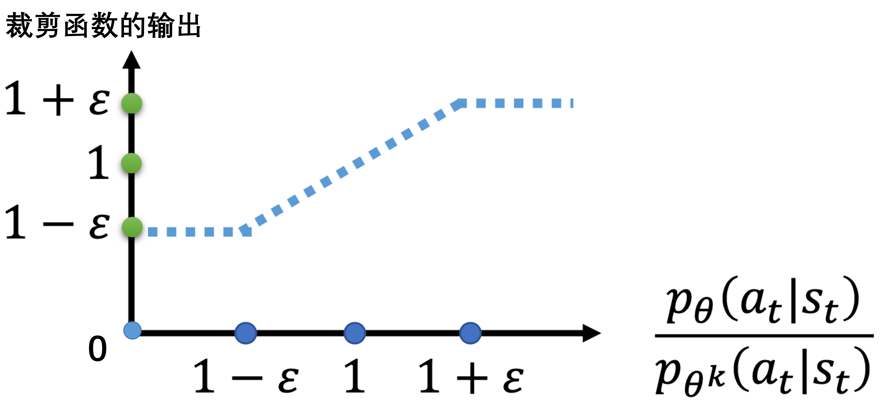
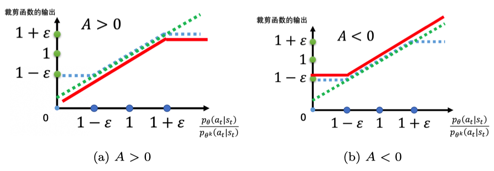

# 第5章 PPO 算法
## 5.1 重要性采样
在介绍**近端策略优化（proximal policy optimization，PPO）** 之前，我们先回顾同策略和异策略这两种训练方法的区别。在强化学习里面，要学习的是一个智能体。如果要学习的智能体和与环境交互的智能体是相同的，我们称之为同策略。如果要学习的智能体和与环境交互的智能体不是相同的，我们称之为异策略。

为什么我们会想要考虑异策略？让我们回忆一下策略梯度。策略梯度是同策略的算法，因为在策略梯度中，我们需要一个智能体、一个策略和一个演员。演员去与环境交互搜集数据，搜集很多的轨迹 $\tau$，根据搜集到的数据按照策略梯度的公式更新策略的参数，所以策略梯度是一个同策略的算法。PPO是策略梯度的变形，它是现在 OpenAI 默认的强化学习算法。
$$
    \nabla \bar{R}_{\theta}=\mathbb{E}_{\tau \sim p_{\theta}(\tau)}\left[R(\tau) \nabla \log p_{\theta}(\tau)\right] \tag{5.1}
$$

问题在于式(5.1)的 $\mathbb{E}_{\tau \sim p_{\theta}(\tau)}$ 是对策略 $\pi_{\theta}$ 采样的轨迹 $\tau$ 求期望。一旦更新了参数，从 $\theta$ 变成 $\theta'$ ，概率 $p_\theta(\tau)$ 就不对了，之前采样的数据也不能用了。所以策略梯度是一个会花很多时间来采样数据的算法，其大多数时间都在采样数据。智能体与环境交互以后，接下来就要更新参数。我们只能更新参数一次，然后就要重新采样数据， 才能再次更新参数。这显然是非常花时间的，所以我们想要从同策略变成异策略，这样就可以用另外一个策略$\pi_{\theta'}$、另外一个演员$\theta'$ 与环境交互（$\theta'$ 被固定了），用 $\theta'$ 采样到的数据去训练 $\theta$。假设我们可以用 $\theta'$ 采样到的数据去训练 $\theta$，我们可以多次使用 $\theta'$ 采样到的数据，可以多次执行梯度上升（gradient ascent），可以多次更新参数， 都只需要用同一批数据。因为假设 $\theta$ 有能力学习另外一个演员 $\theta'$ 所采样的数据，所以$\theta'$ 只需采样一次，并采样多一点的数据，让 $\theta$ 去更新很多次，这样就会比较有效率。

具体怎么做呢？这就需要介绍**重要性采样（importance sampling）** 的概念。

>对于一个随机变量，我们通常用概率密度函数来刻画该变量的概率分布特性。具体来说，给定随机变量的一个取值，可以根据概率密度函数来计算该值对应的概率（密度）。反过来，也可以根据概率密度函数提供的概率分布信息来生成随机变量的一个取值，这就是采样。因此，从某种意义上来说，采样是概率密度函数的逆向应用。与根据概率密度函数计算样本点对应的概率值不同，采样过程往往没有那么直接，通常需要根据待采样分布的具体特点来选择合适的采样策略。

假设我们有一个函数 $f(x)$，要计算从分布 $p$ 采样 $x$，再把 $x$ 代入 $f$ ，得到 $f(x)$。我们该怎么计算 $f(x)$ 的期望值呢？假设我们不能对分布 $p$ 做积分，但可以从分布 $p$ 采样一些数据 $x^i$。把 $x^i$ 代入 $f(x)$，取它的平均值，就可以近似 $f(x)$ 的期望值。

现在有另外一个问题，假设我们不能从分布 $p$ 采样数据，只能从另外一个分布 $q$ 采样数据$x$，$q$ 可以是任何分布。如果我们从 $q$ 采样 $x^i$，就不能使用式(5.2)。因为式(5.2)是假设 $x$ 都是从 $p$ 采样出来的。
$$
\mathbb{E}_{x \sim p}[f(x)] \approx \frac{1}{N} \sum_{i=1}^N f(x^i) \tag{5.2}
$$

所以我们做一个修正，期望值 $\mathbb{E}_{x \sim p}[f(x)]$ 就是 $\int f(x) p(x) \mathrm{d}x$，我们对其做如下的变换：
$$
    \int f(x) p(x) \mathrm{d}x=\int f(x) \frac{p(x)}{q(x)} q(x) \mathrm{d}x=\mathbb{E}_{x \sim q}[f(x){\frac{p(x)}{q(x)}}]
$$

就可得
$$
\mathbb{E}_{x \sim p}[f(x)]=\mathbb{E}_{x \sim q}\left[f(x) \frac{p(x)}{q(x)}\right] \tag{5.3}
$$
我们就可以写成对 $q$ 里面所采样出来的 $x$ 取期望值。我们从 $q$ 里面采样 $x$，再计算 $f(x) \frac{p(x)}{q(x)}$，再取期望值。所以就算我们不能从 $p$ 里面采样数据，但只要能从 $q$ 里面采样数据，就可以计算从 $p$ 采样 $x$ 代入 $f$ 以后的期望值。

因为是从 $q$ 采样数据，所以我们从 $q$ 采样出来的每一笔数据，都需要乘一个**重要性权重（importance weight）** $\frac{p(x)}{q(x)}$ 来修正这两个分布的差异。$q(x)$ 可以是任何分布，唯一的限制就是 $q(x)$ 的概率是 0 的时候，$p(x)$ 的概率不为 0，不然会没有定义。假设  $q(x)$ 的概率是 0 的时候，$p(x)$ 的概率也都是 0，$p(x)$ 除以 $q(x)$是有定义的。所以这个时候我们就可以使用重要性采样，把从 $p$ 采样换成从 $q$ 采样。

重要性采样有一些问题。虽然我们可以把 $p$ 换成任何的 $q$。但是在实现上， $p$ 和 $q$ 的差距不能太大。差距太大，会有一些问题。比如，虽然式(5.3)成立（式(5.3)左边是 $f(x)$ 的期望值，它的分布是 $p$，式(5.3)右边是 $f(x) \frac{p(x)}{q(x)}$ 的期望值，它的分布是 $q$），但如果不是计算期望值，而是计算方差，$\operatorname{Var}_{x \sim p}[f(x)]$ 和 $\operatorname{Var}_{x \sim q}\left[f(x) \frac{p(x)}{q(x)}\right]$ 是不一样的。两个随机变量的平均值相同，并不代表它们的方差相同。

我们可以将 $f(x)$ 和 $f(x) \frac{p(x)}{q(x)}$ 代入方差的公式 $\operatorname{Var}[X]=E\left[X^{2}\right]-(E[X])^{2}$，可得
$$
    \operatorname{Var}_{x \sim p}[f(x)]=\mathbb{E}_{x \sim p}\left[f(x)^{2}\right]-\left(\mathbb{E}_{x \sim p}[f(x)]\right)^{2}
$$

$$
    \begin{aligned}
        \operatorname{Var}_{x \sim q}\left[f(x) \frac{p(x)}{q(x)}\right] &=\mathbb{E}_{x \sim q}\left[\left(f(x) \frac{p(x)}{q(x)}\right)^{2}\right]-\left(\mathbb{E}_{x \sim q}\left[f(x) \frac{p(x)}{q(x)}\right]\right)^{2} \\
        &=\mathbb{E}_{x \sim p}\left[f(x)^{2} \frac{p(x)}{q(x)}\right]-\left(\mathbb{E}_{x \sim p}[f(x)]\right)^{2}
        \end{aligned}
$$
$\operatorname{Var}_{x \sim p}[f(x)]$ 和 $\operatorname{Var}_{x \sim q}\left[f(x) \frac{p(x)}{q(x)}\right]$ 的差别在于第一项是不同的， $\operatorname{Var}_{x \sim q}\left[f(x) \frac{p(x)}{q(x)}\right]$ 的第一项多乘了$\frac{p(x)}{q(x)}$，如果 $\frac{p(x)}{q(x)}$ 差距很大，$f(x)\frac{p(x)}{q(x)}$ 的方差就会很大。所以理论上它们的期望值一样，也就是，我们只要对分布$p$采样足够多次，对分布$q$采样足够多次，得到的结果会是一样的。但是如果我们采样的次数不够多，因为它们的方差差距是很大的，所以我们就有可能得到差别非常大的结果。

例如，当 $p(x)$ 和 $q(x)$ 差距很大时，就会有问题。如图 5.1 所示，假设蓝线是 $p(x)$  的分布，绿线是 $q(x)$  的分布，红线是 $f(x)$。如果我们要计算 $f(x)$的期望值，从分布 $p(x)$ 做采样，显然 $\mathbb{E}_{x \sim p}[f(x)]$ 是负的。这是因为左边区域 $p(x)$ 的概率很高，所以采样会到这个区域，而 $f(x)$ 在这个区域是负的， 所以理论上这一项算出来会是负的。

接下来我们改成从 $q(x)$ 采样，因为 $q(x)$ 在右边区域的概率比较高，所以如果我们采样的点不够多，可能只会采样到右侧。如果我们只采样到右侧，可能 $\mathbb{E}_{x \sim q}\left[f(x) \frac{p(x)}{q(x)}\right]$ 是正的。
我们这边采样到这些点，去计算它们的 $f(x) \frac{p(x)}{q(x)}$ 都是正的。我们采样到这些点都是正的，取期望值以后也都是正的，这是因为采样的次数不够多。假设我们采样次数很少，只能采样到右边。左边虽然概率很低，但也有可能被采样到。假设我们好不容易采样到左边的点，因为左边的点的$p(x)$ 和 $q(x)$ 是差很多的， 这边 $p(x)$ 很大，$q(x)$ 很小。 $f(x)$ 好不容易终于采样到一个负的，这个负的就会被乘上一个非常大的权重，这样就可以平衡刚才那边一直采样到正的值的情况。最终我们算出这一项的期望值，终究还是负的。但前提是我们要采样足够多次，这件事情才会发生。但有可能采样次数不够多，$\mathbb{E}_{x \sim p}[f(x)]$ 与 $\mathbb{E}_{x \sim q}\left[f(x) \frac{p(x)}{q(x)}\right]$ 可能就有很大的差距。这就是重要性采样的问题。

图 5.1 重要性采样的问题

现在要做的就是把重要性采样用在异策略的情况中，把同策略训练的算法改成异策略训练的算法。

怎么改呢？如式(5.4)所示，之前我们用策略 $\pi_{\theta}$ 与环境交互，采样出轨迹 $\tau$，计算 $R(\tau) \nabla \log p_{\theta}(\tau)$。现在我们不用 $\theta$ 与环境交互，假设有另外一个策略 $\pi_{\theta}'$，它就是另外一个演员，它的工作是做示范（demonstration）。

$$
    \nabla \bar{R}_{\theta}=\mathbb{E}_{\tau \sim p_{\theta^{\prime}(\tau)}}\left[\frac{p_{\theta}(\tau)}{p_{\theta^{\prime}}(\tau)} R(\tau) \nabla \log p_{\theta}(\tau)\right] \tag{5.4}
$$

$\theta'$ 的工作是为$\theta$ 做示范。它与环境交互，告诉 $\theta$ 它与环境交互会发生什么事，借此来训练 $\theta$。我们要训练的是 $\theta$ ，$\theta'$  只负责做示范，负责与环境交互。我们现在的 $\tau$ 是从 $\theta'$ 采样出来的，是用 $\theta'$ 与环境交互。所以采样出来的 $\tau$ 是从 $\theta'$ 采样出来的，这两个分布不一样。但没有关系，假设我们本来是从 $p$ 采样，但发现不能从 $p$ 采样，所以我们不用 $\theta$ 与环境交互，可以把 $p$ 换成 $q$，在后面补上一个重要性权重。同理，我们把 $\theta$ 换成 $\theta'$ 后，要补上一个重要性权重 $\frac{p_{\theta}(\tau)}{p_{\theta^{\prime}}(\tau)}$。这个重要性权重就是某一个轨迹 $\tau$ 用 $\theta$ 算出来的概率除以这个轨迹 $\tau$ 用 $\theta'$ 算出来的概率。这一项是很重要的，因为我们要学习的是演员 $\theta$，而 $\theta$ 和 $\theta'$ 是不太一样的，$\theta'$ 见到的情形与 $\theta$ 见到的情形可能不是一样的，所以中间要有一个修正的项。

Q：现在的数据是从 $\theta'$ 采样出来的，从 $\theta$ 换成 $\theta'$ 有什么好处呢？

A：因为现在与环境交互的是 $\theta'$ 而不是 $\theta$，所以采样的数据与 $\theta$ 本身是没有关系的。因此我们就可以让 $\theta'$ 与环境交互采样大量的数据，$\theta$ 可以多次更新参数，一直到 $\theta$ 训练到一定的程度。更新多次以后，$\theta'$ 再重新做采样，这就是同策略换成异策略的妙处。

实际在做策略梯度的时候，我们并不是给整个轨迹 $\tau$ 一样的分数，而是将每一个状态-动作对分开计算。实际更新梯度的过程可写为
$$
    \mathbb{E}_{\left(s_{t}, a_{t}\right) \sim \pi_{\theta}}\left[A^{\theta}\left(s_{t}, a_{t}\right) \nabla \log p_{\theta}\left(a_{t}^{n} | s_{t}^{n}\right)\right]
$$

我们用演员$\theta$  采样出 $s_t$ 与 $a_t$，采样出状态-动作的对，我们会计算这个状态-动作对的优势（advantage）$A^{\theta}\left(s_{t}, a_{t}\right)$， 就是它有多好。$A^{\theta}\left(s_{t}, a_{t}\right)$ 即用累积奖励减去基线，这一项就是估测出来的。它要估测的是，在状态 $s_t$ 采取动作 $a_t$ 是好的还是不好的。接下来在后面乘 $\nabla \log p_{\theta}\left(a_{t}^{n} | s_{t}^{n}\right)$，也就是如果 $A^{\theta}\left(s_{t}, a_{t}\right)$ 是正的，就要增大概率；如果是负的，就要减小概率。

我们可以通过重要性采样把同策略变成异策略，从 $\theta$ 变成 $\theta'$。所以现在 $s_t$、$a_t$ 是 $\theta'$ 与环境交互以后所采样到的数据。 但是训练时，要调整的参数是模型 $\theta$。因为 $\theta'$  与 $\theta$ 是不同的模型，所以我们要有一个修正的项。这个修正的项，就是用重要性采样的技术，把 $s_t$、$a_t$ 用 $\theta$ 采样出来的概率除以 $s_t$、$a_t$  用 $\theta'$  采样出来的概率。

$$
    \mathbb{E}_{\left(s_{t}, a_{t}\right) \sim \pi_{\theta^{\prime}}}\left[\frac{p_{\theta}\left(s_{t}, a_{t}\right)}{p_{\theta^{\prime}}\left(s_{t}, a_{t}\right)} A^{\theta}\left(s_{t}, a_{t}\right) \nabla \log p_{\theta}\left(a_{t}^{n} | s_{t}^{n}\right)\right] 
$$
其中，$A^{\theta}(s_t,a_t)$ 有一个上标 $\theta$，$\theta$  代表 $A^{\theta}(s_t,a_t)$ 是演员 $\theta$ 与环境交互的时候计算出来的。但是实际上从 $\theta$ 换到 $\theta'$  的时候，$A^{\theta}(s_t,a_t)$ 应该改成 $A^{\theta'}(s_t,a_t)$，为什么呢？$A(s_t,a_t)$ 这一项是想要估测在某一个状态采取某一个动作，接下来会得到累积奖励的值减去基线的值。我们怎么估计 $A(s_t,a_t)$?我们在状态 $s_t$ 采取动作 $a_t$，接下来会得到的奖励的总和，再减去基线就是 $A(s_t,a_t)$。之前是 $\theta$ 与环境交互，所以我们观察到的是 $\theta$ 可以得到的奖励。但现在是 $\theta'$  与环境交互，所以我们得到的这个优势是根据 $\theta'$  所估计出来的优势。但我们现在先不要管那么多，就假设 $A^{\theta}(s_t,a_t)$ 和 $A^{\theta'}(s_t,a_t)$ 可能是差不多的。

接下来，我们可以拆解 $p_{\theta}\left(s_{t}, a_{t}\right)$ 和 $p_{\theta'}\left(s_{t}, a_{t}\right)$，即
$$
    \begin{aligned}
        p_{\theta}\left(s_{t}, a_{t}\right)&=p_{\theta}\left(a_{t}|s_{t}\right) p_{\theta}(s_t) \\
        p_{\theta'}\left(s_{t}, a_{t}\right)&=p_{\theta'}\left(a_{t}|s_{t}\right) p_{\theta'}(s_t) 
        \end{aligned}
$$

于是我们可得
$$
    \mathbb{E}_{\left(s_{t}, a_{t}\right) \sim \pi_{\theta^{\prime}}}\left[\frac{p_{\theta}\left(a_{t} | s_{t}\right)}{p_{\theta^{\prime}}\left(a_{t} | s_{t}\right)} \frac{p_{\theta}\left(s_{t}\right)}{p_{\theta^{\prime}}\left(s_{t}\right)} A^{\theta^{\prime}}\left(s_{t}, a_{t}\right) \nabla \log p_{\theta}\left(a_{t}^{n} | s_{t}^{n}\right)\right]
$$

这里需要做的一件事情是，假设模型是 $\theta$ 的时候，我们看到 $s_t$ 的概率，与模型是 $\theta'$  的时候，我们看到 $s_t$ 的概率是一样的，即 $p_{\theta}(s_t)=p_{\theta'}(s_t)$。因为$p_{\theta}(s_t)$和$p_{\theta'}(s_t)$是一样的，所以我们可得
$$
    \mathbb{E}_{\left(s_{t}, a_{t}\right) \sim \pi_{\theta^{\prime}}}\left[\frac{p_{\theta}\left(a_{t} | s_{t}\right)}{p_{\theta^{\prime}}\left(a_{t} | s_{t}\right)} A^{\theta^{\prime}}\left(s_{t}, a_{t}\right) \nabla \log p_{\theta}\left(a_{t}^{n} | s_{t}^{n}\right)\right] \tag{5.5}  
$$

Q：为什么我们可以假设 $p_{\theta}(s_t)$ 和 $p_{\theta'}(s_t)$ 是一样的？

A：因为我们会看到状态往往与采取的动作是没有太大的关系的。比如我们玩不同的雅达利游戏，其实看到的游戏画面都是差不多的，所以也许不同的 $\theta$  对 $s_t$ 是没有影响的。但更直接的理由就是 $p_{\theta}(s_t)$ 很难算，$p_{\theta}(s_t)$有一个参数 $\theta$，它表示的是我们用 $\theta$ 去与环境交互，计算 $s_t$ 出现的概率，而这个概率很难算。尤其是如果输入的是图片，同样的 $s_t$ 可能根本就不会出现第二次。我们根本没有办法估计$p_{\theta}(s_t)$，所以干脆就无视这个问题。

但是 $p_{\theta}(a_t|s_t)$很好算，我们有参数 $\theta$ ，它就是一个策略网络。我们输入状态 $s_t$ 到策略网络中，它会输出每一个 $a_t$ 的概率。所以我们只要知道$\theta$ 和 $\theta'$ 的参数就可以计算 $\frac{p_{\theta}\left(a_{t} | s_{t}\right)}{p_{\theta^{\prime}}\left(a_{t} | s_{t}\right)}$。

式(5.5)是梯度，我们可以从梯度反推原来的目标函数：
$$
    \nabla f(x)=f(x) \nabla \log f(x)
$$
注意，对 $\theta$ 求梯度时，$p_{\theta^{\prime}}(a_{t} | s_{t})$ 和 $A^{\theta^{\prime}}\left(s_{t}, a_{t}\right)$ 都是常数。

所以实际上，当我们使用重要性采样的时候，要去优化的目标函数为
$$
    J^{\theta^{\prime}}(\theta)=\mathbb{E}_{\left(s_{t}, a_{t}\right) \sim \pi_{\theta^{\prime}}}\left[\frac{p_{\theta}\left(a_{t} | s_{t}\right)}{p_{\theta^{\prime}}\left(a_{t} | s_{t}\right)} A^{\theta^{\prime}}\left(s_{t}, a_{t}\right)\right]
$$
我们将其记为 $J^{\theta^{\prime}}(\theta)$，因为$J^{\theta^{\prime}}(\theta)$ 括号里面的 $\theta$ 代表我们要去优化的参数。$\theta'$  是指我们用 $\theta'$  做示范，就是现在真正在与环境交互的是 $\theta'$。因为 $\theta$ 不与环境交互，是 $\theta'$  在与环境交互。然后我们用 $\theta'$  与环境交互，采样出 $s_t$、$a_t$ 以后，要去计算 $s_t$ 与 $a_t$ 的优势 $A^{\theta^{\prime}}\left(s_{t}, a_{t}\right)$，再用它乘 $\frac{p_{\theta}\left(a_{t} | s_{t}\right)}{p_{\theta^{\prime}}\left(a_{t} | s_{t}\right)}$。$\frac{p_{\theta}\left(a_{t} | s_{t}\right)}{p_{\theta^{\prime}}\left(a_{t} | s_{t}\right)}$ 是容易计算的，我们可以从采样的结果来估测$A^{\theta^{\prime}}\left(s_{t}, a_{t}\right)$ ，所以 $J^{\theta^{\prime}}(\theta)$ 是可以计算的。实际上在更新参数的时候，我们就是按照式(5.5)来更新参数的。

## 5.2 近端策略优化 

我们可以通过重要性采样把同策略换成异策略，但重要性采样有一个问题：如果 $p_{\theta}\left(a_{t} | s_{t}\right)$ 与 $p_{\theta'}\left(a_{t} | s_{t}\right)$ 相差太多，即这两个分布相差太多，重要性采样的结果就会不好。
怎么避免它们相差太多呢？这就是PPO要做的事情。

**注意，由于在 PPO 中 $\theta'$ 是 $\theta_{\text{old}}$，即行为策略也是 $\pi_{\theta}$，因此 PPO 是同策略的算法。** 如式(5.6)所示，PPO 实际上做的事情就是这样，在异策略的方法里优化目标函数 $J^{\theta^{\prime}}(\theta)$。但是这个目标函数又牵涉到重要性采样。在做重要性采样的时候，$p_{\theta}\left(a_{t} | s_{t}\right)$ 不能与 $p_{\theta'}\left(a_{t} | s_{t}\right)$相差太多。做示范的模型不能与真正的模型相差太多，相差太多，重要性采样的结果就会不好。我们在训练的时候，应多加一个约束（constrain）。这个约束是 $\theta$  与 $\theta'$ 输出的动作的 KL 散度（KL divergence），这一项用于衡量 $\theta$ 与 $\theta'$ 的相似程度。我们希望在训练的过程中，学习出的 $\theta$ 与 $\theta'$  越相似越好。因为如果 $\theta$ 与 $\theta'$ 不相似，最后的结果就会不好。所以在 PPO 里面有两项：一项是优化本来要优化的$J^{\theta^{\prime}}(\theta)$，另一项是一个约束。这个约束就好像正则化（regularization）的项（term） 一样，它所做的就是希望最后学习出的 $\theta$ 与 $\theta'$ 相差不大。

$$
    \begin{aligned}
        &J_{\mathrm{PPO}}^{\theta^{\prime}}(\theta)=J^{\theta^{\prime}}(\theta)-\beta \mathrm{KL}\left(\theta, \theta^{\prime}\right) \\
        &J^{\theta^{\prime}}(\theta)=\mathbb{E}_{\left(s_{t}, a_{t}\right) \sim \pi_{\theta^{\prime}}}\left[\frac{p_{\theta}\left(a_{t} \mid s_{t}\right)}{p_{\theta^{\prime}}\left(a_{t} \mid s_{t}\right)} A^{\theta^{\prime}}\left(s_{t}, a_{t}\right)\right]
        \end{aligned} \tag{5.6}
$$

PPO 有一个前身：**信任区域策略优化（trust region policy optimization，TRPO）**。TRPO 可表示为
$$
    \begin{aligned}
        J_{\mathrm{TRPO}}^{\theta^{\prime}}(\theta)=\mathbb{E}_{\left(s_{t}, a_{t}\right) \sim \pi_{\theta^{\prime}}}\left[\frac{p_{\theta}\left(a_{t} | s_{t}\right)}{p_{\theta^{\prime}}\left(a_{t} | s_{t}\right)} A^{\theta^{\prime}}\left(s_{t}, a_{t}\right)\right],\mathrm{KL}\left(\theta, \theta^{\prime}\right)<\delta
        \end{aligned}
$$

TRPO 与 PPO 不一样的地方是约束所在的位置不一样，PPO 直接把约束放到要优化的式子里面，我们就可以用梯度上升的方法去最大化式(5.6)。但 TRPO 是把 KL 散度当作约束，它希望 $\theta$ 与 $\theta'$ 的 KL 散度小于 $\delta$。如果我们使用的是基于梯度的优化，有约束是很难处理的。TRPO 是很难处理的，因为它把 KL 散度约束当作一个额外的约束，没有放在目标（objective）里面，所以它很难计算。因此我们一般就使用 PPO，而不使用 TRPO 。PPO 与 TRPO 的性能差不多，但 PPO 在实现上比 TRPO 容易得多。

KL 散度到底指的是什么？这里我们直接把 KL 散度当作一个函数，输入是 $\theta$ 与 $\theta'$，但并不是把 $\theta$ 或 $\theta'$  当作一个分布，计算这两个分布之间的距离。所谓的 $\theta$ 与 $\theta'$  的距离并不是参数上的距离，而是行为（behavior）上的距离。假设我们有两个演员————$\theta$ 和 $\theta'$，所谓参数上的距离就是计算这两组参数有多相似。这里讲的不是参数上的距离， 而是它们行为上的距离。我们先代入一个状态 $s$，它会对动作的空间输出一个分布。假设我们有 3 个动作，3 个可能的动作就输出 3 个值。行为距离（behavior distance）就是，给定同样的状态，输出动作之间的差距。这两个动作的分布都是概率分布，所以我们可以计算这两个概率分布的 KL 散度。把不同的状态输出的这两个分布的 KL 散度的平均值就是我们所指的两个演员间的 KL 散度。

Q：为什么不直接计算 $\theta$ 和 $\theta'$ 之间的距离？计算这个距离甚至不用计算 KL 散度，L1 与 L2 的范数（norm）也可以保证 $\theta$ 与 $\theta'$ 很相似。

A：在做强化学习的时候，之所以我们考虑的不是参数上的距离，而是动作上的距离，是因为很有可能对于演员，参数的变化与动作的变化不一定是完全一致的。有时候参数稍微变了，它可能输出动作的就差很多。或者是参数变很多，但输出的动作可能没有什么改变。所以我们真正在意的是演员的动作上的差距，而不是它们参数上的差距。因此在做 PPO 的时候，所谓的 KL 散度并不是参数的距离，而是动作的距离。

### 5.2.1 近端策略优化惩罚 

PPO 算法有两个主要的变种：**近端策略优化惩罚（PPO-penalty）**和**近端策略优化裁剪（PPO-clip）**。

我们来看一下 **PPO1** 算法，即近端策略优化惩罚算法。它先初始化一个策略的参数 $\theta^0$。在每一个迭代里面，我们用前一个训练的迭代得到的演员的参数 $\theta^k$ 与环境交互，采样到大量状态-动作对。根据 $\theta^k$ 交互的结果，我们估测$A^{\theta^{k}}\left(s_{t}, a_{t}\right)$。我们使用 PPO 的优化公式。但与原来的策略梯度不一样，原来的策略梯度只能更新一次参数，更新完以后，我们就要重新采样数据。但是现在不同，我们用 $\theta^k$ 与环境交互，采样到这组数据以后，我们可以让 $\theta$ 更新很多次，想办法最大化目标函数，如式(5.7)所示。这里面的 $\theta$ 更新很多次也没有关系，因为我们已经有重要性采样，所以这些经验，这些状态-动作对是从 $\theta^k$ 采样出来的也没有关系。$\theta$ 可以更新很多次，它与 $\theta^k$ 变得不太一样也没有关系，我们可以照样训练 $\theta$。

$$
    J_{\mathrm{PPO}}^{\theta^{k}}(\theta)=J^{\theta^{k}}(\theta)-\beta \mathrm{KL}\left(\theta, \theta^{k}\right) \tag{5.7}
$$

在 PPO 的论文里面还有一个**自适应KL散度（adaptive KL divergence）**。这里会遇到一个问题就，即$\beta$  要设置为多少。这个问题与正则化一样，正则化前面也要乘一个权重，所以 KL 散度前面也要乘一个权重，但 $\beta$  要设置为多少呢？我们有一个动态调整 $\beta$ 的方法。在这个方法里面，我们先设一个可以接受的 KL 散度的最大值。假设优化完式(5.7)以后，KL 散度的值太大，这就代表后面惩罚的项$\beta \mathrm{KL}\left(\theta, \theta^{k}\right)$ 没有发挥作用，我们就把 $\beta$ 增大。另外，我们设一个 KL 散度的最小值。如果优化完式(5.7)以后，KL 散度比最小值还要小，就代表后面这一项的效果太强了，我们怕他只优化后一项，使$\theta$ 与 $\theta^k$ 一样，这不是我们想要的，所以我们要减小 $\beta$。$\beta$ 是可以动态调整的，因此我们称之为**自适应KL惩罚（adaptive KL penalty）**。我们可以总结一下自适应KL惩罚：
* 如果 $\mathrm{KL}(\theta,\theta^k)>\mathrm{KL}_{\max}$，增大 $\beta$；
* 如果 $\mathrm{KL}(\theta,\theta^k)<\mathrm{KL}_{\min}$，减小 $\beta$。

近端策略优化惩罚可表示为
$$
    \begin{aligned}
        &J_{\text{PPO}}^{\theta^{k}}(\theta)=J^{\theta^{k}}(\theta)-\beta \text{KL}\left(\theta, \theta^{k}\right) \\
        &J^{\theta^{k}}(\theta) \approx \sum_{\left(s_{t}, a_{t}\right)} \frac{p_{\theta}\left(a_{t} \mid s_{t}\right)}{p_{\theta^{k}}\left(a_{t} \mid s_{t}\right)} A^{\theta^{k}}\left(s_{t}, a_{t}\right)
        \end{aligned}
$$

### 5.2.2 近端策略优化裁剪 

如果我们觉得计算 KL 散度很复杂，那么还有一个 **PPO2**算法，PPO2 即**近端策略优化裁剪**。近端策略优化裁剪的目标函数里面没有 KL 散度，其要最大化的目标函数为
$$
    \begin{aligned}
        J_{\mathrm{PPO2}}^{\theta^{k}}(\theta) \approx \sum_{\left(s_{t}, a_{t}\right)} \min &\left(\frac{p_{\theta}\left(a_{t} | s_{t}\right)}{p_{\theta^{k}}\left(a_{t} | s_{t}\right)} A^{\theta^{k}}\left(s_{t}, a_{t}\right),\right.\\
        &\left.\operatorname{clip}\left(\frac{p_{\theta}\left(a_{t} | s_{t}\right)}{p_{\theta^{k}}\left(a_{t} | s_{t}\right)}, 1-\varepsilon, 1+\varepsilon\right) A^{\theta^{k}}\left(s_{t}, a_{t}\right)\right)
        \end{aligned} \tag{5.8}
$$
其中，
* 操作符（operator）min 是在第一项与第二项里面选择比较小的项。
* 第二项前面有一个裁剪（clip）函数，裁剪函数是指，在括号里面有3项，如果第一项小于第二项，那就输出 $1-\varepsilon$；第一项如果大于第三项，那就输出 $1+\varepsilon$。 
* $\varepsilon$ 是一个超参数，是我们要调整的，可以设置成 0.1 或 0.2 。

假设设置 $\varepsilon=0.2$，我们可得
$$
    \operatorname{clip}\left(\frac{p_{\theta}\left(a_{t} | s_{t}\right)}{p_{\theta^{k}}\left(a_{t} | s_{t}\right)}, 0.8, 1.2\right)
$$
如果 $\frac{p_{\theta}\left(a_{t} | s_{t}\right)}{p_{\theta^{k}}\left(a_{t} | s_{t}\right)}$ 算出来小于 0.8，那就输出 0.8；如果算出来大于 1.2，那就输出1.2。

我们先要理解
$$
    \operatorname{clip}\left(\frac{p_{\theta}\left(a_{t} | s_{t}\right)}{p_{\theta^{k}}\left(a_{t} | s_{t}\right)}, 1-\varepsilon, 1+\varepsilon\right)
$$

图 5.2 的横轴代表 $\frac{p_{\theta}\left(a_{t} | s_{t}\right)}{p_{\theta^{k}}\left(a_{t} | s_{t}\right)}$，纵轴代表裁剪函数的输出。
* 如果 $\frac{p_{\theta}\left(a_{t} | s_{t}\right)}{p_{\theta^{k}}\left(a_{t} | s_{t}\right)}$ 大于$1+\varepsilon$，输出就是 $1+\varepsilon$；
* 如果小于 $1-\varepsilon$，输出就是 $1-\varepsilon$；
* 如果介于 $1+\varepsilon$ \~{} $1-\varepsilon$，输出等于输入。

图 5.2 裁剪函数

如图 5.3a 所示，$\frac{p_{\theta}\left(a_{t} | s_{t}\right)}{p_{\theta^{k}}\left(a_{t} | s_{t}\right)}$ 是绿色的线；$\operatorname{clip}\left(\frac{p_{\theta}\left(a_{t} | s_{t}\right)}{p_{\theta^{k}}\left(a_{t} | s_{t}\right)}, 1-\varepsilon, 1+\varepsilon\right)$ 是蓝色的线；在绿色的线与蓝色的线中间，我们要取一个最小的结果。假设前面乘上的项 $A$ 大于 0，取最小的结果，就是红色的这条线。如图 5.3b 所示，如果 $A$ 小于 0 ，取最小结果的以后，就得到红色的这条线。

&ensp;&ensp;&ensp;&ensp;&ensp;&ensp;&ensp;&ensp;&ensp;&ensp;&ensp;&ensp;&ensp;&ensp;&ensp;&ensp;&ensp;&ensp;&ensp;&ensp;&ensp;&ensp;&ensp;&ensp;&ensp;&ensp;&ensp;&ensp;&ensp;&ensp;&ensp;&ensp;&ensp;&ensp;&ensp;&ensp;&ensp;&ensp;&ensp;&ensp; 图 5.3 $A$对裁剪函数输出的影响

虽然式(5.8)看起来有点儿复杂，但实现起来是比较简单的，因为式(5.8)想要做的就是希望 $p_{\theta}(a_{t} | s_{t})$ 与 $p_{\theta^k}(a_{t} | s_{t})$比较接近，也就是做示范的模型与实际上学习的模型在优化以后不要差距太大。

怎么让它做到不要差距太大呢？
* 如果 $A > 0$，也就是某一个状态-动作对是好的，我们希望增大这个状态-动作对的概率。也就是，我们想让  $p_{\theta}(a_{t} | s_{t})$ 越大越好，但它与 $p_{\theta^k}(a_{t} | s_{t})$ 的比值不可以超过 $1+\varepsilon$。如果超过 $1+\varepsilon$  ，就没有好处了。红色的线就是目标函数，我们希望目标函数值越大越好，我们希望 $p_{\theta}(a_{t} | s_{t})$ 越大越好。但是 $\frac{p_{\theta}\left(a_{t} | s_{t}\right)}{p_{\theta^{k}}\left(a_{t} | s_{t}\right)}$ 只要大过 $1+\varepsilon$，就没有好处了。所以在训练的时候，当 $p_{\theta}(a_{t} | s_{t})$ 被训练到 $\frac{p_{\theta}\left(a_{t} | s_{t}\right)}{p_{\theta^{k}}\left(a_{t} | s_{t}\right)}>1+\varepsilon$ 时，它就会停止。假设 $p_{\theta}(a_{t} | s_{t})$  比 $p_{\theta^k}(a_{t} | s_{t})$ 还要小，并且这个优势是正的。因为这个动作是好的，我们希望这个动作被采取的概率越大越好，希望 $p_{\theta}(a_{t} | s_{t})$ 越大越好。所以假设 $p_{\theta}(a_{t} | s_{t})$ 还比 $p_{\theta^k}(a_{t} | s_{t})$  小，那就尽量把它变大，但只要大到 $1+\varepsilon$ 就好。

* 如果 $A < 0$，也就是某一个状态-动作对是不好的，那么我们希望把 $p_{\theta}(a_{t} | s_{t})$ 减小。如果 $p_{\theta}(a_{t} | s_{t})$ 比 $p_{\theta^k}(a_{t} | s_{t})$  还大，那我们就尽量把它减小，减到 $\frac{p_{\theta}\left(a_{t} | s_{t}\right)}{p_{\theta^{k}}\left(a_{t} | s_{t}\right)}$ 是 $1-\varepsilon$ 的时候停止，此时不用再减得更小。

这样的好处就是，我们不会让 $p_{\theta}(a_{t} | s_{t})$ 与 $p_{\theta^k}(a_{t} | s_{t})$ 差距太大。要实现这个其实很简单。

图 5.4 所示为 PPO 与其他算法的比较。优势演员-评论员和优势演员-评论员+信任区域（trust region）算法是基于演员-评论员的方法。PPO 算法是用紫色线表示，图 5.4 中每张子图表示某一个强化学习的任务，在多数情况中，PPO 都是不错的，即时不是最好的，也是第二好的。

图 5.4 PPO与其他算法的比较

## 参考文献
* [OpenAI Spinning Up ](https://spinningup.openai.com/en/latest/spinningup/rl_intro.html#)
* [百面机器学习](https://book.douban.com/subject/30285146/)

