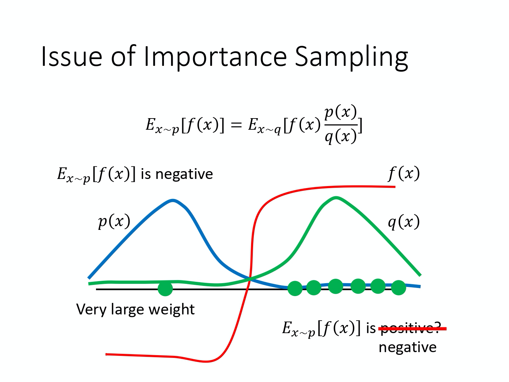
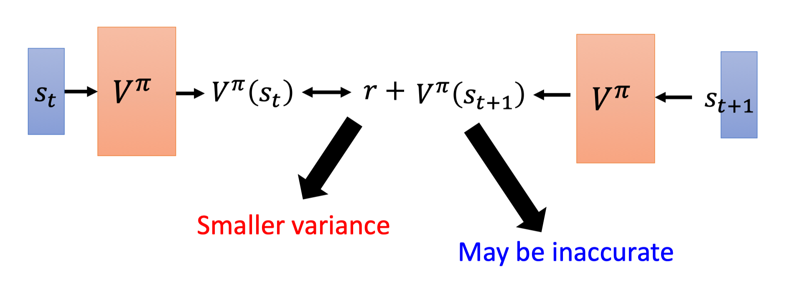
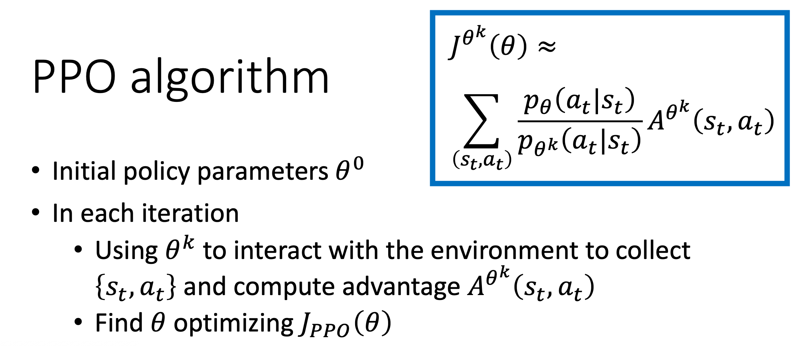

# PPO
## From On-policy to Off-policy
在讲 PPO 之前，我们先回顾下 on-policy 和 off-policy 这两种训练方法的区别。
在强化学习里面，我们要学习的就是一个 agent。

* 如果要学习的 agent 跟和环境互动的 agent 是同一个的话， 这个叫做`on-policy(同策略)`。 
* 如果要学习的 agent 跟和环境互动的 agent 不是同一个的话， 那这个叫做`off-policy(异策略)`。

比较拟人化的讲法是如果要学习的那个 agent，一边跟环境互动，一边做学习这个叫 on-policy。 如果它在旁边看别人玩，通过看别人玩来学习的话，这个叫做 off-policy。

为什么我们会想要考虑 off-policy ？让我们来想想 policy gradient。Policy gradient 是 on-policy 的做法，因为在做 policy gradient 时，我们需要有一个 agent、一个 policy 和一个 actor。这个 actor 先去跟环境互动去搜集资料，搜集很多的 $\tau$，根据它搜集到的资料按照 policy gradient 的式子去更新 policy 的参数。所以 policy gradient 是一个 on-policy 的算法。

`近端策略优化(Proximal Policy Optimization，简称 PPO)` 是 policy gradient 的一个变形，它是现在 OpenAI 默认的强化学习算法。
$$
\nabla \bar{R}_{\theta}=E_{\tau \sim p_{\theta}(\tau)}\left[R(\tau) \nabla \log p_{\theta}(\tau)\right]
$$

问题是上面这个更新的式子中的 $E_{\tau \sim p_{\theta}(\tau)}$  应该是你现在的 policy $\pi_{\theta}$ 所采样出来的轨迹 $\tau$ 做期望(expectation)。一旦更新了参数，从 $\theta$ 变成 $\theta'$ ，$p_\theta(\tau)$这个概率就不对了，之前采样出来的数据就变的不能用了。所以 policy gradient 是一个会花很多时间来采样数据的算法，大多数时间都在采样数据，agent 去跟环境做互动以后，接下来就要更新参数。你只能更新参数一次。接下来你就要重新再去收集数据， 然后才能再次更新参数。

这显然是非常花时间的，所以我们想要从 on-policy 变成 off-policy。 这样做就可以用另外一个 policy， 另外一个 actor $\theta'$  去跟环境做互动($\theta'$ 被固定了)。用 $\theta'$ 收集到的数据去训练 $\theta$。假设我们可以用 $\theta'$ 收集到的数据去训练 $\theta$，意味着说我们可以把 $\theta'$ 收集到的数据用非常多次，我们可以执行梯度上升(gradient ascent)好几次，我们可以更新参数好几次， 都只要用同一笔数据就好了。因为假设 $\theta$ 有能力学习另外一个 actor $\theta'$ 所采样出来的数据的话， 那 $\theta'$  就只要采样一次，也许采样多一点的数据， 让 $\theta$ 去更新很多次，这样就会比较有效率。

### Importance Sampling

具体怎么做呢？这边就需要介绍 `重要性采样(Importance Sampling，IS)` 的概念。

> 对于ー个随机变量，通常用概率密度函数来刻画该变量的概率分布特性。具体来说，给定随机变量的一个取值，可以根据概率密度函数来计算该值对应的概率（密度）。反过来，也可以根据概率密度函数提供的概率分布信息来生成随机变量的一个取值，这就是采样。因此，从某种意义上来说，采样是概率密度函数的逆向应用。与根据概率密度函数计算样本点对应的概率值不同，采样过程往往没有那么直接，通常需要根据待采样分布的具体特点来选择合适的采样策略。

假设你有一个函数 $f(x)$，你要计算从 p 这个分布采样 $x$，再把 $x$ 带到 $f$ 里面，得到 $f(x)$。你要该怎么计算这个 $f(x)$ 的期望值？假设你不能对 p 这个分布做积分的话，那你可以从 p 这个分布去采样一些数据 $x^i$。把 $x^i$ 代到 $f(x)$ 里面，然后取它的平均值，就可以近似 $f(x)$ 的期望值。

现在有另外一个问题，我们没有办法从 p 这个分布里面采样数据。假设我们不能从 p 采样数据，只能从另外一个分布 q 去采样数据，q  可以是任何分布。我们不能够从 p 去采样数据，但可以从 q 去采样 $x$。我们从 q 去采样 $x^i$ 的话就不能直接套下面的式子：
$$
E_{x \sim p}[f(x)] \approx \frac{1}{N} \sum_{i=1}^N f(x^i)
$$
因为上式是假设你的 $x$ 都是从 p 采样出来的。

所以做一个修正，修正是这样子的。期望值 $E_{x \sim p}[f(x)]$ 其实就是 $\int f(x) p(x) dx$，我们对其做如下的变换：
$$
\int f(x) p(x) d x=\int f(x) \frac{p(x)}{q(x)} q(x) d x=E_{x \sim q}[f(x){\frac{p(x)}{q(x)}}]
$$
我们就可以写成对 q 里面所采样出来的 $x$ 取期望值。我们从 q 里面采样 $x$，然后再去计算 $f(x) \frac{p(x)}{q(x)}$，再去取期望值。所以就算我们不能从 p 里面去采样数据，只要能够从 q 里面去采样数据，然后代入上式，你就可以计算从 p 这个分布采样 $x$ 代入 $f$ 以后所算出来的期望值。

这边是从 q 做采样，所以从 q 里采样出来的每一笔数据，你需要乘上一个`重要性权重(importance weight)` $\frac{p(x)}{q(x)}$ 来修正这两个分布的差异。$q(x)$ 可以是任何分布，唯一的限制情况就是 $q(x)$ 的概率是 0 的时候，$p(x)$ 的概率不为 0，这样会没有定义。假设  $q(x)$ 的概率是 0 的时候，$p(x)$ 的概率也都是 0 的话，那这样 $p(x)$ 除以 $q(x)$是有定义的。所以这个时候你就可以使用重要性采样这个技巧。你就可以从 p 做采样换成从 q 做采样。

**重要性采样有一些问题。**虽然理论上你可以把 p 换成任何的 q。但是在实现上，p 和 q 不能差太多。差太多的话，会有一些问题。什么样的问题呢？
$$
E_{x \sim p}[f(x)]=E_{x \sim q}\left[f(x) \frac{p(x)}{q(x)}\right]
$$
虽然上式成立（上式左边是 $f(x)$ 的期望值，它的分布是 p，上式右边是 $f(x) \frac{p(x)}{q(x)}$ 的期望值，它的分布是 q），但如果不是算期望值，而是算方差的话，$\operatorname{Var}_{x \sim p}[f(x)]$ 和 $\operatorname{Var}_{x \sim q}\left[f(x) \frac{p(x)}{q(x)}\right]$ 是不一样的。两个随机变量的平均值一样，并不代表它的方差一样。

我们可以代一下方差的公式 $\operatorname{Var}[X]=E\left[X^{2}\right]-(E[X])^{2}$，然后得到下式：
$$
\operatorname{Var}_{x \sim p}[f(x)]=E_{x \sim p}\left[f(x)^{2}\right]-\left(E_{x \sim p}[f(x)]\right)^{2}
$$

$$
\begin{aligned}
\operatorname{Var}_{x \sim q}\left[f(x) \frac{p(x)}{q(x)}\right] &=E_{x \sim q}\left[\left(f(x) \frac{p(x)}{q(x)}\right)^{2}\right]-\left(E_{x \sim q}\left[f(x) \frac{p(x)}{q(x)}\right]\right)^{2} \\
&=E_{x \sim p}\left[f(x)^{2} \frac{p(x)}{q(x)}\right]-\left(E_{x \sim p}[f(x)]\right)^{2}
\end{aligned}
$$

$\operatorname{Var}_{x \sim p}[f(x)]$ 和 $\operatorname{Var}_{x \sim q}\left[f(x) \frac{p(x)}{q(x)}\right]$ 的差别在第一项是不同的， $\operatorname{Var}_{x \sim q}\left[f(x) \frac{p(x)}{q(x)}\right]$ 的第一项多乘了$\frac{p(x)}{q(x)}$，如果 $\frac{p(x)}{q(x)}$ 差距很大的话，$f(x)\frac{p(x)}{q(x)}$ 的方差就会很大。所以理论上它们的期望值一样，也就是说，你只要对 p 这个分布采样够多次，q 这个分布采样够多，你得到的结果会是一样的。但是如果你采样的次数不够多，因为它们的方差差距是很大的，所以你就有可能得到非常大的差别。

举个例子，当 $p(x)$ 和 $q(x)$ 差距很大的时候，会发生什么样的问题。

假设蓝线是 $p(x)$  的分布，绿线是 $q(x)$  的分布，红线是 $f(x)$。如果我们要计算 $f(x)$的期望值，从 $p(x)$  这个分布做采样的话，那显然 $E_{x \sim p}[f(x)]$ 是负的，因为左边那块区域 $p(x)$ 的概率很高，所以要采样的话，都会采样到这个地方，而 $f(x)$ 在这个区域是负的， 所以理论上这一项算出来会是负。

接下来我们改成从 $q(x)$ 这边做采样，因为 $q(x)$ 在右边这边的概率比较高，所以如果你采样的点不够的话，那你可能都只采样到右侧。如果你都只采样到右侧的话，你会发现说，算 $E_{x \sim q}\left[f(x) \frac{p(x)}{q(x)}\right]$这一项，搞不好还应该是正的。你这边采样到这些点，然后你去计算它们的 $f(x) \frac{p(x)}{q(x)}$ 都是正的。你采样到这些点都是正的。 你取期望值以后也都是正的，这是因为你采样的次数不够多。假设你采样次数很少，你只能采样到右边这边。左边虽然概率很低，但也不是没有可能被采样到。假设你今天好不容易采样到左边的点，因为左边的点，$p(x)$ 和 $q(x)$ 是差很多的， 这边 $p(x)$ 很大，$q(x)$ 很小。今天 $f(x)$ 好不容易终于采样到一个负的，这个负的就会被乘上一个非常大的权重，这样就可以平衡掉刚才那边一直采样到正的值的情况。最终你算出这一项的期望值，终究还是负的。但前提是你要采样够多次，这件事情才会发生。**但有可能采样次数不够多，$E_{x \sim p}[f(x)]$ 跟 $E_{x \sim q}\left[f(x) \frac{p(x)}{q(x)}\right]$ 就有可能有很大的差距。这就是重要性采样的问题。**

现在要做的事情就是把重要性采样用在 off-policy 的情况，把 on-policy 训练的算法改成 off-policy 训练的算法。

怎么改呢，之前我们是拿 $\theta$ 这个 policy 去跟环境做互动，采样出轨迹 $\tau$，然后计算 $R(\tau) \nabla \log p_{\theta}(\tau)$。现在我们不用 $\theta$ 去跟环境做互动，假设有另外一个 policy  $\theta'$，它就是另外一个 actor。它的工作是去做示范(demonstration)。$\theta'$ 的工作是要去示范给 $\theta$ 看。它去跟环境做互动，告诉 $\theta$ 说，它跟环境做互动会发生什么事，借此来训练 $\theta$。我们要训练的是 $\theta$ ，$\theta'$  只是负责做示范，跟环境做互动。

我们现在的 $\tau$ 是从 $\theta'$ 采样出来的，是拿 $\theta'$ 去跟环境做互动。所以采样出来的 $\tau$ 是从 $\theta'$ 采样出来的，这两个分布不一样。但没有关系，假设你本来是从 p 做采样，但你发现你不能从 p 做采样，所以我们不拿 $\theta$ 去跟环境做互动。你可以把 p 换 q，然后在后面补上一个重要性权重。现在的状况就是一样，把 $\theta$ 换成 $\theta'$ 后，要补上一个重要性权重 $\frac{p_{\theta}(\tau)}{p_{\theta^{\prime}}(\tau)}$。这个重要性权重就是某一个轨迹 $\tau$ 用 $\theta$ 算出来的概率除以这个轨迹 $\tau$ 用 $\theta'$ 算出来的概率。这一项是很重要的，因为你要学习的是 actor $\theta$ 和 $\theta'$ 是不太一样的，$\theta'$ 会见到的情形跟 $\theta$ 见到的情形不见得是一样的，所以中间要做一个修正的项。

Q: 现在的数据是从 $\theta'$ 采样出来的，从 $\theta$ 换成 $\theta'$ 有什么好处？

A: 因为现在跟环境做互动是 $\theta'$ 而不是 $\theta$。所以采样出来的东西跟 $\theta$ 本身是没有关系的。所以你就可以让 $\theta'$ 做互动采样一大堆的数据，$\theta$ 可以更新参数很多次，一直到 $\theta$ 训练到一定的程度，更新很多次以后，$\theta'$ 再重新去做采样，这就是 on-policy 换成 off-policy 的妙用。

实际在做 policy gradient 的时候，我们并不是给整个轨迹 $\tau$ 都一样的分数，而是每一个状态-动作的对(pair)会分开来计算。实际上更新梯度的时候，如下式所示。
$$
=E_{\left(s_{t}, a_{t}\right) \sim \pi_{\theta}}\left[A^{\theta}\left(s_{t}, a_{t}\right) \nabla \log p_{\theta}\left(a_{t}^{n} | s_{t}^{n}\right)\right]
$$

我们用 $\theta$ 这个 actor 去采样出 $s_t$ 跟 $a_t$，采样出状态跟动作的对，我们会计算这个状态跟动作对的 advantage $A^{\theta}\left(s_{t}, a_{t}\right)$， 就是它有多好。

$A^{\theta}\left(s_{t}, a_{t}\right)$ 就是累积奖励减掉 bias，这一项就是估测出来的。它要估测的是，在状态 $s_t$ 采取动作 $a_t$ 是好的还是不好的。接下来后面会乘上 $\nabla \log p_{\theta}\left(a_{t}^{n} | s_{t}^{n}\right)$，也就是说如果 $A^{\theta}\left(s_{t}, a_{t}\right)$ 是正的，就要增加概率， 如果是负的，就要减少概率。

我们通过重要性采样把 on-policy 变成 off-policy，从 $\theta$ 变成 $\theta'$。所以现在 $s_t$、$a_t$ 是 $\theta'$ 跟环境互动以后所采样到的数据。 但是拿来训练要调整参数是模型 $\theta$。因为 $\theta'$  跟 $\theta$ 是不同的模型，所以你要做一个修正的项。这项修正的项，就是用重要性采样的技术，把 $s_t$、$a_t$ 用 $\theta$ 采样出来的概率除掉 $s_t$、$a_t$  用 $\theta'$  采样出来的概率。

$$
=E_{\left(s_{t}, a_{t}\right) \sim \pi_{\theta^{\prime}}}\left[\frac{p_{\theta}\left(s_{t}, a_{t}\right)}{p_{\theta^{\prime}}\left(s_{t}, a_{t}\right)} A^{\theta}\left(s_{t}, a_{t}\right) \nabla \log p_{\theta}\left(a_{t}^{n} | s_{t}^{n}\right)\right]
$$

$A^{\theta}(s_t,a_t)$ 有一个上标 $\theta$，$\theta$  代表说这个是 actor $\theta$ 跟环境互动的时候所计算出来的 A。但是实际上从 $\theta$ 换到 $\theta'$  的时候，$A^{\theta}(s_t,a_t)$ 应该改成 $A^{\theta'}(s_t,a_t)$，为什么？A 这一项是想要估测说现在在某一个状态采取某一个动作，接下来会得到累积奖励的值减掉 baseline 。你怎么估 A 这一项，你就会看在状态 $s_t$，采取动作 $a_t$，接下来会得到的奖励的总和，再减掉 baseline。之前是 $\theta$ 在跟环境做互动，所以你观察到的是 $\theta$ 可以得到的奖励。但现在是 $\theta'$  在跟环境做互动，所以你得到的这个 advantage， 其实是根据 $\theta'$  所估计出来的 advantage。但我们现在先不要管那么多，我们就假设这两项可能是差不多的。

接下来，我们可以拆解 $p_{\theta}\left(s_{t}, a_{t}\right)$ 和 $p_{\theta'}\left(s_{t}, a_{t}\right)$，即
$$
\begin{aligned}
p_{\theta}\left(s_{t}, a_{t}\right)&=p_{\theta}\left(a_{t}|s_{t}\right) p_{\theta}(s_t) \\
p_{\theta'}\left(s_{t}, a_{t}\right)&=p_{\theta'}\left(a_{t}|s_{t}\right) p_{\theta'}(s_t) 
\end{aligned}
$$
于是我们得到下式：
$$
=E_{\left(s_{t}, a_{t}\right) \sim \pi_{\theta^{\prime}}}\left[\frac{p_{\theta}\left(a_{t} | s_{t}\right)}{p_{\theta^{\prime}}\left(a_{t} | s_{t}\right)} \frac{p_{\theta}\left(s_{t}\right)}{p_{\theta^{\prime}}\left(s_{t}\right)} A^{\theta^{\prime}}\left(s_{t}, a_{t}\right) \nabla \log p_{\theta}\left(a_{t}^{n} | s_{t}^{n}\right)\right]
$$

这边需要做一件事情是，假设模型是 $\theta$ 的时候，你看到 $s_t$ 的概率，跟模型是 $\theta'$  的时候，你看到 $s_t$ 的概率是差不多的，即 $p_{\theta}(s_t)=p_{\theta'}(s_t)$。因为它们是一样的，所以你可以把它删掉，即
$$
=E_{\left(s_{t}, a_{t}\right) \sim \pi_{\theta^{\prime}}}\left[\frac{p_{\theta}\left(a_{t} | s_{t}\right)}{p_{\theta^{\prime}}\left(a_{t} | s_{t}\right)} A^{\theta^{\prime}}\left(s_{t}, a_{t}\right) \nabla \log p_{\theta}\left(a_{t}^{n} | s_{t}^{n}\right)\right]  \tag{1}
$$

Q: 为什么可以假设 $p_{\theta}(s_t)$ 和 $p_{\theta'}(s_t)$ 是差不多的？

A: 因为你会看到什么状态往往跟你会采取什么样的动作是没有太大的关系的。比如说你玩不同的 Atari 的游戏，其实你看到的游戏画面都是差不多的，所以也许不同的 $\theta$  对 $s_t$ 是没有影响的。但更直觉的理由就是 $p_{\theta}(s_t)$ 很难算，想想看这项要怎么算，这一项你还要说我有一个参数 $\theta$，然后拿 $\theta$ 去跟环境做互动，算 $s_t$ 出现的概率，这个你很难算。尤其如果输入是图片的话， 同样的 $s_t$ 根本就不会出现第二次。你根本没有办法估这一项， 所以干脆就无视这个问题。

但是 $p_{\theta}(a_t|s_t)$很好算。你手上有 $\theta$ 这个参数，它就是个网络。你就把 $s_t$ 带进去，$s_t$ 就是游戏画面，你把游戏画面带进去，它就会告诉你某一个状态的 $a_t$ 概率是多少。我们有个 policy 的网络，把 $s_t$ 带进去，它会告诉我们每一个 $a_t$ 的概率是多少。所以 $\frac{p_{\theta}\left(a_{t} | s_{t}\right)}{p_{\theta^{\prime}}\left(a_{t} | s_{t}\right)}$ 这一项，你只要知道 $\theta$ 和 $\theta'$ 的参数就可以算。

现在我们得到一个新的目标函数。

$$
J^{\theta^{\prime}}(\theta)=E_{\left(s_{t}, a_{t}\right) \sim \pi_{\theta^{\prime}}}\left[\frac{p_{\theta}\left(a_{t} | s_{t}\right)}{p_{\theta^{\prime}}\left(a_{t} | s_{t}\right)} A^{\theta^{\prime}}\left(s_{t}, a_{t}\right)\right]
$$

式(1)是梯度，其实我们可以从梯度去反推原来的目标函数，我们可以用如下的公式来反推目标函数：

$$
\nabla f(x)=f(x) \nabla \log f(x)
$$

要注意一点，对 $\theta$ 求梯度时，$p_{\theta^{\prime}}(a_{t} | s_{t})$ 和 $A^{\theta^{\prime}}\left(s_{t}, a_{t}\right)$ 都是常数。

所以实际上，当我们使用重要性采样的时候，要去优化的那一个目标函数就长这样子，我们把它写作 $J^{\theta^{\prime}}(\theta)$。为什么写成 $J^{\theta^{\prime}}(\theta)$ 呢，这个括号里面那个 $\theta$ 代表我们要去优化的那个参数。$\theta'$  是说我们拿 $\theta'$  去做示范，就是现在真正在跟环境互动的是 $\theta'$。因为 $\theta$ 不跟环境做互动，是 $\theta'$ 在跟环境互动。

然后你用 $\theta'$  去跟环境做互动，采样出 $s_t$、$a_t$ 以后，你要去计算 $s_t$ 跟 $a_t$ 的 advantage，然后你再去把它乘上 $\frac{p_{\theta}\left(a_{t} | s_{t}\right)}{p_{\theta^{\prime}}\left(a_{t} | s_{t}\right)}$。$\frac{p_{\theta}\left(a_{t} | s_{t}\right)}{p_{\theta^{\prime}}\left(a_{t} | s_{t}\right)}$ 是好算的，$A^{\theta^{\prime}}\left(s_{t}, a_{t}\right)$ 可以从这个采样的结果里面去估测出来的，所以 $J^{\theta^{\prime}}(\theta)$ 是可以算的。实际上在更新参数的时候，就是按照式(1) 来更新参数。

## PPO

我们可以通过重要性采样把 on-policy 换成 off-policy，但重要性采样有一个问题：如果 $p_{\theta}\left(a_{t} | s_{t}\right)$ 跟 $p_{\theta'}\left(a_{t} | s_{t}\right)$ 这两个分布差太多的话，重要性采样的结果就会不好。怎么避免它差太多呢？这个就是 `Proximal Policy Optimization (PPO) ` 在做的事情。**注意，由于在 PPO 中 $\theta'$ 是 $\theta_{\text{old}}$，即 behavior policy 也是 $\theta$，所以 PPO 是 on-policy 的算法**。 

PPO 实际上做的事情就是这样，在 off-policy 的方法里要优化的是 $J^{\theta^{\prime}}(\theta)$。但是这个目标函数又牵涉到重要性采样。在做重要性采样的时候，$p_{\theta}\left(a_{t} | s_{t}\right)$ 不能跟 $p_{\theta'}\left(a_{t} | s_{t}\right)$差太多。你做示范的模型不能够跟真正的模型差太多，差太多的话，重要性采样的结果就会不好。我们在训练的时候，多加一个约束(constrain)。这个约束是 $\theta$  跟 $\theta'$ 输出的动作的 KL 散度(KL divergence)，简单来说，这一项的意思就是要衡量说 $\theta$ 跟 $\theta'$ 有多像。

然后我们希望在训练的过程中，学习出来的 $\theta$ 跟 $\theta'$  越像越好。因为如果 $\theta$ 跟 $\theta'$ 不像的话，最后的结果就会不好。所以在 PPO 里面有两个式子，一方面是优化本来要优化的东西，但再加一个约束。这个约束就好像正则化(regularization) 的项(term) 一样，在做机器学习的时候不是有 L1/L2 的正则化。这一项也很像正则化，这样正则化做的事情就是希望最后学习出来的 $\theta$ 不要跟 $\theta'$ 太不一样。

PPO 有一个前身叫做`信任区域策略优化(Trust Region Policy Optimization，TRPO)`，TRPO 的式子如下式所示：

$$
\begin{aligned}
J_{T R P O}^{\theta^{\prime}}(\theta)=E_{\left(s_{t}, a_{t}\right) \sim \pi_{\theta^{\prime}}}\left[\frac{p_{\theta}\left(a_{t} | s_{t}\right)}{p_{\theta^{\prime}}\left(a_{t} | s_{t}\right)} A^{\theta^{\prime}}\left(s_{t}, a_{t}\right)\right] \\ \\
 \mathrm{KL}\left(\theta, \theta^{\prime}\right)<\delta 
\end{aligned}
$$

它与 PPO 不一样的地方是约束摆的位置不一样，PPO 是直接把约束放到你要优化的那个式子里面，然后你就可以用梯度上升的方法去最大化这个式子。但 TRPO 是把 KL 散度当作约束，它希望 $\theta$ 跟 $\theta'$ 的 KL 散度小于一个 $\delta$。如果你使用的是基于梯度的优化时，有约束是很难处理的。

TRPO 是很难处理的，因为它把 KL 散度约束当做一个额外的约束，没有放目标(objective)里面，所以它很难算，所以一般就用 PPO 而不是 TRPO。看文献上的结果是，PPO 跟 TRPO 性能差不多，但 PPO 在实现上比 TRPO 容易的多。

Q: KL 散度到底指的是什么？

A: 

这边我是直接把 KL 散度当做一个函数，输入是 $\theta$ 跟 $\theta'$，但我的意思并不是说把 $\theta$ 或 $\theta'$  当做一个分布，算这两个分布之间的距离。所谓的 $\theta$ 跟 $\theta'$  的距离并不是参数上的距离，而是行为(behavior)上的距离。

假设你有两个 actor，它们的参数分别为 $\theta$ 和 $\theta'$，所谓参数上的距离就是你算这两组参数有多像。这里讲的不是参数上的距离， 而是它们行为上的距离。你先代进去一个状态 s，它会对这个动作的空间输出一个分布。假设你有 3 个动作，3 个可能的动作就输出 3 个值。今天所指的距离是行为距离(behavior distance)，也就是说，给定同样的状态，输出动作之间的差距。这两个动作的分布都是一个概率分布，所以就可以计算这两个概率分布的 KL 散度。把不同的状态输出的这两个分布的 KL 散度平均起来才是我这边所指的两个 actor 间的 KL 散度。

Q: 为什么不直接算 $\theta$ 和 $\theta'$ 之间的距离？算这个距离的话，甚至不要用 KL 散度算，L1 跟 L2 的范数(norm)也可以保证 $\theta$ 跟 $\theta'$ 很接近。

A: 在做强化学习的时候，之所以我们考虑的不是参数上的距离，而是动作上的距离，是因为很有可能对 actor 来说，参数的变化跟动作的变化不一定是完全一致的。有时候你参数小小变了一下，它可能输出的行为就差很多。或者是参数变很多，但输出的行为可能没什么改变。**所以我们真正在意的是这个 actor 的行为上的差距，而不是它们参数上的差距。**所以在做 PPO 的时候，所谓的 KL 散度并不是参数的距离，而是动作的距离。

### PPO-Penalty

**PPO 算法有两个主要的变种：PPO-Penalty 和 PPO-Clip。**

我们来看一下 `PPO1` 的算法，即 `PPO-Penalty`。它先初始化一个 policy 的参数 $\theta^0$。然后在每一个迭代里面，你要用参数 $\theta^k$，$\theta^k$ 就是你在前一个训练的迭代得到的 actor 的参数，你用 $\theta^k$ 去跟环境做互动，采样到一大堆状态-动作的对。

然后你根据 $\theta^k$ 互动的结果，估测一下 $A^{\theta^{k}}\left(s_{t}, a_{t}\right)$。然后你就使用 PPO 的优化的公式。但跟原来的 policy gradient 不一样，原来的 policy gradient 只能更新一次参数，更新完以后，你就要重新采样数据。但是现在不用，你拿 $\theta^k$ 去跟环境做互动，采样到这组数据以后，你可以让 $\theta$ 更新很多次，想办法去最大化目标函数。这边 $\theta$ 更新很多次没有关系，因为我们已经有做重要性采样，所以这些经验，这些状态-动作的对是从 $\theta^k$ 采样出来的没有关系。$\theta$ 可以更新很多次，它跟 $\theta^k$ 变得不太一样也没有关系，你还是可以照样训练 $\theta$。

在 PPO 的论文里面还有一个 `adaptive KL divergence`。这边会遇到一个问题就是 $\beta$  要设多少，它就跟正则化一样。正则化前面也要乘一个权重，所以这个 KL 散度前面也要乘一个权重，但 $\beta$  要设多少呢？所以有个动态调整 $\beta$ 的方法。

* 在这个方法里面，你先设一个你可以接受的 KL 散度的最大值。假设优化完这个式子以后，你发现 KL 散度的项太大，那就代表说后面这个惩罚的项没有发挥作用，那就把 $\beta$ 调大。
* 另外，你设一个 KL 散度的最小值。如果优化完上面这个式子以后，你发现 KL 散度比最小值还要小，那代表后面这一项的效果太强了，你怕他只弄后面这一项，那 $\theta$ 跟 $\theta^k$ 都一样，这不是你要的，所以你要减少 $\beta$。

所以 $\beta$ 是可以动态调整的。这个叫做 `adaptive KL penalty`。

### PPO-Clip

如果你觉得算 KL 散度很复杂，有一个`PPO2`，PPO2 即 `PPO-Clip`。PPO2 要去最大化的目标函数如下式所示，它的式子里面就没有 KL 散度 。
$$
\begin{aligned}
J_{P P O 2}^{\theta^{k}}(\theta) \approx \sum_{\left(s_{t}, a_{t}\right)} \min &\left(\frac{p_{\theta}\left(a_{t} | s_{t}\right)}{p_{\theta^{k}}\left(a_{t} | s_{t}\right)} A^{\theta^{k}}\left(s_{t}, a_{t}\right),\right.\\
&\left.\operatorname{clip}\left(\frac{p_{\theta}\left(a_{t} | s_{t}\right)}{p_{\theta^{k}}\left(a_{t} | s_{t}\right)}, 1-\varepsilon, 1+\varepsilon\right) A^{\theta^{k}}\left(s_{t}, a_{t}\right)\right)
\end{aligned}
$$
这个式子看起来有点复杂，但实际实现就很简单。我们来看一下这个式子到底是什么意思。

* Min 这个操作符(operator)做的事情是第一项跟第二项里面选比较小的那个。
* 第二项前面有个 clip 函数，clip 函数的意思是说，
  * 在括号里面有三项，如果第一项小于第二项的话，那就输出 $1-\varepsilon$ 。
  * 第一项如果大于第三项的话，那就输出 $1+\varepsilon$。 
* $\varepsilon$ 是一个超参数，你要 tune 的，你可以设成 0.1 或 设 0.2 。

假设这边设 0.2 的话，如下式所示
$$
\operatorname{clip}\left(\frac{p_{\theta}\left(a_{t} | s_{t}\right)}{p_{\theta^{k}}\left(a_{t} | s_{t}\right)}, 0.8, 1.2\right)
$$

如果 $\frac{p_{\theta}\left(a_{t} | s_{t}\right)}{p_{\theta^{k}}\left(a_{t} | s_{t}\right)}$ 算出来小于 0.8，那就当作 0.8。如果算出来大于 1.2，那就当作1.2。

我们先看看下面这项这个算出来到底是什么东西：
$$
\operatorname{clip}\left(\frac{p_{\theta}\left(a_{t} | s_{t}\right)}{p_{\theta^{k}}\left(a_{t} | s_{t}\right)}, 1-\varepsilon, 1+\varepsilon\right)
$$

上图的横轴是 $\frac{p_{\theta}\left(a_{t} | s_{t}\right)}{p_{\theta^{k}}\left(a_{t} | s_{t}\right)}$，纵轴是 clip 函数的输出。

* 如果 $\frac{p_{\theta}\left(a_{t} | s_{t}\right)}{p_{\theta^{k}}\left(a_{t} | s_{t}\right)}$ 大于$1+\varepsilon$，输出就是 $1+\varepsilon$。
* 如果小于 $1-\varepsilon$， 它输出就是 $1-\varepsilon$。
* 如果介于 $1+\varepsilon$ 跟 $1-\varepsilon$ 之间， 就是输入等于输出。

*  $\frac{p_{\theta}\left(a_{t} | s_{t}\right)}{p_{\theta^{k}}\left(a_{t} | s_{t}\right)}$ 是绿色的线；
* $\operatorname{clip}\left(\frac{p_{\theta}\left(a_{t} | s_{t}\right)}{p_{\theta^{k}}\left(a_{t} | s_{t}\right)}, 1-\varepsilon, 1+\varepsilon\right)$ 是蓝色的线；
* 在绿色的线跟蓝色的线中间，我们要取一个最小的。假设前面乘上的这个项 A，它是大于 0 的话，取最小的结果，就是红色的这一条线。

如果 A 小于 0 的话，取最小的以后，就得到红色的这一条线。

虽然这个式子看起来有点复杂，实现起来是蛮简单的，**因为这个式子想要做的事情就是希望 $p_{\theta}(a_{t} | s_{t})$ 跟 $p_{\theta^k}(a_{t} | s_{t})$，也就是你拿来做示范的模型跟你实际上学习的模型，在优化以后不要差距太大。**

**怎么让它做到不要差距太大呢？**

* 如果 A > 0，也就是某一个状态-动作的对是好的，那我们希望增加这个状态-动作对的概率。也就是说，我们想要让  $p_{\theta}(a_{t} | s_{t})$ 越大越好，但它跟 $p_{\theta^k}(a_{t} | s_{t})$ 的比值不可以超过 $1+\varepsilon$。如果超过 $1+\varepsilon$  的话，就没有 benefit 了。红色的线就是我们的目标函数，我们希望目标越大越好，我们希望 $p_{\theta}(a_{t} | s_{t})$ 越大越好。但是 $\frac{p_{\theta}\left(a_{t} | s_{t}\right)}{p_{\theta^{k}}\left(a_{t} | s_{t}\right)}$ 只要大过 $1+\varepsilon$，就没有 benefit 了。所以今天在训练的时候，当 $p_{\theta}(a_{t} | s_{t})$ 被训练到 $\frac{p_{\theta}\left(a_{t} | s_{t}\right)}{p_{\theta^{k}}\left(a_{t} | s_{t}\right)}>1+\varepsilon$ 时，它就会停止。假设 $p_{\theta}(a_{t} | s_{t})$  比 $p_{\theta^k}(a_{t} | s_{t})$ 还要小，并且这个 advantage 是正的。因为这个动作是好的，我们当然希望这个动作被采取的概率越大越好，我们希望 $p_{\theta}(a_{t} | s_{t})$ 越大越好。所以假设 $p_{\theta}(a_{t} | s_{t})$ 还比 $p_{\theta^k}(a_{t} | s_{t})$  小，那就尽量把它挪大，但只要大到 $1+\varepsilon$ 就好。
* 如果 A < 0，也就是某一个状态-动作对是不好的，我们希望把 $p_{\theta}(a_{t} | s_{t})$ 减小。如果 $p_{\theta}(a_{t} | s_{t})$ 比 $p_{\theta^k}(a_{t} | s_{t})$  还大，那你就尽量把它压小，压到 $\frac{p_{\theta}\left(a_{t} | s_{t}\right)}{p_{\theta^{k}}\left(a_{t} | s_{t}\right)}$ 是 $1-\epsilon$ 的时候就停了，就不要再压得更小。

这样的好处就是，你不会让 $p_{\theta}(a_{t} | s_{t})$ 跟 $p_{\theta^k}(a_{t} | s_{t})$ 差距太大。要实现这个东西，很简单。

上图是 PPO 跟其它方法的比较。Actor-Critic 和 A2C+Trust Region 方法是基于 actor-critic 的方法。PPO 是紫色线的方法，这边每张图就是某一个 RL 的任务，你会发现说在多数的情况(cases)里面，PPO 都是不错的，不是最好的，就是第二好的。

## References

* [OpenAI Spinning Up ](https://spinningup.openai.com/en/latest/spinningup/rl_intro.html#)
* [百面机器学习](https://book.douban.com/subject/30285146/)

