# 第6章 深度Q网络
传统的强化学习算法会使用表格的形式存储状态价值函数 $V(s)$ 或动作价值函数 $Q(s,a)$，但是这样的方法存在很大的局限性。例如，现实中的强化学习任务所面临的状态空间往往是连续的，存在无穷多个状态，在这种情况下，就不能再使用表格对价值函数进行存储。价值函数近似利用函数直接拟合状态价值函数或动作价值函数，降低了对存储空间的要求，有效地解决了这个问题。

为了在连续的状态和动作空间中计算值函数 $Q_{\pi}(s,a)$，我们可以用一个函数 $Q_{\phi}(\boldsymbol{s},\boldsymbol{a})$ 来表示近似计算，称为**价值函数近似（value function approximation）**。
$$
    Q_{\phi}(\boldsymbol{s}, \boldsymbol{a}) \approx Q_{\pi}(\boldsymbol{s}, \boldsymbol{a})
$$
其中，$\boldsymbol{s}$、$\boldsymbol{a}$ 分别是状态 $s$ 和动作 $a$ 的向量表示，函数 $Q_{\phi}(\boldsymbol{s}, \boldsymbol{a})$ 通常是一个参数为 $\phi$ 的函数，比如神经网络，其输出为一个实数，称为 **Q 网络（Q-network）**。

深度Q网络（deep Q-network，DQN）是指基于深度学习的Q学习算法，主要结合了价值函数近似与神经网络技术，并采用目标网络和经历回放的方法进行网络的训练。在 Q学习 中，我们使用表格来存储每个状态 $s$ 下采取动作 $a$ 获得的奖励，即状态-动作值函数 $Q(s,a)$。然而，这种方法在状态量巨大甚至是连续的任务中，会遇到维度灾难问题，往往是不可行的。因此，深度Q网络 采用了价值函数近似的表示方法。

## 6.1 状态价值函数 

深度Q网络 是基于价值的算法，在基于价值的算法里面，我们学习的不是策略，而是**评论员（critic）**。评论员的任务是评价现在的动作有多好或有多不好。假设有一个演员，其要学习一个策略来得到尽量高的回报。评论员就是评价演员的策略 $\pi$  好还是不好，即策略评估。例如，有一种评论员称为**状态价值函数**$V_{\pi}$。状态价值函数是指，假设演员的策略是 $\pi$，用 $\pi$  与环境交互，假设 $\pi$  看到了某一个状态 $s$，例如在玩雅达利游戏，状态 $s$ 是某一个画面，$\pi$ 看到某一个画面，接下来一直到游戏结束，期望的累积奖励有多大。如图 6.1a 所示，$V_{\pi}$ 是一个函数，输入一个状态，它会输出一个标量。这个标量代表演员的策略$\pi$ 看到状态 $s$ 的时候，预期到游戏结束的时候，它可以获得多大的奖励。例如，假设我们在玩太空侵略者，图 6.1b 所示的状态 $s$，这个游戏画面，$V_{\pi}(s)$  也许会很大，因为这时还有很多的怪兽可以击杀， 所以我们会得到很高的分数。一直到游戏结束的时候，我们仍然有很多的分数可以获得。图 6.1c 所示的情况我们得到的 $V_{\pi}(s)$ 可能就很小，因为剩下的怪兽也不多，并且红色的防护罩已经消失了，所以我们可能很快就会“死掉”。因此接下来得到预期的奖励，就不会太大。
    

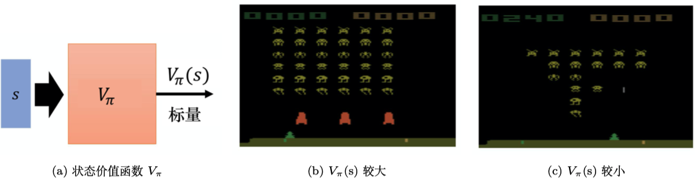

图 6.1 玩太空侵略者

这里需要强调，评论员无法凭空评价一个状态的好坏，它所评价的是在给定某一个状态的时候，如果接下来交互的演员的策略是 $\pi$，我们会得到多少奖励，这个奖励就是我们评价得出的值。因为就算是同样的状态，接下来的 $\pi$ 不一样，得到的奖励也是不一样的。例如，在左边的情况下，假设是一个正常的 $\pi$，它可以击杀很多怪兽；假设它是一个很弱的 $\pi$，它就站在原地不动，马上就被射死了，我们得到的 $V_\pi(s)$ 还是很小。所以评论员的输出值取决于状态和演员。评论员其实都要绑定一个演员，它是在衡量某一个演员的好坏，而不是衡量一个状态的好坏。这里要强调一下，评论员的输出是与演员有关的，状态的价值其实取决于演员，当演员改变的时候，状态价值函数的输出其实也是会跟着改变的。

怎么衡量状态价值函数 $V_{\pi}(s)$ 呢？有两种不同的方法：基于蒙特卡洛的方法和基于时序差分的方法。基于蒙特卡洛的方法就是让演员与环境交互，我们要看演员好不好，就让演员与环境交互，让评论员评价。评论员就统计，演员如果看到状态 $s_a$，接下来的累积奖励有多大；如果它看到状态 $s_b$，接下来的累积奖励有多大。但是实际上，我们不可能看到所有的状态。如果我们在玩雅达利游戏，状态是图像，那么无法看到所有的状态。所以实际上 $V_{\pi}(s)$ 是一个网络。对一个网络来说，就算输入状态是从来都没有看过的，它也可以想办法估测一个值。怎么训练这个网络呢？如图 6.2 所示，如果在状态 $s_a$，接下来的累积奖励就是 $G_a$。也就是对这个价值函数，如果输入是状态 $s_a$，正确的输出应该是 $G_a$；如果输入状态是 $s_b$，正确的输出应该是 $G_b$。所以在训练的时候， 它就是一个回归问题（regression problem）。网络的输出就是一个值，我们希望在输入 $s_a$ 的时候，输出的值与 $G_a$ 越接近越好；输入 $s_b$ 的时候，输出的值与 $G_b$ 越接近越好。接下来继续训练网络，这是基于蒙特卡洛的方法。

图 6.2 基于蒙特卡洛的方法

第二个方法是**时序差分**的方法，即基于时序差分的方法。在基于蒙特卡洛的方法中，每次我们都要计算累积奖励，也就是从某一个状态 $s_a$ 一直到游戏结束的时候，得到的所有奖励的总和。如果我们要使用基于蒙特卡洛的方法，我们必须至少玩到游戏结束。但有些游戏时间非常长，我们要玩到游戏结束才能够更新网络，这花的时间太多了，因此我们会采用基于时序差分的方法。基于时序差分的方法不需要玩到游戏结束，只需要在游戏的某一个状态 $s_t$ 的时候，采取动作 $a_t$ 得到奖励$r_t$ ，接下来进入状态 $s_{t+1}$，就可以使用时序差分的方法。我们可以通过式(6.1)来使用时序差分的方法。
$$
    V_{\pi}\left(s_{t}\right)=V_{\pi}\left(s_{t+1}\right)+r_{t} \tag{6.1}
$$

假设我们现在用的是某一个策略$\pi$，在状态 $s_t$时，它会采取动作 $a_t$，得到奖励 $r_t$ ，接下来进入 $s_{t+1}$ 。状态 $s_{t+1}$ 的值与状态 $s_t$ 的值，它们的中间差了一项 $r_t$，这是因为我们把 $s_{t+1}$ 的值加上得到的奖励 $r_t$ 就可以 得到$s_t$ 的值。有了式(6.1)，在训练的时候，我们并不是直接估测 $V_{\pi}$，而是希望得到的结果 $V_{\pi}$ 可以满足式(6.1)。我们是这样训练的，如图 6.3 所示，我们把 $s_t$ 输入网络，因为把 $s_t$ 输入网络会得到 $V_{\pi}(s_t)$，把 $s_{t+1}$ 输入网络会得到 $V_{\pi}(s_{t+1})$，$V_{\pi}(s_t)$ 减 $V_{\pi}(s_{t+1})$ 的值应该是 $r_t$。我们希望它们相减的损失与 $r_t$ 接近，训练下去，更新 $V_{\pi}$ 的参数，我们就可以把 $V_{\pi}$ 函数学习出来。

    

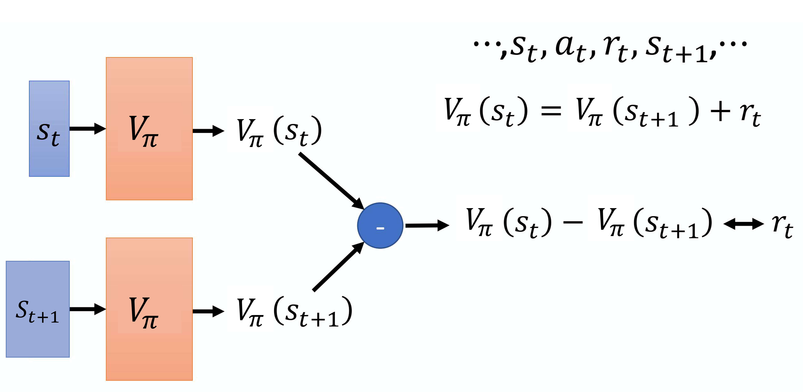

图 6.3 基于时序差分的方法

蒙特卡洛方法与时序差分方法有什么差别呢？如图 6.4 所示，蒙特卡洛方法最大的问题就是方差很大。因为我们在玩游戏的时候，游戏本身是有随机性的，所以我们可以把 $G_a$ 看成一个随机变量。因为我们每次到 $s_a$ 的时候，最后得到的 $G_a$ 其实是不一样的。我们看到同样的状态 $s_a$，最后到游戏结束的时候，因为游戏本身是有随机性的，玩游戏的模型可能也有随机性，所以我们每次得到的 $G_a$ 是不一样的，每一次得到的 $G_a$ 的差别其实会很大。为什么会很大呢？因为 $G_a$ 是很多个不同的步骤的奖励的和。假设我们每一个步骤都会得到一个奖励，$G_a$ 是从状态 $s_a$ 开始一直到游戏结束，每一个步骤的奖励的和。

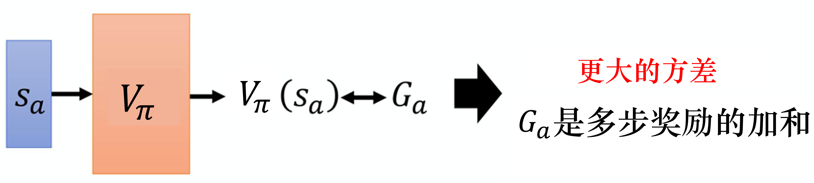

图 6.4 蒙特卡洛方法的问题

通过式(6.2)，我们知道 $G_a$ 的方差相较于某一个状态的奖励，它是比较大的。
$$
    \operatorname{Var}[k X]=k^{2} \operatorname{Var}[X] \tag{6.2}
$$
其中，Var 是指方差（variance）。 

如果用时序差分的方法，我们要去最小化
$$
    V_{\pi}\left(s_{t}\right) \longleftrightarrow r+V_{\pi}\left(s_{t+1}\right) \tag{6.3}
$$

其中，$r$具有随机性。因为即使我们在 $s_t$ 采取同一个动作，得到的奖励也不一定是一样的，所以 $r$ 是一个随机变量。但 $r$ 的方差比 $G_a$ 要小，因为 $G_a$ 是很多 $r$ 的加和，时序差分只是某一个 $r$  而已。$G_a$ 的方差会比较大，$r$ 的方差会比较小。但是这里我们会遇到的一个问题是 $V_{\pi}$ 的估计不一定准确。假设 $V_{\pi}$ 的估计不准确，我们使用式(6.3)学习出来的结果也会是不准确的。所以蒙特卡洛方法与时序差分方法各有优劣。其实时序差分方法是比较常用的，蒙特卡洛方法其实是比较少用的。

图 6.5 所示为时序差分方法与蒙特卡洛方法的差别。假设有某一个评论员，它去观察某一个策略 $\pi$  与环境交互 8 个回合的结果。有一个策略 $\pi$  与环境交互了8 次，得到了 8 次玩游戏的结果。接下来这个评论员去估测状态的值。

我们先计算 $s_b$ 的值。 状态 $s_b$ 在 8 场游戏里都存在，其中有 6 场得到奖励 1，有 2 场得到奖励 0。所以如果我们要计算期望值，只算智能体看到状态 $s_b$ 以后得到的奖励。智能体一直玩到游戏结束的时候得到的累积奖励期望值是 3/4，计算过程为
$$
    \frac{6 \times 1 + 2 \times 0}{8}=\frac{6}{8}=\frac{3}{4}
$$

但 $s_a$ 期望的奖励到底应该是多少呢？这里其实有两个可能的答案：0 和 3/4。为什么有两个可能的答案呢？这取决于我们用蒙特卡洛方法还是时序差分方法。用 蒙特卡洛方法与用 时序差分方法 算出来的结果是不一样的。

假如我们用蒙特卡洛方法，$s_a$ 就出现一次，看到状态 $s_a$ ，接下来累积奖励就是 0，所以 $s_a$ 期望奖励就是 0。但时序差分方法在计算的时候，需要更新
$$
    V_{\pi}\left(s_{a}\right)=V_{\pi}\left(s_{b}\right)+r
$$
因为我们在状态 $s_a$ 得到奖励 $r=0$ 以后，进入状态 $s_b$，所以状态 $s_a$ 的奖励等于状态 $s_b$ 的奖励加上从状态 $s_a$ 进入状态 $s_b$ 的时候可能得到的奖励 $r$。而得到的奖励 $r$ 的值是 0，$s_b$ 期望奖励是 3/4，那么 $s_a$ 的奖励应该是 3/4。

用蒙特卡洛方法与时序差分方法估出来的结果很有可能是不一样的。就算评论员观察到一样的训练数据，它最后估出来的结果也不一定是一样的。为什么会这样呢？哪一个结果比较对呢？其实都对。因为在第一个轨迹中， $s_a$ 得到奖励 0 以后，再进入 $s_b$ 也得到奖励 0。这里有两个可能。

（1）$s_a$ 是一个标志性的状态，只要看到 $s_a$ 以后，$s_b$ 就不会获得奖励，$s_a$ 可能影响了 $s_b$。如果是使用蒙特卡洛方法，它会把 $s_a$ 影响 $s_b$ 这件事考虑进去。所以看到 $s_a$ 以后，接下来 $s_b$ 就得不到奖励，$s_b$ 期望的奖励是 0。

（2）看到 $s_a$ 以后，$s_b$ 的奖励是 0 这件事只是巧合，并不是 $s_a$ 造成的，而是因为 $s_b$ 有时候就是会得到奖励 0，这只是单纯“运气”的问题。其实平常 $s_b$ 会得到的奖励期望值是 3/4，与 $s_a$ 是完全没有关系的。所以假设 $s_a$ 之后会进入 $s_b$，得到的奖励按照时序差分方法来算应该是 3/4。

不同的方法考虑了不同的假设，所以运算结果不同。

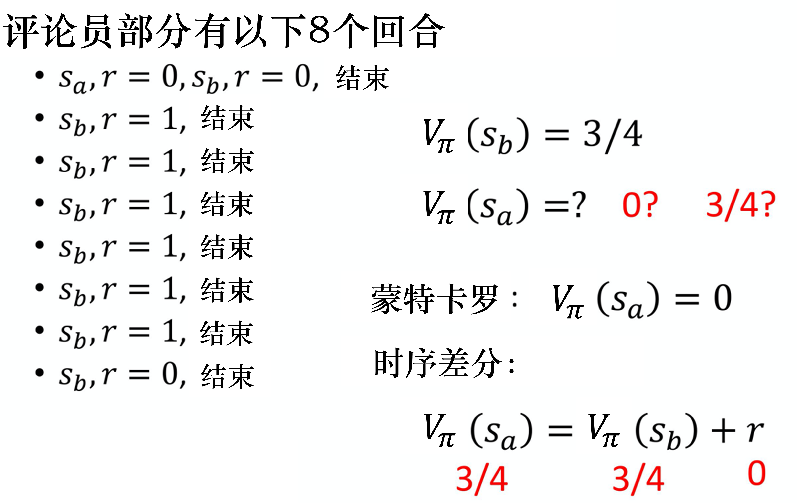

图 6.5 时序差分方法与蒙特卡洛方法的差别

## 6.2 动作价值函数 

还有另外一种评论员称为**Q函数**，它又被称为动作价值函数。状态价值函数的输入是一个状态，它根据状态计算出这个状态以后的期望的累积奖励（expected accumulated reward）是多少。动作价值函数的输入是一个状态-动作对，其指在某一个状态采取某一个动作，假设我们都使用策略 $\pi$ ，得到的累积奖励的期望值有多大。

Q函数有一个需要注意的问题是，策略 $\pi$在看到状态 $s$ 的时候，它采取的动作不一定是 $a$。Q函数假设在状态 $s$ 强制采取动作 $a$，而不管我们现在考虑的策略 $\pi$会不会采取动作 $a$，这并不重要。在状态 $s$ 强制采取动作 $a$。接下来都用策略 $\pi$ 继续玩下去，就只有在状态 $s$，我们才强制一定要采取动作 $a$，接下来就进入自动模式，让策略 $\pi$ 继续玩下去，得到的期望奖励才是 $Q_{\pi}(s,a)$ 。

Q函数有两种写法：

（1）如图 6.7a 所示，输入是状态与动作，输出就是一个标量。这种Q函数既适用于连续动作（动作是无法穷举的），又适用于离散动作。

（2）如图 6.7b 所示，输入是一个状态，输出就是多个值。这种Q函数只适用于离散动作。假设动作是离散的，比如动作就只有 3 个可能：往左、往右或是开火。Q函数输出的 3 个值就分别代表 $a$ 是往左的时候的 Q 值，$a$ 是往右的时候的 Q 值，还有 $a$ 是开火的时候的 Q 值。

    

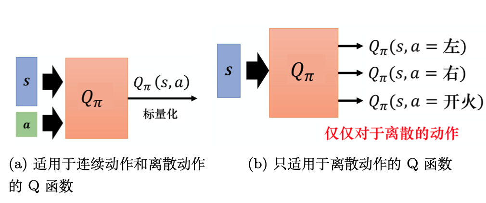

图 6.6 Q函数

如果我们去估计Q函数，看到的结果可能如图 6.7 所示。假设我们有 3 个动作：原地不动、向上、向下。假设在第一个状态，不管采取哪个动作，最后到游戏结束的时候，得到的期望奖励都差不多。因为乒乓球在这个地方时，就算我们向下，接下来我们应该还可以接到乒乓球，所以不管采取哪个动作，都相差不了太多。假设在第二个状态，乒乓球已经反弹到很接近边缘的地方，这个时候我们采取向上的动作，才能接到乒乓球，才能得到正的奖励。如果我们站在原地不动或向下，接下来都会错过这个乒乓球，得到的奖励就会是负的。假设在第三个状态，乒乓球离我们的球拍很近了，所以就要采取向上的动作。假设在第四个状态，乒乓球被反弹回去，这时候采取哪个动作都差不多。这是动作价值函数的例子。

    

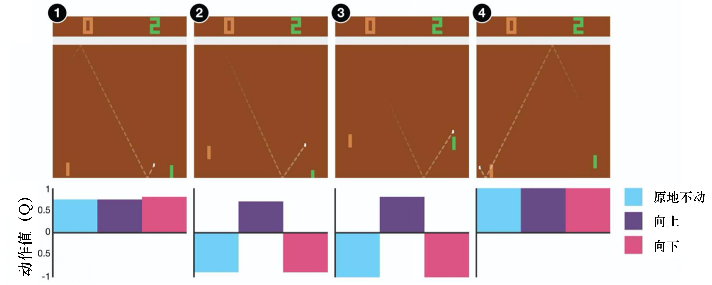

图 6.7 乒乓球例子

虽然我们学习的Q函数只能用来评估某一个策略 $\pi$ 的好坏，但只要有了 Q函数，我们就可以进行强化学习，就可以决定要采取哪一个动作，就可以进行策略改进。如图 6.8 所示，假设我们有一个初始的演员，也许一开始很差，随机的也没有关系。初始的演员称为 $\pi$，$\pi$ 与环境交互，会收集数据。接下来我们学习策略 $\pi$的 Q 值，去衡量一下 $\pi$ 在某一个状态强制采取某一个动作，接下来会得到的期望奖励，用时序差分方法或蒙特卡洛方法都是可以的。我们学习出一个Q函数以后，就可以找到一个新的策略 $\pi'$ ，策略$\pi'$ 会比原来的策略 $\pi$ 要好（稍后会定义什么是好）。所以假设我们有一个Q函数和某一个策略 $\pi$，根据策略 $\pi$ 学习出策略 $\pi$ 的Q函数，接下来可以找到一个新的策略  $\pi'$，它会比 $\pi$ 要好。我们用 $\pi'$ 取代 $\pi$，再去学习它的 Q 函数，得到新的Q函数以后，再去寻找一个更好的策略。这样一直循环下去，策略就会越来越好。 

首先要定义的是什么是好。$\pi'$ 一定会比 $\pi$ 要好，什么是好呢？这里的好是指，对所有可能的状态 $s$ 而言，$V_{\pi^{\prime}}(s) \geqslant V_{\pi}(s)$。也就是我们到同一个状态 $s$ 的时候，如果用 $\pi$ 继续与环境交互，我们得到的奖励一定会小于等于用 $\pi'$ 与环境交互得到的奖励。所以不管在哪一个状态，我们用 $\pi'$ 与环境交互，得到的期望奖励一定会比较大。所以 $\pi'$ 是比 $\pi$  要好的策略。

有了Q函数以后，我们把根据式(6.4)决定动作的策略称为 $\pi'$，
$$
    \pi^{\prime}(s)=\underset{a}{\arg \max} Q_{\pi}(s, a) \tag{6.4}
$$
$\pi'$ 一定比 $\pi$ 好。假设我们已经学习出 $\pi$ 的Q函数，在某一个状态 $s$，把所有可能的动作 $a$ 一一代入 Q 函数，看看哪一个 $a$ 可以让Q函数的值最大，这个动作就是 $\pi'$ 会采取的动作。

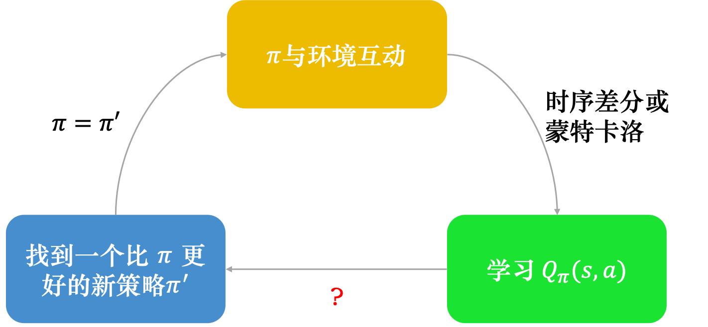

图 6.8 使用Q函数进行策略改进

这里要注意，给定状态 $s$ 和策略 $\pi$  并不一定会采取动作 $a$。给定某一个状态 $s$ 强制采取动作 $a$，用 $\pi$  继续交互得到的期望奖励，这才是Q函数的定义。所以在状态 $s$ 下不一定会采取动作 $a$。用 $\pi'$ 在状态 $s$ 采取动作 $a$ 与用 $\pi$ 采取的动作不一定是一样的，$\pi'$ 所采取的动作会让它得到比较大的奖励。所以 $\pi'$ 是用Q函数推出来的，没有另外一个网络决定 $\pi'$ 怎么与环境交互，有Q函数 就可以找出 $\pi'$。但是在这里要解决一个 arg max 操作的问题，如果 $a$ 是离散的，如$a$ 只有 3 个选项，将每个动作都代入Q函数，看哪个动作的 Q 值最大，这没有问题。但如果 $a$ 是连续的，我们要解决 arg max 操作问题，就不可行。

接下来讲一下为什么用 $Q_{\pi}(s,a)$ 决定的 $\pi'$ 一定会比 $\pi$ 好。假设有一个策略 $\pi'$，它是由 $Q_{\pi}$ 决定的。我们要证明对所有的状态 $s$ ，有$V_{\pi^{\prime}}(s) \geqslant V_{\pi}(s)$。

怎么证明呢？$V_{\pi}(s)$ 可写为
$$
    V_{\pi}(s)=Q_{\pi}(s, \pi(s))
$$

假设在状态 $s$ 下按照策略 $\pi$，会采取的动作就是 $\pi(s)$，我们算出来的 $Q_{\pi}(s, \pi(s))$ 会等于 $V_{\pi}(s)$。一般而言，$Q_{\pi}(s, \pi(s))$ 不一定等于 $V_{\pi}(s)$ ，因为动作不一定是 $\pi(s)$。但如果这个动作是 $\pi(s)$ ，$Q_{\pi}(s, \pi(s))$ 是等于 $V_{\pi}(s)$ 的。

$Q_{\pi}(s, \pi(s))$ 还满足如下的关系：
$$
    Q_{\pi}(s, \pi(s)) \leqslant \max _{a} Q_{\pi}(s, a)
$$

因为 $a$ 是所有动作里面可以让 Q 函数取最大值的那个动作，所以$Q_{\pi}(s, a)$一定大于等于 $Q_{\pi}(s, \pi(s))$。$Q_{\pi}(s, a)$ 中的 $a$ 就是 $\pi'(s)$，因为 $\pi'(s)$ 输出的 $a$ 可以让 $Q_\pi(s,a)$ 最大，所以我们可得
$$
    \max _{a} Q_{\pi}(s, a)=Q_{\pi}\left(s, \pi^{\prime}(s)\right)
$$
于是
$$
V_{\pi}(s) \leqslant Q_{\pi}\left(s, \pi^{\prime}(s)\right)
$$
也就是在某一个状态，如果我们按照策略 $\pi$ 一直执行下去，得到的奖励一定会小于等于在状态 $s$ 故意不按照 $\pi$ 所指示的方向，而是按照 $\pi'$ 的方向走一步得到的奖励。但只有第一步是按照 $\pi'$ 的方向走，只有在状态 $s$，才按照 $\pi'$ 的指示走，接下来我们就按照 $\pi$ 的指示走。虽然只有一步之差，但我们得到的奖励一定会比完全按照$\pi$ 得到的奖励要大。

接下来要证
$$
    Q_{\pi}\left(s, \pi^{\prime}(s) \right) \leqslant V_{\pi'}(s)
$$

也就是，只有一步之差，我们会得到比较大的奖励。但假设每步都是不一样的，每步都按照 $\pi'$ 而不是 $\pi$，得到的奖励一定会更大，即 $Q_{\pi}\left(s, \pi^{\prime}(s)\right)$是指我们在状态 $s_t$ 采取动作 $a_t$，得到奖励 $r_{t}$，进入状态 $s_{t+1}$，即

$$
    Q_{\pi}\left(s, \pi^{\prime}(s)\right)=\mathbb{E}\left[r_t+V_{\pi}\left(s_{t+1}\right) \mid s_{t}=s, a_{t}=\pi^{\prime}\left(s_{t}\right)\right]
$$

有的文献上也会说：在状态 $s_t$ 采取动作 $a_t$，得到奖励 $r_{t+1}$。但意思其实都是一样的。在状态 $s$ 按照 $\pi'$ 采取某一个动作 $a_t$ ，得到奖励 $r_{t}$，进入状态 $s_{t+1}$，$V_{\pi}\left(s_{t+1}\right)$ 是状态 $s_{t+1}$ 根据策略 $\pi$ 所估出来的值。因为在同样的状态采取同样的动作，我们得到的奖励和会进入的状态不一定一样， 所以需要取期望值。

因为 $V_{\pi}(s) \leqslant Q_{\pi}\left(s, \pi^{\prime}(s)\right)$，也就是 $V_{\pi}(s_{t+1}) \leqslant Q_{\pi}\left(s_{t+1}, \pi^{\prime}(s_{t+1})\right)$，所以我们可得
$$
    \begin{array}{l}
        \mathbb{E}\left[r_{t}+V_{\pi}\left(s_{t+1}\right) | s_{t}=s, a_{t}=\pi^{\prime}\left(s_{t}\right)\right] \\
        \leqslant \mathbb{E}\left[r_{t}+Q_{\pi}\left(s_{t+1}, \pi^{\prime}\left(s_{t+1}\right)\right) | s_{t}=s, a_{t}=\pi^{\prime}\left(s_{t}\right)\right]
        \end{array}
$$

因为 $Q_{\pi}\left(s_{t+1}, \pi^{\prime}\left(s_{t+1}\right)\right) = r_{t+1}+V_{\pi}\left(s_{t+2}\right)$，所以我们可得
$$
    \begin{array}{l}
        \mathbb{E}\left[r_{t}+Q_{\pi}\left(s_{t+1}, \pi^{\prime}\left(s_{t+1}\right)\right) | s_{t}=s, a_{t}=\pi^{\prime}\left(s_{t}\right)\right] \\
        =\mathbb{E}\left[r_{t}+r_{t+1}+V_{\pi}\left(s_{t+2}\right) | s_{t}=s, a_{t}=\pi^{\prime}\left(s_{t}\right)\right]
        \end{array} \tag{6.5}
$$

我们再把式(6.5)代入 $V_{\pi}(s) \leqslant Q_{\pi}\left(s, \pi^{\prime}(s)\right)$，一直算到回合结束，即
$$
    \begin{aligned}
        V^{\pi}(s) &\le Q^{\pi}(s,\pi'(s)) \\
        &=E\left[r_{t}+V^{\pi}\left(s_{t+1}\right) | s_{t}=s, a_{t}=\pi^{\prime}\left(s_{t}\right)\right]\\
        &\le E\left[r_{t}+Q^{\pi}\left(s_{t+1}, \pi^{\prime}\left(s_{t+1}\right)\right) | s_{t}=s, a_{t}=\pi^{\prime}\left(s_{t}\right)\right] \\
        &=E\left[r_{t}+r_{t+1}+V^{\pi}\left(s_{t+2}\right) |s_{t}=s, a_{t}=\pi^{\prime}\left(s_{t}\right)\right]  \\
        & \le E\left[r_{t}+r_{t+1}+Q^{\pi}\left(s_{t+2},\pi'(s_{t+2}\right) | s_{t}=s, a_{t}=\pi^{\prime}\left(s_{t}\right)\right] \\
        & = E\left[r_{t}+r_{t+1}+r_{t+2}+V^{\pi}\left(s_{t+3}\right) |s_{t}=s, a_{t}=\pi^{\prime}\left(s_{t}\right)\right] \\
        & \le \cdots\\
        & \le E\left[r_{t}+r_{t+1}+r_{t+2}+\cdots | s_{t}=s, a_{t}=\pi^{\prime}\left(s_{t}\right)\right]  \\
        & = V^{\pi'}(s)
        \end{aligned}
$$

因此
$$
    V_{\pi}(s)\leqslant V_{\pi'}(s)
$$

我们可以估计某一个策略的Q函数，接下来就可以找到另外一个策略 $\pi'$ 比原来的策略$\pi$还要更好。

## 6.3 目标网络 

接下来讲一些在 深度Q网络 里一定会用到的技巧。第一个技巧是**目标网络（target network）**。我们在学习Q函数的时候，也会用到时序差分方法的概念。我们现在收集到一个数据，比如在状态 $s_t$ 采取动作 $a_t$ 以后，得到奖励 $r_t$ ，进入状态 $s_{t+1}$。根据Q函数，我们可知
$$
Q_{\pi}\left(s_{t}, a_{t}\right) 
=r_{t}+Q_{\pi}\left(s_{t+1}, \pi\left(s_{t+1}\right)\right)
$$
所以我们在学习的时候，Q 函数输入 $s_t$、$a_t$ 得到的值，与输入 $s_{t+1}$、$\pi (s_{t+1})$ 得到的值之间，我们希望它们相差 $r_t$， 这与时序差分方法的概念是一样的。但是实际上这样的输入并不好学习，假设这是一个回归问题，如图 6.9 所示，$Q_{\pi}\left(s_{t}, a_{t}\right) $ 是网络的输出，$r_{t}+Q_{\pi}\left(s_{t+1}, \pi\left(s_{t+1}\right)\right)$ 是目标，目标是会变动的。当然如果我们要实现这样的训练，其实也没有问题，就是在做反向传播的时候， $Q_{\pi}$ 的参数会被更新，我们会把两个更新的结果加在一起（因为它们是同一个模型 $Q_{\pi}$， 所以两个更新的结果会加在一起）。但这样会导致训练变得不太稳定，因为假设我们把 $Q_{\pi}\left(s_{t}, a_{t}\right) $ 当作模型的输出， 把$r_{t}+Q_{\pi}\left(s_{t+1}, \pi\left(s_{t+1}\right)\right)$ 当作目标，我们要去拟合的目标是一直在变动的，这是不太好训练的。

所以我们会把其中一个 Q 网络，通常是把图 6.9 右边的 Q 网络固定住。在训练的时候，我们只更新左边的 Q 网络的参数，而右边的 Q 网络的参数会被固定。因为右边的 Q 网络负责产生目标，所以被称为目标网络。因为目标网络是固定的，所以现在得到的目标 $r_{t}+Q_{\pi}\left(s_{t+1}, \pi\left(s_{t+1}\right)\right)$ 的值也是固定的。我们只调整左边Q网络的参数，它就变成一个回归问题。我们希望模型输出的值与目标越接近越好，这样会最小化它的均方误差（mean square error）。

在实现的时候，我们会把左边的 Q 网络更新多次，再用更新过的 Q 网络替换目标网络。但这两个网络不要一起更新，一起更新，结果会很容易不好。一开始这两个网络是一样的，在训练的时候，我们会把右边的 Q 网络固定住，在做梯度下降的时候，只调整左边Q网络的参数。我们可能更新 100 次以后才把参数复制到右边的网络中，把右边网络的参数覆盖，目标值就变了。就好像我们本来在做一个回归问题，训练后把这个回归问题的损失降下去以后，接下来我们把左边网络的参数复制到右边网络，目标值就变了，接下来就要重新训练。

    

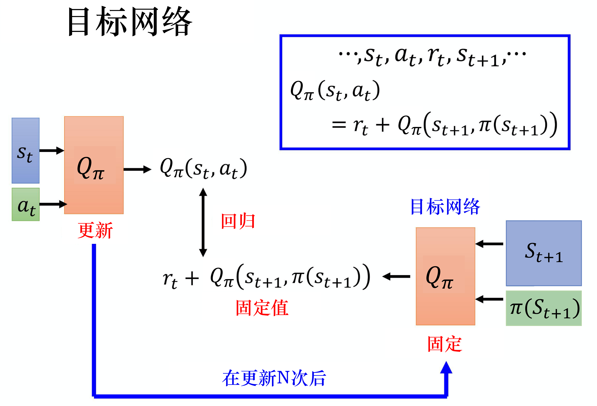

图 6.9 目标网络

如图 6.10a 所示，我们可以通过猫追老鼠的例子来直观地理解固定目标网络的目的。猫是 Q 估计，老鼠是 Q 目标。一开始，猫离老鼠很远，所以我们想让猫追上老鼠。如图 6.10b 所示，因为 Q 目标也是与模型参数相关的，所以每次优化后，Q 目标也会动。这就导致一个问题，猫和老鼠都在动。如图 6.10c 所示，猫和老鼠会在优化空间里面到处乱动，这会产生非常奇怪的优化轨迹，使得训练过程十分不稳定。所以我们可以固定 Q 网络，让老鼠动得不那么频繁，可能让它每 5 步动一次，猫则是每一步都在动。如果老鼠每 5 次动一步，猫就有足够的时间来接近老鼠，它们之间的距离会随着优化过程越来越小，最后它们就可以拟合，拟合后就可以得到一个最好的Q 网络。

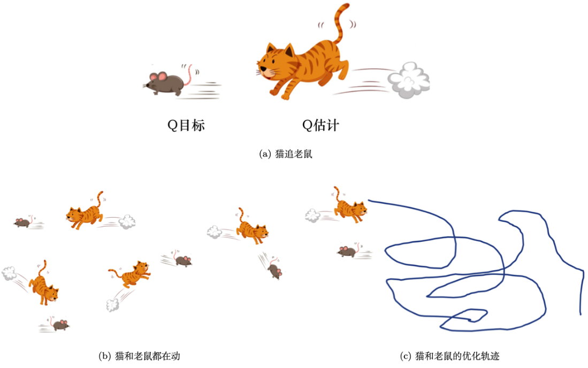

图 6.10 固定目标网络

## 6.4 探索 

第二个技巧是**探索**。当我们使用 Q 函数的时候，策略完全取决于 Q 函数。给定某一个状态，我们就穷举所有的动作，采取让Q值最大的动作，即
$$
    a=\underset{a}{\arg \max} Q(s, a)
$$
使用Q函数来决定动作与使用策略梯度不一样，策略梯度的输出是随机的，它会输出一个动作的分布，我们根据这个动作的分布去采样，所以在策略梯度里面，我们每次采取的动作是不一样的，是有随机性的。像Q函数中，如果我们采取的动作总是固定的，会遇到的问题就是这不是一个好的收集数据的方式。假设我们要估测某一个状态，可以采取动作 $a_{1}$、$a_{2}$、$a_{3}$。我们要估测在某一个状态采取某一个动作会得到的 Q 值，一定要在那一个状态采取过那一个动作，才能估测出它的值。如果没有在那个状态采取过那个动作，我们其实是估测不出它的值的。如果Q函数是一个网络，这个问题可能没有那么严重。但是一般而言，假设Q函数是一个表格，对于没有见过的状态-动作对，它是估不出值的。如果 Q 函数是网络，也会有类似的问题，只是没有那么严重。所以假设我们在某一个状态，动作 $a_{1}$、$a_{2}$、$a_{3}$ 都没有采取过，估出来的 $Q(s,a_{1})$、$Q(s,a_{2})$、$Q(s,a_{3})$ 的值可能都是一样的，都是一个初始值，比如 0，即
$$
    \begin{array}{l}
        Q(s, a_1)=0 \\
        Q(s, a_2)=0 \\
        Q(s, a_3)=0
        \end{array}
$$

但是如图 6.11 所示，假设我们在状态 $s$采取动作 $a_{2}$ ，它得到的值是正的奖励，$Q(s, a_2)$ 就会比其他动作的Q值要大。在采取动作的时候，谁的 Q 值 最大就采取谁，所以之后永远都只会采取 $a_{2}$，其他的动作就再也不会被采取了，这就会有问题。比如我们去一个餐厅吃饭。假设我们点了某一样菜，比如椒麻鸡，我们觉得还可以。接下来我们每次去就都会点椒麻鸡，再也不点别的菜了，那我们就不知道别的菜是不是会比椒麻鸡好吃，这是一样的问题。

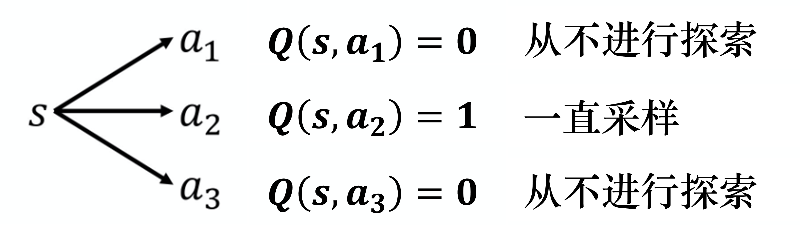

图 6.11 探索

如果我们没有好的探索，在训练的时候就会遇到这种问题。例如， 假设我们用 深度Q网络 来玩 slither.io 网页游戏。 我们有一条蛇，它在环境里面走来走去，吃到星星，就加分。假设游戏一开始，蛇往上走，然后吃到星星，就可以得到分数，它就知道往上走可以得到奖励。接下来它就再也不会采取往上走以外的动作了，以后就会变成每次游戏一开始，它就往上走，然后游戏结束。所以需要有探索的机制，让智能体知道，虽然根据之前采样的结果，$a_2$ 好像是不错的，但我们至少偶尔也试一下 $a_{1}$ 与 $a_{3}$，说不定它们更好。

这个问题就是**探索-利用窘境（exploration-exploitation dilemma）**问题，有两个方法可以解决这个问题：$\pmb{\varepsilon}$**-贪心**和**玻尔兹曼探索（Boltzmann exploration）**。

$\varepsilon$-贪心是指我们有 $1-\varepsilon$ 的概率会按照Q函数来决定动作，可写为
$$
    a=
    \begin{cases}
        \underset{a}{\arg \max} Q(s, a) & \text {, 有 } 1-\varepsilon \text { 的概率 } \\
        \text { 随机} & \text {, 否则 }  
    \end{cases}
$$

通常将 $\varepsilon$ 设为一个很小的值， $1-\varepsilon$ 可能是 0.9，也就是 0.9 的概率会按照Q函数来决定动作，但是我们有 0.1 的概率是随机的。通常在实现上 $\varepsilon$ 会随着时间递减。在最开始的时候，因为不知道哪个动作是比较好的，所以我们会花比较大的力气探索。接下来，随着训练的次数越来越多，我们已经比较确定哪个动作是比较好的。我们就会减少探索，会把 $\varepsilon$ 的值变小，主要根据Q函数来决定动作，比较少随机决定动作，这就是$\varepsilon$-贪心。

还有一个方法称为玻尔兹曼探索。在玻尔兹曼探索中，我们假设对于任意的 $s$、$a$，$Q(s,a) \geqslant 0$，因此 $a$ 被选中的概率与 $e^{Q(s, a) / T}$ 呈正比，即
$$
    \pi(a \mid s)=\frac{\mathrm{e}^{Q(s, a) / T}}{\sum_{a^{\prime} \in A} \mathrm{e}^{Q\left(s, a^{\prime}\right) / T}}
$$
其中，$T>0$ 称为温度系数。如果 $T$ 很大，所有动作几乎以等概率选择（探索）；如果 $T$ 很小，Q值大的动作更容易被选中（利用）；如果 $T$ 趋于0，我们就只选择最优动作。

## 6.5 经验回放 
第三个技巧是**经验回放（experience replay）**。如图 6.12 所示，经验回放会构建一个**回放缓冲区（replay buffer）**，回放缓冲区又被称为**回放内存（replay memory）**。回放缓冲区是指现在有某一个策略$\pi$ 与环境交互，它会去收集数据，我们把所有的数据放到一个数据缓冲区（buffer）里面，数据缓冲区里面存储了很多数据。比如数据缓冲区可以存储 5 万笔数据，每一笔数据就是记得说，我们之前在某一个状态 $s_t$，采取某一个动作 $a_t$，得到了奖励 $r_t$，进入状态 $s_{t+1}$。我们用 $\pi$ 去与环境交互多次，把收集到的数据放到回放缓冲区里面。
回放缓冲区里面的经验可能来自不同的策略，我们每次用 $\pi$ 与环境交互的时候，可能只交互 10000 次，接下来我们就更新 $\pi$ 了。但是回放缓冲区里面可以放 5 万笔数据，所以 5 万笔数据可能来自不同的策略。回放缓冲区只有在它装满的时候，才会把旧的数据丢掉。所以回放缓冲区里面其实装了很多不同的策略的经验。

图 6.12 经验回放

如图 6.13 所示，有了回放缓冲区以后，我们怎么训练 Q 模型、怎么估 Q 函数呢？我们会迭代地训练 Q 函数，在每次迭代里面，从回放缓冲区中随机挑一个批量（batch）出来，即与一般的网络训练一样，从训练集里面挑一个批量出来。我们采样该批量出来，里面有一些经验，我们根据这些经验去更新Q函数。这与时序差分学习要有一个目标网络是一样的。我们采样一个批量的数据，得到一些经验，再去更新 Q 函数。

如果某个算法使用了经验回放这个技巧，该算法就变成了一个异策略的算法。因为本来 Q 是要观察 $\pi$ 的经验的，但实际上存储在回放缓冲区里面的这些经验不是通通来自于 $\pi$，有些是过去其他的策略所留下来的经验。因为我们不会用某一个 $\pi$ 就把整个回放缓冲区装满，拿去测Q函数，$\pi$ 只是采样一些数据放到回放缓冲区里面，接下来就让 Q 去训练。所以 Q 在采样的时候， 它会采样到过去的一些数据。

图 6.13 使用回放缓冲区训练Q函数

这么做有两个好处。第一个好处是，在进行强化学习的时候， 往往最花时间的步骤是与环境交互，训练网络反而是比较快的。因为我们用 GPU 训练其实很快，真正花时间的往往是与环境交互。用回放缓冲区可以减少与环境交互的次数，因为在做训练的时候，经验不需要通通来自于某一个策略。一些过去的策略所得到的经验可以放在回放缓冲区里面被使用很多次，被反复的再利用，这样可以比较高效地采样经验。第二个好处是，在训练网络的时候，其实我们希望一个批量里面的数据越多样（diverse）越好。如果批量里面的数据都是同样性质的，我们训练下去，训练结果是容易不好的。如果批量里面都是一样的数据，训练的时候，性能会比较差。我们希望批量里的数据越多样越好。如果回放缓冲区里面的经验通通来自于不同的策略，我们采样到的一个批量里面的数据会是比较多样的。

Q：我们观察 $\pi$ 的值，发现里面混杂了一些不是 $\pi$ 的经验，这有没有关系？

A：没关系。这并不是因为过去的策略与现在的策略很像， 就算过去的策略与现在的策略不是很像，也是没有关系的。主要的原因是我们并不是去采样一个轨迹，我们只采样了一笔经验，所以与是不是异策略这件事是没有关系的。就算是异策略，就算是这些经验不是来自于 $\pi$，我们还是可以用这些经验来估测 $Q_{\pi}(s,a)$。

## 6.6 深度Q网络 

图 6.14 所示为一般的深度Q网络算法。深度Q网络 算法是这样的，我们初始化两个网络------$Q$ 和 $\hat{Q}$，$\hat{Q}$ 就等于 $Q$。一开始目标网络$\hat{Q}$与原来的 Q 网络是一样的。在每一个回合中，我们用演员与环境交互，在每一次交互的过程中，都会得到一个状态 $s_t$，会采取某一个动作 $a_t$。
怎么知道采取哪一个动作 $a_t$ 呢？我们就根据现在的Q函数，但是要有探索的机制。比如我们用玻尔兹曼探索或是$\varepsilon$-贪心探索，接下来得到奖励 $r_t$，进入状态 $s_{t+1}$。所以现在收集到一笔数据$(s_t$、$a_t$ 、$r_t$、$s_{t+1})$，我们将其放到回放缓冲区里面。如果回放缓冲区满了， 我们就把一些旧的数据丢掉。接下来我们就从回放缓冲区里面去采样数据，采样到的是 $(s_{i}$、$a_{i}$、$r_{i}$、$s_{i+1})$。这笔数据与刚放进去的不一定是同一笔，我们可能抽到旧的。要注意的是，我们采样出来不是一笔数据，采样出来的是一个批量的数据，采样一些经验出来。
接下来就是计算目标。假设我们采样出一笔数据，根据这笔数据去计算目标。目标要用目标网络 $\hat{Q}$ 来计算。目标是：
$$
    y=r_{i}+\max _{a} \hat{Q}\left(s_{i+1}, a\right)
$$
其中，$a$ 是让 $\hat{Q}$ 值最大的动作。因为我们在状态 $s_{i+1}$会采取的动作 $a$ 就是可以让 $\hat{Q}$值最大的那一个动作。接下来我们要更新 Q 值，就把它当作一个回归问题。我们希望 $Q(s_i,a_i)$  与目标越接近越好。假设已经更新了一定的次数，比如 $C$ 次，设 $C = 100$， 那我们就把 $\hat{Q}$ 设成 $Q$，这就是 深度Q网络 算法。

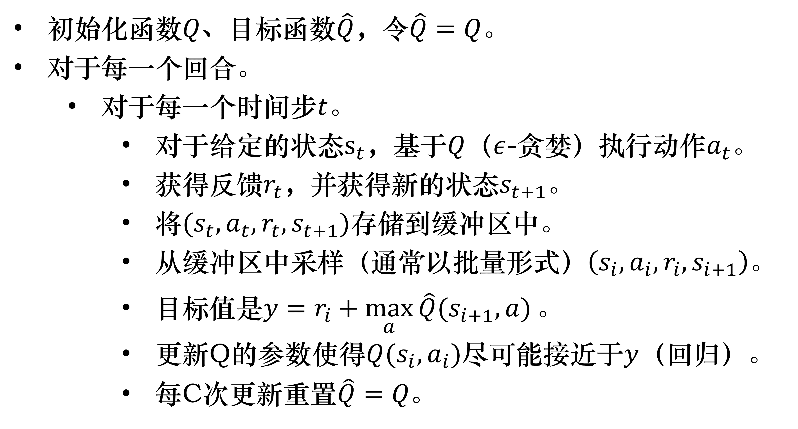

图 6.14 深度Q网络算法

    

Q：深度Q网络 和 Q学习 有什么不同？

A：整体来说，深度Q网络与Q学习的目标价值以及价值的更新方式都非常相似。主要的不同点在于：深度Q网络 将Q学习与深度学习结合，用深度网络来近似动作价值函数，而 Q学习 则是采用表格存储；深度Q网络采用了经验回放的训练方法，从历史数据中随机采样，而Q学习直接采用下一个状态的数据进行学习。

## 参考文献
* [Intro to Reinforcement Learning (强化学习纲要）](https://github.com/zhoubolei/introRL)
* [神经网络与深度学习](https://nndl.github.io/)
* [强化学习基础 David Silver 笔记](https://zhuanlan.zhihu.com/c_135909947)
* [百面深度学习](https://book.douban.com/subject/35043939/)
* [机器学习(北理工)](https://www.icourse163.org/course/BIT-1449601164)
* 苗光辉. 面向部分可观测环境的值迭代深度网络模型研究[D].北京理工大学,2018.
* [天授文档](https://tianshou.readthedocs.io/zh/latest/index.html)

