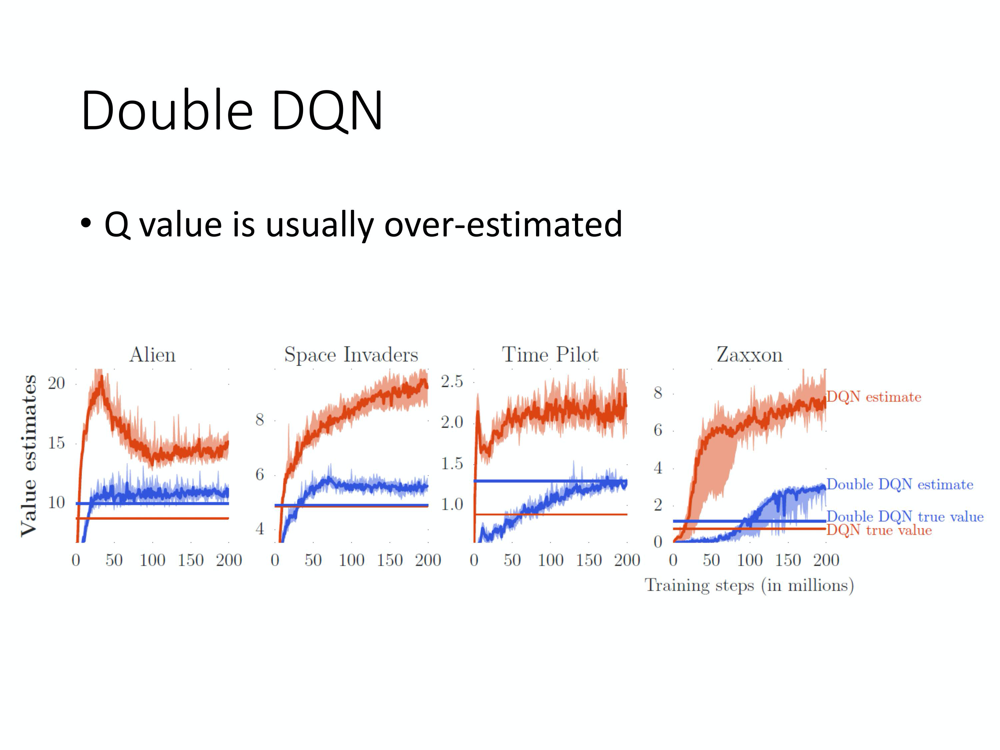
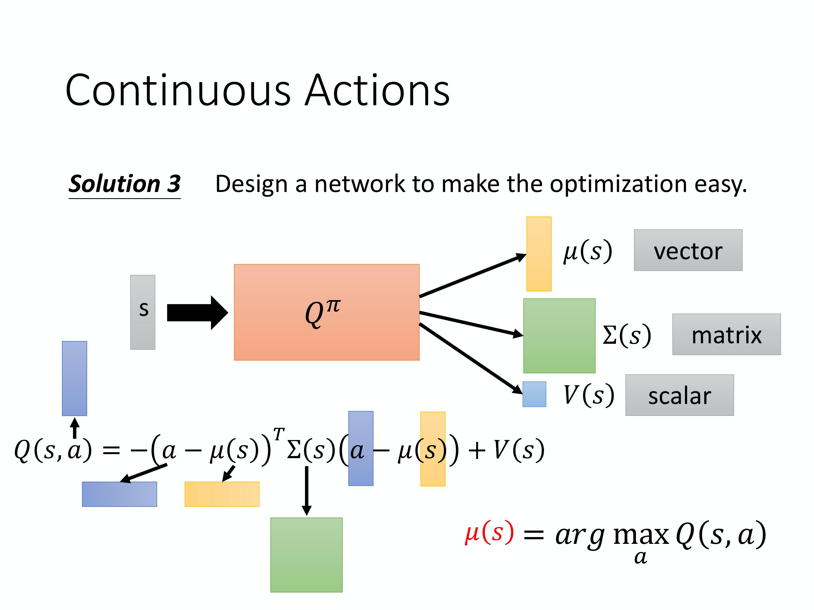
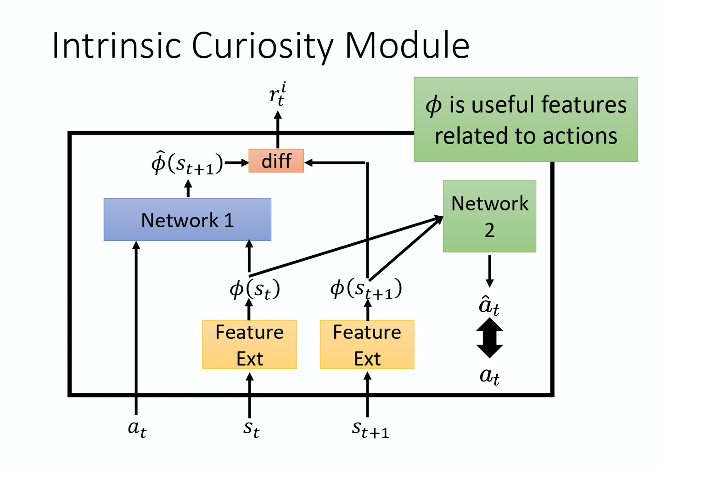
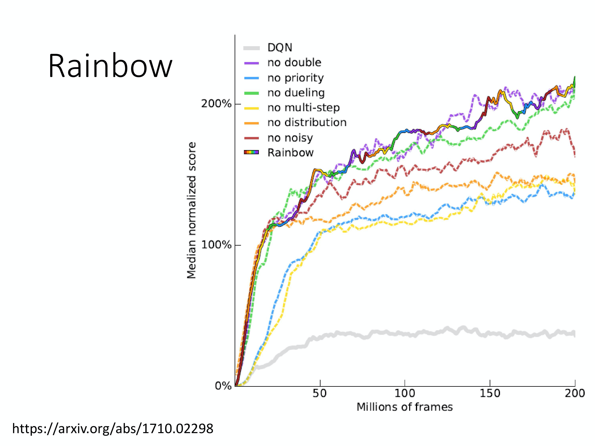

# Tips of Q-learning
## Double DQN

接下来要讲的是训练 Q-learning 的一些 tips。第一个 tip 是做 `Double DQN`。为什么要有 Double DQN 呢？因为在实现上，你会发现 Q 值往往是被高估的。上图来自于 Double DQN 的原始 paper，它想要显示的结果就是 Q 值往往是被高估的。

这边有 4 个不同的小游戏，横轴是训练的时间，红色锯齿状一直在变的线就是 Q-function 对不同的状态估计出来的平均 Q 值，有很多不同的状态，每个状态你都 sample 一下，然后算它们的 Q 值，把它们平均起来。

这条红色锯齿状的线在训练的过程中会改变，但它是不断上升的。因为 Q-function 是取决于你的策略的。学习的过程中你的策略越来越强，你得到的 Q 值会越来越大。在同一个状态， 你得到 reward 的期望会越来越大，所以一般而言，这个值都是上升的，但这是 Q-network 估测出来的值。

接下来你真地去算它，怎么真地去算？你有策略，然后真的去玩那个游戏，就玩很多次，玩个一百万次。然后就去真地算说，在某一个状态， 你会得到的 Q 值到底有多少。你会得到在某一个状态采取某一个动作。你接下来会得到累积奖励(accumulated reward)是多少。你会发现估测出来的值远比实际的值大，在每一个游戏都是这样，都大很多。所以今天要提出 Double DQN 的方法，它可以让估测的值跟实际的值是比较接近的。

我们先看它的结果，蓝色的锯齿状的线是 Double DQN 的 Q-network 所估测出来的 Q 值，蓝色的无锯齿状的线是真正的 Q 值，你会发现它们是比较接近的。 用网络估测出来的就不用管它，比较没有参考价值。用 Double DQN 得出来真正的累积奖励，在这 3 种情况下都是比原来的 DQN 高的，代表 Double DQN 学习出来的那个策略比较强。所以它实际上得到的 reward 是比较大的。虽然一般的 DQN 的 Q-network 高估了自己会得到的 reward，但实际上它得到的 reward 是比较低的。

Q: 为什么 Q 值总是被高估了呢？

A:因为实际上在做的时候，是要让左边这个式子跟右边这个目标越接近越好。你会发现目标的值很容易一不小心就被设得太高。因为在算这个目标的时候，我们实际上在做的事情是，看哪一个 a 可以得到最大的 Q 值，就把它加上去，就变成我们的目标。所以假设有某一个动作得到的值是被高估的。

举例来说， 现在有 4 个动作，本来它们得到的值都是差不多的，它们得到的 reward 都是差不多的。但是在估计的时候，网络是有误差的。

* 假设是第一个动作被高估了，假设绿色的东西代表是被高估的量，它被高估了，那这个目标就会选这个动作，然后就会选这个高估的 Q 值来加上 $r_t$，来当作你的目标。
* 如果第四个动作被高估了，那就会选第四个动作来加上 $r_t$ 来当作你的目标值。所以你总是会选那个 Q 值被高估的，你总是会选那个 reward 被高估的动作当作这个 max 的结果去加上 $r_t$ 当作你的目标，所以你的目标总是太大。

Q: 怎么解决目标值总是太大的问题呢？

A: 在 Double DQN 里面，选动作的 Q-function 跟算值的 Q-function 不是同一个。在原来的 DQN 里面，你穷举所有的 a，把每一个 a 都带进去， 看哪一个 a 可以给你的 Q 值最高，那你就把那个 Q 值加上 $r_t$。但是在 Double DQN 里面，你有两个 Q-network：

* 第一个 Q-network Q 决定哪一个动作的 Q 值最大（你把所有的 a 带入 Q 中，看看哪一个 Q 值最大）。
* 你决定你的动作以后，你的 Q 值是用 $Q'$ 算出来的。

假设我们有两个 Q-function，

* 假设第一个 Q-function 高估了它现在选出来的动作 a，只要第二个 Q-function $Q'$ 没有高估这个动作 a 的值，那你算出来的就还是正常的值。
* 假设 $Q'$ 高估了某一个动作的值，那也没差，因为只要前面这个 Q 不要选那个动作出来就没事了，这个就是 Double DQN 神奇的地方。

Q: 哪来 Q  跟 $Q'$ 呢？哪来两个网络呢？

A: 在实现上，你有两个 Q-network：目标的 Q-network 和你会更新的 Q-network。所以在 Double DQN 里面，你会拿你会更新参数的那个 Q-network 去选动作，然后你拿目标网络（固定住不动的网络）去算值。

Double DQN 相较于原来的 DQN 的更改是最少的，它几乎没有增加任何的运算量，连新的网络都不用，因为原来就有两个网络了。你唯一要做的事情只有，本来你在找 Q 值最大的 a 的时候，你是用 $Q'$ 来算，你是用目标网络来算，现在改成用另外一个会更新的 Q-network 来算。

假如你今天只选一个 tip 的话，正常人都是实现 Double DQN，因为很容易实现。

## Dueling DQN

第二个 tip 是 `Dueling DQN`。其实 Dueling DQN 也蛮好做的，相较于原来的 DQN，它唯一的差别是改了网络的架构。Q-network 就是输入状态，输出就是每一个动作的 Q 值。Dueling DQN 唯一做的事情是改了网络的架构，其它的算法都不需要动。

Q: Dueling DQN 是怎么改了网络的架构呢？

A: 本来的 DQN 就是直接输出 Q 值的值。现在这个 dueling 的 DQN，就是下面这个网络的架构。它不直接输出 Q 值的值，它分成两条路径去运算：

* 第一条路径会输出一个 scalar，这个 scalar 叫做 $V(s)$。因为它跟输入 s 是有关系，所以叫做 $V(s)$，$V(s)$ 是一个 scalar。
* 第二条路径会输出一个 vector，这个 vector 叫做 $A(s,a)$。下面这个 vector，它是每一个动作都有一个值。

你再把这两个东西加起来就可以得到你的 Q 值。

Q: 这么改有什么好处？

A : 那我们假设说，原来的 $Q(s,a)$ 就是一个表格。我们假设状态是离散的，实际上状态不是离散的。为了说明方便，我们假设就是只有 4 个不同的状态，只有 3 个不同的动作，所以 $Q(s,a)$  你可以看作是一个表格。

我们知道：
$$
Q(s,a) = V(s) + A(s,a)
$$

其中

* $V(s)$ 是对不同的状态 它都有一个值。 
* $A(s,a)$ 它是对不同的状态，不同的动作都有一个值。

你把这个 V 的值加到 A 的每一列就会得到 Q 的值。把 2+1，2+(-1)，2+0，就得到 3，1，2，以此类推。

如上图所示，假设说你在训练网络的时候，目标是希望这一个值变成 4，这一个值变成 0。但是你实际上能更改的并不是 Q 的值，你的网络更改的是 V 跟 A 的值。根据网络的参数，V 跟 A 的值输出以后，就直接把它们加起来，所以其实不是更动 Q 的值。

然后在学习网络的时候，假设你希望这边的值，这个 3 增加 1 变成 4，这个 -1 增加 1 变成 0。最后你在训练网络的时候，网络 可能会说，我们就不要动这个 A 的值，就动 V 的值，把 V 的值从 0 变成 1。把 0 变成 1 有什么好处呢？你会发现说，本来你只想动这两个东西的值，那你会发现说，这个第三个值也动了，-2 变成  -1。所以有可能说你在某一个状态，你明明只 sample 到这 2 个动作，你没 sample 到第三个动作，但是你其实也可以更改第三个动作的 Q 值。这样的好处就是你不需要把所有的 state-action pair 都 sample 过，你可以用比较高效的方式去估计 Q 值出来。因为有时候你更新的时候，不一定是更新下面这个表格。而是只更新了 $V(s)$，但更新 $V(s)$ 的时候，只要一改所有的值就会跟着改。这是一个比较有效率的方法，去使用你的数据，这个是 Dueling DQN 可以带给我们的好处。

那可是接下来有人就会问说会不会最后 学习出来的结果是说，反正 machine 就学到 V 永远都是 0，然后反正 A 就等于 Q，那你就没有得到任何 Dueling DQN 可以带给你的好处， 就变成跟原来的 DQN 一模一样。为了避免这个问题，实际上你要给 A 一些约束，让 更新 A 其实比较麻烦，让网络倾向于会想要去用 V 来解问题。

举例来说，你可以看原始的文献，它有不同的约束 。一个最直觉的约束是你必须要让这个 A 的每一列的和都是 0，所以看我这边举的例子，列的和都是 0。如果这边列的和都是 0，这边这个 V 的值，你就可以想成是上面 Q 的每一列的平均值。这个平均值，加上这些值才会变成是 Q 的 值。所以今天假设你发现说你在更新参数的时候，你是要让整个列一起被更新。你就不会想要更新这边，因为你不会想要更新 Ａ 这个矩阵。因为 A 这个矩阵的每一列的和都要是 0，所以你没有办法说，让这边的值，通通都 +1，这件事是做不到的。因为它的约束就是你的和永远都是要 0。所以不可以都 +1，这时候就会强迫网络去更新 V 的值，然后让你可以用比较有效率的方法，去使用你的数据。

实现时，你要给这个 A 一个约束。举个例子，假设你有 3 个动作，然后在这边输出的 vector 是 $[7,3,2]^{\mathrm{T}}$，你在把这个 A 跟这个 V  加起来之前，先加一个归一化(normalization)，就好像做那个层归一化( layer normalization)一样。加一个归一化，这个归一化做的事情就是把 7+3+2 加起来等于 12，12/3 = 4。然后把这边通通减掉 4，变成 3, -1, 2。再把 3, -1, 2 加上 1.0，得到最后的 Q 值。这个归一化的步骤就是网络的其中一部分，在训练的时候，你从这边也是一路 back propagate 回来的，只是归一化是没有参数的，它只是一个归一化的操作。把它可以放到网络里面，跟网络的其他部分 jointly trained，这样 A 就会有比较大的约束。这样网络就会给它一些好处，倾向于去更新 V 的值，这个是 Dueling DQN。

## Prioritized Experience Replay

有一个技巧叫做 `Prioritized Experience Replay`。Prioritized Experience Replay 是什么意思呢？

我们原来在 sample 数据去训练你的 Q-network 的时候，你是均匀地从 experience buffer 里面去 sample 数据。那这样不见得是最好的， 因为也许有一些数据比较重要。假设有一些数据，你之前有 sample 过。你发现这些数据的 TD error 特别大（TD error 就是网络的输出跟目标之间的差距），那这些数据代表说你在训练网络的时候， 你是比较训练不好的。那既然比较训练不好， 那你就应该给它比较大的概率被 sample 到，即给它 `priority`。这样在训练的时候才会多考虑那些训练不好的训练数据。实际上在做 prioritized experience replay 的时候，你不仅会更改 sampling 的 process，你还会因为更改了 sampling 的过程，更改更新参数的方法。所以 prioritized experience replay 不仅改变了 sample 数据的分布，还改变了训练过程。
## Balance between MC and TD

**另外一个可以做的方法是 balance MC 跟 TD。**MC 跟 TD 的方法各自有各自的优劣，怎么在 MC 跟 TD 里面取得一个平衡呢？我们的做法是这样，在 TD 里面，在某一个状态 $s_t$ 采取某一个动作$a_t$ 得到 reward $r_t$，接下来跳到那一个状态 $s_{t+1}$。但是我们可以不要只存一个步骤的数据，我们存 N 个步骤的数据。

我们记录在 $s_t$ 采取 $a_t$，得到 $r_t$，会跳到什么样 $s_t$。一直纪录到在第 N 个步骤以后，在 $s_{t+N}$采取 $a_{t+N}$ 得到 reward $r_{t+N}$，跳到 $s_{t+N+1}$ 的这个经验，通通把它存下来。实际上你今天在做更新的时候， 在做 Q-network learning 的时候，你的 learning 的方法会是这样，你 learning 的时候，要让 $Q(s_t,a_t)$ 跟你的目标值越接近越好。$\hat{Q}$ 所计算的不是 $s_{t+1}$，而是 $s_{t+N+1}$的。你会把 N 个步骤以后的状态 丢进来，去计算 N 个步骤以后，你会得到的 reward。要算目标值的话，要再加上多步(multi-step) 的 reward $\sum_{t^{\prime}=t}^{t+N} r_{t^{\prime}}$ ，多步的 reward 是从时间 t 一直到 t+N 的 N 个 reward 的和。然后希望你的 $Q(s_t,a_t)$ 和目标值越接近越好。

你会发现说这个方法就是 MC 跟 TD 的结合。因此它就有 MC 的好处跟坏处，也有 TD 的好处跟坏处。如果看它的这个好处的话，因为我们现在 sample 了比较多的步骤，之前是只 sample 了一个步骤， 所以某一个步骤得到的数据是 real 的，接下来都是 Q 值估测出来的。现在 sample 比较多步骤，sample N 个步骤才估测值，所以估测的部分所造成的影响就会比小。当然它的坏处就跟 MC 的坏处一样，因为你的 r 比较多项，你把 N 项的 r 加起来，方差就会比较大。但是你可以去调这个 N 的值，去在 方差 跟不精确的 Q 之间取得一个平衡。N 就是一个 hyperparameter，你要调这个 N 到底是多少，你是要多 sample 三步，还是多 sample 五步。

## Noisy Net

我们还可以改进探索。Epsilon Greedy 这样的探索是在动作的空间上面加噪声，**但是有一个更好的方法叫做`Noisy Net`，它是在参数的空间上面加噪声。**

Noisy Net 的意思是说，每一次在一个 episode 开始的时候，在你要跟环境互动的时候，你就把你的 Q-function 拿出来，Q-function 里面其实就是一个网络，就变成你把那个网络拿出来，在网络的每一个参数上面加上一个高斯噪声(Gaussian noise)，那你就把原来的 Q-function 变成 $\tilde{Q}$ 。因为 $\hat{Q}$ 已经用过，$\hat{Q}$ 是那个目标网络，我们用 $\tilde{Q}$  来代表一个 `Noisy Q-function`。我们把每一个参数都加上一个高斯噪声，就得到一个新的网络叫做 $\tilde{Q}$。

这边要注意在每个 episode 开始的时候，开始跟环境互动之前，我们就 sample 网络。接下来你就会用这个固定住的 noisy网络去玩这个游戏，直到游戏结束，你才重新再去 sample 新的噪声。OpenAI  跟 DeepMind 又在同时间提出了一模一样的方法，通通都发表在 ICLR 2018，两篇 paper 的方法就是一样的。不一样的地方是，他们用不同的方法，去加噪声。OpenAI 加的方法好像比较简单，他就直接加一个高斯噪声就结束了，就你把每一个参数，每一个 weight 都加一个高斯噪声就结束了。DeepMind 做比较复杂，他们的噪声是由一组参数控制的，也就是说网络可以自己决定说它那个噪声要加多大，但是概念就是一样的。总之就是把你的 Q-function 的里面的那个网络加上一些噪声，把它变得有点不一样，跟原来的 Q-function 不一样，然后拿去跟环境做互动。两篇 paper 里面都有强调说，你这个参数虽然会加噪声，但在同一个 episode 里面你的参数就是固定的，你是在换 episode， 玩第二场新的游戏的时候，你才会重新 sample 噪声，在同一场游戏里面就是同一个 noisy Q-network 在玩那一场游戏，这件事非常重要。为什么这件事非常重要呢？因为这是导致了 Noisy Net 跟原来的 Epsilon Greedy 或其它在动作做 sample 方法的本质上的差异。

有什么样本质上的差异呢？在原来 sample 的方法，比如说 Epsilon Greedy 里面，就算是给同样的状态，你的 agent 采取的动作也不一定是一样的。因为你是用 sample 决定的，给定同一个状态，要根据 Q-function 的网络，你会得到一个动作，你 sample 到 random，你会采取另外一个 动作。所以给定同样的状态，如果你今天是用 Epsilon Greedy 的方法，它得到的动作是不一样的。但实际上你的策略并不是这样运作的啊。在一个真实世界的策略，给同样的状态，他应该会有同样的回应。而不是给同样的状态，它其实有时候吃 Q-function，然后有时候又是随机的，所以这是一个不正常的动作，是在真实的情况下不会出现的动作。但是如果你是在 Q-function 上面去加噪声的话， 就不会有这个情形。因为如果你今天在 Q-function 上加噪声，在 Q-function 的网络的参数上加噪声，那在整个互动的过程中，在同一个 episode 里面，它的网络的参数总是固定的，所以看到同样的状态，或是相似的状态，就会采取同样的动作，那这个是比较正常的。在 paper 里面有说，这个叫做 `state-dependent exploration`，也就是说你虽然会做探索这件事， 但是你的探索是跟状态有关系的，看到同样的状态， 你就会采取同样的探索的方式，而 noisy 的动作只是随机乱试。但如果你是在参数下加噪声，那在同一个 episode 里面，里面你的参数是固定的。那你就是有系统地在尝试，每次会试说，在某一个状态，我都向左试试看。然后再下一次在玩这个同样游戏的时候，看到同样的状态，你就说我再向右试试看，你是有系统地在探索这个环境。

## Distributional Q-function

还有一个技巧叫做 `Distributional Q-function`。我们不讲它的细节，只告诉你大致的概念。Distributional Q-function 还蛮有道理的， 但是它没有红起来。你就发现说没有太多人真的在实现的时候用这个技术，可能一个原因就是它不好实现。Q-function 是累积奖励的期望值，所以我们算出来的这个 Q 值其实是一个期望值。因为环境是有随机性的，在某一个状态 采取某一个动作的时候，我们把所有的 reward 玩到游戏结束的时候所有的 reward 进行一个统计，你其实得到的是一个分布。也许在 reward 得到 0 的机率很高，在 -10 的概率比较低，在 +10 的概率比较低，但是它是一个分布。我们对这一个分布算它的平均值才是这个 Q 值，我们算出来是累积奖励的期望。所以累积奖励是一个分布，对它取期望，对它取平均值，你得到了 Q 值。但不同的分布，它们其实可以有同样的平均值。也许真正的分布是右边的分布，它算出来的平均值跟左边的分布 算出来的平均值 其实是一样的，但它们背后所代表的分布其实是不一样的。假设我们只用 Q 值的期望来代表整个 reward 的话，其实可能会丢失一些信息，你没有办法 model reward 的分布。

Distributional Q-function 它想要做的事情是对分布(distribution)建模，怎么做呢？在原来的 Q-function 里面，假设你只能够采取 $a_1$, $a_2$, $a_3$ 3 个动作，那你就是输入一个状态，输出 3 个值。3 个值分别代表 3 个动作的 Q 值，但是这个 Q 值是一个分布的期望值。所以 Distributional Q-function 的想法就是何不直接输出那个分布。但是要直接输出一个分布也不知道怎么做。

实际上的做法是说， 假设分布的值就分布在某一个 range 里面，比如说 -10 到 10，那把 -10 到 10 中间拆成一个一个的 bin，拆成一个一个的长条图。举例来说，在这个例子里面，每一个动作的 reward 的空间就拆成 5 个 bin。假设 reward 可以拆成 5 个 bin 的话，今天你的 Q-function 的输出是要预测说，你在某一个状态，采取某一个动作，你得到的 reward，落在某一个 bin 里面的概率。

所以其实这边的概率的和，这些绿色的 bar 的和应该是 1，它的高度代表说，在某一个状态 采取某一个动作的时候，它落在某一个 bin 的机率。这边绿色的代表动作 1，红色的代表动作 2，蓝色的代表动作 3。所以今天你就可以真的用 Q-function 去估计 $a_1$ 的分布，$a_2$ 的分布，$a_3$ 的分布。那实际上在做测试的时候， 我们还是要选某一个动作去执行，那选哪一个动作呢？实际上在做的时候，还是选这个平均值最大的那个动作去执行。

但假设我们可以对 distribution 建模的话，除了选平均值最大的以外，也许在未来你可以有更多其他的运用。举例来说，你可以考虑它的分布长什么样子。如果分布方差很大，代表说采取这个动作虽然平均值可能平均而言很不错，但也许风险很高，你可以训练一个网络它是可以规避风险的。就在 2 个动作平均值都差不多的情况下，也许可以选一个风险比较小的动作来执行，这是 Distributional Q-function 的好处。关于怎么训练这样的 Q-network 的细节，我们就不讲，你只要记得说  Q-network 有办法输出一个分布就对了。我们可以不只是估测得到的期望 reward 平均值的值。我们其实是可以估测一个分布的。

## Rainbow

**最后一个技巧叫做 rainbow，把刚才所有的方法都综合起来就变成 rainbow 。**因为刚才每一个方法，就是有一种自己的颜色，把所有的颜色通通都合起来，就变成 rainbow，它把原来的 DQN 也算是一种方法，故有 7 色。

那我们来看看这些不同的方法。横轴是训练过程，纵轴是玩了 10 几个 Atari 小游戏的平均的分数的和，但它取的是中位数的分数，为什么是取中位数不是直接取平均呢？因为它说每一个小游戏的分数，其实差很多。如果你取平均的话，到时候某几个游戏就控制了你的结果，所以它取中位数的值。

如果你是一般的 DQN，就灰色这一条线，就没有很强。那如果是你换 Noisy DQN，就强很多。如果这边每一个单一颜色的线是代表说只用某一个方法，那紫色这一条线是 DDQN(Double DQN)，DDQN 还蛮有效的。然后 Prioritized DDQN、Dueling DDQN 和 Distributional DQN 都蛮强的，它们都差不多很强的。A3C 其实是 Actor-Critic 的方法。单纯的 A3C 看起来是比 DQN 强的。这边怎么没有多步的方法，多步的方法就是平衡 TD 跟 MC，我猜是因为 A3C 本身内部就有做多步的方法，所以他可能觉得说有实现 A3C 就算是有实现多步的方法。所以可以把这个 A3C 的结果想成是多步方法的结果。其实这些方法他们本身之间是没有冲突的，所以全部都用上去就变成七彩的一个方法，就叫做 rainbow，然后它很高。

上图是说，在 rainbow 这个方法里面， 如果我们每次拿掉其中一个技术，到底差多少。因为现在是把所有的方法都加在一起，发现说进步很多，但会不会有些方法其实是没用的。所以看看说， 每一个方法哪些方法特别有用，哪些方法特别没用。这边的虚线就是拿掉某一种方法以后的结果，你会发现说，黄色的虚线，拿掉多步掉很多。Rainbow 是彩色这一条，拿掉多步会掉下来。拿掉 Prioritized  Experience Replay 后也马上就掉下来。拿掉分布，它也掉下来。

这边有一个有趣的地方是说，在开始的时候，分布的训练的方法跟其他方法速度差不多。但是如果你拿掉分布的时候，你的训练不会变慢，但是性能(performance)最后会收敛在比较差的地方。拿掉 Noisy Net 后性能也是差一点。拿掉 Dueling 也是差一点。拿掉 Double 没什么差，所以看来全部合在一起的时候，Double 是比较没有影响的。其实在 paper 里面有给一个 make sense 的解释，其实当你有用 Distributional DQN 的时候，本质上就不会高估你的 reward。我们是为了避免高估 reward 才加了 Double DQN。那在 paper 里面有讲说，如果有做 Distributional DQN，就比较不会有高估的结果。 事实上他有真的算了一下发现说，其实多数的状况是低估 reward 的，所以变成 Double DQN 没有用。

为什么做 Distributional DQN，不会高估 reward，反而会低估 reward 呢？因为这个 Distributional DQN 的输出的是一个分布的范围，输出的范围不可能是无限宽的，你一定是设一个范围， 比如说最大输出范围就是从 -10 到 10。假设今天得到的 reward 超过 10 怎么办？是 100 怎么办，就当作没看到这件事。所以 reward 很极端的值，很大的值其实是会被丢掉的， 所以用 Distributional DQN 的时候，你不会有高估的现象，反而会低估。