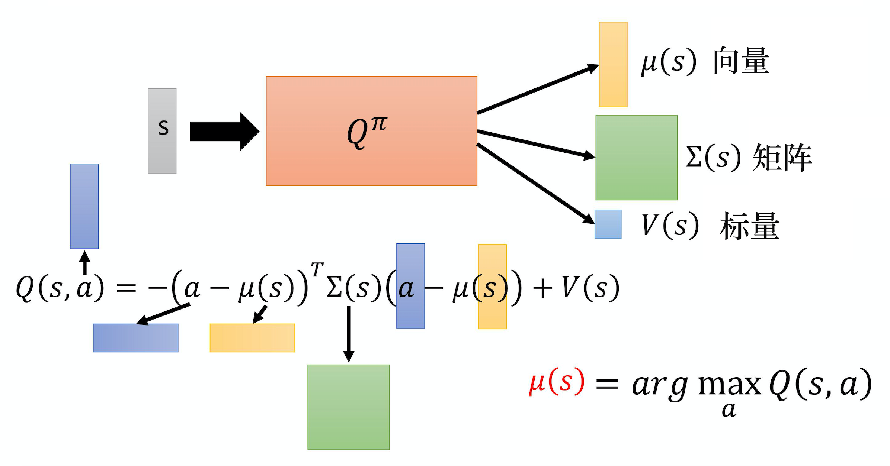
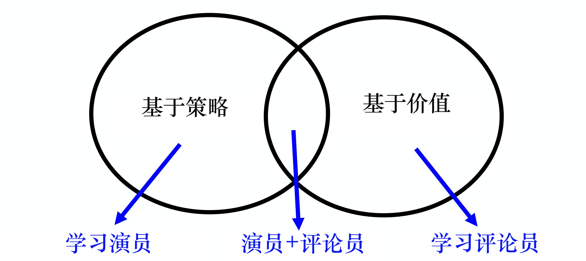

# 针对连续动作的 DQN

## 方案 1 & 方案 2
跟基于策略梯度的方法比起来，DQN 是比较稳的。策略梯度是没有太多游戏是玩得起来的，策略梯度比较不稳，在没有 近端策略优化 之前，我们很难用策略梯度做什么事情。DQN 相对而言是比较稳的。最早 DeepMind 的论文拿深度强化学习来玩雅达利的游戏，用的就是 DQN。DQN 比较容易训练的一个理由是：在 DQN 里面，你只要能够估计出Q函数，就保证你一定可以找到一个比较好的策略。也就是你只要能够估计出Q函数，就保证你可以改进策略。而估计Q函数这件事情，是比较容易的，因为它就是一个回归问题。在回归问题里面， 你可以轻易地知道模型学习得是不是越来越好，只要看那个回归的损失有没有下降，你就知道说模型学习得好不好，所以估计Q函数相较于学习一个策略是比较容易的。你只要估计Q函数，就可以保证说现在一定会得到比较好的策略。所以一般而言 DQN 比较容易操作。

DQN 其实存在一些问题，最大的问题是它不太容易处理连续动作。很多时候动作是连续的，比如我们玩雅达利的游戏，智能体只需要决定比如说上下左右，这种动作是离散的。那很多时候动作是连续的。举例来说假设智能体要做的事情是开自驾车，它要决定说它方向盘要左转几度， 右转几度，这是连续的。假设智能体是一个机器人，它身上有 50 个 关节，它的每一个动作就对应到它身上的这 50 个关节的角度。而那些角度也是连续的。所以很多时候动作并不是一个离散的东西，它是一个向量。在这个向量里面，它的每一个维度都有一个对应的值，都是实数，它是连续的。假设动作是连续的，做 DQN 就会有困难。因为在做 DQN 里面一个很重要的一步是你要能够解这个优化问题。估计出 Q函数$Q(s,a)$ 以后，必须要找到一个 $a$，它可以让 $Q(s,a)$ 最大，如下式所示。

$$
  a=\arg \max _{a} Q(s, a)
$$

假设$a$是离散的，即$a$的可能性都是有限的。举例来说，雅达利的小游戏里面，$a$ 就是上下左右跟开火，它是有限的，我们可以把每一个可能的动作都带到 Q 里面算它的 Q 值。但假如$a$是连续的，你无法穷举所有可能的连续动作，试试看哪一个连续动作可以让 Q 的值最大。

怎么解这个问题呢？就有各种不同的方案。

第一个方案是假设你不知道怎么解这个问题，因为$a$是没有办法穷举的，怎么办？我们可以采样出 $N$ 个可能的 $a$：$\left\{a_{1}, a_{2}, \cdots, a_{N}\right\}$ ，一个一个带到 Q函数里面，看谁最大。这个方法其实也不会太不高效， 因为你在运算的时候会使用 GPU，一次会把 $N$ 个连续动作都丢到 Q函数里面，一次得到 $N$ 个 Q 值，然后看谁最大。当然这不是一个非常精确的做法，因为你没有办法做太多的采样， 所以你估计出来的 Q 值，最后决定的动作可能不是非常的精确，这是第一个方案。

第二个方案是什么呢？既然要解的是一个优化问题（optimization problem），其实是要最大化目标函数（objective function），要最大化一个东西， 就可以用梯度上升。我们就把$a$当作是参数，然后要找一组$a$去最大化Q函数，就用梯度上升去更新 $a$ 的值，最后看看能不能找到一个$a$去最大化Q函数，也就是目标函数。当然这样子你会遇到全局最大值（global maximum）的问题， 就不见得能够真的找到最优的结果，而且这个运算量显然很大， 因为你要迭代地更新 $a$。我们训练一个网络就很花时间了。如果你用梯度上升的方法来处理连续的问题， 等于是你每次要决定采取哪一个动作的时候，都还要做一次训练网络的过程，显然运算量是很大的。这是第二个方案。

## 方案 3：设计网络

第三个方案是特别设计一个网络的架构，特别设计Q函数，使得解 arg max 的问题变得非常容易。也就是这边的Q函数不是一个一般的Q函数，特别设计一下它的样子，让你要找让这个Q函数最大的 $a$ 的时候非常容易。

下图是一个例子，这边有Q函数，这个Q函数的做法是这样。
  通常输入状态 $s$ 就是一个图像，可以用一个向量或一个矩阵来表示。
  输入 $s$，Q函数会输出 3 个东西。它会输出 $\mu(s)$，这是一个向量。它会输出 $\Sigma(s)$ ，这是一个矩阵。它会输出 $V(s)$，这是一个标量。
  输出这 3 个东西以后，我们知道Q函数其实是吃一个$s$跟 $a$，然后决定一个值。Q函数意思是说在某一个状态，采取某一个动作的时候，你期望的奖励有多大。到目前为止这个Q函数只吃 $s$，它还没有吃$a$进来，$a$ 在哪里呢？当这个Q函数吐出 $\mu$、 $\Sigma$ 跟 $V$ 的时候，我们才把$a$引入，用$a$跟 $\mu(s)、\Sigma(s)、V$  互相作用一下，你才算出最终的 Q 值。

 $a$怎么和这 3 个东西互相作用呢？实际上 $Q(s,a)$，Q函数的运作方式是先输入 $s$，让你得到 $\mu,\Sigma$ 跟 $V$。然后再输入 $a$，然后接下来把$a$跟 $\mu$ 相减。注意一下$a$现在是连续的动作，所以它也是一个向量。假设你现在是要操作机器人的话，这个向量的每一个维度，可能就对应到机器人的某一个关节，它的数值就是关节的角度，所以$a$是一个向量。把向量 $a$ 减掉向量 $\mu$，取转置，所以它是一个横的向量。$\Sigma$ 是一个矩阵。然后$a$减掉 $\mu(s)$ ，$a$ 和 $\mu(s)$ 都是向量，减掉以后还是一个竖的向量。所以 $-(a-\mu(s))^{T} \Sigma(s)(a-\mu(s))+V(s)$ 是一个标量，这个数值就是 Q 值 $Q(s,a)$。

  假设 $Q(s,a)$ 定义成这个样子，我们要怎么找到一个$a$去最大化这个 Q 值呢？这个方案非常简单。因为 $(a-\mu(s))^{T} \Sigma(s)(a-\mu(s))$ 一定是正的，它前面乘上一个负号，所以第一项就假设我们不看这个负号的话，第一项的值越小，最终的 Q 值就越大。因为我们是把 $V(s)$ 减掉第一项，所以第一项的值越小，最后的 Q 值就越大。怎么让第一项的值最小呢？你直接把$a$代入 $\mu$ 的值，让它变成 0，就会让第一项的值最小。

  $\Sigma$ 一定是正定的。因为这个东西就像是高斯分布（Gaussian distribution），所以 $\mu$ 就是高斯分布的均值，$\Sigma$ 就是高斯分布的方差。但方差是一个正定（positive definite）的矩阵，怎么样让这个 $\Sigma$ 一定是正定的矩阵呢？其实在 $Q^{\pi}$ 里面，它不是直接输出 $\Sigma$，如果直接输出 一个 $\Sigma$， 它不一定是正定的矩阵。它其实是输出 一个矩阵，然后再把那个矩阵跟另外一个矩阵做转置相乘， 然后可以确保 $\Sigma$ 是正定的。这边要强调的点就是说，实际上它不是直接输出一个矩阵。你再去那个论文里面查看一下它的技巧，它可以保证说 $\Sigma$ 是正定的。

  你把$a$代入 $\mu(s)$ 以后，你可以让 Q 的值最大。所以假设要你 arg max Q 函数，如下式所示。
$$
\mu(s)=\arg \max _{a} Q(s, a)
$$

虽然一般而言，若 Q 是一个一般的函数， 你很难算，但是我们这边设计了 Q 这个函数，$a$ 只要设 $\mu(s)$，我们就得到最大值。你在解这个 arg max 的问题的时候就变得非常容易。所以 DQN 也可以用在连续的情况，只是有一些局限，就是函数不能够随便乱设，它必须有一些限制。

##  方案 4：不使用DQN
第 4 招就是不要用 DQN。用 DQN 处理连续动作还是比较麻烦。
基于策略的方法 PPO 和基于价值的方法 DQN，这两者其实是可以结合在一起的，如下图所示，也就是演员-评论员的方法。

