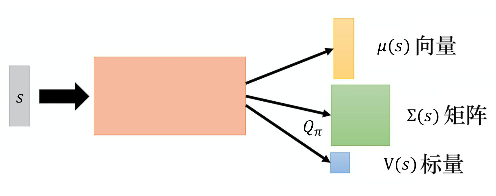

# 第8章 针对连续动作的深度Q网络

与基于策略梯度的方法相比，深度Q网络比较稳定，策略梯度比较不稳定，玩大部分游戏不能使用策略梯度。

在没有近端策略优化之前，我们很难用策略梯度做什么事情。最早 DeepMind 的论文拿深度强化学习来玩雅达利的游戏，用的就是深度Q网络。深度Q网络比较容易训练的一个原因是：在深度Q网络里面，我们只要能够估计出Q函数，就保证一定可以找到一个比较好的策略。也就是我们只要能够估计出Q函数，就保证可以改进策略。而估计Q函数是比较容易的，因为它就是一个回归问题。在回归问题里面，我们可以通过观察回归的损失有没有下降，就可以知道模型学习得好不好，所以估计Q函数相较于学习一个策略是比较容易的。我们只要估计Q函数，就可以保证现在一定会得到比较好的策略，所以一般而言深度Q网络比较容易操作。

但深度Q网络其实存在一些问题，最大的问题是它很难处理连续动作。很多时候动作是连续的，比如我们玩雅达利的游戏时，智能体只需要决定如上、下、左、右这4个动作，这种动作是离散的。很多时候动作是连续的，例如，假设智能体要开车，它要决定方向盘要左转几度、右转几度，这种动作就是连续的。假设智能体是一个机器人，身上有 50 个 关节，它的每一个动作就对应身上 50 个关节的角度，而这些角度也是连续的。所以很多时候动作并不是离散的，它是一个向量，这个向量的每一个维度都有一个对应的值，这些值都是实数，它是连续的。如果动作是连续的，我们使用深度Q网络就会有困难。因为在使用深度Q网络时很重要的一步是我们要能够解决优化问题，也就是估计出 Q函数$Q(s,a)$ 以后，我们必须要找到一个 $a$，它可以让 $Q(s,a)$ 最大，即

$$
  a=\underset{a}{\arg \max} Q(s, a)
$$

假设$a$是离散的，即$a$的可能性是有限的。例如，在雅达利的小游戏里面，$a$ 就是上、下、左、右与开火，它是有限的，我们可以把每一个可能的动作都代入 Q 里面算它的 Q 值。但假如$a$是连续的，我们无法穷举所有可能的连续动作，试试看哪一个连续动作可以让 Q 值最大。

怎么解决这个问题呢？我们有多种不同的方案，下面一一介绍。
## 8.1 方案 1：对动作进行采样
第1个方案是什么呢？我们可以采样出 $N$ 个可能的 $a$：$\left\{a_{1}, a_{2}, \cdots, a_{N}\right\}$ ，把它们一个一个地代入 Q函数，看谁的Q值最大。这个方案不会太低效，因为我们在运算的时候会使用 GPU，一次把 $N$ 个连续动作都代入 Q函数，一次得到 $N$ 个 Q 值，看谁最大。当然这不是一个非常精确的方案，因为我们没有办法进行太多的采样， 所以估计出来的 Q 值、最后决定的动作可能不是非常精确。
## 8.2 方案 2：梯度上升
第2个方案是什么呢？既然要解决的是一个优化问题（optimization problem），我们就要最大化目标函数（objective function）。要最大化目标函数， 我们就可以用梯度上升。我们把$a$当作参数，要找一组$a$去最大化Q函数，就用梯度上升去更新 $a$ 的值，最后看看能不能找到一个$a$最大化Q函数（目标函数）。但我们会遇到全局最大值（global maximum）的问题，不一定能够找到最优的结果，而且运算量显然很大， 因为要迭代地更新 $a$，训练一个网络就很花时间了。如果我们使用梯度上升的方案来处理连续的问题，每次决定采取哪一个动作的时候，还要训练一次网络，显然运算量是很大的。

## 8.3 方案 3：设计网络架构 
第3个方案是特别设计网络的架构，特别设计Q函数来使得解决 arg max 操作的问题变得非常容易。

如图 8.1 所示，通常输入状态 $\boldsymbol{s}$ 是图像，我们可以用向量或矩阵来表示它。输入 $\boldsymbol{s}$，Q函数会输出向量$\pmb{\mu}(\boldsymbol{s})$、矩阵$\pmb{\varSigma}(\boldsymbol{s})$ 和标量 $V(\boldsymbol{s})$。Q函数根据输入$\boldsymbol{s}$与 $\boldsymbol{a}$ 来决定输出值。到目前为止，Q函数只有输入 $\boldsymbol{s}$，它还没有输入$\boldsymbol{a}$，$\boldsymbol{a}$ 在哪里呢？接下来我们可以输入 $\boldsymbol{a}$，用$\boldsymbol{a}$与 $\pmb{\mu}(\boldsymbol{s})$、$\pmb{\varSigma}(\boldsymbol{s})$和$V(\boldsymbol{s})$ 互相作用。Q函数$Q(\boldsymbol{s},\boldsymbol{a})$可定义为
$$
  Q(\boldsymbol{s},\boldsymbol{a})=-(\boldsymbol{a}-\pmb{\mu}(\boldsymbol{s}))^{\mathrm{T}} \pmb{\varSigma}(\boldsymbol{s})(\boldsymbol{a}-\pmb{\mu}(\boldsymbol{s}))+V(\boldsymbol{s})
$$

注意，$\boldsymbol{a}$现在是连续的动作，所以它是一个向量。假设我们要操作机器人，向量$\boldsymbol{a}$的每一个维度可能就对应机器人的每一个关节，它的数值就是关节的角度。假设 $\boldsymbol{a}$ 和 $\pmb{\mu}(\boldsymbol{s})$ 是列向量，那么 $(\boldsymbol{a}-\pmb{\mu}(\boldsymbol{s}))^{\mathrm{T}}$ 是一个行向量。$\pmb{\varSigma}(\boldsymbol{s})$ 是一个正定矩阵（positive-definite matrix），因为 $\pmb{\varSigma}(\boldsymbol{s}) = \boldsymbol{L}\boldsymbol{L}^{\mathrm{T}}$，其中 $\boldsymbol{L}$ 为下三角矩阵（lower-triangular matrix）。 $\boldsymbol{a}$-$\pmb{\mu}(\boldsymbol{s})$也是一个列向量。所以Q值即 $-(\boldsymbol{a}-\pmb{\mu}(\boldsymbol{s}))^{\mathrm{T}} \pmb{\varSigma}(\boldsymbol{s})(\boldsymbol{a}-\pmb{\mu}(\boldsymbol{s}))+V(\boldsymbol{s})$ 是标量。

我们要怎么找到一个$\boldsymbol{a}$来最大化 Q 值呢？因为 $(\boldsymbol{a}-\pmb{\mu}(\boldsymbol{s}))^{\mathrm{T}} \pmb{\varSigma}(\boldsymbol{s})(\boldsymbol{a}-\pmb{\mu}(\boldsymbol{s}))$ 一定是正的，它前面有一个负号，假设我们不看负号，所以第一项 $(\boldsymbol{a}-\pmb{\mu}(\boldsymbol{s}))^{\mathrm{T}} \pmb{\varSigma}(\boldsymbol{\boldsymbol{s}})(\boldsymbol{a}-\pmb{\mu}(\boldsymbol{s}))$ 的值越小，最终的 Q 值就越大。因为我们是把 $V(\boldsymbol{s})$ 减掉第一项，所以第一项的值越小，最后的 Q 值就越大。怎么让第一项的值最小呢？我们直接令 $\pmb{\mu}(\boldsymbol{s})$ 等于$\boldsymbol{a}$，让第一项变成 0，就可以让第一项的值最小。 因此，令 $\pmb{\mu}(\boldsymbol{s})$ 等于$\boldsymbol{a}$，我们就可以得到最大值，解决 arg max 操作的问题就变得非常容易。所以深度Q网络也可以用在连续的情况中，只是有一些局限：函数不能随便设置。
    
>如果 $n$阶对称矩阵$\boldsymbol{A}$ 对于任意非零的$n$维向量$\boldsymbol{x}$都有 $\boldsymbol{x}^\mathrm{T}\boldsymbol{A}\boldsymbol{x}>0$，则称矩阵$\boldsymbol{A}$为正定矩阵。  

图 8.1 方案 3：设计网络架构

## 8.4 方案 4：不使用深度Q网络  

第4个方案就是不使用深度Q网络，用深度Q网络处理连续动作是比较麻烦的。如图 8.2 所示，我们将基于策略的方法————PPO 和基于价值的方法————深度Q网络结合在一起，就可以得到演员-评论员的方法。

图 8.2 方案 4：不使用深度Q网络

