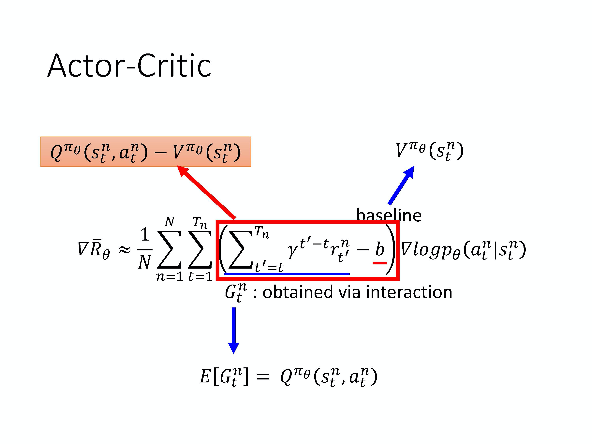
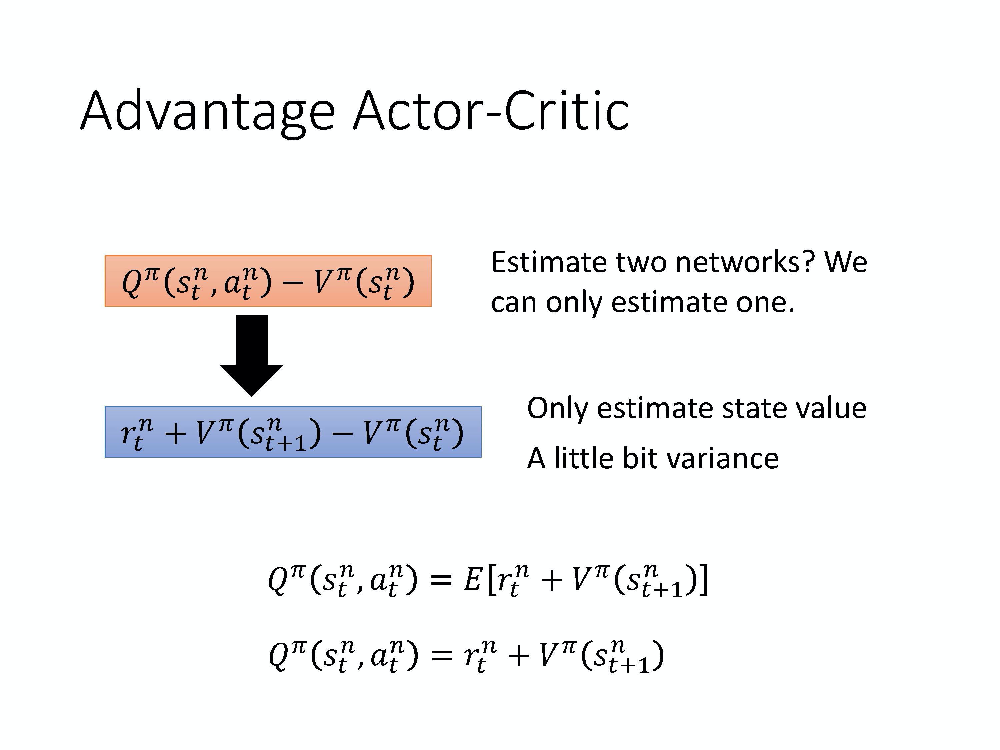
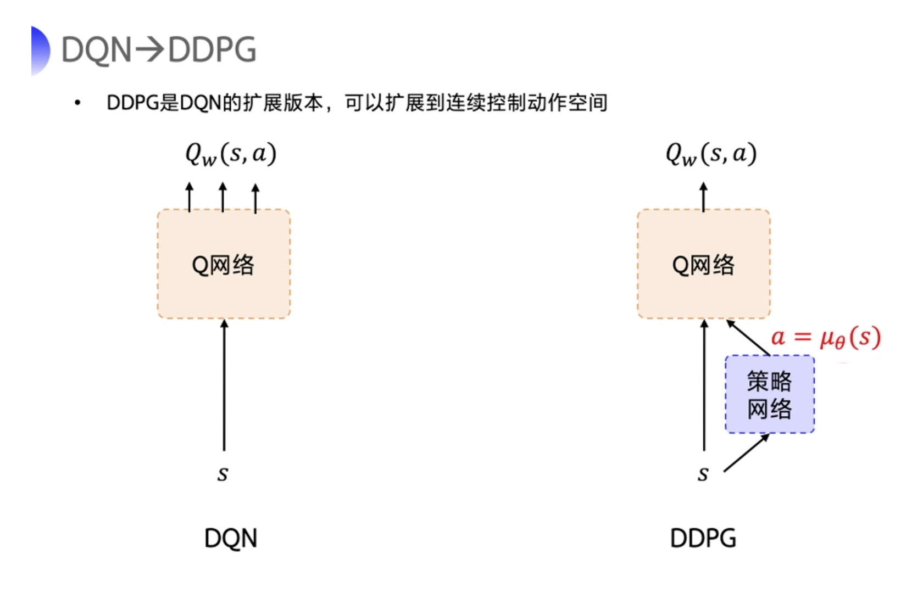
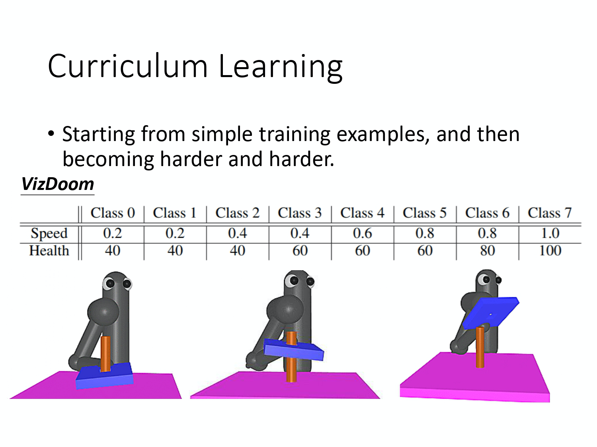
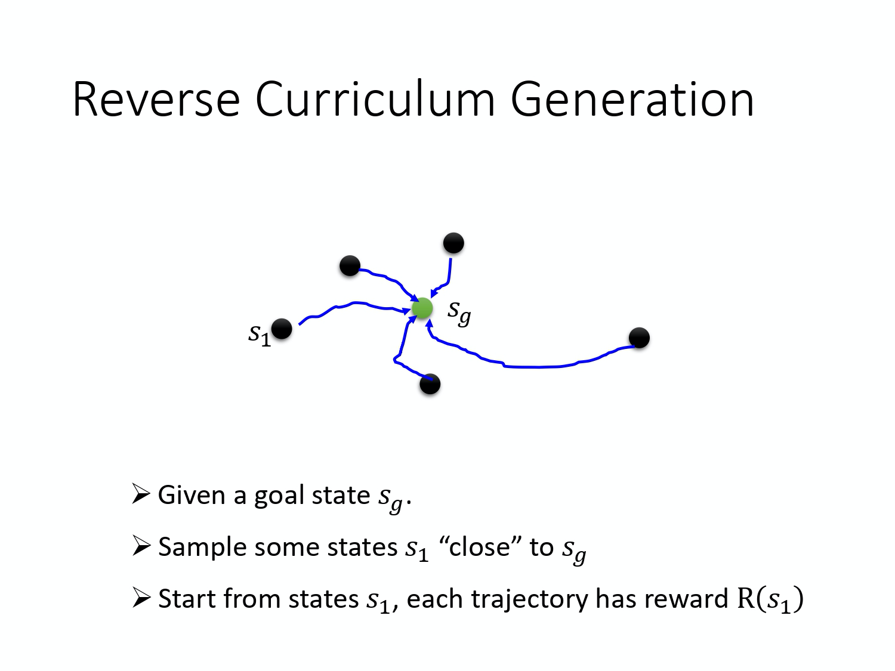
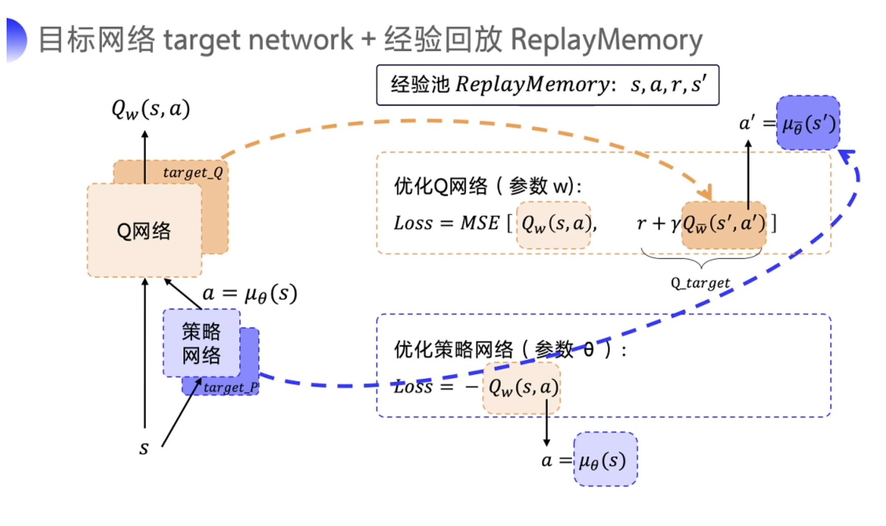
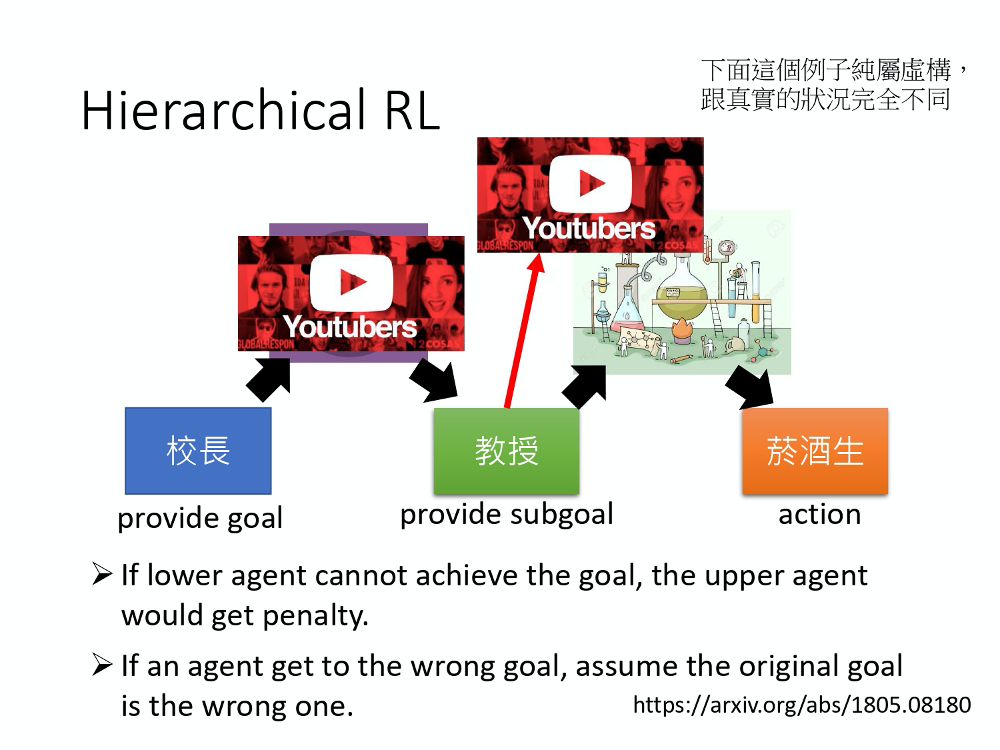
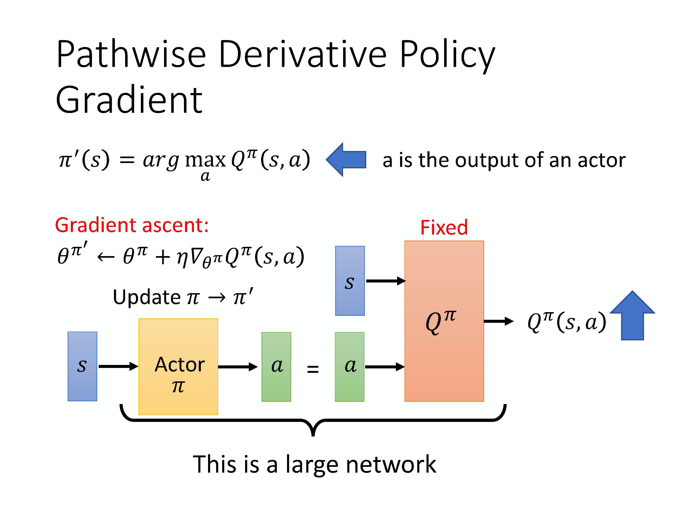
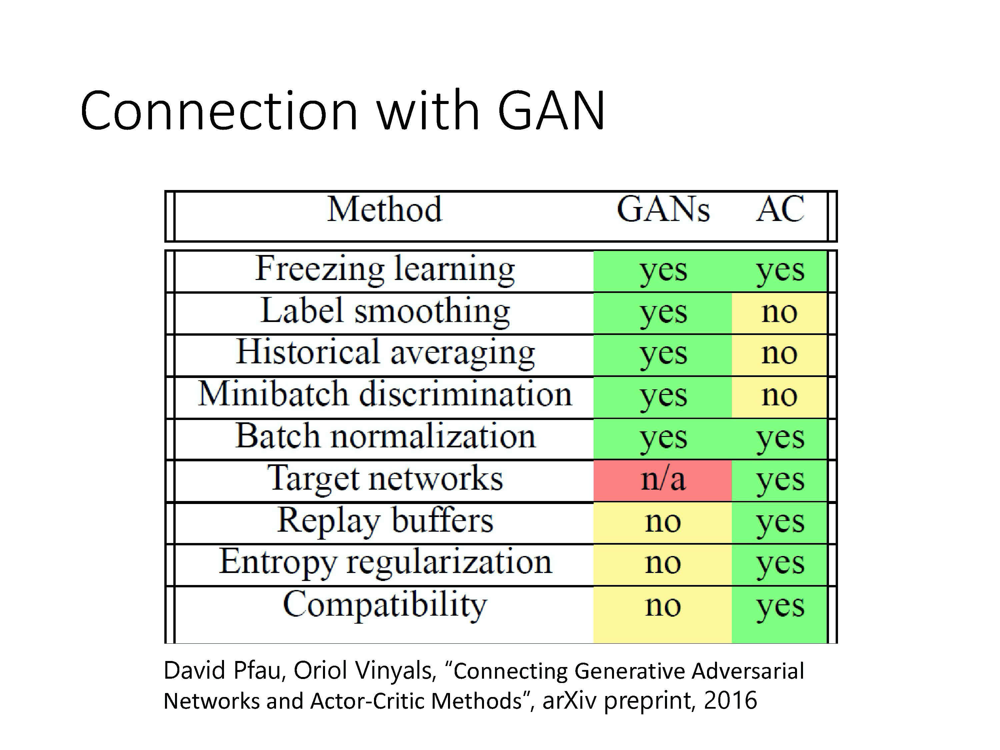

# Actor-Critic

## Actor-Critic

在 REINFORCE 算法中，每次需要根据一个策略采集一条完整的轨迹，并计算这条轨迹上的回报。这种采样方式的方差比较大，学习效率也比较低。我们可以借鉴时序差分学习的思想，使用动态规划方法来提高采样的效率，即从状态 $s$ 开始的总回报可以通过当前动作的即时奖励 $r(s,a,s')$ 和下一个状态 $s'$ 的值函数来近似估计。

`演员-评论家算法(Actor-Critic Algorithm)`是一种结合`策略梯度`和`时序差分学习`的强化学习方法，其中：

* 演员(Actor)是指策略函数 $\pi_{\theta}(a|s)$，即学习一个策略来得到尽量高的回报。
* 评论家(Critic)是指值函数 $V^{\pi}(s)$，对当前策略的值函数进行估计，即评估演员的好坏。
* 借助于值函数，演员-评论家算法可以进行单步更新参数，不需要等到回合结束才进行更新。

在  Actor-Critic 算法 里面，最知名的方法就是 `A3C(Asynchronous Advantage Actor-Critic)`。

* 如果去掉 Asynchronous，只有 `Advantage Actor-Critic`，就叫做 `A2C`。
* 如果加了 Asynchronous，变成 `Asynchronous Advantage Actor-Critic`，就变成 `A3C`。

### Review: Policy Gradient

那我们复习一下 policy gradient，在 policy gradient，我们在 update policy 的参数 $\theta$ 的时候，我们是用了下面这个式子来算出 gradient。
$$
\nabla \bar{R}_{\theta} \approx \frac{1}{N} \sum_{n=1}^{N} \sum_{t=1}^{T_{n}}\left(\sum_{t^{\prime}=t}^{T_{n}} \gamma^{t^{\prime}-t} r_{t^{\prime}}^{n}-b\right) \nabla \log p_{\theta}\left(a_{t}^{n} \mid s_{t}^{n}\right)
$$
这个式子是在说，我们先让 agent 去跟环境互动一下，那我们可以计算出在某一个 state s，采取了某一个 action a 的概率  $p_{\theta}(a_t|s_t)$。接下来，我们去计算在某一个 state s 采取了某一个 action a 之后，到游戏结束为止，accumulated reward 有多大。我们把这些 reward 从时间 t 到时间 T 的 reward 通通加起来，并且会在前面乘一个 discount factor，可能设 0.9 或 0.99。我们会减掉一个 baseline b，减掉这个值 b 的目的，是希望括号这里面这一项是有正有负的。如果括号里面这一项是正的，我们就要增加在这个 state 采取这个 action 的机率；如果括号里面是负的，我们就要减少在这个 state 采取这个 action 的机率。

我们把用 G 来表示 accumulated reward。但 G 这个值，其实是非常不稳定的。因为互动的过程本身是有随机性的，所以在某一个 state s 采取某一个 action a，然后计算 accumulated reward，每次算出来的结果都是不一样的，所以 G 其实是一个 random variable。给同样的 state s，给同样的 action a，G 可能有一个固定的 distribution。但我们是采取 sample 的方式，我们在某一个 state s 采取某一个 action a，然后玩到底，我们看看得到多少的 reward，我们就把这个东西当作 G。

把 G 想成是一个 random variable 的话，我们实际上是对这个 G 做一些 sample，然后拿这些 sample 的结果，去 update 我们的参数。但实际上在某一个 state s 采取某一个 action a，接下来会发生什么事，它本身是有随机性的。虽然说有个固定的 distribution，但它本身是有随机性的，而这个 random variable 的 variance 可能会非常大。你在同一个 state 采取同一个 action，你最后得到的结果可能会是天差地远的。

假设我们可以 sample 足够的次数，在每次 update 参数之前，我们都可以 sample 足够的次数，那其实没有什么问题。但问题就是我们每次做 policy gradient，每次 update 参数之前都要做一些 sample，这个 sample 的次数其实是不可能太多的，我们只能够做非常少量的 sample。如果你正好 sample 到差的结果，比如说你 sample 到 G = 100，sample 到 G = -10，那显然你的结果会是很差的。

### Review: Q-learning

Q: 能不能让整个 training process 变得比较稳定一点，能不能够直接估测 G 这个 random variable 的期望值？

A: 我们在 state s 采取 action a 的时候，直接用一个 network 去估测在 state s 采取 action a 的时候，G 的期望值。如果这件事情是可行的，那之后 training 的时候，就用期望值来代替 sample 的值，这样会让 training 变得比较稳定。

Q: 怎么拿期望值代替 sample 的值呢？

A: 这边就需要引入 value based 的方法。value based 的方法就是 Q-learning。Q-learning 有两种 functions，有两种 critics。

* 第一种 critic 是 $V^{\pi}(s)$，它的意思是说，假设 actor 是 $\pi$，拿 $\pi$ 去跟环境做互动，当我们看到 state s 的时候，接下来 accumulated reward 的期望值有多少。
* 还有一个 critic 是 $Q^{\pi}(s,a)$。$Q^{\pi}(s,a)$ 把 s 跟 a 当作 input，它的意思是说，在 state s 采取 action a，接下来都用 actor $\pi$ 来跟环境进行互动，accumulated reward 的期望值是多少。

* $V^{\pi}$  input s，output 一个 scalar。

* $Q^{\pi}$  input s，然后它会给每一个 a 都 assign 一个 Q value。

* 你可以用  TD 或 MC 来估计。用 TD 比较稳，用 MC 比较精确。

### Actor-Critic

G 的 random variable 的期望值正好就是 Q ，即
$$
E\left[G_{t}^{n}\right]=Q^{\pi_{\theta}} \left(s_{t}^{n}, a_{t}^{n}\right)
$$

因为这个就是 Q 的定义。Q-function 的定义就是在某一个 state s，采取某一个 action a，假设 policy 就是 $\pi$ 的情况下会得到的 accumulated reward 的期望值有多大，而这个东西就是 G 的期望值。Accumulated reward 的期望值就是 G 的期望值。所以假设用期望值来代表 $\sum_{t^{\prime}=t}^{T_{n}} \gamma^{t^{\prime}-t} r_{t^{\prime}}^{n}$ 这一项的话，把 Q-function 套在这里就结束了。那我们就可以 Actor 跟 Critic 这两个方法结合起来。

有不同的方法来表示 baseline，但一个常见的做法是，你用 value function $V^{\pi_{\theta}}\left(s_{t}^{n}\right)$ 来表示 baseline。Value function 的意思是说，假设 policy 是 $\pi$，在某一个 state s 一直 interact 到游戏结束，expected reward 有多大。 $V^{\pi_{\theta}}\left(s_{t}^{n}\right)$ 没有 involve action，$Q^{\pi_{\theta}}\left(s_{t}^{n}, a_{t}^{n}\right)$ 有 involve action。

其实 $V^{\pi_{\theta}}\left(s_{t}^{n}\right)$ 会是 $Q^{\pi_{\theta}}\left(s_{t}^{n}, a_{t}^{n}\right)$ 的期望值，所以 $Q^{\pi_{\theta}}\left(s_{t}^{n}, a_{t}^{n}\right)-V^{\pi_{\theta}}\left(s_{t}^{n}\right)$ 会有正有负，所以 $\sum_{t^{\prime}=t}^{T_{n}} \gamma^{t^{\prime}-t} r_{t^{\prime}}^{n}-b$ 这一项就会是有正有负的。

所以我们就把 policy gradient 里面 $\sum_{t^{\prime}=t}^{T_{n}} \gamma^{t^{\prime}-t} r_{t^{\prime}}^{n}-b$ 这一项换成了 $Q^{\pi_{\theta}}\left(s_{t}^{n}, a_{t}^{n}\right)-V^{\pi_{\theta}}\left(s_{t}^{n}\right)$。

### Advantage Actor-Critic

如果你这么实现的话，有一个缺点是：你要 estimate 2 个 networks：Q-network 和 V-network，你估测不准的风险就变成两倍。所以我们何不只估测一个 network？

事实上在这个 Actor-Critic 方法里面。你可以只估测 V 这个 network，你可以用 V 的值来表示 Q 的值，$Q^{\pi}\left(s_{t}^{n}, a_{t}^{n}\right)$ 可以写成 $ r_{t}^{n}+V^{\pi}\left(s_{t+1}^{n}\right)$ 的期望值，即
$$
Q^{\pi}\left(s_{t}^{n}, a_{t}^{n}\right)=E\left[r_{t}^{n}+V^{\pi}\left(s_{t+1}^{n}\right)\right]
$$

你在 state s 采取 action a，会得到 reward r，然后跳到 state $s_{t+1}$。但是你会得到什么样的 reward r，跳到什么样的 state $s_{t+1}$，它本身是有随机性的。所以要把右边这个式子，取期望值它才会等于 Q-function。但我们现在把期望值这件事情去掉，即
$$
Q^{\pi}\left(s_{t}^{n}, a_{t}^{n}\right)=r_{t}^{n}+V^{\pi}\left(s_{t+1}^{n}\right)
$$

我们就可以把 Q-function 用 r + V 取代掉，然后得到下式：
$$
r_{t}^{n}+V^{\pi}\left(s_{t+1}^{n}\right)-V^{\pi}\left(s_{t}^{n}\right)
$$
把这个期望值去掉的好处就是你不需要 estimate Q 了，你只需要 estimate V 就够了，你只要 estimate 一个 network 就够了。但这样你就引入了一个随机的东西 r ，它是有随机性的，它是一个 random variable。但是这个 random variable，相较于 accumulated reward G 可能还好，因为它是某一个 step 会得到的 reward，而 G 是所有未来会得到的 reward 的总和。G variance 比较大，r 虽然也有一些 variance，但它的 variance 会比 G 要小。所以把原来 variance 比较大的 G 换成 variance 比较小的 r 也是合理的。

Q: 为什么可以直接把期望值拿掉？

A: 原始的 A3C paper 试了各种方法，最后做出来就是这个最好。当然你可能说，搞不好 estimate Q 和 V，也可以 estimate 很好，那我告诉你就是做实验的时候，最后结果就是这个最好，所以后来大家都用这个。

因为 $r_{t}^{n}+V^{\pi}\left(s_{t+1}^{n}\right)-V^{\pi}\left(s_{t}^{n}\right)$ 叫做 `Advantage function`。所以这整个方法就叫 `Advantage Actor-Critic`。

整个流程是这样子的。我们有一个 $\pi$，有个初始的 actor 去跟环境做互动，先收集资料。在 policy gradient 方法里面收集资料以后，你就要拿去 update policy。但是在 actor-critic 方法里面，你不是直接拿那些资料去 update policy。你先拿这些资料去 estimate value function，你可以用 TD 或 MC 来 estimate value function 。接下来，你再 based on value function，套用下面这个式子去 update $\pi$。
$$
\nabla \bar{R}_{\theta} \approx \frac{1}{N} \sum_{n=1}^{N} \sum_{t=1}^{T_{n}}\left(r_{t}^{n}+V^{\pi}\left(s_{t+1}^{n}\right)-V^{\pi}\left(s_{t}^{n}\right)\right) \nabla \log p_{\theta}\left(a_{t}^{n} \mid s_{t}^{n}\right)
$$
然后你有了新的 $\pi$ 以后，再去跟环境互动，再收集新的资料，去 estimate value function。然后再用新的 value function 去 update policy，去 update actor。

整个 actor-critic 的 algorithm 就是这么运作的。

实现 Actor-Critic 的时候，有两个一定会用的 tip。

* 第一个 tip 是说，我们需要 estimate 两个 network：V function 和 policy 的 network（也就是 actor）。
  *  V 这个 network input 一个 state，output 一个 scalar。
  * Actor 这个 network input 一个 state，output 就是一个 action 的 distribution，假设你的 action 是 discrete，不是 continuous 的话，如果是 continuous 的话，它也是一样。如果是 continuous 的话，就只是 output 一个 continuous 的 vector。
  * 上图是举的是 discrete 的例子，但 continuous case 也是一样的。Input 一个 state，然后它决定你现在要 take 那一个 action。**这两个 network，actor 和 critic 的 input 都是 s，所以它们前面几个 layer，其实是可以 share 的。**
    * 尤其是假设你今天是玩 Atari 游戏，input 都是 image。Input 的 image 都非常复杂，image 很大，通常你前面都会用一些 CNN 来处理，把那些 image 抽象成 high level 的 information。把 pixel level 抽象成 high level information 这件事情，其实对 actor 跟 critic 来说是可以共用的。所以通常你会让 actor 跟 critic 的共享前面几个 layer，你会让 actor 跟 critic 的前面几个 layer 共用同一组参数，那这一组参数可能是 CNN 的参数。
    * 先把 input 的 pixel 变成比较 high level 的信息，然后再给 actor 去决定说它要采取什么样的行为，给这个 critic，给 value function 去计算 expected reward。
* **第二个 tip 是我们一样需要 exploration 的机制。**在做 Actor-Critic 的时候，有一个常见的 exploration 的方法是你会对你的 $\pi$ 的 output 的 distribution 下一个 constrain。这个 constrain 是希望这个 distribution 的 entropy 不要太小，希望这个 distribution 的 entropy 可以大一点，也就是希望不同的 action 它的被采用的机率平均一点。这样在 testing 的时候，它才会多尝试各种不同的 action，才会把这个环境探索的比较好，才会得到比较好的结果。这个就是 Advantage Actor-Critic。

## A3C

什么是 A3C 呢？Reinforcement learning 有一个问题就是它很慢，那怎么增加训练的速度呢？这个可以讲到火影忍者就是有一次鸣人说，他想要在一周之内打败晓，所以要加快修行的速度，他老师就教他一个方法，这个方法是说你只要用影分身进行同样修行。那两个一起修行的话呢？经验值累积的速度就会变成 2 倍，所以，鸣人就开了 1000 个影分身，开始修行了。这个其实就是 Asynchronous(异步的) Advantage Actor-Critic，也就是 A3C 这个方法的精神。

A3C 这个方法就是同时开很多个 worker，那每一个 worker 其实就是一个影分身。那最后这些影分身会把所有的经验，通通集合在一起。首先你如果没有很多个 CPU，可能也是不好实现的，你可以 implement A2C 就好。

这个 A3C 是怎么运作的呢？A3C 是这样子，一开始有一个 global network。那我们刚才有讲过说，其实 policy network 跟 value network 是 tie 在一起的，它们的前几个 layer 会被 tie 一起。我们有一个 global network，它们有包含 policy 的部分和 value 的部分。假设它的参数就是 $\theta_1$，你会开很多个 worker。每一个 worker 就用一张 CPU 去跑，比如你就开 8 个 worker ，那你至少 8 张 CPU。第一个 worker 就把 global network 的参数 copy 过来，每一个 worker 工作前都会global network 的参数 copy 过来。接下来你就去跟环境做互动，每一个 actor 去跟环境做互动的时候，为了要 collect 到比较 diverse 的 data，所以举例来说如果是走迷宫的话，可能每一个 actor 起始的位置都会不一样，这样它们才能够收集到比较多样性的 data。每一个 actor 就自己跟环境做互动，互动完之后，你就会计算出 gradient。那计算出 gradient 以后，你要拿 gradient 去 update 你的参数。你就计算一下你的 gradient，然后用你的 gradient 去 update global network 的参数。就是这个 worker 算出 gradient 以后，就把 gradient 传回给中央的控制中心。然后中央的控制中心，就会拿这个 gradient 去 update 原来的参数。但是要注意一下，所有的 actor 都是平行跑的，就每一个 actor 就是各做各的，互相之间就不要管彼此。所以每个人都是去要了一个参数以后，做完就把参数传回去。所以当第一个 worker 做完想要把参数传回去的时候，本来它要的参数是 $\theta_1$，等它要把 gradient 传回去的时候。可能别人已经把原来的参数覆盖掉，变成 $\theta_2$了。但是没有关系，它一样会把这个 gradient 就覆盖过去就是了。Asynchronous actor-critic 就是这么做的，这个就是 A3C。

 ## Pathwise Derivative Policy Gradient

讲完 A3C 之后，我们要讲另外一个方法叫做 `Pathwise Derivative Policy Gradient`。这个方法很神奇，它可以看成是 Q-learning 解 continuous action 的一种特别的方法，也可以看成是一种特别的 Actor-Critic 的方法。

用棋灵王来比喻的话，阿光是一个 actor，佐为是一个 critic。阿光落某一子以后呢，如果佐为是一般的 Actor-Critic，他会告诉他说这时候不应该下小马步飞，他会告诉你，你现在采取的这一步算出来的 value 到底是好还是不好，但这样就结束了，他只告诉你说好还是不好。因为一般的这个 Actor-Critic 里面那个 critic 就是 input state 或 input state 跟 action 的 pair，然后给你一个 value 就结束了。所以对 actor 来说，它只知道它做的这个行为到底是好还是不好。但如果是在pathwise derivative policy gradient 里面，这个 critic 会直接告诉 actor 说采取什么样的 action 才是好的。所以今天佐为不只是告诉阿光说，这个时候不要下小马步飞，同时还告诉阿光说这个时候应该要下大马步飞，所以这个就是Pathwise Derivative Policy Gradient 中的 critic。critic 会直接告诉 actor 做什么样的 action 才可以得到比较大的 value。

从 Q-learning 的观点来看，Q-learning 的一个问题是你没有办法在用 Q-learning 的时候，考虑 continuous vector。其实也不是完全没办法，就是比较麻烦，比较没有 general solution，我们怎么解这个 optimization problem 呢？我们用一个 actor 来解这个 optimization 的 problem。本来在 Q-learning 里面，如果是一个 continuous action，我们要解这个 optimization problem。但是现在这个 optimization problem 由 actor 来解，我们假设 actor 就是一个 solver，这个 solver 的工作就是给你 state, s，然后它就去解解告诉我们说，哪一个 action 可以给我们最大的 Q value，这是从另外一个观点来看 pathwise derivative policy gradient 这件事情。这个说法，你有没有觉得非常的熟悉呢？我们在讲 GAN 的时候，不是也讲过一个说法。我们 learn 一个 discriminator，它是要 evaluate 东西好不好，discriminator 要自己生成东西，非常的困难，那怎么办？因为要解一个 arg max 的 problem 非常的困难，所以用 generator 来生，所以今天的概念其实是一样的。Q 就是那个 discriminator，要根据这个 discriminator 决定 action 非常困难，怎么办？另外 learn 一个 network 来解这个 optimization problem，这个东西就是 actor。所以，两个不同的观点是同一件事，从两个不同的观点来看，一个观点是说，我们可以对原来的 Q-learning 加以改进，怎么改进呢？我们 learn 一个 actor 来决定 action 以解决 arg max 不好解的问题。或是另外一个观点是，原来的 actor-critic 的问题是 critic 并没有给 actor 足够的信息，它只告诉它好或不好，没有告诉它说什么样叫好，那现在有新的方法可以直接告诉 actor 说，什么样叫做好。

那我们讲一下它的 algorithm。假设我们 learn 了一个 Q-function，Q-function 就是 input s 跟 a，output 就是 $Q^{\pi}(s,a)$。那接下来，我们要 learn 一个 actor，这个 actor 的工作就是解这个 arg max 的 problem。这个 actor 的工作就是 input 一个 state s，希望可以 output 一个 action a。这个 action a 被丢到 Q-function 以后，它可以让 $Q^{\pi}(s,a)$ 的值越大越好。

那实际上在 train 的时候，你其实就是把 Q 跟 actor 接起来变成一个比较大的 network。Q 是一个 network，input s 跟 a，output 一个 value。Actor 在 training 的时候，它要做的事情就是 input s，output a。把 a 丢到 Q 里面，希望 output 的值越大越好。在 train 的时候会把 Q 跟 actor 接起来，当作是一个大的 network。然后你会 fix 住 Q 的参数，只去调 actor 的参数，就用 gradient ascent 的方法去 maximize Q 的 output。这就是一个 GAN，这就是 conditional GAN。Q 就是 discriminator，但在 reinforcement learning 就是 critic，actor 在 GAN 里面就是 generator，其实它们就是同一件事情。

我们来看一下 pathwise derivative policy gradient 的算法。一开始你会有一个 actor $\pi$，它去跟环境互动，然后，你可能会要它去 estimate Q value。estimate 完 Q value 以后，你就把 Q value 固定，只去 learn 一个 actor。假设这个 Q 估得是很准的，它知道在某一个 state 采取什么样的 action，会真的得到很大的 value。接下来就 learn 这个 actor，actor 在 given s 的时候，它采取了 a，可以让最后 Q-function 算出来的 value 越大越好。你用这个 criteria 去 update 你的 actor $\pi$。然后有新的 $\pi$ 再去跟环境做互动，再 estimate Q，再得到新的 $\pi$ 去 maximize Q 的 output。本来在 Q-learning 里面，你用得上的技巧，在这边也几乎都用得上，比如说 replay buffer、exploration 等等。

上图是原来 Q-learning 的 algorithm。你有一个 Q-function Q，你有另外一个 target 的 Q-function 叫做 $\hat{Q}$。然后在每一次 training，在每一个 episode 的每一个 timestamp 里面，你会看到一个 state $s_t$，你会 take 某一个 action $a_{t}$。至于 take 哪一个 action 是由 Q-function 所决定的，因为解一个 arg max 的 problem。如果是 discrete 的话没有问题，你就看说哪一个 a 可以让 Q 的 value 最大，就 take 哪一个 action。那你需要加一些 exploration，这样 performance 才会好。你会得到 reward $r_t$，跳到新的 state $s_{t+1}$。你会把 $s_t$, $a_{t}$, $r_t$, $s_{t+1}$ 塞到你的 buffer 里面去。你会从你的 buffer 里面 sample 一个 batch 的 data，这个 batch data 里面，可能某一笔是 $s_i, a_i, r_i, s_{i+1}$。接下来你会算一个 target，这个 target 叫做$y$ ，$y=r_{i}+\max _{a} \hat{Q}\left(s_{i+1}, a\right)$。然后怎么 learn 你的 Q 呢？你希望 $Q(s_i,a_i)$ 跟 y 越接近越好，这是一个 regression 的 problem，最后每 C 个 step，你要把用 Q 替代 $\hat{Q}$ 。

 接下来我们把 Q-learning 改成 Pathwise Derivative Policy Gradient，这边需要做四个改变。

* 第一个改变是，你要把 Q 换成 $\pi$，本来是用 Q 来决定在 state $s_t$ 产生那一个 action, $a_{t}$ 现在是直接用 $\pi$ 。我们不用再解 arg max 的 problem 了，我们直接 learn 了一个 actor。这个 actor input $s_t$ 就会告诉我们应该采取哪一个 $a_{t}$。所以本来 input $s_t$，采取哪一个 $a_t$，是 Q 决定的。在 Pathwise Derivative Policy Gradient 里面，我们会直接用 $\pi$ 来决定，这是第一个改变。
* 第二个改变是，本来这个地方是要计算在 $s_{i+1}$，根据你的 policy 采取某一个 action a 会得到多少的 Q value。那你会采取让 $\hat{Q}$ 最大的那个 action a。那现在因为我们其实不好解这个 arg max 的 problem，所以 arg max problem，其实现在就是由 policy $\pi$ 来解了，所以我们就直接把 $s_{i+1}$ 代到 policy $\pi$ 里面，你就会知道说  given $s_{i+1}$ ，哪一个 action 会给我们最大的 Q value，那你在这边就会 take 那一个 action。在 Q-function 里面，有两个 Q network，一个是真正的 Q network，另外一个是 target Q network。那实际上你在 implement 这个 algorithm 的时候，你也会有两个 actor，你会有一个真正要 learn 的 actor $\pi$，你会有一个 target actor $\hat{\pi}$ 。这个原理就跟为什么要有 target Q network 一样，我们在算 target value 的时候，我们并不希望它一直的变动，所以我们会有一个 target 的 actor 和一个 target 的 Q-function，它们平常的参数就是固定住的，这样可以让你的这个 target 的 value 不会一直地变化。所以本来到底是要用哪一个 action a，你会看说哪一个 action a 可以让 $\hat{Q}$  最大。但现在因为哪一个 action a 可以让 $\hat{Q}$ 最大这件事情已经被用那个 policy 取代掉了，所以我们要知道哪一个 action a 可以让 $\hat{Q}$ 最大，就直接把那个 state 带到 $\hat{\pi}$ 里面，看它得到哪一个 a，就用那一个 a，那一个 a 就是会让 $\hat{Q}(s,a)$ 的值最大的那个 a 。其实跟原来的这个 Q-learning 也是没什么不同，只是原来你要解 arg max 的地方，通通都用 policy 取代掉了，那这个是第二个不同。
* 第三个不同就是之前只要 learn Q，现在你多 learn 一个 $\pi$，那 learn $\pi$ 的时候的方向是什么呢？learn $\pi$ 的目的，就是为了 maximize Q-function，希望你得到的这个 actor，它可以让你的 Q-function output 越大越好，这个跟 learn GAN 里面的 generator 的概念。其实是一样的。
* 第四个 step，就跟原来的 Q-function 一样。你要把 target 的 Q network 取代掉，你现在也要把 target policy 取代掉。

## Connection with GAN

其实 GAN 跟 Actor-Critic 的方法是非常类似的。这边就不细讲，你可以去找到一篇 paper 叫做 `Connecting Generative Adversarial Network and Actor-Critic Methods`。

Q: 知道 GAN 跟 Actor-Critic 非常像有什么帮助呢？

A: 一个很大的帮助就是 GAN 跟 Actor-Critic 都是以难 train 而闻名的。所以在文献上就会收集各式各样的方法，告诉你说怎么样可以把 GAN train 起来。怎么样可以把 Actor-Critic train 起来。但是因为做 GAN 跟 Actor-Critic 的人是两群人，所以这篇 paper 里面就列出说在 GAN 上面有哪些技术是有人做过的，在 Actor-Critic 上面，有哪些技术是有人做过的。也许在 GAN 上面有试过的技术，你可以试着 apply 在 Actor-Critic 上，在 Actor-Critic 上面做过的技术，你可以试着 apply 在 GAN 上面，看看是否 work。

## References

* [神经网络与深度学习](https://nndl.github.io/)

