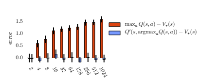
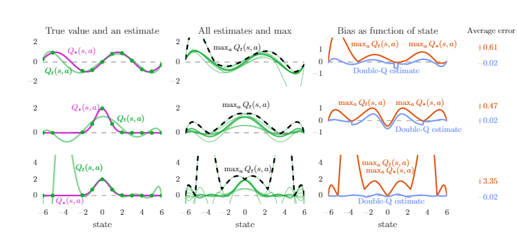
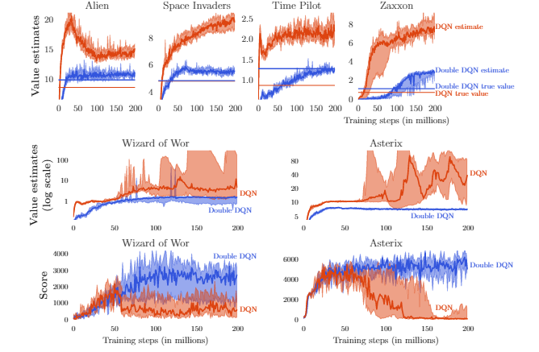

# Deep Reinforcement Learning with Double Q-Learning 论文剖析

Hado van Hasselt 、Arthur Guez 、 David Silver from Google DeepMind

##  〇. 文章信息

**Deep Reinforcement Learning with Double Q-learning**

作者：Hado van Hasselt 、Arthur Guez 、 David Silver from Google DeepMind ,2015

https://arxiv.org/abs/1509.06461

##  一. 写作动机

高估问题（overestimation）一直是强化学习中存在的问题，但是一直以来其来源有多种说法，一是归因于不灵活的函数近似（Thrun和Schwartz, 1993），一是来自噪声（van Hasselt, 2010, 2011）。通过实验也表明，高估问题的普遍性相较之前认识的要普遍的多，需要找到方法缓解其影响。

本文的写作动机就是探索高估的产生，验证高估问题对于Q-Learning是否不利，并寻找缓解高估问题的方法。

## 二 . Q-Learning算法的进化历史

本文中，作者总结了DQN的发展：

### 1. Q-Learning——解决时序决策问题的方法

Q-Learning是一种**时序差分方法**，很好的被用在时序决策问题中(Watkins, 1989)，其通过估计最优动作价值函数$$ Q_{\pi}(s,a)=\mathbb{E}[R_1+\gamma R_2+...|S_0=s, A_0=a,\pi],$$ 并对每个状态选择最优的动作价值函数所对应的动作，从而间接生成最优策略。

具体请参考Q-Learning文章，此处给出迭代公式方便后续说明。

$$ Q(S_t,A_t)=Q(S_t,A_t)+ \alpha (Y_t^Q-Q(S_t,A_t)) \tag{1}                                                          $$

### 2. 价值函数拟合的Q-Learning

因为状态过多或者连续，无法遍历所有状态，需要使用参数化函数$ Q(s,a;\theta _t)$对现有值进行拟合，并对未知状态的价值函数进行预测，通过公式

$$\theta_{t-1}=\theta_t +\alpha(Y_t^Q-Q(S_t,A_t;\theta_t))\nabla Q(S_t, A_t,;\theta _t) \tag{2}                        $$

完成参数更新，其中$Y_t^Q =R_{t+1}+\gamma \substack{max\\a}Q(S_{t+1},a;\theta _t)$是TD-target, 主要思想就是使用类似梯度下降的方法，使得拟合出的参数化函数更加接近目标，也就是说更加符合真实值。

解决了传统Q-Learning中的无法解决的**未知状态**问题，即欠鲁棒的问题。

### 3.Deep Q Networks（DQN）

（Mnih et al. ,2015)）——神经网络+Q-Learning

说到函数拟合就不得不提到神经网络，它具有极强的**函数拟合**能力，DQN应运而生。

DQN针对传统Q-Learning有以下三点改进，提高了算法的性能：

1. #### 使用神经网络来代替参数化函数,增强了函数拟合能力

2. #### 使用目标网络

   使用一个异步更新的目标网络,网络参数用$\theta^-$表示（每$\tau$次将Q-net的参数$\theta$赋值给目标网络）用来进行目标的计算。

   $$Y_t^Q = R_{t+1}+\gamma\substack{max\\a}Q(S_t=s, A_t=a;\theta^-_t) \tag{3}                                                $$

   

3. #### 使用**经验回放**(Lin, 1992)：储存经验并重复使用，增加了利用率，减少采样成本

4. #### Double DQN

	本文的重点，下一章介绍

## 三 . Double DQN

### 1. 具体操作

更换计算目标的方式，公式为：

$$Y_t^Q = R_{t+1}+\gamma Q(S_t=s, A_t=\substack{argmax\\{a \in \mathbb{A}}}Q(s,a|\theta_t^-);\theta_t) \tag{4}       $$

### 2. 思想来源：解耦选取与计算

​	在传统DQN中,TD-target的计算可以分为两个步骤：**最优动作的选取** 与 **最优动作价值函数的计算** 。该公式可以变形为以下分解形式:

   $$ a^*=\substack{argmax\\{a \in \mathbb{A}}}Q(s,a|\theta_t)\\Y_t^Q=r+\gamma Q(S_t=s, A_t=a^*;\theta_t)$$

​	计算目标的任务就转换到了目标网络上：

$$
a^*=\substack{argmax\\{a \in \mathbb{A}}}Q(s,a|\theta_t^-)\\Y_t^Q=r+\gamma Q(S_t=s, A_t=a^*;\theta_t^-)
$$
​	使用上面提到的Double Q-Learning，则变为以下形式：

​		$$ a^*=\substack{argmax\\{a \in \mathbb{A}}}Q(s,a|\theta_t^-)\\Y_t^Q=r+\gamma Q(S_t=s, A_t=a^*;\theta_t)$$

***其实Q-Learning也有Double的形式，分别训练两个模型$\theta$,$\theta'$ 操作一样，只是这里Double DQN巧妙地使用了目标网络$\theta^-$ 作为第二个网络***

​	为了方便观看，使用表格形式展示     

|                        |       DQN        | DQN+target network |     Double DQN     |
| :--------------------: | :--------------: | :----------------: | :----------------: |
|     最优动作的选取     | 策略网络$\theta$ | 目标网络$\theta^-$ | 目标网络$\theta^-$ |
| 最优动作价值函数的计算 | 策略网络$\theta$ | 目标网络$\theta^-$ |  策略网络$\theta$  |

由此可以看出如何解耦，在传统的DQN+目标网络的方法上，最优动作的选取 与 最优动作价值函数的计算 两步是耦合的，但是Double DQN解耦二者，达到了缓解高估的效果。至于为什么要这么做，就需要清晰的了解高估问题是如何产生的，作者在下一部分明确的证明了高估现象的发生与高估的上下限，并使用实验验证了理论。

## 四. 高估问题

本文另一贡献就是系统的分析了高估问题产生的原因和如何影响了Q-Learning。 

### 1. 理论推导

#### (1) 为什么会产生高估？

简单来说，因为神经网络等估计方法存在误差，导致估计出的在某一固定状态$s$下，不同动作的动作价值函数$Q(A_t=a_i, S_t=s)$相对真实值$Q_*(A_t=a_i, S_t=s)$估计误差。假设估计噪声为高斯，无偏均值为0，误差可正可负，到此并无大碍，但是接下来的更新时的操作计算TD-target的时候，如公式$(3)$，使用了max操作，这导致在这一步的误差始终为正的，造成正的偏差，这就是导致高估的原因。

举个形象生动的例子：每天食堂拿盒饭，每盒的量500g大致相等，但是有的稍多为530g，有的稍少为470g。你每天随机选择一盒作为午餐，一个月下来你的体重没有变化，因为吃到的盒饭期望是每盒的平均值500g。但是第二个月你通过灵敏的视觉，每天都挑最多的那一盒，一个月下来胖了三斤，因为这时候吃到盒饭的期望为最大值530g。

选择最多的盒饭的过程就是max操作，你吃进去的饭通过公式$(1)$消化（更新），更新了你的体重，也就是动作价值函数的估值。

#### (2) 高估指标的理论推导

Thrun and Schwartz (1993)首先发现了高估的现象，表明如果动作值包含均匀分布在区间$[-\epsilon,\epsilon]$中的随机误差，则每个目标被高估到上限 $\gamma \in \frac{m-1}{m+1}$ ，其中 m   是动作的数量。

由贝尔曼最优方程可以得出最优动作价值函数与最优状态价值函数之间的关系：

$$Q_*(s,a)=V_*(s) \tag{5}                                                                                               $$ 

​		因为环境固定，奖励固定时，状态价值函数为常量，假设：任意动作价值函数的无偏估计值为$Q_t(s,a)$，则有等式$(6)$成立

$$ \sum_a (Q_t(s,a)-V_*(s))=0 \tag{6}                                                                                 $$

​		即使定义估计是无偏的，平均误差为零，但不是每个估计的误差均为零，也会有以下情况的产生：

$$\frac{1}{m} \sum_a(Q_t(s,a)-V_*(s))^2=C (m>1为动作个数，C>0为实数) \tag{7}                                            $$

​		在这种假设下，使用$(3)$中的max操作，利用$(2)$进行价值函数的更新时，$max_aQ_t(s,a) \geq V_*(s)+ \sqrt{\frac{C}{m-1}}$ ,得到了高估的下限。

​		文中特意提到，Double Q-Learning的高估下限为0。

​		证明可以参考原文附录，很详细，在此不赘述。

#### (3) 为什么Double DQN可以解决高估？

​	接着盒饭说。此时你感觉自己有点胖，命令你的室友替你拿盒饭，无论你的室友怎样拿，肯定不会比你自己拿的时候（挑最重的拿）多，即$Q(s,a_*;\theta^-) \leq \substack{max\\a}Q(s,a)$，也就减少了目标的高估影响，从而减少了对动作价值函数的估计。

### 2. 实验

本文共做两次实验验证以上理论推导

#### 实验一：验证Q-Learning与Double Q-Learning在价值函数估计上的性能比较

作者实验证明，上图中横坐标为动作数，纵坐标为估计的Q值与最优值的误差（重复100次取平均），橙色为Q-learning，蓝色为Double Q-learning，可以看出随着动作数增加，Q-learning误差逐渐增大，而Double Q-learning基本无偏。

#### 实验二：通过参数拟合对比试验验证高估来源，并验证Double Q-Learning能有效缓解高估问题

证明了Double Q-learning能够减少过拟合后，作者做了三组实验**模仿参数拟合**，以验证高估产生。

图表中横坐标为状态，共有13个状态，纵坐标为Q值的大小。共有十个动作。

- 左列中，紫色的线代表每个状态真实的最优Q值，绿线为动作价值函数的真实值，绿点为真实的不包含噪声的采样点。动作仅仅在13个状态中的11上采样，在未采样点上观察情况。第一行和第二行实验使用6阶多项式去拟合，第三行实验使用9阶多项式。可以看出左图第二行在采样点上的逼近也不精确，是由于多项式阶数低不够灵活；左图第三行可以看出，虽然在采样点上逼近都很好，但在未采样的的地方误差很大，过拟合。
- 中列三行图，每幅图中10条绿线是10个动作分别对应的动作值函数，虚线是每个状态下最大动作值。可以看出**最大动作值基本都比左边图中的真实最优Q值大**，当我们使用这些动作价值函数的估计进行Q-Learning的更新时，**使用公式$(2)$ 中$max_aQ_t(s,a) $, 高估现象产生**。
- 右列三行图，橙线是中间图中黑色虚线与左边图中紫线作差的结果，即高估，蓝线是使用了Double Q-Learning的估计效果，蓝线的平均值更接近0，这表明**Double Q-Learning确实可以减少Q-Learning在函数逼近中的高估问题**。

通过实验，发现不够灵活的函数逼近对Q值的估计不精确，但是**足够灵活的函数逼近在未知状态中会产生更大误差**，**导致更高的高估**，DQN就是一种非常灵活的函数逼近，使用了神经网络来逼近价值函数。而高估最终会阻止学习到最优策略，作者后面也通过Atari上的实验证明了这点，且通过Double Q-Learning减少高估最终策略也会得到改善。

### 3.高估如何影响DQN？

选择是相对的，均匀的高估不会对动作的选择造成影响。

真正造成影响的是：高估是非均匀的，回到吃盒饭的例子。你和我有一样的体质（吃-涨的比例相同），我比你稍微重，我们每次都只拿最多的盒饭530g，一个月涨的体重都一样，一个月之后还是我比你稍微重。但是你吃的是A种盒饭，我吃的是B种盒饭，这就会导致非均匀高估，导致你可能长胖更快一点，一个月之后甚至超过我，**导致次最优解**。

重要的事情说三遍：**均匀高估无影响，真正产生影响的是非均匀高估**，此后将高估一词指代非均匀高估。

## 五. 基于Atari2006的实验

### 1. 训练细节

网络架构是一个卷积神经网络（Fukushima, 1988; LeCun et al., 1998），具有 3 个卷积层和一个全连接隐藏层（总共大约 150 万个参数）。网络将最后四帧作为输入，输出每个动作的动作值。在每场游戏中，网络都在单个 GPU 上训练 200M 帧，或大约 1 周。

### 2.实验结果

作者在6款游戏上重复进行实验，得出以下结果

- 1， 2行展示了六款游戏的真实价值与估计价值，蓝色为DoubleDQN,红色为DQN。肉眼可见，DoubleDQN的价值拟合更趋近于真实值，相比DQN高估现象减弱明显。并且其中两家款游戏的高估十分严重。
- 选择高估现象作为严重的两款游戏（中下），展示其训练期间的得分情况：当高估开始时分数下降，证明了高估现象可以影响算法性能。使用 Double DQN 学习更加稳定。

最后，为了证明算法的稳定性，采用了不同的时间点开始切入学习（让人先玩一段时间，智能体再接手），发现DDQN的结果更加稳定，并且DDQN的解并没有利用到环境的相关特性。

#####  注：更多的实验结果篇幅原因这里不再做更多实验展示

## 六.本文的贡献

这篇论文有五个贡献。

- 首先，展示了为什么 Q-Learning存在高估的问题。
- 其次，通过分析 Atari 游戏的价值估计，发现这些高估在实践中比之前认为的更为普遍和严重。
- 第三，证明可以使用Double Q-Learning 学习有效地减少高估，从而使学习更加稳定和可靠。
- 第四，提出了一种Double DQN具体实现，它使用 DQN 算法的现有架构和深度神经网络，无需额外的网络或参数。
- 最后，展示了 Double DQN 找到了更好的策略，在 Atari 2600 域上获得了当时最优的结果。

## 七.作者介绍

于天琪，男，20多岁，单身，就读于哈尔滨工程大学陈赓实验班\
知乎主页：https://www.zhihu.com/people/Yutianqi \
qq:2206422122 \
欢迎交流，互相学习

​	