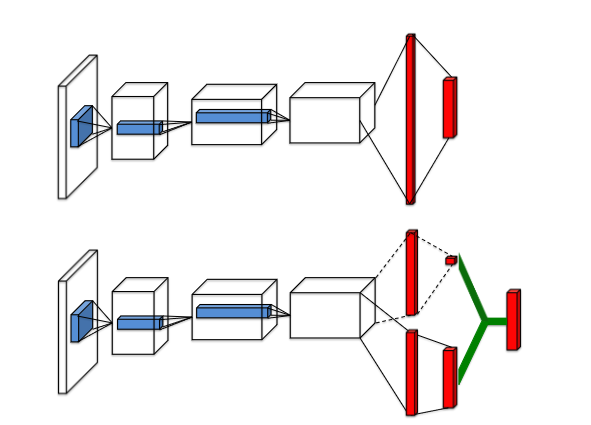
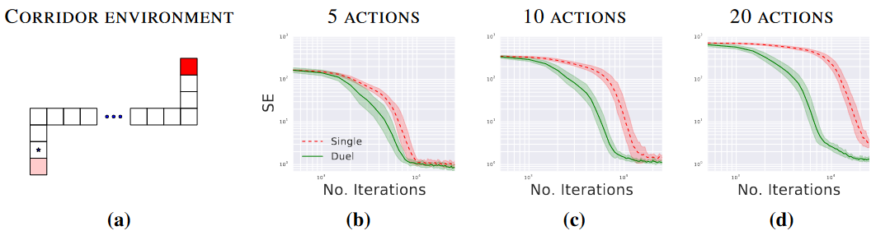
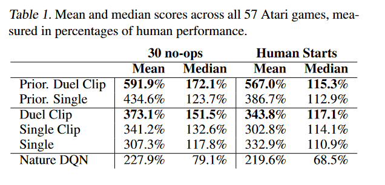

# Dueling Network Architectures for Deep Reinforcement Learning

## 〇. 文章信息

**Dueling Network Architectures for Deep Reinforcement Learning**

Ziyu Wang、Tom Schaul、Matteo Hessel、Hado van Hasselt、Marc Lanctot、Nando de Freitas

Google DeepMind

[https://arxiv.org/abs/1511.06581](https://arxiv.org/abs/1511.06581 "https://arxiv.org/abs/1511.06581")

## **一、写作动机**

Dueling DQN出现以前，基于深度学习RL的大多数方法都是用标准的神经网络结构，如MLP、LSTM等。此类工作的重点是改进控制和RL算法，或将现有的神经网络架构推广到RL中。

本文旨在提出一种适用于Model-free的RL算法的神经网络结构，该结构具有很好地灵活性和互补性。

## **二、** 预备知识

&#x20;若 $s_t$是智能体感知到的由 $M$个图像帧组成的视频，则有：

$$
s_t = (x_{t−M+1},\cdots,x_t)\in S
$$

与之对应的，$a_t$是智能体备选动作的离散集，则 $a_t \in A={1,2,3,\cdots,|A|}$； 游戏模拟器产生的奖励信号则为 $r_t$。智能体的目标是最大化折扣汇报 $R_t$( $R_t= \sum _{r=t}^\infty \gamma^{r-t}r_t$)，在这个公式中， $\gamma\in[0,1]$是折扣因子，它权衡了即时和未来奖励的重要性。

对于根据随机策略 $\pi$ 行动的智能体，其状态-动作对$(s, a)$ 和状态 $s$ 的值定义如下：

  $Q^{\pi}(s,a) = E[R_{t}|s_{t}=s,a_{t}=a,\pi]$（动作价值函数）

  $V^{\pi}(s) = E_{a \sim \pi(s)}[Q^{\pi}(s,a)]$（状态价值函数）

&#x20;   $Q^{\star}(s, a) = \mathop{max}\limits_{\pi} Q^\pi(s, a)$（最优动作价值函数）

  $V^{\star}(s)=\mathop{max}\limits_{\pi}V^{\pi}(s)$（最优状态价值函数）

&#x20;   $A^{\pi}(s,a) = Q^{\pi}(s,a) - V^{\pi}(s,a)$（优势函数）

**Theorem 1：**$V^{\star}(s) = \mathop{max}\limits_{a} Q^{\star}(s, a)$ （最优价值优势函数等于最优动作价值函数关于动作 $a$的最大值）
$$
A^{\star}(s, a)=Q^{\star}(s, a)-V^{\star}(s).（同时对左右两边关于动作a求最大值）
$$

$$
\mathop{max}\limits_{a}A^{\star}(s, a)=\mathop{max}\limits_{a}Q^{\star}(s, a)-V^{\star}(s)
$$

$$
\mathop{max}\limits_{a}A^{\star}(s, a) = \mathop{max}\limits_{a}Q^{\star}(s, a) - \mathop{max}\limits_{a}Q^{\star}(s, a) =0
$$

另外有：

$$
A^{\star}(s, a)=Q^{\star}(s, a)-V^{\star}(s) \Rightarrow Q^{\star}(s, a)=A^{\star}(s, a)+V^{\star}(s)
$$

$$
Q^{\star}(s, a)=A^{\star}(s, a)+V^{\star}(s) \Rightarrow Q^{\star}(s, a)=A^{\star}(s, a)+V^{\star}(s)-0
$$

$$
A^{\star}(s, a)+V^{\star}(s)+0 = A^{\star}(s, a)+V^{\star}(s)-\mathop{max}\limits_{a}A^{\star}(s, a)
$$

**Theorem 2：** $Q^{\star}(s, a)=A^{\star}(s, a)+V^{\star}(s)-\mathop{max}\limits_{a}A^{\star}(s, a)$

### 2.1 Deep Q-networks

$Q(s, a; θ)$是神经网络对 $Q^{\star}(s, a)$的近似，神经网络的输入为状态 $s$，通过神经网络将输入映射到一个输出向量中，输出向量为 $s$状态下对每一个动作$a$的打分。

迭代$i$处的损失函数:

$$
L_i(\theta_i)=E_{s,a,r,s'}[(y_i^{DQN}-Q(s,a;\theta_i))^2]
$$

其中，$y^{DDQN}{i}=r+\gamma Q(s'+ \mathop{max}\limits_{a'}Q(s',a';\theta^{-}))$。

另外，还可以从梯度下降和经验回放的角度对训练的方式进行修改。

*   梯度下降

$$
\nabla_{\theta_i}  L_i(\theta_i)=E_{s,a,r,s'}[(y_i^{DQN}-Q(s,a;\theta_i))\nabla_{\theta_i}Q(s,a;\theta_i)]
$$

*   经验回放

$$
L_i(\theta_i) = E_{s,a,r,s'} \sim u(D)[y_i^{DQN}-Q(s,a;\theta_i))^2]
$$

在学习过程中，智能体积累了一个数据集  $D_t = {e_1, e_2, . . . , e_t}$，其中经验$e_t = (s_t, a_t, r_t, s_{t+1})$ 来自许多回合。

### 2.2 Double Deep Q-networks

$$
y^{DDQN}_{i}=r+\gamma Q(s'+ argmax_{a'}Q(s',a';\theta_{i};\theta^{-}))
$$

DDQN与DQN基本一致，只是改变了 $y^{DDQN}_{i}$的表达式。

## **三、Dueling Network**的架构

与DQN不同，Dueling Network近似的是 $A^{\star}(s, a)$和 $V^{\star}(s)$，分别为 $A(s,a;\theta,\alpha)$和 $V(s;\theta,\beta)$。这也就意味着，Dueling Network可以使用同一个卷积网络的参数来提取特征，但输出则使用不同的结构。

具体地说，根据**Theorem 2**，有：

$$
Q(s, a; \theta, \alpha, \beta) = V (s; \theta, \beta) + A(s, a; \theta, \alpha)-\mathop{max}\limits_{a}A(s, a; \theta, \alpha)
$$

由于Dueling Network只是改变了网络的架构，所以训练网络的方法与DQN和DDQN一致，所有基于DQN的训练改进都可以用在Dueling Network上面。

### 3.1 $\mathop{max}\limits_{a}A(s, a; θ, α)$ 的作用

因为 $Q^{\star}(s, a)=A^{\star}(s, a)+V^{\star}(s)$，所以利用这种方式得到的 $Q^{\star}(s, a)$不唯一。

若同时给$A^\star$增一个数字，给$V^\star$减少相同的数字，则会得到与之前相同的$Q^{\star}(s, a)$。而增加 $\mathop{max}\limits_{a}A(s, a; θ, α)$一项后就不会出现这种情况。

### 3.2 实际使用中的 $\mathop{max}\limits_{a}A(s, a; θ, α)$

在实际的使用中，往往 $Q(s, a; \theta, \alpha, \beta)$中的第三项不使用$\mathop{max}\limits_{a}A(s, a; \theta, \alpha)$，而使用平均值，即：

$$
  Q(s, a; \theta, \alpha, \beta) = V (s; \theta, \beta) + ( A(s, a; \theta, \alpha) − \frac{1} {|A|} \sum_ {a'} A(s, a'; \theta, \alpha) )
$$

## **四、** 实验

### 4.1 策略评估

为了评估学习到的 $Q$  值，论文选择了一个简单的环境，其中可以为所有 $(s, a) ∈ S × A$ 分别计算准确的 $Q_\pi(s,a)$值。

这个环境，称之为走廊，由三个相连的走廊组成。走廊环境示意图如（a）所示，智能体从环境的左下角开始，必须移动到右上角才能获得最大的奖励。共有 5 种动作可用：上、下、左、右和无操作。两个垂直部分都有 10 个状态，而水平部分有 50 个状态。

论文在走廊环境的三种变体上分别使用 5、10 和 20 个动作将单流 Q 架构与Dueling Network架构进行了比较（10 和 20 动作变体是通过在原始环境中添加无操作而形成的）。

单流架构是一个三层 MLP，每个隐藏层有 50 个单元。Dueling Network架构也由三层组成。然而，在 50 个单元的第一个隐藏层之后，网络分支成两个流，每个流都是具有 25 个隐藏单元的两层 MLP。

结果表明，通过 5 个动作，两种架构以大致相同的速度收敛。然而，当我们增加动作数量时，Dueling Network架构比传统的 Q 网络表现更好。在Dueling Network中，流  $V (s; θ, β)$ 学习到一个通用值，该值在状态 $s$ 处的许多相似动作之间共享，从而导致更快的收敛。

### 4.2 General Atari Game-Playing

论文在由 57 个 Atari 游戏组成的 Arcade Learning Environment上对提出的方法进行了综合评估。

论文的网络架构具有与 DQN 相同的低级卷积结构。有 3 个卷积层，后面是 2 个全连接层。第一个卷积层有 32 个步长为 4 的 8×8 滤波器，第二个是 64 个步长为 2 的 4×4 滤波器，第三个也是最后一个卷积层由 64 个步长为 1 的 3×3 滤波器组成。由于A和V流都将梯度传播到反向传播中的最后一个卷积层，论文将进入最后一个卷积层的组合梯度重新缩放 1/√2。这种简单的启发式方法温和地增加了稳定性。此外，我们对梯度进行裁剪，使其范数小于或等于 10。

**评估函数：**

$$
30 no-op=\frac{Score_{Agent} − Score_{Baseline}} {max\{Score_{Human}, Score_{Baseline}\} − Score_{Random}}
$$

**结果：**

Single Clip 的性能优于 Single。我们验证了这种增益主要是由梯度裁剪带来的。出于这个原因，我们在所有新方法中都加入了梯度裁剪。Duel Clip 在 75.4% 的游戏中（57 场中有 43 场）的表现优于 Single Clip。与单一基线相比，它在 80.7%（57 场比赛中的 46 场）的比赛中也获得了更高的分数。在所有有 18 个动作的游戏中，Duel Clip 有 86.6% 的几率更好（30 个中有 26 个）。这与上一节的研究结果一致。总体而言，Duel智能体 (Duel Clip) 在 57 场比赛中的 42 场比赛中达到了人类水平的表现。

## 五、贡献

1.  能够使Q网络更好地收敛。因为针对动作价值Q ，传统的DQN算法直接进行Q值估计，而Dueling DQN则是将其拆分为两项：V和A，即状态价值函数V和优势函数 A，这样的好处就是能够在Q值相近的时候，通过拆解出来的A找到那个最优的动作。

2.  鲁棒性更好。在给定状态的 Q 值之间的差异通常非常小的情况下，这种尺度差异可能导致更新中的少量​​噪声可能导致动作的重新排序，从而使策略突然切换。但是因为有具有优势函数A，所以Dueling Network架构对这种效果具有鲁棒性。

## 六、个人介绍

程岳，研究生，重庆邮电大学，目前研究方向为模糊时间序列分析、多源异构数据融合，大数据分析与智能决策重庆市重点实验室。
