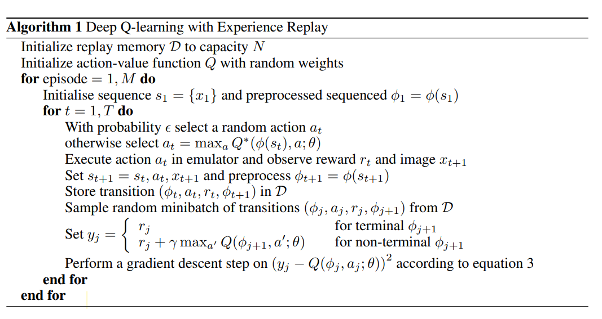
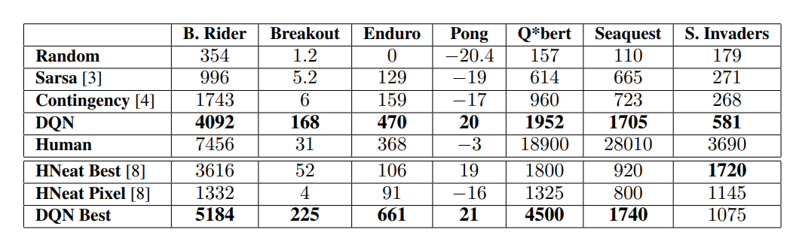

## Playing Atari with Deep Reinforcement Learning

作者： Volodymyr Mnih, Koray Kavukcuoglu, David Silver, Alex Graves, Ioannis Antonoglou, Daan Wierstra, Martin Riedmiller

单位：Deepmind

论文链接：https://arxiv.org/abs/1312.5602

**亮点：作者提出了用深度学习模型来拟合价值函数，结合Q-Learning进行训练的深度强化学习算法DQN，并且在Atari 2600上进行了验证。**

### **Motivation (Why):** 

传统RL依赖手工特征和线性的价值函数，性能受限。DL的技术进步，可以在原始数据中提取高维信息，不需要再手工提取特征。如果把DL和RL结合起来，RL算法性能可以显著提升，但是这有以下两个问题要克服：

1. DL算法需要大量有标签的数据，而RL算法的训练只能返回一个标量的奖励，并且是稀疏、充满噪声和延迟的。
2. DL需要数据是独立同分布的，而RL算法的数据既不是独立的，分布也不是固定的。RL算法中的状态之间往往是高度相关的，而且RL的数据分布也会随着算法开始学习新的行为而改变。

### **Main Idea (What):** 

作者通过使用一个CNN网络和Q-Learning算法结合的DQN算法来解决上述问题。具体来说，动机中的DL算法需要大量有标签数据的问题是由Q-Learning训练中的Fixed Q-target思路解决的，而RL算法中数据不是独立同分布的问题是通过经验回放来缓解（alleviate）的。

### **Main Contribution (How):**

与之前TD-Gammon直接在On-policy的策略中学习不同，DQN采取了Off-policy的形式，将采样数据存在一个固定大小的名为经验回放池的集合中，训练中将集合划分成多个Mini-batch，采用SGD优化器更新权重。对于在Q-learning中使用经验回放策略来缓解非独立同分布的问题，本文提出的算法如下图所示：

以上是DQN完整的算法，算法根据 $\epsilon$ -贪婪策略在状态 $s_t$ 选择并执行一个行动 $a_t$，  观测系统给出的奖励 $r_t$ 以及采取动作后的游戏画面 $x_{t+1}$, 由于使用任意长度的历史作为神经网络的输入是很困难的，因此作者通过序列转换函数 $\phi()$，将序列 $s_{t+1} = s_t,a_t,x_t+1$ 转化成 状态向量 $s_{t+1}$, 使Q函数可以在固定长度的历史上工作。此外，作者利用一种被称为经验重放的技术， 将算法在不同回合中各时间步长采集的经验数据 $e_t = (s_t, a_t, r_t, s_{t+1})$ 汇总存放在一个经验重放存储器 $D=e_1，...，e_N$ 中。在算法内循环中需要对模型进行更新的时候，我们从存储样本的经验重放存储器中随机抽取样本，对模型参数进行更新。

**本文提出方法的优点：**

1. Q函数的输入是状态，不是状态-动作对，可以有效减少模型计算量。前者只需要一次计算，将不同动作作为输出层的神经元，选取值最大的那个动作，后者则需要对每个动作都进行一次计算。
2. 权重更新是SGD的形式，不是OGD的。可以提高样本利用率，并且对不同状态下不同行为对应Q函数的分布进行平均和平滑处理，避免算法不收敛。

**待改进的地方：**

经验回放部分只储存最近的经验，并且取样的时候是随机取样的，并不区分比较重要的样本，还因为内存问题不停地覆盖先前的经验。可以用更复杂的取样策略，来区分出哪些样本更重要并加以利用。

**结果：**

DQN在7个Atari 2600游戏上的得分有6个超过了最好方法，有3个游戏超过了人类专家，但在Q*bert、Seaquest、Space Invaders等游戏上与人类相差甚远，作者评价它们更具挑战性，需要要求网络找到可以延伸到更长时间尺度的策略。

**个人思考**

1. 作者在这7个游戏上用的是同一种网络和算法以及同样的超参数。
2. 可能是为了突出这是第一篇DL和RL的文章，作者在文中不停地强调DQN用的就是游戏的原始图像，没有做任何人工提取特征的工作，并且除迫不得已的原因外（游戏设置问题）在训练和测试都没有对超参数进行改动。
3. 作者前文中也提到了非线性价值函数往往缺少收敛性的保证，这也导致了之前的大量研究都是用收敛性的更好的线性价值函数。但在DQN的实验中仍没有做收敛性的理论分析，只是说在大量的实验中我们没有遇到这个问题。

### 个人简介

吴文昊，西安交通大学硕士在读 

