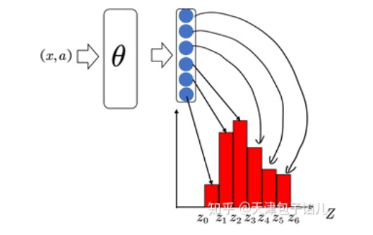
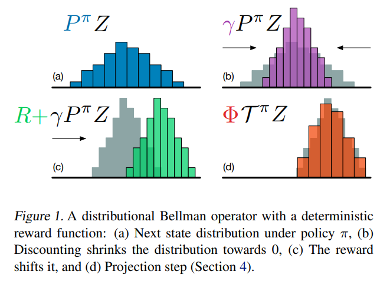
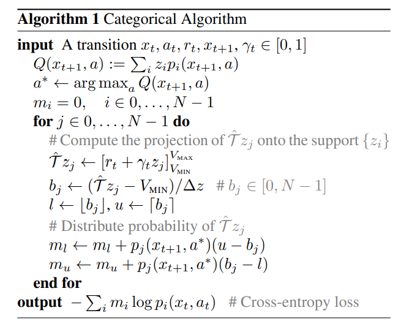
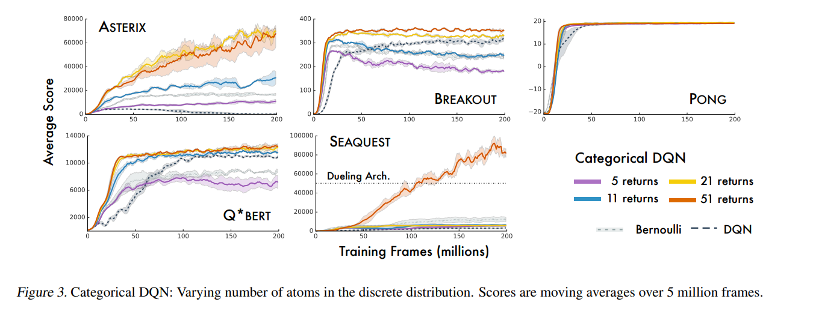
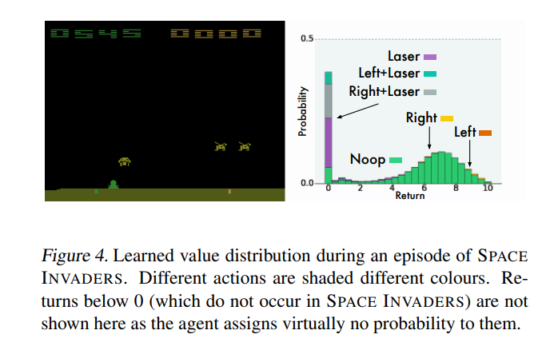
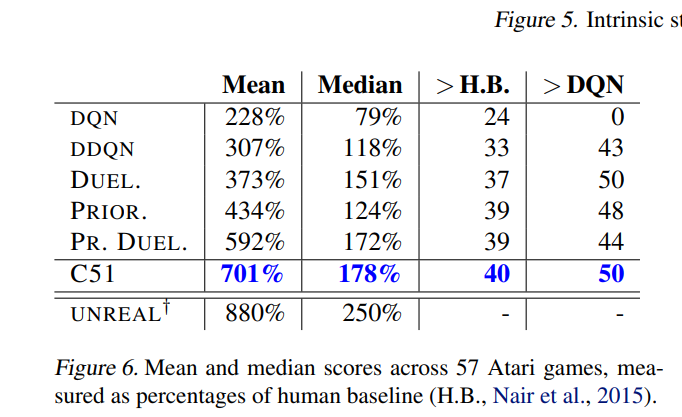

## A Distributional Perspective on Reinforcement Learning

作者：Marc G. Bellemare, Will Dabney, Rémi Munos

出处：DeepMind, ICML, 2017

论文链接：https://arxiv.org/abs/1707.06887

**亮点：作者提出了一种基于值分布的强化学习算法，将过去强化学习算法中对累计回报的期望进行建模改为对累计回报的分布进行建模，提出了一种新的算法，并做了实验验证，在Atari基准上超过了原有的算法**

### **Motivation (Why):** 

基于值的强化学习算法只对累计回报的期望进行建模，关于分布的很多信息丢失了，如方差，分位数等信息。在风险规避的场景，更倾向于选择方差较小而不是一味地选择均值高的行为。

### **Main Idea (What):** 

将原有的贝尔曼算子改为分布式贝尔曼算子，并给出了相关性质的证明，将原有的价值函数在期望上收敛到一个固定数值的理论，改为了一套关于价值函数在分布上收敛到一个固定的理论。

**贝尔曼方程**

经典的基于价值的强化学习方法尝试使用期望值对累积回报进行建模，表示为价值函数$V(x)$ 或动作价值函数 $Q(x,a)$，然后智能体把价值函数当成“地图”，根据指引选择不同状态下的行为。强化学习通常使用贝尔曼方程来描述价值函数
$$
\begin{aligned}
&Q^\pi(x, a):=\mathbb{E} Z^\pi(x, a)=\mathbb{E}\left[\sum_{t=0}^{\infty} \gamma^t R\left(x_t, a_t\right)\right] \\
&x_t \sim P\left(\cdot \mid x_{t-1}, a_{t-1}\right), a_t \sim \pi\left(\cdot \mid x_t\right), x_0=x, a_0=a
\end{aligned}
$$
其中，$Z^\pi$ 表示回报是沿着智能体在策略 $\pi$ 下与环境互动的轨迹所获得的折扣奖励的总和。策略 $\pi$ 的价值函数 $Q^\pi$ 描述了从状态 $x \in X$ 采取动作 $a \in A$ ，然后根据 $\pi$ 获得的期望回报。贝尔曼方程也可以被改写成如下迭代形式:
$$
Q^\pi(x, a)=\mathbb{E} R(x, a)+\gamma \underset{P, \pi}{\mathbb{E}} Q^\pi\left(x^{\prime}, a^{\prime}\right)
$$
在强化学习中，我们通常感兴趣的是采取动作使回报最大化。最常见的方法是使用最优方程:
$$
Q^*(x, a)=\mathbb{E} R(x, a)+\gamma \mathbb{E}_P \max _{a^{\prime} \in \mathcal{A}} Q^*\left(x^{\prime}, a^{\prime}\right) .
$$
该方程具有唯一的不动点 $\mathrm{Q}^*$ ，即最优价值函数，对应于最优策略集 $\pi^*\left(\right.$ 当 $\mathbb{E}_{a \sim \pi^*} Q^*(x, a)=\max _a Q^*(x, a)_{\text {时， }} \pi^*$ 是最优的 $)$ 。 我们将价值函数视为 $\mathbb{R}^{\mathcal{X} \times \mathcal{A}}$ 中的向量，并将期望奖励函数也视为这样的向量。在这种情况下，Bellman算子和最优算子T定义如下:
$$
\begin{aligned}
\mathcal{T}^\pi Q(x, a) &:=\mathbb{E} R(x, a)+\gamma \underset{P, \pi}{\mathbb{E}} Q\left(x^{\prime}, a^{\prime}\right) \\
\mathcal{T} Q(x, a) &:=\mathbb{E} R(x, a)+\gamma \mathbb{E}_P \max _{a^{\prime} \in \mathcal{A}} Q\left(x^{\prime}, a^{\prime}\right)
\end{aligned}
$$
这些算子非常有用，很多强化学习算法都建立于此。特别地，它们都是压缩映射，并且它们在某些初始$Q_0$上的重复应用收敛到$Q^pi$或$Q^*$。

**分布式贝尔曼方程**

以上贝尔曼方程是基于期望的贝尔曼方程，描述的是三个随机变量期望之间的关系，即$Q^\pi(x, a), \mathbb{E} R(x, a), \gamma \underset{P, \pi}{\mathbb{E}} Q^\pi\left(x^{\prime}, a^{\prime}\right)$。其中第一项后后两项的加和，故也为期望的形式。分布式贝尔曼方程，将随机变量的期望用随机变量本身来替代，即：
$$
Z(x, a)=R(x, a)+\gamma Z(X^{\prime}, A^{\prime})
$$
其中，$Z(x,a)$ 是表示 $(x, a)$下收益的随机变量，$R(x,a)$ 表示当前回报的随机变量,$\gamma Z(X^{\prime}, A^{\prime})$ 是关于下一状态折现后收益的随机变量，物理意义上没有变化。

值分布贝尔曼算子${T}^\pi$的更新公式：
$$
\begin{aligned}
\mathcal{T}^\pi Q(x, a) &:=R(x, a)+\gamma P^\pi Z\left(x,a\right) 
\end{aligned}
$$
其中，
$$
\begin{aligned}
&P^\pi Z\left(x,a\right) :\overset{D}{=} Z(X^{\prime}, A^{\prime})
\\
& X \sim P\left(\cdot \mid x, a\right), A^\prime \sim \pi\left(\cdot \mid X^\prime\right)
\end{aligned}
$$
**对分布进行估计的优点：**

1. 很多时候均值不能反应分布特点
2. 若不同行为期望相同，方差不同，仅仅考虑均值就不能做出正确选择。

### **Main Contribution (How):**

C51算法由两个重要的过程组成，参数化分布，投影贝尔曼更新。

**过程1：参数化分布**

在任何状态-动作对(x,a)处，累计折扣回报都是一个分布，在对这个分布进行表示上，C51采取了对随机变量空间离散化，再将随机变量建模为在这些离散空间上表示的加和，假设折扣累计回报$Z$的最大值为 $V_{M A X}$ ，最小值为 $V_{M I N}$ ，并将最小值与最大值之间的区间均匀离散化为 $\mathrm{N} 个$区间，则每个等分支集为 $\left\{z_i=V_{\min }+i \Delta z: 0 \leq i<N, \Delta z:=\frac{V_{M A X}-V_{M I N}}{N-1}\right\}$，支集为概率密度不为0的点。因此我们可以对支集上的概率分布进建模
$$
Z_{\theta}(x,a) = z_i \quad w.p. \quad p_i(x,a):=\frac{e^{\theta_i(x,a)}}{\sum_je^{\theta_j(x,a)}}
$$
其中w.p.为with probability的缩写。

上述图片参考自[知乎回答]([C51-值分布强化学习 - 知乎 (zhihu.com)](https://zhuanlan.zhihu.com/p/337209047))，形象地表述出了C51算法将状态-动作对(x,a)输出至函数分布的过程

**过程2：投影贝尔曼更新**

(a)图中蓝色部分为下一个状态动作对的状态分布，经过折扣系数$\gamma$作用后变为(b)图中紫色部分，与常数随机变量回报相加后，平移后变为(c)图中映射部分。显然可以看出，值分布贝尔曼操作符是收缩的，故最终是可以收敛的。但同时会在值分布贝尔曼操作符一次又一次作用下离开原有的定义域，超出前文所述离散化的支集的范围，故我们需要一个映射$\phi$将更新后的随机变量投影到最开始的离散化支集上，这就是投影贝尔曼更新

**整体算法**

以上是C51算法整体的更新思想如下。将状态动作对映射到一个分布上去，然后一次一次迭代这个分布，使用Q-Learning的思想，将现有分布和更新后分布的差值当作损失，更新网络的参数，直到这个分布收敛到一个固定的分布。在这个过程中有以下难点：1.如何表示一个分布，2. 如何衡量两个分布的差值。过程1和过程2分别解决了这两个问题。

**结果：**

上图是不同数量固定区间的算法在不同任务下的表现，算法最终取名为C51是因为在消融实验后发现将概率分布表示为51各固定区间的概率加和后效果最佳。

Q函数在实验进行中一个时刻分布情况，图中可以明确看出各个动作的好坏

作者将C51与DQN，双重DQN，对偶结构DQN和优先回放DQN进行了比较， 比较训练期间取得的最优评估分数，发现C51明显优于其他算法。并且发现C51在许多游戏中（尤其是SEAQUEST）大大超越了当前的最新技术水平。一个特别引人注目的事实是该算法在稀疏奖励游戏有着卓越表现。

**本文提出方法的优点：**

1. C51算法的卷积神经网络的输出不再是行为值函数，而是支点处的概率，神经网络学习的目标由数值变为一个分布。可以使学到的内容除了数值以外的更多信息，即整个Q函数分布。
2. C51在奖励稀疏的任务下表现更好，因为系数的奖励在分布式的传播中相对不容易丢失
3. C51算法的框架虽然仍是DQN算法，但损失函数不再是均方差和，而是KL散度，可以更好地描述两个分布之间的差别。

### 个人简介

吴文昊，西安交通大学硕士在读，联系方式:wwhwwh05@qq.com

