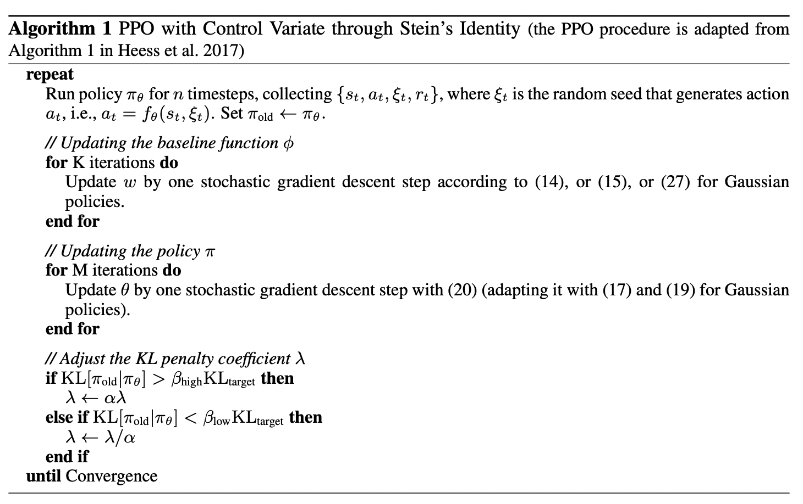
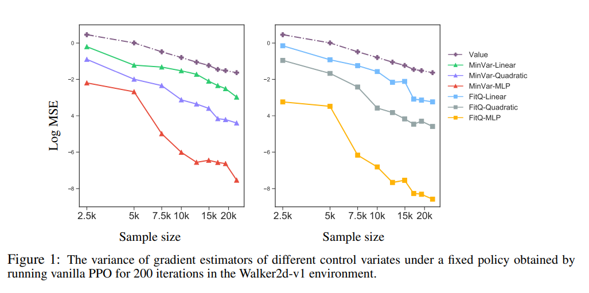
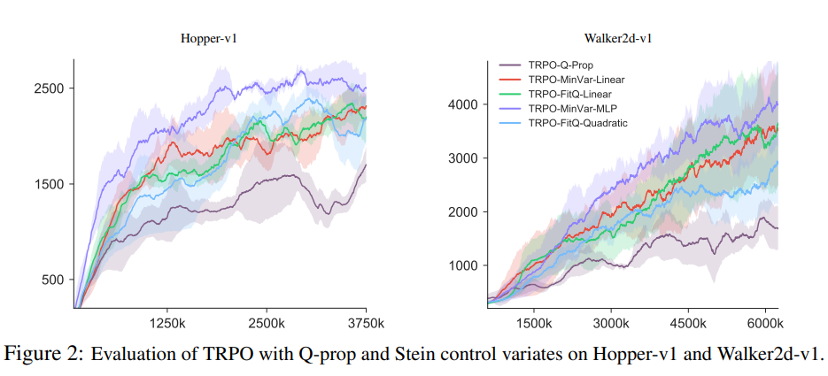
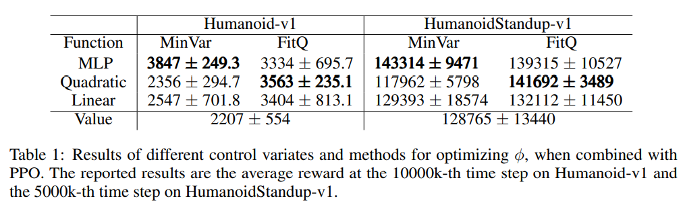
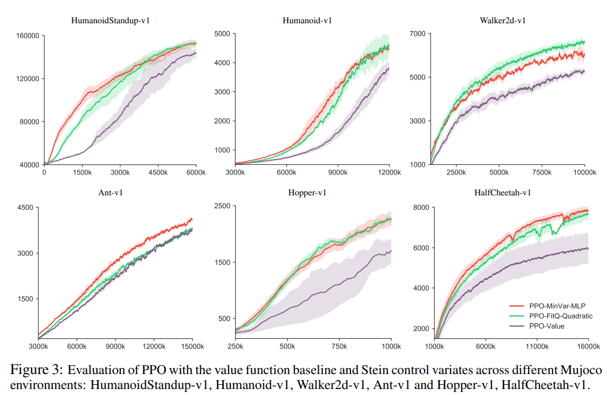

## Action-depedent Control Variates for Policy Optimization via Stein's Identity

作者：Hao Liu, Yihao Feng, Yi Mao, Dengyong Zhou, Jian Peng, Qiang Liu

出处：ICLR 2018

论文链接：https://arxiv.org/abs/1710.11198

**亮点：提出了一种在策略梯度中降低估计量方差的方法，并建立起了一套构建基线函数的方法，可以在训练的过程中降低方差，提升样本利用率**

### **Motivation (Why):** 

策略梯度算法在梯度估计上往往方差较大，导致训练时样本利用率较差，需要用很多的样本数据才能得到方差较小的估计量。之前在估计的时候用和状态相关的基线来降低方差，但效果并不好，这篇文章研究了用状态和动作都相关的基线来降低方差。

### **Main Idea (What):** 

#### **策略梯度回顾**

**策略梯度**

强化学习问题可以理解为一个关于环境状态 $s \in S$ 和智能体行动 $a \in A$ 的马尔可夫决策过程，在一个未知的环境下，该过程由一个转换概率 $T\left(s^{\prime} \mid s, a\right)$ 和一个奖励$r(s, a)$ 紧随在状态$s$下执行的行动 $a$。智能体的行动 $a$是由策略 $\pi(a \mid s)$ 决定的。在策略梯度方法中，我们考虑一组候选政策 $\pi_\theta(a \mid s)$，其中 $\theta$ 是参数，通过最大化预期累积奖励或收益获得最佳政策。
$$
J(\theta)=\mathbb{E}_{s \sim \rho_\pi, a \sim \pi(a \mid s)}[R(\tau)],
$$
 $J(\theta)$ 的梯度可以写为
$$
\nabla_\theta J(\theta)=\mathbb{E}_\pi\left[\nabla_\theta \log \pi(a \mid s) Q^\pi(s, a)\right],
$$
其中

 $$Q^\pi(s, a)=\mathbb{E}_\pi\left[\sum_{t=1}^{\infty} \gamma^{t-1} r\left(s_t, a_t\right) \mid s_1=s, a_1=a\right]$$  

对$\nabla_\theta J(\theta)$ 估计最简单的方式就是采集很多 $\left\{\left(s_t, a_t, r_t\right)\right\}_{t=1}^n$ 样本，然后进行蒙特卡洛估计
$$
\hat{\nabla}_\theta J(\theta)=\frac{1}{n} \sum_{t=1}^n \gamma^{t-1} \nabla_\theta \log \pi\left(a_t \mid s_t\right) \hat{Q}^\pi\left(s_t, a_t\right),
$$
其中 $\hat{Q}^\pi\left(s_t, a_t\right)$是$Q^\pi\left(s_t, a_t\right)$ 的估计量，比如 $\hat{Q}^\pi\left(s_t, a_t\right)=\sum_{j \geq t} \gamma^{j-t} r_j$。

但是这种方法估计出来的方差很多所以人们引入了控制变量来保证在期望不变的情况下降低方差

**控制变量**：

在估计期望 $\mu=\mathbb{E}_\tau[g(s, a)]$ 的时候找一个方程 $f(s, a)$ 满足$\mathbb{E}_\tau[f(s, a)]=0$.。这样就可以用如下估计量来估计$\mu$
$$
\hat{\mu}=\frac{1}{n} \sum_{t=1}^n\left(g\left(s_t, a_t\right)-f\left(s_t, a_t\right)\right),
$$
方差$\operatorname{var}_\tau(g-f) / n$, 期望仍为0。这里的关键问题在于要找符合要求的$f$。在以前的研究中，一般都用状态函数 $V(s)$ 的估计量或者常数来做控制变量，因为这类函数不会改变计算梯度时估计量的方差。引入控制变量后的梯度的估计量如下：
$$
\hat{\nabla}_\theta J(\theta)=\frac{1}{n} \sum_{t=1}^n  \nabla_\theta \log \pi\left(a_t \mid s_t\right) (\hat{Q}^\pi\left(s_t, a_t\right)-\phi(s_t)),
$$
但是只用和状态相关的函数来做控制变量是无法将方差降低到0的，理想的情况我们想用一个和动作，状态都相关的函数来做控制变量。

#### Stein控制变量的梯度下降算法：

通过Stein公式引入一个和动作，状态都相关的控制变量$\phi(s,a)$ ，但是在引入的过程中，维度存在一些问题，所以通过参数重新选择的技巧，扩充了维度并给出了证明，得到Stein控制变量的构建方法，最后构建了一族Stein控制变量。

**Stein公式**

根据Stein公式，对于具有适当条件的 $\phi(s, a)$ 函数，可以得到，
$$
\mathbb{E}_{\pi(a \mid s)}\left[\nabla_a \log \pi(a \mid s) \phi(s, a)+\nabla_a \phi(s, a)\right]=0, \quad \forall s
$$
这给我们构建控制变量提供了一些思路。值得注意的是，上面公式的左边可以写作$\int \nabla_a(\pi(a \mid s) \phi(s, a)) d a$。

**Stein控制变量**

上面公式左边部分的维度和估计策略梯度的维度不一样，前者是根据 $a$ 来计算的，而后者是根据 $\theta$ 我们需要在 $\nabla_a \log \pi(a \mid s)$ 和 $\nabla_\theta \log \pi(a \mid s)$ 之间构建链接，以此来通过Stein不等式得到可以用于策略梯度的控制变量。 我们通过以下方法：

我们可以通过$a=f_\theta(s, \xi)$ 来表达 $a \sim \pi_\theta(a \mid s)$，其中 $\xi$ 是一个独立于 $\theta$ 的随机噪声。本文用$\pi(a, \xi \mid s)$来表示 $(a, \xi)$ 在给定 $s$ 上的分布。可以得到，$\pi(a \mid s)=\int \pi(a \mid s, \xi) \pi(\xi) d \xi$ 其中 $\pi(\xi)$是生成 $\xi$ 的概率密度， $\pi(a \mid s, \xi)=\delta(a-f(s, \xi))$， $\delta$是Delta函数

上图截自论文中，定理3.1填充了前文提到的维度差距，允许我们根据Stein不等式构造控制变量。所以紧接着在公式8，9中，作者将控制变量引入策略梯度中，并给出了估计量。

**控制变量构建**

在构建控制变量的时候，作者考虑了两种方法，一种是对Q函数进行估计，让$\phi(s,a)$尽可能地靠近$Q$函数，以此来降低方差，另一种是直接最小化估计量的方差。

### **Main Contribution (How):**

本文研究了Stein控制变量，是一种在策略梯度中降低方差的方法，可以提升样本效率。本文所提出的方法概括了以前的几种方法，并在几个具有挑战性的RL任务中证明了其实际优势。

#### 算法

#### 

运用Stein控制变量的PPO算法。

#### 实验

文本将所提出来方差降低的方法与PPO和TRPO算法结合，用在连续环境MuJoco中。证明了通过使用Stein控制变量构建的基线函数，可以显著提高样本利用率，提升训练速度。

本文所有的实验都使用的是高斯噪声，根据前文的讨论将基线函数的形式设定为$\phi_w(s, a)=\hat{V}^\pi(s)+\psi_w(s, a)$，其中$\hat{V}^\pi$ 是对价值函数的估计，$\psi_w(s, a)$ 是一个以$w$ 为参数的函数，$w$的设置思路分别为拟合Q函数 (FitQ)和最小化方差 (MinVar)。作者在实验中尝试了 $\psi_w(s, a)$ 的形式，包括线性，二次型，全连接神经网络，实验结果如下：

作者紧接着在Walker2d-v1和Hopper-v1环境下对TRPO算法进行了实验，发现所有用Stein控制变量来减小方差的算法都比以前Q-prop算法表现要好。

最后作者测试用Stein控制函数的PPO算法

#### 本文提出方法的优点：

1. 可以有效降低估计量方差，提升样本利用率。
2. 可以更灵活的构建基线函数，构建具有线性，二次型，非线性形式的基线函数。

### 个人简介

吴文昊，西安交通大学硕士在读，联系方式:wwhwwh05@qq.com

