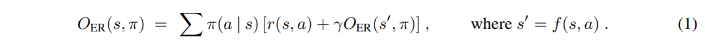
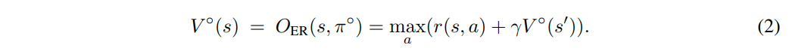
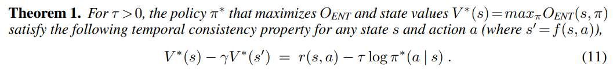
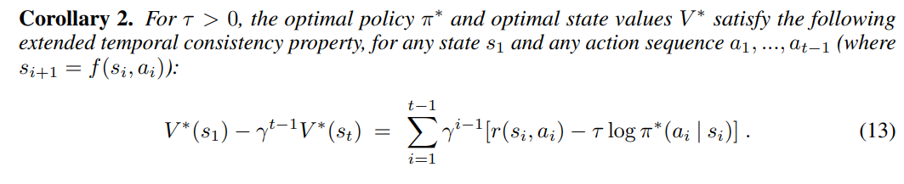
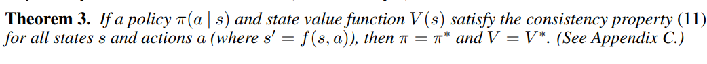
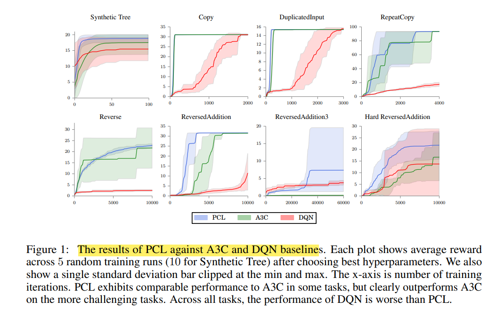
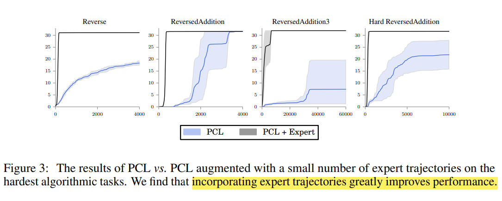

## Bridging the Gap Between Value and Policy Based Reinforcement Learning

作者：Ofir Nachum, Mohammad Norouzi, Kelvin Xu, and Dale Schuurmans

出处：NIPS'17, Google Brain

论文链接：https://arxiv.org/abs/1702.08892

**亮点：引入熵正则化，提出了一种稳定的异策略强化学习训练方法来**

### **Motivation (Why):** 

过往基于策略和基于价值的强化学习算法都有各自的优点和缺点，比如基于策略的算法大多是同策略算法，稳定但样本利用率低，基于价值的算法大多是异策略算法，样本利用率很高但算法不稳定。过去虽然有一些研究结合了两者的优点，但他们存在一些理论问题没有解决，所以仍留有很大的优化潜力。作者通过熵正则化研究了策略与softmax value consistency之间的关系，给出了一个稳定的基于策略的异策略强化学习算法。

### **Main Idea (What):** 

#### **符号设定**

核心的思想是在动作的选取上增加一个扰动，更改优化目标

作者用以下形式的$O_{ER}(s,\pi)$来表示在状态 $s$ 下执行策略 $\pi$ 后所能获得的期望收益，与我们常用的Q函数$Q(s,a)$表示相同意思。

按照贝尔曼公式的思路，我们有对于某个特定状态的最优值函数 $V^{\circ}(s)$,和最优策略$\pi^{\circ}$，定义如下：
$$
V^{\circ}(s)=\max _\pi O_{\mathrm{ER}}(s, \pi) \\
\pi^{\circ}=\operatorname{argmax}_\pi O_{\mathrm{ER}}(s, \pi).
$$
可以写成如下的迭代形式：

#### 一致性分析

作者在本文中以一个softmax的方式研究一个状态下的最优价值函数，softmax的含义是区别于hard max，不是每个状态一定要选择价值最大的那个行动，非黑即白，而是引入熵正则项来加入一点点灰色，选择的行动是”比较软“的价值最大，同时引入熵正则项还可以防止优化过程中收敛到次优解。

正则化后的期望奖励有以下形式，ENT是熵(Entropy)的缩写：
$$
O_{\mathrm{ENT}}(s, \pi)=O_{\mathrm{ER}}(s, \pi)+\tau \mathbb{H}(s, \pi),
$$
其中 $\tau$ 是一个可调节的参数，$\mathbb{H}(s, \pi)$ 定义如下：
$$
\mathbb{H}(s, \pi)=\sum_a \pi(a \mid s)\left[-\log \pi(a \mid s)+\gamma \mathbb{H}\left(s^{\prime}, \pi\right)\right] .
$$
正则化后的期望奖励也可以写成如下迭代形式：
$$
O_{\mathrm{ENT}}(s, \pi)=\sum_a \pi(a \mid s)\left[r(s, a)-\tau \log \pi(a \mid s)+\gamma O_{\mathrm{ENT}}\left(s^{\prime}, \pi\right)\right]
$$
用$V^*(s)=\max _\pi O_{\mathrm{ENT}}(s, \pi)$来表示状态 $s$ 的软最优值， $\pi^*(a \mid s)$ 表示最优策略，代表在状态 $s$ 选择可以达到软最优值的动作。这样最优策略的动作就不是固定的了，因为引入了熵正则项来扰动最大化的过程，因为熵这一项会鼓励策略变得不稳定。作者用如下形式表示最优策略：
$$
\pi^*(a \mid s) \propto \exp \left\{\left(r(s, a)+\gamma V^*\left(s^{\prime}\right)\right) / \tau\right\}
$$
带入前面的式子得到
$$
V^*(s)=O_{\mathrm{ENT}}\left(s, \pi^*\right)=\tau \log \sum_a \exp \left\{\left(r(s, a)+\gamma V^*\left(s^{\prime}\right)\right) / \tau\right\} .\\
Q^*(s, a)=r(s, a)+\gamma V^*\left(s^{\prime}\right)=r(s, a)+\gamma \tau \log \sum_{a^{\prime}} \exp \left(Q^*\left(s^{\prime}, a^{\prime}\right) / \tau\right)
$$
#### 最优价值和策略之间的一致性

将最优策略写作如下形式
$$
\pi^*(a \mid s)=\frac{\exp \left\{\left(r(s, a)+\gamma V^*\left(s^{\prime}\right)\right) / \tau\right\}}{\exp \left\{V^*(s) / \tau\right\}}
$$
两边取对数，可以得到相邻状态之间的软最优值关系

因为上面的定理是在相邻状态间的，可以反复利用这个公式，来得到一定间隔的两个状态之间的软最优值关系

接下来我们就可以依照上面的式子来进行软最优值估计和策略优化，作者同时给出了判断收敛性的定理 。

### **Main Contribution (How):**

引入了熵正则项，可以同时优化对状态价值的估计和策略。即可以用同策略的数据去训练也可以用异策略的。在不同游戏上都超越了基线算法

#### 算法

**路径一致性算法（PCL）**

在引入了熵正则化后，最优价值函数和最优策略之间的这个关系，可以让我们在沿着一串路径寻找最优策略的同时寻找最优价值函数。作者定义以下一致性函数

$$
C\left(s_{i: i+d}, \theta, \phi\right)=-V_\phi\left(s_i\right)+\gamma^d V_\phi\left(s_{i+d}\right)+\sum_{j=0}^{d-1} \gamma^j\left[r\left(s_{i+j}, a_{i+j}\right)-\tau \log \pi_\theta\left(a_{i+j} \mid s_{i+j}\right)\right].
$$
其中，$s_{i: i+d} \equiv\left(s_i, a_i, \ldots, s_{i+d-1}, a_{i+d-1}, s_{i+d}\right)$ 是一个长度为 $d$ 的子轨迹。训练算法的目标是找到可以使一致性尽可能趋近于0的价值函数和策略。所以作者提出了路径一致性学习，PCL算法，优化目标可以写作如下形式。

$$
O_{\mathrm{PCL}}(\theta, \phi)=\sum_{s_{i: i+d} \in E} \frac{1}{2} C\left(s_{i: i+d}, \theta, \phi\right)^2
$$
参数更新梯度如下，

$$
\begin{aligned}
\Delta \theta & =\eta_\pi C\left(s_{i: i+d}, \theta, \phi\right) \sum_{j=0}^{d-1} \gamma^j \nabla_\theta \log \pi_\theta\left(a_{i+j} \mid s_{i+j}\right) \\
\Delta \phi & =\eta_v C\left(s_{i: i+d}, \theta, \phi\right)\left(\nabla_\phi V_\phi\left(s_i\right)-\gamma^d \nabla_\phi V_\phi\left(s_{i+d}\right)\right)
\end{aligned}
$$
其中，PCL更新既可以用同策略采集的在线数据，也可以用回放缓存中策异略采集的离线数据。在本文中，作者是混合从这两种数据中采样来更新的。

**统一路径一致性算法（UPCL）**

上述算法在找最优价值函数和最优策略的时候，是在对两个独立的模型进行优化，作者通过 Q 函数的形式，将策略和价值写进一个式子里，
$$
\begin{aligned}
V_\rho(s) & =\tau \log \sum_a \exp \left\{Q_\rho(s, a) / \tau\right\} \\
\pi_\rho(a \mid s) & =\exp \left\{\left(Q_\rho(s, a)-V_\rho(s)\right) / \tau\right\}
\end{aligned}
$$
其中 $\rho$ 是这个统一模型的参数，更新方式如下：
$$
\begin{aligned}
\Delta \rho= & \eta_\pi C\left(s_{i: i+d}, \rho\right) \sum_{j=0}^{d-1} \gamma^j \nabla_\rho \log \pi_\rho\left(a_{i+j} \mid s_{i+j}\right)+ \\
& \eta_v C\left(s_{i: i+d}, \rho\right)\left(\nabla_\rho V_\rho\left(s_i\right)-\gamma^d \nabla_\rho V_\rho\left(s_{i+d}\right)\right)
\end{aligned}
$$

#### 实验

作者将PCL算法，UPCL算法和现有的A3C,DQN算法在几个特定任务上进行对比。

PCL算法的表现在一些任务上和A3C不相上下，在一些有挑战性的任务上超越了A3C算法。在所有的人任务上，PCL的表现都比DQN算法要好。

PCL和UPCL的训练表现对比。

在训练过程中，加入了一下比较好的专家数据的PCL-expert和PCL算法性能的对比。

### 个人简介

吴文昊，西安交通大学硕士在读，联系方式:wwhwwh05@qq.com

