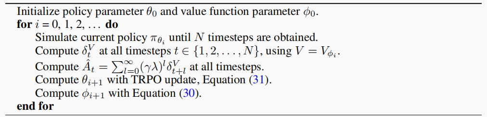
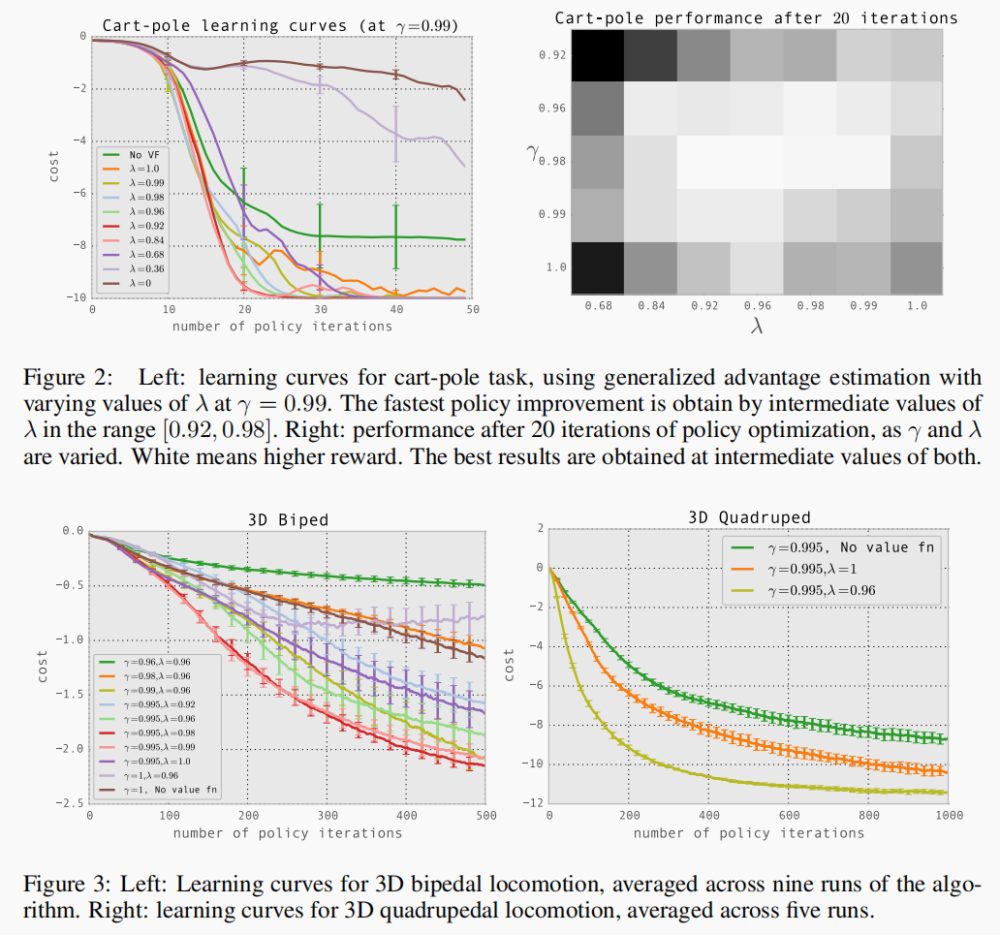
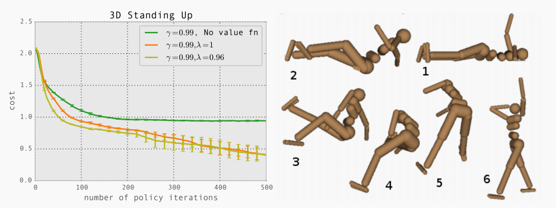

## High-Dimensional Continuous Control Using Generalised Advantage Estimation

## 广义优势估计(GAE)：高维连续空间的控制的解决方案

> **John Schulman, Philipp Moritz, Sergey Levine, Michael I. Jordan and Pieter Abbeel**
>
> Department of Electrical Engineering and Computer Science
>
> University of California, Berkeley
>
> {joschu,pcmoritz,levine,jordan,pabbeel}@eecs.berkeley.edu
>
> http://arxiv.org/abs/1506.02438

### 1 引入与概览 / Introduction

* 强化学习需要解决的两个重大问题分别是**奖励分配问题（credit assignment problem）**和**远期奖励问题（distal reward problem）**，我们通常使用值函数可以巧妙地解决第一个问题（在DRL中直接将其交给神经网络去完成）
* 在使用**随机梯度上升算法（stochastic gradient ascent）**时我们可以得到梯度矩阵的无偏估计（unbiased estimation），但其高方差的特性在时间角度上显得让人无法承受（因为这样带有较大噪声的估计时序上与其他估计相混合，会变成什么样子我们也不得而知）
* 相比于经验回报（Empirical Return），**演员-评论员（Actor-Critic）算法**以偏差（bias）为代价采用神经网络来估计值函数
* 作者认为，高数据量会导致模型过拟合（高方差），但更严重的是引起的偏差无法用数据量解决——这可能导致模型发散或收敛到局部极小值
* **作者提供了一族策略梯度估计函数$\text{GAE}(\gamma, \lambda),~ \gamma, \lambda \in [0,1]$，在引入可承受的偏差同时极大降低方差**
* **作者使用GAE在高难度的3D控制环境中进行训练**

### 2 预备 / Preliminaries

#### 2.1 估计策略梯度

已知从某分布$\rho_0$采样的初始状态$s_0$，按照策略$\pi(a|s)$和状态转换分布函数$P(s'|s, a)$生成一条轨迹（trajectory）。在每个时间节点（time step）时智能体收到一个奖励$r_t = r(s_t, a_t, s_{t+1})$。因为我们需要将期望回报最大化，因此我们对期望回报$\mathbb E\left[\displaystyle \sum_{t=0}^\infty r_t \right]$求梯度：
$$
g := \nabla_\theta \mathbb E\left[ \sum_{t=0}^\infty r_t  \right] = \mathbb  E\left[ \sum_{t = 0}^\infty \Psi_t\nabla_\theta \log \pi_\theta(a_t|s_t) \right]
$$

> 对于上述等式的详细推导过程，在此给出一个不严谨但方便理解的版本，以值函数对参数求偏导为例：
> $$
> \begin{align}
> \frac{\part V(s;\boldsymbol \theta)}{\part \boldsymbol \theta} &= 
> \frac{\part \sum_a \pi(a|s; \boldsymbol \theta)\cdot Q_\pi(s, a)}{\part \boldsymbol \theta}
> \\
> &= \sum_a\frac{\part \pi(a|s; \boldsymbol \theta)\cdot Q_\pi(s, a)}{\part \boldsymbol \theta}
> \\
> &= \sum_a\frac{\part \pi(a|s; \boldsymbol \theta)}{\part \boldsymbol \theta}\cdot Q_\pi(s, a) & \text{assume } Q_\pi \text{is independent of }\boldsymbol \theta 
> \\
> &= \sum_a\pi(a|s; \boldsymbol \theta) \cdot \frac{\part \log \pi(a|s; \boldsymbol \theta)}{\part \boldsymbol \theta}\cdot Q_\pi(s, a) &\text{chain rule}
> \\
> &= \mathbb E_A\left[\frac{\part \log \pi(A|s; \boldsymbol \theta)}{\part \boldsymbol \theta}\cdot Q_\pi(s, A)\right]
> \end{align}
> $$
> Remark. 证明参考自[Shusen Wang, Deep Reinforcement Learning](https://www.bilibili.com/video/BV1rv41167yx/?is_story_h5=false&p=1&share_from=ugc&share_medium=android&share_plat=android&share_session_id=9b64fa10-a83a-4a62-8104-4b8bb316ebdb&share_source=WEIXIN&share_tag=s_i&timestamp=1667564212&unique_k=TKDw0q7&vd_source=81247b204d5fa64ef8de53fe75ccd121)

式中的$\Psi_t$可以被下面的这些表达式替换:

* $\displaystyle \sum_{t=0}^\infty r_t$：奖励总和
* $\displaystyle \sum_{t'=t}^\infty r_{t'}$：某时刻后的奖励总和
* $\displaystyle \sum_{t'=t}^\infty r_{t'} - b(s_t)$：减去了基准（baseline）的某时刻后奖励总和
* $Q^\pi(s_t, a_t)$：Q函数
* $\displaystyle A^\pi (s_t, a_t) := Q^\pi(s_t, a_t) - V^\pi(s_t)$：**优势函数（advantage function）**
* $r_t + V^\pi(s_{t+1})- V^\pi(s_t)$：TD残差（temporal difference residual）

#### 2.2 优势函数

仔细观察上面的几个表达式，我们会发现优势函数和第三项十分相似——如果我们将基准换成值函数，那么他只和优势函数相差一个常数。作者在文中提到在上述这么多可选项中优势函数引入的方差最低。这结合求梯度的公式不难理解。我们事先约定$V^\pi$是智能体位于某状态的未来回报的**期望**，这样优势函数就可以很好的解构成有明确意义的两部分：
$$
\displaystyle A^\pi (s_t, a_t) := \underbrace{Q^\pi(s_t, a_t)}_{在t时刻采用动作a_t后的期望回报} - \underbrace{V^\pi(s_t)}_{智能体还没有采取行动时的期望回报}
$$
我们又注意到在梯度中$A^\pi$和$\nabla_\theta \log \pi_\theta$是相乘的关系，我们就可以在训练过程中增加 “更好的” 动作被选上的概率，因为$Q$函数值低于平均值的对应的优势函数为负值，这样会让参数沿着梯度的相反方向走；同理更好的动作会让参数沿着梯度方向走，这就可以推出上面的结论。

#### 2.3 无偏的优势估计

我们在此基础上更进一步：引入参数$\gamma$：
$$
\begin{align}
V^{\pi,\gamma}(s_t) & = \mathbb E_{s_{t+1}:\infty,a_{t}:\infty}
\left[ \sum_{l = 0}^\infty \gamma^lr_{t + l} \right]
\\
Q^{\pi,\gamma}(s_t, a_t) & = \mathbb E_{s_{t+1}:\infty,a_{t+1}:\infty}
\left[  \sum_{l = 0}^\infty \gamma^lr_{t + l}  \right]
\\
A^{\pi, \gamma}(s_t, a_t) & = Q^{\pi,\gamma}(s_t, a_t) - V^{\pi,\gamma}(s_t)
\end{align}
$$

> Remark. 期望符号的下标意义是求期望的区间。例如，值函数的区间是从本次动作和下次状态开始直至结束，而Q函数则已知当此动作，因此它的下标是从$a_{t+1}$开始的

这样我们可以得到策略梯度$g$的一个估计：
$$
g^\gamma 
:= \mathbb  E_{s_{0}:\infty,a_{0}:\infty} \left[ \sum_{t = 0}^\infty A^{\pi, \gamma}(s_t, a_t) \nabla_\theta \log \pi_\theta(a_t|s_t) \right]
$$
在我们往下讲之前先介绍一个概念并不加证明的引入一些命题（如果对证明有兴趣的话可以参看[原论文](http://arxiv.org/abs/1506.02438)）

**定义1 $\gamma$-无偏（$\gamma$-just）**	若$A^{\pi,\gamma}$的某个逼近$\hat A$满足对任意的$t$，都有
$$
\mathbb E_{s_{0}:\infty,a_{0}:\infty} 
\left[ 
\sum_{t = 0}^\infty \hat A_t(s_{0:\infty}, a_{0:\infty}) 
\nabla_\theta \log \pi_\theta(a_t|s_t) 
\right] 
= 
\mathbb E_{s_{0}:\infty,a_{0}:\infty} \left[ \sum_{t = 0}^\infty A^{\pi, \gamma}(s_t, a_t) \nabla_\theta \log \pi_\theta(a_t|s_t) \right]
$$
我们称$\hat A$是$\gamma$-无偏的。显然满足条件的$\hat A$带入上式，其值总是等于$g^\gamma$.

**命题1**	若不论我们取怎样的$(s_t,a_t)$，$\hat A$总是可以被写为$\hat A_t(s_{0:\infty}, a_{0:\infty}) = Q_t(s_{t:\infty}, a_{t:\infty}) - b_t(s_{0:t}, a_{0:t-1})$，且$\mathbb E_{s_{t+1}:\infty, a_{t+1}:\infty|s_t, a_t}[Q_t(s_{t:\infty}, a_{t:\infty})] = Q^{\pi,\gamma}(s_t, a_t)$，则$\hat A$是$\gamma$-无偏的.

可以验证，下面的几个式子都是$\gamma$-无偏的：

* $\displaystyle \sum_{l=0}^\infty \gamma^l r_{t + l}$：值函数的无偏估计
* $Q^{\pi, \gamma}(s_t, a_t)$：令第二项为零
* $A^{\pi,\gamma}(s_t, a_t)$：令第二项为值函数
* $r_t + \gamma V^{\pi, \gamma}(s_{t + 1}) - V^{\pi, \gamma}(s_t)$：和上一项相同

### 3 估计优势函数 / Advantage Function Estimation

实际上我们不可能对梯度中的项进行求期望工作，我们在实际情况中往往选择采样平均的方式来估计策略梯度：
$$
\hat g = \frac 1N \sum_{n = 1}^N \sum_{t = 0}^\infty \hat A_t^n \nabla_\theta \log \pi_\theta(a_t^n|s_t^n)
$$
注意到$\mathbb E_{s_{t+1}}[\delta_t^{V^{\pi, \gamma}}] = A^{\pi, \gamma}(s_t, a_t)$，我们构造这样的和：
$$
\hat A_t^{(k)} := \sum_{l=0}^{k - 1} \gamma^l \delta_{t + l}^V = -V(s_t) + \sum_{l = 0}^{k - 1} \gamma^l r_{t + l} + \gamma^k V(s_{t + k})
$$
在此基础上我们可以定义**广义优势估计（generalised advantage estimation）**
$$
\begin{align}
\hat A^{\text{GAE}(\gamma, \lambda)}_t :=& (1 - \lambda)\left( \hat A^{(1)}_1 + \lambda\hat A^{(2)}_1 + \lambda^2\hat A^{(3)}_1 + \cdots \right)\\
=& (1 - \lambda) (\delta^V_t + \lambda(\delta^V_t + \gamma\delta^V_{t + 1}) + \lambda^2(\delta^V_t + \gamma\delta^V_{t + 1}+ \gamma ^ 2\delta_{t + 2}^V) + \cdots)\\
=& (1 - \lambda)(\delta_t^V(1 + \lambda + \lambda^2 +\cdots) + \delta_{t+1}^V(\lambda + \lambda^2 + \lambda^3+\cdots) +\cdots)\\
=& \sum_{l=0}^\infty (\gamma\lambda)^l \delta_{t + l}^V
\end{align}
$$
我们考虑GAE的两种极端情况：
$$
\begin{align}
\hat A^{\text{GAE}(\gamma, 0)}_t &=  \delta_t &= r_t + V(s_{t+1})- V(s_t) \\
\hat A^{\text{GAE}(\gamma, 1)}_t &= \sum_{l=0}^{\infty} \gamma^l \delta_{t + l}^V &=-V(s_t) + \sum_{l = 0}^{\infty} \gamma^l r_{t + l}~\,
\end{align}
$$
若$\lambda = 0$，如果我们忽略$V$的估计误差，那么它虽然是$\gamma$-无偏的，但引入了高方差；$\lambda = 1$时方差相较于上一种情况更小，但当且仅当$V =V^{\pi, \gamma}$时才是$\gamma$无偏的，否则将会引入偏差。作者提出的GAE目的在于在两个极端之间找到一个平衡点（makes a compromise）。

再次观察上面的推导，我们不难发现

1. $\gamma$主要决定值函数$V$的缩放大小（scale），如果$\gamma < 1$则引入偏差（这个不难理解）
2. $\lambda < 1$且估计的$V$不准时会引入偏差

作者研究发现，**$\lambda$的最佳值比$\gamma$的最佳值要小很多，他们认为这是$\lambda$即使在$V$不准时引入的偏差要比$\gamma$小很多导致的。**基于上面的分析我们可以使用GAE给策略梯度做一个更好的估计：
$$
g^\gamma \approx \mathbb E \left[ 
\sum_{t = 0}^\infty \nabla_\theta \log \pi_\theta(a_t|s_t) \hat A_t^{\text{GAE}(\gamma, \lambda)}
\right] = 
\mathbb E \left[ 
\sum_{t = 0}^\infty \nabla_\theta \log \pi_\theta(a_t|s_t) \sum_{l=0}^\infty (\gamma\lambda)^l \delta_{t + l}^V
\right]
$$
其中第一个约等号去等当且仅当$\lambda = 1$

### 4 通过奖励函数设计解释GAE / Interpretations as Reward Shaping

**定义2 变换的奖励函数**	已知一个从状态空间$\mathcal S$到$\mathbb R$的任意标量函数$\Phi: \mathcal S \rightarrow \mathbb R$，以及奖励函数$r(s, a ,s')$，定义变换后的奖励函数$\tilde r$：
$$
\tilde r(s, a, s') := r(s, a, s') + \gamma \Phi(s') - \Phi(s)
$$
考虑带指数衰减的变换奖励函数序列和，我们发现它与奖励函数序列和仅差一个$\Phi$
$$
\sum_{l = 0}^\infty \gamma^l \tilde r(s_{t+l}, a_t, s_{t + l + 1})
 = 
 \sum_{l = 0}^\infty \gamma^l r(s_{t+l}, a_t, s_{t + l + 1}) - \Phi(s_t)
$$
我们可以仿照变换的奖励函数的定义来定义变换后的$V$，$Q$以及优势函数$A$:

* $\tilde Q^{\pi, \gamma}(s, a) = Q^{\pi, \gamma}(s, a) - \Phi(s)$
* $\tilde V^{\pi, \gamma}(s) = V^{\pi, \gamma}(s) - \Phi(s)$ *(论文中为$V(s, a)$，笔者认为应该是$V(s)$，**<u>原因是：</u>**）
* $\tilde A^{\pi, \gamma}(s, a) = (Q^{\pi, \gamma}(s, a) - \Phi(s)) - (V^{\pi, \gamma}(s) - \Phi(s)) = A^{\pi, \gamma}(s, a)$

> 作者在提出这三个函数时是按照逻辑的：
>
> 1. 通过指数衰减的序列和可以直接导出$\tilde Q$
>
> 2. 已经推导出$\tilde Q$以后根据$Q$和$V$的关系
>    $$
>    V(s) = \sum_{a \in \mathscr A} \pi(a|s)Q(s, a)
>    $$
>    若将$\tilde V$定义为上式右边的$\tilde Q$得到的结果，可以进行下列变换
>    $$
>    \tilde V(s) = \sum_{a \in \mathscr A} \pi(a|s)\tilde Q(s, a) =\sum_{a \in \mathscr A} \pi(a|s)[Q(s, a) - \Phi(s)]' = V(s) - \Phi(s)
>    $$
>
> 3. 已知$\tilde V$和$\tilde Q$可以自然地推出$\tilde A$
>
> Remark. 吴恩达等的论文（[Ng et al, 1999](http://luthuli.cs.uiuc.edu/~daf/courses/games/AIpapers/ml99-shaping.pdf)）中提出这样的变换不会影响最终的最优策略（optimal policy）

如果$\Phi$恰好等于$V^{\pi,\gamma}$，那么$\tilde V^{\pi,\gamma} \equiv 0$

若令$\Phi = V$我们就得到了GAE：
$$
\sum_{l=0}^\infty (\gamma \lambda)^l \tilde r(s_{t + l}, a_t, s_{t + l + 1}) = \sum_{l= 0}^\infty (\gamma \lambda)^l \delta_{t + l}^V = \hat A_t^{\text{GAE}(\gamma, \lambda)}
$$

---

为了更深入的了解变换中的参数$\gamma$和$\lambda$，我们引入下面的定义：

**定义3 响应函数**	
$$
\chi (l;s_t, a_t) := \mathbb E[r_{t + l}|s_t, a_t] - \mathbb E[r_{t + l}|s_t]
$$

可以看出这和我们先前定义的优势函数十分相似。事实上，我们不难验证
$$
A^{\pi, \gamma}(s, a) = \sum_{l  =0}^\infty \gamma^l \chi(l; s, a)
$$
通过上式我们得到：响应函数可以将优势函数在时序上进行解构的同时，也让我们将奖励分配问题量化：长时间的动作和与之对应的奖励关系与$l$远大于$0$时响应函数是否为零对应

我们将上面的表示带入策略梯度中期望函数中的那一项：
$$
\nabla_\theta \log \pi_\theta(a_t|s_t) \cdot A^{\pi, \gamma}(s_t, a_t)  = 
\nabla_\theta \log \pi_\theta(a_t|s_t) \sum_{l=0}^\infty \gamma^l \chi(l;s_t, a_t)
$$
如果$\gamma < 1$，我们丢弃$\displaystyle l \gg \frac 1{1 - \gamma}$的所有项，上式的估计误差随着$l$的增加而迅速下降。也就是说那些距离现在太过遥远的未来收益无法被模型遇见（“forgotten”）

如果$\tilde r$中的$\Phi = V^{\pi, \gamma}$，则当$l \ne0$时，响应函数恒为零，对应模型只关心立即得到的回报的情况。我们当然更希望能找到一个$V \approx V^{\pi,\gamma}$来使得时序信息可以传递。这样我们就回到了$\hat A_t^{\text{GAE}(\gamma, \lambda)}$的定义。

> 我们可以将$\lambda^l \delta_{t + l}^V$看作缩放后的TD residual，以引入偏差，使得$V \ne V^{\pi,\gamma}$

从响应函数的角度，我们又可以理解为取了一个更小的参数$(\gamma \lambda)$，并使模型无法预见$\displaystyle l \gg \frac 1{1 - \gamma\lambda}$的情形

### 5 逼近值函数 / Value Function Estimation

作者采用Monte Carlo方法使非线性参数的值函数向真实值进行逼近，并使用信任区域算法对更新步长进行限制：
$$
\begin{align}
\mathop{\text{minimize}}\limits_{\phi} ~~& \sum_{n = 1}^N \| V_\phi(s_n) - \hat V_n \|^2\\
\text{s.t.}~~& \frac 1N \sum_{n = 1}^N \frac{\| V_\phi(s_n) - V_{\phi_{old}}(s_n) \|^2}{2\sigma ^2} \le \varepsilon
\end{align}
$$
其中$\displaystyle \frac 1N\sum_{n = 1}^N \| V_{\phi_{old}}(s_n) - \hat V_n \|^2$

作者没有直接使用上面的方法，而是使用共轭梯度算法对上面的问题进行了近似，变成了下列所示的二次规划问题
$$
\begin{align}
\mathop{\text{minimize}}\limits_{\phi} ~~& g^T (\phi - \phi_{old}) \\
\text{s.t.}~~& \frac 1N \sum_{n = 1}^N (\phi - \phi_{old})^TH(\phi - \phi_{old}) \le \varepsilon
\end{align}
$$
其中$H$为优化目标的Hessian矩阵的Gauss-Newton近似: 
$$
\displaystyle H= \frac 1N\sum_n j_nj_n^T = \frac 1N \sum_n \nabla_\phi V_\phi(s_n) (\nabla_\phi V_\phi(s_n))^T
$$

### 6 算法与实践 / Experiments

**策略优化**

作者使用了TRPO来解决下列的受限制的优化问题：
$$
\begin{align}
\mathop{\text{minimize}}\limits_{\phi} ~~& g^T (\phi - \phi_{old}) \\
\text{s.t.}~~& 
\frac 1N \overline{D}_{KL}^{\theta_{old}}(\pi_{old}, \pi_{\theta}) \le \varepsilon\\
\text{where}~~&
L_{\theta_{old}}(\theta) = \frac 1N \sum_{n = 0}^N \frac{\pi_{\theta}(a_n|s_n)}{\pi_{\theta_{old}}(a_n|s_n)}\hat A_n\\
& \overline{D}_{KL}^{\theta_{old}}(\pi_{old}, \pi_{\theta}) = 
\frac 1N \sum_{n = 1}^N D_{KL}[\pi_{\theta_{old}}(\cdot | s_n) \| \pi_\theta(\cdot | s_n)]

\end{align}
$$
同样地，作者也通过将优化目标线性化以及将限制条件变成二次形式来进一步处理。

**算法**

**实践**

作者在倒立摆、双足运动、四组运动、站立这三个3D任务上采用相同的神经网络结构进行训练。结果如下：

### 7 讨论 / Discussion

* 策略梯度算法虽然可以将强化学习任务简化为无偏的随机梯度下降任务，但迄今为止（论文时间）其解决较为困难的控制问题的能力因其较高的采样复杂度而有所限制
* 作者提出了使用两个参数来平衡模型的方差和偏差的方法，并采用信赖域算法使模型在较为困难的控制问题中可以达到较好的效果
* 实验发现，$\lambda \in [0.9, 0.99]$时的效果最好，但仍然期待将来有方法可以自动调节$\lambda$的值
* 目前策略梯度误差与值函数估计误差之间的关系尚不明确，如果我们知道它们之间的关系，就可以根据策略梯度误差函数选择合适的值函数估计误差的度量
* 另一种可能的方法是通过相同的结构逼近策略和值函数，并使用GAE优化前者。但如何将其转化为数值优化问题及该方法的收敛性仍然有待考证。如果这种方案可行则会使得策略和值函数逼近是可以共用学习到的特征，以加快训练速度
* 作者虽然发现一阶的回报（$\lambda = 0$）会导致过大的偏差以致较差的模型表现，但有研究表明如果进行合适的调整，模型也可以正常运行，不过这些研究局限于较低维度的状态和动作空间中。将这两类方法在同意条件下进行比较于将来的研究十分有用

### 8 思考 / Reflection

* 作者对$\lambda$和$\gamma$的作用做了合理的解释，但如果将其乘积看作是一个整体，这似乎与$\gamma$没有区别？
  * 进一步解释？

