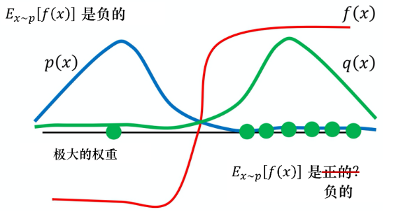
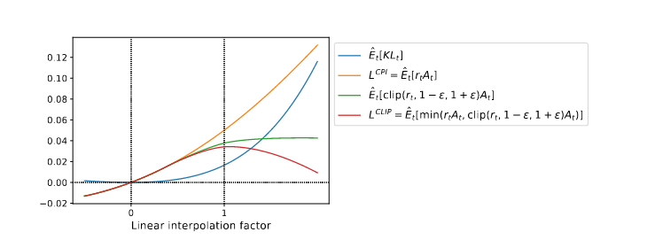
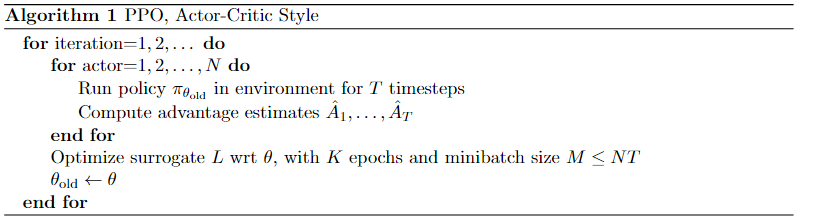
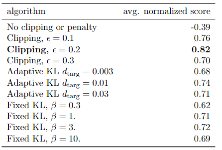
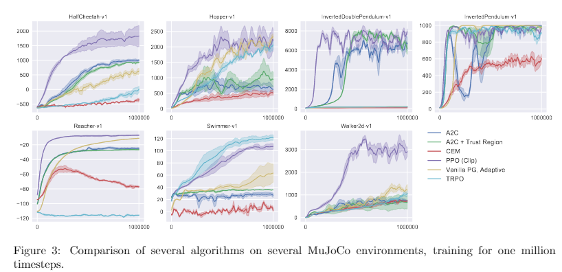

## Proximal Policy Optimization Algorithms论文剖析

John Schulman, Filip Wolski, Prafulla Dhariwal, Alec Radford, Oleg Klimov from OpenAI

### 〇. 文章信息

Proximal Policy Optimization Algorithms

John Schulman, Filip Wolski, Prafulla Dhariwal, Alec Radford, Oleg Klimov from OpenAI， 2017

https://arxiv.org/abs/1707.06347

### 一. 写作动机

近年来，人们提出了几种不同的利用神经网络函数逼近进行强化学习的方法。主要的竞争者为基于价值的方法DQN，其次基于策略的方法“Vanilla Policy Gradient”（也就是最基础的策略梯度方法简称VPG。*Vanilla是个有趣的词汇，本意为香草，因为是冰淇淋最基本的口味，所以一般用其代表‘最基本’的意思，学到了*），最后是信任区域/自然策略梯度方法（TRPO）。然而这三种方法存在严重的缺点：

1. Deep Q-Learning在解决一些**连续动作空间**的问题上表现不佳
2. VPG算法需要先根据当前策略函数采样一批次样本，使用样本更新后，该批次样本失效，需要重新采样，所以采样效率低下
3. TRPO设计复杂，不兼容参数共享，dropout等结构

本文的写作动机就是使用一种使用一阶优化的方法就获得了复杂TRPO的良好的性能（数据采样效率，鲁棒性）。

### 二. 背景知识简单介绍

#### 1. 策略梯度算法

策略梯度算法将策略 $\pi$ 参数化拟合成 $\pi _\theta$ ,再通过梯度上升的方法优化参数，最常用的策略梯度有这样的形式：

$$ \hat{g}=\hat{\mathbb{E}_t}[\nabla _{\theta}log \pi_\theta(a_t|s_t)\hat{A_t}] \tag{1}                                        $$

其中，$\hat{A_t}$为优势函数（Advantage Function）的估计量，$\mathbb{E}_t$为有限batch的平均量。可以反过来求得Loss-function：

$$ L(\theta)=\hat{\mathbb{E}}_t[\pi_\theta(a_t|s_t)\hat{A_t}](这里可能和原文不同，但是由于log函数单调性，其实实质是一样的) \tag{2}                                                   $$

工作的过程就是重复采样与模型优化。作者在这里说道：***听起来使用同一次采样的数据来多次更新策略的参数听起来十分诱人，但是后续实验证明了这样造成的影响是破坏性的***，这里的原因在下一部分会提及到。

#### 2. 重要性采样

##### （1）为什么要使用重要性采样？

首先回答上一部分提出的问题：**为什么同一次采样的数据无法直接用来多次更新？**

视线退回到策略梯度的推导。按照最初始的想法，我们想要最大化的是每一条完整的交互序列$\tau :(s_1,a_1,r_1,s_2,a_2,r_2...,s_n,a_n,r_n)$的累计奖励期望$\bar{R_\theta}(\tau)=p_\theta(\tau)R(\tau)$,通过计算策略梯度的形式通过梯度上升优化方法来更新参数，其中策略梯度为：

$\nabla \bar{R}_\theta=\mathbb{E}_{\tau\sim p_\theta(\tau)}[R(\tau)\nabla log(p_\theta(\tau))] \tag{3}                                                        $

将其改写为针对动作-状态对的策略梯度,并使用优势函数：

$$\nabla \bar{R}_\theta=\mathbb{E}_{(s_t,a_t)\sim \pi_{\theta}}[\hat{A}_t\nabla log\pi_{\theta}(a_t|s_t)] \tag{4.1}     $$

$$L(\theta)=\mathbb{E}_{(s_t,a_t)\sim \pi_{\theta}}[\pi_{\theta}(a_t|s_t)\hat{A}_t ]                          \tag{4.2}     $$

具体推导可以参考我的知乎[*强化学习笔记 -6 基于策略的方法：策略梯度算法（PG)与REINFORCE - 于天琪的文章*](https://zhuanlan.zhihu.com/p/549583458		)。

正因公式$(4)$中，对于期望的定义（下标）要求**用来更新的的样本$(s_t, a_t)$需要是根据当前的参数化策略$\pi_\theta$来生成的**，也就意味着我们每当使用本策略采样样本进行策略参数更新后，策略已经发生了改变，所以需要重新采样改变后策略的样本。将完整序列延伸到状态-动作对也一样适用。

所以想要重复使用之前采样的数据多次更新策略，就需要使用一定的方法改变就样本的分布，使之与新策略产生的样本同分布，这个方法就是重要性采样。

##### （2）什么是重要性采样

当前有分布$p(x)$与$q(x)$,从$p(x)$中随机抽取样本计算函数$f(x)$的期望:$$\mathbb{E}_{x \sim p}[f(x)]=\int f(x)p(x)dx$$,若将其乘以**一个重要性因子$\frac{q(x)}{p(x)}$**,就可以使用分布$p(x)$中的采样来计算$q(x)$分布下$f(x)$的期望，即：

$$\mathbb{E}_{x \sim p}[\frac{q(x)}{p(x)}f(x)]=\int \frac{q(x)}{p(x)}f(x)p(x)dx=\int f(x)q(x)dx=\mathbb{E}_{x \sim q}[f(x)] \tag{5}$$

上述即重要性采样。将欲求期望的函数乘以一重要性因子（目标分布与采样分布之间的比值），即可从一分布中采样数据来计算另一分布的期望等。利用重要性采样，就可以改写原有的策略梯度:

$$\nabla \bar{R}_\theta=\mathbb{E}_{(s_t,a_t)\sim \pi_{\theta '}}[\frac{\pi_\theta(a_t|s_t)}{\pi_{\theta '}(a_t|s_t)}\hat{A}_t\nabla log\pi_{\theta}(a_t|s_t)]    \tag{6.1}     $$

$$L(\theta)=\mathbb{E}_{(s_t,a_t)\sim \pi_{\theta '}}[\frac{\pi_\theta(a_t|s_t)}{\pi_{\theta '}(a_t|s_t)}\hat{A}_t ]                          \tag{6.2}     $$

##### （3）重要性采样的特殊性质

经过重要性采样之后，可以从$p(x)$采样求得$f(x)$在$q(x)$分布下的期望，如公式$(5)$，那么是否一劳永逸？。如果计算二者的方差就会发现：

$$Var_{x \sim q}[f(X)]=\mathbb{E}_{x \sim q}[f(x)^2]-[\mathbb{E}_{x \sim q}[f(x)]^2 \tag{7.1}                           $$

$$Var_{x\sim p}[\frac{q(x)}{p(x)}f(x)]=\mathbb{E}_{x \sim p}[(\frac{q(x)}{p(x)}f(x))^2]-[\mathbb{E}_{x \sim p}[\frac{q(x)}{p(x)}f(x)]^2=\mathbb{E}_{x \sim q}[f(x)^2\frac{q(x)}{p(x)}]-(\mathbb{E}_{x \sim q}[f(x)])^2 \tag{7.2 }$$

二者方差并不相等，其差距在重要性权重上。如果重要性权重过大，则会导致较大的方差，进一步导致采样还是失败的。

> 举一个来自蘑菇书《Easy RL》中的例子：
>
> 
>
> 这里的红线表示f(x)的曲线，蓝，绿线表示不同分布的x，其中纵坐标越高，在该分布中越容易被取到。其中p(x)的样本分布中，计算f(x)期望为负。实际上在利用重要性采样，从q中采样数据估计p时，有极高的几率从q(x)分布采样到的x计算f(x)为正，极少采样到x计算f(x)为负。虽然在取得为负的点计算期望时会乘以一个特别大的重要性权重使得重要性采样得到f(x)期望正确，但是前提是能采样到这样的点。在现实采样中，很有可能因为采样次数不足导致无法采样到这样的点，导致最终重要性采样失败。

所以，进行重要性采样的前提就是重要性权重不能过大，也就是**两个分布之间的差距不能过大**。这里我们使用KL散度评判两个分布的相似性。

##### （4）其他想说的

在面试启元RL算法岗实习生的时候，问过这样一个问题：**为什么Q-Learning之流使用Reply buffer不需要重要性采样呢？**当时我没答上来。

南大lamda俞扬老师的回答很容易理解。[为什么DQN不需要off policy correction? - 俞扬的回答 - 知乎](https://www.zhihu.com/question/394866647/answer/1264965104) 

#### 3. KL散度

KL 散度,又可称为相对熵，是一个用来衡量两个概率分布的相似性的一个度量指标。

$\begin{equation*}
  \begin{aligned}
    D_{KL}(P||q) &=  H(P,Q)-H(P) \\
         &= \sum_iP(x_i)log \frac{1}{Q(x_i)}-\sum_i P(x_i)log \frac{1}{P(x_i)} \\
         &= \sum_i P(x_i)log\frac{P(x_i)}{Q(x_i)} \\
  \end{aligned}
\end{equation*}
$

KL散度越小，两分布越接近。为了限制使用重要性采样的更新与采样策略分布差距不过大，即限制两策略分布的KL散度$D_{KL}(\pi_\theta||\pi_{\theta '})$小。TRPO就是用了这种方法。

**注意：PPO/TRPO这里的KL散度指的是两个策略（网络）的输出策略的分布。衡量两个网络之间参数的关系是无意义的！！！！**

#### 4. 信赖域方法

TRPO使用上一次策略$\pi_{\theta_{old}}$采样的数据来更新当前的策略$\pi_\theta$

通过限制KL散度来限制两策略分布差距

$$\mathop{\mathrm{maximize}}\limits_\theta\,\,\,{\hat {\mathbb{E}}_t[\frac{\pi_\theta(a_t|s_t)}{\pi_{\theta'(a_t|s_t)}}\hat A_t]}\\subject\,\,\,to\,\,\,\hat{\mathbb{E}}_t[KL[\pi_{\theta_{old}}(·|s_t)，\pi_\theta(·|s_t)]]\leq\delta \tag{8}                                                                                  $$

等价于无约束优化问题：

$$\mathop{\mathrm{maximize}}\limits_\theta\,\,\,{\hat {\mathbb{E}}_t[\frac{\pi_\theta(a_t|s_t)}{\pi_{\theta'(a_t|s_t)}}\hat A_t}-\beta KL[\pi_{\theta_{old}}(·|s_t)，\pi_\theta(·|s_t)]] \tag{9}                        $$

 后续实验表明，简单地选择一个固定的惩罚系数β，用SGD优化惩罚目标方程$(9)$是不够的;还需要进行其他修改。

### 三. 近端策略优化PPO

#### 1. 近端优化裁剪（PPO-clip）

首先定义了$r_t(\theta)=\frac{\pi_\theta(a_t|s_t)}{\pi_{\theta _{old}}(a_t|s_t)},so\,\,\,r(\theta_{old})=1$,损失函数转化为：

$$L(\theta)=\hat{\mathbb{E}}_t[r_t(\theta) \hat A_t] \tag{10}                                                          $$

为了惩罚过大的策略更新，设计新的损失函数：

$$L^{CLIP}(\theta)=\hat{\mathbb{E}}_t[min(r_t(\theta) \hat A_t,clip(r_t(\theta),1-\epsilon,1+\epsilon)\hat{A}_t] \tag{11}                                                          $$

其中clip()函数指的是当$r_t(\theta)\in[1-\epsilon,1+\epsilon]$时，函数输出$r_t(\theta)$;当超出上/下界时，则输出上/下界。

这里如此改造损失函数是为了**限制损失函数在一定范围内**，从而**限制梯度**，最终**限制策略参数的更新幅度**，控制前后两次策略的分布差距，使得在使用上一次策略采样的样本更新有效。

PPO-clip方法并未使用KL散度，作者画图对比其他函数随着更新的变化情况

可见随着时间步增加，KL散度与损失函数均在增加，加了裁剪之后的损失函数可以维持在一定水平内。

作者通过实验发现，当$\epsilon=0.2$时效果最好。

#### 2. 自适应惩罚系数（PPO-pen）

传承TRPO的思想,使用KL散度来衡量新旧策略分布之间的差距。但是，这里使用了一个自适应的参数$\beta$,算法的具体流程为：

- 使用SGD优化器，损失函数

  $L^{KLPEN}(\theta)={\hat {\mathbb{E}}_t[\frac{\pi_\theta(a_t|s_t)}{\pi_{\theta'(a_t|s_t)}}\hat A_t}-\beta KL[\pi_{\theta_{old}}(·|s_t)，\pi_\theta(·|s_t)]]\tag{12} $

  来进行策略的优化更新，并预先指定一个目标KL散度$d_{targ}$

- 计算$d=\hat{\mathbb{E}}_t[KL[\pi_{\theta_{old}}(·|s_t)，\pi_\theta(·|s_t)]]$更新惩罚系数$\beta$的值：

  - 如果$d<d_{targ}/1.5,\beta=\beta/2$
  - 如果$d>d_{targ}×1.5,\beta=\beta×2$

这里的1.5和2都是启发式的超参数，目的就是当散度发生剧烈的变化时能够迅速的对惩罚系数进行调整以维持策略分布。实验表明该算法对前面说的超参数不敏感。而且能够对TRPO惩罚项中固定的超参数实现自适应调整，使算法性能大幅度提升。

#### 3.PPO算法总览

使用了重要性采样，PPO可以重复使用上一次的采样数据多次更新。将LossFunction更换为$L^{CLIP}\,\,or\,\,L^{KLPEN}$。

结合流行的方法，加入RL中的''正则化''$entropy bonus\,\,S[\pi_\theta](s_t)$（为了增加探索的能力）。计算advantage减少方差时候也会用到状态价值函数$V_\theta(s_t)$(有时策略与价值会共享网络)，所以增加了$L_{t}^{LF}(\theta)=(V_\theta(s_t)-V_t^{targ})^2$来训练网络能够学习估计出较为真实的状态价值函数。最后的损失函数就是如下形式：

$$L_t^{CLIP+VF+S}(\theta)=\hat{\mathbb{E}}_t[L_t^{CLIP}(\theta)-c_1L_t^{VF}(\theta)+c_2S[\pi_\theta](s_t)]\tag{13}$$

算法如下

### 四. 实验

#### 1. 对比不同损失函数之间的差距

作者对比了：不加裁剪与惩罚，裁剪，惩罚三种损失函数（这里并未使用状态价值函数共享结构与entropy bouns）即公式$(6),(10),(12)$在OpenAI MuJoCo physics engine任务上使用不同超参数的效果，结果如下：

在该任务上，PPO-clip算法获得了最高的分数，自适应惩罚系数分数略高于固定惩罚系数。

#### 2. 对比了其他连续控制算法

PPO-clip基本上超越了原有的算法。

#### 3. 成功使用PPO算法训练Humanoid Running and Steering

#### 4.  在其他Atari游戏上测试PPO算法并对比

### 五. 结论

我们引入了近端策略优化，这是一组利用多个随机梯度上升时期（一次采样多次利用）来执行每次策略更新的策略优化方法。这些方法具有TRPO的稳定性和可靠性，但实现起来要简单得多，只需要对普通策略梯度实现进行几行代码更改，适用于更一般的设置(例如，当为策略和值函数使用联合架构时)，并且具有更好的总体性能。

### 六、作者信息

于天琪，就读于哈尔滨工程大学陈赓实验班

知乎主页：https://www.zhihu.com/people/Yutianqi 

qq:2206422122 