## Scalable trust-region method for deep reinforcement learning using Kronecker-factored approximation
## 使用 Kronecker 因子近似法的深度强化学习的可扩展信任区域方法

作者：Yuhuai Wu, Elman Mansimov, Roger B. Grosse, Shun Liao, Jimmy Ba

作者单位：University of Toronto Vector Institute，New York University

论文发表来源：Advances in Neural Information Processing Systems 30 (NIPS 2017)

论文发表时间：2017

论文查看网址：https://proceedings.neurips.cc/paper/2017/hash/361440528766bbaaaa1901845cf4152b-Abstract.html

论文贡献：本文扩展了自然政策梯度的框架，提出使用 Kronecker 因子近似曲率（K-FAC）与信任域来优化 actor 和 critic，作者称该方法为使用 Kronecker 因子信任域的actor-critic（ACKTR）。作者认为，这是第一个用于 actor-critic 方法的可扩展信任域自然梯度方法。该方法可以学习连续控制中的非平凡任务，也直接从原始像素输入中学习离散控制策略。作者在 Atari 游戏的离散领域以及 MuJoCo 环境的连续领域中测试了该方法。与以前 SOTA 的 actor-critic 方法相比，本文的方法获得了更高的奖励，采样效率平均提高 2-3 倍。

论文代码库：https://github.com/openai/baselines

### Motivation(Why)

1. 深度强化学习方法使用随机梯度下降 (SGD) 来训练控制策略。SGD 和相关的一阶方法对空间的探索效率不高，交互时间比较长。

2. 采样效率是强化学习的关注点之一，减小样本大小对于梯度更新是更高级的优化技术。

3. 自然梯度使用基于曲面的 Fisher 指标来做为度量梯度最陡下降方向的指标。自然策略梯度难以精确计算梯度，需要对 Fisher 信息矩阵求逆。TRPO 通过使用 Fisher 向量积避免了显示存储和对 Fisher 矩阵求逆。但是获取一步参数更新需要求多步共轭梯度，准确估计梯度需要每批都有大量数据样本。因此 TRPO 不适用于大模型，且样本效率很低。

4. Kronecker 因子近似曲率 (K-FAC) 是一种可扩展的自然梯度近似。在监督学习中，使用更大的 mini-batch 能加速各种最先进的大规模神经网络的训练。与 TRPO 不同的是，每次更新成本与 SGD 相当，保持了曲率信息的均值，允许使用小批量样本。由此表明，将 K-FAC 用于策略优化可以提高当前深度强化学习方法的样本效率。

### Main idea(What)

本文介绍了一种使用 Kronecker 因子信任域方法的 actor-critic 方法 (ACKTR)。该方法是针对 actor-critic 的可扩展信任域优化算法。该方法使用自然策略梯度的 Kronecker 因子，使得梯度的协方差矩阵能有效求逆。本文首次通过高斯-牛顿近似，扩展自然策略梯度算法来优化值函数。

### How

#### 1.背景知识

##### 1.1 强化学习和actor-critic方法

我们考虑一个与无限视界贴现马尔科夫决策过程互动的 智能体为一个五元组 $(X, A, \gamma, P, r)$。智能体的目标是最大化策略参数为 $\theta$ 的折扣累积回报的期望 $J(\theta)$。策略梯度方法直接参数化策略 $\pi_{\theta}(a \mid s_{t})$，更新 $\theta$ 以最大化目标 $J(\theta)$。策略梯度的一般形式定义为：

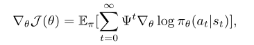

其中 $\psi^{t}$ 通常选用为优势函数 $A^{\pi}(s_{t},a_{t})$。本文参考异步优势 actor-critic(A3C) 方法来定义优势函数如下：

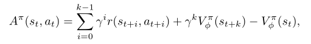

其中 $V^{\pi}_{\phi}(s_{t})$ 是值网络，$V^{\pi}_{t}(s_{t})=E_{\pi}[R_{t}]$。为值网络的参数，本文通过更新 TD ，来最小化自举 $k$ 步回报 $\hat{R}_{t}$ 和预测值之间的平方差，$\frac {1}{2}\left\|\hat{r}_{t} - V^{\pi}_{\phi}(s_{t})\right \|^{2}$.

##### 1.2 使用Kronecker因子近似的自然梯度

为了最小化非凸函数 $J(\theta)$，用最陡下降法计算更新 $\nabla \theta$，最小化 $J(\theta + \nabla \theta)$。然而欧氏范数的变化取决于参数 $\theta$，这是不合适的；因为模型的参数化是一个任意选择，不应该影响优化轨迹。自然梯度法利用 Fisher 信息矩阵 $F$ 构造范数- KL 散度的局部二次近似。该范数独立于概率分布类上的模型参数 $\theta$，提供了更稳定更有效的更新。但是由于神经网络可能包含数百万个参数，计算和存储精确的 Fisher 矩阵及其逆是不切实际的，因此需要借助近似值。Knonecker 因子近似曲率技术使用 Knonecker 因子近似能对 Fisher 矩阵的执行有效的近似自然梯度更新。细节看如下原文:

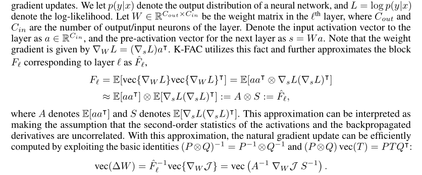

这种近似可以解释为假设激活和反向传播导数的二阶统计量是不相关的。有了这个近似，自然梯度更新可以有效计算。K-FAC 近似自然梯度更新只需要对与 $W$ 大小相当的矩阵进行计算。也有研究将 K-FAC 算法扩展到卷积网络及分布式网络，分布式 K-FAC 在训练大型现代分类卷积网络时速度提高了 2-3 倍。

#### 2. 方法

##### 2.1 actor-critic 中的自然梯度

为了定义强化学习目标的 Fisher 度量，本文使用策略函数，定义了给定当前状态下的动作分布，并在轨迹分布上取期望:

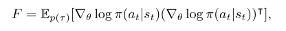

本文描述一种应用自然梯度来优化 critic 的方法。学习 critic 可以被认为是一个最小二乘函数近似问题，尽管这个问题的目标是移动的。在最小二乘函数近似中常用高斯-牛顿法。它将曲率近似为高斯-牛顿矩阵 $G:=E[J^{T}J]$ ，其中 $J$ 是映射参数到输出的 Jacobian 矩阵。高斯-牛顿矩阵等价于高斯观测模型的 Fisher 矩阵。这种等价性使得我们可将 K-FAC 也应用到 critic 上。假设 critic $v$ 的 Fisher 矩阵被定义为高斯分布 $p(v\mid s_{t})\sim N(v;V(s_{t},\sigma^{2}))$。critic 的 Fisher 矩阵是根据这个高斯输出分布定义的。 $\sigma$ 设为 1，这就是普通高斯-牛顿法。

如果 actor 和 critic 是分离的，可用上面定义的指标分别应用 K-FAC 更新。我们可以通过假设两个输出分布的独立性来定义策略分布和价值分布的联合分布，即 $p(a,v\mid s)=\pi(a\mid s)p(v\mid s)$ ，并构建关于 $p(a,v\mid s)$ 的 Fisher 度量。它与标准的 K-FAC 没有区别，只是我们需要独立对网络输出进行采样。然后我们可应用 K-FAC 近似 Fisher 矩阵 $E_{p(\tau)}[\nabla log p(a,v|s)\nabla log p(a,v|s)^{T}]$，来进行同步更新。

此外，作者还采用正则化技术。作者执行 Knonecker 近似所需的二阶统计量和逆的异步计算，以减少计算时间。

##### 2.2 步长选择和信任域优化

采用传统的自然梯度更新会导致算法过早收敛到一个接近确定性的策略。本文采用 K-FAC 的信任域公式，选择有效步长 $\eta$ 为 

$$min(\eta_{max}, \sqrt{\frac{2\delta}{\nabla \theta^{T}\hat{F}\nabla \theta}})$$

其中学习率 $\eta$ 和信任域半径 $\delta$ 是超参数。如果 actior 和 critic 是分离的，这两个参数需要分别调参。

#### 3. 相关工作

自然梯度[1]由Kakade[10]首次应用于策略梯度方法。Bagnell 和 Schneider[3]进一步证明[10]中定义的度量是由路径分布流形推导出的协方差度量。Peters 和 Schaal[19]随后将自然梯度应用到 actor-critic 算法中。他们提出对 actor 的更新执行自然政策梯度，对 critic 的更新使用最小二乘时间差分 (LSTD) 方法。

然而，在应用自然梯度法时，有效存储 Fisher 矩阵和计算其逆存在着巨大的计算挑战。以前的工作限制了该方法使用兼容函数逼近器(线性函数逼近器)。为了避免计算负担，信任域策略优化 (TRPO)[21] 近似求解线性系统，使用共轭梯度和快速 Fisher 矩阵-向量乘积，类似于 Martens[13] 的工作。这种方法有两个主要缺点。首先，它需要重复计算 Fisher 向量积，不利于扩展到更大的架构，即用于从 Atari 和 MuJoCo 的图像观察中学习的实验。其次，它需要大量的短轨迹(rollout)，以便准确估计曲率。

K-FAC 通过使用易于处理的 Fisher 矩阵近似和在训练过程中保持曲率统计数据的运行平均值来避免这两个问题。尽管 TRPO 显示出比使用 Adam[11] 等一阶优化器训练的策略梯度方法更好的每次迭代进展，但它的样本效率通常较低。

几种提高 TRPO 计算效率的方法被陆续提出。为了避免重复计算 Fisher 向量乘积，Wang 等人[27]用策略网和当前策略网的运行平均值之间的KL散度的线性近似来解决约束优化问题。Heess 等[8]和 Schulman 等[23]在目标函数中添加 KL 代价作为软约束，而不是信任域优化器施加的硬约束。在连续和离散控制任务的样本效率方面，这两篇论文都显示了对普通策略梯度的一些改进。

最近还引入了其他 actor-critic 模型，通过引入经验重放[27]、[7]或辅助目标[9]来提高样本效率。这些方法与本文的工作是正交的，可以与 ACKTR 结合，进一步提高样本效率。

#### 4. 实验

本文进行了一系列实验来研究以下问题:

(1)在样本效率和计算效率方面，ACKTR 与最先进的 on-policy 方法和常用的二阶优化器基线相比如何?

(2)什么是更好的临界优化范数?

(3)与一阶方法相比，ACKTR 随 batch size 缩放的性能如何?

作者在两个标准基准测试平台上评估了提出的方法 ACKTR。作者采用Open AI Gym 中的任务环境做为评估基准。离散控制任务用 Atari2600 游戏模拟器做为评估基准；连续控制任务用 MuJoCo 物理引擎做为评估基准。进行对比的基线算法是 A2C 和 TRPO。ACKTR和基线算法采用相同的模型架构，除了 Atari 游戏上的 TRPO 基线，由于运行共轭梯度内循环的计算负担，作者只能使用更小的架构。

##### 4.1 离散控制

经过 1000 万时间步(1时间步等于4帧)训练的 6 款 Atari 游戏的结果如图 1 所示，阴影区域表示 2 个随机种子的标准差。与 A2C 和 TRPO2 相比较，在所有游戏中，ACKTR 在样本效率(即每时间步数的收敛速度)方面显著优于 A2C。作者发现 TRPO 只能在 1000 万时间步内学习两款游戏，即《Seaquest》和《Pong》，并且在样本效率方面表现不如A2C。

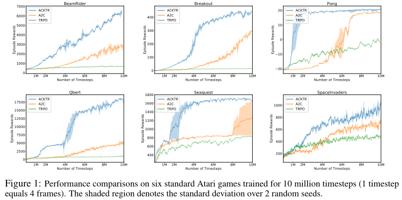

表 1 是在六款 Atari 2600 游戏上对离散控制任务的实验评估数据。ACKTR 和 A2C 结果显示在 5000 万时间步后获得的最后 100 个平均回合奖励，以及在 1000 万时间步后获得的 TRPO 结果。表格中还显示了第 $N$ 个回合，其中 $N$ 表示第 $N$ 到第 $(N + 100)$ 个游戏的平均奖励超过人类表现水平[16]的第 1 回合，平均超过 2 个随机种子。在《Beamrider》、《Breakout》、《Pong》和《Q-bert》等游戏中，A2C 需要比 ACKTR 多2.7、3.5、5.3 和 3.0 倍的回合才能达到人类的表现。此外，在《太空入侵者》中，A2C的运行结果不如人类的表现，而 ACKTR 的平均成绩是 19723，是人类表现(1652)的 12倍。在《Breakout》、《Q-bert》和《Beamrider》中，ACKTR 获得的回合奖励分别比 A2C高出 26%、35% 和 67%。

作者还在 Atari 的其他游戏中评估了 ACKTR，完整结果见原文附录。作者将 ACKTR 与 Q-learning 方法进行了比较，发现在 44 个基准中有 36 个，ACKTR 在样本效率方面与 Q-learning 方法相当，并且消耗的计算时间大大减少。

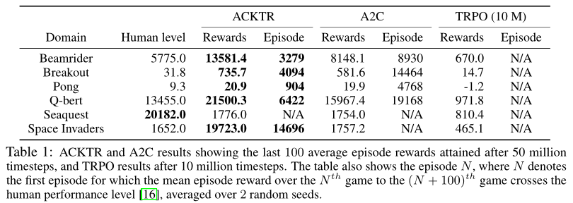

如图 2 所示，在《亚特兰蒂斯》游戏中，ACKTR 很快就学会了在 1.3 小时( 600 集)内获得 200 万的奖励。A2C 花了 10 个小时( 6000 集) 才达到同样的性能水平。

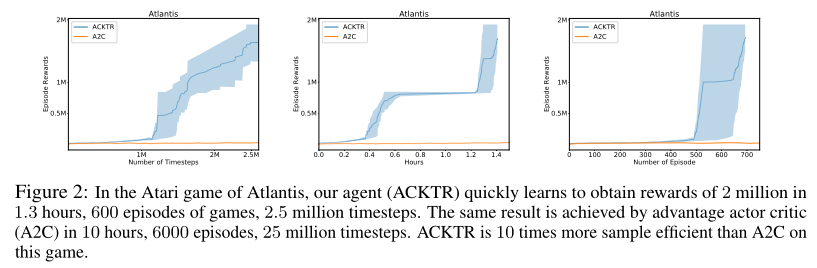

##### 4.2 连续控制

作者在 MuJoCo 中进行连续控制任务的模拟。由于高维动作空间和探索，连续控制任务有时更具挑战性。经过 100 万个时间步训练的 8 个 MuJoCo 环境的结果如图 3 所示（阴影区域表示 3 个随机种子的标准差。）。本文的模型在 8 个 MuJoCo 任务中的 6 个任务上显著优于基线，在其他两个任务 (Walker2d 和 Swimmer) 上与 A2C 差不多。

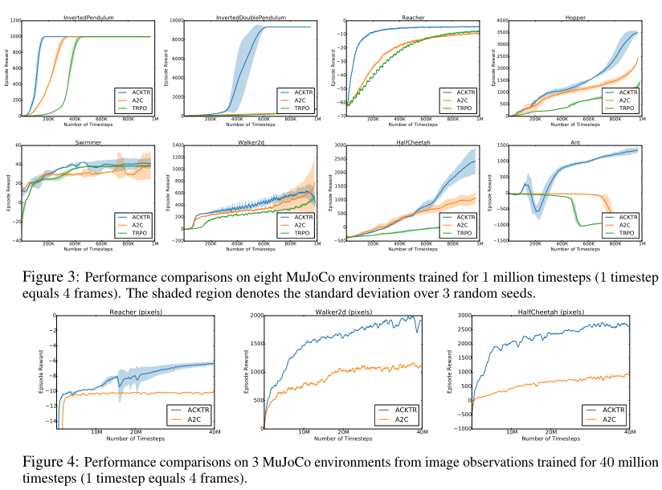

如表2所示，ACKTR 在所有任务上更快地达到指定的阈值，除了Swimmer, TRPO 的样本效率是 TRPO 的 4.1 倍。一个特别值得注意的例子是 Ant，其中 ACKTR 的样本效率是 TRPO 的 16.4 倍。在平均奖励分数方面，除了 TRPO 在 Walker2d 环境下的奖励分数高出 10% 外，其他三种模型表现相当。

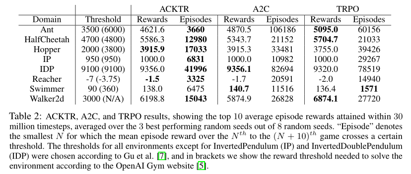

作者还尝试直接从像素来学习连续控制策略。从像素学习连续控制策略比从状态空间学习更具挑战性，部分原因是与 Atari 相比渲染时间较慢(MuJoCo为0.5秒，Atari为0.002秒)。最先进的 actor-critic 方法 A3C[17]只报告了相对简单任务的像素结果，如 Pendulum、 Pointmass2D 和 Gripper。如图4所示。可以看到，在经过 4000 万时间步训练后，ACKTR模型在最终回合奖励方面明显优于 A2C。更具体地说，在 Reacher、HalfCheetah 和 Walker2d 上，本文模型获得的最终奖励是 A2C 的 1.6 倍、2.8 倍和1.7 倍。

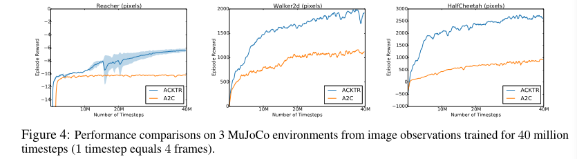

从像素训练策略的视频： https: //www.youtube.com/watch?v=gtM87w1xGoM

预训练的模型权重：https: //github.com/emansim/acktr。

#####  4.3 是一个优化critic的更好范式吗？

之前的自然策略梯度方法只对 actor 应用自然梯度更新，本文作者还建议对 critic 应用自然梯度更新。区别只在于选用什么范式来对 critic 进行最快的梯度下降;即2.2节中定义的范式 $\left \| \cdot \right \| _{B}$。此处将 ACKTR 应用于 actor，并比较了使用一阶方法(即欧氏范数)和使用 ACKTR (即高斯-牛顿定义的范数)进行临界优化。图5 (a)和(b)显示了连续控制任务《HalfCheetah》和 Atari 游戏《Breakout》的结果。作者观察到，无论使用哪种范式来优化 critic，与基线 A2C 相比，对 actor 应用 ACKTR 都会带来改进。

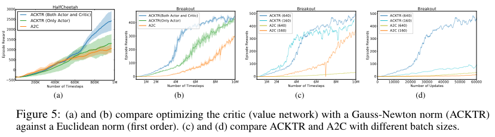

然而，使用高斯-牛顿范数优化 critic 所带来的改进在训练结束时的样本效率和回合奖励方面更为显著。此外,高斯-牛顿范数也有助于稳定训练。作者发现自适应高斯-牛顿算法并没有比普通的高斯-牛顿算法提供任何显著的改进。

##### 4.4 ACKTR在挂钟时间上与A2C相比如何?

作者将 ACKTR 与基准 A2C 和 TRPO 进行了比较。表 3 显示了 6 个 Atari 游戏和 8 个 MuJoCo (来自状态空间)环境下的平均每秒时间步数。所得结果与之前的实验设置相同。注意，在 MuJoCo 中，任务回合是按顺序处理的，而在 Atari 环境中，回合是并行处理的;因此更多的帧是在 Atari 环境中处理的。从表中我们可以看到， ACKTR 比 A2C 最多只增加 25% 的计算时间，证明了它的实用性和很大的优化效益。

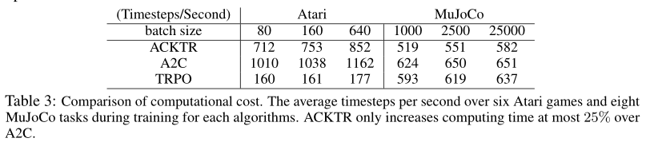

##### 5.5 ACKTR和A2C在不同批处理大小下的表现如何?

作者比较了 ACKTR 和基线 A2C 在不同 batch size 下的表现。我们分别试验了 160 和 640 的 batch size。图 5 (c) 显示了以时间步数表示的奖励。

图五(a)和(b)比较了用高斯-牛顿范数(ACKTR)和欧氏范数(一阶)来优化 critic (值网络)。(c)和(d)比较不同 batch size 的 ACKTR 和 A2C 。

作者发现，batch size 较大的 ACKTR 与 batch size 较小的 ACKTR 表现一样好。但是，随着 batch size 的增加，A2C 的样本效率下降明显。这与图 5 (d) 中的观察结果相对应，在图 5 (d) 中，我们根据更新次数绘制了训练曲线。我们发现，与使用 A2C 相比，使用更大 batch size 的 ACKTR 的好处大大增加。这表明，在分布式设置中，ACKTR 有很大的加速潜力，在这种情况下，需要使用大的 mini-batch。

#### 5. 结论

本文提出了一个用于深度强化学习的样本效率高且计算成本低的信任域优化方法。作者使用一种称为 K-FAC 的技术，对 actor-critic 方法近似自然梯度更新，并对稳定性进行信任域优化。本文第一个提出使用自然梯度更新来优化 actor-critic。作者在 Atari 游戏和MuJoCo 环境中测试了 ACKTR 方法，观察到与一阶梯度方法 (A2C) 和迭代二阶方法 (TRPO) 相比，样本效率平均提高了 2 到 3 倍。由于本文算法的可扩展性，该方法也是第一个直接从原始像素观测空间训练连续控制的几个非平凡任务的技术。

#### 个人总结
本文针对 TRPO 样本效率不高，不易扩展的问题，结合自然策略梯度 kronecker 因子近似技术，提出了带有信任域的 knonecker 因子近似技术，用于优化 actor-critic 方法。本文方法通过离散控制和连续控制实验表明，明显提高了样本效率和可扩展性。

汪莉娟：天津大学研究生，专业方向为控制科学与工程，主要研究方向为交通优化与智能控制。