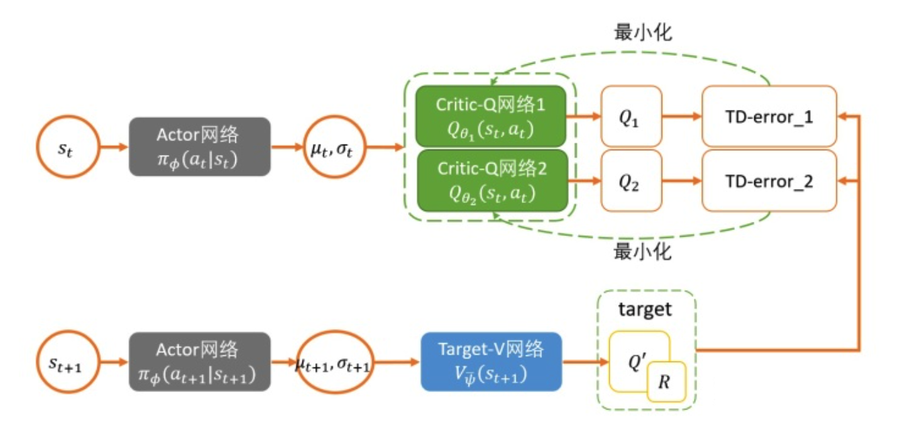
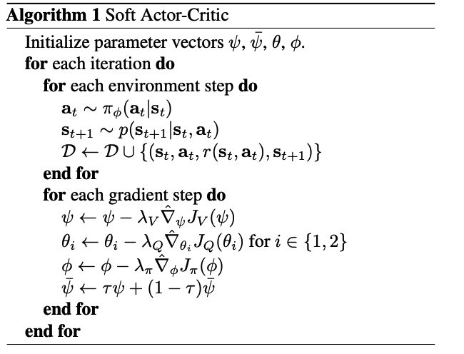
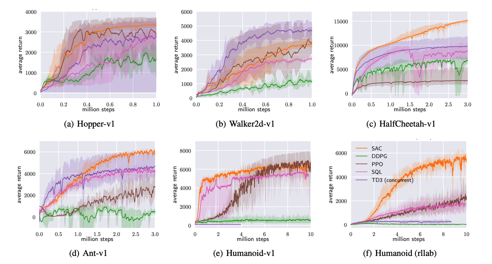

# SAC算法

原论文：[Soft Actor-Critic: Off-Policy Maximum Entropy Deep Reinforcement Learning with a Stochastic Actor](https://arxiv.org/abs/1801.01290)

SAC算法是off-policy算法，此前的off-policy算法存在采样复杂性高和难收敛的问题，使得超参数十分敏感，SAC算法通过在最大预期return的同时最大化熵值，也就是尽量获得最高累计收益的同时保持探索避免过早掉入局部最优解。SAC结合已有的off-policy模型actor-critic框架使得在不同的随机种子上都能达到SOTA效果。

## 介绍

深度强化学习的快速发展，给机器人控制领域带来了许多进展。此前的工作中，面向连续控制任务的算法有TRPO、PPO、DDPG等算法。

PPO是一种on-policy面向离散和连续控制的算法，在许多数据集上取得了较好的效果，但是存在严重的采样效率低下的问题，这对于真实环境中的控制问题采样花费来说是难以接受的；DDPG是一种off-policy的面向连续控制的问题，比PPO采样效率高但是DDPG训练了一种确定性策略（deterministic policy），在每个状态下只选择一个最优的动作，这样很容易掉入局部最优解的情况。

在连续控制问题中，SAC算法结合已有actor-critic框架，使用随机策略（stochastic policy）最大累计收益的同时也保持熵值最大化，提升了采样效率增强了智能体的探索能力，避免了过早陷入局部最优解的情况，同时也增强了模型在不同初始环境的泛化能力和鲁棒性。

## 预备知识

### 最大熵强化学习

传统的强化学习是最大化累计回报值：
$$
J(\pi)=\sum_t\mathbb{E}_{(s_t,a_t)\sim\rho_\pi}[r(s_t,a_t)]
$$
而最大熵的RL算法的目标函数为：
$$
J(\pi)=\sum^{T}_{t=0}\mathbb{E}_{(s_t,a_t)\sim\rho_\pi[r(s_t,a_t)+\alpha\mathcal{H}(\pi(\cdot|s_t))]}
$$
其中$\alpha$为熵的温度系数超参数，用于调整对熵的重视程度。$\mathcal{H}(\pi(\cdot|s_t))$是熵值，可表示为$\mathcal{H}(\pi(\cdot|s_t))=-\mathbb{E}_{s_t}[\log \pi(\cdot|s_t)]$。

在累计回报值中加入熵值的目的是使策略随机化（stochastic），在遇到一个state有多个同样优秀的动作时鼓励探索，可以随机从这些动作中选出一个形成trajectory，而不是总选择同一个确定性策略（deterministic）导致模型最终无法学到全局最优解。

## Soft policy Iteration

在model-free强化学习policy iteration中，常将策略更新过程分为policy evaluation和policy improvement两个阶段。

### Soft policy evaluation

标准的Q function：
$$
Q^\pi(s,a)=r(s,a)+\gamma\mathbb{E}_{(s^\prime,a^\prime)\sim\rho_\pi}[Q(s^\prime,a^\prime)]
$$
标准的V function：
$$
V^\pi(s)=\mathbb{E}_{(s_t,a_t)\sim\rho_\pi}[Q(s^\prime,a^\prime)]
$$
在标准的方程中引入熵得到Soft Value Function：

Soft Q function:
$$
Q^\pi_{soft}(s,a)=r(s,a)+\gamma\mathbb{E}_{(s^\prime,a^\prime)\sim\rho_\pi}[Q(s^\prime,a^\prime)-\alpha\log(\pi(a^\prime|s^\prime))]
$$
Soft V function:
$$
V^\pi_{soft}(s^\prime)=\mathbb{E}_{(s^\prime,a^\prime)\sim\rho_\pi}[Q_{soft}(s^\prime,a^\prime)-\alpha\log(\pi(a^\prime|s^\prime))]
$$
由此可得Soft Q和V的Bellman方程：
$$
Q^\pi_{soft}(s,a)&=&r(s,a)+\gamma\mathbb{E}_{(s^\prime,a^\prime)\sim\rho_\pi}[Q(s^\prime,a^\prime)-\alpha\log(\pi(a^\prime|s^\prime))]\\
&=&r(s,a)+\gamma\mathbb{E}_{s^\prime\sim\rho}[V^\pi_{soft}(s^\prime)]
$$
在固定policy下，使用soft Bellman equation更新Q value直到收敛。

### Soft policy improvement

stochastic policy的重要性：面对多模的（multimodal）的Q function，传统的RL只能收敛到一个选择（左图），而更优的办法是右图，让policy也直接符合Q的分布。

为了适应更复杂的任务，MERL中的策略不再是以往的高斯分布形式，而是用基于能量的模型（energy-based model）来表示策略:
$$
\pi(a_t|s_t)\propto exp(-\mathcal{E}(s_t,a_t))
$$
为了让EBP和值函数联系起来，设置$\mathcal{E}(s_t,a_t)=-\frac{1}{\alpha}Q_{soft}(s_t,a_t)$，因此$\pi(a_t|s_t)\propto exp(-\frac{1}{\alpha}Q_{soft}(s_t,a_t))$

由soft v function变形可得：
$$
\pi(s_t,a_t)&=&exp(\frac{1}{\alpha}Q_{soft}(s_t,a_t)-V_{soft}(s_t))\\
&=&\frac{exp(\frac{1}{\alpha}Q_{soft}(s_t,a_t)}{exp(\frac{1}{\alpha}V_{soft}(s_t))}
$$
定义softmax（注意此处softmax和神经网络不同，神经网络中的softmax实际上是求分布的最大值soft argmax）
$$
softmax_af(a):=\log\int expf(a)da
$$
因此$V_{soft}(s_t)=\alpha softmax_a(\frac{1}{\alpha}Q_{soft}(s_t,a_t))$，

根据Soft Q function可化为softmax形式：
$$
Q_{soft}(s_t,a_t)=\mathbb{E}[r_t+\gamma softmax_aQ(s_{t+1},a_{t+1})]
$$
因此整个Policy Iteration流程可总结为：

**soft policy evaluation:**固定policy，使用Bellman方程更新Q值直到收敛
$$
Q^\pi_{soft}(s,a)=r(s,a)+\gamma\mathbb{E}_{(s^\prime,a^\prime)\sim\rho_\pi}[Q(s^\prime,a^\prime)-\alpha\log(\pi(a^\prime|s^\prime))]
$$
**soft policy improvement:**更新policy
$$
\pi^\prime=\arg\min_{\pi_k\in \prod}D_{KL}(\pi_k(\cdot|s_t)||\frac{exp(\frac{1}{\alpha}Q^\pi_{soft}(s_t,\cdot))}{Z_{soft}^\pi(s_t)})
$$

## Soft Actor-Critic框架

SAC算法的构建首先是神经网络化，我们用神经网络来表示Q和Policy：$Q_\theta(s_t,a_t)$ 和 $\pi_\phi(a_t|s_t)$。Q网络比较简单，几层的MLP最后输出一个单值表示Q就可以了，Policy网络需要输出一个分布，一般是输出一个Gaussian包含mean和covariance。下面就是构建神经网络的更新公式。

### Critic

构造两个Q网络，参数通过每次更新Q值小的网络参数，Q网络的损失函数为：
$$
J_Q(\theta)=\mathbb{E}_{(s_t,a_t,s_{t+1})\sim \mathcal{D}}[\frac{1}{2}(Q_\theta(s_t,a_t)-(r(s_t,a_t)+\gamma V_{\bar{\theta}}(s_{t+1})))^2]
$$
$\bar{\theta}$是target soft Q网络的参数，带入V的迭代表达式：
$$
J_Q(\theta)=\mathbb{E}_{(s_t,a_t,s_{t+1})\sim \mathcal{D}}[\frac{1}{2}(Q_\theta(s_t,a_t)-(r(s_t,a_t)+\gamma (Q_{\bar \theta}(s_{t+1},a_{t+1})-\alpha\log(\pi(a_{t+1}|s_{t+1})))))^2]
$$

### Actor

Policy网络的损失函数为：
$$
J_\pi(\phi)&=&D_{KL}(\pi_k(\cdot|s_t)||\frac{exp(\frac{1}{\alpha}Q^\pi_{soft}(s_t,\cdot))}{Z_{soft}^\pi(s_t)})\\
&=&\mathbb{E}_{s_t\sim\mathcal{D},a\sim\pi_\phi}[\log\pi_\phi(a_t|s_t)-\frac{1}{\alpha}Q_\theta(s_t,a_t)+\log Z(s_t)]
$$
其中策略网络的输出是一个动作分布，即高斯分布的均值和方差，这里的action采用重参数技巧来获得，即：
$$
a_t=f_\phi(\epsilon_t;s_t)=f^\mu_\phi(s_t)+\epsilon_t\cdot f^\mu_\phi(s_t)
$$

### Update temperature

前面的SAC中，我们只是人为给定一个固定的temperature$\alpha$作为entropy的权重，但实际上由于reward的不断变化，采用固定的temperature并不合理，会让整个训练不稳定，因此，有必要能够自动调节这个temperature。当policy探索到新的区域时，最优的action还不清楚，应该调高temperature 去探索更多的空间。当某一个区域已经探索得差不多，最优的action基本确定了，那么这个temperature就可以减小。

通过构造一个带约束的优化问题，让熵权重在不同状态下权重可变，得到权重的loss：
$$
J(\alpha)=\mathbb{E}_{a_t\sim\pi_t}[-\alpha \log \pi_t(a_t|\pi_t)-\alpha\mathcal{H}_0]
$$
soft actor-critic算法用伪代码可表示为：

## 实验

在连续控制的benchmark上表现效果比大多数SOTA算法（DDPG、PPO、SQL、TD3）好。

## 总结

基于最大熵的强化学习算法优势：

1）学到policy可以作为更复杂具体任务的初始化。因为通过最大熵，policy不仅仅学到一种解决任务的方法，而是所有all。因此这样的policy就更有利于去学习新的任务。比如我们一开始是学走，然后之后要学朝某一个特定方向走。

2）更强的exploration能力，这是显而易见的，能够更容易的在多模态reward （multimodal reward）下找到更好的模式。比如既要求机器人走的好，又要求机器人节约能源。

3）更robust鲁棒，更强的generalization。因为要从不同的方式来探索各种最优的可能性，也因此面对干扰的时候能够更容易做出调整。（干扰会是神经网络学习过程中看到的一种state，既然已经探索到了，学到了就可以更好的做出反应，继续获取高reward）。

虽然SAC算法采用了energy-based模型，但是实际上策略分布仍为高斯分布，存在一定的局限性。

====================================

作者：杨骏铭

研究单位：南京邮电大学

研究方向：强化学习、对抗学习

联系邮箱：jmingyang@outlook.com

