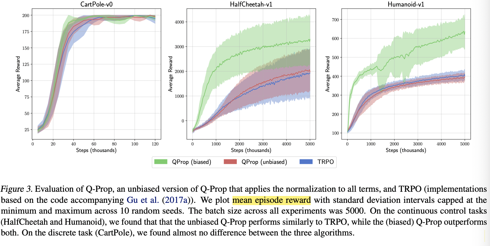
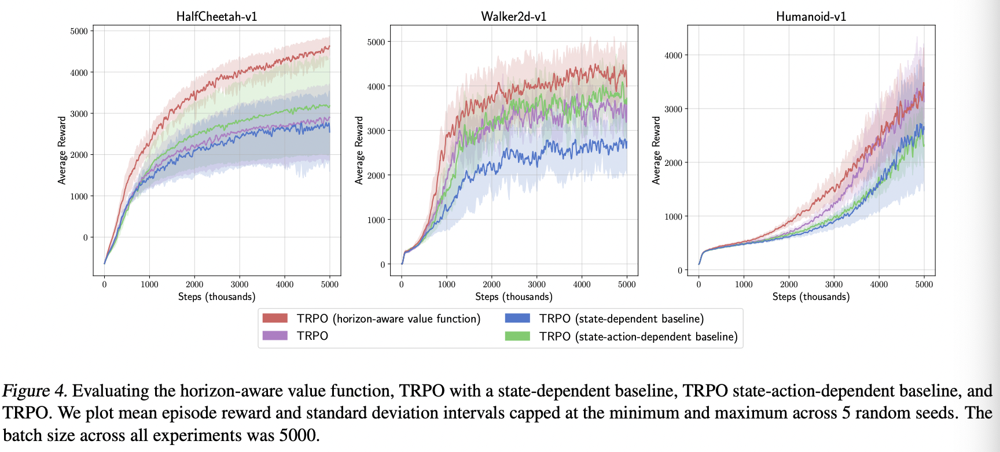

## The Mirage of Action-Dependent Baselines in Reinforcement Learning

作者：George Tucker, Surya Bhupatiraju, Shixiang Gu, Richard E. Turner, Zoubin Ghahramani, Sergey Levine

论文链接：https://arxiv.org/abs/1802.10031v3

**亮点：**本文对早期论文进行批评和重新评估，认为早期论文是一些实现上的技巧降低了方差，而不是真正无偏的，提出了一个地平线状态价值函数

### **Motivation (Why):** 

在对策略梯度估计量的方差进行分解和数值研究时，发现之前论文中降低策略梯度方差的方法并不会降低方差，这是一个预期外的发现。于是作者查阅了他们的开源代码，发现他们的实验结果是出于一些代码实现上的技巧。作者通过对方差的分析，指出了可以提升的地方，通过一个小小的改动显著的提升了算法表现。

### **Main Idea (What):** 

#### **方差分解**

作者将策略梯度的方差分解为了如下形式
$$
\begin{aligned}
\Sigma=& \underbrace{\mathbb{E}_{s, a}\left[\operatorname{Var}_{\tau \mid s, a}(\hat{A}(s, a, \tau) \nabla \log \pi(a \mid s))\right]}_{\Sigma_\tau} \\
&+\underbrace{\mathbb{E}_s\left[\operatorname{Var}_{a \mid s}((\hat{A}(s, a)-\phi(s, a)) \nabla \log \pi(a \mid s))\right]}_{\Sigma_a} \\
&+\underbrace{\operatorname{Var}_s\left(\mathbb{E}_{a \mid s}[\hat{A}(s, a) \nabla \log \pi(a \mid s)]\right)}_{\Sigma_s}
\end{aligned}
$$
作者分析策略梯度中方差的来源，是来自我们只收集了状态$s$有限多的数据，在每个状态也只做了一次行动$a$， 然后我们进行计算的时候也只用了一个样本$\tau$。 所以非常直觉地想，$\sum_{\tau}, \sum_{a}, \sum_{s}$ 分别描述了来自这三个局限的方差。其中，第二项方差$\sum_a$ 是关于基线函数的方差，也可以记为 $\sum_a^{\phi(s)}$。 当$\phi(s)$是最优的时候，$\sum_a$消失了，只剩下 $\sum_{\tau} + \sum_{s}$ 这两项。所以当 $\sum_a$ 相对其他两项很大的时候，最优的基线函数选取可以有效地降低方差，比如在环境 Cliffworld中，一个错误的动作选取可能会导致智能体摔下悬崖而得到一个很大的负数奖励，所以降低动作所带来的方差 $\sum_a$ 可以显著提升算法性能。

#### **方差测量**

作者通过复现过往工作代码发现，很多声称降低了梯度估计量方差的方法实际上并没有降低方差，反而是引入了期望上的偏差，以此提升了算法的效果。

无偏估计的QProp算法, 有偏估计的QProp和TRPO算法训练过程中算法性能对比。

### **Main Contribution (How):**

作者提出了地平线感知函数，在原有价值函数的基础上加上了对未来价值的预测 $\sum_{i=t}^T \gamma^{i-t} \hat{r}(s_t)$。
$$
\hat{V}\left(s_t\right)=\left(\sum_{i=t}^T \gamma^{i-t}\right) \hat{r}\left(s_t\right)+\hat{V}^{\prime}\left(s_t\right)
$$

作者将TRPO算法与地平线感知函数和其他基线函数结合，在不同的任务上对比效果。

#### 主要工作

1. 提出了一种通过更精准的价值函数或者状态相关的基线函数来降低策略梯度方差的方法，提出了考虑奖励衰退的地平线感知值函数。
2. 作者详细研究了和状态动作相关的价值函数对方差的影响，复现了过往工作的开源代码。发现过往研究取得的方差降低是通过在代码实现时引入期望偏差来获得的，并不是真正的无偏估计
3. 将文本所提出的地平线感知值函数，以及过往论文真正的无偏基线函数和TRPO算法结合，进行试验，发现只有引入本文所构造的基线函数性能比TRPO稍好一些，其他方法表现均不如TRPO算法。

作者也提出了后续的研究方向，即研究在梯度计算过程中。期望和方差之间的权衡

### 个人简介

吴文昊，西安交通大学硕士在读，联系方式:wwhwwh05@qq.com

