## Trust Region Policy Optimization
## （信任域策略优化）
作者:John Schulman, Sergey Levine, Pieter Abbeel, Michael Jordan, Philipp Moritz

作者单位：University of California, Berkeley, Department of Electrical Engineering and Computer Sciences

论文发表来源：Proceedings of the 32nd International Conference on Machine Learning, PMLR 37:1889-1897

论文发表时间：2015

论文查看网址：https://proceedings.mlr.press/v37/schulman15.html

论文贡献：本文通过对理论证明的方案进行一些近似，开发了一种保证单调改进优化控制策略的方法，称为信任域策略优化(TRPO)。该方法的近似偏离了理论，但是侧重于给出单调改进，几乎不需要调整超参数。该方法适用于神经网络等大型非线性策略的优化。本文通过模拟机器人和Atari游戏的实验既证明了该方法在各种任务中表现很稳健，也为未来训练结合感知和控制的机器人控制器提供一个可能的统一方案。该方法降低了样本复杂度，为后续的复杂策略学习任务提供了算法基础。简单来说，本文的单调改进方法将难以应用的策略梯度优化理论变成了可以实际应用的策略梯度优化算法。

### Motivation(why):

基于梯度的优化算法比无梯度优化算法有更好的样本复杂度，但是在连续控制问题中，基于梯度的方法对于无梯度随机搜索的表现并不令人满意。在具有大量参数的监督学习任务中，连续梯度优化对于学习函数的逼近表现非常成功。如果将连续梯度优化扩展到强化学习，将能更有效的学习出复杂而强大的控制策略。

### Main Idea(what)

本文首先证明了最小化某个代理损失函数保证了策略改进与非平凡补偿，然后对理论证明的算法进行一系列逼近，得到一个实用的算法，本文称之为信任域策略优化。本文描述了该算法的两个变体：一个是可应用于无模型设置的单路径方法，另一个是vine方法，该方法要求系统恢复到特定状态，这通常只在仿真中可能。这些算法是可扩展的，可以优化具有成千上万个参数的非线性策略。这在以前是无模型策略搜索的主要挑战。

### How

#### 1.  前提

将一个无限水平贴现马尔科夫决策过程(MDP)定义为一个元组 $<S,A,P,c,\rho_{0},\gamma>$，$S$ 是有限状态集，$A$ 是有限动作集，$P:S\times A\times S \to R$ 是转移概率分布，$c:S\to R$ 是代价函数，$\rho_{0}:S\to R$ 是初始状态 $s_{0}$ 的分布，$\gamma \in(0,1)$ 是折扣因子。

令 $\pi$ 表示随机策略 $\pi:S\times A \to [0,1]$，令 $\eta(\pi)$ 表示期望折扣代价，则有：

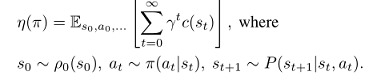

状态动作值函数 $Q_{\pi}$ ,值函数 $V_{\pi}$ ,优势函数 $A_{\pi}$ 标准定义如下：

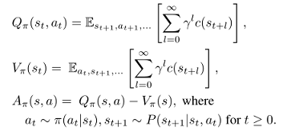

则随着时间步的累积，根据 $\pi\$ 的优势表达了另一个策略 $\tilde{\pi}$ 的期望代价如公式(1):

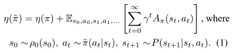

令$\rho_{\pi}$为非归一化的折扣访问频率，则

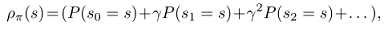

将公式(1)重新排列为对状态求和，则有公式(2):

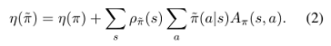

这个公式意味着对于任意策略更新 $\pi \to \tilde{\pi}$ 保证减少 $\eta$,或在期望优势处处为 $0$ 的情况下使其保持不变，$\tilde{\pi}$ 在每个状态 $s$ 都有一个非正的期望优势，即 $\sum_{a}\tilde{\pi}(a|s)A(\pi)(s,a)\le 0$。这意味着由精确策略迭代执行更新的经典结果。然而，在近似设置中，由于估计和近似误差，某些状态的预期优势为正通常是不可避免的，即 $\sum_{a}\tilde{\pi}(a|s)A(\pi)(s,a)\ge 0$。 
$\rho_{\tilde{\pi}}$ 对 $\tilde{\pi}$ 的复杂依赖使得公式(2)难以直接优化。于是本文引入下面对 $\eta$ 的局部逼近：

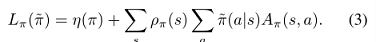

然而，如果我们有一个参数化的策略 $\pi_{\theta}$ ,其中 $\pi_{\theta}(a|s)$ 是参数向量 $\theta$ 的可微函数，则 $L_{\pi}$ 对 $\eta$ 到一阶。那就是说，对于任意参数值 $\theta_{0}$，有

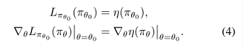

公式(4)表明能改进 $L_{\pi_{old}}$ 的充分小一步更新 $\pi_{\theta_{0}}\to \tilde(\pi)$ 也能改进 $\eta$ ,但是我们无法知道这一步的大小如何。为解决该问题，Kakade & Langford (2002)提出一种保守策略迭代的策略更新方案，为 $\eta$ 的改进提供了明确的下界。

为定义保守策略迭代更新，令 $\pi_{old}$ 表示当前策略，假设可解 $\pi'=argmin_{\pi'}L_{\pi_{old}}(\pi')$ 。新策略 $\pi_{new}$ 取为混合策略，如公式(5)：

Kakade and Langford证明了这个更新的下述结果：

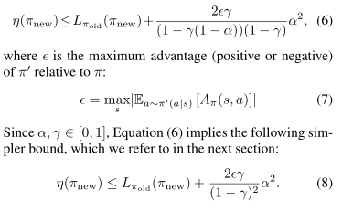

$\epsilon$是$\pi'$相对于$\pi$的最大优势(或正或负)，等式(6)给出了更简单的界。这个界当$\alpha \ll 1$时有点弱。这个界只适用于等式(5)生成的混合策略。混合策略不适用于实际情况，对于所有一般随机策略需要一个实际的策略更新方案。

#### 2. 一般随机策略的单调改进保证

公式(6)意味着改进公式右边就能保证改进真实的期望代价目标 $\eta$。本文的主要理论结果是，通过用 $\pi$ 和 $\tilde{\pi}$ 之间的距离度量来替换 $\alpha$，公式(6)中的策略改进边界可以扩展到一般的随机策略，而不是仅适合于混合策略。这一结果对于将改进保证扩展到实际问题是至关重要的。对于离散概率分布 $p,q$ ，定义两个策略之间的总变分散度为：

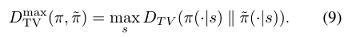

定理1.令 $\alpha=D^{max}_{TV}(\pi_{old},\pi_{new})$，令 $\epsilon=max_{s}\left |  E_{a\sim\pi'(a|s)}[A_{\pi}(s,a)]\right |$，则公式(8)成立。证明在附录。

我们注意到变分散度和KL散度之间有这样的关系：$D_{TV}(p||q)^2 \le D_{KL}(p||q)$。令 $D^{max}_{KL}(\pi, \tilde{\pi}) = max_{s}D_{KL}(\pi(\cdot|s))$，可从公式(8)直接推导出下面的界，即公式(10):

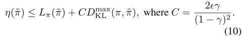

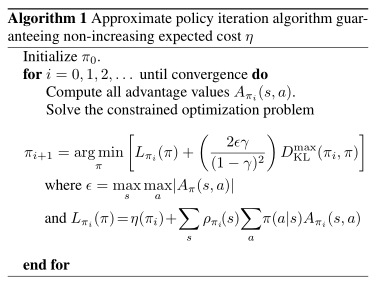

算法1描述了基于公式(10)中策略改进边界的近似策略迭代方法。注意，我们假设了优势值$A_{\pi}$ 的精确评估。

由公式(10)可知，算法1保证生成一系列单调改进策略 $\eta(\pi_{0})\ge\eta(\pi_{1})\eta(\pi_{2})\ge ...$。令

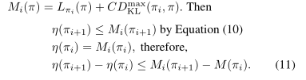

通过每次迭代中最小化 $M_{i}$，我们可以保证真正的目标 $\eta$ 是不增加的。这个算法是一种majorization-minimization(MM)算法，这是一类包括期望最大化的方法。在MM算法中，$M_{i}$ 是代理函数，优化 $\eta$ 等于 $\pi_{i}$ 。该算法也联想到近端梯度法和镜像下降法。下一节中提出的信任域策略优化是算法1的近似，算法1使用对KL发散的约束而不是惩罚来健壮的允许大的更新。

#### 3.参数化策略的优化
本节讲述了在有限样本数和任意参数化的基础上，如何从理论基础得出一个应用算法。
因为我们用参数向量 $\theta$ 考虑了参数化策略 $\pi_{\theta}(a|s)$，因此我们用函数 $\theta$ 而不是 $\pi$ 重载以前的策略表示。优化目标为下式：

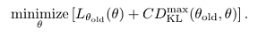

如果采用上式的惩罚系数 $C$ ，步长会非常小，以稳健方式采取更大步骤的一种方法是对新旧策略之间的KL散度使用约束，即信任域约束，如公式(12):

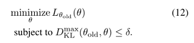

公式(12)强加了约束条件，即KL散度在状态空间的每个点上都是有界的。本文使用一种考虑平均KL散度的启发式近似：

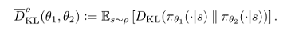

由此将生成策略更新的优化问题变为公式(13):

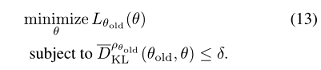

类似的策略更新在以前的工作中已被提出，本文实验中也与以前的方法做了比较。实验表明，这种类型的约束更新与公式(12)中的最大KL散度约束具有相似的实验性能。

#### 4.基于采样的目标估计和约束

本节描述了如何使用蒙特卡洛模拟逼近目标函数和约束函数。公式(13)通过扩展 $L_{\theta_{old}}$ 可有公式(14):

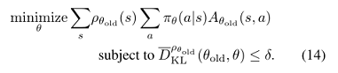

用期望 $frac{1}{1-\gamma}E_{s\sim\rho_{old}}[...]$ 代替 $\sum_{s}\rho_{\theta_{old}}[...]$，用优势值 $A_{\theta_{old}}$ 代替Q值 $Q_{\theta_{old}}$。最后用一个重要性采样估计量代替动作的和，用 $q$ 表示采样分布，则单个 $s_{n}$ 对损失函数贡献为：

则公式(14)中的优化问题完全等价于公式(15)中用期望表示的优化问题：

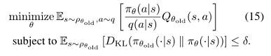

剩下的就是用样本均值代替期望，用经验估计代替Q值。

执行此估计，本文给出两种不同方法：

* 第一种称为单路径采样方法，典型用于策略梯度估计，它基于对个体轨迹的采样。
  
* 第二种称为vine方法，它构建一个展开(rollout)集，然后从展开集中的每个状态执行多个操作。这种方法主要用于策略迭代方法。

##### 4.1 单路径方法

通过采样 $s_{0}\sim \rho_{0}$ 收集状态序列，然后模拟策略 $\pi_{\theta_{old}}$ 一定量的时间步后产生轨迹 $s_{0},a_{0},s_{1},a_{1},...,s_{T-1},a_{T-1},s_{T}$。即有 $q(a|s)=\pi_{\theta_{old}}(a|s)$。在每个 $(s_{t},a_{t})$ 上沿轨迹取未来成本折扣和来计算 $Q_{\theta_{old}}(s,a)$。

##### 4.2 vine方法

采样 $s_{0}\sim \rho_{0}$，模拟策略 $\pi_{\theta_{old}}$ 生成许多轨迹，沿轨迹选取有 $N$ 个状态的子集 $s_{1},s_{2},...,s_{N}$，本文称之为“rollout集”(展开集)。在该集合中，对于每个状态 $s_{n}$，根据 $a_{n,k}\sim q(\cdot|s_{n})$ 采样 $K$ 个动作。本文发现 $q(\cdot|s_{n}=\pi_{\theta_{i}}(\cdot|s_{n})$ 在机器人动作训练的连续问题上表现很好，均匀分布在像Atari游戏这样的离散任务上能有更好的探索。

对于在每个状态 $s_{n}$ 采样的每个动作 $a_{n,k}$,，我们通过执行从状态 $s_{n}$ 和动作 $a_{n,k}$ 开始的rollout(即一个短轨迹)来估计 $\hat{Q}_{\theta_{i}}(s_{n},a_{n,k})$。我们可以通过使用相同的随机数序列（即公共随机数）来处理 $K$个段短轨迹中的噪声，极大地减少了短轨迹之间 $Q$ 值差异的方差。

在小的有限动作空间中，我们可以从给定的状态为每一个可能的动作生成一个短轨迹(rollout)。从单个状态 $s_{n}$ 对 $L_{\theta_{old}}$ 的贡献如下:

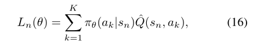

在大的或连续状态空间中，我们利用重要抽样来构造代理损失的估计量。单个状态 $s_{n}$ 的自归一化估计量为

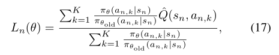

假设我们执行了来自状态 $s_{n}$ 的 $K$个动作 $a_{n,1}, a_{n,2}，…， a_{n,K}$ 来自状态sn。这种自归一化估计器消除了对 $Q$ 值使用基线的需要(向q值添加一个常数，梯度不变)。对 $s_{N}\sim \rho(\pi)$ 求平均值，可以得到 $L_{\theta_{old}}$ 的估计量，以及它的梯度。

图1说明了vine方法和单路径方法。

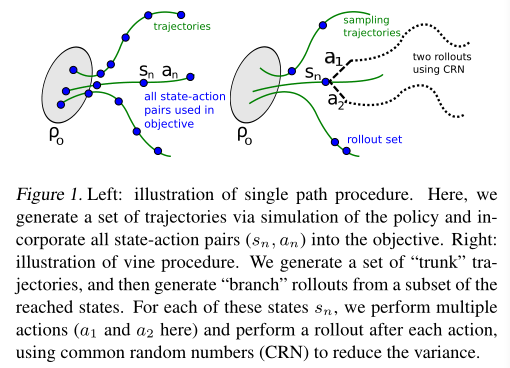

左图为单路径程序示意图。通过模拟策略生成一组轨迹，并将所有状态-动作对 $(s_{n}, a_{n})$ 合并到目标中。右图为vine方法示意图。生成一组“主干”轨迹，然后从到达状态的子集生成“分支”展开。对于每个状态 $s_{n}$，执行多个操作(这里是 $a_{1}$ 和 $a_{2}$)，并在每个操作之后执行一次短轨迹，使用公共随机数(CRN)来减少方差。

vine方法中用于采样的轨迹可以被比作藤蔓的茎，它在不同的点(短轨迹集)上分成几个短分支(展开轨迹)。

在替代损失的 $Q$ 值样本数量相同的情况下，vine方法优于单一路径方法，对目标的局部估计具有更低的方差。即vine法对优势值给出了更好的估计。vine方法的缺点是对这些优势估计，必须对模拟器执行更多的调用。此外，vine方法要求我们从展开集中的每个状态生成多个轨迹，这限制了该算法的设置，系统可以重置为任意状态。相比之下，单路径算法不需要状态重置，可直接在物理系统上实现。

#### 5. 实用算法

基于单路径和vine采样方法，本文提出两种实用的策略优化算法。算法重复执行以下步骤：

1. 使用单路径或vine过程收集一组状态动作对，以及对应的 $Q$ 值的蒙特卡洛估计。
   
2. 通过对多个样本求平均，构造公式(15)中的估计目标和约束条件。
   
3. 近似解这个约束优化问题，更新策略的参数向量 $\theta$。本文使用共轭梯度算法，进行直线搜索。
   

第3步，本文通过构造费雪(Fisher)信息矩阵(FIM)来解析计算KL散度的海塞(Hessian)矩阵，不用梯度的协方差矩阵。解析估计器在每个状态 $s_{n}$ 对动作进行积分，不依赖于被采样的动作 $a_{t}$。

总结section 3参数化策略优化与本文所提算法的联系如下:

* 该理论证明了用对KL散度的惩罚可以优化替代损失。然而大的惩罚系数 $\frac{2\epsilon \gamma}{({2-\gamma})^{2}}$ 会导致非常小的步长，本文算法想减小这个系数。本文采用带有参数 $\delta$ (KL散度的界)的硬约束来代替惩罚。
  
* $D^{max}_{KL}(\theta_{old},\theta)$ 的约束很难进行数值优化和估计，所以本文算法约束了 $D_{KL}(\theta_{old},\theta)$。
  
* 本文的算法理论为了简化忽略了优势函数的估计误差，但是Kakade & Langford (2002)推导中考虑了这个误差。
  
#### 6. 与以前工作的联系

本文推导的策略更新算法与以前的几个方法相关。

自然策略梯度：做为公式(13)更新的特例，通过对 $L$ 线性近似，对 $\bar{D}_{KL}$ 约束使用二次逼近，从而得到下式：

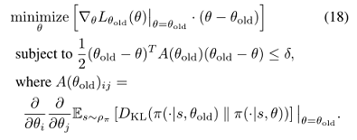

更新 $\theta _{new}=\theta _{old}-\lambda A(\theta _{old})^{-1} \nabla _{\theta }L(\theta )|_{\theta =\theta _{old}}$，其中拉格朗日乘子 $\lambda$ 为算法参数。该算法更新与本文的TRPO不同，TRPO每次更新强制执行约束。实验证明，本文算法提高了处理更大问题时的性能。

通过使用 $l_{2}$ 约束或惩罚，TRPO也获得了标准策略梯度更新：

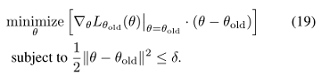

通过求解无约束问题 $minimize_{\pi}L_{\pi_{old}}(\pi)$ 也可得到迭代策略更新。

相对熵策略搜索(REPS)约束了状态动作边缘 $p{s,a}$，然而TRPO约束了条件 $p(s,a)$，不需要在内循环中进行非线性优化。

Levine and Abbeel (2014)使用KL发散约束，TRPO不显式估计系统动态。 

#### 7. 实验

图2为运动实验的二维机器人模型：swimmer，hopper，walker。由于欠驱动及接触连续，hopper和walker比较难训练。

实验回答了几个问题：

（1）单路径和vine采样的性能特点是什么？

（2）TRPO使用固定的KL散度对算法性能有什么影响？

（3）TRPO能否用于解决具有挑战性的大规模问题？当用于大规模问题时，最终性能、计算时间和样本复杂度方面，TRPO相比其他方法情况如何？

实验结果表明，单路径和vine算法都能从零开始训练出高质量的运动控制器，在玩Atari游戏时这些算法性能都很不错。

##### 7.1 模拟机械运动

实验：mujoco机器人移动实验（三个模拟机器人，如图2所示）

状态：机器人的广义位置和速度

控制：关节力矩

挑战：欠驱动，高维，接触引起的摩擦力

评估模型：Swimmer, Hopper, Walker，再加入一个经典的cart-pole

算法对模型评估的结果看图4。图3上图为机器人动作训练的网络，下图为玩Atari游戏的网络。本文用神经网络表示策略，参数见文章附录。

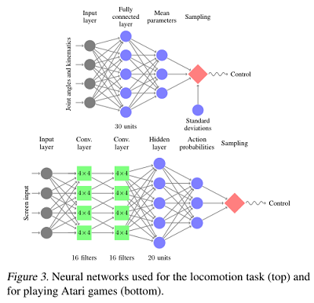

图4为机器人训练的学习曲线，每个算法随机初始化的五次运行平均结果，hopper和walker 的前进速度是-1，说明只学到了站立平衡，没学会如何走路。

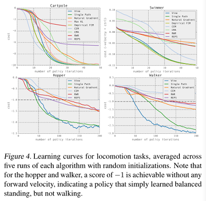

比较的方法：单路径TRPO, vine TRPO, 奖励加权回归(RWR), 类EM的策略搜索方法，相对熵策略搜索(REPS), 交叉熵法(CEM)，无梯度法，协方差矩阵自适应(CMA), 经典自然策略梯度算法(使用固定惩罚系数-拉格朗日乘子)，经验FIM(使用梯度的协方差矩阵), max KL(只适用于cart-pole，使用最大KL散度)。

学习曲线显示了每种算法五次运行的平均成本，如图4所示。单路径和藤蔓TRPO解决了所有问题，得到了最好的解。自然梯度在两个较简单的问题上表现良好，但无法产生向前发展的跳跃和步行步态。这些结果提供了实验证据：与使用固定惩罚相比，约束KL散度是选择步长和取得快速、一致进步的更稳健的方法。CEM和CMA是无导数算法，因此它们的样本复杂度与参数数量成反比，在较大的问题上表现不佳。最大KL方法的学习速度比我们的最终方法要慢一些，因为约束的形式更严格，但总的来说，结果表明平均KL发散度约束与理论证明的最大KL发散度具有类似的效果。

TRPO学习策略的视频链接:http://sites.google.com/ site/trpopaper/。

##### 7.2 从图像中玩游戏

输入：Atari游戏原始图像

学习挑战：学习各种行为，延迟奖励，复杂的行为序列，变化闪烁的背景

做法：和DAN一样对图像预处理，两个卷积层有16个通道，stride为2，一个全连接层有20个单元，33500个参数。

单路径法和vine法结果如表1，还包括一个人类玩家和Deep Q-Learning,蒙特卡洛树搜索与监督训练的组合。

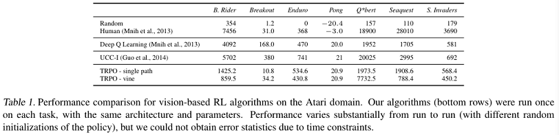

TRPO算法(底部行)在每个任务上运行一次，使用相同的架构和参数。性能在不同的运行之间有很大的差异(策略的随机初始化不同)，但由于时间限制，作者无法获得错误统计数据。

#### 8. 讨论及结论

本文提出并分析了随机控制策略优化的信任域方法。本文证明了TRPO的单调改进性，该算法反复优化策略的预期成本的局部近似，这个策略带有KL散度惩罚。本文表明，在一系列具有挑战性的策略学习任务中，对这个结合了KL散度的方法的近似，取得了良好的实验结果，优于以前的方法。本文的分析也为策略梯度和策略迭代方法的统一提供了一种视角，表明它们是一种算法的特殊极限情况，这种算法可以优化一个服从信任域约束的目标。

在机器人运动领域，本文的算法在Mujoco物理模拟器中利用神经网络和最低信息成本，成功学习了游泳、行走和跳跃的控制。在以往工作中还没有控制器使用通用策略搜索方法和非工程的通用策略表示从头学习这些任务。

在游戏领域，本算法使用卷积神经网络CNN，将原始图像做为输入。这需要优化极高维的策略。以前只有两种方法在此任务中获得成功。

#### 作者对未来的展望

本文的方法可扩展且具有强大的理论基础，作者希望以此为出发点，未来能训练大型的丰富的函数近似器，来解决一系列具有挑战性的问题。结合探索的两个实验的领域交叉，可以使用视觉和原始感官数据做为输入，有可能学习机器人的控制策略，为训练结合感知和控制的机器人控制器提供一个统一方案。可以使用更为复杂的策略，包括带有隐藏状态的循环策略，可以进一步使状态估计和控制在部分可观测的设置中滚动到相同的策略。通过将本文的方法与模型学习相结合，也有可能大幅降低样本复杂度，使其适用于样本珍贵的现实环境。

#### 个人理解

使用值函数解决连续状态空间问题，选择动作的策略通常是不变的确定性策略。有些实际问题需要的最优策略并不是确定性的，而是随机策略，策略梯度就是解决产生随机策略的问题。经典的蒙特卡罗策略梯度方法基于采样的方法，给定策略 $\pi$, 让智能体与环境互动，会得到很多条轨迹，每条轨迹都有对应的回报。将每条轨迹回报进行平均，就可以知道某一个策略下面状态的价值。在PG算法中，因为策略是一个概率，不能直接用来迭代，所以将策略转化为函数形式。使用带有参数 $\theta$ 的函数对策略进行近似，通过更新 $\theta$ 逼近最优策略。本人的研究内容并不是RL算法本身，只是考虑应用策略梯度算法，没有做过相关的项目，因此对本文理解尚浅，欢迎交流讨论。

汪莉娟：天津大学研究生，专业方向为控制科学与工程，主要研究方向为交通优化与智能控制。

