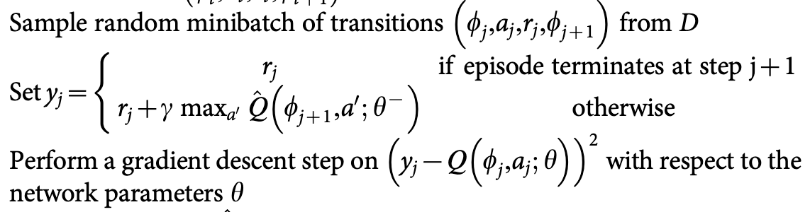

# DQN

## 原理简介

DQN是Q-leanning算法的优化和延伸，Q-leaning中使用有限的Q表存储值的信息，而DQN中则用神经网络替代Q表存储信息，这样更适用于高维的情况，相关知识基础可参考[datawhale李宏毅笔记-Q学习](https://datawhalechina.github.io/easy-rl/#/chapter6/chapter6)。

论文方面主要可以参考两篇，一篇就是2013年谷歌DeepMind团队的[Playing Atari with Deep Reinforcement Learning](https://www.cs.toronto.edu/~vmnih/docs/dqn.pdf)，一篇是也是他们团队后来在Nature杂志上发表的[Human-level control through deep reinforcement learning](https://web.stanford.edu/class/psych209/Readings/MnihEtAlHassibis15NatureControlDeepRL.pdf)。后者在算法层面增加target q-net，也可以叫做Nature DQN。

Nature DQN使用了两个Q网络，一个当前Q网络𝑄用来选择动作，更新模型参数，另一个目标Q网络𝑄′用于计算目标Q值。目标Q网络的网络参数不需要迭代更新，而是每隔一段时间从当前Q网络𝑄复制过来，即延时更新，这样可以减少目标Q值和当前的Q值相关性。

要注意的是，两个Q网络的结构是一模一样的。这样才可以复制网络参数。Nature DQN和[Playing Atari with Deep Reinforcement Learning](https://www.cs.toronto.edu/~vmnih/docs/dqn.pdf)相比，除了用一个新的相同结构的目标Q网络来计算目标Q值以外，其余部分基本是完全相同的。细节也可参考[强化学习（九）Deep Q-Learning进阶之Nature DQN](https://www.cnblogs.com/pinard/p/9756075.html)。

https://blog.csdn.net/JohnJim0/article/details/109557173)

## 伪代码


## 代码实现

### RL接口

首先是强化学习训练的基本接口，即通用的训练模式：
```python
for i_episode in range(MAX_EPISODES):
	state = env.reset() # reset环境状态
	for i_step in range(MAX_STEPS):
    action = agent.choose_action(state) # 根据当前环境state选择action
    next_state, reward, done, _ = env.step(action) # 更新环境参数
    agent.memory.push(state, action, reward, next_state, done) # 将state等这些transition存入memory
    agent.update() # 每步更新网络
    state = next_state # 跳转到下一个状态
    if done:
    	break        
```
每个episode加一个MAX_STEPS，也可以使用while not done, 加这个max_steps有时是因为比如gym环境训练目标就是在200个step下达到200的reward，或者是当完成一个episode的步数较多时也可以设置，基本流程跟所有伪代码一致，如下：
1. agent选择动作
2. 环境根据agent的动作反馈出next_state和reward
3. agent进行更新，如有memory就会将transition(包含state，reward，action等)存入memory中
4. 跳转到下一个状态
5. 如果done了，就跳出循环，进行下一个episode的训练。

想要实现完整的算法还需要创建Qnet，Replaybuffer等类

### 两个Q网络

上文讲了Nature DQN中有两个Q网络，一个是policy_net，一个是延时更新的target_net，两个网络的结构是一模一样的，如下(见```model.py```)，注意DQN使用的Qnet就是全连接网络即FCH：
```python
import torch.nn as nn
import torch.nn.functional as F

class FCN(nn.Module):
    def __init__(self, n_states=4, n_actions=18):
        """ 初始化q网络，为全连接网络
            n_states: 输入的feature即环境的state数目
            n_actions: 输出的action总个数
        """
        super(FCN, self).__init__()
        self.fc1 = nn.Linear(n_states, 128) # 输入层
        self.fc2 = nn.Linear(128, 128) # 隐藏层
        self.fc3 = nn.Linear(128, n_actions) # 输出层
        
    def forward(self, x):
        # 各层对应的激活函数
        x = F.relu(self.fc1(x)) 
        x = F.relu(self.fc2(x))
        return self.fc3(x)
```
输入为n_states，输出为n_actions，包含一个128维度的隐藏层，这里根据需要可增加隐藏层维度和数量，然后一般使用relu激活函数，这里跟深度学习的网路设置是一样的。

### Replay Buffer

然后就是Replay Memory了，其作用主要是是克服经验数据的相关性（correlated data）和非平稳分布（non-stationary distribution）问题，实现如下(见```memory.py```)：

```python
import random
import numpy as np

class ReplayBuffer:
    
    def __init__(self, capacity):
        self.capacity = capacity
        self.buffer = []
        self.position = 0
    
    def push(self, state, action, reward, next_state, done):
        if len(self.buffer) < self.capacity:
            self.buffer.append(None)
        self.buffer[self.position] = (state, action, reward, next_state, done)
        self.position = (self.position + 1) % self.capacity
    
    def sample(self, batch_size):
        batch = random.sample(self.buffer, batch_size)
        state, action, reward, next_state, done =  zip(*batch)
        return state, action, reward, next_state, done
    
    def __len__(self):
        return len(self.buffer)
```

参数capacity表示buffer的容量，主要包括push和sample两个步骤，push是将transitions放到memory中，sample是从memory随机抽取一些transition。

### Agent类

在```agent.py```中我们定义强化学习算法类，包括```choose_action```(选择动作，使用e-greedy策略时会多一个```predict```函数，下面会将到)和```update```(更新)等函数。

在类中建立两个网络，以及optimizer和memory，

```python
self.policy_net = MLP(n_states, n_actions,hidden_dim=cfg.hidden_dim).to(self.device)
self.target_net = MLP(n_states, n_actions,hidden_dim=cfg.hidden_dim).to(self.device)
for target_param, param in zip(self.target_net.parameters(),self.policy_net.parameters()): # copy params from policy net
    target_param.data.copy_(param.data)
self.optimizer = optim.Adam(self.policy_net.parameters(), lr=cfg.lr)
self.memory = ReplayBuffer(cfg.memory_capacity)
```
然后是选择action：

```python
def choose_action(self, state):
        '''选择动作
        '''
    self.frame_idx += 1
    if random.random() > self.epsilon(self.frame_idx):
        action = self.predict(state)
    else:
        action = random.randrange(self.n_actions)
    return action
```

这里使用e-greedy策略，即设置一个参数epsilon，如果生成的随机数大于epsilon，就根据网络预测的选择action，否则还是随机选择action，这个epsilon是会逐渐减小的，可以使用线性或者指数减小的方式，但不会减小到零，这样在训练稳定时还能保持一定的探索，这部分可以学习探索与利用(exploration and exploition)相关知识。

上面讲到的预测函数其实就是根据state选取q值最大的action，如下：

```python
def predict(self,state):
    with torch.no_grad():
        state = torch.tensor([state], device=self.device, dtype=torch.float32)
        q_values = self.policy_net(state)
        action = q_values.max(1)[1].item()
```

然后是更新函数了：

```python
def update(self):

        if len(self.memory) < self.batch_size:
            return
        # 从memory中随机采样transition
        state_batch, action_batch, reward_batch, next_state_batch, done_batch = self.memory.sample(
            self.batch_size)
        '''转为张量
        例如tensor([[-4.5543e-02, -2.3910e-01,  1.8344e-02,  2.3158e-01],...,[-1.8615e-02, -2.3921e-01, -1.1791e-02,  2.3400e-01]])'''
        state_batch = torch.tensor(
            state_batch, device=self.device, dtype=torch.float)
        action_batch = torch.tensor(action_batch, device=self.device).unsqueeze(
            1)  # 例如tensor([[1],...,[0]])
        reward_batch = torch.tensor(
            reward_batch, device=self.device, dtype=torch.float)  # tensor([1., 1.,...,1])
        next_state_batch = torch.tensor(
            next_state_batch, device=self.device, dtype=torch.float)
        done_batch = torch.tensor(np.float32(
            done_batch), device=self.device)

        '''计算当前(s_t,a)对应的Q(s_t, a)'''
        '''torch.gather:对于a=torch.Tensor([[1,2],[3,4]]),那么a.gather(1,torch.Tensor([[0],[1]]))=torch.Tensor([[1],[3]])'''
        q_values = self.policy_net(state_batch).gather(
            dim=1, index=action_batch)  # 等价于self.forward
        # 计算所有next states的V(s_{t+1})，即通过target_net中选取reward最大的对应states
        next_q_values = self.target_net(next_state_batch).max(
            1)[0].detach()  # 比如tensor([ 0.0060, -0.0171,...,])
        # 计算 expected_q_value
        # 对于终止状态，此时done_batch[0]=1, 对应的expected_q_value等于reward
        expected_q_values = reward_batch + \
            self.gamma * next_q_values * (1-done_batch)
        # self.loss = F.smooth_l1_loss(q_values,expected_q_values.unsqueeze(1)) # 计算 Huber loss
        loss = nn.MSELoss()(q_values, expected_q_values.unsqueeze(1))  # 计算 均方误差loss
        # 优化模型
        self.optimizer.zero_grad()  # zero_grad清除上一步所有旧的gradients from the last step
        # loss.backward()使用backpropagation计算loss相对于所有parameters(需要gradients)的微分
        loss.backward()
        # for param in self.policy_net.parameters():  # clip防止梯度爆炸
        #     param.grad.data.clamp_(-1, 1)
        self.optimizer.step()  # 更新模型
```

更新遵循伪代码的以下部分：



首先从replay buffer中选取一个batch的数据，计算loss，然后进行minibatch SGD。

然后是保存与加载模型的部分，如下：

```python
def save(self, path):
        torch.save(self.target_net.state_dict(), path+'dqn_checkpoint.pth')
def load(self, path):
    self.target_net.load_state_dict(torch.load(path+'dqn_checkpoint.pth'))
    for target_param, param in zip(self.target_net.parameters(), self.policy_net.parameters()):
        param.data.copy_(target_param.data)
```


### 实验结果

训练结果如下：


## 参考

[with torch.no_grad()](https://www.jianshu.com/p/1cea017f5d11)

