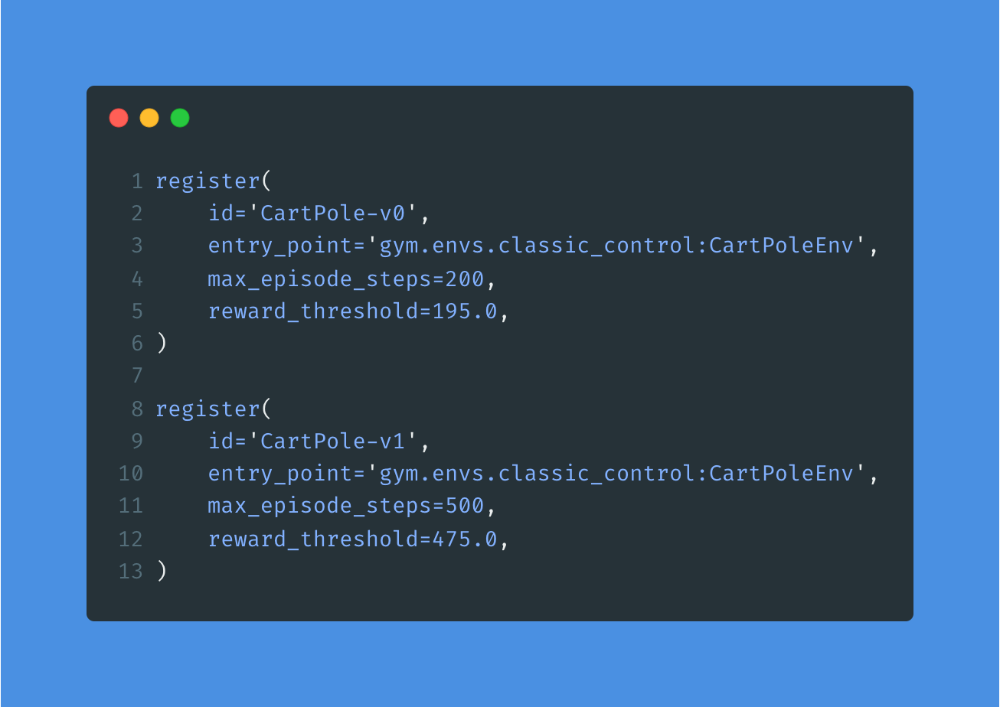
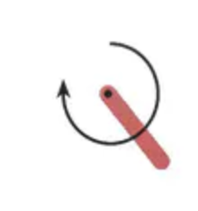
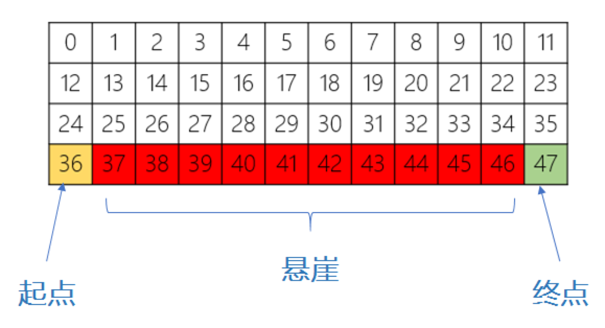
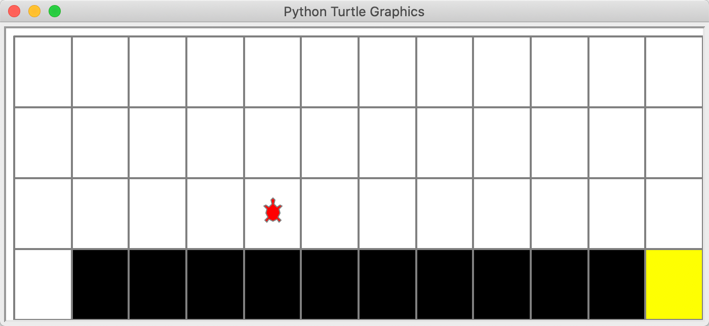

# OpenAi Gym 环境说明
## 基础控制

### [CartPole v0](https://github.com/openai/gym/wiki/CartPole-v0)


通过向左或向右推车能够实现平衡，所以动作空间由两个动作组成。每进行一个step就会给一个reward，如果无法保持平衡那么done等于true，本次episode失败。理想状态下，每个episode至少能进行200个step，也就是说每个episode的reward总和至少为200，step数目至少为200

### CartPole-v1

```CartPole v1```环境其实跟```CartPole v0```是一模一样的，区别在于每回合最大步数（max_episode_steps）以及奖励阈值（reward_threshold），如下是相关源码：  



这里先解释一下奖励阈值（reward_threshold），即Gym设置的一个合格标准，比如对于```CartPole v0```如果算法能够将奖励收敛到195以上，说明该算法合格。但实际上```CartPole v0```的每回合最大步数（max_episode_steps）是200，每步的奖励最大是1，也就是每回合最大奖励是200，比Gym设置的奖励阈值高。笔者猜测这是Gym可能是给算法学习者们设置的一个参考线，而实际中在写算法时并不会用到这个算法阈值，所以可以忽略。

再看每回合最大步数，可以看到```CartPole v1```的步数更长，相应的奖励要求更高，可以理解为```v1```是```v0```的难度升级版。


### [Pendulum-v0](https://github.com/openai/gym/wiki/Pendulum-v0)

注：gym 0.18.0之后版本中Pendulum-v0已经改为Pendulum-v1


钟摆以随机位置开始，目标是将其摆动，使其保持向上直立。动作空间是连续的，值的区间为[-2,2]。每个step给的reward最低为-16.27，最高为0。目前最好的成绩是100个episode的reward之和为-123.11 ± 6.86。

### 

悬崖寻路问题（CliffWalking）是指在一个4 x 12的网格中，智能体以网格的左下角位置为起点，以网格的下角位置为终点，目标是移动智能体到达终点位置，智能体每次可以在上、下、左、右这4个方向中移动一步，每移动一步会得到-1单位的奖励。



如图，红色部分表示悬崖，数字代表智能体能够观测到的位置信息，即observation，总共会有0-47等48个不同的值，智能体再移动中会有以下限制：

* 智能体不能移出网格，如果智能体想执行某个动作移出网格，那么这一步智能体不会移动，但是这个操作依然会得到-1单位的奖励

* 如果智能体“掉入悬崖” ，会立即回到起点位置，并得到-100单位的奖励

* 当智能体移动到终点时，该回合结束，该回合总奖励为各步奖励之和

实际的仿真界面如下：



由于从起点到终点最少需要13步，每步得到-1的reward，因此最佳训练算法下，每个episode下reward总和应该为-13。

## 参考

[Gym环境相关源码](https://github.com/openai/gym/tree/master/gym/envs)