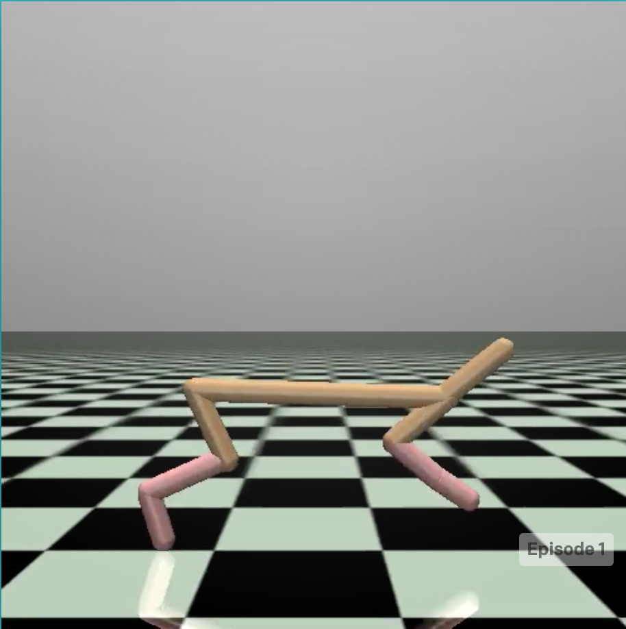
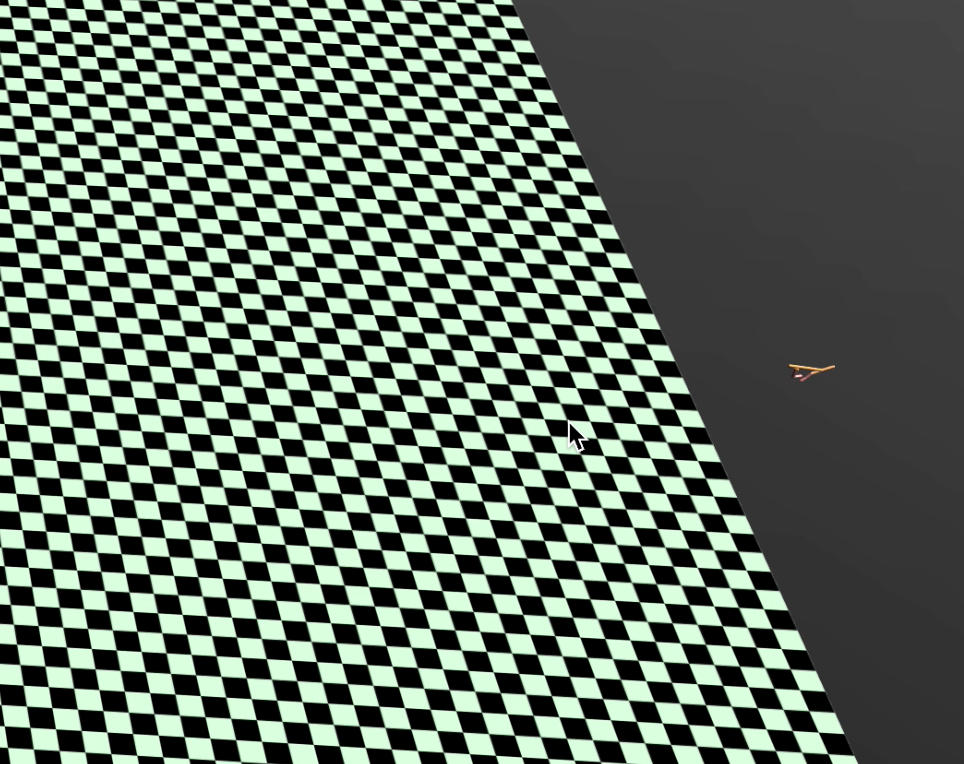

# MuJoCo

MuJoCo（Multi-Joint dynamics with Contact）是一个物理模拟器，可以用于机器人控制优化等研究。安装见[Mac安装MuJoCo以及mujoco_py](https://blog.csdn.net/JohnJim0/article/details/115656392?spm=1001.2014.3001.5501)


## HalfCheetah-v2


该环境基于mujoco仿真引擎，该环境的目的是使一只两只脚的“猎豹”跑得越快越好(下面图谷歌HalfCheetah-v2的，https://gym.openai.com/envs/HalfCheetah-v2/)。



动作空间：Box(6,)，一只脚需要控制三个关节一共6个关节，每个关节的运动范围为[-1, 1]。

状态空间：Box(17, )，包含各种状态，每个值的范围为，主要描述“猎豹”本身的姿态等信息。

回报定义：每一步的回报与这一步的中猎豹的速度和猎豹行动的消耗有关，定义回报的代码如下。

```python
def step(self, action):
    xposbefore = self.sim.data.qpos[0]
    self.do_simulation(action, self.frame_skip)
    xposafter = self.sim.data.qpos[0]
    ob = self._get_obs()
    reward_ctrl = - 0.1 * np.square(action).sum()
    reward_run = (xposafter - xposbefore)/self.dt
    # =========== reward ===========
    reward = reward_ctrl + reward_run
    # =========== reward ===========
    done = False
    return ob, reward, done, dict(reward_run=reward_run, reward_ctrl=reward_ctrl)
```

当猎豹无法控制平衡而倒下时，一个回合(episode)结束。

但是这个环境有一些问题，目前经过搜索并不知道一个回合的reward上限，实验中训练好的episode能跑出平台之外：



加上时间有限，所以训练中reward一直处于一个平缓上升的状态，本人猜测这可能是gym的一个bug。